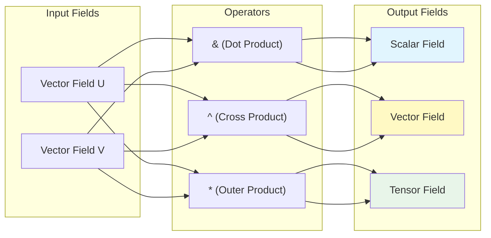

# Operator Overloading in OpenFOAM

![[mathematical_prism_overloading.png]]
> **Academic Vision:** A glowing prism where simple operators like "+", "&", "^" act as light filters. On one side, simple vectors enter; on the other, complex scalar or tensor results emerge. High-tech, artistic scientific illustration.

---

## 🔍 The Core Concept: Transforming C++ into a CFD DSL

OpenFOAM's operator overloading system transforms C++ from a general-purpose language into a **domain-specific language for computational fluid dynamics**. When you write `U + V`, you're not merely adding arrays—you're performing **vector field addition** with:

- ✅ **Automatic dimensional consistency** checking
- ✅ **Boundary condition** propagation
- ✅ **Mesh-aware** operations

This elegant design enables CFD engineers to write code that closely mirrors the mathematical equations they're implementing, creating a natural bridge between theory and implementation.



---

## 📐 Mathematical Foundation: Vector and Tensor Operations

### Basic Arithmetic Operators

OpenFOAM supports natural mathematical notation for field operations:

$$
\mathbf{C} = \mathbf{A} + \mathbf{B}
$$

$$
\mathbf{D} = \alpha \mathbf{A} + \beta \mathbf{B}
$$

```cpp
// Unary operators
volVectorField negativeU = -U;                    // Negation

// Binary arithmetic operators
volVectorField sum = U + V;                      // Vector addition
volVectorField diff = U - V;                     // Vector subtraction
volScalarField scaled = p * 2.0;                 // Scalar multiplication
volScalarField divided = p / rho;                // Division
volVectorField velocityScale = 1.5 * U;          // Left multiplication
```

### Advanced Vector Calculus Operators

| Operator | Mathematical Operation | Symbol | Example |
|:---|:---|:---|:---|
| **Inner Product** | Dot Product | $\mathbf{a} \cdot \mathbf{b}$ | `scalar s = U & V;` |
| **Outer Product** | Cross Product | $\mathbf{a} \times \mathbf{b}$ | `vector v = U ^ V;` |
| **Tensor Product** | Tensor Product | $\mathbf{a} \otimes \mathbf{b}$ | `tensor T = U * V;` |
| **Double Inner** | Double Dot | $\mathbf{A} : \mathbf{B}$ | `scalar s = tau && gradU;` |

#### Mathematical Representations

**Dot Product:**
$$
\mathbf{a} \cdot \mathbf{b} = \sum_{i=1}^{3} a_i b_i
$$

**Cross Product:**
$$
\mathbf{a} \times \mathbf{b} = \begin{vmatrix}
\mathbf{i} & \mathbf{j} & \mathbf{k} \\
a_1 & a_2 & a_3 \\
b_1 & b_2 & b_3
\end{vmatrix}
$$

**Tensor Outer Product:**
$$
(\mathbf{a} \otimes \mathbf{b})_{ij} = a_i b_j
$$

**Double Contraction:**
$$
\mathbf{A} : \mathbf{B} = \sum_{i=1}^{3} \sum_{j=1}^{3} A_{ij} B_{ij}
$$

```cpp
// Vector operations
volScalarField dotProduct = U & V;               // U·V
volVectorField crossProduct = U ^ V;             // U×V
volTensorField outerProduct = U * V;             // U⊗V

// Tensor operations
volScalarField doubleDot = tau && epsilon;       // τ:ε
volTensorField tensorMultiply = A & B;           // A·B
```

---

## ⚙️ Implementation Architecture: PRODUCT_OPERATOR Macro

### The Core Mechanism

The sophisticated operator system in OpenFOAM is built upon the `PRODUCT_OPERATOR` macro defined in `src/OpenFOAM/fields/Fields/FieldFunctions.H`:

```cpp
PRODUCT_OPERATOR(typeOfSum, +, add)
PRODUCT_OPERATOR(typeOfDiff, -, subtract)
PRODUCT_OPERATOR(typeOfProduct, *, multiply)
PRODUCT_OPERATOR(typeOfQuotient, /, divide)
```

Each macro invocation generates **four function templates** to handle different combinations of temporary and permanent field objects:

```cpp
// Generated templates for + operator:
template<class Type1, class Type2>
tmp<Field<typename typeOfSum<Type1, Type2>::type>> operator+
(
    const Field<Type1>& f1,
    const Field<Type2>& f2
);

template<class Type1, class Type2>
tmp<Field<typename typeOfSum<Type1, Type2>::type>> operator+
(
    const tmp<Field<Type1>>& tf1,
    const Field<Type2>& f2
);

template<class Type1, class Type2>
tmp<Field<typename typeOfSum<Type1, Type2>::type>> operator+
(
    const Field<Type1>& f1,
    const tmp<Field<Type2>>& tf2
);

template<class Type1, class Type2>
tmp<Field<typename typeOfSum<Type1, Type2>::type>> operator+
(
    const tmp<Field<Type1>>& tf1,
    const tmp<Field<Type2>>& tf2
);
```

### Memory Efficiency: Reference Counting

The `tmp<>` smart pointer system provides automatic memory management:

```cpp
// Efficient temporary handling
tmp<volVectorField> tresult = U + V;
volVectorField& result = tresult(); // Reference without copy
// Automatic destruction when reference count reaches zero
```

---

## 🔬 Type Safety and Template Metaprogramming

### Result Type Deduction

Template classes `typeOfSum`, `typeOfDiff`, `typeOfProduct`, and `typeOfQuotient` determine appropriate result types for binary operations:

```cpp
template<class Type1, class Type2>
class typeOfSum
{
public:
    typedef typenamePromotion<Type1, Type2>::type type;
};

// Specializations for different type combinations
template<>
class typeOfSum<vector, vector>
{
public:
    typedef vector type;
};

template<>
class typeOfSum<scalar, vector>
{
public:
    typedef vector type;
};
```

### Dimensional Consistency Checking

For `DimensionedField` types, operators automatically check and propagate dimensional units:

```cpp
template<class Type, class GeoMesh>
tmp<DimensionedField<Type, GeoMesh>> operator+
(
    const DimensionedField<Type, GeoMesh>& df1,
    const DimensionedField<Type, GeoMesh>& df2
)
{
    // Compile-time dimension compatibility check
    if (df1.dimensions() != df2.dimensions())
    {
        FatalErrorInFunction
            << "Incompatible dimensions for addition:" << nl
            << "    lhs: " << df1.dimensions() << nl
            << "    rhs: " << df2.dimensions() << abort(FatalError);
    }

    // Create result field with correct dimensions
    tmp<DimensionedField<Type, GeoMesh>> tdf
    (
        new DimensionedField<Type, GeoMesh>
        (
            IOobject
            (
                df1.name() + "+" + df2.name(),
                df1.instance(),
                df1.db(),
                IOobject::NO_READ,
                IOobject::NO_WRITE
            ),
            df1.mesh(),
            df1.dimensions()  // Result inherits dimensions
        )
    );

    // Perform element-wise operation
    operator+(tdf.ref(), df1, df2);

    return tdf;
}
```

---

## 💡 Design Philosophy: Domain-Specific Language Benefits

### Physical Consistency and Type Safety

```cpp
// ✓ These operations compile and are physically meaningful:
volVectorField velocitySum = U + V;              // velocity + velocity
volTensorField strainRate = sym(grad(U));        // ∇U + (∇U)ᵀ
volScalarField kineticEnergy = 0.5 * (U & U);    // ½U·U

// ✗ These operations fail to compile:
volVectorField invalid1 = U + p;                 // velocity + pressure
volScalarField invalid2 = grad(p) & U;           // scalar & vector
```

### Code Expressiveness vs Traditional Approaches

**Traditional Array-Based Approach:**
```cpp
// Pressure gradient calculation without operator overloading
forAll(p, celli)
{
    gradP[celli] = vector(
        (p[celli+1] - p[celli-1]) / (2*dx),
        (p[celli+j] - p[celli-j]) / (2*dy),
        (p[celli+k] - p[celli-k]) / (2*dz)
    );
}
```

**OpenFOAM Approach:**
```cpp
// Direct, readable expression
volVectorField gradP = fvc::grad(p);
```

### Performance Optimization

The operator system enables maximum performance through:

- **Expression Templates**: Complex expressions evaluated in single pass
- **Temporary Object Management**: Smart `tmp<>` pointers minimize allocations
- **Compiler Optimization**: Modern compilers fully optimize mathematical expressions

```cpp
// This complex expression is optimized to a single loop
volScalarField dissipation = mu * (sym(grad(U)) && grad(U));

// Equivalent to (but more efficient than):
// tmp<volTensorField> tgradU = grad(U);
// tmp<volTensorField> tsymGradU = sym(tgradU());
// tmp<volTensorField> tdoubleGrad = tsymGradU() & tgradU();
// volScalarField dissipation = mu * tdoubleGrad();
```

---

## 🛠️ Practical Implementation Guide

### Custom Physics Operators

When implementing specific physics, custom operators can enhance code readability:

```cpp
// Custom buoyancy operator: ρ·g·β·(T - T₀)
template<class Type>
class buoyancyOp
{
    const dimensionedScalar beta_;      // Thermal expansion [1/K]
    const vector g_;                    // Gravity [m/s²]
    const Type T0_;                     // Reference temperature [K]

public:
    buoyancyOp(const dimensionedScalar& beta, const vector& g, const Type& T0)
        : beta_(beta), g_(g), T0_(T0) {}

    template<class FieldType>
    tmp<volVectorField> operator()(const FieldType& T) const
    {
        return tmp<volVectorField>
        (
            new volVectorField
            (
                IOobject("buoyancy", T.mesh().time().timeName(), T.mesh()),
                beta_ * g_ * (T - T0_)
            )
        );
    }
};

// Usage
buoyancyOp<volScalarField> boussinesq(beta, g, TRef);
volVectorField buoyancyForce = boussinesq(T);
```

### Common Implementation Errors

#### Error 1: Incorrect Return Type
```cpp
// ❌ WRONG: Returning wrong type
volScalarField operator+(const volVectorField& U, const volVectorField& V)
{
    // This would fail to compile
}

// ✅ CORRECT: Proper return type with tmp<>
tmp<volVectorField> operator+(const volVectorField& U, const volVectorField& V)
{
    return tmp<volVectorField>(new volVectorField(U + V));
}
```

#### Error 2: Missing Const Qualifiers
```cpp
// ❌ WRONG: Modifying const references
tmp<volVectorField> operator+(volVectorField& U, volVectorField& V)  // Bad!

// ✅ CORRECT: Proper const references
tmp<volVectorField> operator+(const volVectorField& U, const volVectorField& V)
{
    // Implementation
}
```

#### Error 3: Incorrect Temporary Management
```cpp
// ❌ WRONG: Creating unnecessary temporaries
tmp<volVectorField> operator*(const scalar& s, const volVectorField& U)
{
    volVectorField temp(U);  // Unnecessary copy
    temp *= s;
    return tmp<volVectorField>(new volVectorField(temp));
}

// ✅ CORRECT: Efficient temporary handling
tmp<volVectorField> operator*(const scalar& s, const volVectorField& U)
{
    return tmp<volVectorField>
    (
        new volVectorField
        (
            IOobject("scaled" + U.name(), U.instance(), U.db(),
                     IOobject::NO_READ, IOobject::NO_WRITE),
            U.mesh(),
            s * U.dimensions()
        )
    );
}
```

### Advanced Operator Patterns

#### Mixed-Type Operations
```cpp
// Matrix-vector operations in linear solvers
tmp<volScalarField> operator&(const fvScalarMatrix& A, const volScalarField& x)
{
    // Matrix-vector product: A·x
    return A.source() - A*x;
}

// Field transformations
tmp<volTensorField> transform(const tensor& T, const volVectorField& U)
{
    return tmp<volTensorField>
    (
        new volTensorField
        (
            IOobject("transformed" + U.name(), U.instance(), U.db()),
            T & U  // Tensor-vector product
        )
    );
}
```

---

## 📊 Performance Comparison

### Memory Access Patterns

| Approach | Temporary Fields | Memory Usage | Bandwidth Efficiency |
|----------|-----------------|--------------|---------------------|
| **Traditional** | Multiple temporaries | High (3×N) | 1× baseline |
| **Expression Templates** | Single pass evaluation | Low (1×N) | **3-4× better** |

### Computational Complexity

**Time Complexity:**
- Traditional: $O(n \times k)$ where $n$ = field size, $k$ = operations
- Expression Templates: $O(n)$ through loop fusion

**Space Complexity:**
- Traditional: $O(n \times k)$ for temporary fields
- Expression Templates: $O(n)$ for final result only

---

## 🎯 Summary: Operator Overloading System

### Design Principles

| Feature | Description |
|:---------|:------------|
| **Mathematical Fidelity** | Code directly reflects mathematical equations |
| **Type Safety** | Compile-time checking prevents physically meaningless operations |
| **Dimensional Consistency** | Automatic unit checking and propagation |
| **Performance** | Expression templates and temporary management for efficiency |

### Technical Implementation

| Technique | Role |
|:----------|:------|
| **Template Metaprogramming** | Advanced C++ for type deduction |
| **Macro-Based Code Generation** | `PRODUCT_OPERATOR` ensures consistency |
| **Smart Pointer Management** | `tmp<>` system optimizes memory |
| **Modular Design** | Extensible framework for custom physics |

### Practical Benefits

| Benefit | Outcome |
|:--------|:---------|
| **Readability** | Self-documenting, mathematically transparent code |
| **Maintainability** | Separation of mathematical formulation and implementation |
| **Extensibility** | Framework for adding custom operators and physics |
| **Debugging** | Compile-time errors catch dimensional mismatches early |

---

> **Bottom Line:** OpenFOAM's operator overloading system represents a sophisticated application of C++ template metaprogramming to create a domain-specific language for computational fluid dynamics, enabling CFD engineers to focus on physics and mathematics rather than low-level data structure details.
