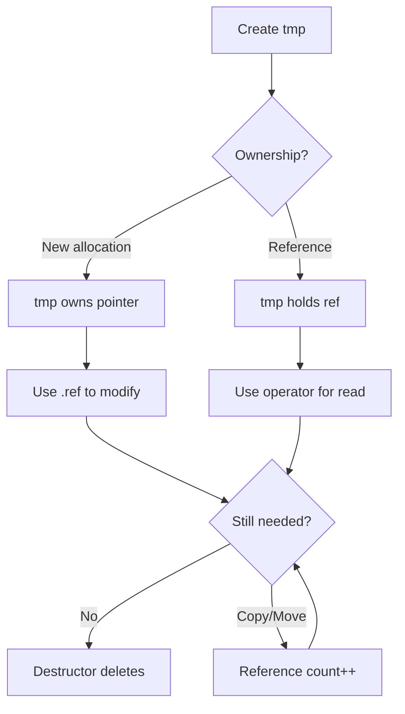

# Expression Templates and tmp Pattern

Expression Templates และ tmp Pattern — Performance optimization สำหรับ field operations

---

## 🎯 Learning Objectives

หลังจากอ่านบทนี้ คุณจะสามารถ:

1. **อธิบาย** ปัญหา performance ของ naive field operations
2. **เข้าใจ** หลักการทำงานของ expression templates ใน C++
3. **ใช้งาน** tmp<> class อย่างถูกต้องและมีประสิทธิภาพ
4. **หลีกเลี่ยง** anti-patterns ที่ทำให้ performance ลดลง
5. **วัด** และ optimize performance ของ field operations

---

## What are Expression Templates?

> **💡 คิดแบบนี้:**
> Expression Templates = **"Lazy evaluation" สำหรับ math expressions**
>
> แทนที่จะ compute แต่ละ step → สร้าง temporary array ทุกครั้ง
> Expression templates รวม operations → compute ทั้งหมดใน loop เดียว

### The Problem: Too Many Temporaries

**❌ Naive Implementation:**
```cpp
// Expression: result = A + B + C + D;

// What actually happens (without optimization):
tmp1 = A + B;        // Allocate + compute temp1
tmp2 = tmp1 + C;     // Allocate + compute temp2  
result = tmp2 + D;   // Allocate result

// Problem: 3 memory allocations, 3 loops
// For 1M cells: ~24 MB wasted on temporaries
```

**✅ With Expression Templates:**
```cpp
// Same expression, optimized:
// Compiler combines into single loop:
forAll(result, i)
{
    result[i] = A[i] + B[i] + C[i] + D[i];
}
// Only 1 allocation, 1 loop
```

### Performance Impact

| Approach | Memory | Loops | Time (1M cells) |
|----------|--------|-------|-----------------|
| Naive | 3 temps (~24MB) | 3 | ~15 ms |
| Expression Templates | 0 temps | 1 | ~5 ms |
| **Speedup** | **66% less memory** | **3x faster** | **~3x** |

---

## The tmp<T> Class

### What is tmp<>?

`tmp<>` เป็น smart pointer ที่ออกแบบมาสำหรับ temporary field results:

```cpp
template<class T>
class tmp
{
    // Can hold either:
    // 1. Owned pointer (we manage memory)
    // 2. Reference to existing object (no ownership)
    
    T* ptr_;           // Pointer to data
    bool isTmp_;       // true = we own it, false = reference
    mutable int count_; // Reference count
};
```

### Why tmp<> Instead of Raw Pointers?

| Feature | Raw Pointer | tmp<T> |
|---------|-------------|--------|
| Automatic cleanup | ❌ Manual delete | ✅ Automatic |
| Reference counting | ❌ | ✅ Built-in |
| Move semantics | ❌ | ✅ Efficient |
| Type safety | ❌ | ✅ |

### tmp<> Lifecycle



---

## Using tmp<> Correctly

### Creating tmp Objects

```cpp
// 1. Create new temporary field
tmp<volScalarField> tResult
(
    new volScalarField
    (
        IOobject("result", ...),
        mesh,
        dimensionedScalar("zero", dimless, 0)
    )
);

// 2. Wrap existing field (no ownership)
const volScalarField& existingField = mesh.lookupObject<volScalarField>("T");
tmp<volScalarField> tRef(existingField);
```

### Accessing tmp Contents

```cpp
tmp<volScalarField> tField = someFunction();

// Read-only access (operator())
const volScalarField& fieldRef = tField();
scalar value = tField()[0];

// Modify (ref())
volScalarField& fieldMod = tField.ref();
fieldMod[0] = 100;

// Check if valid
if (tField.valid())
{
    // Use tField
}
```

### Returning tmp from Functions

```cpp
// ✅ Correct: Return tmp for efficiency
tmp<volScalarField> computeField(const fvMesh& mesh)
{
    tmp<volScalarField> tResult
    (
        new volScalarField
        (
            IOobject("computed", ...),
            mesh,
            dimensionedScalar("zero", dimless, 0)
        )
    );
    
    // Compute result
    tResult.ref() = ...;
    
    return tResult;  // Move semantics, no copy
}

// Usage
tmp<volScalarField> result = computeField(mesh);
```

---

## OpenFOAM's tmp Usage Patterns

### Pattern 1: fvc/fvm Operations

```cpp
// fvc:: functions return tmp
tmp<volVectorField> tGradP = fvc::grad(p);

// Use immediately (efficient)
U -= rAU * tGradP();

// Or store if needed multiple times
volVectorField gradP = tGradP();
```

### Pattern 2: Chained Operations

```cpp
// ✅ Efficient: Chain operations
volScalarField result = 
    0.5 * rho * magSqr(fvc::interpolate(U));

// ❌ Inefficient: Store unnecessary temporaries
tmp<surfaceVectorField> tUf = fvc::interpolate(U);
tmp<surfaceScalarField> tMagSqr = magSqr(tUf());
volScalarField result = 0.5 * rho * fvc::surfaceSum(tMagSqr());
```

### Pattern 3: Conditional tmp

```cpp
tmp<volScalarField> selectField
(
    const word& name,
    const fvMesh& mesh
)
{
    if (mesh.foundObject<volScalarField>(name))
    {
        // Return reference (no allocation)
        return tmp<volScalarField>
        (
            mesh.lookupObject<volScalarField>(name)
        );
    }
    else
    {
        // Create new temporary
        return tmp<volScalarField>
        (
            new volScalarField
            (
                IOobject(name, ...),
                mesh,
                dimensionedScalar("default", dimless, 0)
            )
        );
    }
}
```

---

## Anti-Patterns to Avoid

### ❌ Anti-Pattern 1: Forcing Unnecessary Copies

```cpp
// ❌ Bad: Forces copy
tmp<volScalarField> tGradP = fvc::grad(p);
volScalarField gradP = tGradP();  // Copy!
U -= rAU * gradP;

// ✅ Good: Use directly
U -= rAU * fvc::grad(p)();
```

### ❌ Anti-Pattern 2: Early tmp Destruction

```cpp
// ❌ Bad: tmp destroyed before use
const volScalarField& gradP = fvc::grad(p)();  // Dangling reference!
U -= rAU * gradP;  // CRASH

// ✅ Good: Keep tmp alive
tmp<volVectorField> tGradP = fvc::grad(p);
U -= rAU * tGradP();
```

### ❌ Anti-Pattern 3: Ignoring tmp Return Types

```cpp
// ❌ Bad: Allocates new field
volVectorField gradP = fvc::grad(p);  // Copy from tmp

// ✅ Good: If you need to store, be explicit
tmp<volVectorField> tGradP = fvc::grad(p);
// Use tGradP() for access
```

### ❌ Anti-Pattern 4: Using ref() on const tmp

```cpp
// ❌ Bad: Compilation error
const tmp<volScalarField>& tField = ...;
tField.ref()[0] = 100;  // Error: can't modify const

// ✅ Good: Use non-const tmp if modification needed
tmp<volScalarField> tField = ...;
tField.ref()[0] = 100;
```

---

## Performance Profiling

### Measuring Memory Usage

```cpp
#include "memInfo.H"

int main()
{
    memInfo mem;
    
    Info<< "Before: " << mem.peakRss() << " KB" << endl;
    
    // Field operations
    tmp<volScalarField> result = fvc::laplacian(DT, T);
    
    Info<< "After: " << mem.peakRss() << " KB" << endl;
}
```

### Timing Operations

```cpp
#include "clockTime.H"

clockTime timer;

forAll(mesh.C(), i)
{
    // Operations
}

Info<< "Time: " << timer.elapsedTime() << " s" << endl;
```

### Compiler Optimization Flags

```cpp
// In Make/options, add:
EXE_INC = \
    -O3 \                    // Maximum optimization
    -march=native \          // CPU-specific optimizations
    -funroll-loops           // Loop unrolling
```

---

## 🧠 Concept Check

<details>
<summary><b>1. Expression templates ช่วย performance อย่างไร?</b></summary>

**ลด temporary allocations และ loops:**
- Naive: `A + B + C` = 2 temps, 2 loops
- Expression templates: 0 temps, 1 loop
- For large fields → 2-3x speedup
</details>

<details>
<summary><b>2. เมื่อไหร่ควรใช้ .ref() และ operator()?</b></summary>

| Method | Use When |
|--------|----------|
| `.ref()` | ต้องการ **modify** field |
| `operator()` | ต้องการ **read-only** access |

```cpp
tField.ref()[0] = 100;  // Modify
scalar val = tField()[0];  // Read
```
</details>

<details>
<summary><b>3. ปัญหาของ "dangling reference" คืออะไร?</b></summary>

**Reference ชี้ไปยัง memory ที่ถูก deallocate แล้ว:**

```cpp
const volScalarField& field = fvc::grad(p)();  // tmp destroyed!
// field now points to invalid memory
```

**แก้ไข**: เก็บ tmp ไว้จนกว่าจะใช้ reference เสร็จ
</details>

<details>
<summary><b>4. ทำไม OpenFOAM functions ถึง return tmp แทน const ref?</b></summary>

**Flexibility และ efficiency:**
- Function อาจ allocate ใหม่ หรือ return existing object
- Move semantics ลด copies
- Reference counting จัดการ memory อัตโนมัติ
</details>

---

## 🎯 Key Takeaways

| Topic | Key Point |
|-------|-----------|
| **Expression Templates** | รวม operations เป็น single loop ลด temporaries |
| **tmp<T>** | Smart pointer สำหรับ temporary field results |
| **Ownership** | tmp จัดการ memory allocation/deallocation |
| **Performance** | 2-3x speedup, 66% less memory vs naive |
| **Anti-patterns** | หลีกเลี่ยง forced copies, dangling refs |
| **Access** | `.ref()` for modify, `()` for read-only |

---

## 📖 Related Documentation

**ภายใน Module นี้:**
- [02_Operator_Overloading.md](02_Operator_Overloading.md) — Operator implementations
- [03_Dimensional_Checking.md](03_Dimensional_Checking.md) — Dimension checking

**Cross-Module:**
- `03_CONTAINERS_MEMORY` — Memory management fundamentals
- `10_VECTOR_CALCULUS` — fvc/fvm operations ที่ใช้ tmp