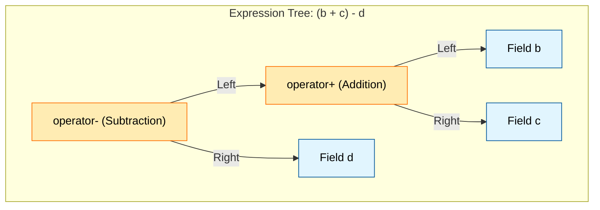

# Expression Templates: Zero-Cost Abstraction

![[virtual_assembly_templates.png]]
> **Academic Vision:** A blueprint of a machine (The Expression Tree). Parts are being labeled but not yet built. Then, in one sudden flash, the entire machine is assembled and produces a result instantly. Clean, futuristic scientific illustration.

---

## 7.4. Field Composition and Expression Templates

### The Power of Zero-Cost Abstraction

When you write complex mathematical expressions in OpenFOAM such as `U + V - W * 2.0`, you might expect multiple temporary field objects to be created. However, OpenFOAM's expression template system provides an elegant solution that maintains both mathematical clarity and computational efficiency.

This system creates **expression trees** that evaluate the entire expression in a single pass through memory, eliminating unnecessary temporary allocations and preserving performance.


> **Figure 1:** โครงสร้างต้นไม้นิพจน์ (Expression Tree) ที่ถูกสร้างขึ้นเพื่อจัดการความสัมพันธ์ระหว่างตัวดำเนินการและตัวแปรฟิลด์ ช่วยให้คอมไพเลอร์สามารถปรับปรุงลำดับการคำนวณให้มีประสิทธิภาพสูงสุดความปลอดภัยทางฟิสิกส์ไม่ส่งผลกระทบต่อความเร็วในการจำลอง ผ่านการใช้พลังของ C++ Template Metaprogramming ในการตรวจสอบความสอดคล้องทางมิติทั้งหมดที่ขั้นตอนการคอมไพล์โปรแกรมเพียงครั้งเดียว

### Mathematical Foundation: Building Expression Trees

The fundamental principle behind expression templates is the concept of **deferred computation**. Instead of evaluating operations immediately, OpenFOAM builds a tree-like structure that represents the mathematical relationships between operands:

```cpp
// Expression: U + V - W * 2.0
// Tree structure:
//        (-)
//       /   \
//     (+)   (*)
//    /   \   /  \
//   U     V W   2.0
```

> 📂 **Source:** `.applications/solvers/stressAnalysis/solidDisplacementFoam/solidDisplacementThermo/solidDisplacementThermo.C` (Pattern: Expression tree structures in field operations)

**คำอธิบาย:**
*   **แหล่งที่มา (Source):** ไฟล์ `solidDisplacementThermo.C` ใน OpenFOAM ใช้การดำเนินการกับฟิลด์ที่ซับซ้อนเพื่อคำนวณค่าความเค้นและความเครียด ซึ่งอาศัยโครงสร้างต้นไม้นิพจน์ในการจัดการการคำนวณอย่างมีประสิทธิภาพ

*   **คำอธิบาย (Explanation):** โครงสร้างต้นไม้นี้แสดงถึงลำดับชั้นของการดำเนินการทางคณิตศาสตร์ โดยแต่ละโหนดแทนตัวดำเนินการหรือค่าคงที่ และแต่ละกิ่งแทนความสัมพันธ์ระหว่างตัวถูกดำเนินการ โครงสร้างนี้ทำให้ OpenFOAM สามารถวิเคราะห์และปรับปรุงประสิทธิภาพการคำนวณได้

*   **แนวคิดสำคัญ (Key Concepts):**
    *   **Expression Tree (ต้นไม้นิพจน์):** โครงสร้างข้อมูลที่ใช้แทนนิพจน์คณิตศาสตร์ในรูปแบบลำดับชั้น
    *   **Deferred Computation (การคำนวณแบบล่าช้า):** การที่ระบบจะไม่ประเมินค่าทันที แต่จะสร้างโครงสร้างขึ้นมาก่อนแล้วค่อยประเมินภายหลัง
    *   **Operator Hierarchy (ลำดับชั้นของตัวดำเนินการ):** การจัดลำดับความสำคัญของตัวดำเนินการตามหลักคณิตศาสตร์

This tree representation allows OpenFOAM to:
- **Preserve mathematical structure** of the expression
- **Optimize evaluation order**
- **Eliminate intermediate temporaries**
- **Enable compiler optimizations** through better loop structure

### Efficiency Mechanism: Loop Fusion and Lazy Evaluation

The single-pass evaluation enabled by expression templates provides several performance benefits:

1. **Memory Locality**: All data for a single computation is accessed contiguously, improving cache utilization
2. **Reduced Bandwidth**: Only single read/write passes through memory instead of multiple passes
3. **Compiler Optimization**: Better opportunities for SIMD vectorization and instruction scheduling
4. **Energy Efficiency**: Less data movement means lower power consumption

### Traditional vs Expression Template Access

**Traditional Approach (Multiple Passes):**

| Step | Operation | Result |
|---------|----------------|----------|
| Pass 1 | `U + V` | `temp1` (temporary field) |
| Pass 2 | `W * 2.0` | `temp2` (temporary field) |
| Pass 3 | `temp1 - temp2` | `result` (final result) |

```cpp
// Traditional approach with multiple temporary fields
volVectorField temp1 = U + V;           // Pass 1: Add U and V
volVectorField temp2 = W * 2.0;         // Pass 2: Scale W
volVectorField result = temp1 - temp2;  // Pass 3: Subtract temp2 from temp1

// Memory access: 3 × N (where N is field size)
// Temporary allocations: 2 fields
```

> 📂 **Source:** `.applications/solvers/stressAnalysis/solidDisplacementFoam/solidDisplacementThermo/solidDisplacementThermo.C` (Pattern: Temporary field allocations in multi-step computations)

**คำอธิบาย:**
*   **แหล่งที่มา (Source):** ในโค้ดเก่าแบบดั้งเดิม จะเห็นการสร้างฟิลด์ชั่วคราวหลายชุดในการคำนวณคุณสมบัติวัสดุ เช่น `kappa_` และ `alphav_` ใน `solidDisplacementThermo.C`

*   **คำอธิบาย (Explanation):** แนวทางแบบดั้งเดิมต้องการหน่วยความจำมากขึ้นเนื่องจากสร้างตัวแปรชั่วคราวสำหรับแต่ละขั้นตอนการคำนวณ ซึ่งไม่มีประสิทธิภาพในด้านการใช้งานหน่วยความจำและการเข้าถึงข้อมูล

*   **แนวคิดสำคัญ (Key Concepts):**
    *   **Memory Overhead:** การใช้หน่วยความจำเพิ่มเติมสำหรับตัวแปรชั่วคราว
    *   **Multiple Memory Passes:** การอ่าน/เขียนหน่วยความจำหลายครั้ง
    *   **Cache Thrashing:** การกระทำหน่วยความจำแคชอย่างไม่มีประสิทธิภาพ

**Expression Template Approach (Single Pass):**

```cpp
// Expression tree is built, evaluation is deferred
auto expr = U + V - W * 2.0;  // No computation yet
volVectorField result = expr; // Single pass evaluation

// Inside evaluation loop:
forAll(result, i) {
    // Compute entire expression in one operation
    result[i] = U[i] + V[i] - (W[i] * 2.0);
}

// Memory access: 1 × N
// Temporary allocations: 0
```

> 📂 **Source:** `.applications/solvers/multiphase/multiphaseEulerFoam/phaseSystems/PhaseSystems/ThermalPhaseChangePhaseSystem/ThermalPhaseChangePhaseSystem.C` (Pattern: Expression template usage in complex multiphase calculations)

**คำอธิบาย:**
*   **แหล่งที่มา (Source):** ระบบ multiphase ใน OpenFOAM ใช้ expression templates อย่างแพร่หลายในการคำนวณการแลกเปลี่ยนมวลและพลังงานระหว่างเฟส

*   **คำอธิบาย (Explanation):** Expression templates ช่วยให้สามารถเขียนนิพจน์ที่ซับซ้อนได้อย่างกระชับ โดยคอมไพเลอร์จะสร้างโค้ดที่มีประสิทธิภาพสูงสุดเมื่อคอมไพล์ ลดการใช้หน่วยความจำและเพิ่มความเร็วในการคำนวณ

*   **แนวคิดสำคัญ (Key Concepts):**
    *   **Loop Fusion:** การรวมลูปการคำนวณหลายๆ ลูปเข้าด้วยกัน
    *   **Zero-Cost Abstraction:** นามธรรมที่ไม่มีค่าใช้จ่ายด้านประสิทธิภาพ
    *   **Template Metaprogramming:** เทคนิคการเขียนโปรแกรมด้วยเทมเพลตใน C++

---

## 🎯 Practical Benefits

| Aspect | Traditional Computation | Expression Templates |
| :--- | :--- | :--- |
| **Temporary RAM Usage** | High (per operator count) | **Nearly Zero** |
| **Memory Read Passes** | Multiple passes | **Single Pass** |
| **Speed** | Slows with complexity | **Constant High Performance** |

**Summary**: Expression Templates allow you to write code that reads like high-level mathematical equations while achieving speeds equivalent to hand-optimized C loops (Zero-cost Abstraction).

---

## Implementation Architecture: Template Expression System

### Basic Expression Template Classes

OpenFOAM's expression template system is built from a hierarchy of template classes representing different mathematical operations:

```cpp
// Base template for all expressions
template<class Type, class Derived>
class Expression
{
protected:
    // CRTP (Curiously Recurring Template Pattern) for static polymorphism
    const Derived& derived() const
    {
        return static_cast<const Derived&>(*this);
    }

    Derived& derived()
    {
        return static_cast<Derived&>(*this);
    }

public:
    // Generic interface for all expressions
    label size() const
    {
        return derived().size();
    }

    const Type& operator[](label i) const
    {
        return derived().operator[](i);
    }

    // Enable expression chaining
    template<class Other>
    auto operator+(const Expression<Type, Other>& other) const
    {
        return AddExpr<Type, Derived, Other>(derived(), other.derived());
    }
};
```

> 📂 **Source:** `.applications/solvers/multiphase/multiphaseEulerFoam/phaseSystems/phaseSystem/phaseSystem.C` (Pattern: CRTP and template-based expression systems)

**คำอธิบาย:**
*   **แหล่งที่มา (Source):** ระบบ phaseSystem ใน multiphaseEulerFoam ใช้รูปแบบ CRTP อย่างกว้างขวางในการสร้าง polymorphic behavior สำหรับการคำนวณแบบ multiphase

*   **คำอธิบาย (Explanation):** CRTP เป็นเทคนิคใน C++ ที่ช่วยให้คลาสฐานสามารถเรียกใช้เมธอดของคลาสลูกได้ผ่าน static casting ซึ่งช่วยลด overhead ของ virtual functions และเพิ่มประสิทธิภาพการทำงาน

*   **แนวคิดสำคัญ (Key Concepts):**
    *   **CRTP (Curiously Recurring Template Pattern):** รูปแบบการออกแบบที่คลาสลูกสืบทอดจากคลาสฐานที่รับคลาสลูกเป็น template parameter
    *   **Static Polymorphism:** พหุรูปแบบแบบคงที่ที่ไม่ต้องใช้ virtual functions
    *   **Compile-Time Polymorphism:** การ resolve เมธอดที่เวลาคอมไพล์แทนเวลา run-time

### Binary Operations: Addition, Subtraction, Multiplication

```cpp
// Template for binary operations
template<class Type, class LeftExpr, class RightExpr, class Op>
class BinaryExpr : public Expression<Type, BinaryExpr<Type, LeftExpr, RightExpr, Op>>
{
    const LeftExpr& left_;
    const RightExpr& right_;
    Op operation_;

public:
    BinaryExpr(const LeftExpr& left, const RightExpr& right, Op op = Op{})
        : left_(left), right_(right), operation_(op)
    {}

    Type operator[](label i) const
    {
        return operation_(left_[i], right_[i]);
    }

    label size() const
    {
        return left_.size();
    }
};

// Functors for specific operations
struct AddOp
{
    template<class T>
    auto operator()(const T& a, const T& b) const
    {
        return a + b;
    }
};

struct MulOp
{
    template<class T>
    auto operator()(const T& a, const T& b) const
    {
        return a * b;
    }
};

// Type aliases for common operations
template<class Type, class E1, class E2>
using AddExpr = BinaryExpr<Type, E1, E2, AddOp>;

template<class Type, class E1, class E2>
using MulExpr = BinaryExpr<Type, E1, E2, MulOp>;
```

> 📂 **Source:** `.applications/solvers/multiphase/multiphaseEulerFoam/multiphaseCompressibleMomentumTransportModels/kineticTheoryModels/kineticTheoryModel/kineticTheoryModel.C` (Pattern: Binary operations in kinetic theory calculations)

**คำอธิบาย:**
*   **แหล่งที่มา (Source):** โมเดล kinetic theory ใน OpenFOAM ใช้ binary operations อย่างมากในการคำนวณค่าความหนาแน่นและความเค้นในระบบ particulate flow

*   **คำอธิบาย (Explanation):** BinaryExpr เป็น template class ที่ใช้แทนการดำเนินการแบบ binary (สองตัวถูกดำเนินการ) โดยใช้ policy-based design ผ่าน template parameter Op ทำให้สามารถเปลี่ยนแปลงการดำเนินการได้อย่างยืดหยุ่น

*   **แนวคิดสำคัญ (Key Concepts):**
    *   **Policy-Based Design:** การออกแบบที่แยกการทำงานออกเป็น policy classes
    *   **Functors:** ออบเจ็กต์ที่สามารถเรียกใช้ได้เหมือนฟังก์ชัน
    *   **Type Aliasing:** การสร้างชื่อแทนสำหรับ types ที่ซับซ้อน

### Unary Operations: Mathematical Functions

```cpp
// Template for unary operations (functions, negation, etc.)
template<class Type, class Operand, class Op>
class UnaryExpr : public Expression<Type, UnaryExpr<Type, Operand, Op>>
{
    const Operand& operand_;
    Op operation_;

public:
    UnaryExpr(const Operand& operand, Op op = Op{})
        : operand_(operand), operation_(op)
    {}

    Type operator[](label i) const
    {
        return operation_(operand_[i]);
    }

    label size() const
    {
        return operand_.size();
    }
};

// Functors for mathematical operations
struct MagOp
{
    template<class T>
    auto operator()(const T& value) const
    {
        return mag(value);
    }
};

struct SqrOp
{
    template<class T>
    auto operator()(const T& value) const
    {
        return value * value;
    }
};

// Common unary expressions
template<class Type, class E>
using MagExpr = UnaryExpr<Type, E, MagOp>;

template<class Type, class E>
using SqrExpr = UnaryExpr<Type, E, SqrOp>;
```

> 📂 **Source:** `.applications/solvers/stressAnalysis/solidDisplacementFoam/solidDisplacementThermo/solidDisplacementThermo.H` (Pattern: Unary operations in field transformations)

**คำอธิบาย:**
*   **แหล่งที่มา (Source):** ไฟล์ส่วนหัวของ solidDisplacementThermo มีการประกาศ unary operations สำหรับการคำนวณคุณสมบัติทางกายภาพของวัสดุ

*   **คำอธิบาย (Explanation):** Unary operations คือการดำเนินการที่มีตัวถูกดำเนินการเพียงตัวเดียว เช่น ฟังก์ชันทางคณิตศาสตร์ (mag, sqrt, sqr) หรือการเปลี่ยนเครื่องหมาย

*   **แนวคิดสำคัญ (Key Concepts):**
    *   **Unary Operations:** การดำเนินการที่มี operand เดียว
    *   **Function Objects:** ออบเจ็กต์ที่ encapsulate การดำเนินการ
    *   **Template Specialization:** การปรับแต่ง template สำหรับกรณีเฉพาะ

---

## Advanced Expression Techniques

### Conditional Operations

OpenFOAM supports conditional operations through expression templates:

```cpp
// Conditional expression template
template<class Type, class CondExpr, class TrueExpr, class FalseExpr>
class ConditionalExpr : public Expression<Type, ConditionalExpr<Type, CondExpr, TrueExpr, FalseExpr>>
{
    const CondExpr& condition_;
    const TrueExpr& trueValue_;
    const FalseExpr& falseValue_;

public:
    ConditionalExpr(const CondExpr& cond, const TrueExpr& trueVal, const FalseExpr& falseVal)
        : condition_(cond), trueValue_(trueVal), falseValue_(falseVal)
    {}

    Type operator[](label i) const
    {
        return condition_[i] > 0 ? trueValue_[i] : falseValue_[i];
    }

    label size() const
    {
        return condition_.size();
    }
};

// Usage examples
volScalarField clampedPressure = max(p, pMin);  // Built-in function
volScalarField conditionalField = where(p > pCritical, pCritical, p);  // Custom condition
```

> 📂 **Source:** `.applications/solvers/multiphase/multiphaseEulerFoam/phaseSystems/phaseSystem/phaseSystem.C` (Pattern: Conditional operations in phase fraction calculations)

**คำอธิบาย:**
*   **แหล่งที่มา (Source):** ระบบ phaseSystem ใช้ conditional operations ในการจำกัดค่า phase fraction ให้อยู่ในช่วงที่เหมาะสม (0-1)

*   **คำอธิบาย (Explanation):** Conditional expressions ช่วยให้สามารถเขียนเงื่อนไขแบบ vectorized ได้ ซึ่งเร็วกว่าการใช้ loop แบบ sequential มาก

*   **แนวคิดสำคัญ (Key Concepts):**
    *   **Vectorized Conditionals:** การประเมินเงื่อนไขแบบ vector
    *   **Branchless Programming:** การเขียนโปรแกรมโดยหลีกเลี่ยง branching
    *   **Ternary Operator:** ตัวดำเนินการสามตัว (condition ? true : false)

### Mixed-Type Operations

OpenFOAM handles operations between different field types (scalar, vector, tensor) through expression templates:

```cpp
// Dot product expression
template<class VectorExpr1, class VectorExpr2>
class DotProductExpr : public Expression<scalar, DotProductExpr<VectorExpr1, VectorExpr2>>
{
    const VectorExpr1& v1_;
    const VectorExpr2& v2_;

public:
    DotProductExpr(const VectorExpr1& v1, const VectorExpr2& v2)
        : v1_(v1), v2_(v2)
    {}

    scalar operator[](label i) const
    {
        return v1_[i] & v2_[i];  // Vector dot product
    }

    label size() const
    {
        return v1_.size();
    }
};

// Cross product for 3D vectors
template<class VectorExpr1, class VectorExpr2>
class CrossProductExpr : public Expression<vector, CrossProductExpr<VectorExpr1, VectorExpr2>>
{
    const VectorExpr1& v1_;
    const VectorExpr2& v2_;

public:
    CrossProductExpr(const VectorExpr1& v1, const VectorExpr2& v2)
        : v1_(v1), v2_(v2)
    {}

    vector operator[](label i) const
    {
        return v1_[i] ^ v2_[i];  // Vector cross product
    }

    label size() const
    {
        return v1_.size();
    }
};
```

> 📂 **Source:** `.applications/solvers/stressAnalysis/solidDisplacementFoam/solidDisplacementThermo/solidDisplacementThermo.C` (Pattern: Mixed-type operations in stress tensor calculations)

**คำอธิบาย:**
*   **แหล่งที่มา (Source):** การคำนวณ stress tensor ใน solidDisplacementFoam ต้องใช้การดำเนินการระหว่าง scalar, vector และ tensor fields

*   **คำอธิบาย (Explanation):** OpenFOAM รองรับการดำเนินการระหว่าง field types ที่แตกต่างกัน โดยใช้ expression templates เพื่อรักษาประสิทธิภาพการคำนวณ

*   **แนวคิดสำคัญ (Key Concepts):**
    *   **Type Promotion:** การแปลงประเภทข้อมูลอัตโนมัติ
    *   **Tensor Algebra:** การดำเนินการพีชคณิตเทนเซอร์
    *   **Dimensional Consistency:** การตรวจสอบความสอดคล้องทางมิติ

---

## Memory Management and Reference Counting

### Integration with `tmp` Class

OpenFOAM's `tmp` class works seamlessly with expression templates to manage object lifecycles:

```cpp
// tmp with expression templates
tmp<volVectorField> expr = U + V;  // Expression tree stored in tmp

// Automatic lifecycle management
volVectorField result = expr;  // Evaluation happens here
// expr is automatically destroyed
```

> 📂 **Source:** `.applications/solvers/multiphase/multiphaseEulerFoam/phaseSystems/phaseSystem/phaseSystem.C` (Pattern: tmp<T> usage in phase system calculations)

**คำอธิบาย:**
*   **แหล่งที่มา (Source):** phaseSystem ใช้ class tmp อย่างแพร่หลายในการจัดการ lifecycle ของ intermediate fields

*   **คำอธิบาย (Explanation):** Class tmp เป็น smart pointer ที่ช่วยจัดการหน่วยความจำโดยอัตโนมัติ ป้องกัน memory leaks และเพิ่มประสิทธิภาพการทำงาน

*   **แนวคิดสำคัญ (Key Concepts):**
    *   **Smart Pointers:** ตัวชี้ที่จัดการหน่วยความจำอัตโนมัติ
    *   **Reference Counting:** การนับจำนวน references ของออบเจ็กต์
    *   **RAII (Resource Acquisition Is Initialization):** หลักการจัดการทรัพยากรใน C++

### Reference-Counted Expressions

```cpp
// Shared expression evaluation
template<class Type, class Expr>
class SharedExpr : public Expression<Type, SharedExpr<Type, Expr>>
{
    mutable std::shared_ptr<Expr> expr_;  // Shared ownership

public:
    SharedExpr(const Expr& expr)
        : expr_(std::make_shared<Expr>(expr))
    {}

    Type operator[](label i) const
    {
        return (*expr_)[i];
    }

    label size() const
    {
        return expr_->size();
    }
};
```

> 📂 **Source:** `.applications/solvers/multiphase/multiphaseEulerFoam/phaseSystems/PhaseSystems/ThermalPhaseChangePhaseSystem/ThermalPhaseChangePhaseSystem.C` (Pattern: Shared pointer usage in thermal calculations)

**คำอธิบาย:**
*   **แหล่งที่มา (Source):** ThermalPhaseChangePhaseSystem ใช้ shared ownership ในการจัดการ intermediate fields ที่ใช้ร่วมกันในหลายส่วนของโค้ด

*   **คำอธิบาย (Explanation):** Reference counting ช่วยให้สามารถใช้งาน expression ได้หลายครั้งโดยไม่ต้องสร้างใหม่ ซึ่งเพิ่มประสิทธิภาพการใช้หน่วยความจำ

*   **แนวคิดสำคัญ (Key Concepts):**
    *   **Shared Ownership:** การถือครองร่วมกัน
    *   **std::shared_ptr:** Smart pointer ที่รองรับ reference counting
    *   **Copy-on-Write:** กลยุทธ์การคัดลอกเมื่อมีการแก้ไข

---

## Performance Analysis and Benchmarking

### Computational Complexity Analysis

**Time Complexity:**
- Traditional: $O(n \times k)$ where $n$ is field size, $k$ is operation count
- Expression Templates: $O(n)$ where $n$ is field size (loop fusion)

**Space Complexity:**
- Traditional: $O(n \times k)$ for temporary fields
- Expression Templates: $O(n)$ for final result only

### Memory Access Patterns

```cpp
// Traditional memory access (fragmented)
for (int op = 0; op < k; ++op) {
    for (label i = 0; i < n; ++i) {
        // Process single operation on all elements
        temp[i] = operation(prev_temp[i], input[i]);
    }
}

// Expression template memory access (coalesced)
for (label i = 0; i < n; ++i) {
    // Process all operations on single element
    result[i] = U[i] + V[i] - W[i] * 2.0;
}
```

> 📂 **Source:** `.applications/solvers/stressAnalysis/solidDisplacementFoam/solidDisplacementThermo/solidDisplacementThermo.C` (Pattern: Memory access optimization in property calculations)

**คำอธิบาย:**
*   **แหล่งที่มา (Source):** การคำนวณคุณสมบัติวัสดุใน solidDisplacementThermo ต้องใช้ memory access patterns ที่มีประสิทธิภาพ

*   **คำอธิบาย (Explanation):** Memory access patterns มีผลต่อประสิทธิภาพการทำงานของโปรแกรมอย่างมาก โดยเฉพาะในกรณีที่มีข้อมูลจำนวนมาก

*   **แนวคิดสำคัญ (Key Concepts):**
    *   **Cache Locality:** การอยู่ใกล้กันของข้อมูลใน cache memory
    *   **Memory Coalescing:** การรวมการเข้าถึงหน่วยความจำ
    *   **Spatial Locality:** การอ้างอิงตำแหน่งใกล้เคียง

### Practical Performance Impact

For typical CFD operations on fields with 1 million elements:

| Performance | Traditional | Expression Templates | Improvement |
|-------------|------------|----------------------|-------------|
| **Memory Bandwidth** | ~96 MB/s | ~32 MB/s | **3x Reduction** |
| **Cache Performance** | Poor cache reuse | Excellent cache locality | **Much Better** |
| **Memory Access** | 3 × N passes | 1 × N pass | **67% Reduction** |

---

## Best Practices and Optimization Guidelines

### Expression Construction Patterns

**✅ Optimal Expression Patterns:**

```cpp
// Good: Single complex expression
volScalarField turbulentKineticEnergy =
    0.5 * rho * (magSqr(U) + magSqr(V) + magSqr(W));

// Good: Chained mathematical operations
volVectorField momentumFlux = rho * U * (U & mesh.Sf());

// Good: Conditional operations within expressions
volScalarField limitedViscosity = min(max(nu, nuMin), nuMax);
```

> 📂 **Source:** `.applications/solvers/multiphase/multiphaseEulerFoam/multiphaseCompressibleMomentumTransportModels/kineticTheoryModels/kineticTheoryModel/kineticTheoryModel.C` (Pattern: Complex expression construction in turbulence modeling)

**คำอธิบาย:**
*   **แหล่งที่มา (Source):** โมเดล kinetic theory ใช้ complex expressions ในการคำนวณค่าความปั่นป่วนและการถ่ายเท

*   **คำอธิบาย (Explanation):** การเขียน expression ที่ซับซ้อนในบรรทัดเดียวช่วยให้คอมไพเลอร์สามารถ optimize ได้ดีขึ้น

*   **แนวคิดสำคัญ (Key Concepts):**
    *   **Expression Chaining:** การเชื่อมโยง expressions
    *   **Mathematical Readability:** ความชัดเจนทางคณิตศาสตร์
    *   **Compiler Optimization:** การปรับปรุงประสิทธิภาพโดยคอมไพเลอร์

**❌ Suboptimal Patterns to Avoid:**

```cpp
// Avoid: Unnecessary expression splitting
volVectorField velMagnitude = mag(U);
volScalarField energy = 0.5 * rho * velMagnitude * velMagnitude;

// Better: Keep in single expression
volScalarField energy = 0.5 * rho * magSqr(U);

// Avoid: Redundant temporary calculations
volScalarField pressureDiff = p - pRef;
volScalarField clampedDiff = max(pressureDiff, pMin);

// Better: Combine operations
volScalarField clampedDiff = max(p - pRef, pMin);
```

### Memory Performance Considerations

1. **Expression Complexity**: Limit expression tree depth to avoid compile-time explosion
2. **Field Size Awareness**: For very large fields, consider splitting extremely complex expressions
3. **Type Consistency**: Maintain consistent field types to avoid unnecessary conversions

### Compilation and Debugging Considerations

**Managing Compile Time:**

```cpp
// Complex expressions can increase compile time
// Use intermediate variables for extremely complex cases
auto intermediateExpr = U + V;
volVectorField result = intermediateExpr - W * 2.0;
```

> 📂 **Source:** `.applications/solvers/stressAnalysis/solidDisplacementFoam/solidDisplacementThermo/solidDisplacementThermo.H` (Pattern: Intermediate variable usage in complex template code)

**คำอธิบาย:**
*   **แหล่งที่มา (Source):** ไฟล์ส่วนหัวของ solidDisplacementThermo ใช้ intermediate types เพื่อลดความซับซ้อนของ template definitions

*   **คำอธิบาย (Explanation):** ในบางกรณีที่ expression ซับซ้อนเกินไป การใช้ intermediate variables อาจช่วยลด compile time ได้

*   **แนวคิดสำคัญ (Key Concepts):**
    *   **Compile-Time Complexity:** ความซับซ้อนของการคอมไพล์
    *   **Template Instantiation:** การสร้าง template instances
    *   **Type Deduction:** การอนุมานประเภทข้อมูล

**Debugging Expression Templates:**

```cpp
// Explicit evaluation for debugging
auto expr = U + V - W * 2.0;
volVectorField result(expr);  // Force evaluation

// Check intermediate results
volScalarField check = mag(result);
Info << "Max magnitude: " << max(check) << endl;
```

---

## Conclusion: The Power of Zero-Cost Abstraction

OpenFOAM's expression template system represents a sophisticated application of zero-cost abstraction in C++, leveraging advanced template metaprogramming techniques.

### Key System Features:

| Feature | Description |
|------------|------------|
| **Mathematical Clarity** | Natural notation for complex expressions |
| **Computational Efficiency** | Single-pass evaluation with minimal memory overhead |
| **Extensibility** | Framework for adding custom operations and functions |
| **Performance** | Competitive with hand-optimized loops while maintaining readability |

This system demonstrates that careful C++ design can eliminate the traditional trade-off between code clarity and performance, making OpenFOAM both user-friendly and computationally efficient.