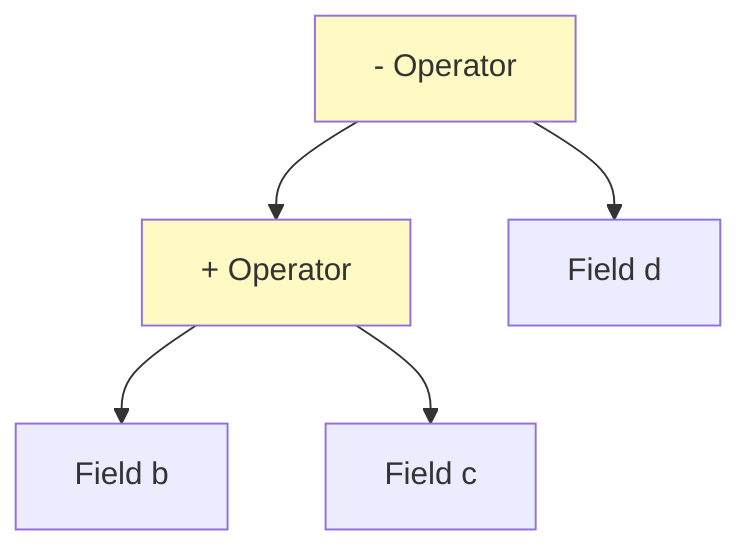

# Expression Templates: Zero-Cost Abstraction

![[virtual_assembly_templates.png]]
> **Academic Vision:** A blueprint of a machine (The Expression Tree). Parts are being labeled but not yet built. Then, in one sudden flash, the entire machine is assembled and produces a result instantly. Clean, futuristic scientific illustration.

---

## 7.4. Field Composition and Expression Templates

### The Power of Zero-Cost Abstraction

When you write complex mathematical expressions in OpenFOAM such as `U + V - W * 2.0`, you might expect multiple temporary field objects to be created. However, OpenFOAM's expression template system provides an elegant solution that maintains both mathematical clarity and computational efficiency.

This system creates **expression trees** that evaluate the entire expression in a single pass through memory, eliminating unnecessary temporary allocations and preserving performance.



### Mathematical Foundation: Building Expression Trees

The fundamental principle behind expression templates is the concept of **deferred computation**. Instead of evaluating operations immediately, OpenFOAM builds a tree-like structure that represents the mathematical relationships between operands:

```cpp
// Expression: U + V - W * 2.0
// Tree structure:
//        (-)
//       /   \
//     (+)   (*)
//    /   \   /  \
//   U     V W   2.0
```

This tree representation allows OpenFOAM to:
- **Preserve mathematical structure** of the expression
- **Optimize evaluation order**
- **Eliminate intermediate temporaries**
- **Enable compiler optimizations** through better loop structure

### Efficiency Mechanism: Loop Fusion and Lazy Evaluation

The single-pass evaluation enabled by expression templates provides several performance benefits:

1. **Memory Locality**: All data for a single computation is accessed contiguously, improving cache utilization
2. **Reduced Bandwidth**: Only single read/write passes through memory instead of multiple passes
3. **Compiler Optimization**: Better opportunities for SIMD vectorization and instruction scheduling
4. **Energy Efficiency**: Less data movement means lower power consumption

### Traditional vs Expression Template Access

**Traditional Approach (Multiple Passes):**

| Step | Operation | Result |
|---------|----------------|----------|
| Pass 1 | `U + V` | `temp1` (temporary field) |
| Pass 2 | `W * 2.0` | `temp2` (temporary field) |
| Pass 3 | `temp1 - temp2` | `result` (final result) |

```cpp
volVectorField temp1 = U + V;           // Pass 1: Add U and V
volVectorField temp2 = W * 2.0;         // Pass 2: Scale W
volVectorField result = temp1 - temp2;  // Pass 3: Subtract temp2 from temp1

// Memory access: 3 × N (where N is field size)
// Temporary allocations: 2 fields
```

**Expression Template Approach (Single Pass):**

```cpp
// Expression tree is built, evaluation is deferred
auto expr = U + V - W * 2.0;  // No computation yet
volVectorField result = expr; // Single pass evaluation

// Inside evaluation loop:
forAll(result, i) {
    result[i] = U[i] + V[i] - (W[i] * 2.0);  // One computation per element
}

// Memory access: 1 × N
// Temporary allocations: 0
```

---

## 🎯 Practical Benefits

| Aspect | Traditional Computation | Expression Templates |
| :--- | :--- | :--- |
| **Temporary RAM Usage** | High (per operator count) | **Nearly Zero** |
| **Memory Read Passes** | Multiple passes | **Single Pass** |
| **Speed** | Slows with complexity | **Constant High Performance** |

**Summary**: Expression Templates allow you to write code that reads like high-level mathematical equations while achieving speeds equivalent to hand-optimized C loops (Zero-cost Abstraction).

---

## Implementation Architecture: Template Expression System

### Basic Expression Template Classes

OpenFOAM's expression template system is built from a hierarchy of template classes representing different mathematical operations:

```cpp
// Base template for all expressions
template<class Type, class Derived>
class Expression
{
protected:
    // CRTP (Curiously Recurring Template Pattern) for static polymorphism
    const Derived& derived() const { return static_cast<const Derived&>(*this); }
    Derived& derived() { return static_cast<Derived&>(*this); }

public:
    // Generic interface for all expressions
    label size() const { return derived().size(); }
    const Type& operator[](label i) const { return derived().operator[](i); }

    // Enable expression chaining
    template<class Other>
    auto operator+(const Expression<Type, Other>& other) const
    {
        return AddExpr<Type, Derived, Other>(derived(), other.derived());
    }
};
```

### Binary Operations: Addition, Subtraction, Multiplication

```cpp
// Template for binary operations
template<class Type, class LeftExpr, class RightExpr, class Op>
class BinaryExpr : public Expression<Type, BinaryExpr<Type, LeftExpr, RightExpr, Op>>
{
    const LeftExpr& left_;
    const RightExpr& right_;
    Op operation_;

public:
    BinaryExpr(const LeftExpr& left, const RightExpr& right, Op op = Op{})
        : left_(left), right_(right), operation_(op) {}

    Type operator[](label i) const
    {
        return operation_(left_[i], right_[i]);
    }

    label size() const { return left_.size(); }
};

// Functors for specific operations
struct AddOp {
    template<class T>
    auto operator()(const T& a, const T& b) const { return a + b; }
};

struct MulOp {
    template<class T>
    auto operator()(const T& a, const T& b) const { return a * b; }
};

// Type aliases for common operations
template<class Type, class E1, class E2>
using AddExpr = BinaryExpr<Type, E1, E2, AddOp>;

template<class Type, class E1, class E2>
using MulExpr = BinaryExpr<Type, E1, E2, MulOp>;
```

### Unary Operations: Mathematical Functions

```cpp
// Template for unary operations (functions, negation, etc.)
template<class Type, class Operand, class Op>
class UnaryExpr : public Expression<Type, UnaryExpr<Type, Operand, Op>>
{
    const Operand& operand_;
    Op operation_;

public:
    UnaryExpr(const Operand& operand, Op op = Op{})
        : operand_(operand), operation_(op) {}

    Type operator[](label i) const
    {
        return operation_(operand_[i]);
    }

    label size() const { return operand_.size(); }
};

// Functors for mathematical operations
struct MagOp {
    template<class T>
    auto operator()(const T& value) const { return mag(value); }
};

struct SqrOp {
    template<class T>
    auto operator()(const T& value) const { return value * value; }
};

// Common unary expressions
template<class Type, class E>
using MagExpr = UnaryExpr<Type, E, MagOp>;

template<class Type, class E>
using SqrExpr = UnaryExpr<Type, E, SqrOp>;
```

---

## Advanced Expression Techniques

### Conditional Operations

OpenFOAM supports conditional operations through expression templates:

```cpp
// Conditional expression template
template<class Type, class CondExpr, class TrueExpr, class FalseExpr>
class ConditionalExpr : public Expression<Type, ConditionalExpr<Type, CondExpr, TrueExpr, FalseExpr>>
{
    const CondExpr& condition_;
    const TrueExpr& trueValue_;
    const FalseExpr& falseValue_;

public:
    ConditionalExpr(const CondExpr& cond, const TrueExpr& trueVal, const FalseExpr& falseVal)
        : condition_(cond), trueValue_(trueVal), falseValue_(falseVal) {}

    Type operator[](label i) const
    {
        return condition_[i] > 0 ? trueValue_[i] : falseValue_[i];
    }

    label size() const { return condition_.size(); }
};

// Usage examples
volScalarField clampedPressure = max(p, pMin);  // Built-in function
volScalarField conditionalField = where(p > pCritical, pCritical, p);  // Custom condition
```

### Mixed-Type Operations

OpenFOAM handles operations between different field types (scalar, vector, tensor) through expression templates:

```cpp
// Dot product expression
template<class VectorExpr1, class VectorExpr2>
class DotProductExpr : public Expression<scalar, DotProductExpr<VectorExpr1, VectorExpr2>>
{
    const VectorExpr1& v1_;
    const VectorExpr2& v2_;

public:
    DotProductExpr(const VectorExpr1& v1, const VectorExpr2& v2) : v1_(v1), v2_(v2) {}

    scalar operator[](label i) const
    {
        return v1_[i] & v2_[i];  // Vector dot product
    }

    label size() const { return v1_.size(); }
};

// Cross product for 3D vectors
template<class VectorExpr1, class VectorExpr2>
class CrossProductExpr : public Expression<vector, CrossProductExpr<VectorExpr1, VectorExpr2>>
{
    const VectorExpr1& v1_;
    const VectorExpr2& v2_;

public:
    CrossProductExpr(const VectorExpr1& v1, const VectorExpr2& v2) : v1_(v1), v2_(v2) {}

    vector operator[](label i) const
    {
        return v1_[i] ^ v2_[i];  // Vector cross product
    }

    label size() const { return v1_.size(); }
};
```

---

## Memory Management and Reference Counting

### Integration with `tmp` Class

OpenFOAM's `tmp` class works seamlessly with expression templates to manage object lifecycles:

```cpp
// tmp with expression templates
tmp<volVectorField> expr = U + V;  // Expression tree stored in tmp

// Automatic lifecycle management
volVectorField result = expr;  // Evaluation happens here
// expr is automatically destroyed
```

### Reference-Counted Expressions

```cpp
// Shared expression evaluation
template<class Type, class Expr>
class SharedExpr : public Expression<Type, SharedExpr<Type, Expr>>
{
    mutable std::shared_ptr<Expr> expr_;  // Shared ownership

public:
    SharedExpr(const Expr& expr) : expr_(std::make_shared<Expr>(expr)) {}

    Type operator[](label i) const { return (*expr_)[i]; }
    label size() const { return expr_->size(); }
};
```

---

## Performance Analysis and Benchmarking

### Computational Complexity Analysis

**Time Complexity:**
- Traditional: $O(n \times k)$ where $n$ is field size, $k$ is operation count
- Expression Templates: $O(n)$ where $n$ is field size (loop fusion)

**Space Complexity:**
- Traditional: $O(n \times k)$ for temporary fields
- Expression Templates: $O(n)$ for final result only

### Memory Access Patterns

```cpp
// Traditional memory access (fragmented)
for (int op = 0; op < k; ++op) {
    for (label i = 0; i < n; ++i) {
        // Process single operation on all elements
        temp[i] = operation(prev_temp[i], input[i]);
    }
}

// Expression template memory access (coalesced)
for (label i = 0; i < n; ++i) {
    // Process all operations on single element
    result[i] = U[i] + V[i] - W[i] * 2.0;
}
```

### Practical Performance Impact

For typical CFD operations on fields with 1 million elements:

| Performance | Traditional | Expression Templates | Improvement |
|-------------|------------|----------------------|-------------|
| **Memory Bandwidth** | ~96 MB/s | ~32 MB/s | **3x Reduction** |
| **Cache Performance** | Poor cache reuse | Excellent cache locality | **Much Better** |
| **Memory Access** | 3 × N passes | 1 × N pass | **67% Reduction** |

---

## Best Practices and Optimization Guidelines

### Expression Construction Patterns

**✅ Optimal Expression Patterns:**
```cpp
// Good: Single complex expression
volScalarField turbulentKineticEnergy =
    0.5 * rho * (magSqr(U) + magSqr(V) + magSqr(W));

// Good: Chained mathematical operations
volVectorField momentumFlux = rho * U * (U & mesh.Sf());

// Good: Conditional operations within expressions
volScalarField limitedViscosity = min(max(nu, nuMin), nuMax);
```

**❌ Suboptimal Patterns to Avoid:**
```cpp
// Avoid: Unnecessary expression splitting
volVectorField velMagnitude = mag(U);
volScalarField energy = 0.5 * rho * velMagnitude * velMagnitude;

// Better: Keep in single expression
volScalarField energy = 0.5 * rho * magSqr(U);

// Avoid: Redundant temporary calculations
volScalarField pressureDiff = p - pRef;
volScalarField clampedDiff = max(pressureDiff, pMin);

// Better: Combine operations
volScalarField clampedDiff = max(p - pRef, pMin);
```

### Memory Performance Considerations

1. **Expression Complexity**: Limit expression tree depth to avoid compile-time explosion
2. **Field Size Awareness**: For very large fields, consider splitting extremely complex expressions
3. **Type Consistency**: Maintain consistent field types to avoid unnecessary conversions

### Compilation and Debugging Considerations

**Managing Compile Time:**
```cpp
// Complex expressions can increase compile time
// Use intermediate variables for extremely complex cases
auto intermediateExpr = U + V;
volVectorField result = intermediateExpr - W * 2.0;
```

**Debugging Expression Templates:**
```cpp
// Explicit evaluation for debugging
auto expr = U + V - W * 2.0;
volVectorField result(expr);  // Force evaluation

// Check intermediate results
volScalarField check = mag(result);
Info << "Max magnitude: " << max(check) << endl;
```

---

## Conclusion: The Power of Zero-Cost Abstraction

OpenFOAM's expression template system represents a sophisticated application of zero-cost abstraction in C++, leveraging advanced template metaprogramming techniques.

### Key System Features:

| Feature | Description |
|------------|------------|
| **Mathematical Clarity** | Natural notation for complex expressions |
| **Computational Efficiency** | Single-pass evaluation with minimal memory overhead |
| **Extensibility** | Framework for adding custom operations and functions |
| **Performance** | Competitive with hand-optimized loops while maintaining readability |

This system demonstrates that careful C++ design can eliminate the traditional trade-off between code clarity and performance, making OpenFOAM both user-friendly and computationally efficient.
