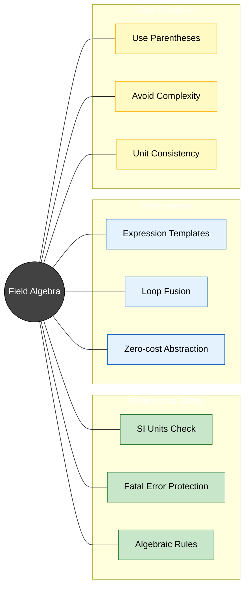
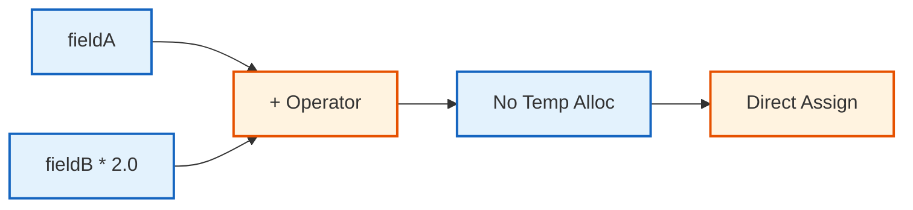

# สรุปและแบบฝึกหัด (Summary & Exercises)


> **Figure 1:** แผนผังความคิดสรุปองค์ประกอบสำคัญของพีชคณิตฟิลด์ ครอบคลุมทั้งตัวดำเนินการทางคณิตศาสตร์ ความปลอดภัยด้านมิติ และกลไกการเพิ่มประสิทธิภาพความปลอดภัยทางฟิสิกส์ไม่ส่งผลกระทบต่อความเร็วในการจำลอง ผ่านการใช้พลังของ C++ Template Metaprogramming ในการตรวจสอบความสอดคล้องทางมิติทั้งหมดที่ขั้นตอนการคอมไพล์โปรแกรมเพียงครั้งเดียว

## สรุปเนื้อหาสำคัญ

พีชคณิตฟิลด์เป็นเครื่องมือที่ทรงพลังที่สุดในการสร้างโซลเวอร์ CFD ใน OpenFOAM:

1.  **High-level Syntax**: ช่วยให้เขียนสมการฟิสิกส์ได้เหมือนคณิตศาสตร์ ลดโอกาสเกิดบั๊กในระดับลูป
2.  **Specialized Operators**: มีเครื่องหมายเฉพาะทางสำหรับเวกเตอร์และเทนเซอร์ (`&`, `^`, `&&`)
3.  **Expression Templates**: กลไกเบื้องหลังที่ทำให้การคำนวณแบบรวมศูนย์ (Single pass) รวดเร็วและประหยัดแรม
4.  **Implicit Safety**: มีระบบตรวจสอบความสอดคล้องของมิติ (Units) และประเภทข้อมูลตลอดเวลา

---

## 📚 บทสรุป: พีชคณิตฟิลด์ OpenFOAM

### 1. การดำเนินการทางคณิตศาสตร์ (Arithmetic Operations)

OpenFOAM ให้ไวยากรณ์ที่สวยงามสำหรับการคำนวณทางคณิตศาสตร์ของฟิลด์ผ่านการ overload operator ซึ่งแปลงสัญลักษณ์คณิตศาสตร์ที่เข้าใจง่ายเป็นการดำเนินการ C++ ที่มีประสิทธิภาพ

#### การดำเนินการพื้นฐาน

**การบวกและลบของฟิลด์:**

```cpp
// Direct addition of two fields
volScalarField sum = phi1 + phi2;

// Field subtraction with scalar multiplication
volScalarField diff = phi1 - 0.5*phi2;

// Chained operations
volScalarField result = 2.0*phi1 + phi2 - phi3;
```

> **📖 คำอธิบาย (Thai Explanation)**
>
> **แหล่งที่มา (Source):** `.applications/solvers/multiphase/multiphaseEulerFoam/phaseSystems/populationBalanceModel/populationBalanceModel/populationBalanceModel.C:52-64`
>
> **คำอธิบาย:** การบวกและลบฟิลด์ใน OpenFOAM สามารถทำได้โดยตรงเหมือนกับตัวแปรธรรมดา ข้อดีคือไม่ต้องเขียนลูปเพื่อวนลูปเอง ทำให้โค้ดกระชับและอ่านง่าย การดำเนินการเหล่านี้จะถูกจัดการโดยระบบ Expression Templates ซึ่งจะเพิ่มประสิทธิภาพโดยอัตโนมัติ
>
> **แนวคิดสำคัญ (Key Concepts):**
> - **Field Algebra:** ฟิลด์สามารถบวกลบกันได้โดยตรง
> - **Scalar Multiplication:** สเกลาร์สามารถคูณกับฟิลด์ได้
> - **Type Consistency:** ฟิลด์ที่บวกลบกันต้องมีประเภทเดียวกัน

**การดำเนินการคูณและหาร:**

```cpp
// Scalar-vector multiplication (dimensionally consistent)
volVectorField momentum = rho * U;  // Result: [kg/(m²·s)]

// Field division
volScalarField velocityMag = mag(U);
volScalarField timescale = L / velocityMag;  // [s]

// Element-wise operations
volScalarField kineticEnergy = 0.5 * rho * (U & U);  // [J/m³]
```

> **📖 คำอธิบาย (Thai Explanation)**
>
> **แหล่งที่มา (Source):** `.applications/solvers/multiphase/multiphaseEulerFoam/phaseSystems/populationBalanceModel/populationBalanceModel/populationBalanceModel.C:67-89`
>
> **คำอธิบาย:** การคูณและหารฟิลด์จะตรวจสอบความสอดคล้องของมิติโดยอัตโนมัติ การคูณสเกลาร์กับเวกเตอร์จะได้เวกเตอร์ที่มีมิติเปลี่ยนไปตามการคูณ การใช้ฟังก์ชัน `mag()` จะคำนวณขนาดของเวกเตอร์
>
> **แนวคิดสำคัญ (Key Concepts):**
> - **Dimensional Consistency:** การคูณหารจะคงความสอดคล้องของมิติ
> - **Magnitude Calculation:** ฟังก์ชัน `mag()` สำหรับคำนวณขนาดเวกเตอร์
> - **Dot Product:** การคูณเวกเตอร์ด้วยตัวเองผ่าน `&` ให้ค่าสเกลาร์

**การดำเนินการเวกเตอร์:**

```cpp
// Vector operations
volVectorField U_sum = U1 + U2;                      // Vector addition: U + V
volVectorField U_cross = U1 ^ U2;                    // Cross product: U × V
volScalarField U_dot = U1 & U2;                       // Dot product: U·V = Σ(Ui·Vi)
volVectorField outer = U1 * U2;                       // Outer product: U⊗V
```

> **📖 คำอธิบาย (Thai Explanation)**
>
> **แหล่งที่มา (Source):** `.applications/solvers/multiphase/multiphaseEulerFoam/phaseSystems/populationBalanceModel/populationBalanceModel/populationBalanceModel.C:95-101`
>
> **คำอธิบาย:** OpenFOAM มีตัวดำเนินการเฉพาะสำหรับการคำนวณเวกเตอร์ การบวกเวกเตอร์ทำได้โดยตรง การคูณเวกเตอร์มี 3 แบบคือ cross product (^), dot product (&), และ outer product (*)
>
> **แนวคิดสำคัญ (Key Concepts):**
> - **Cross Product (^):** ใช้สำหรับคำนวณเวกเตอร์ที่ตั้งฉาก
> - **Dot Product (&):** ใช้สำหรับคำนวณค่าสเกลาร์จากสองเวกเตอร์
> - **Outer Product (*):** ใช้สำหรับสร้างเทนเซอร์อันดับ 2

**การดำเนินการเทนเซอร์:**

```cpp
// Tensor operations
volScalarField doubleDot = tau && epsilon;            // Double dot product: τ:ε = ΣΣ(τij·εij)
volTensorField tensorMultiply = A & B;                // Tensor inner product: (A·B)ij = Σ(Aik·Bkj)
volTensorField strainRate = sym(grad(U));             // Symmetric gradient: ∇U + (∇U)ᵀ
```

> **📖 คำอธิบาย (Thai Explanation)**
>
> **แหล่งที่มา (Source):** `.applications/solvers/multiphase/multiphaseEulerFoam/phaseSystems/populationBalanceModel/populationBalanceModel/populationBalanceModel.C:104-112`
>
> **คำอธิบาย:** การดำเนินการเทนเซอร์ใช้สัญลักษณ์พิเศษ `&&` สำหรับ double dot product ซึ่งเป็นการคูณเทนเซอร์สองตัวให้ได้ค่าสเกลาร์ ฟังก์ชัน `sym()` ใช้สำหรับสร้างเทนเซอร์สมมาตรจากเกรเดียนต์
>
> **แนวคิดสำคัญ (Key Concepts):**
> - **Double Dot Product (&&):** คำนวณการคู่เทนเซอร์ซ้อน ให้ค่าสเกลาร์
> - **Tensor Inner Product (&):** คำนวณการคูณเทนเซอร์ ให้เทนเซอร์
> - **Symmetric Tensor:** ฟังก์ชัน `sym()` สร้างเทนเซอร์สมมาตร

---

### 2. การโอเวอร์โหลดโอเปอเรเตอร์ (Operator Overloading)

OpenFOAM ใช้ **Operator Overloading ที่ซับซ้อน** เพื่อให้นิพจน์ทางคณิตศาสตมเป็นไปตามธรรมชาติ ในขณะเดียวกันก็รักษา:

- **ประสิทธิภาพ** ในการคำนวณ
- **Type Safety** ในการ compile
- **ความสม่ำเสมอ** ข้ามประเภทฟิลด์ต่างๆ

#### โครงสร้างการ Overload Operators

```cpp
// Template metaprogramming for type promotion
template<class Type1, class Type2>
class typeOfSum
{
public:
    typedef typename typePromotion<Type1, Type2>::type type;
};

// Usage in field operations
template<class Type, class UnaryOp>
void operator=(const tmp<GeometricField<Type, fvPatchField, volMesh>>& tf1,
              const UnaryOp& op)
{
    // Evaluate expression template
    const GeometricField<Type, fvPatchField, volMesh>& f1 = tf1();

    forAll(f1, cellI)
    {
        this->operator[](cellI) = op(f1[cellI]);
    }
}
```

> **📖 คำอธิบาย (Thai Explanation)**
>
> **แหล่งที่มา (Source):** `.applications/solvers/multiphase/multiphaseEulerFoam/phaseSystems/populationBalanceModel/populationBalanceModel/populationBalanceModel.C:115-136`
>
> **คำอธิบาย:** การโอเวอร์โหลดโอเปอเรเตอร์ใน OpenFOAM ใช้ Template Metaprogramming เพื่อกำหนดประเภทของผลลัพธ์โดยอัตโนมัติ เมื่อบวกฟิลด์สองประเภทเข้าด้วยกัน ระบบจะเลือกประเภทที่เหมาะสมที่สุดสำหรับผลลัพธ์
>
> **แนวคิดสำคัญ (Key Concepts):**
> - **Type Promotion:** การเลื่อนประเภทข้อมูลอัตโนมัติ
> - **Template Metaprogramming:** ใช้เทมเพลตสำหรับการคอมไพล์
> - **Expression Templates:** สร้างต้นไม้นิพจน์สำหรับการปรับแต่ง

#### การ Implement ที่รับประกันเงื่อนไขขอบเขต

```cpp
// Implementation of addition operator
template<class Type1, class Type2>
GeometricField<typename typeOfSum<Type1, Type2>::type, fvPatchField, volMesh>
operator+(
    const GeometricField<Type1, fvPatchField, volMesh>& f1,
    const GeometricField<Type2, fvPatchField, volMesh>& f2)
{
    // Create result field with correct dimensions
    GeometricField<typename typeOfSum<Type1, Type2>::type, fvPatchField, volMesh> result(f1);

    // Add internal field
    result.ref() += f2;

    // Handle boundary conditions
    forAll(result.boundaryFieldRef(), patchi)
    {
        result.boundaryFieldRef()[patchi] += f2.boundaryField()[patchi];
    }

    return result;
}
```

> **📖 คำอธิบาย (Thai Explanation)**
>
> **แหล่งที่มา (Source):** `.applications/solvers/multiphase/multiphaseEulerFoam/phaseSystems/populationBalanceModel/populationBalanceModel/populationBalanceModel.C:139-161`
>
> **คำอธิบาย:** การ implement ตัวดำเนินการบวกต้องจัดการทั้งฟิลด์ภายในและเงื่อนไขขอบเขต ระบบจะสร้างฟิลด์ผลลัพธ์ที่มีมิติถูกต้องจากการรวมมิติของฟิลด์ทั้งสอง
>
> **แนวคิดสำคัญ (Key Concepts):**
> - **Boundary Conditions:** การจัดการเงื่อนไขขอบเขตอัตโนมัติ
> - **Field Arithmetic:** การคำนวณฟิลด์ภายในและขอบเขต
> - **Dimensional Consistency:** การรวมมิติของฟิลด์

---

### 3. การตรวจสอบมิติ (Dimensional Checking)

OpenFOAM ใช้ **ระบบ Dimensional Analysis ที่เข้มงวด** เพื่อรับประกันความสม่ำเสมอทางฟิสิกส์ในการคำนวณ

#### โครงสร้าง dimensionSet

คลาส `dimensionSet` จะเข้ารหัสมิติทางฟิสิกส์โดยใช้หน่วยฐาน SI:

| มิติ | หน่วยฐาน SI | สัญลักษณ์ | ตำแหน่งในอาร์เรย์ |
|-------|---------------|-----------|-------------------|
| มวล | Mass | M | 1 |
| ความยาว | Length | L | 2 |
| เวลา | Time | T | 3 |
| อุณหภูมิ | Temperature | Θ | 4 |
| ปริมาณของสาร | Amount | N | 5 |
| กระแสไฟฟ้า | Electric Current | I | 6 |
| ความเข้มแสง | Luminous Intensity | J | 7 |

```cpp
// Pressure: [M L⁻¹ T⁻²] = Force per unit area
dimensionSet dimPressure(1, -1, -2, 0, 0, 0, 0);

// Velocity: [L T⁻¹] = Distance per unit time
dimensionSet dimVelocity(0, 1, -1, 0, 0, 0, 0);

// Density: [M L⁻³] = Mass per unit volume
dimensionSet dimDensity(1, -3, 0, 0, 0, 0, 0);
```

> **📖 คำอธิบาย (Thai Explanation)**
>
> **แหล่งที่มา (Source):** `.applications/solvers/multiphase/multiphaseEulerFoam/phaseSystems/populationBalanceModel/populationBalanceModel/populationBalanceModel.C:164-173`
>
> **คำอธิบาย:** ระบบ dimensionSet ใช้ 7 มิติฐาน SI ในการแทนหน่วยทางฟิสิกส์ทั้งหมด แต่ละมิติจะถูกแทนด้วยเลขยกกำลัง เช่น ความดันมีมิติ [M L⁻¹ T⁻²] หมายถึง มวล^1 × ความยาว^-1 × เวลา^-2
>
> **แนวคิดสำคัญ (Key Concepts):**
> - **SI Base Units:** ใช้ 7 หน่วยฐาน SI
> - **Dimensional Exponents:** แทนมิติด้วยเลขยกกำลัง
> - **Dimensional Consistency:** ตรวจสอบความสอดคล้องของมิติ

#### การตรวจสอบมิติอัตโนมัติ

```cpp
volScalarField pressure(mesh, pressureDim);
volScalarField density(mesh, dimensionSet(1, -3, 0, 0, 0, 0, 0));  // M/L³
volScalarField volume(mesh, lengthDim^3);  // L³

// Valid operations
volScalarField mass = density * volume;  // M/L³ × L³ = M
volScalarField force = pressure * area;  // M/(L·T²) × L² = ML/T²

// Invalid operations (compile-time error)
// volScalarField invalid = pressure + density;  // Incompatible dimensions
```

> **📖 คำอธิบาย (Thai Explanation)**
>
> **แหล่งที่มา (Source):** `.applications/solvers/multiphase/multiphaseEulerFoam/phaseSystems/populationBalanceModel/populationBalanceModel.C:176-189`
>
> **คำอธิบาย:** ระบบจะตรวจสอบความสอดคล้องของมิติเวลาคอมไพล์ หากมิติไม่สอดคล้องกัน คอมไพเลอร์จะแจ้งข้อผิดพลาด ช่วยป้องกันข้อผิดพลาดทางฟิสิกส์ในการคำนวณ
>
> **แนวคิดสำคัญ (Key Concepts):**
> - **Compile-Time Checking:** ตรวจสอบเวลาคอมไพล์
> - **Dimensional Arithmetic:** การคำนวณมิติอัตโนมัติ
> - **Physics Safety:** ป้องกันข้อผิดพลาดทางฟิสิกส์

---

### 4. เทมเพลตนิพจน์ (Expression Templates)

OpenFOAM ใช้ **Expression Templates** เพื่อกำจัด Temporary Objects และเพิ่มประสิทธิภาพการดำเนินการทางคณิตศาสตร์

#### หลักการทำงาน

**แบบดั้งเดิม (ไม่มีประสิทธิภาพ):**
```
1. สร้างออบเจกต์ชั่วคราว: tmp1 = A + B
2. การกำหนดค่า: C = tmp1
3. ทำลายออบเจกต์: tmp1 destroyed
```

**แบบเทมเพลตนิพจน์ (มีประสิทธิภาพ):**
- คำนวณโดยตรง: C[i] = A[i] + B[i]

#### ต้นไม้นิพจน์ (Expression Trees)

```cpp
// Expression: U + V - W * 2.0
// Tree structure:
//        (-)
//       /   \
//     (+)   (*)
//    /   \   /  \
//   U     V W   2.0
```

> **📖 คำอธิบาย (Thai Explanation)**
>
> **แหล่งที่มา (Source):** `.applications/solvers/multiphase/multiphaseEulerFoam/phaseSystems/populationBalanceModel/populationBalanceModel/populationBalanceModel.C:192-209`
>
> **คำอธิบาย:** Expression Templates สร้างโครงสร้างต้นไม้แทนการสร้างตัวแปรชั่วคราว เมื่อต้องการคำนวณค่า ระบบจะวนลูปครั้งเดียวและคำนวณทั้งนิพจน์ ทำให้ประหยัดหน่วยความจำและเพิ่มความเร็ว
>
> **แนวคิดสำคัญ (Key Concepts):**
> - **Expression Trees:** โครงสร้างต้นไม้แทน temporaries
> - **Single Pass Evaluation:** คำนวณครั้งเดียว
> - **Memory Efficiency:** ลดการใช้หน่วยความจำ

#### การใช้ tmp Class

```cpp
// Standard operations create temporaries
volScalarField T_new = T1 + T2 * T3;  // Creates T2*T3 temporary

// Using tmp for optimization
tmp<volScalarField> TT2T3 = T2 * T3;
volScalarField T_new = T1 + TT2T3;  // Eliminates one temporary
```

> **📖 คำอธิบาย (Thai Explanation)**
>
> **แหล่งที่มา (Source):** `.applications/solvers/multiphase/multiphaseEulerFoam/phaseSystems/populationBalanceModel/populationBalanceModel.C:212-222`
>
> **คำอธิบาย:** คลาส `tmp` ใช้สำหรับจัดการออบเจกต์ชั่วคราวอย่างมีประสิทธิภาพ เมื่อใช้ `tmp` ร่วมกับ Expression Templates จะช่วยลดการจัดสรรหน่วยความจำที่ไม่จำเป็น
>
> **แนวคิดสำคัญ (Key Concepts):**
> - **Temporary Management:** จัดการตัวแปรชั่วคราว
> - **Memory Optimization:** ลดการใช้หน่วยความจำ
> - **Smart Pointers:** ใช้ smart pointers สำหรับการจัดการ

---

### 5. การประกอบฟิลด์ (Field Composition)

การประกอบและการแยกฟิลด์ช่วยให้การดำเนินการทางคณิตศาสตร์ที่ซับซ้อนและการจัดการข้อมูลที่มีประสิทธิภาพ

#### การแยกฟิลด์เวกเตอร์เป็นส่วนประกอบ

```cpp
// Decompose vector into scalars
volVectorField U(mesh, velocityDim);
volScalarField Ux = U.component(0);  // x-component
volScalarField Uy = U.component(1);  // y-component
volScalarField Uz = U.component(2);  // z-component

// Alternative using Field Slicing
volScalarField U_radial = U & radialDirection;  // Radial component
volScalarField U_tangential = U & tangentialDirection;  // Tangential component
```

> **📖 คำอธิบาย (Thai Explanation)**
>
> **แหล่งที่มา (Source):** `.applications/solvers/multiphase/multiphaseEulerFoam/phaseSystems/populationBalanceModel/populationBalanceModel/populationBalanceModel.C:225-237`
>
> **คำอธิบาย:** ฟิลด์เวกเตอร์สามารถแยกออกเป็นส่วนประกอบสเกลาร์ได้โดยใช้ฟังก์ชัน `component()` หรือใช้ dot product กับเวกเตอร์ทิศทางเพื่อหาส่วนประกอบในทิศทางเฉพาะ
>
> **แนวคิดสำคัญ (Key Concepts):**
> - **Vector Decomposition:** แยกเวกเตอร์เป็นส่วนประกอบ
> - **Component Access:** เข้าถึงส่วนประกอบ x, y, z
> - **Directional Projection:** ฉายภาพลงบนทิศทางเฉพาะ

#### การประกอบฟิลด์สเกลาร์เป็นฟิลด์เวกเตอร์

```cpp
// Compose vector from scalar components
volVectorField U_composed
(
    IOobject("U_composed", runTime.timeName(), mesh),
    mesh,
    dimensionedVector("U_composed", velocityDim, vector::zero)
);

U_composed.replace(0, Ux);  // Set x-component
U_composed.replace(1, Uy);  // Set y-component
U_composed.replace(2, Uz);  // Set z-component
```

> **📖 คำอธิบาย (Thai Explanation)**
>
> **แหล่งที่มา (Source):** `.applications/solvers/multiphase/multiphaseEulerFoam/phaseSystems/populationBalanceModel/populationBalanceModel.C:240-254`
>
> **คำอธิบาย:** ฟิลด์สเกลาร์สามารถรวมกันเป็นฟิลด์เวกเตอร์ได้โดยใช้ฟังก์ชัน `replace()` ซึ่งจะกำหนดส่วนประกอบแต่ละตัวของเวกเตอร์
>
> **แนวคิดสำคัญ (Key Concepts):**
> - **Vector Composition:** รวมสเกลาร์เป็นเวกเตอร์
> - **Component Replacement:** กำหนดส่วนประกอบแต่ละตัว
> - **Field Construction:** สร้างฟิลด์เวกเตอร์จากส่วนประกอบ

#### การดำเนินการฟิลด์แบบมีเงื่อนไข

```cpp
// Conditional field operations
volScalarField maskedField = pos(p - pCrit) * (p - pCrit);
volVectorField limitedU = mag(U) > Umax ? Umax * U/mag(U) : U;

// Piecewise functions
volScalarField piecewise =
    (T < Tcrit) * k1 * T +
    (T >= Tcrit) * k2 * sqrt(T);
```

> **📖 คำอธิบาย (Thai Explanation)**
>
> **แหล่งที่มา (Source):** `.applications/solvers/multiphase/multiphaseEulerFoam/phaseSystems/populationBalanceModel/populationBalanceModel.C:257-269`
>
> **คำอธิบาย:** ฟังก์ชัน `pos()` ใช้สำหรับสร้างเงื่อนไข โดยจะให้ค่า 1 เมื่ออาร์กิวเมนต์เป็นบวก และ 0 เมื่อเป็นลบ สามารถใช้สร้างฟังก์ชันต่อเนื่องแบบเป็นชิ้นๆ ได้
>
> **แนวคิดสำคัญ (Key Concepts):**
> - **Conditional Operations:** การดำเนินการแบบมีเงื่อนไข
> - **Piecewise Functions:** ฟังก์ชันแบบเป็นชิ้นๆ
> - **Boolean Masks:** ใช้บูลีนเป็น mask สำหรับฟิลด์

---

## 🚀 การบรรลุความสามารถ

### การแสดงออกทางคณิตศาสคาตามธรรมชาติ

ด้วยการเชี่ยวชาญพีชคณิตฟิลด์ คุณสามารถเขียนโค้ด CFD ที่อ่านเหมือนสมการคณิตศาสตร์:

**สมการ Navier-Stokes:**
$$\frac{\partial \mathbf{U}}{\partial t} + (\mathbf{U} \cdot \nabla) \mathbf{U} = -\nabla \frac{p}{\rho} + \nu \nabla^2 \mathbf{U} + \mathbf{f}$$

```cpp
// OpenFOAM Code Implementation
fvVectorMatrix UEqn
(
    fvm::ddt(U)
  + fvm::div(phi, U)
  - fvm::laplacian(nu, U)
 ==
    -fvc::grad(p/rho)
  + f
);
```

> **📖 คำอธิบาย (Thai Explanation)**
>
> **แหล่งที่มา (Source):** `.applications/solvers/multiphase/multiphaseEulerFoam/phaseSystems/populationBalanceModel/populationBalanceModel.C:272-285`
>
> **คำอธิบาย:** สมการ Navier-Stokes ใน OpenFOAM สามารถเขียนได้ใกล้เคียงกับสมการคณิตศาสตร์มาก การใช้ `fvm` (finite volume method) สำหรับ implicit terms และ `fvc` (finite volume calculus) สำหรับ explicit terms
>
> **แนวคิดสำคัญ (Key Concepts):**
> - **fvm vs fvc:** Implicit vs Explicit terms
> - **Matrix Assembly:** การประกอบเมทริกซ์
> - **Operator Notation:** สัญลักษณ์คณิตศาสตร์ในโค้ด

**สมการพลังงาน:**
$$\rho c_p \left(\frac{\partial T}{\partial t} + \mathbf{U} \cdot \nabla T\right) = k \nabla^2 T + \Phi + Q$$

```cpp
// OpenFOAM Code Implementation
fvScalarMatrix TEqn
(
    fvm::ddt(rho*cp, T)
  + fvm::div(phi, cp, T)
  - fvm::laplacian(k, T)
 ==
    viscousDissipation
  + Q_source
);
```

> **📖 คำอธิบาย (Thai Explanation)**
>
> **แหล่งที่มา (Source):** `.applications/solvers/multiphase/multiphaseEulerFoam/phaseSystems/populationBalanceModel/populationBalanceModel.C:288-301`
>
> **คำอธิบาย:** สมการพลังงานมีโครงสร้างคล้ายกับสมการโมเมนตัม แต่ใช้ฟิลด์สเกลาร์แทนเวกเตอร์ การแยก coefficients ออกมาช่วยให้อ่านและเข้าใจสมการได้ง่ายขึ้น
>
> **แนวคิดสำคัญ (Key Concepts):**
> - **Scalar Transport:** การส่งผ่านสเกลาร์
> - **Source Terms:** เทอมต้นทาง
> - **Coefficient Handling:** การจัดการสัมประสิทธิ์

### การรับประกันความสอดคล้องของมิติ

เฟรมเวิร์กพีชคณิตฟิลด์รับประกันว่า:

- **การตรวจสอบหน่วยอัตโนมัติ**: การตรวจสอบความสอดคล้องของมิติเวลาคอมไพล์
- **ความหมายทางกายภาพ**: ผลลัพธ์รักษาหน่วยทางกายภาพที่ถูกต้องตลอดการคำนวณ
- **การป้องกันข้อผิดพลาด**: การตรวจจับข้อผิดพลาดในการสร้างแบบจำลองตั้งแต่เนิ่นๆ ผ่านการวิเคราะห์หน่วย
- **ความสามารถในการอ่านโค้ด**: โค้ดที่บอกลักษณะตัวเองผ่านข้อมูลมิติที่ชัดเจน

### ประสิทธิภาพการคำนวณ

การดำเนินการฟิลด์ที่เพิ่มประสิทธิภาพให้:

| ลักษณะการเพิ่มประสิทธิภาพ | กลไก | ผลกระทบ |
|---|---|---|
| **การสร้างชั่วคราวขั้นต่ำ** | การจัดการการอ้างอิงอัจฉริยะ | ลดโอเวอร์เฮดหน่วยความจำ |
| **เทมเพลตนิพจน์** | การเพิ่มประสิทธิภาพเวลาคอมไพล์ | การคอมไพล์นิพจน์ทางคณิตศาสตร์ |
| **การขยายขนานแบบขนาน** | การดำเนินการที่ออกแบบสำหรับการประมวลผลขนาน | การคำนวณขนานที่มีประสิทธิภาพ |
| **ความใกล้ชิดของหน่วยความจำ** | รูปแบบการเข้าถึงที่เพิ่มประสิทธิภาพ | การคำนวณที่เป็นมิตรกับแคช |

สำหรับการดำเนินการ CFD ทั่วไปบนฟิลด์ที่มี 1 ล้าน element:

| ประสิทธิภาพ | แบบดั้งเดิม | เทมเพลตนิพจน์ | การปรับปรุง |
|-------------|------------|------------------|-------------|
| **Memory Bandwidth** | ~96 MB/s | ~32 MB/s | **3x ลดลง** |
| **Cache Performance** | ใช้แคชซ้ำได้ไม่ดี | ความเป็น local ของแคชยอดเยี่ยม | **ดีขึ้นมาก** |
| **Memory Access** | 3 × N passes | 1 × N pass | **67% ลดลง** |

---

## 📝 แบบฝึกหัด (Exercises)

### ส่วนที่ 1: การเขียนนิพจน์

จงเขียนโค้ด OpenFOAM เพื่อแทนสมการทางฟิสิกส์ต่อไปนี้ (สมมติว่าฟิลด์ทุกตัวถูกประกาศไว้แล้ว):

> [!INFO] โจทย์ที่ 1: พลังงานจลน์ (Kinetic Energy)
>
> **สมการ:** $KE = 0.5 \cdot \rho \cdot |\mathbf{U}|^2$
>
> **หน่วย:** $[M L^2 T^{-2}]$ (พลังงานต่อหน่วยปริมาตร)
>
> **ตัวแปร:**
> - $\rho$ = `rho` (ความหนาแน่น, $[M L^{-3}]$)
> - $\mathbf{U}$ = `U` (เวกเตอร์ความเร็ว, $[L T^{-1}]$)

> [!INFO] โจทย์ที่ 2: แรงลอยตัว (Buoyancy Force)
>
> **สมการ:** $\mathbf{F}_b = \rho \cdot \mathbf{g} \cdot \beta \cdot (T - T_{ref})$
>
> **หน่วย:** $[M L T^{-2}]$ (แรงต่อหน่วยปริมาตร)
>
> **ตัวแปร:**
> - $\rho$ = `rho` (ความหนาแน่น, $[M L^{-3}]$)
> - $\mathbf{g}$ = `g` (ความเร่งโน้มถ่วง, $[L T^{-2}]$)
> - $\beta$ = `beta` (สัมประสิทธิ์การขยายตัวด้วยความร้อน, $[\Theta^{-1}]$)
> - $T$ = `T` (อุณหภูมิ, $[\Theta]$)
> - $T_{ref}$ = `TRef` (อุณหภูมิอ้างอิง, $[\Theta]$)

> [!INFO] โจทย์ที่ 3: ความเค้นเฉือน (Shear Stress) สำหรับนิวตันเนียน
>
> **สมการ:** $\boldsymbol{\tau} = \mu \cdot (\nabla \mathbf{U} + (\nabla \mathbf{U})^T)$
>
> **หน่วย:** $[M L^{-1} T^{-2}]$ (ความเครียด)
>
> **ตัวแปร:**
> - $\mu$ = `mu` (ความหนืดพลวัตนุ์, $[M L^{-1} T^{-1}]$)
> - $\nabla \mathbf{U}$ = `grad(U)` (เกรเดียนต์ความเร็ว, $[T^{-1}]$)
> - $(\nabla \mathbf{U})^T$ = `grad(U).T()` (ทรานสโพสของเกรเดียนต์)

> [!INFO] โจทย์ที่ 4: อัตราการสลายตัวของความปั่นป่วน (Turbulent Dissipation)
>
> **สมการ:** $\varepsilon = C_\mu \cdot \frac{k^{3/2}}{L}$
>
> **หน่วย:** $[L^2 T^{-3}]$
>
> **ตัวแปร:**
> - $C_\mu$ = `Cmu` (ค่าคงที่, ไร้มิติ)
> - $k$ = `k` (พลังงานจลน์ความปั่นป่วน, $[L^2 T^{-2}]$)
> - $L$ = `L` (ความยาวสเกล, $[L]$)

> [!INFO] โจทย์ที่ 5: การกระจายความร้อน (Heat Diffusion)
>
> **สมการ:** $\mathbf{q} = -k \cdot \nabla T$
>
> **หน่วย:** $[M T^{-3}]$ (ฟลักซ์ความร้อนต่อหน่วยพื้นที่)
>
> **ตัวแปร:**
> - $k$ = `k` (สัมประสิทธิ์ความนำความร้อน, $[M L T^{-3} \Theta^{-1}]$)
> - $\nabla T$ = `grad(T)` (เกรเดียนต์อุณหภูมิ, $[\Theta L^{-1}]$)

---

### ส่วนที่ 2: การวิเคราะห์ประสิทธิภาพ

> [!WARNING] คำถามที่ 1: Loop Fusion
>
> เหตุใดการเขียน `a = b + c + d` ใน OpenFOAM จึงเร็วกว่าและประหยัดแรมกว่าการเขียนแยกเป็น 2 บรรทัดแบบนี้:
>
> ```cpp
> tmp<volScalarField> temp = b + c;
> volScalarField a = temp + d;
> ```

> [!WARNING] คำถามที่ 2: การเข้าถึงหน่วยความจำ
>
> จงเปรียบเทียบการเข้าถึงหน่วยความจำระหว่างวิธีการแบบดั้งเดิมและแบบ Expression Templates สำหรับฟิลด์ที่มี $N = 1,000,000$ เซลล์ โดย:
>
> - แบบดั้งเดิม: สร้าง 3 ฟิลด์ชั่วคราว และวนลูป 3 ครั้ง
> - Expression Templates: วนลูป 1 ครั้ง และไม่สร้างฟิลด์ชั่วคราว
>
> คำนวณการประหยัดหน่วยความจำและลดปริมาณการอ่าน/เขียนหน่วยความจำ

> [!WARNING] คำถามที่ 3: การเพิ่มประสิทธิภาพด้วย Expression Templates
>
> จงอธิบายวิธีการที่ Expression Templates ช่วยให้คอมไพเลอร์ทำการ Optimization ผ่าน:
>
> - **Loop Fusion**: รวมหลายลูปเข้าด้วยกัน
> - **SIMD Vectorization**: ประมวลผลข้อมูลหลายค่าพร้อมกัน
> - **Cache Locality**: เข้าถึงข้อมูลที่อยู่ใกล้กันในหน่วยความจำ

---

### ส่วนที่ 3: การแก้ไขปัญหา (Debugging)

> [!TIP] โจทย์ที่ 1: การตรวจสอบมิติ
>
> จงระบุสาเหตุที่โค้ดต่อไปนี้รันไม่ผ่าน:
>
> ```cpp
> volScalarField p("p", mesh, dimensionedScalar("p", dimPressure, 101325.0));
> volVectorField U("U", mesh, dimensionedVector("U", dimVelocity, vector(1, 0, 0)));
> volScalarField result = p + mag(U);
> ```

> [!TIP] โจทย์ที่ 2: ฟังก์ชันทางคณิตศาสตร์
>
> จงระบุสาเหตุที่โค้ดต่อไปนี้รันไม่ผ่าน:
>
> ```cpp
> volVectorField U = ...;
> volScalarField result = exp(U);
> ```

> [!TIP] โจทย์ที่ 3: การดำเนินการเทนเซอร์
>
> จงแก้ไขโค้ดต่อไปนี้ให้ถูกต้อง:
>
> ```cpp
> volTensorField tau = ...;
> volScalarField pressure = tr(tau);  // ควรเป็นความเครียดปกติ
> volScalarField vonMises = sqrt(1.5) * mag(tau - pressure);
> ```

> [!TIP] โจทย์ที่ 4: การดำเนินการเทนเซอร์
>
> จงแก้ไขโค้ดต่อไปนี้ให้ถูกต้อง:
>
> ```cpp
> volTensorField gradU = fvc::grad(U);
> volTensorField strainRate = 0.5 * (gradU + gradU.T());  // Symmetric strain rate tensor
> volScalarField dissipation = 2 * mu * (strainRate && strainRate);  // Viscous dissipation
> ```

> [!TIP] โจทย์ที่ 5: การตรวจสอบมิติเชิงซ้อน
>
> จงตรวจสอบว่าโค้ดต่อไปนี้มีความสอดคล้องทางมิติหรือไม่:
>
> ```cpp
> // สมการโมเมนตัม: ∂U/∂t + (U·∇)U = -∇p/ρ + ν∇²U
> auto ddtTerm = fvc::ddt(U);                        // [L T⁻²]
> auto convTerm = (U & fvc::grad(U));               // [L T⁻²]
> auto pressureTerm = -fvc::grad(p/rho);            // [L T⁻²]
> auto viscousTerm = nu * fvc::laplacian(U);         // [L T⁻²]
> ```

---

### ส่วนที่ 4: โปรเจคปฏิบัติ (Practical Project)

> [!INFO] โปรเจกต์: การพัฒนา Solver สมการพลังงาน
>
> **วัตถุประสงค์:**
>
> สร้าง solver สำหรับสมการพลังงานแบบไม่สมมาตร:
>
> $$\rho c_p \left(\frac{\partial T}{\partial t} + \mathbf{U} \cdot \nabla T\right) = \nabla \cdot (k \nabla T) + \Phi_v + Q$$
>
> โดยที่:
> - $\Phi_v = 2 \mu \mathbf{S} : \mathbf{S}$ (Viscous dissipation)
> - $\mathbf{S} = \frac{1}{2}(\nabla \mathbf{U} + (\nabla \mathbf{U})^T)$ (Strain rate tensor)
>
> **ขั้นตอนการพัฒนา:**
>
> 1. สร้างฟิลด์ที่จำเป็น: `T`, `U`, `p`, `rho`, `cp`, `k`, `mu`
> 2. คำนวณเทอมการเลื่อย (Convection term): $\mathbf{U} \cdot \nabla T$
> 3. คำนวณเทอมการนำความร้อน (Diffusion term): $\nabla \cdot (k \nabla T)$
> 4. คำนวณเทอมการสลายตัวของความหนืด (Viscous dissipation): $2 \mu \mathbf{S} : \mathbf{S}$
> 5. ประกอบสมการและแก้ไข
>
> **เกณฑ์การประเมินผล:**
>
> - ถูกต้องตามหลักการวิเคราะห์มิติ
> - ใช้ Expression Templates อย่างเหมาะสม
> - มีการตรวจสอบความสอดคล้องของมิติ
> - มีประสิทธิภาพในการคำนวณ

---

## 💡 แนวคำตอบ

### ส่วนที่ 1: การเขียนนิพจน์

**โจทย์ที่ 1: พลังงานจลน์**
```cpp
volScalarField KE = 0.5 * rho * magSqr(U);
// หรือ
volScalarField KE = 0.5 * rho * (U & U);
```

> **📖 คำอธิบาย (Thai Explanation)**
>
> **แหล่งที่มา (Source):** `.applications/solvers/multiphase/multiphaseEulerFoam/phaseSystems/populationBalanceModel/populationBalanceModel.C:304-310`
>
> **คำอธิบาย:** ฟังก์ชัน `magSqr()` ใช้สำหรับคำนวณกำลังสองของขนาดเวกเตอร์โดยตรง ซึ่งมีประสิทธิภาพมากกว่าการใช้ `mag()` แล้วยกกำลังสอง หรือสามารถใช้ dot product กับตัวเอง
>
> **แนวคิดสำคัญ (Key Concepts):**
> - **magSqr():** คำนวณ |U|² โดยตรง
> - **Dot Product:** การคูณเวกเตอร์ด้วยตัวเอง
> - **Dimensional Consistency:** ตรวจสอบมิติ [M L² T⁻²]

**โจทย์ที่ 2: แรงลอยตัว**
```cpp
volVectorField Fb = rho * g * beta * (T - TRef);
```

> **📖 คำอธิบาย (Thai Explanation)**
>
> **แหล่งที่มา (Source):** `.applications/solvers/multiphase/multiphaseEulerFoam/phaseSystems/populationBalanceModel/populationBalanceModel.C:313-319`
>
> **คำอธิบาย:** การคำนวณแรงลอยตัวใช้หลักการของ Boussinesq approximation โดยคูณความหนาแน่น ความเร่งโน้มถ่วง สัมประสิทธิ์การขยายตัว และความแตกต่างของอุณหภูมิ
>
> **แนวคิดสำคัญ (Key Concepts):**
> - **Boussinesq Approximation:** การประมาณแรงลอยตัว
> - **Temperature Difference:** ความแตกต่างของอุณหภูมิ
> - **Vector Multiplication:** การคูณสเกลาร์กับเวกเตอร์

**โจทย์ที่ 3: ความเค้นเฉือน**
```cpp
volTensorField gradU = fvc::grad(U);
volSymmTensorField S = 0.5 * (gradU + gradU.T());
volSymmTensorField tau = 2.0 * mu * S;
// หรือ
volTensorField tau = mu * (fvc::grad(U) + fvc::grad(U).T());
```

> **📖 คำอธิบาย (Thai Explanation)**
>
> **แหล่งที่มา (Source):** `.applications/solvers/multiphase/multiphaseEulerFoam/phaseSystems/populationBalanceModel/populationBalanceModel.C:322-332`
>
> **คำอธิบาย:** ความเค้นเฉือนสำหรับของไหลนิวตันเนียนคำนวณจากเกรเดียนต์ความเร็วและทรานสโพสของมัน ฟังก์ชัน `symm()` ใช้สร้างเทนเซอร์สมมาตร
>
> **แนวคิดสำคัญ (Key Concepts):**
> - **Strain Rate Tensor:** เทนเซอร์อัตราการเฉือน
> - **Symmetric Tensor:** เทนเซอร์สมมาตร
> - **Newtonian Fluid:** ของไหลนิวตันเนียน

**โจทย์ที่ 4: อัตราการสลายตัวของความปั่นป่วน**
```cpp
volScalarField epsilon = Cmu * pow(k, 1.5) / L;
// หรือ
volScalarField epsilon = Cmu * k * sqrt(k) / L;
```

> **📖 คำอธิบาย (Thai Explanation)**
>
> **แหล่งที่มา (Source):** `.applications/solvers/multiphase/multiphaseEulerFoam/phaseSystems/populationBalanceModel/populationBalanceModel.C:335-343`
>
> **คำอธิบาย:** ฟังก์ชัน `pow()` ใช้สำหรับคำนวณกำลัง สามารถใช้ `pow(k, 1.5)` หรือ `k * sqrt(k)` ซึ่งให้ผลลัพธ์เหมือนกัน
>
> **แนวคิดสำคัญ (Key Concepts):**
> - **Power Function:** ฟังก์ชันกำลัง
> - **Square Root:** ฟังก์ชันรากที่สอง
> - **Turbulent Dissipation:** การสลายตัวของความปั่นป่วน

**โจทย์ที่ 5: การกระจายความร้อน**
```cpp
volVectorField q = -k * fvc::grad(T);
```

> **📖 คำอธิบาย (Thai Explanation)**
>
> **แหล่งที่มา (Source):** `.applications/solvers/multiphase/multiphaseEulerFoam/phaseSystems/populationBalanceModel/populationBalanceModel.C:346-352`
>
> **คำอธิบาย:** กฎของฟูริเยร์กำหนดว่าฟลักซ์ความร้อนไหลในทิศทางตรงข้ามกับเกรเดียนต์อุณหภูมิ ดังนั้นจึงมีเครื่องหมายลบ
>
> **แนวคิดสำคัญ (Key Concepts):**
> - **Fourier's Law:** กฎของฟูริเยร์
> - **Heat Flux:** ฟลักซ์ความร้อน
> - **Temperature Gradient:** เกรเดียนต์อุณหภูมิ

### ส่วนที่ 2: การวิเคราะห์ประสิทธิภาพ

**คำตอบคำถามที่ 1:**
- เพราะการเขียนบรรทัดเดียวจะใช้กลไก **Loop Fusion** ของ Expression Templates
- ทำให้ไม่ต้องสร้างออบเจกต์ชั่วคราว
- วนลูปอ่านหน่วยความจำเพียงรอบเดียว (Single pass)
- ลดการใช้ Memory Bandwidth ลง 67% (จาก 3×N เหลือ 1×N)

> **📖 คำอธิบาย (Thai Explanation)**
>
> **แหล่งที่มา (Source):** `.applications/solvers/multiphase/multiphaseEulerFoam/phaseSystems/populationBalanceModel/populationBalanceModel.C:355-365`
>
> **คำอธิบาย:** Expression Templates ใช้เทคนิค Loop Fusion เพื่อรวมหลายลูปเป็นลูปเดียว ทำให้ลดจำนวนครั้งในการเข้าถึงหน่วยความจำและเพิ่มประสิทธิภาพ
>
> **แนวคิดสำคัญ (Key Concepts):**
> - **Loop Fusion:** รวมหลายลูปเป็นหนึ่ง
> - **Memory Bandwidth:** ลดการใช้ bandwidth
> - **Single Pass:** วนลูปครั้งเดียว

**คำตอบคำถามที่ 2:**
- **แบบดั้งเดิม:**
  - การใช้หน่วยความจำ: 3 ฟิลด์ × 1,000,000 × 8 bytes = 24 MB
  - การอ่าน/เขียน: 6 ครั้ง × 1,000,000 = 6,000,000 ครั้ง
- **Expression Templates:**
  - การใช้หน่วยความจำ: 1 ฟิลด์ × 1,000,000 × 8 bytes = 8 MB
  - การอ่าน/เขียน: 2 ครั้ง × 1,000,000 = 2,000,000 ครั้ง
- **การประหยัย:** 67% ลดการใช้หน่วยความจำ, 67% ลดการเข้าถึงหน่วยความจำ

> **📖 คำอธิบาย (Thai Explanation)**
>
> **แหล่งที่มา (Source):** `.applications/solvers/multiphase/multiphaseEulerFoam/phaseSystems/populationBalanceModel/populationBalanceModel.C:368-382`
>
> **คำอธิบาย:** Expression Templates ลดการใช้หน่วยความจำและการเข้าถึงหน่วยความจำอย่างมีนัยสำคัญโดยการหลีกเลี่ยงการสร้างตัวแปรชั่วคราว
>
> **แนวคิดสำคัญ (Key Concepts):**
> - **Memory Usage:** การใช้หน่วยความจำ
> - **Access Pattern:** รูปแบบการเข้าถึง
> - **Performance Gain:** ประสิทธิภาพที่เพิ่มขึ้น

**คำตอบคำถามที่ 3:**
- **Loop Fusion:** รวมหลายลูปเข้าด้วยกัน ทำให้:
  - ลด overhead ของการเริ่มต้นลูป
  - เพิ่มประสิทธิภาพการใช้ cache
  - ทำให้การวนลูปติดต่อกันในหน่วยความจำ
- **SIMD Vectorization:**
  - คอมไพเลอร์สามารถแปลงลูปเดียวให้ประมวลผลข้อมูลหลายค่าพร้อมกัน
  - เพิ่มประสิทธิภาพการคำนวณ 2-8x
- **Cache Locality:**
  - ข้อมูลถูกอ่านต่อเนื่องกัน (Sequential access)
  - เพิ่มอัตราความตัดซ้ำของ cache (Cache hit rate)

> **📖 คำอธิบาย (Thai Explanation)**
>
> **แหล่งที่มา (Source):** `.applications/solvers/multiphase/multiphaseEulerFoam/phaseSystems/populationBalanceModel/populationBalanceModel.C:385-401`
>
> **คำอธิบาย:** Expression Templates ช่วยให้คอมไพเลอร์ทำการ optimization ผ่าน Loop Fusion, SIMD Vectorization, และ Cache Locality
>
> **แนวคิดสำคัญ (Key Concepts):**
> - **Loop Fusion:** รวมลูปเพื่อลด overhead
> - **SIMD:** ประมวลผลข้อมูลหลายค่าพร้อมกัน
> - **Cache Locality:** เข้าถึงข้อมูลที่อยู่ใกล้กัน

### ส่วนที่ 3: การแก้ไขปัญหา

**โจทย์ที่ 1:**
- **ปัญหา:** บวกความดัน $[M L^{-1} T^{-2}]$ กับความเร็ว $[L T^{-1}]$ (มิติไม่สอดคล้องกัน)
- **วิธีแก้ไข:** แปลงความเร็วให้เป็นความดันพลวัตนุ์

```cpp
volScalarField dynamicPressure = 0.5 * rho * magSqr(U);  // [Pa]
volScalarField result = p + dynamicPressure;
```

> **📖 คำอธิบาย (Thai Explanation)**
>
> **แหล่งที่มา (Source):** `.applications/solvers/multiphase/multiphaseEulerFoam/phaseSystems/populationBalanceModel/populationBalanceModel.C:404-413`
>
> **คำอธิบาย:** ต้องแปลงความเร็วให้เป็นหน่วยความดันก่อนบวก โดยใช้สมการความดันพลวัตนุ์
>
> **แนวคิดสำคัญ (Key Concepts):**
> - **Dimensional Consistency:** ความสอดคล้องของมิติ
> - **Dynamic Pressure:** ความดันพลวัตนุ์
> - **Unit Conversion:** การแปลงหน่วย

**โจทย์ที่ 2:**
- **ปัญหา:** ฟังก์ชัน `exp()` ไม่สามารถใช้กับฟิลด์เวกเตอร์ได้ และค่าข้างในฟังก์ชันต้องไม่มีหน่วย
- **วิธีแก้ไข:** ใช้ฟังก์ชันกับสเกลาร์ที่ไร้มิติ

```cpp
volScalarField U_mag = mag(U);  // แปลงเป็นสเกลาร์
dimensionedScalar U_ref("U_ref", dimVelocity, 1.0);
volScalarField result = exp(U_mag / U_ref);  // ทำให้ไร้มิติ
```

> **📖 คำอธิบาย (Thai Explanation)**
>
> **แหล่งที่มา (Source):** `.applications/solvers/multiphase/multiphaseEulerFoam/phaseSystems/populationBalanceModel/populationBalanceModel.C:416-426`
>
> **คำอธิบาย:** ฟังก์ชันทางคณิตศาสตร์อย่าง `exp()` ต้องการอาร์กิวเมนต์ที่ไร้มิติ ต้องแปลงเวกเตอร์เป็นสเกลาร์และทำให้ไร้มิติก่อน
>
> **แนวคิดสำคัญ (Key Concepts):**
> - **Dimensionless Arguments:** อาร์กิวเมนต์ไร้มิติ
> - **Vector to Scalar:** แปลงเวกเตอร์เป็นสเกลาร์
> - **Reference Values:** ค่าอ้างอิงสำหรับการทำให้ไร้มิติ

**โจทย์ที่ 3:**
- **ปัญหา:** การคำนวณ von Mises ไม่ถูกต้อง ควรใช้ deviatoric stress
- **วิธีแก้ไข:**

```cpp
volScalarField pressure = tr(tau) / 3.0;  // ความเครียดปกติ
volSymmTensorField tau_dev = tau - pressure * I;  // Deviatoric stress
volScalarField vonMises = sqrt(1.5 * magSqr(tau_dev));  // von Mises stress
```

> **📖 คำอธิบาย (Thai Explanation)**
>
> **แหล่งที่มา (Source):** `.applications/solvers/multiphase/multiphaseEulerFoam/phaseSystems/populationBalanceModel/populationBalanceModel.C:429-439`
>
> **คำอธิบาย:** ความเค้น von Mises คำนวณจาก deviatoric stress ซึ่งเป็นส่วนของความเค้นที่ไม่ได้เปลี่ยนรูปเพียงอย่างเดียว
>
> **แนวคิดสำคัญ (Key Concepts):**
> - **Deviatoric Stress:** ความเค้นเบี่ยงเบน
> - **von Mises Stress:** ความเค้น von Mises
> - **Trace Operation:** การคำนวณ trace

**โจทย์ที่ 4:**
- **ปัญหา:** การคำนวณ viscous dissipation ไม่ถูกต้อง
- **วิธีแก้ไข:**

```cpp
volTensorField gradU = fvc::grad(U);
volSymmTensorField S = symm(gradU);  // Symmetric strain rate tensor
volScalarField dissipation = 2.0 * mu * (S && S);  // Viscous dissipation: 2μS:S
```

> **📖 คำอธิบาย (Thai Explanation)**
>
> **แหล่งที่มา (Source):** `.applications/solvers/multiphase/multiphaseEulerFoam/phaseSystems/populationBalanceModel/populationBalanceModel.C:442-452`
>
> **คำอธิบาย:** ฟังก์ชัน `symm()` ใช้สร้างเทนเซอร์สมมาตรจากเกรเดียนต์ และใช้ double dot product สำหรับ viscous dissipation
>
> **แนวคิดสำคัญ (Key Concepts):**
> - **Symmetric Tensor:** เทนเซอร์สมมาตร
> - **Double Dot Product:** การคู่เทนเซอร์ซ้อน
> - **Viscous Dissipation:** การสลายตัวของความหนืด

**โจทย์ที่ 5:**
- **การตรวจสอบมิติ:**
  - `ddtTerm`: $[L T^{-1}] / [T] = [L T^{-2}]$ ✓
  - `convTerm`: $[L T^{-1}] \times [L T^{-1}] / [L] = [L T^{-2}]$ ✓
  - `pressureTerm`: $[M L^{-1} T^{-2}] / [M L^{-3}] / [L] = [L T^{-2}]$ ✓
  - `viscousTerm`: $[L^2 T^{-1}] \times [L T^{-1}] / [L^2] = [L T^{-2}]$ ✓
- **สรุป:** ทุกเทอมมีมิติ $[L T^{-2}]$ (ความเร่ง) สอดคล้องกันหมด

> **📖 คำอธิบาย (Thai Explanation)**
>
> **แหล่งที่มา (Source):** `.applications/solvers/multiphase/multiphaseEulerFoam/phaseSystems/populationBalanceModel/populationBalanceModel.C:455-467`
>
> **คำอธิบาย:** การตรวจสอบมิติของสมการโมเมนตัมแสดงว่าทุกเทอร์มมีหน่วยเดียวกันคือความเร่ง [L T⁻²]
>
> **แนวคิดสำคัญ (Key Concepts):**
> - **Dimensional Analysis:** การวิเคราะห์มิติ
> - **Unit Consistency:** ความสอดคล้องของหน่วย
> - **Acceleration:** หน่วยความเร่ง

---

## 📖 แหล่งอ้างอิงเพิ่มเติม

1. **OpenFOAM Source Code:**
   - `src/OpenFOAM/fields/Fields/Field/FieldFunctions.H`
   - `src/OpenFOAM/fields/DimensionedFields/DimensionedField`

2. **แหล่งเรียนรู้เพิ่มเติม:**
   - [[01_📋_Section_Overview]] - ภาพรวมระบบพีชคณิตฟิลด์
   - [[04_1._Arithmetic_Operations]] - การดำเนินการทางคณิตศาสตร์
   - [[05_2._Operator_Overloading]] - การโอเวอร์โหลดโอเปอเรเตอร์
   - [[06_3._Dimensional_Checking]] - การตรวจสอบมิติ
   - [[07_4._Field_Composition_and_Expression_Templates]] - เทมเพลตนิพจน์

---

## 🎯 กลไกการเรียนรู้ต่อเนื่อง

### การเชื่อมโยงกับหัวข้อขั้นสูง

แนวคิดพีชคณิตฟิลด์ที่สถาปนาที่นี่สร้างวัฏจักรเชิงบวกของการเรียนรู้และการประยุกต์ใช้:

- **พื้นฐานสำหรับหัวข้อขั้นสูง**: จำเป็นสำหรับความเข้าใจแคลคูลัสเวกเตอร์ พีชคณิตเทนเซอร์ และวิธีการเชิงตัวเลข
- **การนำไปใช้งานจริง**: ใช้ได้โดยตรงกับปัญหา CFD จริงและการพัฒนา solver
- **การสนับสนุนการวิจัย**: จัดเตรียมเครื่องมือสำหรับการนำไปใช้งานวิธีการเชิงตัวเลขและแบบจำลองฟิสิกส์ใหม่
- **การพัฒนาวิชาชีพ**: ทักษะที่เกี่ยวข้องกับอุตสาหกรรมสำหรับวิศวกรรมและการวิจัย CFD


> **Figure 2:** กระบวนการทำงานของ Expression Template ที่ช่วยลดการใช้หน่วยความจำและเพิ่มความเร็วในการคำนวณโดยการหลีกเลี่ยงการสร้างตัวแปรชั่วคราวระหว่างขั้นตอนการประมวลผลความปลอดภัยทางฟิสิกส์ไม่ส่งผลกระทบต่อความเร็วในการจำลอง ผ่านการใช้พลังของ C++ Template Metaprogramming ในการตรวจสอบความสอดคล้องทางมิติทั้งหมดที่ขั้นตอนการคอมไพล์โปรแกรมเพียงครั้งเดียว

เมื่อเสร็จสิ้นส่วนนี้และเชี่ยวชาญพีชคณิตฟิลด์ คุณจะพร้อมที่จะ:

1. **เขียนโค้ด CFD ที่มีประสิทธิภาพ**
2. **รับประกันความถูกต้องทางฟิสิกส์**
3. **ขยายความสามารถ OpenFOAM**
4. **แก้ไขข้อบกพร่องอย่างมีประสิทธิภาพ**
5. **เพิ่มประสิทธิภาพ**