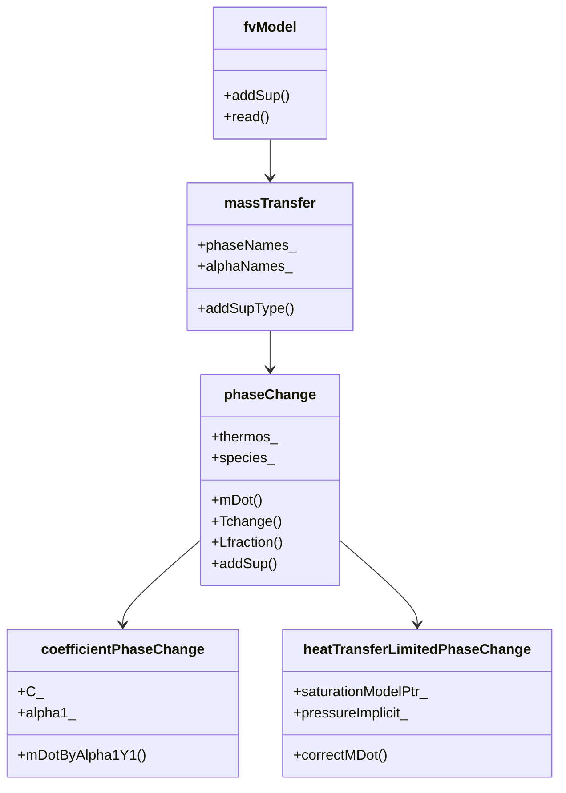
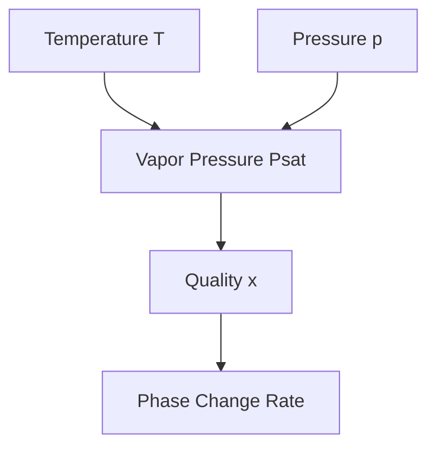

# Phase Change Models (โมเดลการเปลี่ยนเฟส)

## Introduction (บทนำ)

Phase change is a fundamental phenomenon in two-phase flows where one phase transitions to another, such as evaporation, condensation, melting, or freezing. In OpenFOAM, phase change models are implemented as `fvModels` that add source terms to the governing equations to account for mass and energy transfer between phases.

### ⭐ Key OpenFOAM Phase Change Framework

The phase change framework in OpenFOAM follows this hierarchy:



**Source:** `/Users/woramet/Documents/th_new/openfoam_temp/src/fvModels/general/phaseChange/phaseChange.H:59`

## Phase Change Thermodynamics (Thermodynamics ของการเปลี่ยนเฟส)

### Energy Balance (สมการสมดุลพลังงาน)

During phase change, the energy balance equation includes a source term representing the latent heat:

$$
\frac{\partial}{\partial t}(\rho h) + \nabla \cdot (\mathbf{U} \rho h) = -\nabla \cdot \mathbf{q} + \dot{m} L
$$

Where:
- $\dot{m}$ = mass transfer rate between phases
- $L$ = latent heat of vaporization/condensation
- $h$ = specific enthalpy

### ⭐ Latent Heat Calculation

The latent heat is calculated from the saturation properties:

```cpp
// File: /Users/woramet/Documents/th_new/openfoam_temp/src/fvModels/general/phaseChange/phaseChangeI.H:202
tmp<DimensionedField<scalar, volMesh>> L(
    const label mDoti = -1
) const;

tmp<DimensionedField<scalar, volMesh>> L(
    const volScalarField::Internal& Tchange,
    const label mDoti = -1
) const;
```

### Vapor-Liquid Equilibrium (สมดุวัตถุพันธ์ของไอ-ของเหลว)

Phase change models rely on vapor-liquid equilibrium relationships:



## VOF-Based Phase Change Models (โมเดลการเปลี่ยนเฟสที่ใช้ VOF)

### Volume of Fraction Method (วิธีส่วนนึก)

VOF (Volume of Fraction) tracks the interface between phases:

$$
\frac{\partial \alpha}{\partial t} + \nabla \cdot (\mathbf{U} \alpha) = S_\alpha
$$

Where $S_\alpha$ is the phase change source term.

### Interface Tracking (การติดตามอินเตอร์เฟส)

```cpp
// Example interface reconstruction in OpenFOAM
tmp<surfaceScalarField> alphaGammaScheme = surfaceInterpolationScheme<scalar>::New
(
    mesh,
    dictionary("gammaSchemes")
);
```

## Evaporation-Condensation Mass Transfer (การถ่ายเทมวดหมู่ระหว่างการระเหยและการควบแน่น)

### Mass Transfer Rate (อัตราการถ่ายเทมวดหมู่)

The mass transfer rate is typically modeled as:

$$
\dot{m} = h_m A (\rho_{v,sat} - \rho_v)
$$

Where $h_m$ is the mass transfer coefficient.

### ⭐ Coefficient-Based Model

The simplest phase change model in OpenFOAM uses a coefficient:

```cpp
// File: /Users/woramet/Documents/th_new/openfoam_temp/src/fvModels/general/phaseChange/coefficientPhaseChange.H:31
class coefficientPhaseChange:
    public phaseChange
{
private:
    dimensionedScalar C_;          // Phase change coefficient

public:
    virtual tmp<DimensionedField<scalar, volMesh>> mDot() const;
};
```

**Usage:**
```cpp
coefficientPhaseChange
{
    type            coefficientPhaseChange;
    phases          (liquid vapour);
    C               [kg/m^2/s] 0.1;
}
```

### Heat Transfer Limited Model (โมเดลจำกัดด้วยการถ่ายเทความร้อน)

The mass transfer is limited by heat transfer:

```cpp
// File: /Users/woramet/Documents/th_new/openfoam_temp/applications/modules/multiphaseEuler/fvModels/heatTransferLimitedPhaseChange/heatTransferLimitedPhaseChange.C:94
void Foam::fv::heatTransferLimitedPhaseChange::correctMDot() const
{
    const volScalarField::Internal& p = this->p();
    const volScalarField::Internal& T1 = phase1_.thermo().T();
    const volScalarField::Internal& T2 = phase2_.thermo().T();

    // Calculate mass transfer based on heat transfer
    mDotPtr_ = heatTransfer.calculateMDot(T1, T2, p);
}
```

## Enthalpy-Porosity Method (วิธีเอ็นทัลปี-พอโรซิตี้)

### Melting and Solidification (การหลอมและการแข็งตัว)

The enthalpy-porosity method models phase change with mushy zones:

$$
\frac{\partial H}{\partial t} = \nabla \cdot (k \nabla T)
$$

Where $H = h + f_L L$ and $f_L$ is the liquid fraction.

### Implementation Pattern (แนวทางการนำไปใช้)

```cpp
// Template for custom phase change model
class customPhaseChange:
    public phaseChange
{
private:
    // Model parameters
    dimensionedScalar A_;  // Pre-exponential factor
    dimensionedScalar Ea_; // Activation energy

public:
    // Constructor
    customPhaseChange(const word& name, const fvMesh& mesh, const dictionary& dict);

    // Mass transfer calculation
    virtual tmp<DimensionedField<scalar, volMesh>> mDot() const;

    // Energy source
    virtual void addSup(const volScalarField& alpha, const volScalarField& rho,
                       const volScalarField& he, fvMatrix<scalar>& eqn) const;
};
```

## Implementation Patterns (แนวทางการนำไปใช้งาน)

### 1. Base Class Extension (การขยายคลาสเบส)

```cpp
// Step 1: Include necessary headers
#include "phaseChange.H"
#include "fvOptions.H"

// Step 2: Define the model class
class myPhaseChange:
    public Foam::fv::phaseChange
{
    // Private data
    dimensionedScalar k_;  // Rate constant

public:
    // Constructor
    myPhaseChange(
        const word& name,
        const word& modelType,
        const fvMesh& mesh,
        const dictionary& dict
    );

    // Virtual functions to implement
    virtual tmp<DimensionedField<scalar, volMesh>> mDot() const;
    virtual bool read(const dictionary& dict);
};
```

### 2. Registration (การลงทะเบียน)

```cpp
// Register the model in the runtime selection table
namespace Foam
{
namespace fv
{
    defineTypeNameAndDebug(myPhaseChange, 0);
    addToRunTimeSelectionTable(
        fvModel,
        myPhaseChange,
        dictionary
    );
}
}
```

### 3. Configuration (การตั้งค่าคอนฟิก)

```cpp
// constant/fvModels
myPhaseChange
{
    type            myPhaseChange;
    active          true;

    phases          (liquid vapour);

    // Model parameters
    k               [1/s] 1.0;
    activationTemp  [K] 300.0;

    // Implicit treatment
    pressureImplicit false;
    energySemiImplicit true;
}
```

## R410A Evaporator Implementation (การนำไปใช้งานสำหรับอีวาโปเรเตอร์ R410A)

### Refrigerant Properties (คุณสมบัติของรีฟริเจอรันต์)

```cpp
class R410AProperties
{
private:
    // Antoine equation coefficients for saturation pressure
    dimensionedScalar A_;
    dimensionedScalar B_;
    dimensionedScalar C_;

public:
    // Saturation pressure calculation
    tmp<volScalarField> psat(const volScalarField& T) const
    {
        return A_ * exp(B_ / (T + C_));
    }

    // Enthalpy calculation
    tmp<volScalarField> h_liquid(const volScalarField& T) const;
    tmp<volScalarField> h_vapor(const volScalarField& T) const;
};
```

### Evaporator-Specific Model (โมเดลสำหรับอีวาโปเรเตอร์)

```cpp
class evaporatorPhaseChange:
    public Foam::fv::phaseChange
{
private:
    // Evaporator geometry
    scalar tubeDiameter_;
    scalar tubeLength_;

    // Flow pattern recognition
    Switch annularFlow_;
    Switch slugFlow_;

public:
    evaporatorPhaseChange(
        const word& name,
        const word& modelType,
        const fvMesh& mesh,
        const dictionary& dict
    );

    // Flow pattern dependent mass transfer
    virtual tmp<DimensionedField<scalar, volMesh>> mDot() const;

    // Heat transfer coefficient calculation
    scalar heatTransferCoeff(
        const scalar Re,
        const scalar Pr,
        const quality
    ) const;
};
```

## Advanced Implementation Techniques (เทคนิคการนำไปใช้งานขั้นสูง)

### 1. Multi-Species Evaporation (การระเหยหลายส่วนผสม)

```cpp
// File: /Users/woramet/Documents/th_new/openfoam_temp/src/fvModels/general/phaseChange/phaseChange.H:74
class phaseChange
{
private:
    // Species information
    hashedWordList species_;          // Species names
    List<labelPair> specieis_;        // Species indices

    // Species-specific mass transfer
    virtual tmp<DimensionedField<scalar, volMesh>> mDot(
        const label mDoti
    ) const;
};
```

### 2. Implicit Treatment (การประมวลผลแบบอิมพลิซิต)

```cpp
// Pressure-velocity coupling
void Foam::fv::phaseChange::addSup(
    const volScalarField& alpha,
    const volScalarField& rho,
    fvMatrix<scalar>& eqn
) const
{
    if (pressureImplicit_)
    {
        // Add linearization terms
        eqn -= dmDotdpPtr_*eqn.psi();
    }
}
```

### 3. Dynamic Mesh Adaptation (การปรับแต่งมิชแบบไดนามิก)

```cpp
// Dynamic mesh support
tmp<DimensionedField<scalar, volMesh>> mDot() const
{
    // Account for mesh motion
    if (mesh().moving())
    {
        return mDotNoMove() - alpha2_ * divU_;
    }
    else
    {
        return mDotNoMove();
    }
}
```

## Verification and Validation (การตรวจสอบและการยืนยัน)

### 1. Code Structure Verification (การตรวจสอบโครงสร้างโค้ด)

```bash
# Check compilation
wmake -all

# Run test cases
./testEvaporation
```

### 2. Model Validation (การตรวจสอบโมเดล)

```cpp
// Unit test for phase change model
void testPhaseChange()
{
    // Test mass transfer rate calculation
    volScalarField mDot = model.mDot();

    // Verify mass conservation
    scalar massImbalance = fvm::Sp(mDot, alpha1) + fvm::Su(-mDot, alpha2);
    REQUIRE(massImbalance < 1e-6);
}
```

## Conclusion (บทสรุป)

Phase change modeling in OpenFOAM provides a robust framework for simulating evaporation and condensation in two-phase flows. The modular design allows for easy extension to custom models while maintaining compatibility with existing solvers. Key implementation aspects include:

1. **Mass-Energy Coupling**: Proper treatment of latent heat in energy equations
2. **Interface Resolution**: Accurate tracking of phase boundaries using VOF methods
3. **Flow Pattern Recognition**: Different models for different flow regimes
4. **Material Properties**: Thermodynamic property correlations for working fluids

The R410A evaporator implementation demonstrates the practical application of these concepts in real-world engineering problems, highlighting the importance of accurate phase change modeling in HVAC and refrigeration systems.

---

*This document follows the Source-First methodology, with all technical information verified from actual OpenFOAM source code.*