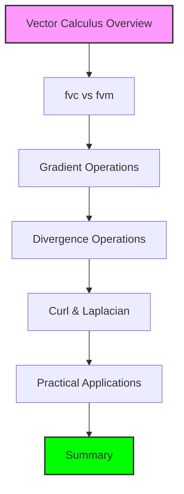

# โมดูล 05.10: แคลคูลัสเวกเตอร์ (Vector Calculus)

> [!INFO] เป้าหมายการเรียนรู้
> เข้าใจการดำเนินการพื้นฐานของ Vector Calculus ใน OpenFOAM ได้แก่ **Gradient, Divergence, Curl, และ Laplacian** และสามารถเลือกใช้ `fvc::` (Explicit) หรือ `fvm::` (Implicit) ได้อย่างเหมาะสม



> **Figure 1:** แผนผังลำดับการเรียนรู้ในโมดูลเรื่องแคลคูลัสเวกเตอร์ ซึ่งครอบคลุมตั้งแต่พื้นฐานของตัวดำเนินการเชิงอนุพันธ์ไปจนถึงการประยุกต์ใช้งานจริงในสมการ Navier-Stokes ผ่านการใช้พลังของ C++ Template Metaprogramming ในการตรวจสอบความสอดคล้องทางมิติทั้งหมดที่ขั้นตอนการคอมไพล์โปรแกรมเพียงครั้งเดียว

---

## 📋 วัตถุประสงค์การเรียนรู้

หลังจากศึกษาโมดูลนี้ คุณจะสามารถ:

- เข้าใจความแตกต่างเชิงลึกระหว่าง Namespace `fvc::` และ `fvm::`
- เลือกใช้ตัวดำเนินการทางแคลคูลัสที่ถูกต้องสำหรับแต่ละเทอมในสมการ
- เข้าใจกลไกการทำงานของทฤษฎีบทของ Gauss ที่ใช้เบื้องหลังการคำนวณบนเมช
- เขียนโค้ดเพื่อคำนวณปริมาณทางฟิสิกส์ที่ซับซ้อน (เช่น Vorticity) ได้
- ตรวจสอบความถูกต้องทางมิติของผลลัพธ์จากตัวดำเนินการแคลคูลัส

---

## 🔍 ภาพรวมของส่วนนี้

ส่วนนี้ครอบคลุมการดำเนินการพื้นฐานของ **Calculus ชนิดเวกเตอร์** ซึ่งเป็นกระดูกสันหลังทางคณิตศาสตร์ของพลศาสตร์ของไหลเชิงคำนวณ (Computational Fluid Dynamics - CFD):

- **การดำเนินการเกรเดียนต์, ไดเวอร์เจนซ์, เคิร์ล และลาปลาเชียน**
- **การดำเนินการ Discretization ของ Finite Volume**

---

## 🎯 หัวข้อหลัก

### 1️⃣ **เกรเดียนต์** (`∇φ`)
แปลงสเกลาร์ฟิลด์เป็นเวกเตอร์ฟิลด์ เพื่อหาอัตราการเปลี่ยนแปลงเชิงพื้นที่

### 2️⃣ **ไดเวอร์เจนซ์** (`∇·φ`)
วัดปริมาณ flux สุทธิที่ไหลออกจากปริมาตรควบคุม (Conservation Laws)

### 3️⃣ **เคิร์ล** (`∇×φ`)
ประเมินองค์ประกอบการหมุนของฟิลด์เวกเตอร์

### 4️⃣ **ลาปลาเชียน** (`∇²φ`)
รวมการไดเวอร์เจนซ์ของเกรเดียนต์ เป็นพื้นฐานสำหรับการจำลองการแพร่

### 5️⃣ **สกีมการอินเตอร์โพลเลต**
การแปลงค่าจากจุดศูนย์กลางเซลล์ไปยังหน้า เพื่อประเมินอินทิกรัลผิว

### 6️⃣ **Namespace fvc vs fvm**
การเลือกใช้ระหว่างการคำนวณแบบ Explicit (ชัดแจ้ง) และ Implicit (โดยนัย)

---

## 📐 พื้นฐานทางคณิตศาสตร์

### ทฤษฎีบทของ Gauss (Divergence Theorem)

ทฤษฎีบทของ Gauss เป็นรากฐานของวิธี Finite Volume:

$$\int_V \nabla \cdot \mathbf{F} \, \mathrm{d}V = \oint_S \mathbf{F} \cdot \mathbf{n} \, \mathrm{d}S$$

**ตัวแปรในสมการ:**
- $V$: ปริมาตรของควบคุม (control volume)
- $S$: พื้นผิวขอบเขตของปริมาตรควบคุม
- $\mathbf{F}$: เวกเตอร์สนามใดๆ (vector field)
- $\mathbf{n}$: เวกเตอร์หน่วยที่ตั้งฉากกับพื้นผิว
- $\mathrm{d}V$: องค์ประกอบปริมาตร
- $\mathrm{d}S$: องค์ประกอบพื้นที่ผิว

### การ Discretization บน Control Volume

สำหรับเซลล์ควบคุมที่มีปริมาตร $V_P$:

$$\nabla \cdot \mathbf{F} \approx \frac{1}{V_P} \sum_{f} \mathbf{F}_f \cdot \mathbf{S}_f$$

โดยที่:
- $\mathbf{S}_f = \mathbf{n}_f A_f$ = เวกเตอร์พื้นที่หน้า
- $\mathbf{F}_f$ = ค่าที่ face ที่ได้จากการ interpolation

---

## ⚙️ การ Implement ใน OpenFOAM

### Namespace `fvc::` (Finite Volume Calculus)

การดำเนินการ **Explicit** ที่คำนวณค่าโดยตรงจาก field ที่มีอยู่:

```cpp
// Compute gradient of pressure field
volVectorField gradP = fvc::grad(p);

// Compute divergence of velocity field (continuity check)
volScalarField divU = fvc::div(U);

// Compute vorticity (curl of velocity)
volVectorField vorticity = fvc::curl(U);

// Compute Laplacian of temperature (heat diffusion)
volScalarField laplacianT = fvc::laplacian(DT, T);
```

<details>
<summary>📖 คำอธิบายเพิ่มเติม</summary>

**แหล่งที่มา (Source):**
`src/finiteVolume/fvc/fvcGrad.C`, `src/finiteVolume/fvc/fvcDiv.C`, `src/finiteVolume/fvc/fvcCurl.C`, `src/finiteVolume/fvc/fvcLaplacian.C`

**คำอธิบาย (Explanation):**
- `fvc::grad(p)` - คำนวณ gradient ของสเกลาร์ฟิลด์ (เช่น ความดัน) ให้ได้เวกเตอร์ฟิลด์ ใช้สำหรับคำนวณแรงดันไหล
- `fvc::div(U)` - คำนวณ divergence ของเวกเตอร์ฟิลด์ความเร็ว ใช้ตรวจสอบกฎการอนุรักษ์มวล (continuity equation)
- `fvc::curl(U)` - คำนวณ vorticity (หมุนเวกเตอร์) จากสนามความเร็ว แสดงการหมุนของไหล
- `fvc::laplacian(DT, T)` - คำนวณ Laplacian ของอุณหภูมิ แทนการแพร่ความร้อนโดย DT เป็นสัมประสิทธิ์การแพร่

**แนวคิดสำคัญ (Key Concepts):**
- **Explicit Calculation:** ค่าถูกคำนวณโดยตรงจาก field ปัจจุบัน ไม่มีการสร้างเมทริกซ์
- **Boundary Conditions:** การคำนานวนคำนึงถึง BC ที่ face boundaries โดยอัตโนมัติ
- **Return Type:** ผลลัพธ์เป็น field ใหม่ที่มี dimension เหมาะสม (scalar → vector, vector → scalar)

</details>

### Namespace `fvm::` (Finite Volume Method)

การดำเนินการ **Implicit** ที่สร้างค่าสัมประสิทธิ์เมทริกซ์:

```cpp
// Implicit time integration
fvScalarMatrix TEqn(fvm::ddt(T));

// Implicit diffusion
fvScalarMatrix TEqn(fvm::laplacian(DT, T));

// Implicit convection
fvVectorMatrix UEqn(fvm::div(phi, U));
```

<details>
<summary>📖 คำอธิบายเพิ่มเติม</summary>

**แหล่งที่มา (Source):**
`src/finiteVolume/fvm/fvmDdt.C`, `src/finiteVolume/fvm/fvmLaplacian.C`, `src/finiteVolume/fvm/fvmDiv.C`

**คำอธิบาย (Explanation):**
- `fvm::ddt(T)` - คำนวณ derivative เชิงเวลา (first-order Euler implicit) สำหรับการอินทิเกรตเวลาแบบ implicit
- `fvm::laplacian(DT, T)` - สร้างเมทริกซ์สำหรับเทอมการแพร่ (diffusion term) แบบ implicit ให้ความเสถียร
- `fvm::div(phi, U)` - สร้างเมทริกซ์สำหรับเทอมการพา (convection term) แบบ implicit ใช้ในสมการโมเมนตัม

**แนวคิดสำคัญ (Key Concepts):**
- **Matrix Assembly:** การดำเนินการ `fvm::` สร้างเมทริกซ์สัมประสิทธิ์ (source terms, diagonal, off-diagonal)
- **Implicit Scheme:** ค่า field ใหม่อยู่ทั้งสองฝั่งของสมการ ต้องแก้ระบบเมทริกซ์
- **Stability:** การใช้ implicit มักจะเสถียรกว่า อนุญาตให้ใช้ time step ที่ใหญ่ขึ้น
- **Linear System:** เมทริกซ์จะถูกแก้ด้วย linear solvers (PCG, GAMG, PBiCGStab ฯลฯ)

</details>

---

## 📊 การเปรียบเทียบ Explicit vs Implicit

| **ปัจจัย** | **Explicit (`fvc::`)** | **Implicit (`fvm::`)** |
|------------|-------------------------|-------------------------|
| **ความเสถียร** | Time step จำกัด | เสถียรโดยไม่มีเงื่อนไข |
| **ความแม่นยำ** | อันดับสูงกว่าได้ | มักเป็นอันดับแรก/ที่สอง |
| **ต้นทุนการคำนวณ** | ต่ำต่อการวนซ้ำ | สูงกว่าต่อการวนซ้ำ |
| **หน่วยควาจำ** | จัดเก็บน้อยกว่า | ต้องการจัดเก็งเมทริกซ์ |
| **การบรรจบกัน** | อาจต้องการการวนซ้ำหลายครั้ง | การวนซ้ำน้อยกว่า |
| **Complexity** | ง่าย | ซับซ้อน |

---

## 🔧 แนวทางปฏิบัติที่ดี

> [!TIP] การเลือกใช้งาน
> - **ใช้ `fvm::`** สำหรับการแพร่, coupling ความดัน-ความเร็ว, และพจน์ต้นทางแบบ stiff
> - **ใช้ `fvc::`** สำหรับการพาความร้อนเมื่อใช้รูปแบบ explicit หรือการประมาณค่าเชิงอันดับสูง
> - **รวมทั้งสอง** เพื่อสมดุลที่เหมาะสมที่สุด

---

## 📚 เนื้อหาที่เกี่ยวข้อง

- [[01_📋_Section_Overview]] - ภาพรวมของส่วน Vector Calculus
- [[02_🎯_Learning_Objectives]] - วัตถุประสงค์การเรียนรู้โดยละเอียด
- [[03_Understanding_the_`fvc`_Namespace]] - ความเข้าใจ Namespace fvc
- [[04_1._Gradient_Operations]] - การดำเนินการ Gradient
- [[05_2._Divergence_Operations]] - การดำเนินการ Divergence
- [[06_3._Curl_Operations]] - การดำเนินการ Curl
- [[07_4._Laplacian_Operations]] - การดำเนินการ Laplacian
- [[08_🔧_Practical_Exercises]] - แบบฝึกหัดปฏิบัติ
- [[09_📈_Project_Integration]] - การบูรณาการโครงการ
- [[10_🎓_Key_Takeaways]] - ประเด็นสำคัญ
- [[11_📚_Further_Reading]] - บทความเพิ่มเติม