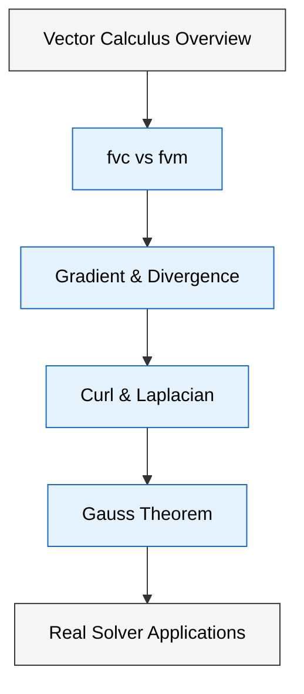

# โมดูล 05.10: แคลคูลัสเวกเตอร์ (Vector Calculus)

> [!TIP] ทำไม Vector Calculus สำคัญใน OpenFOAM?
> การดำเนินการทางแคลคูลัสเวกเตอร์ (Gradient, Divergence, Curl, Laplacian) เป็น **หัวใจของ CFD** เพราะทุกสมการทางฟิสิกส์ (Navier-Stokes, Energy, Turbulence) ประกอบด้วยตัวดำเนินการเหล่านี้ การเลือกใช้ `fvc::` (Explicit) หรือ `fvm::` (Implicit) ส่งผลโดยตรงต่อ **ความเสถียรและความแม่นยำ** ของการจำลอง หากเลือกผิด การคำนวณอาจ diverge หรือให้ผลลัพธ์ที่คลาดเคลื่อน



> **Figure 1:** แผนผังลำดับการเรียนรู้ในโมดูลเรื่องแคลคูลัสเวกเตอร์ ครอบคลุมตั้งแต่พื้นฐานของตัวดำเนินการเชิงอนุพันธ์ ทฤษฎีบทของ Gauss ไปจนถึงการประยุกต์ใช้งานจริงใน solver ของ OpenFOAM

---

## 🎯 วัตถุประสงค์การเรียนรู้ (Learning Objectives)

หลังจากศึกษาโมดูลนี้ คุณจะสามารถ:

- **เข้าใจความแตกต่างเชิงลึก** ระหว่าง Namespace `fvc::` และ `fvm::` และผลกระทบต่อความเสถียรของการคำนวณ
- **เลือกใช้ตัวดำเนินการทางแคลคูลัสที่ถูกต้อง** สำหรับแต่ละเทอมในสมการ Navier-Stokes (เทอมการพา การแพร่ ประกอบเวลา)
- **เข้าใจกลไกการทำงานของทฤษฎีบทของ Gauss** ที่ใช้เบื้องหลังการ discretization บนเมชใน Finite Volume Method
- **เขียนโค้ดเพื่อคำนวณปริมาณทางฟิสิกส์ที่ซับซ้อน** เช่น Vorticity, Q-Criterion, Strain Rate Tensor จากสนามความเร็ว
- **ตรวจสอบความถูกต้องทางมิติ** ของผลลัพธ์จากตัวดำเนินการแคลคูลัสโดยใช้ระบบ dimension ของ OpenFOAM
- **อ่านและวิเคราะห์โค้ดจาก solver จริง** เช่น `simpleFoam` หรือ `pimpleFoam` เพื่อเข้าใจการประยุกต์ใช้งานจริง

---

## 🔍 ภาพรวมของส่วนนี้

ส่วนนี้ครอบคลุมการดำเนินการพื้นฐานของ **Calculus ชนิดเวกเตอร์** ซึ่งเป็นกระดูกสันหลังทางคณิตศาสตร์ของพลศาสตร์ของไหลเชิงคำนวณ (Computational Fluid Dynamics - CFD):

- **การดำเนินการเกรเดียนต์, ไดเวอร์เจนซ์, เคิร์ล และลาปลาเชียน**
- **การดำเนินการ Discretization ของ Finite Volume บน OpenFOAM**
- **ความแตกต่างระหว่าง Explicit และ Implicit Schemes**
- **การประยุกต์ใช้งานใน Solver จริงของ OpenFOAM**

---

## 🎯 หัวข้อหลัก

### 1️⃣ **เกรเดียนต์** (`∇φ`)
แปลงสเกลาร์ฟิลด์เป็นเวกเตอร์ฟิลด์ เพื่อหาอัตราการเปลี่ยนแปลงเชิงพื้นที่ เช่น แรงดันไหล (`-∇p`)

### 2️⃣ **ไดเวอร์เจนซ์** (`∇·φ`)
วัดปริมาณ flux สุทธิที่ไหลออกจากปริมาตรควบคุม เป็นพื้นฐานของ Conservation Laws (มวล โมเมนตัม พลังงาน)

### 3️⃣ **เคิร์ล** (`∇×φ`)
ประเมินองค์ประกอบการหมุนของฟิลด์เวกเตอร์ ใช้คำนวณ Vorticity และ Q-Criterion

### 4️⃣ **ลาปลาเชียน** (`∇²φ`)
รวมการไดเวอร์เจนซ์ของเกรเดียนต์ เป็นพื้นฐานสำหรับการจำลองการแพร่ (diffusion)

### 5️⃣ **ทฤษฎีบทของ Gauss**
รากฐานของ Finite Volume Method ที่แปลง volume integral เป็น surface integral

### 6️⃣ **Namespace fvc vs fvm**
การเลือกใช้ระหว่างการคำนวณแบบ Explicit (ชัดแจ้ง) และ Implicit (โดยนัย) และผลกระทบต่อความเสถียรของการแก้สมการ

---

## 📐 พื้นฐานทางคณิตศาสตร์

> [!NOTE] **📂 OpenFOAM Context: Discretization Schemes**
> ทฤษฎีบทของ Gauss เป็นรากฐานของการ Discretization ใน Finite Volume Method ใน OpenFOAM การแปลงอินทิกรัลปริมาตรเป็นผลรวมบนหน้าเซลล์ถูกกำหนดในไฟล์ **`system/fvSchemes`** ภายใต้ keyword:
> - **`gradSchemes`**: กำหนดวิธีการคำนวณ Gradient (เช่น `Gauss linear`, `leastSquares`, `fourthGrad`)
> - **`divSchemes`**: กำหนดวิธีการคำนวณ Divergence (เช่น `Gauss upwind`, `Gauss linearUpwind`, `Gauss vanLeer`)
> - **`laplacianSchemes`**: กำหนดวิธีการคำนวณ Laplacian (เช่น `Gauss linear corrected`, `Gauss linear uncorrected`)
> - **`interpolationSchemes`**: กำหนดวิธีการ interpolate ค่าจาก center ไปยัง face (เช่น `linear`, `upwind`, `vanLeer`)
>
> ส่วนการแก้ระบบสมการเชิงเส้นที่เกิดจากการ Discretization ถูกควบคุมใน **`system/fvSolution`**:
> - **`solvers`**: กำหนด linear solver (PCG, GAMG, PBiCGStab) และ tolerance สำหรับแต่ละตัวแปร
> - **`algorithms`**: กำหนด pressure-velocity coupling algorithm (SIMPLE, PISO, PIMPLE)

### ทฤษฎีบทของ Gauss (Divergence Theorem)

ทฤษฎีบทของ Gauss เป็นรากฐานของวิธี Finite Volume Method โดยแปลง volume integral เป็น surface integral:

$$\int_V \nabla \cdot \mathbf{F} \, \mathrm{d}V = \oint_S \mathbf{F} \cdot \mathbf{n} \, \mathrm{d}S$$

**ตัวแปรในสมการ:**
- $V$: ปริมาตรของควบคุม (control volume)
- $S$: พื้นผิวขอบเขตของปริมาตรควบคุม
- $\mathbf{F}$: เวกเตอร์สนามใดๆ (vector field) - อาจเป็น velocity, flux, หรือ gradient
- $\mathbf{n}$: เวกเตอร์หน่วยที่ตั้งฉากกับพื้นผิว (unit normal vector)
- $\mathrm{d}V$: องค์ประกอบปริมาตร
- $\mathrm{d}S$: องค์ประกอบพื้นที่ผิว

> **Figure 2:** ทฤษฎีบทของ Gauss (Divergence Theorem) แสดงความสัมพันธ์ระหว่าง volume integral ของ divergence และ surface integral ของ flux ซึ่งเป็นรากฐานของ Finite Volume Method

### การ Discretization บน Control Volume

สำหรับเซลล์ควบคุมที่มีปริมาตร $V_P$ (P = owner cell):

$$\nabla \cdot \mathbf{F} \approx \frac{1}{V_P} \sum_{f} \mathbf{F}_f \cdot \mathbf{S}_f$$

โดยที่:
- $\mathbf{S}_f = \mathbf{n}_f A_f$ = เวกเตอร์พื้นที่หน้า (face area vector)
- $\mathbf{F}_f$ = ค่าที่ face ที่ได้จากการ interpolation ระหว่าง owner และ neighbor cells
- การรวมผลรวม ($\sum_f$) ครอบคลุมทุกหน้าเซลล์ (internal faces + boundary faces)

> **Figure 3:** การ Discretization บน control volume แสดงการประมาณค่า divergence ด้วยการรวม flux บนทุกหน้าเซลล์ ($\sum_f \mathbf{F}_f \cdot \mathbf{S}_f$) หารด้วยปริมาตรเซลล์ ($V_P$)

### ความสัมพันธ์ของตัวดำเนินการต่างๆ

```
Scalar Field (φ)
    ↓ fvc::grad()
Vector Field (∇φ)
    ↓ fvc::div() or fvc::curl()
Scalar/Vector Field
    ↓ fvc::laplacian() = div(grad())
Scalar Field
```

---

## ⚙️ การ Implement ใน OpenFOAM

> [!NOTE] **📂 OpenFOAM Context: C++ Source Code Structure**
> การดำเนินการทางแคลคูลัสทั้งหมดถูก Implement ไว้ในซอร์สโค้ด C++ ของ OpenFOAM ภายใต้ไดเรกทอรี **`src/finiteVolume/`**:
> - **`src/finiteVolume/fvc/`**: ไฟล์ Implementation สำหรับ Explicit operations (เช่น `fvcGrad.C`, `fvcDiv.C`, `fvcCurl.C`, `fvcLaplacian.C`)
> - **`src/finiteVolume/fvm/`**: ไฟล์ Implementation สำหรับ Implicit operations (เช่น `fvmDdt.C`, `fvmLaplacian.C`, `fvmDiv.C`)
> - **`src/finiteVolume/interpolation/`**: ไฟล์ Implementation สำหรับ interpolation schemes (เช่น `linearInterpolation.C`, `upwindInterpolation.C`)
> - **`src/finiteVolume/schemes/`**: ไฟล์ Implementation สำหรับ surface interpolation schemes (เช่น `surfaceInterpolationScheme.C`, `gaussGrad.C`)
>
> เมื่อคุณเขียน Solver หรือ Custom Function Object คุณจะต้อง `#include` ไฟล์ header เหล่านี้จาก **`src/finiteVolume/lnInclude/`**:
> ```cpp
> #include "fvcGrad.H"
> #include "fvcDiv.H"
> #include "fvcCurl.H"
> #include "fvcLaplacian.H"
> #include "fvmDdt.H"
> #include "fvmLaplacian.H"
> #include "fvmDiv.H"
> ```

### Namespace `fvc::` (Finite Volume Calculus)

การดำเนินการ **Explicit** ที่คำนวณค่าโดยตรงจาก field ที่มีอยู่:

```cpp
// Compute gradient of pressure field → pressure gradient force
volVectorField gradP = fvc::grad(p);

// Compute divergence of velocity field (continuity check)
volScalarField divU = fvc::div(U);

// Compute vorticity (curl of velocity) → turbulence analysis
volVectorField vorticity = fvc::curl(U);

// Compute Laplacian of temperature (heat diffusion)
volScalarField laplacianT = fvc::laplacian(DT, T);

// Compute magnitude of velocity gradient (strain rate)
volScalarField magGradU = mag(fvc::grad(U));

// Compute Q-Criterion (vortex identification)
volScalarField Q = 0.5 * (sqr(tr(fvc::grad(U))) - tr(symm(fvc::grad(U)) & fvc::grad(U)));
```

<details>
<summary>📖 คำอธิบายเพิ่มเติม</summary>

**แหล่งที่มา (Source):**
- `src/finiteVolume/fvc/fvcGrad.C`
- `src/finiteVolume/fvc/fvcDiv.C`
- `src/finiteVolume/fvc/fvcCurl.C`
- `src/finiteVolume/fvc/fvcLaplacian.C`

**คำอธิบาย (Explanation):**
- `fvc::grad(p)` - คำนวณ gradient ของสเกลาร์ฟิลด์ (เช่น ความดัน) ให้ได้เวกเตอร์ฟิลด์ ใช้สำหรับคำนวณแรงดันไหลในสมการโมเมนตัม
- `fvc::div(U)` - คำนวณ divergence ของเวกเตอร์ฟิลด์ความเร็ว ใช้ตรวจสอบกฎการอนุรักษ์มวล (continuity equation) ค่าที่เหมาะสมคือศูนย์สำหรับไหลไม่อัดตัว
- `fvc::curl(U)` - คำนวณ vorticity ($\omega = \nabla \times U$) จากสนามความเร็ว แสดงการหมุนของไหล ใช้วิเคราะห์โครงสร้าง turbulent
- `fvc::laplacian(DT, T)` - คำนวณ Laplacian ของอุณหภูมิ ($\nabla^2 T$) แทนการแพร่ความร้อนโดย DT เป็นสัมประสิทธิ์การแพร่ (diffusivity)

**แนวคิดสำคัญ (Key Concepts):**
- **Explicit Calculation:** ค่าถูกคำนวณโดยตรงจาก field ปัจจุบัน ไม่มีการสร้างเมทริกซ์ ผลลัพธ์พร้อมใช้ทันที
- **Boundary Conditions:** การคำนวณคำนึงถึง BC ที่ face boundaries โดยอัตโนมัติ (เช่น fixedValue, zeroGradient)
- **Return Type:** ผลลัพธ์เป็น field ใหม่ที่มี dimension เหมาะสม:
  - scalar → vector (grad)
  - vector → scalar (div)
  - vector → vector (curl)
  - scalar → scalar (laplacian)
- **Mesh Awareness:** การคำนวณคำนึงถึง non-orthogonality และ non-uniformity ของ mesh ผ่าน correction schemes

</details>

### Namespace `fvm::` (Finite Volume Method)

การดำเนินการ **Implicit** ที่สร้างค่าสัมประสิทธิ์เมทริกซ์:

```cpp
// Implicit time integration (first-order Euler implicit)
fvScalarMatrix TEqn(fvm::ddt(T));

// Implicit diffusion (creates diagonal + off-diagonal coefficients)
fvScalarMatrix TEqn(fvm::laplacian(DT, T));

// Implicit convection (creates upwind-biased matrix)
fvVectorMatrix UEqn(fvm::div(phi, U));

// Combined: full momentum equation
fvVectorMatrix UEqn(
    fvm::ddt(U)
  + fvm::div(phi, U)
  - fvm::laplacian(nu, U)
);
```

<details>
<summary>📖 คำอธิบายเพิ่มเติม</summary>

**แหล่งที่มา (Source):**
- `src/finiteVolume/fvm/fvmDdt.C`
- `src/finiteVolume/fvm/fvmLaplacian.C`
- `src/finiteVolume/fvm/fvmDiv.C`

**คำอธิบาย (Explanation):**
- `fvm::ddt(T)` - คำนวณ derivative เชิงเวลา ($\partial T/\partial t$) แบบ first-order Euler implicit สำหรับการอินทิเกรตเวลาแบบ implicit ให้ความเสถียรสูง
- `fvm::laplacian(DT, T)` - สร้างเมทริกซ์สำหรับเทอมการแพร่ (diffusion term: $\nabla \cdot (D_T \nabla T)$) แบบ implicit สร้าง diagonal-dominant matrix ที่เสถียร
- `fvm::div(phi, U)` - สร้างเมทริกซ์สำหรับเทอมการพา (convection term: $\nabla \cdot (\phi \mathbf{U})$) แบบ implicit ใช้ในสมการโมเมนตัม

**แนวคิดสำคัญ (Key Concepts):**
- **Matrix Assembly:** การดำเนินการ `fvm::` สร้างเมทริกซ์สัมประสิทธิ์:
  - **Diagonal coefficients** ($a_P$): ค่าสัมประสิทธิ์ที่ cell center หลัก
  - **Off-diagonal coefficients** ($a_N$): ค่าสัมประสิทธิ์ที่ neighbor cells
  - **Source terms** ($b$): เทอมที่ไม่ขึ้นกับตัวแปรที่แก้
- **Implicit Scheme:** ค่า field ใหม่อยู่ทั้งสองฝั่งของสมการ ต้องแก้ระบบเมทริกซ์ $[A]x = b$
- **Stability:** การใช้ implicit มักจะเสถียรกว่า (unconditionally stable) อนุญาตให้ใช้ time step ที่ใหญ่ขึ้น
- **Linear System:** เมทริกซ์จะถูกแก้ด้วย linear solvers ที่กำหนดใน `system/fvSolution`:
  - **PCG** (Preconditioned Conjugate Gradient): สำหรับ symmetric matrices (Laplacian)
  - **PBiCGStab** (Preconditioned Bi-Conjugate Gradient Stabilized): สำหรับ asymmetric matrices (convection)
  - **GAMG** (Geometric Agglomerated Algebraic Multi-Grid): สำหรับ large-scale problems
- **Under-Relaxation:** ใช้ร่วมกับ under-relaxation factors ใน `fvSolution` เพื่อเพิ่มความเสถียรของการวนซ้ำ

</details>

---

## 📊 การเปรียบเทียบ Explicit vs Implicit

| **ปัจจัย** | **Explicit (`fvc::`)** | **Implicit (`fvm::`)** |
|------------|-------------------------|-------------------------|
| **ความเสถียร** | Time step จำกัด (CFL condition) | เสถียรโดยไม่มีเงื่อนไข (unconditionally stable) |
| **ความแม่นยำ** | อันดับสูงกว่าได้ (high-order schemes) | มักเป็นอันดับแรก/ที่สอง (first/second order) |
| **ต้นทุนการคำนวณ** | ต่ำต่อการวนซ้ำ (direct calculation) | สูงกว่าต่อการวนซ้ำ (matrix solve) |
| **หน่วยความจำ** | จัดเก็บน้อยกว่า (no matrix storage) | ต้องการจัดเก็บเมทริกซ์ (sparse matrix) |
| **การบรรจบกัน** | อาจต้องการการวนซ้ำหลายครั้ง (small Δt) | การวนซ้ำน้อยกว่า (large Δt possible) |
| **Complexity** | ง่าย (field-to-field) | ซับซ้อน (matrix assembly + solve) |
| **Use Case** | Post-processing, source terms, explicit convection | Diffusion, time derivative, pressure-velocity coupling |

> **Table 1:** การเปรียบเทียบระหว่าง Explicit operations (`fvc::`) และ Implicit operations (`fvm::`) ใน OpenFOAM แสดงความแตกต่างในด้านความเสถียร ความแม่นยำ ต้นทุนการคำนวณ และ use cases ที่เหมาะสม

---

## 🔧 แนวทางปฏิบัติที่ดี

> [!NOTE] **📂 OpenFOAM Context: Application in Real Solvers**
> การเลือกใช้ `fvc::` หรือ `fvm::` ขึ้นอยู่กับ **ประเภทของ Solver** และ **ลักษณะของปัญหา**:
>
> **Standard Solvers ใน `applications/solvers/incompressible/`:**
> - **`simpleFoam`**: ใช้ `fvm::` สำหรับ diffusion/pressure-velocity coupling เพื่อความเสถียรใน steady-state
> - **`pimpleFoam`**: ใช้ `fvm::` สำหรับ time derivative และ diffusion ใช้ `fvc::` สำหรับ explicit source terms
> - **`interFoam`**: ใช้ `fvc::` สำหรับ convection terms เพื่อความแม่นยำใน multiphase flow
>
> **Custom Code Examples:**
> - **`src/finiteVolume/cfdTools/general/`**: ฟังก์ชัน utility สำหรับคำนวณปริมาณทางฟิสิกส์
> - **`applications/solvers/incompressible/simpleFoam/UEqn.H`**: ตัวอย่างการสร้าง momentum equation

> [!TIP] แนวทางการเลือกใช้งาน
> - **ใช้ `fvm::`** สำหรับ:
>   - การแพร่ (diffusion terms) → เสถียรและ diagonal-dominant
>   - coupling ความดัน-ความเร็ว (pressure-velocity coupling) → จำเป็นสำหรับ SIMPLE/PISO
>   - พจน์ต้นทางแบบ stiff (stiff source terms) → ป้องกันการ diverge
> - **ใช้ `fvc::`** สำหรับ:
>   - การพา (convection terms) เมื่อใช้รูปแบบ explicit หรือ high-order schemes
>   - การประมาณค่าเชิงอันดับสูง (high-order approximations)
>   - Post-processing (คำนวณ vorticity, Q-criterion, strain rate)
> - **รวมทั้งสอง** เพื่อสมดุลที่เหมาะสมที่สุด (balance stability + accuracy)

---

## 🧩 การใช้งานใน Solver จริง

### ตัวอย่าง: simpleFoam Momentum Equation

```cpp
// applications/solvers/incompressible/simpleFoam/UEqn.H
tmp<fvVectorMatrix> UEqn
(
    fvm::div(phi, U)           // Implicit convection (asymmetric matrix)
  + fvm::laplacian(nu, U)      // Implicit diffusion (symmetric matrix)
  + fvc::div(MRF)              // Explicit source term (MRF)
);

UEqn.relax();  // Under-relaxation for stability

// Pressure-velocity coupling (SIMPLE algorithm)
if (simple.momentumPredictor())
{
    solve(UEqn == -fvc::grad(p));  // Solve: A*U = -grad(p)
}
```

**คำอธิบาย:**
- `fvm::div(phi, U)` - สร้าง asymmetric matrix สำหรับ convection
- `fvm::laplacian(nu, U)` - สร้าง symmetric matrix สำหรับ diffusion
- `fvc::div(MRF)` - เพิ่ม source term จาก Multiple Reference Frame แบบ explicit
- `fvc::grad(p)` - คำนวณ pressure gradient แบบ explicit ใช้เป็น source term

> **Figure 4:** ตัวอย่างการใช้งาน `fvm::` และ `fvc::` ใน simpleFoam solver แสดงการสร้าง momentum equation ที่รวมทั้ง implicit convection/diffusion และ explicit source terms

### ตัวอย่าง: คำนวณ Vorticity สำหรับ Post-processing

```cpp
// Custom function object: compute vorticity
volVectorField vorticity
(
    IOobject
    (
        "vorticity",
        runTime.timeName(),
        mesh,
        IOobject::NO_READ,
        IOobject::AUTO_WRITE
    ),
    fvc::curl(U)  // Explicit calculation
);

// Compute enstrophy (vorticity magnitude squared)
volScalarField enstrophy
(
    IOobject
    (
        "enstrophy",
        runTime.timeName(),
        mesh,
        IOobject::NO_READ,
        IOobject::AUTO_WRITE
    ),
    0.5 * magSqr(vorticity)  // |ω|² / 2
);
```

---

## 📚 เนื้อหาที่เกี่ยวข้อง

- **บทถัดไป:** [01_Introduction.md](01_Introduction.md) — บทนำสู่ Vector Calculus แบบละเอียด
- **fvc vs fvm:** [02_fvc_vs_fvm.md](02_fvc_vs_fvm.md) — เปรียบเทียบ Explicit และ Implicit แบบเจาะลึก
- **โมดูลก่อนหน้า:** [../08_FIELD_ALGEBRA/00_Overview.md](../08_FIELD_ALGEBRA/00_Overview.md) — Field Algebra and Operator Overloading
- **OpenFOAM Documentation:** [https://www.openfoam.com/documentation/](https://www.openfoam.com/documentation/)

---

## 🧠 Concept Check

<details>
<summary><b>1. ทำไมต้องใช้ทฤษฎีบทของ Gauss ในการ discretize ตัวดำเนินการ vector calculus?</b></summary>

ทฤษฎีบทของ Gauss แปลง **volume integral** ของ divergence ให้เป็น **surface integral** ซึ่งทำให้สามารถคำนวณการเปลี่ยนแปลงในเซลล์โดยการรวมผลรวม flux ที่ผิวเซลล์ทั้งหมด ($\sum_f \mathbf{F}_f \cdot \mathbf{S}_f$) วิธีนี้รักษา **conservation properties** ได้อย่างสมบูรณ์ (เพราะ flux ที่ออกจากเซลล์หนึ่งเป็น flux ที่เข้าสู่เซลล์ข้างเคียง) และเหมาะกับ Finite Volume Method ที่ใช้ control volumes ที่ไม่สม่ำเสมอ

</details>

<details>
<summary><b>2. ความแตกต่างหลักระหว่าง `fvc::` และ `fvm::` คืออะไร?</b></summary>

- **`fvc::`** (Explicit) คำนวณค่าโดยตรงจาก field ที่รู้แล้ว → ผลลัพธ์เป็น field ใหม่ทันที → ไม่สร้างเมทริกซ์ → เร็วแต่เสถียรน้อยกว่า
- **`fvm::`** (Implicit) สร้าง matrix coefficients → ต้องแก้ระบบสมการเชิงเส้น → ช้ากว่าแต่เสถียรกว่า

**Rule of Thumb:** ใช้ `fvm::` สำหรับตัวแปรที่กำลังหา (unknown variables) ในสมการหลัก ใช้ `fvc::` สำหรับตัวแปรที่รู้ค่าแล้ว (known variables) หรือสำหรับ post-processing

</details>

<details>
<summary><b>3. ถ้าต้องการคำนวณ vorticity ($\omega = \nabla \times U$) ควรใช้ `fvc::` หรือ `fvm::`?</b></summary>

ใช้ **`fvc::curl(U)`** เพราะ:
1. Velocity field **U** เป็นค่าที่รู้แล้ว (known field) จากการแก้ momentum equation
2. ต้องการผลลัพธ์ (vorticity) **ทันที** สำหรับ post-processing หรือ visualization
3. ไม่ต้องการสร้างสมการเพื่อหา vorticity (ไม่มี vorticity equation ใน Navier-Stokes)
4. การใช้ `fvc::` จะเร็วกว่าและไม่ต้องแก้เมทริกซ์เพิ่ม

**ตัวอย่างการใช้งาน:**
```cpp
volVectorField vorticity = fvc::curl(U);  // Correct: explicit
volScalarField vortMag = mag(vorticity);  // Magnitude for visualization
```

</details>

<details>
<summary><b>4. ทำไมใน simpleFoam ใช้ fvm::div(phi, U) แต่ใน interFoam ใช้ fvc::div(phi, U)?</b></summary>

- **simpleFoam** (steady-state incompressible):
  - ใช้ `fvm::div(phi, U)` เพราะต้องการความเสถียรในการแก้ steady-state
  - Implicit convection ช่วยให้ convergence ดีขึ้นแม้จะใช้ under-relaxation
  - เหมาะกับ flow ที่ไม่มี shock หรือ การเปลี่ยนแปลงรุนแรง

- **interFoam** (transient multiphase):
  - ใช้ `fvc::div(phi, U)` หรือ blended schemes เพราะต้องการความแม่นยำสูงในการติดตาม interface
  - Explicit convection ใช้ high-order schemes (MULES, CICSAM) ได้ง่ายกว่า
  - Transient nature ทำให้ time step จำกัดอยู่แล้ว (CFL condition) จึงใช้ explicit ได้

</details>

---

## 💡 สรุปประเด็นสำคัญ (Key Takeaways)

1. **ทฤษฎีบทของ Gauss เป็นรากฐานของ Finite Volume Method** โดยแปลง volume integral เป็น surface integral ทำให้สามารถ discretize ตัวดำเนินการ vector calculus บน mesh ที่ไม่สม่ำเสมอได้อย่างถูกต้อง

2. **`fvc::` (Explicit)** ใช้สำหรับ:
   - Post-processing (vorticity, Q-criterion, strain rate)
   - การคำนวณจาก field ที่รู้ค่าแล้ว
   - Explicit convection schemes ที่ต้องการความแม่นยำสูง

3. **`fvm::` (Implicit)** ใช้สำหรับ:
   - Diffusion terms (สร้าง symmetric matrices)
   - Time derivatives (unconditionally stable)
   - Pressure-velocity coupling (SIMPLE/PISO/PIMPLE)

4. **การเลือก scheme ใน `system/fvSchemes`** มีผลโดยตรงต่อความแม่นยำและความเสถียร:
   - `Gauss linear`: second-order central differencing (แม่นยำแต่อาจ oscillate)
   - `Gauss upwind`: first-order upwind (เสถียรแต่ numerical diffusion สูง)
   - `Gauss linearUpwind`: second-order upwind (สมดุลระหว่างความแม่นยำและความเสถียร)

5. **การตรวจสอบความถูกต้องทางมิติ** ใช้ `dimensions` keyword ใน field definitions เพื่อตรวจสอบว่าการคำนวณมีความสอดคล้องทางมิติ (dimensional homogeneity)

6. **การอ่านโค้ด solver จริง** เช่น `simpleFoam`, `pimpleFoam` ช่วยให้เข้าใจการประยุกต์ใช้ `fvc::` และ `fvm::` ในบริบทที่แท้จริงของการแก้สมการ Navier-Stokes