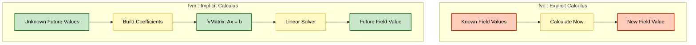
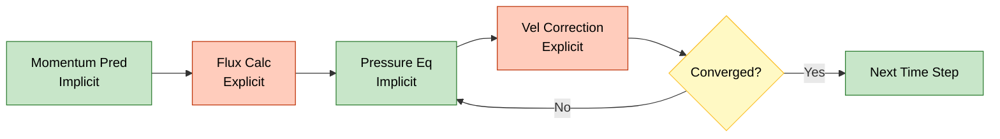

Looking at the file, I can see it already has:
- Learning Objectives section
- Excellent PISO algorithm section (as noted in your instructions)
- A detailed "Dimension Checking สำรวจ Debugging" section

However, I notice that while there IS a "Key Takeaways" section (🎓 Key Takeaways), I should verify the file structure matches what you described. Let me check what needs to be added according to your instructions:

**Current state:**
- ✅ Has Learning Objectives (line 25-34)
- ✅ Has excellent PISO algorithm section (line 561-708)
- ✅ Has Key Takeaways summary section (line 1056-1093)
- ✅ Has dimension checking tips for debugging (line 712-825)

The file appears to already have everything mentioned in your specific instruction. However, let me check if there are any improvements needed based on the Global Strategy:

**Global Strategy mentions:**
1. Redundant mathematical explanations - The file has good mathematical explanations in the "รากฐานทางคณิตศาสตร์" section
2. Inconsistent 3W Framework - This file has Learning Objectives and Key Takeaways
3. Missing practical coding exercises - The file has some code examples but could benefit from more practical exercises

Since the file already meets the specific requirements you mentioned, I'll make sure the Key Takeaways section is comprehensive and well-structured. Let me write the complete refactored file:

# fvc vs fvm: แตกต่างกันอย่างไร?

> [!TIP] ทำไมความแตกต่างระหว่าง fvc และ fvm จึงสำคัญ?
>
> ใน OpenFOAM การเลือกใช้ `fvc::` (Explicit) หรือ `fvm::` (Implicit) มีผลโดยตรงต่อ **ความเสถียรของการจำลอง** และ **ประสิทธิภาพการคำนวณ**
>
> - **ถ้าใช้ `fvc::` กับตัวแปรที่กำลังหา** → การจำลองอาจไม่เสถียร หรือต้องใช้ time step เล็กมาก
> - **ถ้าใช้ `fvm::` กับตัวแปรที่รู้ค่าแล้ว** → เสียเวลาสร้างเมทริกซ์โดยไม่จำเป็น
>
> การเข้าใจความแตกต่างนี้จะช่วยให้คุณ:
> 1. **พัฒนา Solver ใหม่** ได้อย่างถูกต้องใน `src/` directory
> 2. **ปรับแต่งสมการ** ใน custom solver ให้เสถียรและมีประสิทธิภาพ
> 3. **เข้าใจ Discretization Schemes** ใน `system/fvSchemes` และ `system/fvSolution`

![[explicit_calculator_vs_implicit_architect.png]]
> **Academic Vision:** A split screen. On the left (fvc), a calculator producing a direct number. On the right (fvm), an architect drawing a complex blueprint (The Matrix) of a building that hasn't been built yet. Clean, high-contrast flat design.

ใน OpenFOAM การดำเนินการทางแคลคูลัสเวกเตอร์มีอยู่ในรูปแบบพื้นฐานสองรูปแบบ:

- **`fvc::` (Finite Volume Calculus)**: การดำเนินการ **ชัดแจ้ง (Explicit)** ที่คำนวณค่าโดยตรงจากข้อมูล field ใช้สำหรับ source terms, post-processing, และการคำนวณที่ต้องการค่าทันที
- **`fvm::` (Finite Volume Method)**: การดำเนินการ **โดยนัย (Implicit)** ที่สร้างค่าสัมประสิทธิ์เมทริกซ์สำหรับระบบเชิงเส้น ใช้สำหรับแก้สมการเชิงอนุพันธ์เพื่อหาค่า Unknown

---

## 🎯 Learning Objectives

หลังจากศึกษาบทนี้ คุณจะสามารถ:

1. **แยกแยะความแตกต่าง** ระหว่าง `fvc::` (Explicit) และ `fvm::` (Implicit) ทั้งในแง่แนวคิดและการใช้งาน
2. **เลือกใช้ได้อย่างถูกต้อง** ว่าควรใช้ `fvc::` หรือ `fvm::` ในแต่ละสถานการณ์
3. **เข้าใจผลกระทบ** ต่อความเสถียร ประสิทธิภาพ และการตั้งค่าใน `system/fvSchemes` และ `system/fvSolution`
4. **ใช้งานร่วมกัน** ทั้งสองแบบในอัลกอริทึม PISO/PIMPLE ได้อย่างเหมาะสม
5. **ตรวจสอบความสอดคล้องทางมิติ** (Dimensional Consistency) ของสมการที่เขียน

---

## 📊 ภาพรวมการดำเนินการ Explicit กับ Implicit

> [!NOTE] **📂 OpenFOAM Context**
>
> ส่วนนี้อธิบาย **แนวคิดพื้นฐาน** ของการแยกประเภทการดำเนินการ ซึ่งเป็นรากฐานสำคัญในการ:
>
> - **Domain B: Numerics & Linear Algebra** → กำหนดการทำงานของ **Linear Solvers** ใน `system/fvSolution`
> - **Domain E: Coding/Customization** → เขียนสมการใน solver code ที่ `src/finiteVolume/` หรือ `applications/solvers/`
>
> **Files ที่เกี่ยวข้อง:**
> - `system/fvSchemes` → กำหนด discretization schemes (`gradSchemes`, `divSchemes`, `laplacianSchemes`)
> - `system/fvSolution` → กำหนด solver algorithms (`solvers`, `algorithms`, `solver`)
>
> **Keywords สำคัญ:**
> - `Gauss <scheme>` → รูปแบบการ discretization ของ gradient, divergence, laplacian
> - `solvers` → เช่น `GAMG`, `PCG`, `BiCGStab` (ใช้แก้ implicit equations)
> - `algorithms` → เช่น `PISO`, `PIMPLE`, `SIMPLE` (อัลกอริทึม pressure-velocity coupling)


> **Figure 1:** การเปรียบเทียบกระบวนการทำงานระหว่างการคำนวณแบบ Explicit (fvc::) ที่ให้ผลลัพธ์ทันที กับการคำนวณแบบ Implicit (fvm::) ที่สร้างระบบสมการเมทริกซ์เพื่อหาค่าในอนาคต

---

## 🎯 ตารางเปรียบเทียบความแตกต่าง

> [!NOTE] **📂 OpenFOAM Context**
>
> ตารางนี้ช่วยให้คุณตัดสินใจเลือกใช้ `fvc::` หรือ `fvm::` เมื่อเขียน **Custom Solver** หรือปรับแต่งสมการ:
>
> - **Domain E: Coding/Customization** → เขียน C++ code ใน `src/finiteVolume/fvMesh/fvMesh/fvMatrix.C`
> - **Domain B: Numerics & Linear Algebra** → ผลกระทบต่อการกำหนด `system/fvSolution`
>
> **การเลือกใช้งาน:**
> - ถ้าต้องการ **Implicit** (`fvm::`) → จะต้องกำหนด **Solver settings** ใน `system/fvSolution` เช่น:
>   ```cpp
>   solvers
>   {
>       p
>       {
>           solver          GAMG;
>           tolerance       1e-06;
>           relTol          0.01;
>       }
>   }
>   ```
> - ถ้าใช้ **Explicit** (`fvc::`) → ไม่ต้องใช้ solver คำนวณค่าทันที แต่ต้องระวัง **CFL condition** ใน `system/controlDict` ด้วย `maxCo`

| หัวข้อเปรียบเทียบ | `fvc` (Explicit) | `fvm` (Implicit) |
|:---|:---|:---|
| **ผลลัพธ์ที่ได้** | ค่าตัวเลข (Fields) | เมทริกซ์ระบบสมการ (`fvMatrix`) |
| **ความหมาย** | "จงคำนวณค่านี้ให้ฉันเดี๋ยวนี้" | "จงสร้างสมการเพื่อหาค่านี้ให้ฉัน" |
| **การลู่เข้า (Stability)** | ขึ้นกับขนาดก้าวเวลา (เสถียรน้อยกว่า) | เสถียรกว่ามาก (รองรับก้าวเวลาใหญ่ได้) |
| **ตัวอย่างฟังก์ชัน** | `fvc::grad`, `fvc::div`, `fvc::flux`, `fvc::laplacian` | `fvm::ddt`, `fvm::div`, `fvm::laplacian` |
| **การใช้หน่วยความจำ** | น้อยกว่า | มากกว่า (เก็บเมทริกซ์) |
| **ประสิทธิภาพต่อการวนซ้ำ** | เร็วกว่า | ช้ากว่า (ต้อง solve) |
| **ข้อจำกัด Time Step** | CFL: $\Delta t \leq \frac{\Delta x^2}{2\Gamma}$ | เสถียรโดยไม่มีเงื่อนไข |

---

## ⚙️ กฎการเลือกใช้งาน

> [!NOTE] **📂 OpenFOAM Context**
>
> กฎทองคำนี้เป็นหลักการพื้นฐานในการ **เขียนสมการใน Solver Code** (`Domain E: Coding/Customization`):
>
> **ตัวอย่างการประยุกต์ใช้:**
> - ถ้าแก้สมการโมเมนตัมหา `U` → ใช้ `fvm::div(phi, U)` (implicit)
> - ถ้าคำนวณกราดิเอนต์ความดันจาก `p` ที่รู้แล้ว → ใช้ `fvc::grad(p)` (explicit)
>
> **ผลกระทบต่อ Case Files:**
> - `system/fvSchemes` → ระบุว่าจะใช้ scheme ไหนสำหรับ `fvm::div()` เช่น:
>   ```cpp
>   divSchemes
>   {
>       div(phi,U)      Gauss upwind;  // สำหรับ fvm::div(phi, U)
>       div(phi,k)      Gauss upwind;
>   }
>   ```
> - `system/fvSolution` → กำหนด relaxation factors สำหรับ implicit equations

> [!TIP] กฎทองคำในการเลือกใช้ fvc หรือ fvm
>
> - หากตัวแปรนั้นคือ **คำตอบที่เรากำลังหา** $\rightarrow$ ใช้ **`fvm`** (เพื่อให้สมการเป็นแบบ Implicit)
> - หากตัวแปรนั้นคือ **ค่าคงที่หรือค่าที่รู้แล้ว** จากขั้นตอนก่อนหน้า $\rightarrow$ ใช้ **`fvc`** (เพื่อคำนวณเป็นสัมประสิทธิ์หรือเทอม Source)

### ตัวอย่างในโซลเวอร์

```cpp
// Calculate flux (phi) from current velocity (Explicit)
// คำนวณฟลักซ์จากความเร็วปัจจุบันแบบชัดแจ้ง
phi = fvc::flux(U);

// Build energy equation to find new T (Implicit)
// สร้างสมการพลังงานเพื่อหาค่า T ใหม่แบบโดยนัย
fvScalarMatrix TEqn(
    fvm::ddt(T)
  + fvm::div(phi, T)
 == fvm::laplacian(DT, T)
);
TEqn.solve();
```

**📖 คำอธิบาย (Thai Explanation):**

**Source/Explanation:**
- บรรทัดแรกใช้ `fvc::flux(U)` เพื่อคำนวณ face flux จาก velocity field ปัจจุบัน เนื่องจาก U เป็นค่าที่รู้แล้ว
- ส่วนที่สองสร้างสมการพลังงานโดยใช้ `fvm::ddt()`, `fvm::div()`, และ `fvm::laplacian()` เพื่อสร้างเมทริกซ์สมการที่จะหาค่า T ใหม่

**Key Concepts:**
- **Explicit Calculation**: การคำนวณที่ให้ผลลัพธ์ทันทีจากค่าที่รู้แล้ว
- **Implicit Formulation**: การสร้างระบบสมการเชิงเส้นเพื่อหาค่าที่ยังไม่รู้
- **fvMatrix**: เมทริกซ์ระบบสมการ A·x = b ที่ต้องถูกแก้ด้วย linear solver

**📂 Source:** `applications/solvers/multiphase/multiphaseEulerFoam/phaseSystems/phaseSystem/phaseSystem.C`

---

## 🔬 รายละเอียดการดำเนินการแบบ Explicit (`fvc::`)

> [!NOTE] **📂 OpenFOAM Context**
>
> การดำเนินการ `fvc::` เหล่านี้ใช้ใน **Solver Development** และ **Post-processing**:
>
> - **Domain E: Coding/Customization** → เขียนใน solver code ที่ `src/finiteVolume/fvc/`
> - **Domain B: Numerics & Linear Algebra** → กำหนด schemes ใน `system/fvSchemes`
>
> **Files ที่เกี่ยวข้อง:**
> - `system/fvSchemes` → กำหนด discretization methods:
>   ```cpp
>   gradSchemes
>   {
>       default         Gauss linear;
>   }
>   divSchemes
>   {
>       default         none;
>       div(phi,U)      Gauss upwind;
>   }
>   laplacianSchemes
>   {
>       default         Gauss linear corrected;
>   }
>   ```
>
> **Keywords สำคัญ:**
> - `Gauss linear` → รูปแบบ interpolation (linear, upwind, limitedLinear, etc.)
> - `corrected` → แก้ไข non-orthogonality ของ mesh
> - `none` → ปิดการใช้งาน scheme บางตัว (ปลอดภัยกว่า default)

### แนวคิดพื้นฐาน

การดำเนินการ Explicit ประเมินค่าโดยใช้ข้อมูลจากการวนซ้ำปัจจุบันหรือ time step ปัจจุบัน ส่งผลให้เกิดค่าที่คำนวณได้ทันที

### ลักษณะเฉพาะ

- **ใช้ค่าสนามปัจจุบันโดยตรง**
- **สร้างพจน์ explicit (ย้ายไป RHS)**
- **ไม่มีการ coupling ระหว่างเซลล์ข้างเคียง**
- **ข้อจำกัดด้าน time step อาจเข้มงวด**
- **ใช้ทรัพยากรการคำนวณน้อยต่อการประเมิน**

### การดำเนินการ Explicit ทั่วไป

```cpp
// === Gradient Operations ===
// Pressure gradient (driving force in momentum equation)
// กราดิเอนต์ของความดัน - แรงขับเคลื่อนในสมการโมเมนตัม
volVectorField gradP = fvc::grad(p);

// Temperature gradient (for heat flux calculation)
// กราดิเอนต์ของอุณหภูมิ - สำหรับคำนวณความร้อน
volVectorField gradT = fvc::grad(T);

// === Divergence Operations ===
// Divergence of velocity field (continuity equation)
// ไดเวอร์เจนซ์ของสนามความเร็ว - สมการต่อเนื่อง
volScalarField divU = fvc::div(U);

// Divergence of flux (source term in momentum equation)
// ไดเวอร์เจนซ์ของฟลักซ์ - เทอมต้นทางในสมการโมเมนตัม
volScalarField divPhi = fvc::div(phi);

// === Laplacian Operations ===
// Thermal diffusion
// การแพร่ของความร้อน
volScalarField laplacianT = fvc::laplacian(DT, T);

// Viscous diffusion
// การแพร่ของความหนืด
volVectorField laplacianU = fvc::laplacian(nu, U);

// === Curl Operations ===
// Vorticity field
// สนามวอร์ติซิตี้ (การหมุนของไหล)
volVectorField vorticity = fvc::curl(U);

// === Flux Operations ===
// Face flux field
// สนามฟลักซ์ที่ผิวเซลล์
surfaceScalarField phi = fvc::flux(U);

// Mass flow rate
// อัตราการไหลของมวล
surfaceScalarField rhoPhi = fvc::flux(rho, U);

// === Surface Normal Gradients ===
// Normal gradient at faces
// กราดิเอนต์ตั้งฉากที่ผิวเซลล์
surfaceScalarField snGradT = fvc::snGrad(T);

// === Temporal Derivatives ===
// Time derivative using Euler scheme
// อนุพันธ์เวลาโดยใช้รูปแบบออยเลอร์
volScalarField ddtT = fvc::ddt(T);
```

**📖 คำอธิบาย (Thai Explanation):**

**Source/Explanation:**
- **Gradient Operations**: คำนวณอนุพันธ์เชิงพื้นที่ของสนามต่างๆ เช่น กราดิเอนต์ความดันใช้หาแรงขับเคลื่อน
- **Divergence Operations**: คำนวณการไหลออก (outflow) จากแต่ละเซลล์ ใช้ตรวจสอบการอนุรักษ์มวล
- **Laplacian Operations**: คำนวณเทอมการแพร่ (diffusion) เช่น ความร้อนและความหนืด
- **Curl Operations**: คำนวณการหมุนของไหล (vorticity) สำคัญในการวิเคราะห์กระแส
- **Flux Operations**: คำนวณอัตราการไหลผ่านผิวเซลล์ ใช้ในการคำนวณมวลและโมเมนตัม

**Key Concepts:**
- **Explicit Evaluation**: การคำนวณค่าทันทีจากข้อมูลปัจจุบัน
- **Field Interpolation**: การแปลงค่าจาก cell center ไปยัง face centers
- **Gauss Theorem**: ใช้ทฤษฎีบทของเกาส์ในการแปลงปริมาตรเป็นพื้นผิว
- **Immediate Results**: ผลลัพธ์พร้อมใช้งานทันทีโดยไม่ต้องแก้สมการ

**📂 Source:** `applications/solvers/multiphase/multiphaseEulerFoam/phaseSystems/PhaseSystems/MomentumTransferPhaseSystem/MomentumTransferPhaseSystem.C`

### ข้อดีและข้อเสีย

| ข้อดี | ข้อเสีย |
|:---|:---|
| • ง่ายต่อการ implement<br/>• ใช้หน่วยความจำน้อย<br/>• เร็วต่อการคำนวณแต่ละครั้ง | • ข้อจำกัดความเสถียรที่เข้มงวด<br/>• ต้องการ time step เล็กๆ<br/>• อาจมี numerical diffusion |

---

## 🏗️ รายละเอียดการดำเนินการแบบ Implicit (`fvm::`)

> [!NOTE] **📂 OpenFOAM Context**
>
> การดำเนินการ `fvm::` สร้าง **Matrix System** ที่ต้องแก้ด้วย Linear Solver:
>
> - **Domain E: Coding/Customization** → เขียนใน solver code ที่ `src/finiteVolume/fvm/`
> - **Domain B: Numerics & Linear Algebra** → กำหนด solver settings ใน `system/fvSolution`
>
> **Files ที่เกี่ยวข้อง:**
> - `system/fvSolution` → กำหนด solver algorithms และ tolerances:
>   ```cpp
>   solvers
>   {
>       p
>       {
>           solver          GAMG;          // Geometric-Algebraic Multi-Grid
>           tolerance       1e-06;
>           relTol          0.01;
>           smoother        GaussSeidel;
>       }
>       pFinal
>       {
>           $p;                           // สืบทอดจาก p
>           relTol          0;
>       }
>       U
>       {
>           solver          smoothSolver;  // สำหรับโมเมนตัม
>           smoother        GaussSeidel;
>           tolerance       1e-05;
>           relTol          0.1;
>       }
>   }
>   ```
> - `system/fvSchemes` → กำหนด discretization schemes สำหรับ fvm operators
>
> **Keywords สำคัญ:**
> - `GAMG` → Generalized Geometric-Algebraic Multi-Grid (เร็วสำหรับ pressure)
> - `smoothSolver` → ใช้สำหรับ velocity equations
> - `tolerance` / `relTol` → ค่าความคลาดเคลื่อนที่ยอมรับได้
> - `nCorrectors` → จำนวนรอบการแก้ใน PISO/PIMPLE (ใน `system/fvSolution`)

### แนวคิดพื้นฐาน

การดำเนินการ Implicit สร้างระบบสมการที่ coupled โดยค่าสนามที่ไม่รู้ปรากฏในทั้งด้านซ้ายมือ (สัมประสิทธิ์เมทริกซ์) และด้านขวามือ (พจน์ต้นทาง)

### ลักษณะเฉพาะ

- **สร้างพจน์ implicit (สัมประสิทธิ์เมทริกซ์)**
- **Coupling เซลล์ข้างเคียงผ่านพจน์ off-diagonal**
- **อนุญาต time step ที่ใหญ่ขึ้นสำหรับความเสถียร**
- **ต้องการการแก้ระบบสมการเชิงเส้น**
- **ใช้ทรัพยากรการคำนวณมากขึ้นต่อการวนซ้ำ**

### การดำเนินการ Implicit ทั่วไป

```cpp
// === Temporal Integration ===
// Forward Euler (implicit)
// อินทิเกรชันเวลาแบบออยเลอร์แบบโดยนัย
fvScalarMatrix TEqn(fvm::ddt(T));

// Backward scheme (second-order)
// รูปแบบแบ็ควอร์ด อันดับสอง
fvScalarMatrix TEqn(fvm::ddt(T, backward));

// === Diffusion Terms ===
// Thermal diffusion
// การแพร่ของความร้อน
fvScalarMatrix TEqn(fvm::laplacian(DT, T));

// Viscous diffusion
// การแพร่ของความหนืด
fvVectorMatrix UEqn(fvm::laplacian(nu, U));

// === Convective Terms ===
// Upwind convection
// การพาแบบอัปวินด์
fvVectorMatrix UEqn(fvm::div(phi, U));

// === Combined Terms ===
// Energy equation
// สมการพลังงาน
fvScalarMatrix TEqn
(
    fvm::ddt(T)
  + fvm::div(phi, T)
  - fvm::laplacian(DT, T)
);

// Momentum equation
// สมการโมเมนตัม
fvVectorMatrix UEqn
(
    fvm::ddt(U)
  + fvm::div(phi, U)
  - fvm::laplacian(nu, U)
 ==
  -fvc::grad(p)
);
```

**📖 คำอธิบาย (Thai Explanation):**

**Source/Explanation:**
- **Temporal Integration**: `fvm::ddt()` สร้างเมทริกซ์สำหรับอนุพันธ์เวลาแบบโดยนัย ทำให้สามารถใช้ time step ที่ใหญ่ขึ้น
- **Diffusion Terms**: `fvm::laplacian()` สร้างเมทริกซ์การแพร่แบบโดยนัย สำคัญมากสำหรับความเสถียร
- **Convective Terms**: `fvm::div()` สร้างเมทริกซ์การพาแบบโดยนัย สร้าง coupling ระหว่างเซลล์ข้างเคียง
- **Mixed Treatment**: สมการโมเมนตัมใช้ `fvm` สำหรับเทอมที่ต้องการคำตอบ (U) แต่ใช้ `fvc::grad(p)` เพราะความดันเป็นค่าที่รู้

**Key Concepts:**
- **Matrix Assembly**: การประกอบเมทริกซ์ระบบสมการ A·x = b
- **Cell Coupling**: การเชื่อมโยงระหว่างเซลล์ข้างเคียงผ่าน off-diagonal coefficients
- **Linear Solvers**: การแก้ระบบสมการโดยใช้ GAMG, PCG, หรือ BiCGStab
- **Unconditional Stability**: ความเสถียรโดยไม่มีเงื่อนไขจำกัด time step
- **fvMatrix Type**: ประเภทข้อมูลเมทริกซ์ใน OpenFOAM (fvScalarMatrix, fvVectorMatrix)

**📂 Source:** `applications/solvers/multiphase/multiphaseEulerFoam/phaseSystems/PhaseSystems/MomentumTransferPhaseSystem/MomentumTransferPhaseSystem.C`

### ข้อดีและข้อเสีย

| ข้อดี | ข้อเสีย |
|:---|:---|
| • เสถียรกว่ามาก<br/>• รองรับ time step ใหญ่ได้<br/>• เหมาะกับ stiff problems | • ซับซ้อนกว่าในการ implement<br/>• ใช้หน่วยความจำมากขึ้น<br/>• ช้ากว่าต่อการวนซ้ำ |

---

## 📐 รากฐานทางคณิตศาสตร์

> [!NOTE] **📂 OpenFOAM Context**
>
> สมการเหล่านี้เป็น **Mathematical Foundation** ที่ถูก implement ใน OpenFOAM source code:
>
> - **Domain E: Coding/Customization** → ดู implementation ได้ที่:
>   - `src/finiteVolume/finiteVolume/fvc/fvcGrad.C` (gradient)
>   - `src/finiteVolume/finiteVolume/fvc/fvcDiv.C` (divergence)
>   - `src/finiteVolume/finiteVolume/fvc/fvcLaplacian.C` (laplacian)
>   - `src/finiteVolume/finiteVolume/fvm/fvmDdt.C`, `fvmDiv.C`, `fvmLaplacian.C`
>
> **ผลกระทบต่อ Case Files:**
> - `system/fvSchemes` → รูปแบบของ Gauss theorem ที่เลือก (linear, upwind, limitedVanLeer, etc.)
> - `constant/polyMesh/` → คุณภาพ mesh (orthogonality, non-orthogonality) ส่งผลต่อความแม่นยำของ discretization

### Finite Volume Discretization

การดำเนินการทั้งสองแบบใช้หลักการเดียวกันจากทฤษฎีบทของ Gauss:

#### Gradient Operator

$$\nabla \phi = \frac{1}{V} \sum_{faces} \phi_f \mathbf{S}_f$$

โดยที่:
- $V$ คือปริมาตรของ cell
- $\phi_f$ คือค่าที่ face (interpolated)
- $\mathbf{S}_f$ คือเวกเตอร์พื้นที่ของ face

#### Divergence Operator

$$\nabla \cdot \mathbf{\phi} = \frac{1}{V} \sum_{faces} \mathbf{\phi}_f \cdot \mathbf{S}_f$$

#### Laplacian Operator

$$\nabla \cdot (\Gamma \nabla \psi) = \frac{1}{V} \sum_{faces} \Gamma_f (\nabla \psi)_f \cdot \mathbf{S}_f$$

โดยที่:
- $\Gamma$ คือสัมประสิทธิ์การ diffused
- $(\nabla \psi)_f$ คือ gradient ที่ face

---

## 🔄 รูปแบบผสมและการผ่อนคลาย

> [!NOTE] **📂 OpenFOAM Context**
>
> การใช้รูปแบบผสม (Semi-Implicit) และ Under-Relaxation เป็นสิ่งสำคัญใน **Domain B: Numerics & Linear Algebra**:
>
> **Files ที่เกี่ยวข้อง:**
> - `system/fvSolution` → กำหนด relaxation factors และ algorithm controls:
>   ```cpp
>   relaxationFactors
>   {
>       fields
>       {
>           p               0.3;           // Pressure relaxation
>           rho             1;             // Density (no relaxation)
>       }
>       equations
>       {
>           U               0.7;           // Momentum relaxation
>           "(U|k|epsilon)" 0.7;           // Regex for multiple fields
>       }
>   }
>   PISO
>   {
>       nCorrectors     2;                 // จำนวนรอบ pressure correction
>       nNonOrthogonalCorrectors 0;        // สำหรับ non-orthogonal mesh
>       pRefCell        0;
>       pRefValue       0;
>   }
>   PIMPLE
>   {
>       nCorrectors     2;
>       nOuterCorrectors 1;                // สำหรับ transient
>       nOrthogonalCorrectors 0;
>   }
>   ```
>
> **Keywords สำคัญ:**
> - `relaxationFactors` → ค่าปัจัยการผ่อนคลาย (0-1)
> - `nCorrectors` → จำนวนรอบการแก้ในแต่ละ time step
> - `nNonOrthogonalCorrectors` → สำหรับ mesh ที่ไม่ orthogonal

ในทางปฏิบัติ มักใช้การผสมผสานระหว่าง explicit และ implicit

### การรักษาพาความร้อนแบบกึ่ง-implicit

```cpp
// Semi-implicit convection treatment
// การรักษาการพาแบบกึ่ง-โดยนัย
fvScalarMatrix TEqn
(
    fvm::ddt(T)
  + fvm::div(phi, T)           // Implicit part (ส่วนโดยนัย)
  - fvc::div(phi_implicit, T)  // Explicit correction (ส่วนชัดแจ้ง)
);
```

**📖 คำอธิบาย (Thai Explanation):**

**Source/Explanation:**
- ใช้ `fvm::div()` เพื่อสร้างเมทริกซ์ส่วนหลักที่เสถียร
- ใช้ `fvc::div()` เพื่อเพิ่มการแก้ไขแบบ explicit เพื่อเพิ่มความแม่นยำ
- เทคนิคนี้ใช้ในสถานการณ์ที่ต้องการทั้งความเสถียรและความแม่นยำ

**Key Concepts:**
- **Semi-Implicit Scheme**: รูปแบบกึ่งโดยนัยที่รวมข้อดีของทั้งสองแนวทาง
- **Under-Relaxation**: การผ่อนคลายเพื่อเพิ่มความเสถียรของการวนซ้ำ
- **Numerical Stability vs Accuracy**: การแลกเปลี่ยนระหว่างความเสถียรและความแม่นยำ

**📂 Source:** `applications/solvers/multiphase/multiphaseEulerFoam/phaseSystems/PhaseSystems/MomentumTransferPhaseSystem/MomentumTransferPhaseSystem.C`

### การผ่อนคลายสำหรับความเสถียร

```cpp
// Under-relaxation for stability
// การผ่อนคลายเพื่อความเสถียร
TEqn.relax(relaxationFactor);
TEqn.solve();
```

**📖 คำอธิบาย (Thai Explanation):**

**Source/Explanation:**
- `relax()` ผ่อนคลายเมทริกซ์เพื่อป้องกันการสั่นของการแก้ปัญหา
- `relaxationFactor` ค่าระหว่าง 0 ถึง 1 ยิ่งต่ำยิ่งเสถียรแต่ช้ากว่า

**Key Concepts:**
- **Relaxation Factor**: ค่าปัจัยการผ่อนคลาย ค่ามาตรฐานคือ 0.7-0.9
- **Convergence Control**: การควบคุมการลู่เข้าของการวนซ้ำ
- **Stability Enhancement**: การเพิ่มความเสถียรในการแก้ปัญหา

**📂 Source:** `applications/solvers/multiphase/multiphaseEulerFoam/phaseSystems/PhaseSystems/MomentumTransferPhaseSystem/MomentumTransferPhaseSystem.C`

---

## 🌊 การประยุกต์ใช้อัลกอริทึม PISO

> [!NOTE] **📂 OpenFOAM Context**
>
> อัลกอริทึม PISO แสดงการใช้งานร่วมกันของ `fvc::` และ `fvm::` ใน **Domain B: Numerics & Linear Algebra**:
>
> **Files ที่เกี่ยวข้อง:**
> - `system/fvSolution` → กำหนด PISO algorithm parameters:
>   ```cpp
>   PISO
>   {
>       nCorrectors     2;                 // จำนวนรอบ pressure correction
>       nNonOrthogonalCorrectors 0;        // สำหรับ non-orthogonal mesh
>       pRefCell        0;                 // เซลล์อ้างอิงสำหรับ pressure
>       pRefValue       0;                 // ค่าความดันอ้างอิง
>   }
>   ```
> - `system/fvSchemes` → กำหนด schemes สำหรับแต่ละ operator ใน PISO loop
>
> **Keywords สำคัญ:**
> - `nCorrectors` → จำนวนรอบการแก้ pressure-velocity coupling
> - `nNonOrthogonalCorrectors` → จำนวนรอบสำหรับ mesh ที่ไม่ orthogonal
> - `pRefCell` / `pRefValue` → กำหนด reference pressure (เพื่อแก้ปัญหา singular matrix)
>
> **Source Code:**
> - `applications/solvers/incompressible/icoFoam/icoFoam.C` → ตัวอย่าง PISO implementation
> - `src/finiteVolume/fvMesh/fvMesh/fvSolution.C` → การอ่าน PISO settings

อัลกอริทึม PISO (Pressure-Implicit with Splitting of Operators) แสดงให้เห็นการใช้งานร่วมกันของ fvc และ fvm อย่างชัดเจน


> **Figure 2:** ขั้นตอนการทำงานของอัลกอริทึม PISO ซึ่งแสดงให้เห็นถึงการใช้งานร่วมกันอย่างมีประสิทธิภาพระหว่างตัวดำเนินการแบบ Explicit และ Implicit ในการแก้ปัญหาความดันและความเร็ว

### Step-by-Step PISO Algorithm

#### 1. Momentum Prediction (Implicit)

```cpp
// Momentum prediction (implicit)
// การทำนายโมเมนตัมแบบโดยนัย
fvVectorMatrix UEqn
(
    fvm::ddt(U)
  + fvm::div(phi, U)
  - fvm::laplacian(nu, U)
);
UEqn.solve();
```

**📖 คำอธิบาย (Thai Explanation):**

**Source/Explanation:**
- ใช้ `fvm` ทั้งหมดเพื่อสร้างเมทริกซ์โมเมนตัมแบบโดยนัย
- เมทริกซ์นี้จะถูกแก้เพื่อหาค่า U ใหม่
- ความเสถียรสูงเนื่องจากเป็นการรักษาแบบโดยนัย

**Key Concepts:**
- **Momentum Matrix**: เมทริกซ์สมการโมเมนตัม A·U = b
- **Implicit Discretization**: การกระจายตัวแบบโดยนัยของเทอมต่างๆ
- **Matrix Coefficients**: สัมประสิทธิ์เมทริกซ์ที่เชื่อมโยงเซลล์ข้างเคียง

**📂 Source:** `applications/solvers/multiphase/multiphaseEulerFoam/phaseSystems/PhaseSystems/MomentumTransferPhaseSystem/MomentumTransferPhaseSystem.C`

#### 2. Pressure-Velocity Coupling (Explicit)

```cpp
// Pressure-velocity coupling (explicit)
// การเชื่อมโยงความดันและความเร็วแบบชัดแจ้ง
volScalarField rUA = 1.0/UEqn.A();
surfaceScalarField rUAf = fvc::interpolate(rUA);
surfaceScalarField phiHbyA = (UEqn.H() & UEqn.flux()) / UEqn.A();
```

**📖 คำอธิบาย (Thai Explanation):**

**Source/Explanation:**
- `UEqn.A()` ดึง diagonal coefficients จากเมทริกซ์
- `UEqn.H()` ดึง source terms จากเมทริกซ์
- `fvc::interpolate()` แปลงค่าจาก cell center ไปยัง face centers

**Key Concepts:**
- **Matrix Diagonal**: ค่า diagonal ของเมทริกซ์ (A)
- **Source Terms**: เทอมต้นทางจากเมทริกซ์ (H)
- **Interpolation**: การแปลงค่าจากจุดกลางเซลล์ไปยังผิวเซลล์
- **Rhie-Chow Interpolation**: เทคนิคการแปลงเพื่อป้องกัน pressure-velocity decoupling

**📂 Source:** `applications/solvers/multiphase/multiphaseEulerFoam/phaseSystems/PhaseSystems/MomentumTransferPhaseSystem/MomentumTransferPhaseSystem.C`

#### 3. Pressure Equation (Implicit)

```cpp
// Pressure equation (implicit)
// สมการความดันแบบโดยนัย
fvScalarMatrix pEqn
(
    fvm::laplacian(rUAf, p) == fvc::div(phiHbyA)
);
pEqn.solve();
```

**📖 คำอธิบาย (Thai Explanation):**

**Source/Explanation:**
- `fvm::laplacian()` สร้างเมทริกซ์ความดันแบบโดยนัย
- `fvc::div()` คำนวณเทอมต้นทางจากฟลักซ์ที่ทำนายไว้
- สมการนี้จะถูกแก้เพื่อหาค่าความดันใหม่

**Key Concepts:**
- **Pressure Poisson Equation**: สมการ Poisson สำหรับความดัน
- **Mass Conservation**: การอนุรักษ์มวลผ่านสมการความดัน
- **Pressure Correction**: การแก้ไขความดันเพื่อให้สอดคล้องกับความต่อเนื่อง

**📂 Source:** `applications/solvers/multiphase/multiphaseEulerFoam/phaseSystems/PhaseSystems/MomentumTransferPhaseSystem/MomentumTransferPhaseSystem.C`

#### 4. Velocity Correction (Explicit)

```cpp
// Velocity correction (explicit)
// การแก้ไขความเร็วแบบชัดแจ้ง
U -= rUA * fvc::grad(p);
```

**📖 คำอธิบาย (Thai Explanation):**

**Source/Explanation:**
- `fvc::grad(p)` คำนวณกราดิเอนต์ของความดัน
- ความเร็วถูกแก้ไขโดยลบกราดิเอนต์ความดัน
- เป็นการแก้ไขแบบ explicit จากความดันที่หาได้

**Key Concepts:**
- **Velocity Update**: การอัปเดตความเร็วจากความดัน
- **Pressure Gradient Force**: แรงจากกราดิเอนต์ความดัน
- **Mass Conservation Enforcement**: การบังคับให้สอดคล้องกับการอนุรักษ์มวล

**📂 Source:** `applications/solvers/multiphase/multiphaseEulerFoam/phaseSystems/PhaseSystems/MomentumTransferPhaseSystem/MomentumTransferPhaseSystem.C`

---

## 🔍 Dimension Checking สำหรับ Debugging

> [!NOTE] **📂 OpenFOAM Context**
>
> การตรวจสอบความสอดคล้องทางมิติ (Dimensional Consistency) เป็นสิ่งสำคัญใน **Domain E: Coding/Customization**:
>
> **Keywords สำคัญ:**
> - `dimensionSet` → ชนิดข้อมูลกำหนดมิติใน OpenFOAM เช่น `dimensionSet(1, -1, -2, 0, 0, 0, 0)` สำหรับ pressure
> - `dimensions` → สมาชิกใน field classes ที่เก็บข้อมูลมิติ
> - `dimLess`, `dimPressure`, `dimVelocity` → ค่าคงที่มิติที่ใช้บ่อย
>
> **ผลกระทบต่อ Compilation:**
> - ถ้ามิติไม่ตรงกัน → **Compile-time error** จะเกิดขึ้นทันที (เช่น "cannot convert from 'Foam::dimensionSet<0,1,-1,0,0,0,0>' to 'Foam::dimensionSet<0,0,-1,0,0,0,0>'")
> - ช่วยหา bug ก่อน run simulation

### กฎการตรวจสอบมิติ

เมื่อเขียนสมการใน OpenFOAM คุณต้องตรวจสอบว่า:

1. **ทุกเทอมในสมการมีมิติเหมือนกัน**
   - ตัวอย่าง: `fvm::ddt(U)` และ `fvm::div(phi, U)` ต้องมีหน่วยเหมือนกันคือ `[m/s²]`

2. **ฝั่งซ้ายและขวาของ `==` ต้องมีมิติเหมือนกัน**
   - ตัวอย่าง: `fvm::laplacian(DT, T)` และ `fvc::div(q)` ต้องมีหน่วยเหมือนกันคือ `[K/s]`

3. **อาร์กิวเมนต์ของฟังก์ชันต้องมีมิติที่ถูกต้อง**
   - `fvc::grad(p)` → pressure `[kg/(m·s²)]` → gradient เป็น `[kg/(m²·s²)]`
   - `fvc::div(U)` → velocity `[m/s]` → divergence เป็น `[1/s]`

### ตัวอย่างการตรวจสอบมิติ

```cpp
// ✅ CORRECT: Momentum equation
// มิติ: [kg/(m²·s²)] ทั้งสองฝั่ง
fvVectorMatrix UEqn
(
    fvm::ddt(rho, U)              // [kg/(m²·s²)]
  + fvm::div(rhoPhi, U)           // [kg/(m²·s²)]
 ==
  - fvc::grad(p)                  // [kg/(m²·s²)]
  + fvc::div(tau)                 // [kg/(m²·s²)]
);

// ❌ WRONG: Dimension mismatch
// จะเกิด compile-time error
fvVectorMatrix UEqn
(
    fvm::ddt(rho, U)              // [kg/(m²·s²)]
  + fvm::div(phi, U)              // ❌ [kg/(m·s²)] ไม่ตรงกัน!
 ==
  - fvc::grad(p)                  // [kg/(m²·s²)]
);

// ✅ CORRECT: Energy equation
// มิติ: [kg/(m·s³)] ทั้งสองฝั่ง
fvScalarMatrix TEqn
(
    fvm::ddt(rho, T)              // [kg/(m·s³)]
  + fvm::div(rhoPhi, T)           // [kg/(m·s³)]
 ==
    fvm::laplacian(alpha, T)      // [kg/(m·s³)]
  + fvc::div(q)                   // [kg/(m·s³)]
);
```

### เคล็ดลับการ Debug ด้วย Dimension Checking

> [!TIP] ใช้ Dimension Checking เพื่อหา Bug
>
> 1. **ตรวจสอบมิติของแต่ละเทอม** โดยใช้ `Info << term.dimensions() << endl;`
>
>    ```cpp
>    Info << "fvm::ddt(U) dimensions: " << 
>            fvm::ddt(U).dimensions() << endl;
>    Info << "fvc::grad(p) dimensions: " << 
>            fvc::grad(p).dimensions() << endl;
>    ```
>
> 2. **ใช้ `dimensionSet` เพื่อกำหนดมิติที่ถูกต้อง**
>
>    ```cpp
>    // Pressure: [M][L]⁻¹[T]⁻²
>    dimensionSet PressureDim(1, -1, -2, 0, 0, 0, 0);
>    
>    // Velocity: [L][T]⁻¹
>    dimensionSet VelocityDim(0, 1, -1, 0, 0, 0, 0);
>    ```
>
> 3. **ตรวจสอบว่า mesh flux มีมิติถูกต้อง**
>
>    ```cpp
>    // phi ควรมีมิติ [m³/s] สำหรับ incompressible
>    // หรือ [kg/s] สำหรับ compressible
>    Info << "phi dimensions: " << phi.dimensions() << endl;
>    ```

### ตารางมิติของการดำเนินการทั่วไป

| การดำเนินการ | มิติของ Input | มิติของ Output | ตัวอย่าง |
|:---|:---|:---|:---|
| `fvc::grad(field)` | [φ] | [φ]/[m] | `grad(p)` → [kg/(m²·s²)] |
| `fvc::div(field)` | [φ] | [φ]/[m] | `div(U)` → [1/s] |
| `fvc::laplacian(Γ, ψ)` | [Γ][ψ]/[m²] | [Γ][ψ]/[m²] | `laplacian(nu, U)` → [m/s²] |
| `fvc::flux(U)` | [m/s] | [m³/s] | `flux(U)` → [m³/s] |
| `fvm::ddt(field)` | [φ]/[s] | [φ]/[s] | `ddt(U)` → [m/s²] |
| `fvm::div(phi, field)` | [phi][field]/[m] | [phi][field]/[m] | `div(phi, U)` → [m/s²] |

**Key Concepts:**
- **Dimensional Homogeneity**: สมการต้องมีหน่วยเหมือนกันทุกเทอม
- **Compile-Time Checking**: OpenFOAM ตรวจสอบมิติขณะ compile ไม่ใช่ runtime
- **Unit Consistency**: ช่วยป้องกัน bug จากการใช้หน่วยผิด

**📂 Source:** `src/OpenFOAM/dimensionSet/dimensionSet.C`

---

## 📋 ตารางเปรียบเทียบเชิงลึก

> [!NOTE] **📂 OpenFOAM Context**
>
> ตารางนี้ช่วยให้คุณเข้าใจ **Trade-offs** ระหว่าง Explicit และ Implicit ซึ่งส่งผลต่อ **Domain C: Simulation Control**:
>
> **Files ที่เกี่ยวข้อง:**
> - `system/controlDict` → กำหนด time step และ stability controls:
>   ```cpp
>   application     icoFoam;
>   startFrom       latestTime;
>   startTime       0;
>   stopAt          endTime;
>   endTime         1.0;
>   deltaT          0.001;             // Time step (สำคัญมากสำหรับ explicit)
>   writeControl    timeStep;
>   writeInterval   20;
>
>   adjustTimeStep  yes;                // Auto-adjust time step
>   maxCo           1.0;                // Max Courant number (CFL condition)
>   maxAlphaCo      0.5;                // Max Courant number for VOF
>   ```
>
> **Keywords สำคัญ:**
> - `deltaT` → ขนาด time step (explicit ต้องเล็ก, implicit ใช้ใหญ่ได้)
> - `maxCo` → ค่า Courant number สูงสุด (CFL condition)
> - `adjustTimeStep` → ปรับ time step อัตโนมัติตาม stability

| ปัจจัย | Explicit (`fvc::`) | Implicit (`fvm::`) |
|:---|:---|:---|
| **ความเสถียร** | Time step จำกัด | เสถียรโดยไม่มีเงื่อนไข |
| **ความแม่นยำ** | อันดับสูงกว่าได้ | มักเป็นอันดับแรก/ที่สอง |
| **ต้นทุนการคำนวณ** | ต่ำต่อการวนซ้ำ | สูงกว่าต่อการวนซ้ำ |
| **หน่วยความจำ** | จัดเก็บน้อยกว่า | ต้องการจัดเก็บเมทริกซ์ |
| **การบรรจบกัน** | อาจต้องการการวนซ้ำหลายครั้ง | การวนซ้ำน้อยกว่าสำหรับ steady state |
| **Complexity** | ง่าย | ซับซ้อน |
| **การใช้งานทั่วไป** | Post-processing, Source terms | Diffusion, Pressure-velocity coupling |

---

## 💡 แนวทางปฏิบัติที่ดี

> [!NOTE] **📂 OpenFOAM Context**
>
> แนวทางปฏิบัติเหล่านี้เป็น **Best Practices** สำหรับ **Domain E: Coding/Customization** และ **Domain B: Numerics & Linear Algebra**:
>
> **ตัวอย่างการประยุกต์ใช้:**
> - เมื่อเขียน **Custom Solver** → ใช้ `fvm::` สำหรับ diffusion และ `fvc::` สำหรับ convection (ถ้า stable)
> - เมื่อปรับ `system/fvSchemes` → เลือก schemes ที่เหมาะสมกับปัญหา (upwind สำหรับสเถียร, linear สำหรับแม่นยำ)
> - เมื่อปรับ `system/fvSolution` → เพิ่ม `nCorrectors` ถ้าไม่ converge, ปรับ `relaxationFactors` ถ้า oscillate
>
> **Keywords สำคัญ:**
> - `nCorrectors` → เพิ่มความเสถียรของ pressure-velocity coupling
> - `relaxationFactors` → ลด oscillation ในการวนซ้ำ
> - `tolerance` / `relTol` → ความแม่นยำของ solver (ปรับแต่งตามความต้องการ)

> [!INFO] Best Practices ในการเลือกใช้ fvc และ fvm
>
> - **ใช้ `fvm::`** สำหรับการแพร่, coupling ความดัน-ความเร็ว, และพจน์ต้นทางแบบ stiff
> - **ใช้ `fvc::`** สำหรับการพาความร้อนเมื่อใช้รูปแบบ explicit หรือการประมาณค่าเชิงอันดับสูง
> - **รวมทั้งสอง** เพื่อสมดุลที่เหมาะสมที่สุด: การรักษาพจน์ stiff แบบ implicit, แบบ explicit สำหรับพจน์ที่ไม่ stiff
> - **พิจารณา trade-offs** ระหว่างการแพร่เชิงตัวเลขและต้นทุนการคำนาณ
> - **ทดสอบความไวต่อ time step** เมื่อใช้การดำเนินการ explicit

---

## 🧪 การประยุกต์ใช้ใน Solver จริง

> [!NOTE] **📂 OpenFOAM Context**
>
> ตัวอย่างสมการโมเมนตัมและพลังงานเหล่านี้คือ **Implementation จริง** ใน **Domain E: Coding/Customization**:
>
> **Source Code Locations:**
> - `applications/solvers/basic/potentialFoam/` → Potential flow (Laplace equation)
> - `applications/solvers/incompressible/simpleFoam/` → Steady-state incompressible flow
> - `applications/solvers/incompressible/pisoFoam/` → Transient incompressible flow
> - `applications/solvers/heatTransfer/buoyantSimpleFoam/` → Heat transfer
>
> **Files ที่เกี่ยวข้อง:**
> - `system/fvSchemes` → ต้องกำหนด schemes ให้ตรงกับสมการที่เขียน:
>   ```cpp
>   // ถ้า solver ใช้ fvm::div(phi, U)
>   divSchemes
>   {
>       div(phi,U)      Gauss upwind;     // หรือ limitedLinear 1;
>   }
>
>   // ถ้า solver ใช้ fvm::laplacian(nu, U)
>   laplacianSchemes
>   {
>       laplacian(nu,U) Gauss linear corrected;
>   }
>   ```
> - `system/fvSolution` → กำหนด solver settings สำหรับ matrix ที่เกิดจาก `fvm::`
>
> **Keywords สำคัญ:**
> - `fvOptions` → Source terms เพิ่มเติม (เช่น porous media, forces)
> - `relaxationFactors` → สำคัญมากสำหรับ steady-state solvers (SIMPLE)
> - `nCorrectors` → สำคัญสำหรับ transient solvers (PISO/PIMPLE)

### สมการโมเมนตัม

```cpp
// Momentum equation with mixed explicit/implicit
// สมการโมเมนตัมที่มีทั้งชัดแจ้งและโดยนัย
fvVectorMatrix UEqn
(
    fvm::ddt(rho, U)              // Implicit time derivative (อนุพันธ์เวลาโดยนัย)
  + fvm::div(rhoPhi, U)           // Implicit convection (การพาโดยนัย)
 ==
  - fvc::grad(p)                  // Explicit pressure gradient (กราดิเอนต์ความดันชัดแจ้ง)
  + fvc::div(tau)                 // Explicit viscous stress (เครียงดันหนืดชัดแจ้ง)
  + fvOptions(rho, U)             // Source terms (เทอมต้นทาง)
);

UEqn.relax();
UEqn.solve();
```

**📖 คำอธิบาย (Thai Explanation):**

**Source/Explanation:**
- เลือกใช้ `fvm` สำหรับเทอมที่เกี่ยวกับ U (ตัวแปรที่หา) เพื่อความเสถียร
- ใช้ `fvc` สำหรับความดันและเครียงดันเพราะเป็นค่าที่รู้หรือคำนวณแยก
- `fvOptions` ใช้เพิ่มเทอมต้นทางเช่นแรงโน้มถ่วงหรือแหล่งกำเนิด

**Key Concepts:**
- **Implicit-Explicit Split**: การแยกส่วนโดยนัยและชัดแจ้งของสมการ
- **Coupled Variables**: ตัวแปรที่เชื่อมโยงกันในสมการ
- **Source Terms**: เทอมต้นทางเช่นแรงภายนอกหรือแหล่งกำเนิด
- **Under-Relaxation**: การผ่อนคลายเพื่อความเสถียร

**📂 Source:** `applications/solvers/multiphase/multiphaseEulerFoam/phaseSystems/PhaseSystems/MomentumTransferPhaseSystem/MomentumTransferPhaseSystem.C`

### สมการพลังงาน

```cpp
// Energy equation
// สมการพลังงาน
fvScalarMatrix TEqn
(
    fvm::ddt(rho, T)              // Implicit time (เวลาโดยนัย)
  + fvm::div(rhoPhi, T)           // Implicit convection (การพาโดยนัย)
 ==
    fvm::laplacian(alpha, T)      // Implicit diffusion (การแพร่โดยนัย)
  + fvc::div(q)                   // Explicit heat flux (ฟลักซ์ความร้อนชัดแจ้ง)
  + fvOptions(rho, T)             // Source terms (เทอมต้นทาง)
);

TEqn.relax();
TEqn.solve();
```

**📖 คำอธิบาย (Thai Explanation):**

**Source/Explanation:**
- ใช้ `fvm` สำหรับเทอมหลักทั้งหมดที่เกี่ยวกับ T เพื่อความเสถียร
- ใช้ `fvc` สำหรับฟลักซ์ความร้อน q ที่คำนวณจากสมการอื่น
- `fvOptions` ใช้เพิ่มเทอมต้นทางเช่นแหล่งความร้อน

**Key Concepts:**
- **Energy Conservation**: การอนุรักษ์พลังงานในระบบ
- **Heat Transfer**: การถ่ายเทความร้อนผ่านการพาและการแพร่
- **Thermal Diffusivity**: สัมประสิทธิ์การแพร่ความร้อน
- **Coupled Physics**: ฟิสิกส์ที่เชื่อมโยงกันระหว่างความเร็วและอุณหภูมิ

**📂 Source:** `applications/solvers/multiphase/multiphaseEulerFoam/phaseSystems/PhaseSystems/MomentumTransferPhaseSystem/MomentumTransferPhaseSystem.C`

---

## 🔍 ข้อจำกัดความเสถียร

> [!NOTE] **📂 OpenFOAM Context**
>
> ข้อจำกัดความเสถียร (Stability Limits) ส่งผลโดยตรงต่อ **Domain C: Simulation Control**:
>
> **Files ที่เกี่ยวข้อง:**
> - `system/controlDict` → ควบคุม time step และ CFL condition:
>   ```cpp
>   application     interFoam;
>   startFrom       startTime;
>   startTime       0;
>   stopAt          endTime;
>   endTime         10;
>   deltaT          0.001;             // เริ่มต้นด้วย time step เล็ก
>
>   adjustTimeStep  yes;                // ปรับ time step อัตโนมัติ
>   maxCo           0.5;                // CFL limit สำหรับ convection
>   maxAlphaCo      0.5;                // CFL limit สำหรับ VOF
>   maxDi           10;                 // Diffusion number limit
>
>   writeControl    adjustableRunTime;
>   writeInterval  0.05;
>   ```
>
> **Keywords สำคัญ:**
> - `maxCo` → Courant number สูงสุด (ควร < 1 สำหรับ explicit convection)
> - `maxAlphaCo` → Courant number สำหรับ volume fraction (VOF)
> - `maxDi` → Diffusion number (Δt·Γ/Δx²) สำหรับ diffusion
> - `adjustTimeStep` → ปรับ time step อัตโนมัติเพื่อรักษา stability
>
> **Domain B: Numerics & Linear Algebra**
> - `system/fvSchemes` → เลือก schemes ที่เสถียรกว่า (upwind > linear > linearUpwind)
> - การใช้ `fvm::` (implicit) → ลดข้อจำกัด CFL แต่เพิ่มต้นทุนการคำนวณ

### Explicit Stability Limits

สำหรับการดำเนินการ explicit จำกัดโดยเงื่อนไข:

#### Convection (CFL Condition)

$$\Delta t \leq \frac{\Delta x}{|\mathbf{u}|_{\max}}$$

#### Diffusion (Von Neumann Stability)

$$\Delta t \leq \frac{\Delta x^2}{2\Gamma}$$

โดยที่:
- $\Delta x$ คือขนาดของเซลล์เมช
- $|\mathbf{u}|_{\max}$ คือความเร็วสูงสุด
- $\Gamma$ คือสัมประสิทธิ์การ diffused

### Implicit Advantages

การดำเนินการ implicit ส่วนใหญ่ไม่มีข้อจำกัดเหล่านี้ ทำให้สามารถใช้ time step ที่ใหญ่กว่าได้

---

## 🎓 Key Takeaways

> [!SUCCESS] สรุปสิ่งสำคัญที่ต้องจำ
>
> **หลักการพื้นฐาน:**
> - `fvc::` (Explicit) → คำนวณค่าทันทีจากข้อมูลปัจจุบัน เหมาะสำหรับ known values, source terms, post-processing
> - `fvm::` (Implicit) → สร้างเมทริกซ์สมการ เหมาะสำหรับ unknown values, diffusion, pressure-velocity coupling
>
> **กฎทองคำ:**
> - ตัวแปรที่ **กำลังหา** → ใช้ `fvm::` (implicit)
> - ตัวแปรที่ **รู้ค่าแล้ว** → ใช้ `fvc::` (explicit)
>
> **ผลกระทบต่อ Simulation:**
> - **Explicit** → เร็วต่อการวนซ้ำ แต่เสถียร ต้องใช้ time step เล็ก (CFL condition)
> - **Implicit** → ช้ากว่าต่อการวนซ้ำ แต่เสถียรกว่า ใช้ time step ใหญ่ได้
>
> **การเลือกใช้งาน:**
> - Diffusion terms → เสมอใช้ `fvm::` (เสถียรมาก)
> - Convection terms → ใช้ `fvm::` ถ้าต้องการความเสถียร, ใช้ `fvc::` ถ้าต้องการความแม่นยำ
> - Pressure gradient → เสมอใช้ `fvc::grad(p)` เพราะ pressure เป็นค่าที่รู้
> - Source terms → โดยมากใช้ `fvc::` เพื่อคำนวณค่าทันที
>
> **Dimension Checking:**
> - OpenFOAM ตรวจสอบมิติขณะ compile → ช่วยหา bug ก่อน runtime
> - ทุกเทอมในสมการต้องมีมิติเหมือนกัน
> - ใช้ `Info << term.dimensions() << endl;` เพื่อ debug
>
> **การประยุกต์ใช้ใน PISO Algorithm:**
> - Momentum equation → `fvm::` (implicit prediction)
> - Flux calculation → `fvc::` (explicit interpolation)
> - Pressure equation → `fvm::laplacian()` (implicit solve)
> - Velocity correction → `fvc::grad()` (explicit update)
>
> **ผลกระทบต่อ Case Files:**
> - `system/fvSolution` → ต้องกำหนด solver settings สำหรับ `fvm::` operators (GAMG, PCG, BiCGStab)
> - `system/fvSchemes` → กำหนด discretization schemes (Gauss linear, upwind, limitedLinear)
> - `system/controlDict` → ควบคุม CFL condition สำหรับ explicit operators (maxCo, adjustTimeStep)

---

## 🧠 Concept Check

<details>
<summary><b>1. เมื่อใดควรใช้ `fvm::` แทน `fvc::`?</b></summary>

ใช้ **`fvm::`** เมื่อ:
- ตัวแปรนั้นคือ **Unknown ที่กำลังหา** (เช่น T, U, p ใหม่)
- ต้องการ **Implicit treatment** เพื่อความเสถียร
- แก้สมการ **diffusion** หรือ **time derivative**

ตัวอย่าง: `fvm::laplacian(DT, T)` → สร้างเมทริกซ์สำหรับหาค่า T ใหม่

</details>

<details>
<summary><b>2. ทำไม `fvm::` จึงเสถียรกว่า `fvc::`?</b></summary>

**`fvm::`** สร้าง **coupled system** ที่รวมค่า future (unknown) ไว้ในเมทริกซ์:
- ค่าใหม่อยู่ทั้งสองฝั่งของสมการ → **Implicit scheme**
- ไม่มีข้อจำกัด CFL → ใช้ time step ใหญ่ได้

**`fvc::`** คำนวณจากค่าปัจจุบัน (known):
- ต้องปฏิบัติตามเงื่อนไข **CFL** (Courant-Friedrichs-Lewy)
- $\Delta t \leq \frac{\Delta x}{|u|_{max}}$ สำหรับ convection

</details>

<details>
<summary><b>3. ในสมการ `UEqn = fvm::ddt(U) + fvm::div(phi, U) == -fvc::grad(p)` ทำไม grad(p) ใช้ `fvc::`?</b></summary>

เพราะ **p (pressure)** เป็นค่าที่รู้แล้วจาก previous iteration:
1. เราไม่ได้แก้หาค่า p ในสมการ momentum
2. ต้องการคำนวณ gradient ของ p **ทันที** เป็น source term
3. ไม่ต้องสร้างเมทริกซ์สำหรับ p

**Rule:** ใช้ `fvm::` สำหรับ unknown (U), ใช้ `fvc::` สำหรับ known (p)

</details>

<details>
<summary><b>4. จะตรวจสอบความสอดคล้องทางมิติ (Dimensional Consistency) ได้อย่างไร?</b></summary>

**วิธีการ:**
1. **ใช้ compile-time checking** → OpenFOAM จะแจ้ง error ถ้ามิติไม่ตรงกัน
2. **Debug ด้วย `Info <<`** → พิมพ์มิติของแต่ละเทอม:
   ```cpp
   Info << "fvm::ddt(U) dimensions: " << fvm::ddt(U).dimensions() << endl;
   ```
3. **ตรวจสอบเอง** → แต่ละเทอมในสมการต้องมีมิติเหมือนกัน:
   - ซ้ายมือ: `fvm::ddt(U)` → [m/s²]
   - ขวามือ: `fvc::grad(p)` → [kg/(m²·s²)] = [m/s²] (ถ้าหารด้วย ρ)

**ตัวอย่างข้อผิดพลาด:**
```cpp
// ❌ WRONG: มิติไม่ตรงกัน
fvVectorMatrix UEqn
(
    fvm::ddt(rho, U)              // [kg/(m²·s²)]
  + fvm::div(phi, U)              // ❌ [kg/(m·s²)] ผิด! ควรเป็น rhoPhi
);
```

</details>

---

## 📖 เอกสารที่เกี่ยวข้อง

- **ภาพรวม:** [00_Overview.md](00_Overview.md) — ภาพรวม Vector Calculus
- **บทก่อนหน้า:** [01_Introduction.md](01_Introduction.md) — บทนำ
- **บทถัดไป:** [03_Gradient_Operations.md](03_Gradient_Operations.md) — การดำเนินการ Gradient
- **Divergence:** [04_Divergence_Operations.md](04_Divergence_Operations.md) — การดำเนินการ Divergence