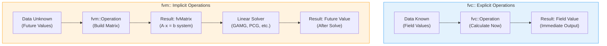
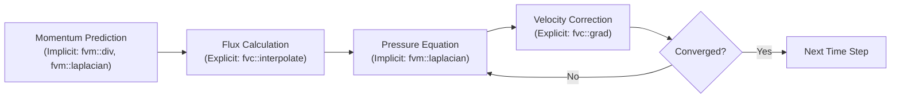

# fvc vs fvm: แตกต่างกันอย่างไร?

![[explicit_calculator_vs_implicit_architect.png]]
> **Academic Vision:** A split screen. On the left (fvc), a calculator producing a direct number. On the right (fvm), an architect drawing a complex blueprint (The Matrix) of a building that hasn't been built yet. Clean, high-contrast flat design.

ใน OpenFOAM การดำเนินการทางแคลคูลัสเวกเตอร์มีอยู่ในรูปแบบพื้นฐานสองรูปแบบ:

- **`fvc::` (Finite Volume Calculus)**: การดำเนินการ **ชัดแจ้ง (Explicit)** ที่คำนวณค่าโดยตรงจากข้อมูล field ใช้สำหรับ source terms, post-processing, และการคำนวณที่ต้องการค่าทันที
- **`fvm::` (Finite Volume Method)**: การดำเนินการ **โดยนัย (Implicit)** ที่สร้างค่าสัมประสิทธิ์เมทริกซ์สำหรับระบบเชิงเส้น ใช้สำหรับแก้สมการเชิงอนุพันธ์เพื่อหาค่า Unknown

---

## 📊 ภาพรวมการดำเนินการ Explicit กับ Implicit


> **Figure 1:** การเปรียบเทียบกระบวนการทำงานระหว่างการคำนวณแบบ Explicit (fvc::) ที่ให้ผลลัพธ์ทันที กับการคำนวณแบบ Implicit (fvm::) ที่สร้างระบบสมการเมทริกซ์เพื่อหาค่าในอนาคตความปลอดภัยทางฟิสิกส์ไม่ส่งผลกระทบต่อความเร็วในการจำลอง ผ่านการใช้พลังของ C++ Template Metaprogramming ในการตรวจสอบความสอดคล้องทางมิติทั้งหมดที่ขั้นตอนการคอมไพล์โปรแกรมเพียงครั้งเดียว

---

## 🎯 ตารางเปรียบเทียบความแตกต่าง

| หัวข้อเปรียบเทียบ | `fvc` (Explicit) | `fvm` (Implicit) |
|:---|:---|:---|
| **ผลลัพธ์ที่ได้** | ค่าตัวเลข (Fields) | เมทริกซ์ระบบสมการ (`fvMatrix`) |
| **ความหมาย** | "จงคำนวณค่านี้ให้ฉันเดี๋ยวนี้" | "จงสร้างสมการเพื่อหาค่านี้ให้ฉัน" |
| **การลู่เข้า (Stability)** | ขึ้นกับขนาดก้าวเวลา (เสถียรน้อยกว่า) | เสถียรกว่ามาก (รองรับก้าวเวลาใหญ่ได้) |
| **ตัวอย่างฟังก์ชัน** | `fvc::grad`, `fvc::div`, `fvc::flux`, `fvc::laplacian` | `fvm::ddt`, `fvm::div`, `fvm::laplacian` |
| **การใช้หน่วยความจำ** | น้อยกว่า | มากกว่า (เก็บเมทริกซ์) |
| **ประสิทธิภาพต่อการวนซ้ำ** | เร็วกว่า | ช้ากว่า (ต้อง solve) |
| **ข้อจำกัด Time Step** | CFL: $\Delta t \leq \frac{\Delta x^2}{2\Gamma}$ | เสถียรโดยไม่มีเงื่อนไข |

---

## ⚙️ กฎการเลือกใช้งาน

> [!TIP] กฎทองคำในการเลือกใช้ fvc หรือ fvm
>
> - หากตัวแปรนั้นคือ **คำตอบที่เรากำลังหา** $\rightarrow$ ใช้ **`fvm`** (เพื่อให้สมการเป็นแบบ Implicit)
> - หากตัวแปรนั้นคือ **ค่าคงที่หรือค่าที่รู้แล้ว** จากขั้นตอนก่อนหน้า $\rightarrow$ ใช้ **`fvc`** (เพื่อคำนวณเป็นสัมประสิทธิ์หรือเทอม Source)

### ตัวอย่างในโซลเวอร์

```cpp
// หาฟลักซ์ (phi) จากความเร็วปัจจุบัน (Explicit)
phi = fvc::flux(U);

// สร้างสมการพลังงานเพื่อหา T ตัวใหม่ (Implicit)
fvScalarMatrix TEqn(
    fvm::ddt(T)
  + fvm::div(phi, T)
 == fvm::laplacian(DT, T)
);
TEqn.solve();
```

---

## 🔬 รายละเอียดการดำเนินการแบบ Explicit (`fvc::`)

### แนวคิดพื้นฐาน

การดำเนินการ Explicit ประเมินค่าโดยใช้ข้อมูลจากการวนซ้ำปัจจุบันหรือ time step ปัจจุบัน ส่งผลให้เกิดค่าที่คำนวณได้ทันที

### ลักษณะเฉพาะ

- **ใช้ค่าสนามปัจจุบันโดยตรง**
- **สร้างพจน์ explicit (ย้ายไป RHS)**
- **ไม่มีการ coupling ระหว่างเซลล์ข้างเคียง**
- **ข้อจำกัดด้าน time step อาจเข้มงวด**
- **ใช้ทรัพยากรการคำนวณน้อยต่อการประเมิน**

### การดำเนินการ Explicit ทั่วไป

```cpp
// === Gradient Operations ===
// Pressure gradient (แรงขับเคลื่อนในสมการโมเมนตัม)
volVectorField gradP = fvc::grad(p);

// Temperature gradient (การคำนวณความร้อน flux)
volVectorField gradT = fvc::grad(T);

// === Divergence Operations ===
// Divergence ของ velocity field (สมการต่อเนื่อง)
volScalarField divU = fvc::div(U);

// Divergence ของ flux (source term ของสมการโมเมนตัม)
volScalarField divPhi = fvc::div(phi);

// === Laplacian Operations ===
// Thermal diffusion
volScalarField laplacianT = fvc::laplacian(DT, T);

// Viscous diffusion
volVectorField laplacianU = fvc::laplacian(nu, U);

// === Curl Operations ===
// Vorticity field
volVectorField vorticity = fvc::curl(U);

// === Flux Operations ===
// Face flux field
surfaceScalarField phi = fvc::flux(U);

// Mass flow rate
surfaceScalarField rhoPhi = fvc::flux(rho, U);

// === Surface Normal Gradients ===
// Normal gradient ที่ faces
surfaceScalarField snGradT = fvc::snGrad(T);

// === Temporal Derivatives ===
// อนุพันธ์เวลาโดยใช้ Euler scheme
volScalarField ddtT = fvc::ddt(T);
```

### ข้อดีและข้อเสีย

| ข้อดี | ข้อเสีย |
|:---|:---|
| • ง่ายต่อการ implement<br/>• ใช้หน่วยความจำน้อย<br/>• เร็วต่อการคำนวณแต่ละครั้ง | • ข้อจำกัดความเสถียรที่เข้มงวด<br/>• ต้องการ time step เล็กๆ<br/>• อาจมี numerical diffusion |

---

## 🏗️ รายละเอียดการดำเนินการแบบ Implicit (`fvm::`)

### แนวคิดพื้นฐาน

การดำเนินการ Implicit สร้างระบบสมการที่ coupled โดยค่าสนามที่ไม่รู้ปรากฏในทั้งด้านซ้ายมือ (สัมประสิทธิ์เมทริกซ์) และด้านขวามือ (พจน์ต้นทาง)

### ลักษณะเฉพาะ

- **สร้างพจน์ implicit (สัมประสิทธิ์เมทริกซ์)**
- **Coupling เซลล์ข้างเคียงผ่านพจน์ off-diagonal**
- **อนุญาต time step ที่ใหญ่ขึ้นสำหรับความเสถียร**
- **ต้องการการแก้ระบบสมการเชิงเส้น**
- **ใช้ทรัพยากรการคำนวณมากขึ้นต่อการวนซ้ำ**

### การดำเนินการ Implicit ทั่วไป

```cpp
// === Temporal Integration ===
// Forward Euler (implicit)
fvScalarMatrix TEqn(fvm::ddt(T));

// Backward scheme (second-order)
fvScalarMatrix TEqn(fvm::ddt(T, backward));

// === Diffusion Terms ===
// Thermal diffusion
fvScalarMatrix TEqn(fvm::laplacian(DT, T));

// Viscous diffusion
fvVectorMatrix UEqn(fvm::laplacian(nu, U));

// === Convective Terms ===
// Upwind convection
fvVectorMatrix UEqn(fvm::div(phi, U));

// === Combined Terms ===
// Energy equation
fvScalarMatrix TEqn
(
    fvm::ddt(T)
  + fvm::div(phi, T)
  - fvm::laplacian(DT, T)
);

// Momentum equation
fvVectorMatrix UEqn
(
    fvm::ddt(U)
  + fvm::div(phi, U)
  - fvm::laplacian(nu, U)
 ==
  -fvc::grad(p)
);
```

### ข้อดีและข้อเสีย

| ข้อดี | ข้อเสีย |
|:---|:---|
| • เสถียรกว่ามาก<br/>• รองรับ time step ใหญ่ได้<br/>• เหมาะกับ stiff problems | • ซับซ้อนกว่าในการ implement<br/>• ใช้หน่วยความจำมากขึ้น<br/>• ช้ากว่าต่อการวนซ้ำ |

---

## 📐 รากฐานทางคณิตศาสตร์

### Finite Volume Discretization

การดำเนินการทั้งสองแบบใช้หลักการเดียวกันจากทฤษฎีบทของ Gauss:

#### Gradient Operator

$$\nabla \phi = \frac{1}{V} \sum_{faces} \phi_f \mathbf{S}_f$$

โดยที่:
- $V$ คือปริมาตรของ cell
- $\phi_f$ คือค่าที่ face (interpolated)
- $\mathbf{S}_f$ คือเวกเตอร์พื้นที่ของ face

#### Divergence Operator

$$\nabla \cdot \mathbf{\phi} = \frac{1}{V} \sum_{faces} \mathbf{\phi}_f \cdot \mathbf{S}_f$$

#### Laplacian Operator

$$\nabla \cdot (\Gamma \nabla \psi) = \frac{1}{V} \sum_{faces} \Gamma_f (\nabla \psi)_f \cdot \mathbf{S}_f$$

โดยที่:
- $\Gamma$ คือสัมประสิทธิ์การ diffused
- $(\nabla \psi)_f$ คือ gradient ที่ face

---

## 🔄 รูปแบบผสมและการผ่อนคลาย

ในทางปฏิบัติ มักใช้การผสมผสานระหว่าง explicit และ implicit

### การรักษาพาความร้อนแบบกึ่ง-implicit

```cpp
// Semi-implicit convection treatment
fvScalarMatrix TEqn
(
    fvm::ddt(T)
  + fvm::div(phi, T)           // Implicit part
  - fvc::div(phi_implicit, T)  // Explicit correction
);
```

### การผ่อนคลายสำหรับความเสถียร

```cpp
// Under-relaxation for stability
TEqn.relax(relaxationFactor);
TEqn.solve();
```

---

## 🌊 การประยุกต์ใช้อัลกอริทึม PISO

อัลกอริทึม PISO (Pressure-Implicit with Splitting of Operators) แสดงให้เห็นการใช้งานร่วมกันของ fvc และ fvm อย่างชัดเจน


> **Figure 2:** ขั้นตอนการทำงานของอัลกอริทึม PISO ซึ่งแสดงให้เห็นถึงการใช้งานร่วมกันอย่างมีประสิทธิภาพระหว่างตัวดำเนินการแบบ Explicit และ Implicit ในการแก้ปัญหาความดันและความเร็วความปลอดภัยทางฟิสิกส์ไม่ส่งผลกระทบต่อความเร็วในการจำลอง ผ่านการใช้พลังของ C++ Template Metaprogramming ในการตรวจสอบความสอดคล้องทางมิติทั้งหมดที่ขั้นตอนการคอมไพล์โปรแกรมเพียงครั้งเดียว

### Step-by-Step PISO Algorithm

#### 1. Momentum Prediction (Implicit)

```cpp
// การทำนายโมเมนตัมแบบ implicit
fvVectorMatrix UEqn
(
    fvm::ddt(U)
  + fvm::div(phi, U)
  - fvm::laplacian(nu, U)
);
UEqn.solve();
```

#### 2. Pressure-Velocity Coupling (Explicit)

```cpp
// การแก้ไขความดันแบบ explicit
volScalarField rUA = 1.0/UEqn.A();
surfaceScalarField rUAf = fvc::interpolate(rUA);
surfaceScalarField phiHbyA = (UEqn.H() & UEqn.flux()) / UEqn.A();
```

#### 3. Pressure Equation (Implicit)

```cpp
// สมการความดันแบบ implicit
fvScalarMatrix pEqn
(
    fvm::laplacian(rUAf, p) == fvc::div(phiHbyA)
);
pEqn.solve();
```

#### 4. Velocity Correction (Explicit)

```cpp
// การแก้ไขความเร็วแบบ explicit
U -= rUA * fvc::grad(p);
```

---

## 📋 ตารางเปรียบเทียบเชิงลึก

| ปัจจัย | Explicit (`fvc::`) | Implicit (`fvm::`) |
|:---|:---|:---|
| **ความเสถียร** | Time step จำกัด | เสถียรโดยไม่มีเงื่อนไข |
| **ความแม่นยำ** | อันดับสูงกว่าได้ | มักเป็นอันดับแรก/ที่สอง |
| **ต้นทุนการคำนวณ** | ต่ำต่อการวนซ้ำ | สูงกว่าต่อการวนซ้ำ |
| **หน่วยความจำ** | จัดเก็บน้อยกว่า | ต้องการจัดเก็บเมทริกซ์ |
| **การบรรจบกัน** | อาจต้องการการวนซ้ำหลายครั้ง | การวนซ้ำน้อยกว่าสำหรับ steady state |
| **Complexity** | ง่าย | ซับซ้อน |
| **การใช้งานทั่วไป** | Post-processing, Source terms | Diffusion, Pressure-velocity coupling |

---

## 💡 แนวทางปฏิบัติที่ดี

> [!INFO] Best Practices ในการเลือกใช้ fvc และ fvm
>
> - **ใช้ `fvm::`** สำหรับการแพร่, coupling ความดัน-ความเร็ว, และพจน์ต้นทางแบบ stiff
> - **ใช้ `fvc::`** สำหรับการพาความร้อนเมื่อใช้รูปแบบ explicit หรือการประมาณค่าเชิงอันดับสูง
> - **รวมทั้งสอง** เพื่อสมดุลที่เหมาะสมที่สุด: การรักษาพจน์ stiff แบบ implicit, แบบ explicit สำหรับพจน์ที่ไม่ stiff
> - **พิจารณา trade-offs** ระหว่างการแพร่เชิงตัวเลขและต้นทุนการคำนวณ
> - **ทดสอบความไวต่อ time step** เมื่อใช้การดำเนินการ explicit

---

## 🧪 การประยุกต์ใช้ใน Solver จริง

### สมการโมเมนตัม

```cpp
// Momentum equation with mixed explicit/implicit
fvVectorMatrix UEqn
(
    fvm::ddt(rho, U)              // Implicit time derivative
  + fvm::div(rhoPhi, U)           // Implicit convection
 ==
  - fvc::grad(p)                  // Explicit pressure gradient
  + fvc::div(tau)                 // Explicit viscous stress
  + fvOptions(rho, U)             // Source terms
);

UEqn.relax();
UEqn.solve();
```

### สมการพลังงาน

```cpp
// Energy equation
fvScalarMatrix TEqn
(
    fvm::ddt(rho, T)              // Implicit time
  + fvm::div(rhoPhi, T)           // Implicit convection
 ==
  fvm::laplacian(alpha, T)        // Implicit diffusion
  + fvc::div(q)                   // Explicit heat flux
  + fvOptions(rho, T)             // Source terms
);

TEqn.relax();
TEqn.solve();
```

---

## 🔍 ข้อจำกัดความเสถียร

### Explicit Stability Limits

สำหรับการดำเนินการ explicit จำกัดโดยเงื่อนไข:

#### Convection (CFL Condition)

$$\Delta t \leq \frac{\Delta x}{|\mathbf{u}|_{\max}}$$

#### Diffusion (Von Neumann Stability)

$$\Delta t \leq \frac{\Delta x^2}{2\Gamma}$$

โดยที่:
- $\Delta x$ คือขนาดของเซลล์เมช
- $|\mathbf{u}|_{\max}$ คือความเร็วสูงสุด
- $\Gamma$ คือสัมประสิทธิ์การ diffused

### Implicit Advantages

การดำเนินการ implicit ส่วนใหญ่ไม่มีข้อจำกัดเหล่านี้ ทำให้สามารถใช้ time step ที่ใหญ่กว่าได้

---

## 🎓 สรุป

การเลือกระหว่าง `fvc::` และ `fvm::` เป็นการตัดสินใจที่สำคัญในการพัฒนา OpenFOAM solver:

- **`fvc::`** เหมาะสำหรับการคำนวณที่ต้องการผลลัพธ์ทันที แต่มาพร้อมกับข้อจำกัดความเสถียร
- **`fvm::`** ให้ความเสถียรที่ดีกว่าและรองรับ time step ที่ใหญ่ขึ้น แต่ต้องการทรัพยากรการคำนวณที่มากกว่า
- **การผสมผสาน** ทั้งสองแบบให้ผลลัพธ์ที่ดีที่สุดในการจำลอง CFD ที่ซับซ้อน

การเข้าใจความแตกต่างนี้เป็นพื้นฐานสำคัญในการพัฒนา solver ที่มีประสิทธิภาพและเสถียรสำหรับปัญหา CFD ที่หลากหลาย
