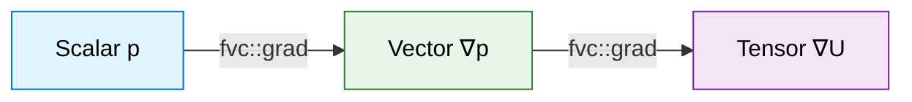

# Gradient Operations in OpenFOAM

> [!TIP] Why Gradient Operations Matter
> Gradient operations are fundamental to CFD computations, calculating spatial derivatives of fields like pressure and velocity. The accuracy of gradients directly impacts:
> - **Force accuracy**: Buoyancy, shear forces
> - **Numerical stability**: Incorrect gradients cause divergence
> - **Prediction quality**: Especially for turbulent and high-gradient flows
>
> **🎯 OpenFOAM Application**: Setting `gradSchemes` in `system/fvSchemes` affects every equation in solvers like pressure gradients ($-\nabla p$), shear stress ($\mu \nabla^2 \mathbf{u}$), and turbulence calculations

![[slope_of_data_gradient.png]]

---

## Learning Objectives

By the end of this section, you will be able to:

1. **Understand** how `fvc::grad()` implements Gauss theorem for discrete gradient calculation
2. **Select** appropriate gradient schemes (Linear, LeastSquares, Fourth) based on mesh quality
3. **Implement** gradient calculations in custom solvers and function objects
4. **Debug** common type and compilation errors related to gradient operations
5. **Optimize** performance by balancing accuracy and computational cost

---

## 1. Mathematical Foundation

> [!NOTE] **📂 OpenFOAM Context: Foundation of Finite Volume Calculus**
> The gradient operator is implemented using **Gauss Theorem** which converts volume integrals to surface integrals
> - **📍 Source Code**: `src/finiteVolume/fvc/fvcGrad.C`
> - **🔑 C++ Command**: `volVectorField gradP = fvc::grad(p);`
> - **📊 Mathematics**:1$\nabla \phi = \frac{1}{V} \sum_f \phi_f \mathbf{S}_f$
> - **🎯 Result**: Scalar → Vector, Vector → Tensor transformation
>
> **🔗 Case Files Connection**: This operation is used by every solver to compute gradients of pressure and velocity from fields in the `0/` directory (e.g., `0/p`, `0/U`) according to settings in `system/fvSchemes`

The **nabla operator1$\nabla$** transforms scalar fields to vector fields and vector fields to tensor fields. In the finite volume method, this continuous differential operator is discretized using **Gauss's Divergence Theorem**:

$$
\nabla \phi = \frac{1}{V} \sum_{f=1}^{n_f} \phi_f \mathbf{S}_f
$$

**Where:**
-1$V1= cell volume
-1$n_f1= number of faces
-1$\phi_f1= field value interpolated to face1$f$
-1$\mathbf{S}_f = \mathbf{n}_f A_f1= face area vector



> **Figure 1:** Data type transformation through gradient operator: scalar fields become vector fields, and vector fields become tensor fields

![[of_gradient_discretization_formula.png]]

---

## 2. Basic Usage

> [!NOTE] **📂 OpenFOAM Context: Using Gradient in C++ Code**
> This section shows how to use `fvc::grad()` in **custom solvers** or **function objects**
> - **📍 Header File**: `src/finiteVolume/fvc/fvc.H`
> - **🔑 Namespace**: `fvc` (Finite Volume Calculus)
> - **🎯 Applications**:
>   - Create custom solvers in `MySolver.C`
>   - Create function objects in `src/postProcessing/functionObjects/`
> - **📦 Compilation**: Must add `#include "fvc.H"` and link with `libfiniteVolume.so`
>
> **💡 Real Example**: In solver source code like `src/transportFoam/transportFoam.C`, pressure gradients are computed to determine driving forces

Gradients are computed through the `fvc` namespace:

```cpp
#include "fvc.H"

// Gradient of scalar field → vector field
volScalarField p(mesh);        // Pressure field
volVectorField gradP = fvc::grad(p);

// Gradient of vector field → tensor field
volVectorField U(mesh);        // Velocity field
volTensorField gradU = fvc::grad(U);
```

### Key Concepts

**Type Transformation** - Gradient changes tensor rank:
- Scalar (rank 0) → Vector (rank 1)
- Vector (rank 1) → Tensor (rank 2)

**Computation Method** - OpenFOAM uses Gauss theorem to convert volume integrals to surface integrals

**Interpolation** - Face values ($\phi_f$) are computed from cell center values

---

## 3. Discretization Schemes

> [!NOTE] **📂 OpenFOAM Context: Setting Gradient Schemes in Case Files**
> This section connects **discretization theory** to **case configuration**
> - **📍 Case File**: `system/fvSchemes`
> - **🔑 Keyword**: `gradSchemes`
> - **🎯 Impact**: Determines gradient accuracy for all fields in the solver
> - **⚙️ Example Settings**:
>   ```cpp
>   gradSchemes {
>       default         Gauss linear;
>       grad(p)         Gauss leastSquares;
>       grad(U)         Gauss fourth;
>   }
>   ```
>
> **🔗 Simulation Impact**: The chosen scheme affects:
> - **Convergence**: LeastSquares may be slower but more accurate
> - **Stability**: Linear scheme is generally more stable
> - **Mesh Quality**: Fourth requires high-quality mesh

### 3.1 Configuration in `system/fvSchemes`

```cpp
// In system/fvSchemes
gradSchemes
{
    default         Gauss linear;
    grad(p)         Gauss leastSquares;
    grad(U)         Gauss fourth;
}
```

### 3.2 Available Schemes

| Scheme | Description | Accuracy | Best For |
|--------|-------------|----------|----------|
| **Gauss Linear** | Central difference interpolation | Medium | Structured meshes |
| **Gauss Least Squares** | Least-squares minimization | High | Unstructured meshes |
| **Gauss Fourth** | Fourth-order accuracy | Very High | High-quality meshes |
| **Gauss PointLinear** | Weighted interpolation | Medium | General use |
| **cellLimited** | Slope limiting | Medium | Prevent overshoot |

> [!TIP] Scheme Selection Guidelines
> - **Gauss Linear**: Default choice for well-behaved, structured meshes
> - **Gauss LeastSquares**: Preferred for highly skewed or unstructured meshes
> - **Gauss Fourth**: Use only with high-quality orthogonal meshes
> - **cellLimited/faceLimited**: Add when simulations diverge due to high gradients

---

## 4. Least Squares Gradient Algorithm

> [!NOTE] **📂 OpenFOAM Context: Internal Implementation of `Gauss leastSquares`**
> This section explains **implementation details** of the least squares gradient scheme
> - **📍 Source File**: `src/finiteVolume/fvSchemes/gaussGrad/gaussLeastSquaresGrad.C`
> - **🔑 Usage**: `gradSchemes { default Gauss leastSquares; }`
> - **🎯 Advantages**: Best for **unstructured meshes** with high non-orthogonality
> - **⚠️ Disadvantages**: Uses more memory and computation time than Linear scheme
>
> **🔗 Mesh Quality Connection**:
> - If mesh in `constant/polyMesh/` has high non-orthogonality → Use LeastSquares
> - If mesh is structured/orthogonal → Linear is sufficient and faster

The least squares method minimizes error in the linear Taylor expansion:

$$
\phi_N \approx \phi_P + (\nabla \phi)_P \cdot (\mathbf{x}_N - \mathbf{x}_P)
$$

For cell1$P1with neighbors1$N_1, N_2, ..., N_m$, we solve:

$$
\begin{bmatrix}
\Delta x_1 & \Delta y_1 & \Delta z_1 \\
\Delta x_2 & \Delta y_2 & \Delta z_2 \\
\vdots & \vdots & \vdots \\
\Delta x_m & \Delta y_m & \Delta z_m
\end{bmatrix}
\begin{bmatrix}
(\partial \phi/\partial x)_P \\
(\partial \phi/\partial y)_P \\
(\partial \phi/\partial z)_P
\end{bmatrix}
=
\begin{bmatrix}
\phi_{N_1} - \phi_P \\
\phi_{N_2} - \phi_P \\
\vdots \\
\phi_{N_m} - \phi_P
\end{bmatrix}
$$

This overdetermined system is solved using least squares minimization:

$$
\mathbf{A}^T \mathbf{A} \nabla \phi_P = \mathbf{A}^T \mathbf{b}
$$

Where1$\mathbf{A}1contains geometric coefficients and1$\mathbf{b}1contains field differences.

> [!TIP] Least Squares Advantages
> - ✅ Higher accuracy on skewed meshes
> - ✅ Better for unstructured meshes
> - ✅ More robust for complex geometries

---

## 5. Practical Applications

> [!NOTE] **📂 OpenFOAM Context: Gradient Usage in Solvers and Physics**
> This section shows **practical applications** of gradients in OpenFOAM solvers
> - **📍 Solver Files**:
>   - `src/transportFoam/` - Buoyancy calculations
>   - `src/heatTransfer/` - Natural convection
>   - `src/turbulenceModels/` - Strain rate calculations
> - **🔑 Related Physics**:
>   - Pressure Gradient Force ($-\nabla p$) → Main driving force
>   - Buoyancy Force ($-\nabla \rho \cdot \mathbf{g}$) → Buoyancy
>   - Strain Rate Tensor ($\mathbf{S}$) → Shear stress
> - **🎯 Usage**: Used in every solver that solves Navier-Stokes equations
>
> **💡 Real Examples**:
> - `buoyantSimpleFoam`: Computes `fvc::grad(rho)` for buoyancy
> - `simpleFoam`: Computes `fvc::grad(p)` for pressure forces
> - `kEpsilon`: Computes `fvc::grad(U)` for strain rate

### 5.1 Momentum Equation Source Terms

```cpp
// Calculate buoyancy force
volVectorField g("g", dimensionedVector("g", dimAcceleration, vector(0, -9.81, 0)));
volVectorField F_buoyancy = fvc::grad(rho) * g;

// Pressure gradient force
volVectorField F_pressure = -fvc::grad(p);
```

**Applications:**
- **Buoyancy Force**: Density gradient times gravity for natural convection
- **Pressure Force**: Negative pressure gradient, main driving force in fluid flow

### 5.2 Strain Rate Tensor

```cpp
// Velocity gradient tensor
volTensorField gradU = fvc::grad(U);

// Strain rate tensor: S = 1/2(∇U + ∇U^T)
volTensorField S = 0.5 * (gradU + gradU.T());

// Vorticity tensor: Ω = 1/2(∇U - ∇U^T)
volTensorField Omega = 0.5 * (gradU - gradU.T());
```

**Applications:**
- **Velocity Gradient Tensor**: Second-order tensor with velocity derivatives in all directions
- **Strain Rate Tensor**: Symmetric part measuring deformation rate, used for viscous stress
- **Vorticity Tensor**: Antisymmetric part related to fluid rotation

### 5.3 Post-Processing

```cpp
// Create magnitude field of gradient
volScalarField magGradP = mag(fvc::grad(p));

// Wall shear stress
volScalarField wallShearStress = mag(mu * fvc::grad(U));
```

**Applications:**
- **Gradient Magnitude**: Visualize gradient distribution
- **Wall Shear Stress**: Viscosity times velocity gradient, important for boundary layer analysis

---

## 6. Common Errors and Solutions

> [!NOTE] **📂 OpenFOAM Context: Debugging and Type Safety**
> This section covers **common pitfalls** in C++ code with OpenFOAM API
> - **📍 Problem Types**: Compilation Errors, Runtime Errors
> - **🔑 Error Sources**:
>   - Type System: `src/OpenFOAM/fields/`
>   - Boundary Conditions: `src/finiteVolume/fields/fvPatchFields/`
> - **🎯 Solutions**:
>   - Check Field Types (Scalar vs Vector vs Tensor)
>   - Check Header Includes (`#include "fvc.H"`)
>   - Check Boundary Conditions in `0/` directory
>
> **💻 Debugging**: Use compiler output and check dimensions with `Info <<` statements

### 6.1 Type Mismatch

```cpp
// ERROR: Cannot convert volVectorField to volScalarField
volScalarField wrong = fvc::grad(p);  // p is volScalarField

// CORRECT: Gradient of a scalar returns a vector
volVectorField correct = fvc::grad(p);
```

**Solution**: Remember that gradient increases tensor rank:
- Scalar → Vector
- Vector → Tensor

### 6.2 Missing Header

```cpp
// ERROR: 'fvc' has not been declared
volVectorField gradP = fvc::grad(p);

// SOLUTION: Add the correct include
#include "fvc.H"
```

**Solution**: Always include required headers before using namespace functions

### 6.3 Boundary Condition Issues

```cpp
// Check boundary values after gradient calculation
volVectorField gradP = fvc::grad(p);
Info << "Boundary gradient values: " << gradP.boundaryField() << endl;
```

**Solution**: Verify boundary gradients are consistent with specified BCs in `0/` directory

---

## 7. Performance Considerations

> [!NOTE] **📂 OpenFOAM Context: Performance Optimization and Computational Cost**
> This section connects **numerical schemes** to **performance impact**
> - **📍 Config File**: `system/fvSchemes`
> - **🔑 Key Points**:
>   - Memory Usage: Correlates with mesh size in `constant/polyMesh/`
>   - CPU Time: Depends on scheme complexity
> - **🎯 Trade-offs**:
>   - `Gauss linear`: Fast but potentially less accurate
>   - `Gauss leastSquares`: Accurate but more memory/CPU intensive
>   - `Gauss fourth`: Very accurate but requires high-quality mesh
>
> **📊 Measurement**: Use `log.` files from solver runs to check execution time per time step

### 7.1 Memory Usage

| Scheme | Memory Usage | Notes |
|--------|--------------|-------|
| **Gauss gradient** | Minimal | Baseline memory usage |
| **Least squares** | Additional | Storage for geometric coefficients |

### 7.2 Computational Cost

| Scheme | Complexity | Notes |
|--------|------------|-------|
| **Gauss gradient** |1$O(n_{faces})1| Fast operation |
| **Least squares** |1$O(n_{cells})1| With additional matrix solving |

### 7.3 Accuracy vs Stability Trade-off

```cpp
// Higher accuracy but potentially less stability
gradSchemes { default Gauss leastSquares; }

// Lower accuracy but more robust
gradSchemes { default Gauss linear; }
```

**Guidelines:**
- **LeastSquares**: More accurate but uses more memory and time
- **Linear**: Faster but may be less accurate on non-orthogonal meshes

---

## 8. Advanced Features

> [!NOTE] **📂 OpenFOAM Context: Gradient Limiters for Numerical Stability**
> This section covers **advanced schemes** for high-gradient flows
> - **📍 Config File**: `system/fvSchemes`
> - **🔑 Keywords**:
>   - `cellLimited`: Limit gradient per cell
>   - `faceLimited`: Limit gradient per face
> - **🎯 Applications**:
>   - Shock waves: Compressible flows with discontinuities
>   - Multiphase flows: At phase interfaces
>   - High-Mach flows: High-speed compressible flows
> - **⚠️ Side Effects**: May reduce accuracy to maintain stability
>
> **💡 When to Use**: Add limiters when simulations diverge or show oscillations

### 8.1 Cell-Limited Gradient

```cpp
// Use limiters to prevent unbounded values
gradSchemes
{
    default         cellLimited Gauss linear 1;
}
```

**Purpose**: `cellLimited` applies limiter to gradient values in each cell. The number `1` is the limiter coefficient (0-1).

### 8.2 Face-Limited Gradient

```cpp
// Face-based limiting for better stability
gradSchemes
{
    default         faceLimited Gauss linear 1;
}
```

**Comparison**:
- `cellLimited`: Checks per cell
- `faceLimited`: Checks per face (often more stable)

> [!WARNING] When to Use Limiters
> Gradient limiting is essential for **high gradient flows** to prevent numerical oscillations and maintain computational stability. Use when simulations diverge or show unphysical oscillations near shocks or interfaces.

---

## 9. Application in Navier-Stokes Equations

> [!NOTE] **📂 OpenFOAM Context: Gradient in Pressure-Velocity Coupling Algorithms**
> This section connects **theory** to **solver implementations**
> - **📍 Solver Files**:
>   - `src/finiteVolume/cfdTools/incompressible/rhoPimpleFoam/` - PIMPLE algorithm
>   - `src/finiteVolume/cfdTools/incompressible/simpleFoam/` - SIMPLE algorithm
>   - `src/finiteVolume/cfdTools/incompressible/pisoFoam/` - PISO algorithm
> - **🔑 Navier-Stokes Equation**:
>1$$\rho \frac{\partial \mathbf{u}}{\partial t} + \rho (\mathbf{u} \cdot \nabla) \mathbf{u} = -\nabla p + \mu \nabla^2 \mathbf{u} + \mathbf{f}$$
> - **🎯 Gradient Usage**:
>   -1$-\nabla p$: Pressure gradient force
>   -1$\nabla \mathbf{u}$: Velocity gradient tensor
>   -1$\nabla \rho$: Density gradient (buoyancy)
>
> **💻 Implementation**: Solvers use `fvc::grad()` (explicit) and `fvm::grad()` (implicit) to solve equations

The incompressible Navier-Stokes equation uses gradients extensively:

$$
\rho \frac{\partial \mathbf{u}}{\partial t} + \rho (\mathbf{u} \cdot \nabla) \mathbf{u} = -\nabla p + \mu \nabla^2 \mathbf{u} + \mathbf{f}
$$

### 9.1 Pressure Gradient Term

```cpp
// Pressure gradient force
volVectorField gradP = fvc::grad(p);
```

**Role**: Main driving force in fluid momentum equation, computed every time step/iteration

### 9.2 Viscous Stress Term

```cpp
// Strain rate tensor for viscous stress calculation
volTensorField gradU = fvc::grad(U);
volSymmTensorField S = symm(gradU);
```

**Role**: `symm()` creates symmetric tensor from gradient, used for viscous stress calculation

### 9.3 Pressure-Velocity Coupling

```cpp
// PISO algorithm - pressure correction
fvScalarMatrix pEqn
(
    fvm::laplacian(rAU, p) == fvc::div(phi)
);

pEqn.solve();

// Correct velocity using pressure gradient
U -= rAU * fvc::grad(p);
```

**Algorithm**:
1. Solve pressure equation from continuity
2. Correct velocity using pressure gradient
3. `rAU` = inverse diagonal coefficient of velocity matrix

---

## Key Takeaways

1. **Type Transformation**: `fvc::grad()` converts scalar → vector → tensor fields
2. **Scheme Selection**: Balance accuracy vs stability based on mesh quality
3. **Practical Usage**: Essential for pressure forces, strain rates, and vorticity calculations
4. **Common Errors**: Always check field types and include proper headers
5. **Performance**: Choose schemes appropriate to problem and mesh quality

---

## Concept Check

<details>
<summary><b>1. What does `fvc::grad(p)` return and what are its units?</b></summary>

**Result**: `volVectorField` (vector field at cell centers)

**Units**: If `p` has units1$[Pa] = [kg/(m \cdot s^2)]$
-1$\nabla p1has units1$[Pa/m] = [kg/(m^2 \cdot s^2)]$
- Represents force per unit volume

</details>

<details>
<summary><b>2. What's the difference between `Gauss linear` and `Gauss leastSquares`?</b></summary>

| Scheme | Method | Advantages | Disadvantages |
|--------|---------|------------|---------------|
| **Gauss linear** | Interpolate to faces then sum | Fast, stable | Less accurate on skewed mesh |
| **Gauss leastSquares** | Fit least-squares from neighbors | More accurate on unstructured mesh | Slower, more memory |

**Selection**: Use LeastSquares for unstructured/skewed meshes, Linear for structured meshes

</details>

<details>
<summary><b>3. When should you use `cellLimited` or `faceLimited` gradient?</b></summary>

Use **gradient limiters** to prevent numerical oscillations in cases of:
- **Steep gradients** (shocks, interfaces)
- **Shock waves** (compressible flow)
- **Multiphase interfaces** (phase boundaries)

**Principle**: Limiters restrict gradient values to prevent creation of new extrema

```cpp
gradSchemes { default cellLimited Gauss linear 1; }
```

</details>

---

## Related Articles

- **Overview**: [00_Overview.md](00_Overview.md) — Vector Calculus overview
- **fvc vs fvm**: [02_fvc_vs_fvm.md](02_fvc_vs_fvm.md) — Explicit vs Implicit comparison
- **Next**: [04_Divergence_Operations.md](04_Divergence_Operations.md) — Divergence operations
- **Curl & Laplacian**: [05_Curl_and_Laplacian.md](05_Curl_and_Laplacian.md) — Curl and Laplacian