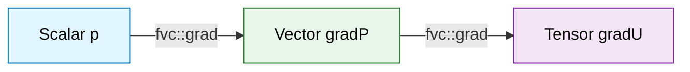

# การดำเนินการ Gradient ใน OpenFOAM

![[slope_of_data_gradient.png]]
`A 3D landscape of data values. At one point, a glowing arrow points straight "uphill" representing the gradient vector. Below the surface, the underlying mesh cells are visible, showing how their values contribute to the arrow's direction, scientific textbook diagram, clean vector line art, white background, high definition, flat design, educational infographic --ar 16:9`

---

## 1. พื้นฐานทางคณิตศาสตร์

**Operator นามิกร $\nabla$** ทำการแปลงสนามสเกลาร์เป็นสนามเวกเตอร์ และสนามเวกเตอร์เป็นสนามเทนเซอร์ ในวิธีการปริมาตรจำกัด หลักการเชิงอนุพันธ์เชิงต่อเนื่องนี้จะถูกแบ่งส่วนโดยใช้ทฤษฎีบทของเกาส์:

$$
\int_V \nabla \phi \, \mathrm{d}V = \oint_S \phi \mathbf{n} \, \mathrm{d}S
$$

การประยุกต์ใช้กับปริมาตรควบคุมและประมาณค่าอินทิกรัลของพื้นผิวเป็นผลรวมเหนือพื้นผิว:

$$
\nabla \phi = \frac{1}{V} \sum_{f=1}^{n_f} \phi_f \mathbf{S}_f
$$

**โดยที่:**
- $V$ คือปริมาตรของเซลล์
- $n_f$ คือจำนวนของพื้นผิว
- $\phi_f$ คือค่าสนามที่ถูกอินเตอร์โพลเลตไปยังพื้นผิว $f$
- $\mathbf{S}_f = \mathbf{n}_f A_f$ คือเวกเตอร์พื้นที่พื้นผิว


> **Figure 1:** การแปลงประเภทข้อมูลผ่านตัวดำเนินการเกรเดียนต์ (Gradient) โดยฟิลด์สเกลาร์จะเปลี่ยนเป็นฟิลด์เวกเตอร์ และฟิลด์เวกเตอร์จะเปลี่ยนเป็นฟิลด์เทนเซอร์ตามลำดับความซับซ้อนทางคณิตศาสตร์

![[of_gradient_discretization_formula.png]]
`A diagram showing the discretization of the gradient operator using face area vectors (Sf) and face values (phi_f) on a 2D control volume, scientific textbook diagram, clean vector line art, white background, high definition, flat design, educational infographic --ar 16:9`

> [!INFO] ความสำคัญของ Gradient
> Gradient เป็นพื้นฐานสำคัญของ CFD เนื่องจากใช้คำนวณอนุพันธ์เชิงพื้นที่ของปริมาณสนาม ปรากฏในพจน์ convection, แรง pressure gradient, และการจำลอง turbulence

---

## 2. การใช้งานพื้นฐาน

คุณสามารถเรียกใช้ gradient ได้ผ่าน Namespace `fvc`:

```cpp
#include "fvc.H"

// Gradient of scalar field → vector field
volScalarField p(mesh);        // Pressure field
volVectorField gradP = fvc::grad(p);

// Gradient of vector field → tensor field
volVectorField U(mesh);        // Velocity field
volTensorField gradU = fvc::grad(U);
```

### 💡 คำอธิบาย

**Source:** ไฟล์หัวข้อ `fvc.H` ใน OpenFOAM source code

**การทำงาน:**
- `fvc::grad()` เป็นฟังก์ชันใน finite volume calculus (fvc) namespace ที่คำนวณค่า gradient ของสนามข้อมูล
- สำหรับสนามสเกลาร์ เช่น ความดัน (pressure) จะคืนค่าเป็นสนามเวกเตอร์
- สำหรับสนามเวกเตอร์ เช่น ความเร็ว (velocity) จะคืนค่าเป็นสนามเทนเซอร์

**แนวคิดสำคัญ:**
1. **การแปลงประเภทข้อมูล** - Gradient เปลี่ยน rank ของ tensor:
   - Scalar (rank 0) → Vector (rank 1)
   - Vector (rank 1) → Tensor (rank 2)
2. **การคำนวณ** - OpenFOAM ใช้ Gauss theorem เพื่อแปลง volume integral เป็น surface integral
3. **การอินเตอร์โพลเลชัน** - ค่าที่พื้นผิว (face values) ถูกคำนวณจากค่าที่จุดศูนย์กลางเซลล์ (cell centers)

---

## 3. รูปแบบการแบ่งส่วน

ความแม่นยำของการคำนวณ gradient ขึ้นอยู่กับรูปแบบการอินเตอร์โพลเลชันที่ใช้สำหรับ $\phi_f$

### 3.1 การตั้งค่าใน `system/fvSchemes`

```cpp
// In system/fvSchemes
gradSchemes
{
    default         Gauss linear;
    grad(p)         Gauss leastSquares;
    grad(U)         Gauss fourth;
}
```

### 💡 คำอธิบาย

**Source:** ไฟล์ dictionary ใน `system/fvSchemes` ของ OpenFOAM case directory

**การทำงาน:**
- `gradSchemes` กำหนดวิธีการคำนวณ gradient สำหรับแต่ละสนามข้อมูล
- `default` ใช้สำหรับทุกสนามที่ไม่ได้ระบุเฉพาะ
- สามารถระบุ scheme เฉพาะสำหรับ field ใด field หนึ่ง เช่น `grad(p)`, `grad(U)`

**แนวคิดสำคัญ:**
1. **Gauss Theorem** - ทุก scheme ใช้ Gauss theorem เป็นฐาน
2. **Interpolation Schemes** - ความแตกต่างคือวิธีคำนวณค่าที่ face ($\phi_f$)
3. **Trade-offs**:
   - Linear: สมดุลระหว่างความแม่นยำและเสถียรภาพ
   - LeastSquares: แม่นยำสูงกว่าบน mesh ที่ไม่สมมาตร
   - Fourth: ความแม่นยำสูงมากแต่ต้องการ mesh คุณภาพสูง

### 3.2 รูปแบบที่มีให้ใช้

| รูปแบบ | คำอธิบาย | ความแม่นยำ | ความเหมาะสม |
|---------|-----------|-------------|-------------|
| **Gauss Linear** | การผลต่างกลางอันดับสอง | ปานกลาง | Mesh มีโครงสร้าง |
| **Gauss Least Squares** | วิธีกำลังสองน้อยที่สุด | สูง | Mesh ไม่มีโครงสร้าง |
| **Gauss Fourth** | รูปแบบความแม่นยำอันดับสี่ | สูงมาก | Mesh คุณภาพสูง |
| **Gauss PointLinear** | การอินเตอร์โพลเลชันถ่วงน้ำหนัก | ปานกลาง | ทั่วไป |
| **cellLimited** | การจำกัดความชัน | ปานกลาง | ป้องกัน Overshoot |

---

## 4. อัลกอริทึม Gradient แบบ Least Squares

วิธี least squares ลดข้อผิดพลาดในการขยายแบบเทย์เลอร์เชิงเส้น:

$$
\phi_N \approx \phi_P + (\nabla \phi)_P \cdot (\mathbf{x}_N - \mathbf{x}_P)
$$

สำหรับเซลล์ $P$ ที่มีเพื่อนบ้าน $N_1, N_2, ..., N_m$ เราจะแก้สมการ:

$$
\begin{bmatrix}
\Delta x_1 & \Delta y_1 & \Delta z_1 \\
\Delta x_2 & \Delta y_2 & \Delta z_2 \\
\vdots & \vdots & \vdots \\
\Delta x_m & \Delta y_m & \Delta z_m
\end{bmatrix}
\begin{bmatrix}
(\partial \phi/\partial x)_P \\
(\partial \phi/\partial y)_P \\
(\partial \phi/\partial z)_P
\end{bmatrix}
=
\begin{bmatrix}
\phi_{N_1} - \phi_P \\
\phi_{N_2} - \phi_P \\
\vdots \\
\phi_{N_m} - \phi_P
\end{bmatrix}
$$

ระบบสมการเกินที่ถูกกำหนดนี้ถูกแก้โดยใช้การลดค่าสองกำลังน้อยที่สุด:

$$
\mathbf{A}^T \mathbf{A} \nabla \phi_P = \mathbf{A}^T \mathbf{b}
$$

โดยที่ $\mathbf{A}$ มีสัมประสิทธิ์ทางเรขาคณิต และ $\mathbf{b}$ มีความแตกต่างของสนาม

> [!TIP] ข้อดีของ Least Squares
> - ✅ ความแม่นยำสูงกว่าบน mesh ที่เบี้ยว
> - ✅ เหมาะกว่าสำหรับ mesh ที่ไม่มีโครงสร้าง
> - ✅ แข็งแกร่งกว่าสำหรับเรขาคณิตที่ซับซ้อน

---

## 5. การประยุกต์ใช้งานจริง

### 5.1 เทอมต้นทางของสมการโมเมนตัม

```cpp
// Calculate buoyancy force
volVectorField g("g", dimensionedVector("g", dimAcceleration, vector(0, -9.81, 0)));
volVectorField F_buoyancy = fvc::grad(rho) * g;

// Pressure gradient force
volVectorField F_pressure = -fvc::grad(p);
```

### �� คำอธิบาย

**Source:** การคำนวณแรงในสมการ Navier-Stokes ใน OpenFOAM solvers (เช่น `buoyantSimpleFoam`, `interFoam`)

**การทำงาน:**
1. **แรงลอยตัว (Buoyancy Force)**:
   - ใช้ gradient ของความหนาแน่น ($\nabla \rho$) คูณกับความโน้มถ่วง ($g$)
   - สำคัญในการจำลองการไหลที่มีความแตกต่างของความหนาแน่น (natural convection)
   
2. **แรงความดัน (Pressure Force)**:
   - คือ negative gradient ของความดัน ($-\nabla p$)
   - เป็นแรงขับเคลื่อนหลักของการไหลของไหล

**แนวคิดสำคัญ:**
- **ทฤษฎี:** แรงลอยตัวเกิดจากความแตกต่างของความหนาแน่นตามทิศทางของความโน้มถ่วง
- **การประยุกต์ใช้:** ใช้ในปัญหา natural convection, การไหลของไหลผสม, และการแลกเปลี่ยนความร้อน

### 5.2 เทนเซอร์อัตราการ Strain

```cpp
// Velocity gradient tensor
volTensorField gradU = fvc::grad(U);

// Strain rate tensor: S = 1/2(∇U + ∇U^T)
volTensorField S = 0.5 * (gradU + gradU.T());

// Vorticity tensor: Ω = 1/2(∇U - ∇U^T)
volTensorField Omega = 0.5 * (gradU - gradU.T());
```

### 💡 คำอธิบาย

**Source:** การคำนวณคุณสมบัติของการไหลใน OpenFOAM turbulence models

**การทำงาน:**
1. **Velocity Gradient Tensor ($\nabla U$)**:
   - เทนเซอร์อันดับสองที่มีอนุพันธ์ของความเร็วในทุกทิศทาง
   - ใช้เพื่อหาคุณสมบัติต่างๆ ของการไหล

2. **Strain Rate Tensor ($S$)**:
   - ส่วนสมมาตรของ gradient tensor
   - วัดอัตราการเสียรูปของฟลูอิด
   - สำคัญในการคำนวณความเค้นเฉือก (viscous stress)

3. **Vorticity Tensor ($\Omega$)**:
   - ส่วนไม่สมมาตรของ gradient tensor
   - เกี่ยวข้องกับการหมุนของฟลูอิด

**แนวคิดสำคัญ:**
- **การวิเคราะห์:** การแยก velocity gradient เป็น strain และ vorticity ช่วยให้เข้าใจลักษณะการไหล
- **Turbulence Modeling:** Strain rate tensor ใช้ใน k-epsilon และ k-omega models

### 5.3 การประมวลผลหลัง

```cpp
// Create magnitude field of gradient
volScalarField magGradP = mag(fvc::grad(p));

// Wall shear stress
volScalarField wallShearStress = mag(mu * fvc::grad(U));
```

### 💡 คำอธิบาย

**Source:** ฟังก์ชัน post-processing ใน OpenFOAM utilities และ custom function objects

**การทำงาน:**
1. **Magnitude of Gradient**:
   - ใช้ฟังก์ชัน `mag()` เพื่อคำนวณขนาดของเวกเตอร์ gradient
   - ใช้เพื่อแสดงผลการกระจายของ gradient

2. **Wall Shear Stress**:
   - คำนวณจากความหนืด ($\mu$) คูณกับ gradient ของความเร็ว
   - สำคัญในการวิเคราะห์การไหลบริเวณผนัง

**แนวคิดสำคัญ:**
- **การประยุกต์ใช้:** ใช้ในการวิเคราะห์ boundary layer, drag force, และการถ่ายเทความร้อน
- **Post-processing:** ช่วยให้เห็นภาพรวมของการไหลและจุดที่มี gradient สูง

---

## 6. ข้อผิดพลาดทั่วไปและวิธีแก้ไข

### 6.1 ชนิดข้อมูลไม่ตรงกัน

```cpp
// ERROR: Cannot convert volVectorField to volScalarField
volScalarField wrong = fvc::grad(p);  // p is volScalarField

// CORRECT: Gradient of a scalar returns a vector
volVectorField correct = fvc::grad(p);
```

### 💡 คำอธิบาย

**Source:** ระบบชนิดข้อมูลของ OpenFOAM field types

**การทำงาน:**
- Gradient operator เปลี่ยน rank ของ tensor เสมอ:
  - Scalar field → Vector field
  - Vector field → Tensor field
- Compiler จะตรวจพบความไม่ตรงกันของชนิดข้อมูล

**แนวคิดสำคัญ:**
- **Type Safety:** OpenFOAM มีระบบตรวจสอบชนิดข้อมูลที่เข้มงวด
- **Dimensional Consistency:** ชนิดข้อมูลรวมถึง units ที่ถูกต้อง

### 6.2 ไม่มี Header

```cpp
// ERROR: 'fvc' has not been declared
volVectorField gradP = fvc::grad(p);

// SOLUTION: Add the correct include
#include "fvc.H"
```

### 💡 คำอธิบาย

**Source:** ระบบ include files ใน OpenFOAM C++ libraries

**การทำงาน:**
- `fvc.H` เป็น header file หลักที่รวมฟังก์ชัน finite volume calculus ทั้งหมด
- ต้อง include ก่อนใช้งานฟังก์ชันใน fvc namespace

**แนวคิดสำคัญ:**
- **Header Organization:** OpenFOAM แบ่ง header files ตาม functional categories
- **Compilation:** Missing includes ทำให้ compilation ล้มเหลว

### 6.3 ปัญหาเงื่อนไขขอบเขต

```cpp
// Check boundary values after gradient calculation
volVectorField gradP = fvc::grad(p);
Info << "Boundary gradient values: " << gradP.boundaryField() << endl;
```

### 💡 คำอธิบาย

**Source:** Boundary field handling ใน OpenFOAM geometric field classes

**การทำงาน:**
- `boundaryField()` ให้เข้าถึงค่าขอบเขตของสนามข้อมูล
- สำคัญในการตรวจสอบความถูกต้องของการคำนวณ

**แนวคิดสำคัญ:**
- **Boundary Conditions:** Gradient ที่ขอบเขตต้องสอดคล้องกับ boundary conditions
- **Debugging:** การตรวจสอบค่าขอบเขตช่วยหาข้อผิดพลาด

---

## 7. การพิจารณาด้านประสิทธิภาพ

### 7.1 การใช้หน่วยความจำ

| รูปแบบ | การใช้หน่วยความจำ | หมายเหตุ |
|---------|---------------------|----------|
| **Gauss gradient** | ขั้นต่ำ | การใช้หน่วยความจำขั้นต่ำ |
| **Least squares** | เพิ่มเติม | ต้องการพื้นที่จัดเก็บเพิ่มเติมสำหรับสัมประสิทธิ์ทางเรขาคณิต |

### 7.2 ต้นทุนการคำนวณ

| รูปแบบ | ความซับซ้อน | หมายเหตุ |
|---------|---------------|----------|
| **Gauss gradient** | $O(n_{faces})$ | การดำเนินการรวดเร็ว |
| **Least squares** | $O(n_{cells})$ | พร้อมการแก้เมทริกซ์เพิ่มเติม |

### 7.3 การแลกเปลี่ยนระหว่างความแม่นยำและเสถียรภาพ

```cpp
// Higher accuracy but potentially less stability
gradSchemes { default Gauss leastSquares; }

// Lower accuracy but more robust
gradSchemes { default Gauss linear; }
```

### 💡 คำอธิบาย

**Source:** การปรับสมดุล performance ใน OpenFOAM solver configurations

**การทำงาน:**
- **LeastSquares**: แม่นยำกว่าแต่ใช้หน่วยความจำและเวลามากกว่า
- **Linear**: เร็วกว่าแต่อาจมีความแม่นยำน้อยกว่าบน mesh ที่ไม่สมมาตร

**แนวคิดสำคัญ:**
- **Trade-offs:** เลือก scheme ตามความต้องการของปัญหา
- **Mesh Quality:** Mesh คุณภาพสูงทำให้ใช้ scheme ที่ซับซ้อนได้

---

## 8. คุณสมบัติขั้นสูง

### 8.1 Gradient ที่ถูกจำกัดต่อเซลล์

```cpp
// Use limiters to prevent unbounded values
gradSchemes
{
    default         cellLimited Gauss linear 1;
}
```

### 💡 คำอธิบาย

**Source:** Limiter schemes ใน OpenFOAM discretization schemes

**การทำงาน:**
- `cellLimited` ใช้ limiter เพื่อจำกัดค่า gradient ในแต่ละเซลล์
- ตัวเลข `1` คือ limiter coefficient (0-1)

**แนวคิดสำคัญ:**
- **Boundedness:** ป้องกันค่าที่เกินขอบเขตกากภาย
- **Numerical Stability:** เพิ่มเสถียรภาพของการคำนวณ

### 8.2 Gradient ที่ถูกจำกัดต่อพื้นผิว

```cpp
// Face-based limiting for better stability
gradSchemes
{
    default         faceLimited Gauss linear 1;
}
```

### 💡 คำอธิบาย

**Source:** Face-based limiters ใน OpenFOAM numerical schemes

**การทำงาน:**
- `faceLimited` ใช้ limiter บนพื้นผิวแต่ละพื้นผิว
- ให้เสถียรภาพที่ดีกว่าสำหรับกรณีบางอย่าง

**แนวคิดสำคัญ:**
- **Comparison:** 
  - `cellLimited`: ตรวจสอบต่อเซลล์
  - `faceLimited`: ตรวจสอบต่อพื้นผิว
- **Application:** เลือกตามลักษณะของปัญหา

> [!WARNING] การจำกัด Gradient
> การจำกัด gradient เป็นสิ่งจำเป็นสำหรับการจำลองที่มีความชันสูง (high gradient flows) เพื่อป้องกันการสั่นของค่าตัวเลข (numerical oscillations) และรักษาเสถียรภาพของการคำนาณ

---

## 9. การประยุกต์ใช้ในสมการ Navier-Stokes

สมการ Navier-Stokes สำหรับการไหลแบบอินคอมเพรสซิเบิลใช้ gradient อย่างกว้างขวาง:

$$
\rho \frac{\partial \mathbf{u}}{\partial t} + \rho (\mathbf{u} \cdot \nabla) \mathbf{u} = -\nabla p + \mu \nabla^2 \mathbf{u} + \mathbf{f}
$$

### 9.1 เทอมแรงความดัน

```cpp
// Pressure gradient force
volVectorField gradP = fvc::grad(p);
```

### 💡 คำอธิบาย

**Source:** Pressure-velocity coupling algorithms ใน OpenFOAM (PISO, PIMPLE, SIMPLE)

**การทำงาน:**
- Pressure gradient เป็นแรงขับเคลื่อนหลักของการไหล
- คำนวณในทุก time step หรือ iteration

**แนวคิดสำคัญ:**
- **Momentum Equation:** $-\nabla p$ เป็นเทอมที่สำคัญที่สุด
- **Coupling:** ความดันและความเร็วมีความสัมพันธ์กันอย่างใกล้ชิด

### 9.2 เทอมความเค้นเฉือก

```cpp
// Strain rate tensor for viscous stress calculation
volTensorField gradU = fvc::grad(U);
volSymmTensorField S = symm(gradU);
```

### 💡 คำอธิบาย

**Source:** Viscous stress calculation ใน Navier-Stokes solvers

**การทำงาน:**
- `symm()` สร้าง symmetric tensor จาก gradient tensor
- Strain rate tensor ใช้คำนวณ viscous stress

**แนวคิดสำคัญ:**
- **Newtonian Fluid:** $\tau = \mu S$ (เทอมความเค้นเฉือบ)
- **Non-Newtonian:** ความสัมพันธ์ที่ซับซ้อนกว่า

### 9.3 การใช้งานใน Pressure-Velocity Coupling

```cpp
// PISO algorithm - pressure correction
fvScalarMatrix pEqn
(
    fvm::laplacian(rAU, p) == fvc::div(phi)
);

pEqn.solve();

// Correct velocity using pressure gradient
U -= rUA * fvc::grad(p);
```

### 💡 คำอธิบาย

**Source:** PISO algorithm implementation ใน OpenFOAM solvers (เช่น `icoFoam`, `pisoFoam`)

**การทำงาน:**
1. **Pressure Equation:**
   - สร้างสมการความดันจาก continuity equation
   - ใช้ `fvm::laplacian` (implicit) และ `fvc::div` (explicit)
   
2. **Velocity Correction:**
   - แก้ไขความเร็วโดยใช้ pressure gradient
   - `rAU` คือ inverse of diagonal coefficient of velocity matrix

**แนวคิดสำคัญ:**
- **PISO Algorithm:** ใช้ pressure correction เพื่อให้ได้ความดันและความเร็วที่สอดคล้องกัน
- **Implicit vs Explicit:** `fvm` (implicit) สำหรับเทอมที่ต้องการเสถียรภาพ, `fvc` (explicit) สำหรับเทอมที่คำนวณโดยตรง

---

## 10. สรุป

**Operator gradient `fvc::grad`** เป็นพื้นฐานสำคัญสำหรับการคำนวณ CFD โดยแปลงแนวคิดการคำนวณเชิงต่อเนื่องให้เป็นการดำเนินการเชิงตัวเลขที่ไม่ต่อเนื่อง ในขณะเดียวกันก็รักษาความแม่นยำทางฟิสิกส์และประสิทธิภาพการคำนวณ

### จุดสำคัญที่ต้องจำ:

1. **การแปลงประเภทข้อมูล**: Scalar → Vector → Tensor
2. **การเลือก Scheme**: สมดุลระหว่างความแม่นยำและเสถียรภาพ
3. **การใช้งาน**: แรง pressure gradient, strain rate, vorticity
4. **การจัดการข้อผิดพลาด**: ตรวจสอบชนิดข้อมูลและเงื่อนไขขอบเขต
5. **ประสิทธิภาพ**: เลือก scheme ที่เหมาะสมกับปัญหาและคุณภาพ mesh

---

## 🔗 บทความที่เกี่ยวข้อง

- [[02_🎯_Learning_Objectives]] - วัตถุประสงค์การเรียนรู้เกี่ยวกับ Gradient
- [[03_Understanding_the_`fvc`_Namespace]] - ความเข้าใจ Namespace fvc
- [[05_2._Divergence_Operations]] - การดำเนินการ Divergence
- [[08_🔧_Practical_Exercises]] - แบบฝึกหัดปฏิบัติเกี่ยวกับ Gradient
- [[09_📈_Project_Integration]] - การบูรณาการโครงการ