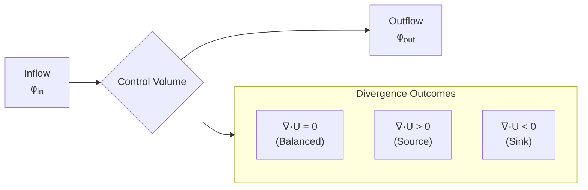
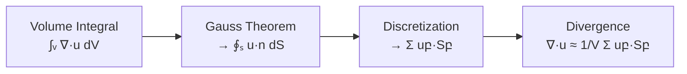

# Divergence Operations: การบังคับใช้การอนุรักษ์ใน OpenFOAM

> [!INFO] **Overview**
> ตัวดำเนินการ Divergence $\nabla \cdot$ เป็นกระบวนการ fundamental ที่วัดปริมาณ **flux สุทธิ** ของสนามเวกเตอร์ผ่านพื้นผิวปิด ในบริบทของ CFD ตัวดำเนินการนี้ปรากฏอย่างกว้างขวางในสมการการอนุรักษ์ที่ควบคุมพลศาสตร์ของไหล



---

## 1. รากฐานทางคณิตศาสตม์และกายภาพ

### 1.1 นิยามของ Divergence

ตัวดำเนินการ divergence $\nabla \cdot$ เปลี่ยนสนามเวกเตอร์เป็นสนามสเกลาร์:

$$\nabla \cdot \mathbf{F} = \frac{\partial F_x}{\partial x} + \frac{\partial F_y}{\partial y} + \frac{\partial F_z}{\partial z}$$

โดยที่:
- $\mathbf{F}$ = สนามเวกเตอร์ (vector field)
- $F_x, F_y, F_z$ = องค์ประกอบของสนามเวกเตอร์
- $\nabla \cdot$ = divergence operator

### 1.2 ความหมายทางกายภาพ

| **เงื่อนไข** | **ความหมาย** | **การตีความ** |
|-------------|---------------|----------------|
| **$\nabla \cdot \mathbf{U} = 0$** | สมดุล | ของไหลไหลเข้าและไหลออกในปริมาณเท่ากัน (Incompressible flow) |
| **$\nabla \cdot \mathbf{U} > 0$** | แหล่งกำเนิด (Source) | มี flux สุทธิไหลออกจากเซลล์ |
| **$\nabla \cdot \mathbf{U} < 0$** | จุดดูด (Sink) | มี flux สุทธิไหลเข้าสู่เซลล์ |

### 1.3 สมการการอนุรักษ์หลัก

**สมการต่อเนื่อง (การอนุรักษ์มวล):**
$$\frac{\partial \rho}{\partial t} + \nabla \cdot (\rho \mathbf{u}) = 0$$

- $\rho$ = ความหนาแน่นของของไหล
- $\mathbf{u}$ = เวกเตอร์ความเร็วของของไหล

**สำหรับการไหลแบบอินคอมเพรสซิเบิลที่ $\rho$ คงที่:**
$$\nabla \cdot \mathbf{u} = 0$$

**การอนุรักษ์โมเมนตัม:**
$$\frac{\partial (\rho \mathbf{u})}{\partial t} + \nabla \cdot (\rho \mathbf{u} \mathbf{u}) = -\nabla p + \nabla \cdot \boldsymbol{\tau} + \rho \mathbf{g}$$

- $p$ = ความดัน
- $\boldsymbol{\tau}$ = เทนเซอร์ความเครียดของเชื้อเพลิง
- $\mathbf{g}$ = เวกเตอร์ความโน้มถ่วง

---

## 2. ทฤษฎีบทของเกาส์ (Gauss Divergence Theorem)

OpenFOAM ใช้ประโยชน์จากคุณสมบัติทางคณิตศาสตม์ที่เปลี่ยนอนุพันธ์ในปริมาตรให้กลายเป็นผลรวมที่หน้าพื้นผิว:

$$\int_V \nabla \cdot \mathbf{U} \, \mathrm{d}V = \oint_A \mathbf{U} \cdot \mathbf{n} \, \mathrm{d}A \approx \sum_f \mathbf{U}_f \cdot \mathbf{S}_f$$

โดยที่:
- $V$ = ปริมาตรของควบคุม (control volume)
- $A$ = พื้นผิวขอบเขตของปริมาตรควบคุม
- $\mathbf{n}$ = เวกเตอร์หน่วยที่ตั้งฉากกับพื้นผิว
- $\mathbf{S}_f = \mathbf{n}_f A_f$ = เวกเตอร์พื้นที่หน้าที่ชี้ออกจากเซลล์
- $\mathbf{U}_f \cdot \mathbf{S}_f$ = ฟลักซ์ (Flux) ที่ไหลผ่านหน้าเซลล์ $f$

> [!TIP] **Why This Matters**
> การใช้ทฤษฎีบทของ Gauss รับประกันว่า OpenFOAM จะมีความแม่นยำสูงในเรื่องการอนุรักษ์มวล เพราะ flux ที่เข้าและออกจากแต่ละเซลล์ถูกคำนวณโดยตรงจากผลรวมบนหน้าเซลล์

---

## 3. การ Discretization ด้วย Finite Volume

OpenFOAM ใช้งานการดำเนินการ divergence โดยใช้วิธี finite volume ซึ่งให้การ discretization ที่อนุรักษ์โดยธรรมชาติ

### 3.1 การ Discretization บน Control Volume

สำหรับเซลล์การคำนวณที่มีปริมาตร $V$ และ $N$ หน้า:
$$\nabla \cdot \mathbf{u} \approx \frac{1}{V} \sum_{f=1}^{N} \mathbf{u}_f \cdot \mathbf{S}_f$$

### 3.2 รูปแบบ Discretization



---

## 4. การ Implement ใน OpenFOAM

### 4.1 การดำเนินการ Divergence พื้นฐาน

```cpp
// Divergence ของสนามเวกเตอร์คืนค่าสนามสเกลาร์
volScalarField divU = fvc::div(U);

// Divergence ของสนาม flux (รวมพื้นที่ผิวแล้ว)
volScalarField divPhi = fvc::div(phi);

// Divergence ของ flux แบบ convection กับสนามสเกลาร์
volScalarField convTerm = fvc::div(phi, T);
```

### 4.2 รูปแบบ Divergence ขั้นสูง

```cpp
// เทอม convective สำหรับการไหลแบบคอมเพรสซิเบิล
volScalarField divRhoU = fvc::div(rhoPhi, U);

// Divergence กับ scheme การ interpolation แบบกำหนดเอง
volScalarField divCustom = fvc::div(
    upwind<scalar>(mesh, phi) & mesh.Sf()
);

// Divergence ของสนามเทนเซอร์
volVectorField divTau = fvc::div(tau);
```

### 4.3 Explicit vs Implicit Operations

คุณสามารถเรียกใช้ไดเวอร์เจนซ์ได้ทั้งแบบ Explicit (`fvc`) และ Implicit (`fvm`):

| **ประเภท** | **Namespace** | **การใช้งาน** | **ตัวอย่าง** |
|-----------|--------------|----------------|---------------|
| **Explicit** | `fvc::` | Source terms, post-processing | `fvc::div(U)` |
| **Implicit** | `fvm::` | Matrix assembly for equations | `fvm::div(phi, T)` |

```cpp
// คำนวณค่า Divergence จากความเร็วปัจจุบัน (ได้ผลลัพธ์เป็น Scalar field)
volScalarField divU = fvc::div(U);

// สร้างเมทริกซ์สำหรับเทอม Convection ในสมการขนส่ง (Implicit)
// โดยใช้ฟลักซ์ phi ที่มีอยู่แล้ว
fvm::div(phi, T)
```

---

## 5. กลไกการคำนวณ Flux

Surface flux $\phi_f$ สามารถคำนวณได้หลายวิธีขึ้นอยู่กับบริบททางฟิสิกส์:

| **ชนิด Flux** | **สมการ** | **การใช้งาน** |
|--------------|------------|----------------|
| **Mass Flux** | $\phi_f = (\rho \mathbf{u})_f \cdot \mathbf{S}_f$ | การอนุรักษ์มวล |
| **Momentum Flux** | $\phi_f^{\text{mom}} = (\rho \mathbf{u} \mathbf{u})_f \cdot \mathbf{S}_f$ | การอนุรักษ์โมเมนตัม |
| **Heat Flux** | $q_f = (-k \nabla T)_f \cdot \mathbf{S}_f$ | การถ่ายเทความร้อน |

---

## 6. การกำหนดค่า Numerical Schemes (Div Schemes)

การเลือก numerical scheme ส่งผลต่อความแม่นยำและเสถียรภาพของการคำนวณ divergence อย่างมีนัยสำคัญ

### 6.1 การตั้งค่าใน `system/fvSchemes`

```cpp
divSchemes
{
    // General divergence scheme
    default         Gauss linear;

    // Convective terms กับการ stabilizes ที่แตกต่างกัน
    div(phi,U)      Gauss linearUpwindV grad(U);
    div(phi,T)      Gauss limitedLinearV 1;
    div(phi,k)      Gauss limitedLinearV 0.5;
    div(phi,epsilon) Gauss limitedLinearV 0.77;

    // Diffusive terms
    div((nuEff*dev2(T(grad(U))))) Gauss linear;

    // Compressible flow
    div(rhoPhi,U)   Gauss upwind;
}
```

### 6.2 การเปรียบเทียบ Numerical Schemes

| **Scheme** | **คำอธิบาย** | **ความแม่นยำ** | **เสถียรภาพ** | **การใช้งาน** |
|-----------|---------------|------------------|----------------|----------------|
| **Gauss linear** | Central differencing อันดับสอง | สูง | ต่ำ | การไหลลามินาร์, mesh คุณภาพสูง |
| **Gauss linearUpwind** | Upwind อันดับหนึ่ง | กลาง | สูง | ทั่วไป, การไหลทัวร์บูลเลนต์ |
| **Gauss limitedLinear** | Blended scheme กับ TVD limiter | สูง | กลาง | กรณีทั่วไป, การไหลมีความคล่องตัว |
| **Gauss upwind** | Upwind อันดับหนึ่งแบบเต็ม | ต่ำ | สูงมาก | การไหลที่มีปัญหาความเสถียร |

### 6.3 สรุปการเลือก Scheme

| **Scheme** | **คุณลักษณะ** | **การใช้งาน** |
|-----------|---------------|----------------|
| **`Gauss upwind`** | เสถียรสูงมาก แต่ความแม่นยำต่ำ (ลำดับ 1) | ใช้ในการเริ่มต้นรัน หรือเคสที่รันยาก |
| **`Gauss linear`** | แม่นยำสูง (ลำดับ 2) แต่เสถียรน้อยกว่า | ใช้ในงานวิจัยหรืองานที่ต้องการความละเอียดสูง |
| **`Gauss linearUpwind`** | สมดุลระหว่างความแม่นยำและความเสถียร | **แนะนำ** สำหรับงานวิศวกรรมส่วนใหญ่ |

> [!WARNING] **Trade-off Warning**
> การเลือก scheme ที่มีความแม่นยำสูงอาจทำให้เกิดปัญหาความเสถียร โดยเฉพาะบน mesh ที่มีคุณภาพต่ำหรือการไหลที่มี gradient สูง

---

## 7. คุณสมบัติการอนุรักษ์

การกำหนดรูปแบบ finite volume รับประกันการอนุรักษ์เฉพาะที่โดยการก่อสร้าง

### 7.1 การตรวจสอบการอนุรักษ์เฉพาะที่

```cpp
// ตรวจสอบสมดุลมวลสำหรับการไหลแบบอินคอมเพรสซิเบิล
volScalarField continuityError = fvc::div(U);

forAll(continuityError, celli)
{
    if (mag(continuityError[celli]) > tolerance)
    {
        WarningIn("solver") << "Mass imbalance in cell " << celli
            << ": " << continuityError[celli] << endl;
    }
}
```

### 7.2 การตรวจสอบการอนุรักษ์ทั่วโลก

```cpp
// ตรวจสอบสมดุลมวลทั่วโลก
scalar globalMassError = sum(fvc::div(U) * mesh.V());

Info << "Global mass continuity error: " << globalMassError << endl;
```

---

## 8. เงื่อนไขขอบเขตและการอนุรักษ์ Flux

จำเป็นต้องมีการจัดการพิเศษที่ขอบเขตเพื่อรักษาการอนุรักษ์

### 8.1 การจัดการเงื่อนไขขอบเขต

```cpp
// เงื่อนไขขอบเขตความเร็วคงที่ (flux ที่กำหนด)
U.boundaryFieldRef()[inletPatch] = vector(1, 0, 0);

// ไล่ระดับศูนย์ (normal flux ศูนย์)
U.boundaryFieldRef()[outletPatch].gradient() = vector::zero;

// เงื่อนไขขอบเขตสมมาตร (normal flux ศูนย์)
U.boundaryFieldRef()[symmetryPatch] =
    U.boundaryField()[symmetryPatch].mirror();
```

### 8.2 ชนิดของเงื่อนไขขอบเขต

| **ประเภท** | **นิยาม** | **OpenFOAM Type** | **Flux Condition** |
|-----------|-----------|------------------|-------------------|
| **Dirichlet** | $\phi = \phi_0$ | `fixedValue` | Flux ถูกกำหนดโดยค่า |
| **Neumann** | $\frac{\partial \phi}{\partial n} = q_0$ | `fixedGradient` | Normal flux ถูกกำหนด |
| **Zero Gradient** | $\frac{\partial \phi}{\partial n} = 0$ | `zeroGradient` | Normal flux = 0 |

---

## 9. การประยุกต์ใช้ในทางปฏิบัติ

### 9.1 การ Implement สมการต่อเนื่อง

```cpp
// Solver การไหลแบบอินคอมเพรสซิเบิล
fvScalarMatrix pEqn
(
    fvc::div(phi) - fvm::laplacian(rAU, p) == 0
);

// การไหลแบบคอมเพรสซิเบิล
fvScalarMatrix rhoEqn
(
    fvm::ddt(rho)
  + fvc::div(rhoPhi)
 ==
    fvOptions(rho)
);
```

### 9.2 สมการโมเมนตัม

```cpp
fvVectorMatrix UEqn
(
    fvm::ddt(rho, U)
  + fvm::div(rhoPhi, U)
 ==
    fvc::div(tau)
  - fvc::grad(p)
  + fvOptions(rho, U)
);
```

### 9.3 แอปพลิเคชันทั่วไป

| **แอปพลิเคชัน** | **สมการ** | **OpenFOAM Implementation** |
|------------------|------------|----------------------------|
| **Mass Conservation** | $\nabla \cdot \mathbf{U} = 0$ | `fvc::div(phi)` |
| **Compressible Flow** | $\frac{\partial \rho}{\partial t} + \nabla \cdot (\rho \mathbf{U}) = 0$ | `fvc::div(rhoPhi)` |
| **Momentum Convection** | $\nabla \cdot (\mathbf{U}\mathbf{U})$ | `fvc::div(UU)` |
| **Stress Divergence** | $\nabla \cdot \boldsymbol{\tau}$ | `fvc::div(tau)` |
| **Heat Flux** | $\nabla \cdot \mathbf{q}$ | `fvc::div(q)` |

---

## 10. การจัดการข้อผิดพลาดและการ Debugging

### 10.1 ข้อผิดพลาดทั่วไปและวิธีแก้ไข

```cpp
// ERROR: พยายามหา divergence ของสนามสเกลาร์
// volScalarField wrong = fvc::div(T);  // ข้อผิดพลาดการคอมไพล์

// CORRECT: ใช้รูปแบบสนาม flux สำหรับ convection
volScalarField correct = fvc::div(phi, T);

// ERROR: ชนิดสนามไม่สอดคล้องกัน
// volScalarField result = fvc::div(vectorField);  // ชนิดไม่ตรงกัน

// WARNING: ตรวจสอบความสอดคล้องของสนามก่อนการดำเนินการ
if (phi.dimensions() == dimVelocity*dimArea)
{
    volScalarField divPhi = fvc::div(phi);
}
```

### 10.2 เครื่องมือ Debugging

```cpp
// ตรวจสอบความสอดคล้องของสนาม flux
Info << "Flux field dimensions: " << phi.dimensions() << endl;
Info << "Max divergence: " << max(mag(fvc::div(phi))) << endl;

// สร้างภาพสนาม divergence
divPhi.write();
```

---

## 11. พิจารณาด้านประสิทธิภาพ

### 11.1 การ Implement ที่เพิ่มประสิทธิภาพ

```cpp
// คำนวณเทอม flux ล่วงหน้าเมื่อเป็นไปได้
surfaceScalarField phiNew = fvc::interpolate(rho) * phi;

// ใช้ face fluxes ที่แคชไว้
volScalarField divRhoU = fvc::div(rhoPhi, U);

// หลีกเลี่ยงการคำนวณ divergence ซ้ำ
volScalarField divU = fvc::div(U);
volScalarField divV = fvc::div(V);
```

### 11.2 การเปรียบเทียบประสิทธิภาพ

| **แง่มุม** | **Explicit (`fvc::`)** | **Implicit (`fvm::`)** |
|------------|----------------------|----------------------|
| **การใช้หน่วยความจำ** | O(N) | O(N) สำหรับ sparse matrix |
| **ต้นทุน CPU** | O(N) | O(N log N) ถึง O(N²) |
| **ประสิทธิภาพขนาน** | ยอดเยี่ยม | ซับซ้อนกว่า |
| **ข้อจำกัดความเสถียร** | เข้มงวด | หลวมกว่า |

---

## 12. สรุป

### 12.1 ประเด็นสำคัญ

1. **รากฐานทางคณิตศาสตม์**: Divergence วัดปริมาณ flux สุทธิผ่านขอบเขตปริมาตรควบคุม

2. **คุณสมบัติการอนุรักษ์**: Finite volume discretization รับประกันการอนุรักษ์เฉพาะที่และทั่วโลก

3. **รูปแบบหลายแบบ**: `fvc::div()` ให้ overloads สำหรับบริบททางฟิสิกส์ที่แตกต่างกัน

4. **การเลือก Scheme**: การเลือก numerical scheme ส่งผลต่อความแม่นยำและเสถียรภาพ

5. **การจัดการขอบเขต**: จำเป็นต้องมีการจัดการพิเศษที่ขอบเขตเพื่อรักษาการอนุรักษ์

6. **การป้องกันข้อผิดพลาด**: การตรวจสอบชนิดสนามและการใช้สนาม flux อย่างเหมาะสมเป็นสิ่งจำเป็น

7. **ประสิทธิภาพ**: การ implement ที่มีประสิทธิภาพต้องการการจัดการ flux อย่างระมัดระวัง

### 12.2 แนวคิดหลัก

> **`fvc::div` และ `fvm::div` คือกลไกที่บังคับให้ฟิสิกส์ในคอมพิวเตอร์เคารพกฎการอนุรักษ์ของธรรมชาติ**

การดำเนินการ divergence นี้เป็นกระดูกสันหลังของสมการการอนุรักษ์ CFD ใน OpenFOAM โดยให้กรอบคณิตศาสตม์สำหรับการบังคับใช้การอนุรักษ์มวล โมเมนตัม และพลังงานทั่วโดเมนการคำนวณ

---

## 📚 References

- [[02_🎯_Learning_Objectives]] - วัตถุประสงค์การเรียนรู้เกี่ยวกับ divergence operations
- [[03_Understanding_the_`fvc`_Namespace]] - ความเข้าใจ namespace fvc:: อย่างละเอียด
- [[04_1._Gradient_Operations]] - การดำเนินการ Gradient ที่เกี่ยวข้อง
- [[06_3._Curl_Operations]] - การดำเนินการ Curl สำหรับ vorticity
- [[07_4._Laplacian_Operations]] - การดำเนินการ Laplacian สำหรับ diffusion
- [[08_🔧_Practical_Exercises]] - แบบฝึกหัดปฏิบัติเกี่ยวกับ divergence conservation
- [[10_🎓_Key_Takeaways]] - สรุปประเด็นสำคัญของ vector calculus operations
