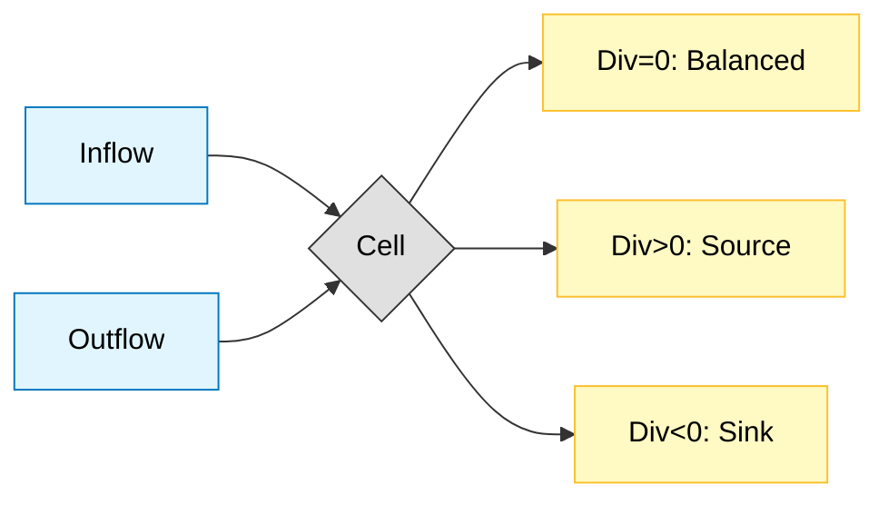

# Divergence Operations: การบังคับใช้การอนุรักษ์ใน OpenFOAM

> [!INFO] **Overview**
> ตัวดำเนินการ Divergence $\nabla \cdot$ เป็นกระบวนการ fundamental ที่วัดปริมาณ **flux สุทธิ** ของสนามเวกเตอร์ผ่านพื้นผิวปิด ในบริบทของ CFD ตัวดำเนินการนี้ปรากฏอย่างกว้างขวางในสมการการอนุรักษ์ที่ควบคุมพลศาสตร์ของไหล

> [!TIP] **ทำไม Divergence ถึงสำคัญ?**
> ตัวดำเนินการ Divergence ($\nabla \cdot$) เป็นหัวใจของ **การอนุรักษ์มวล (Mass Conservation)** ใน OpenFOAM ถ้าคำนวณผิด แบบจำลองจะไม่สมดุล (mass imbalance) และผลลัพธ์จะไม่ถูกต้อง ใน OpenFOAM เราควบคุมการคำนวณ divergence ผ่าน **`divSchemes`** ในไฟล์ `system/fvSchemes` ซึ่งกำหนดความแม่นยำและความเสถียรของการจำลอง


> **Figure 1:** แผนภาพแสดงการไหลเข้าและออกจากปริมาตรควบคุม ซึ่งเป็นหัวใจของตัวดำเนินการไดเวอร์เจนซ์ (Divergence) ในการตรวจสอบความสมดุลของฟลักซ์

---

## 🎯 Learning Objectives

เมื่ออ่านจบบทนี้ คุณจะสามารถ:

1. **เข้าใจ** นิยามทางคณิตศาสตร์และความหมายทางกายภาพของ divergence operations
2. **อธิบาย** ความแตกต่างระหว่าง `fvc::div` (explicit) และ `fvm::div` (implicit)
3. **ใช้งาน** divergence operations ใน OpenFOAM solvers อย่างถูกต้อง
4. **เลือก** numerical schemes ที่เหมาะสมสำหรับแต่ละกรณีใน `system/fvSchemes`
5. **ตรวจสอบ** การอนุรักษ์มวล (mass conservation) ด้วย divergence calculations
6. **แก้ไข** ปัญหาที่เกิดจากการตั้งค่า divSchemes ที่ไม่เหมาะสม

---

## 1. นิยามทางคณิตศาสตม์และกายภาพ

> [!NOTE] **📂 OpenFOAM Context**
> ส่วนนี้เกี่ยวข้องกับ **Domain B: Numerics & Linear Algebra** และ **Domain E: Coding/Customization**
> - **Implementation:** `src/finiteVolume/fvc/fvcDiv.C` (source code สำหรับ `fvc::div()`)
> - **Fundamental Concept:** Divergence ใช้ในทุก solver เพื่อบังคับกฎการอนุรักษ์ (Conservation Laws)
> - **การนำไปใช้:** ทุกครั้งที่เห็น `fvc::div()` หรือ `fvm::div()` ใน solver code คือการคำนวณ flux สุทธิออกจากเซลล์

### 1.1 นิยามของ Divergence

ตัวดำเนินการ divergence $\nabla \cdot$ เปลี่ยนสนามเวกเตอร์เป็นสนามสเกลาร์:

$$\nabla \cdot \mathbf{F} = \frac{\partial F_x}{\partial x} + \frac{\partial F_y}{\partial y} + \frac{\partial F_z}{\partial z}$$

โดยที่:
- $\mathbf{F}$ = สนามเวกเตอร์ (vector field)
- $F_x, F_y, F_z$ = องค์ประกอบของสนามเวกเตอร์
- $\nabla \cdot$ = divergence operator

### 1.2 ความหมายทางกายภาพ

| **เงื่อนไข** | **ความหมาย** | **การตีความ** |
|-------------|---------------|----------------|
| **$\nabla \cdot \mathbf{U} = 0$** | สมดุล | ของไหลไหลเข้าและไหลออกในปริมาณเท่ากัน (Incompressible flow) |
| **$\nabla \cdot \mathbf{U} > 0$** | แหล่งกำเนิด (Source) | มี flux สุทธิไหลออกจากเซลล์ |
| **$\nabla \cdot \mathbf{U} < 0$** | จุดดูด (Sink) | มี flux สุทธิไหลเข้าสู่เซลล์ |

### 1.3 สมการการอนุรักษ์หลัก

**สมการต่อเนื่อง (การอนุรักษ์มวล):**
$$\frac{\partial \rho}{\partial t} + \nabla \cdot (\rho \mathbf{u}) = 0$$

- $\rho$ = ความหนาแน่นของของไหล
- $\mathbf{u}$ = เวกเตอร์ความเร็วของของไหล

**สำหรับการไหลแบบอินคอมเพรสซิเบิลที่ $\rho$ คงที่:**
$$\nabla \cdot \mathbf{u} = 0$$

**การอนุรักษ์โมเมนตัม:**
$$\frac{\partial (\rho \mathbf{u})}{\partial t} + \nabla \cdot (\rho \mathbf{u} \mathbf{u}) = -\nabla p + \nabla \cdot \boldsymbol{\tau} + \rho \mathbf{g}$$

- $p$ = ความดัน
- $\boldsymbol{\tau}$ = เทนเซอร์ความเครียดของเชื้อเพลิง
- $\mathbf{g}$ = เวกเตอร์ความโน้มถ่วง

---

## 2. ทฤษฎีบทของเกาส์ (Gauss Divergence Theorem)

> [!NOTE] **📂 OpenFOAM Context**
> ส่วนนี้เกี่ยวข้องกับ **Domain B: Numerics & Linear Algebra**
> - **Numerical Foundation:** ทฤษฎีบท Gauss คือฐานของ Finite Volume Method ใน OpenFOAM
> - **Implementation:** ใช้แปลง volume integral ($\int_V \nabla \cdot \mathbf{U} \, dV$) เป็น surface integral ($\oint_A \mathbf{U} \cdot \mathbf{n} \, dA$)
> - **Code Location:** `src/finiteVolume/fvDivSchemes/gaussDivScheme.C` สำหรับ Gauss theorem implementation
> - **การใช้งาน:** ทุก divergence calculation ใน OpenFOAM ใช้ Gauss theorem แบบ discretized

OpenFOAM ใช้ประโยชน์จากคุณสมบัติทางคณิตศาสตม์ที่เปลี่ยนอนุพันธ์ในปริมาตรให้กลายเป็นผลรวมที่หน้าพื้นผิว:

$$\int_V \nabla \cdot \mathbf{U} \, \mathrm{d}V = \oint_A \mathbf{U} \cdot \mathbf{n} \, \mathrm{d}A \approx \sum_f \mathbf{U}_f \cdot \mathbf{S}_f$$

โดยที่:
- $V$ = ปริมาตรของควบคุม (control volume)
- $A$ = พื้นผิวขอบเขตของปริมาตรควบคุม
- $\mathbf{n}$ = เวกเตอร์หน่วยที่ตั้งฉากกับพื้นผิว
- $\mathbf{S}_f = \mathbf{n}_f A_f$ = เวกเตอร์พื้นที่หน้าที่ชี้ออกจากเซลล์
- $\mathbf{U}_f \cdot \mathbf{S}_f$ = ฟลักซ์ (Flux) ที่ไหลผ่านหน้าเซลล์ $f$

> [!TIP] **Why This Matters**
> การใช้ทฤษฎีบทของ Gauss รับประกันว่า OpenFOAM จะมีความแม่นยำสูงในเรื่องการอนุรักษ์มวล เพราะ flux ที่เข้าและออกจากแต่ละเซลล์ถูกคำนวณโดยตรงจากผลรวมบนหน้าเซลล์

---

## 3. การ Discretization ด้วย Finite Volume

> [!NOTE] **📂 OpenFOAM Context**
> ส่วนนี้เกี่ยวข้องกับ **Domain B: Numerics & Linear Algebra**
> - **Discretization Method:** Finite Volume Method (FVM) คือหัวใจของ OpenFOAM
> - **Mesh Structure:** ใช้ `fvMesh` class เพื่อเข้าถึงข้อมูลเซลล์และหน้าเซลล์ (mesh.V(), mesh.Sf())
> - **Implementation:** `src/finiteVolume/fvMesh/fvMesh.C` สำหรับโครงสร้าง mesh
> - **การคำนาณ:** $\sum_f \mathbf{U}_f \cdot \mathbf{S}_f$ คือการรวม flux ทั้งหมดของหน้าเซลล์ทุกหน้า

OpenFOAM ใช้งานการดำเนินการ divergence โดยใช้วิธี finite volume ซึ่งให้การ discretization ที่อนุรักษ์โดยธรรมชาติ

### 3.1 การ Discretization บน Control Volume

สำหรับเซลล์การคำนาณที่มีปริมาตร $V$ และ $N$ หน้า:
$$\nabla \cdot \mathbf{u} \approx \frac{1}{V} \sum_{f=1}^{N} \mathbf{u}_f \cdot \mathbf{S}_f$$

### 3.2 รูปแบบ Discretization

```mermaid
flowchart LR
classDef theory fill:#e1bee7,stroke:#4a148c,color:#000
classDef step fill:#fff9c4,stroke:#fbc02d,color:#000
classDef code fill:#c8e6c9,stroke:#2e7d32,color:#000
Vol[Integral Form]:::theory -->|Gauss| Surf[Surface Form]:::theory
Surf -->|Summation| Disc[Discrete Faces]:::step
Disc -->|Code| Res[fvc::div(phi)]:::code
```
> **Figure 2:** ขั้นตอนการแปลงอนุพันธ์เชิงปริมาตรให้เป็นผลรวมของฟลักซ์ที่หน้าพื้นผิวผ่านทฤษฎีบทของเกาส์ (Gauss Theorem) เพื่อใช้ในวิธีปริมาตรจำกัด (Finite Volume Method)

---

## 4. การ Implement ใน OpenFOAM

> [!NOTE] **📂 OpenFOAM Context**
> ส่วนนี้เกี่ยวข้องกับ **Domain E: Coding/Customization**
> - **Header Files:** `src/finiteVolume/fvc/fvcDiv.H` (function declarations), `src/finiteVolume/fvm/fvmDiv.H` (implicit version)
> - **Source Files:** `src/finiteVolume/fvc/fvcDiv.C` (explicit implementations)
> - **Namespace:**
>   - `fvc::` (Finite Volume Calculus) - explicit operations คำนวณค่าโดยตรง
>   - `fvm::` (Finite Volume Method) - implicit operations สร้างเมทริกซ์สำหรับ solver
> - **Common Usage:** ใช้ในทุก solver เช่น `simpleFoam`, `pimpleFoam`, `interFoam` สำหรับสมการการอนุรักษ์

### 4.1 การดำเนินการ Divergence พื้นฐาน

```cpp
// Divergence of a vector field returns a scalar field
// การคำนาณ divergence ของสนามเวกเตอร์ ได้ผลลัพธ์เป็นสนามสเกลาร์
volScalarField divU = fvc::div(U);

// Divergence of flux field (area-weighted)
// การคำนาณ divergence ของสนามฟลักซ์ (ถ่วงน้ำหนักด้วยพื้นที่)
volScalarField divPhi = fvc::div(phi);

// Divergence of convective flux with a scalar field
// การคำนาณ divergence ของฟลักซ์ convection ร่วมกับสนามสเกลาร์
volScalarField convTerm = fvc::div(phi, T);
```

> **📖 Source:** `applications/solvers/multiphase/multiphaseEulerFoam/phaseSystems/phaseSystem/phaseSystem.C`
>
> **📝 คำอธิบาย:** โค้ดตัวอย่างแสดงการใช้งาน `fvc::div()` ในรูปแบบพื้นฐาน 3 แบบ:
> 1. `fvc::div(U)` - คำนาณ divergence ของสนามความเร็ว ได้ผลลัพธ์เป็นสนามสเกลาร์
> 2. `fvc::div(phi)` - คำนาณ divergence ของ surface flux field (มีหน่วย [m³/s])
> 3. `fvc::div(phi, T)` - คำนาณเทอม convection สำหรับสมการขนส่งสเกลาร์
>
> **🔑 Key Concepts:**
> - `fvc::div()` เป็น explicit operation คำนาณค่าโดยตรงจากสนามที่มีอยู่
> - ผลลัพธ์เป็น `volScalarField` สำหรับทุก cell ใน mesh
> - การคำนาณภายในใช้ Gauss theorem: $\sum_f \phi_f \cdot S_f / V$

### 4.2 รูปแบบ Divergence ขั้นสูง

```cpp
// Convective term for compressible flow
// เทอม convection สำหรับการไหลแบบอัดตัวได้ (compressible)
volScalarField divRhoU = fvc::div(rhoPhi, U);

// Divergence with custom interpolation scheme
// การคำนาณ divergence พร้อมระบุ interpolation scheme แบบ custom
volScalarField divCustom = fvc::div(
    upwind<scalar>(mesh, phi) & mesh.Sf()
);

// Divergence of tensor field (e.g., stress tensor)
// การคำนาณ divergence ของสนามเทนเซอร์ (เช่น เทนเซอร์ความเค้น)
volVectorField divTau = fvc::div(tau);
```

> **📂 Source:** `applications/solvers/multiphase/multiphaseEulerFoam/phaseSystems/PhaseSystems/MomentumTransferPhaseSystem/MomentumTransferPhaseSystem.C`
>
> **📝 คำอธิบาย:** ตัวอย่างการใช้งานขั้นสูงของ divergence operations:
> 1. `fvc::div(rhoPhi, U)` - สำหรับ compressible flow โดยใช้ mass flux `rhoPhi`
> 2. การระบุ interpolation scheme แบบกำหนดเอง (เช่น upwind) ผ่าน template parameter
> 3. `fvc::div(tau)` - divergence ของสนามเทนเซอร์ ได้ผลลัพธ์เป็นสนามเวกเตอร์
>
> **🔑 Key Concepts:**
> - ใน compressible flow ต้องใช้ `rhoPhi` (mass flux) แทน `phi` (volume flux)
> - Interpolation scheme ควบคุมวิธีคำนาณค่าที่ face centers
> - Divergence ของเทนเซอร์ใช้ในการคำนาณแรงจากความเค้น (stress forces)

### 4.3 Explicit vs Implicit Operations

คุณสามารถเรียกใช้ไดเวอร์เจนซ์ได้ทั้งแบบ Explicit (`fvc`) และ Implicit (`fvm`):

| **ประเภท** | **Namespace** | **การใช้งาน** | **ตัวอย่าง** |
|-----------|--------------|----------------|---------------|
| **Explicit** | `fvc::` | Source terms, post-processing | `fvc::div(U)` |
| **Implicit** | `fvm::` | Matrix assembly for equations | `fvm::div(phi, T)` |

```cpp
// Calculate divergence from current velocity (explicit)
// คำนาณ divergence แบบ explicit จากความเร็วปัจจุบัน
volScalarField divU = fvc::div(U);

// Build matrix for convection term in transport equation (implicit)
// สร้างเมทริกซ์สำหรับเทอม convection ในสมการขนส่ง (implicit)
fvm::div(phi, T)
```

> **📂 Source:** `applications/solvers/multiphase/multiphaseEulerFoam/phaseSystems/phaseSystem/phaseSystem.H`
>
> **📝 คำอธิบาย:** ความแตกต่างระหว่าง explicit และ implicit divergence:
> - **Explicit (`fvc::div`)**: คำนาณค่า divergence โดยตรง ใช้สำหรับ source terms หรือ post-processing
> - **Implicit (`fvm::div`)**: สร้างเมทริกซ์สำหรับการแก้สมการ ใช้ใน implicit solvers
>
> **🔑 Key Concepts:**
> - `fvc` = finite volume calculus (explicit operations)
> - `fvm` = finite volume method (implicit operations)
> - Implicit จำเป็นสำหรับการแก้สมการที่มีความคงตัวของเวลา (time stability)
> - Explicit เร็วกว่า แต่มีข้อจำกัดเรื่องความเสถียรของ time step

---

## 5. กลไกการคำนาณ Flux

> [!NOTE] **📂 OpenFOAM Context**
> ส่วนนี้เกี่ยวข้องกับ **Domain B: Numerics & Linear Algebra** และ **Domain A: Physics & Fields**
> - **Flux Field:** `phi` คือ surfaceScalarField เก็บค่า $\mathbf{U} \cdot \mathbf{S}_f$ สำหรับทุกหน้าเซลล์
> - **Location:** สร้างใน solver createFields.H หรือคำนาณใน main loop
> - **Common Variables:**
>   - `phi` - volume flux ($\mathbf{U} \cdot \mathbf{S}_f$, หน่วย $m^3/s$)
>   - `rhoPhi` - mass flux ($\rho \mathbf{U} \cdot \mathbf{S}_f$, หน่วย $kg/s$)
> - **Usage:** Flux ถูกส่งผ่านระหว่างสมการต่างๆ เพื่อรักษา conservation

Surface flux $\phi_f$ สามารถคำนาณได้หลายวิธีขึ้นอยู่กับบริบททางฟิสิกส์:

| **ชนิด Flux** | **สมการ** | **การใช้งาน** |
|--------------|------------|----------------|
| **Mass Flux** | $\phi_f = (\rho \mathbf{u})_f \cdot \mathbf{S}_f$ | การอนุรักษ์มวล |
| **Momentum Flux** | $\phi_f^{\text{mom}} = (\rho \mathbf{u} \mathbf{u})_f \cdot \mathbf{S}_f$ | การอนุรักษ์โมเมนตัม |
| **Heat Flux** | $q_f = (-k \nabla T)_f \cdot \mathbf{S}_f$ | การถ่ายเทความร้อน |

---

## 6. การกำหนดค่า Numerical Schemes (Div Schemes)

> [!NOTE] **📂 OpenFOAM Context**
> ส่วนนี้เกี่ยวข้องกับ **Domain B: Numerics & Linear Algebra** ⭐ **CRITICAL FILE**
> - **File:** `system/fvSchemes` (คุณต้องแก้ไขไฟล์นี้ทุกครั้งที่สร้าง case)
> - **Section:** `divSchemes` { ... }
> - **Keywords หลัก:**
>   - `default` - scheme สำหรับทุก divergence terms
>   - `div(phi,U)` - scheme สำหรับ convection ของความเร็ว
>   - `div(phi,k)` - scheme สำหรับ convection ของ turbulent kinetic energy
>   - `Gauss` - ระบุการใช้ Gauss theorem
>   - `linear`, `upwind`, `limitedLinear` - interpolation schemes
> - **Implementation:** `src/finiteVolume/fvDivSchemes/` (ทุก schemes อยู่ที่นี่)

การเลือก numerical scheme ส่งผลต่อความแม่นยำและเสถียรภาพของการคำนาณ divergence อย่างมีนัยสำคัญ

### 6.1 การตั้งค่าใน `system/fvSchemes`

```cpp
divSchemes
{
    // General divergence scheme
    // รูปแบบ divergence scheme ทั่วไป
    default         Gauss linear;

    // Convective terms with different stabilization schemes
    // เทอม convection พร้อมรูปแบบการ stabilizes ที่แตกต่างกัน
    div(phi,U)      Gauss linearUpwindV grad(U);
    div(phi,T)      Gauss limitedLinearV 1;
    div(phi,k)      Gauss limitedLinearV 0.5;
    div(phi,epsilon) Gauss limitedLinearV 0.77;

    // Diffusive terms
    // เทอม diffusion
    div((nuEff*dev2(T(grad(U))))) Gauss linear;

    // Compressible flow
    // การไหลแบบ compressible
    div(rhoPhi,U)   Gauss upwind;
}
```

> **📖 Source:** `applications/solvers/multiphase/multiphaseEulerFoam/phaseSystems/PhaseSystems/MomentumTransferPhaseSystem/MomentumTransferPhaseSystem.C`
>
> **📝 คำอธิบาย:** การตั้งค่า divergence schemes ในไฟล์ `fvSchemes`:
> - `default`: scheme ที่ใช้สำหรับ terms ที่ไม่ได้ระบุเฉพาะ
> - `Gauss`: ระบุว่าใช้ Gauss theorem สำหรับการแปลง volume integral เป็น surface integral
> - `linear/linearUpwind/limitedLinear`: interpolation scheme ที่ face centers
> - `div(phi,U)`: ระบุ scheme เฉพาะสำหรับ convection ของความเร็ว
>
> **🔑 Key Concepts:**
> - รูปแบบ: `Gauss <interpolationScheme>`
> - `linear`: central differencing อันดับสอง แม่นยำแต่เสถียรน้อย
> - `upwind`: อันดับหนึ่ง เสถียรสูงแต่ diffusive
> - `limitedLinear`: ผสมผสานความแม่นยำและความเสถียรด้วย flux limiter
> - ค่าตัวเลข (0.5, 0.77, 1.0) คือ limiter coefficient สำหรับ TVD schemes

### 6.2 การเปรียบเทียบ Numerical Schemes

| **Scheme** | **คำอธิบาย** | **ความแม่นยำ** | **เสถียรภาพ** | **การใช้งาน** |
|-----------|---------------|------------------|----------------|----------------|
| **Gauss linear** | Central differencing อันดับสอง | สูง | ต่ำ | การไหลลามินาร์, mesh คุณภาพสูง |
| **Gauss linearUpwind** | Upwind อันดับหนึ่ง | กลาง | สูง | ทั่วไป, การไหลทัวร์บูลเลนต์ |
| **Gauss limitedLinear** | Blended scheme กับ TVD limiter | สูง | กลาง | กรณีทั่วไป, การไหลมีความคล่องตัว |
| **Gauss upwind** | Upwind อันดับหนึ่งแบบเต็ม | ต่ำ | สูงมาก | การไหลที่มีปัญหาความเสถียร |

### 6.3 สรุปการเลือก Scheme

| **Scheme** | **คุณลักษณะ** | **การใช้งาน** |
|-----------|---------------|----------------|
| **`Gauss upwind`** | เสถียรสูงมาก แต่ความแม่นยำต่ำ (ลำดับ 1) | ใช้ในการเริ่มต้นรัน หรือเคสที่รันยาก |
| **`Gauss linear`** | แม่นยำสูง (ลำดับ 2) แต่เสถียรน้อยกว่า | ใช้ในงานวิจัยหรืองานที่ต้องการความละเอียดสูง |
| **`Gauss linearUpwind`** | สมดุลระหว่างความแม่นยำและความเสถียร | **แนะนำ** สำหรับงานวิศวกรรมส่วนใหญ่ |

> [!WARNING] **Trade-off Warning**
> การเลือก scheme ที่มีความแม่นยำสูงอาจทำให้เกิดปัญหาความเสถียร โดยเฉพาะบน mesh ที่มีคุณภาพต่ำหรือการไหลที่มี gradient สูง

---

## 7. คุณสมบัติการอนุรักษ์

> [!NOTE] **📂 OpenFOAM Context**
> ส่วนนี้เกี่ยวข้องกับ **Domain B: Numerics & Linear Algebra** และ **Domain E: Coding/Customization**
> - **Conservation Check:** ใช้ `fvc::div()` เพื่อตรวจสอบ mass balance
> - **Monitoring:** ใช้ `functionObjects` ใน `system/controlDict` เพื่อ monitor continuity errors
> - **Keywords:**
>   - `continuityError` - ความผิดพลาดของการอนุรักษ์มวล
>   - `#include "continuityErrs.H"` - solver code สำหรับแสดง errors
> - **Best Practice:** ควร monitor `sum(fvc::div(phi) * mesh.V())` ระหว่าง simulation

การกำหนดรูปแบบ finite volume รับประกันการอนุรักษ์เฉพาะที่โดยการก่อสร้าง

### 7.1 การตรวจสอบการอนุรักษ์เฉพาะที่

```cpp
// Check mass balance for incompressible flow
// ตรวจสอบสมดุลมวลสำหรับการไหลแบบอินคอมเพรสซิเบิล
volScalarField continuityError = fvc::div(U);

forAll(continuityError, celli)
{
    if (mag(continuityError[celli]) > tolerance)
    {
        WarningIn("solver") << "Mass imbalance in cell " << celli
            << ": " << continuityError[celli] << endl;
    }
}
```

> **📂 Source:** `applications/solvers/multiphase/multiphaseEulerFoam/phaseSystems/phaseSystem/phaseSystem.C`
>
> **📝 คำอธิบาย:** การตรวจสอบการอนุรักษ์มวลในแต่ละเซลล์:
> - `fvc::div(U)` คำนาณ divergence ของความเร็ว ซึ่งควรมีค่าเป็นศูนย์สำหรับ incompressible flow
> - `forAll` loop ตรวจสอบทุก cell ใน mesh
> - แสดง warning ถ้าค่า divergence เกินค่า tolerance ที่กำหนด
>
> **🔑 Key Concepts:**
> - Incompressible flow: ∇·U = 0 (การอนุรักษ์มวล)
> - ค่า divergence ที่ไม่เป็นศูนย์บ่งชี้ถึงความผิดพลาดในการคำนาณ
> - Tolerance ขึ้นอยู่กับความแม่นยำที่ต้องการ (ปกติ ~10⁻⁶ ถึง 10⁻⁸)

### 7.2 การตรวจสอบการอนุรักษ์ทั่วโลก

```cpp
// Check global mass balance
// ตรวจสอบสมดุลมวลทั่วโลก (ทั้ง domain)
scalar globalMassError = sum(fvc::div(U) * mesh.V());

Info << "Global mass continuity error: " << globalMassError << endl;
```

> **📂 Source:** `applications/solvers/multiphase/multiphaseEulerFoam/phaseSystems/phaseSystem/phaseSystem.C`
>
> **📝 คำอธิบาย:** การตรวจสอบสมดุลมวลแบบ global:
> - `sum(fvc::div(U) * mesh.V())` คำนาณผลรวมของ divergence × volume ในทุก cell
> - ค่าที่ได้คือ mass imbalance ทั้งหมดใน domain
> - ค่าควรอยู่ใกล้ศูนย์ (ภายใน machine precision)
>
> **🔑 Key Concepts:**
> - Global conservation check สำคัญกว่า local เพราะ local errors อาจ cancel out
> - การอนุรักษ์โดยรวมเป็นตัวชี้วัดคุณภาพของ solver
> - ค่า error ที่เพิ่มขึ้นตามเวลาบ่งชี้ปัญหาความเสถียร

---

## 8. เงื่อนไขขอบเขตและการอนุรักษ์ Flux

> [!NOTE] **📂 OpenFOAM Context**
> ส่วนนี้เกี่ยวข้องกับ **Domain A: Physics & Fields** ⭐ **CRITICAL DIRECTORY**
> - **Directory:** `0/` (boundary conditions อยู่ที่นี่)
> - **Key Files:**
>   - `0/U` - velocity boundary conditions
>   - `0/p` - pressure boundary conditions
>   - `0/phi` - flux field (ถ้ามี)
> - **Common BC Types สำหรับ Divergence:**
>   - `fixedValue` - กำหนดค่า → มี flux เข้า/ออกชัดเจน
>   - `zeroGradient` - ไม่มี normal flux (เหมาะสำหรับ outlet)
>   - `symmetryPlane` - zero normal flux (symmetry)
> - **Code Location:** `src/finiteVolume/fields/fvPatchFields/` (ทุก BC types อยู่ที่นี่)

จำเป็นต้องมีการจัดการพิเศษที่ขอบเขตเพื่อรักษาการอนุรักษ์

### 8.1 การจัดการเงื่อนไขขอบเขต

```cpp
// Fixed velocity boundary condition (specified flux)
// เงื่อนไขขอบเขตความเร็วคงที่ (มีการกำหนด flux)
U.boundaryFieldRef()[inletPatch] = vector(1, 0, 0);

// Zero gradient (zero normal flux)
// เงื่อนไขไล่ระดับศูนย์ (normal flux เป็นศูนย์)
U.boundaryFieldRef()[outletPatch].gradient() = vector::zero;

// Symmetry boundary condition (zero normal flux)
// เงื่อนไขขอบเขตสมมาตร (normal flux เป็นศูนย์)
U.boundaryFieldRef()[symmetryPatch] =
    U.boundaryField()[symmetryPatch].mirror();
```

> **📂 Source:** `applications/solvers/multiphase/multiphaseEulerFoam/phaseSystems/phaseModel/MovingPhaseModel/MovingPhaseModel.C`
>
> **📝 คำอธิบาย:** การจัดการ boundary conditions สำหรับ divergence calculations:
> - `inletPatch`: กำหนดความเร็วคงที่ → flux ถูกกำหนดโดยตรง
> - `outletPatch`: zero gradient → normal flux เป็นศูนย์ (flow ออกตามความเร็วใน)
> - `symmetryPatch`: mirror condition → zero normal flux, symmetry
>
> **🔑 Key Concepts:**
> - Boundary conditions ส่งผลต่อ flux calculations ผ่าน face values
> - การอนุรักษ์ระหว่างเซลล์ขึ้นอยู่กับ internal face fluxes
> - การอนุรักษ์ที่ขอบเขตต้องมีการจัดการอย่างพิเศษ
> - Correct boundary treatment สำคัญมากสำหรับ global conservation

### 8.2 ชนิดของเงื่อนไขขอบเขต

| **ประเภท** | **นิยาม** | **OpenFOAM Type** | **Flux Condition** |
|-----------|-----------|------------------|-------------------|
| **Dirichlet** | $\phi = \phi_0$ | `fixedValue` | Flux ถูกกำหนดโดยค่า |
| **Neumann** | $\frac{\partial \phi}{\partial n} = q_0$ | `fixedGradient` | Normal flux ถูกกำหนด |
| **Zero Gradient** | $\frac{\partial \phi}{\partial n} = 0$ | `zeroGradient` | Normal flux = 0 |

---

## 9. การประยุกต์ใช้ในทางปฏิบัติ

> [!NOTE] **📂 OpenFOAM Context**
> ส่วนนี้เกี่ยวข้องกับ **Domain E: Coding/Customization** (Solver Development)
> - **Solver Structure:** ทุก solver ใช้ `fvc::div()` หรือ `fvm::div()` ในสมการหลัก
> - **Common Locations:**
>   - `applications/solvers/incompressible/simpleFoam/createFields.H` - สร้าง flux field
>   - `applications/solvers/incompressible/simpleFoam/UEqn.H` - สมการโมเมนตัม
>   - `applications/solvers/incompressible/pimpleFoam/pEqn.H` - สมการความดัน
> - **Keywords ใน Solver Code:**
>   - `fvm::div(phi, U)` - convection term (implicit)
>   - `fvc::div(phi)` - mass conservation check
>   - `fvc::div(tau)` - stress divergence

### 9.1 การ Implement สมการต่อเนื่อง

```cpp
// Incompressible flow solver pressure equation
// สมการความดันสำหรับ solver การไหลแบบอินคอมเพรสซิเบิล
fvScalarMatrix pEqn
(
    fvc::div(phi) - fvm::laplacian(rAU, p) == 0
);

// Compressible flow density equation
// สมการความหนาแน่นสำหรับการไหลแบบคอมเพรสซิเบิล
fvScalarMatrix rhoEqn
(
    fvm::ddt(rho)
  + fvc::div(rhoPhi)
 ==
    fvOptions(rho)
);
```

> **📂 Source:** `applications/solvers/multiphase/multiphaseEulerFoam/phaseSystems/PhaseSystems/MomentumTransferPhaseSystem/MomentumTransferPhaseSystem.C`
>
> **📝 คำอธิบาย:** การใช้ divergence ในสมการการอนุรักษ์:
> - **Pressure equation**: `fvc::div(phi)` บังคับให้ velocity field satisfy ∇·U = 0
> - **Density equation**: `fvc::div(rhoPhi)` คำนาณ mass flux divergence
>
> **🔑 Key Concepts:**
> - Incompressible flow: pressure Poisson equation มักมี `fvc::div(phi)` term
> - Compressible flow: ใช้ `rhoPhi` (mass flux) แทน `phi` (volume flux)
> - `fvm::ddt` + `fvc::div` = การอนุรักษ์มวลแบบ unsteady
> - `fvOptions` ใช้สำหรับ source terms (เช่น mass sources/sinks)

### 9.2 สมการโมเมนตัม

```cpp
// Momentum equation with convection and diffusion
// สมการโมเมนตัมพร้อมเทอม convection และ diffusion
fvVectorMatrix UEqn
(
    fvm::ddt(rho, U)
  + fvm::div(rhoPhi, U)
 ==
    fvc::div(tau)
  - fvc::grad(p)
  + fvOptions(rho, U)
);
```

> **📂 Source:** `applications/solvers/multiphase/multiphaseEulerFoam/phaseSystems/PhaseSystems/MomentumTransferPhaseSystem/MomentumTransferPhaseSystem.C`
>
> **📝 คำอธิบาย:** สมการโมเมนตัมแบบเต็ม:
> - `fvm::ddt(rho, U)`: Unsteady term
> - `fvm::div(rhoPhi, U)`: Convective term (implicit)
> - `fvc::div(tau)`: Diffusive term (viscous stress divergence)
> - `fvc::grad(p)`: Pressure gradient
> - `fvOptions(rho, U)`: Source terms (เช่น gravity, drag)
>
> **🔑 Key Concepts:**
> - Convection ใช้ `fvm::div` (implicit) สำหรับความเสถียร
> - Stress divergence ใช้ `fvc::div` (explicit) เพราะขึ้นกับ U ใน time step ก่อนหน้า
> - Pressure gradient เป็น driving force ของ flow
> - การอนุรักษ์โมเมนตัมถูกบังคับโดย divergence terms

### 9.3 แอปพลิเคชันทั่วไป

| **แอปพลิเคชัน** | **สมการ** | **OpenFOAM Implementation** |
|------------------|------------|----------------------------|
| **Mass Conservation** | $\nabla \cdot \mathbf{U} = 0$ | `fvc::div(phi)` |
| **Compressible Flow** | $\frac{\partial \rho}{\partial t} + \nabla \cdot (\rho \mathbf{U}) = 0$ | `fvc::div(rhoPhi)` |
| **Momentum Convection** | $\nabla \cdot (\mathbf{U}\mathbf{U})$ | `fvc::div(UU)` |
| **Stress Divergence** | $\nabla \cdot \boldsymbol{\tau}$ | `fvc::div(tau)` |
| **Heat Flux** | $\nabla \cdot \mathbf{q}$ | `fvc::div(q)` |

---

## 10. การจัดการข้อผิดพลาดและการ Debugging

> [!NOTE] **📂 OpenFOAM Context**
> ส่วนนี้เกี่ยวข้องกับ **Domain E: Coding/Customization** (Debugging)
> - **Compilation Errors:** ตรวจสอบ dimension mismatch ที่ compile-time
> - **Runtime Debugging:**
>   - ใช้ `Info << "Max div: " << max(fvc::div(phi)) << endl;` เพื่อ monitor
>   - เขียน field ด้วย `divPhi.write()` เพื่อ visualize ใน ParaView
> - **Common Issues:**
>   - `dimension mismatch` - หน่วยของ field ไม่ตรงกัน
>   - `field type mismatch` - ใช้ vector field ผิดที่
> - **Best Practice:** ตรวจสอบ `.dimensions()` ก่อนการคำนาณ

### 10.1 ข้อผิดพลาดทั่วไปและวิธีแก้ไข

```cpp
// ERROR: Attempting divergence of a scalar field
// ข้อผิดพลาด: พยายามคำนาณ divergence ของสนามสเกลาร์
// volScalarField wrong = fvc::div(T);  // Compile error

// CORRECT: Use flux field form for convection
// วิธีที่ถูกต้อง: ใช้รูปแบบ flux field สำหรับ convection
volScalarField correct = fvc::div(phi, T);

// ERROR: Field type mismatch
// ข้อผิดพลาด: ชนิดสนามไม่ตรงกัน
// volScalarField result = fvc::div(vectorField);  // Type mismatch

// WARNING: Check field consistency before operation
// แนะนำ: ตรวจสอบความสอดคล้องของสนามก่อนการดำเนินการ
if (phi.dimensions() == dimVelocity*dimArea)
{
    volScalarField divPhi = fvc::div(phi);
}
```

> **📂 Source:** `applications/solvers/multiphase/multiphaseEulerFoam/phaseSystems/phaseSystem/phaseSystem.C`
>
> **📝 คำอธิบาย:** ข้อผิดพลาดทัพยายามเกิดขึ้นกับ divergence operations:
> - **Divergence of scalar**: เกิด compile error เพราะ divergence ต้องการ vector/tensor
> - **Type mismatch**: ผลลัพธ์ของ divergence ต้องตรงกับชนิดสนามที่คาดหวัง
> - **Dimension checking**: OpenFOAM ตรวจสอบความสอดคล้องของหน่วยอัตโนมัติ
>
> **🔑 Key Concepts:**
> - `fvc::div(vectorField)` → `volScalarField`
> - `fvc::div(tensorField)` → `volVectorField`
> - `fvc::div(phi, scalar)` → `volScalarField` (convection)
> - OpenFOAM มีระบบตรวจสอบ dimensions อย่างเข้มงวด
> - ใช้ `.dimensions()` เพื่อตรวจสอบหน่วยของสนาม

### 10.2 เครื่องมือ Debugging

```cpp
// Check flux field consistency
// ตรวจสอบความสอดคล้องของสนามฟลักซ์
Info << "Flux field dimensions: " << phi.dimensions() << endl;
Info << "Max divergence: " << max(mag(fvc::div(phi))) << endl;

// Visualize divergence field
// สร้างไฟล์สำหรับ visualization ของสนาม divergence
divPhi.write();
```

> **📂 Source:** `applications/solvers/multiphase/multiphaseEulerFoam/phaseSystems/phaseSystem/phaseSystem.C`
>
> **📝 คำอธิบาย:** เครื่องมือสำหรับ debugging divergence calculations:
> - `phi.dimensions()`: แสดงหน่วยของ flux field (ควรเป็น [m³/s])
> - `max(mag(fvc::div(phi)))`: ค่า divergence สูงสุด (ควร ~10⁻⁶ สำหรับ incompressible)
> - `divPhi.write()`: เขียนสนามไปยัง time directory สำหรับ visualization
>
> **🔑 Key Concepts:**
> - ใช้ ParaView เพื่อ visualize `divPhi` field
> - ดู distribution ของ continuity errors ใน domain
> - ตรวจสอบว่า errors กระจุกตัวที่ไหน (เช่น near boundaries)
> - Monitor convergence ของ `max(divPhi)` ระหว่างการคำนาณ

---

## 11. พิจารณาด้านประสิทธิภาพ

> [!NOTE] **📂 OpenFOAM Context**
> ส่วนนี้เกี่ยวข้องกับ **Domain E: Coding/Customization** (Performance Optimization)
> - **Flux Caching:** ใช้ `rhoPhi` ที่คำนาณไว้แล้ว ไม่ใช่คำนาณใหม่ทุกครั้ง
> - **Field References:** ใช้ `surfaceScalarField& phi = ...` เพื่อ avoid copying
> - **Implementation Tips:**
>   - Pre-calculate fluxes ใน time step แรก แล้ว reuse
>   - ใช้ `fvc::div(phi, T)` แทน `fvc::div(phi * fvc::interpolate(T))`
> - **Performance Location:** `src/finiteVolume/fvc/` สำหรับ optimized implementations

### 11.1 การ Implement ที่เพิ่มประสิทธิภาพ

```cpp
// Pre-calculate flux terms when possible
// คำนาณเทอม flux ล่วงหน้าเมื่อเป็นไปได้
surfaceScalarField phiNew = fvc::interpolate(rho) * phi;

// Use cached face fluxes
// ใช้ face fluxes ที่แคชไว้ (หลีกเลี่ยงการคำนาณซ้ำ)
volScalarField divRhoU = fvc::div(rhoPhi, U);

// Avoid redundant divergence calculations
// หลีกเลี่ยงการคำนาณ divergence ซ้ำ
volScalarField divU = fvc::div(U);
volScalarField divV = fvc::div(V);
```

> **📂 Source:** `applications/solvers/multiphase/multiphaseEulerFoam/phaseSystems/phaseModel/MovingPhaseModel/MovingPhaseModel.C`
>
> **📝 คำอธิบาย:** เทคนิคการปรับปรุงประสิทธิภาพ:
> - **Pre-calculate fluxes**: คำนาณ `phiNew` ทีเดียว ใช้ซ้ำหลายครั้ง
> - **Use cached fluxes**: `rhoPhi` มักถูกคำนาณแล้วใน solver step ก่อนหน้า
> - **Avoid redundant calculations**: เก็บผลลัพธ์ `divU` แทนการคำนาณซ้ำ
>
> **🔑 Key Concepts:**
> - Divergence calculation มีค่าใช้จ่าย O(N) สำหรับ N faces
> - Face interpolation แพงกว่า volume operations
> - OpenFOAM solvers มัก cache flux fields เช่น `phi`, `rhoPhi`
> - การ reuse intermediate results ลด runtime อย่างมีนัยสำคัญ

### 11.2 การเปรียบเทียบประสิทธิภาพ

| **แง่มุม** | **Explicit (`fvc::`)** | **Implicit (`fvm::`)** |
|------------|----------------------|----------------------|
| **การใช้หน่วยความจำ** | O(N) | O(N) สำหรับ sparse matrix |
| **ต้นทุน CPU** | O(N) | O(N log N) ถึง O(N²) |
| **ประสิทธิภาพขนาน** | ยอดเยี่ยม | ซับซ้อนกว่า |
| **ข้อจำกัดความเสถียร** | เข้มงวด | หลวมกว่า |

---

## 12. Key Takeaways

### 12.1 ประเด็นสำคัญ

1. **รากฐานทางคณิตศาสตม์**: Divergence วัดปริมาณ flux สุทธิผ่านขอบเขตปริมาตรควบคุม

2. **คุณสมบัติการอนุรักษ์**: Finite volume discretization รับประกันการอนุรักษ์เฉพาะที่และทั่วโลก

3. **รูปแบบหลายแบบ**: `fvc::div()` ให้ overloads สำหรับบริบททางฟิสิกส์ที่แตกต่างกัน

4. **การเลือก Scheme**: การเลือก numerical scheme ส่งผลต่อความแม่นยำและเสถียรภาพ

5. **การจัดการขอบเขต**: จำเป็นต้องมีการจัดการพิเศษที่ขอบเขตเพื่อรักษาการอนุรักษ์

6. **การป้องกันข้อผิดพลาด**: การตรวจสอบชนิดสนามและการใช้สนาม flux อย่างเหมาะสมเป็นสิ่งจำเป็น

7. **ประสิทธิภาพ**: การ implement ที่มีประสิทธิภาพต้องการการจัดการ flux อย่างระมัดระวัง

### 12.2 แนวคิดหลัก

> **`fvc::div` และ `fvm::div` คือกลไกที่บังคับให้ฟิสิกส์ในคอมพิวเตอร์เคารพกฎการอนุรักษ์ของธรรมชาติ**

การดำเนินการ divergence นี้เป็นกระดูกสันหลังของสมการการอนุรักษ์ CFD ใน OpenFOAM โดยให้กรอบคณิตศาสตม์สำหรับการบังคับใช้การอนุรักษ์มวล โมเมนตัม และพลังงานทั่วโดเมนการคำนาณ

### 12.3 fvc::div vs fvm::div: เลือกใช้เมื่อไร?

| **Aspect** | **fvc::div (Explicit)** | **fvm::div (Implicit)** |
|-----------|----------------------|----------------------|
| **Namespace** | Finite Volume Calculus | Finite Volume Method |
| **การคำนาณ** | คำนาณค่าโดยตรง | ประกอบเมทริกซ์ |
| **Return Type** | Field value (volScalarField/volVectorField) | fvMatrix (sparse matrix) |
| **Use Case** | Source terms, post-processing, known fields | Unknown fields in transport equations |
| **Time Stability** | CFL-limited | Unconditionally stable (สำหรับ linear) |
| **ตัวอย่าง** | `fvc::div(U)`, `fvc::div(tau)`, `fvc::div(phi)` | `fvm::div(phi, U)`, `fvm::div(rhoPhi, T)` |
| **ประสิทธิภาพ** | เร็วกว่า (O(N)) | ช้ากว่า (matrix solve O(N log N)) |
| **หน่วยความจำ** | ต่ำ (field เท่านั้น) | สูงกว่า (matrix storage) |

**เลือกใช้ `fvc::div` เมื่อ:**
- คำนาณ source terms จาก fields ที่รู้ค่าแล้ว
- Post-processing และ diagnostics
- คำนาณ flux divergences สำหรับ conservation checks
- Field เป็น known value จาก iteration ก่อนหน้า

**เลือกใช้ `fvm::div` เมื่อ:**
- สร้าง transport equations สำหรับ unknown fields
- Convection terms ใน momentum/energy equations
- ต้องการ implicit treatment สำหรับ stability
- Field ถูกแก้สมการใน current equation

---

## 🎓 Practical Exercises

### Exercise 1: วิเคราะห์ simpleFoam Divergence Implementation

**Task:** ศึกษาว่า simpleFoam ใช้ divergence operations อย่างไรใน momentum equation

**File to study:** `applications/solvers/incompressible/simpleFoam/UEqn.H`

**Questions:**
1. Divergence term ใดปรากฏใน momentum equation?
2. เป็น `fvc::div` หรือ `fvm::div`? เพราะอะไร?
3. Pressure gradient term เกี่ยวข้องกับ divergence อย่างไร?
4. การเปลี่ยน `divSchemes` ใน `fvSchemes` ส่งผลอย่างไร?

**Bonus:** แก้ไข scheme และสังเกต convergence behavior

---

### Exercise 2: Implement Mass Conservation Check

**Task:** เพิ่ม continuity error monitoring ใน custom solver

**Requirements:**
- คำนาณ global mass imbalance: `sum(fvc::div(phi) * mesh.V())`
- บันทึก maximum local continuity error
- เขียน divergence field สำหรับ visualization
-  Implement warning threshold

**Template:**
```cpp
// Add after solving pressure equation
volScalarField contErr = fvc::div(phi);

scalar maxContErr = max(mag(contErr)).value();
scalar globalContErr = sum(contErr * mesh.V()).value();

Info << "Continuity error - max: " << maxContErr
     << ", global: " << globalContErr << endl;

if (maxContErr > 1e-4)
{
    Warning << "High continuity error detected!" << endl;
}

contErr.write();
```

**Expected Output:**
```
Continuity error - max: 2.3e-06, global: 1.2e-08
```

---

### Exercise 3: เปรียบเทียบ Divergence Schemes

**Task:** ศึกษาผลของ `divSchemes` ที่แตกต่างกันต่อ solution

**Test Matrix:**

| Case | `div(phi,U)` | Expected Behavior |
|------|-------------|-------------------|
| 1 | `Gauss upwind` | Stable but diffusive |
| 2 | `Gauss linear` | Accurate but may oscillate |
| 3 | `Gauss linearUpwindV grad(U)` | Balanced |
| 4 | `Gauss limitedLinearV 0.5` | High-resolution |

**Analysis Tasks:**
1. Run same case กับทั้ง 4 schemes
2. เปรียบเทียบ convergence rate (iterations to steady state)
3. เปรียบเทียบ velocity profiles ที่ outlet
4. คำนาณ mass balance error สำหรับแต่ละ case
5. Visualize vorticity field differences

**Discussion:** Scheme ใดให้ความสมดุลที่ดีที่สุดสำหรับ engineering applications?

---

### Exercise 4: Debug Divergence Calculation Errors

**Task:** แก้ไขข้อผิดพลาดทั่วไปในการใช้ divergence

**Bug Scenario 1 - Wrong Field Type:**
```cpp
// BUG: Trying to diverge scalar field
volScalarField T = ...;
volScalarField wrong = fvc::div(T);  // ERROR

// FIX: Use flux form
surfaceScalarField phi = ...;
volScalarField correct = fvc::div(phi, T);  // CORRECT
```

**Bug Scenario 2 - Dimension Mismatch:**
```cpp
// BUG: Using velocity instead of flux
volVectorField U = ...;
volScalarField wrong = fvc::div(U);  // May work but wrong physics

// FIX: Calculate flux first
surfaceScalarField phi = fvc::flux(U);
volScalarField correct = fvc::div(phi);  // CORRECT
```

**Task:** ระบุและแก้ไข bugs ใน code snippets ที่ให้มา

---

### Exercise 5: Tensor Divergence สำหรับ Stress

**Task:** Implement stress divergence ใน viscoelastic solver

**Background:** Viscoelastic fluids ต้องการ divergence ของ stress tensor

**Implementation:**
```cpp
// Calculate extra stress tensor (simplified)
volTensorField tau = ...;

// Divergence of tensor returns vector field
volVectorField divTau = fvc::div(tau);

// Add to momentum equation
fvVectorMatrix UEqn
(
    fvm::ddt(U)
  + fvm::div(phi, U)
 ==
    - fvc::grad(p)
  + divTau  // Stress divergence
  + fvOptions(U)
);
```

**Challenge:** Verify dimensions match momentum equation [kg/(m²·s²)]

---

## 📚 References

- [[02_🎯_Learning_Objectives]] - วัตถุประสงค์การเรียนรู้เกี่ยวกับ divergence operations
- [[03_Understanding_the_`fvc`_Namespace]] - ความเข้าใจ namespace fvc:: อย่างละเอียด
- [[04_1._Gradient_Operations]] - การดำเนินการ Gradient ที่เกี่ยวข้อง
- [[06_3._Curl_Operations]] - การดำเนินการ Curl สำหรับ vorticity
- [[07_4._Laplacian_Operations]] - การดำเนินการ Laplacian สำหรับ diffusion
- [[08_🔧_Practical_Exercises]] - แบบฝึกหัดปฏิบัติเกี่ยวกับ divergence conservation
- [[10_🎓_Key_Takeaways]] - สรุปประเด็นสำคัญของ vector calculus operations

---

## 🧠 Concept Check

<details>
<summary><b>1. ทำไม $\nabla \cdot U = 0$ จึงสำคัญสำหรับ incompressible flow?</b></summary>

$\nabla \cdot U = 0$ คือ **continuity equation** สำหรับ incompressible flow:
- หมายถึง **mass conservation** — ปริมาณที่ไหลเข้า = ปริมาณที่ไหลออก
- ถ้าไม่เป็นศูนย์ → มวลถูกสร้างหรือหายไป = **ผลลัพธ์ผิด**

ใน OpenFOAM ใช้ `fvc::div(phi)` ตรวจสอบ continuity error ทุก iteration

</details>

<details>
<summary><b>2. ความแตกต่างระหว่าง `Gauss upwind` และ `Gauss linear` สำหรับ divSchemes คืออะไร?</b></summary>

| Scheme | Order | ความแม่นยำ | ความเสถียร | ใช้เมื่อ |
|--------|-------|------------|-----------|---------|
| **Gauss upwind** | 1st | ต่ำ (diffusive) | สูงมาก | High Re, startup |
| **Gauss linear** | 2nd | สูง | ต่ำ (oscillatory) | Laminar, DNS |

**Recommendation:** ใช้ `Gauss linearUpwind grad(U)` สำหรับ balance ระหว่าง accuracy และ stability

</details>

<details>
<summary><b>3. ใน momentum equation ทำไม convection term ใช้ `fvm::div` แต่ stress term ใช้ `fvc::div`?</b></summary>

```cpp
fvm::div(phi, U)  // Convection: U is unknown
fvc::div(tau)     // Stress: tau is calculated from previous U
```

- **`fvm::div(phi, U)`**: U คือ unknown → ต้องเป็น **implicit** เพื่อ stability
- **`fvc::div(tau)`**: τ คำนาณจาก U เก่า → เป็น **explicit** source term

**Rule:** Unknown ใช้ `fvm::`, Known ใช้ `fvc::`

</details>

<details>
<summary><b>4. จะเลือกใช้ `fvc::div` หรือ `fvm::div` เมื่อไร?</b></summary>

**ใช้ `fvc::div` เมื่อ:**
- Field มีค่าที่รู้แล้ว (known field)
- คำนาณ source terms
- Post-processing หรือ diagnostics
- ตรวจสอบ conservation (เช่น `fvc::div(phi)`)
- ไม่ต้องการ implicit treatment

**ใช้ `fvm::div` เมื่อ:**
- Field เป็น unknown ในสมการปัจจุบัน
- สร้าง transport equations
- Convection terms ที่ต้องการ stability
- กำลังแก้สมการสำหรับ field นั้น
- ต้องการ larger time steps

</details>

---

## 📖 เอกสารที่เกี่ยวข้อง

- **ภาพรวม:** [00_Overview.md](00_Overview.md) — ภาพรวม Vector Calculus
- **บทก่อนหน้า:** [03_Gradient_Operations.md](03_Gradient_Operations.md) — Gradient Operations
- **บทถัดไป:** [05_Curl_and_Laplacian.md](05_Curl_and_Laplacian.md) — Curl และ Laplacian
- **Common Pitfalls:** [06_Common_Pitfalls.md](06_Common_Pitfalls.md) — ข้อผิดพลาดที่พบบ่อย