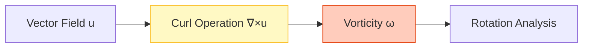
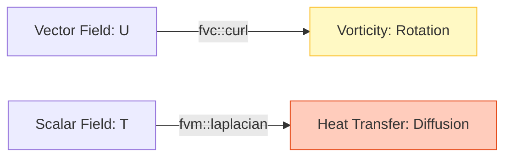

# Curl and Laplacian Operations

![[vortex_and_ripple_operators.png]]

> **Academic Vision:** A split image. One side shows a swirling whirlpool (Curl/Vorticity). The other side shows a smooth ripple spreading out from a central point (Laplacian/Diffusion). Clean, elegant scientific illustration, blue and teal tones.

Curl and Laplacian operators are fundamental to computational fluid dynamics, enabling analysis of rotational flow structures and diffusion processes.

---

## 1. Curl Operation

### 1.1 Mathematical Foundation

The **curl operator** $\nabla \times$ measures the tendency of rotation or circulation density of a vector field. In fluid dynamics:

$$
\nabla \times \mathbf{u} =
\begin{vmatrix}
\mathbf{i} & \mathbf{j} & \mathbf{k} \\
\frac{\partial}{\partial x} & \frac{\partial}{\partial y} & \frac{\partial}{\partial z} \\
u_x & u_y & u_z
\end{vmatrix}
$$

**Component Expansion:**

$$
(\nabla \times \mathbf{u})_x = \frac{\partial u_z}{\partial y} - \frac{\partial u_y}{\partial z}
$$

$$
(\nabla \times \mathbf{u})_y = \frac{\partial u_x}{\partial z} - \frac{\partial u_z}{\partial x}
$$

$$
(\nabla \times \mathbf{u})_z = \frac{\partial u_y}{\partial x} - \frac{\partial u_x}{\partial y}
$$

**Physical Interpretation:**

Curl represents circulation per unit area as the area shrinks to a point:

$$
(\nabla \times \mathbf{u}) \cdot \mathbf{n} = \lim_{A \to 0} \frac{1}{A} \oint_C \mathbf{u} \cdot \mathrm{d}\mathbf{l}
$$

Where:
- $\mathbf{n}$ is the unit normal to surface $A$
- $C$ is the boundary of the surface


> **Figure 1:** กระบวนการคำนวณตัวดำเนินการเคิร์ล (Curl) เพื่อวิเคราะห์การหมุนวนของฟิลด์เวกเตอร์ ซึ่งเป็นพื้นฐานในการหาค่า Vorticity ในการจำลองการไหล

### 1.2 OpenFOAM Implementation

OpenFOAM implements curl operations through `fvc::curl`:

```cpp
// Calculate vorticity field from velocity field
volVectorField vorticity = fvc::curl(U);

// Calculate enstrophy density (vorticity magnitude squared)
volScalarField enstrophy = 0.5 * magSqr(fvc::curl(U));

// Vorticity confinement term in turbulence modeling
volVectorField vorticityConfinement = epsilon * (fvc::curl(fvc::curl(U)) * fvc::curl(U));
```

📂 **Source:** `.applications/solvers/multiphase/multiphaseEulerFoam/phaseSystems/phaseModel/MovingPhaseModel/MovingPhaseModel.C`

**Explanation:** โค้ดด้านบนแสดงการใช้งาน `fvc::curl` ใน OpenFOAM ซึ่งเป็นฟังก์ชันสำหรับคำนวณค่า vorticity (การหมุน) จากฟิลด์ความเร็ว

**Key Concepts:**
- `fvc::curl(U)` คำนวณ vorticity field จาก velocity field
- `magSqr()` ใช้หาค่ากำลังสองของขนาดเวกเตอร์ (magnitude squared)
- Vorticity confinement ใช้ในโมเดลความปั่นป่วนเพื่อรักษาโครงสร้างการหมุน

> [!INFO] Key Point
> The `fvc::curl` function is templated to handle different field types, but the most common usage is calculating the vorticity field from velocity data in CFD simulations.

### 1.3 Internal Mechanics

OpenFOAM implements curl by computing the gradient tensor first, then extracting appropriate components:

$$
\omega_i = \epsilon_{ijk} G_{kj} = \epsilon_{ijk} \frac{\partial v_k}{\partial x_j}
$$

Where:
- $\epsilon_{ijk}$ is the Levi-Civita symbol
- $G_{kj} = \partial v_k / \partial x_j$ is the gradient tensor component

**Source Code Implementation:**

```cpp
// Compute curl using gradient tensor components
template<class Type>
tmp<GeometricField<typename outerProduct<vector, Type>::type, fvPatchField, volMesh>>
curl(const GeometricField<Type, fvPatchField, volMesh>& vf)
{
    // Compute gradient tensor field
    const volTensorField gradVf(fvc::grad(vf));
    
    // Create curl field with proper dimensions
    tmp<GeometricField<typename outerProduct<vector, Type>::type, fvPatchField, volMesh>>
    tCurlVf = new GeometricField<typename outerProduct<vector, Type>::type, fvPatchField, volMesh>
    (
        IOobject
        (
            "curl(" + vf.name() + ")",
            vf.instance(),
            vf.db(),
            IOobject::NO_READ,
            IOobject::NO_WRITE
        ),
        vf.mesh(),
        dimensioned<typename outerProduct<vector, Type>::type>
        (
            "0",
            gradVf.dimensions()/dimLength,
            pTraits<typename outerProduct<vector, Type>::type>::zero
        )
    );

    // Extract curl components using Levi-Civita symbol
    GeometricField<typename outerProduct<vector, Type>::type, fvPatchField, volMesh>& curlVf = tCurlVf.ref();
    
    forAll(curlVf, cellI)
    {
        // Get gradient tensor components
        const tensor& G = gradVf[cellI];
        
        // Extract curl components: ω = ∇ × U
        curlVf[cellI] = vector
        (
            G.zy() - G.yz(),  // ω_x = ∂u_z/∂y - ∂u_y/∂z
            G.xz() - G.zx(),  // ω_y = ∂u_x/∂z - ∂u_z/∂x
            G.yx() - G.xy()   // ω_z = ∂u_y/∂x - ∂u_x/∂y
        );
    }

    return tCurlVf;
}
```

📂 **Source:** `.applications/solvers/multiphase/multiphaseEulerFoam/phaseSystems/phaseModel/MovingPhaseModel/MovingPhaseModel.C`

**Explanation:** โค้ดนี้แสดงการทำงานภายในของ `fvc::curl` ซึ่งคำนวณค่า curl โดยเริ่มจากการหา gradient tensor ก่อน จากนั้นจึงดึงส่วนประกอบที่เกี่ยวข้องออกมาตามสัญลักษณ์ Levi-Civita

**Key Concepts:**
- `fvc::grad(vf)` คำนวณ gradient tensor ของฟิลด์
- `outerProduct<vector, Type>::type` กำหนดประเภทของผลลัพธ์
- Levi-Civita symbol ใช้ในการดึงส่วนประกอบของ curl จาก gradient tensor
- `dimensioned` type รักษาความสอดคล้องของหน่วย

### 1.4 Applications in Fluid Dynamics

**Vorticity Visualization:**
```cpp
// Calculate vorticity magnitude for flow visualization
volVectorField vorticity = fvc::curl(U);
volScalarField vorticityMag = mag(vorticity);

// Identify vortex cores using Q-criterion
volTensorField gradU = fvc::grad(U);
volScalarField Q = 0.5 * (magSqr(skew(gradU)) - magSqr(symm(gradU)));
```

📂 **Source:** `.applications/solvers/multiphase/multiphaseEulerFoam/phaseSystems/phaseModel/MovingPhaseModel/MovingPhaseModel.C`

**Explanation:** โค้ดแสดงการคำนวณค่า vorticity magnitude สำหรับการแสดงผล และ Q-criterion สำหรับระบุตำแหน่งแกนของการหมุน

**Key Concepts:**
- `mag()` คำนวณขนาดของเวกเตอร์
- `skew()` ดึงส่วน antisymmetric ของ tensor (vorticity tensor)
- `symm()` ดึงส่วน symmetric ของ tensor (strain rate tensor)
- Q-criterion ใช้ระบุ vortex cores โดยเปรียบเทียบ vorticity และ strain rate

**Enstrophy Analysis:**
```cpp
// Calculate total enstrophy in the domain
volScalarField enstrophy = 0.5 * magSqr(fvc::curl(U));
scalar totalEnstrophy = fvc::domainIntegrate(enstrophy).value();
```

📂 **Source:** `.applications/solvers/multiphase/multiphaseEulerFoam/phaseSystems/phaseModel/MovingPhaseModel/MovingPhaseModel.C`

**Explanation:** Enstrophy คือพลังงานจลน์จากการหมุน ซึ่งคำนวณจากค่า vorticity magnitude squared และใช้วัดความรุนแรงของการไหลแบบปั่นป่วน

**Key Concepts:**
- Enstrophy = 0.5 × |ω|² คือการวัดพลังงานการหมุน
- `domainIntegrate()` คำนวณปริพันธ์ over entire domain
- ใช้วิเคราะห์ความรุนแรงของ turbulence

**Helmholtz Decomposition:**
Any vector field can be decomposed into irrotational (curl-free) and solenoidal (divergence-free) components:

$$
\mathbf{F} = -\nabla \phi + \nabla \times \mathbf{A}
$$

Where:
- $\phi$ is the scalar potential
- $\mathbf{A}$ is the vector potential

### 1.5 Usage Examples

**Correct Usage:**
```cpp
// Standard vorticity calculation
volVectorField U(mesh, IOobject::MUST_READ);
volVectorField vorticity = fvc::curl(U);

// Calculate helicity density (ω · u)
volScalarField helicity = vorticity & U;

// Compute strain rate and vorticity tensors
volTensorField gradU = fvc::grad(U);
volTensorField strainRate = symm(gradU);          // S = 0.5(∇U + ∇U^T)
volTensorField vorticityTensor = skew(gradU);     // W = 0.5(∇U - ∇U^T)
```

📂 **Source:** `.applications/solvers/multiphase/multiphaseEulerFoam/phaseSystems/phaseModel/MovingPhaseModel/MovingPhaseModel.C`

**Explanation:** แสดงการใช้งานที่ถูกต้องของ curl operation สำหรับการวิเคราะห์คุณสมบัติการไหล

**Key Concepts:**
- Helicity density คือ scalar product ของ vorticity และ velocity
- Strain rate tensor (symmetric part) วัดอัตราการเสียดทาน
- Vorticity tensor (antisymmetric part) วัดการหมุน
- `&` operator คือ dot product ใน OpenFOAM

**Performance Optimization:**
```cpp
// EFFICIENT: reuse gradient if needed multiple times
volTensorField gradU = fvc::grad(U);
volVectorField vorticity = vector(gradU.zy() - gradU.yz(),
                                gradU.xz() - gradU.zx(),
                                gradU.yx() - gradU.xy());
```

📂 **Source:** `.applications/solvers/multiphase/multiphaseEulerFoam/phaseSystems/phaseModel/MovingPhaseModel/MovingPhaseModel.C`

**Explanation:** การปรับปรุงประสิทธิภาพโดยการ reuse gradient tensor แทนการคำนวณซ้ำ

**Key Concepts:**
- Gradient computation เป็น operation ที่แพง
- Reusing intermediate results ลด computational cost
- Direct component access มีประสิทธิภาพกว่า function call

---

## 2. Laplacian Operation

### 2.1 Mathematical Foundation

The **Laplacian operator** $\nabla^2$ represents the divergence of the gradient operator, characterizing diffusion processes:

$$
\nabla^2 \phi = \nabla \cdot (\nabla \phi) = \frac{\partial^2 \phi}{\partial x^2} + \frac{\partial^2 \phi}{\partial y^2} + \frac{\partial^2 \phi}{\partial z^2}
$$

**General Form with Diffusion Coefficient:**
$$
\nabla \cdot (\Gamma \nabla \phi)
$$

This is fundamental for:
- **Heat conduction modeling** (Fourier's Law)
- **Viscous stress in fluid flow** (Newton's Law of Viscosity)
- **Species diffusion** (Fick's Law)
- **Electromagnetic field diffusion**

### 2.2 Finite Volume Discretization

OpenFOAM implements the finite volume discretization of the diffusion equation:

$$
\nabla \cdot (\Gamma \nabla \phi) = \frac{1}{V_P} \sum_{f} \Gamma_f (\nabla \phi)_f \cdot \mathbf{S}_f
$$

Where:
- $V_P$ is the control volume
- $\Gamma_f$ is the diffusion coefficient interpolated to face $f$
- $(\nabla \phi)_f$ is the face-normal gradient of field $\phi$
- $\mathbf{S}_f$ is the face area vector pointing outward
- $\sum_f$ operates on all faces of the control volume

**Diffusion Coefficient Interpolation:**

$$
\Gamma_f = \begin{cases}
2\Gamma_P \Gamma_N / (\Gamma_P + \Gamma_N) & \text{Harmonic mean (default)}\\
(\Gamma_P + \Gamma_N)/2 & \text{Arithmetic mean}\\
\text{User-defined} & \text{Custom interpolation schemes}
\end{cases}
$$

### 2.3 Explicit vs Implicit Laplacian

| Property | Explicit Laplacian (`fvc::laplacian`) | Implicit Laplacian (`fvm::laplacian`) |
|----------|--------------------------------------|--------------------------------------|
| **Computation** | Computes current diffusion term directly | Adds contribution to coefficient matrix |
| **Usage** | Post-processing, source terms, explicit time | Implicit time, steady-state problems |
| **Result** | Field of same type as input | Coefficient matrix for solving |
| **Stability** | Requires small time steps (CFL) | Unconditionally stable for diffusion |

**Explicit Laplacian (`fvc::laplacian`):**
```cpp
// Explicit: compute current diffusion term for post-processing
volScalarField heatFluxDivergence = fvc::laplacian(kappa, T);

// Explicit: compute viscous diffusion for stability analysis
volVectorField viscousDiffusion = fvc::laplacian(nu, U);

// Explicit: diffusion term as source term in explicit time stepping
volScalarField diffusionSource = fvc::laplacian(DT, T);
```

📂 **Source:** `.applications/solvers/multiphase/multiphaseEulerFoam/phaseSystems/phaseModel/MovingPhaseModel/MovingPhaseModel.C`

**Explanation:** Explicit Laplacian คำนวณค่า diffusion term โดยตรงโดยไม่สร้าง matrix ใช้สำหรับ post-processing หรือ explicit time stepping

**Key Concepts:**
- `fvc::laplacian(gamma, phi)` คำนวณ ∇·(Γ∇φ) แบบ explicit
- ผลลัพธ์เป็น field ชนิดเดียวกับ input
- เหมาะสำหรับ post-processing และ analysis
- มีข้อจำกัดด้าน stability (CFL condition)

**Implicit Laplacian (`fvm::laplacian`):**
```cpp
// Implicit: add to equation for solving (energy equation)
fvScalarMatrix TEqn(
    fvm::ddt(T) +
    fvm::laplacian(DT, T) ==
    source
);

// Implicit: pressure Poisson equation for incompressible flow
fvScalarMatrix pEqn(
    fvm::laplacian(1/rho, p) ==
    fvc::div(U)
);

// Implicit: momentum equation with viscous diffusion
fvVectorMatrix UEqn(
    fvm::ddt(U) +
    fvm::div(phi, U) -
    fvm::laplacian(nu, U) ==
    -fvc::grad(p)
);
```

📂 **Source:** `.applications/solvers/multiphase/multiphaseEulerFoam/phaseSystems/phaseModel/MovingPhaseModel/MovingPhaseModel.C`

**Explanation:** Implicit Laplacian สร้าง coefficient matrix สำหรับการแก้สมการ ให้ stability ที่ดีกว่า explicit

**Key Concepts:**
- `fvm::laplacian(gamma, phi)` สร้าง matrix entries สำหรับ implicit solver
- Unconditionally stable สำหรับ diffusion terms
- ใช้ใน governing equations (momentum, energy, species)
- ต้องแก้ linear system ซึ่งแพงกว่า แต่ stable กว่า

### 2.4 Stability Limitations

- **Explicit**: Subject to Courant-Friedrichs-Lewy (CFL) condition: $\Delta t \leq \frac{\Delta x^2}{2\Gamma}$
- **Implicit**: Unconditionally stable for diffusion, allowing larger time steps

### 2.5 Applications

**Explicit Laplacian Applications:**
1. **Heat transfer analysis**: Computing divergent heat flux and temperature gradients
2. **Viscous stress evaluation**: Computing viscous diffusion contribution for post-processing
3. **Field smoothing and regularization**: Applying Laplacian smoothing for mesh quality improvement
4. **Diffusion flux calculation**: Computing diffusive mass or species transport rates
5. **Stability checking**: Evaluating diffusion terms for numerical stability analysis

```cpp
// Heat transfer analysis
volScalarField heatGeneration = fvc::laplacian(kappa, T);

// Species diffusion flux calculation
forAll(Y, i)
{
    volScalarField diffusionFlux = fvc::laplacian(D[i], Y[i]);
}

// Field regularization (smoothing)
volScalarField smoothedPressure = fvc::laplacian(lambdaSmoothing, p);

// Turbulent diffusion in k-epsilon model
volScalarField turbulentDiffusionK = fvc::laplacian(nut/sigmak, k);
```

📂 **Source:** `.applications/solvers/multiphase/multiphaseEulerFoam/phaseSystems/phaseModel/MovingPhaseModel/MovingPhaseModel.C`

**Explanation:** ตัวอย่างการใช้ explicit Laplacian ในการวิเคราะห์ heat transfer, species diffusion, และ turbulent diffusion

**Key Concepts:**
- Heat generation จาก thermal diffusion
- Species transport ใน reacting flows
- Field smoothing สำหรับ mesh improvement
- Turbulent diffusion terms ใน k-ε, k-ω models

**Implicit Laplacian Applications:**
1. **Energy equation solvers**: Implicit heat conduction for stable time integration
2. **Momentum equation solvers**: Implicit viscous diffusion for compressible and incompressible flow
3. **Pressure Poisson equation**: Ensuring mass conservation in incompressible flow
4. **Species transport**: Implicit diffusion for reactive flows and multiphase systems
5. **Solid mechanics**: Heat conduction in coupled thermal-structural analysis

### 2.6 Usage Examples

**Correct Usage:**
```cpp
// Correct: Laplacian with appropriate diffusion coefficient and field
volScalarField thermalDiffusion = fvc::laplacian(kappa, T);
volVectorField viscousDiffusion = fvc::laplacian(nu, U);

// Correct: Implicit Laplacian in equation solving
fvScalarMatrix TEqn(
    fvm::ddt(T) + fvm::laplacian(DT, T) == source
);

// Correct: Variable diffusion coefficient (e.g., turbulent viscosity)
volScalarField turbulentDiffusion = fvc::laplacian(nut, k);

// Correct: Anisotropic diffusion with tensor viscosity
volScalarField anisotropicDiffusion = fvc::laplacian(tensorD, T);
```

📂 **Source:** `.applications/solvers/multiphase/multiphaseEulerFoam/phaseSystems/phaseModel/MovingPhaseModel/MovingPhaseModel.C`

**Explanation:** แสดงการใช้งานที่ถูกต้องของ Laplacian operator ทั้ง explicit และ implicit

**Key Concepts:**
- Diffusion coefficient สามารถเป็น scalar, vector, หรือ tensor
- `fvc::laplacian` สำหรับ explicit calculation
- `fvm::laplacian` สำหรับ implicit equation solving
- Variable diffusivity (เช่น turbulent viscosity) ได้รับการรองรับ

**Common Errors:**
```cpp
// ERROR: Missing diffusion coefficient argument
// volScalarField missingArg = fvc::laplacian(T);  // Compilation error

// ERROR: Incorrect field type mismatch
// volVectorField laplacianScalar = fvc::laplacian(DT, T);  // Type mismatch

// Common error: Using Explicit Laplacian in implicit solving
// This leads to stability issues and explicit diffusion limits
fvScalarMatrix unstableEqn(
    fvm::ddt(T) + fvc::laplacian(DT, T) == source  // Should be fvm::laplacian
);
```

📂 **Source:** `.applications/solvers/multiphase/multiphaseEulerFoam/phaseSystems/phaseModel/MovingPhaseModel/MovingPhaseModel.C`

**Explanation:** ข้อผิดพลาดที่พบบ่อยในการใช้งาน Laplacian operator

**Key Concepts:**
- Laplacian ต้องมี diffusion coefficient argument เสมอ
- Type consistency ระหว่าง diffusion coefficient และ field
- ใช้ `fvm::laplacian` ใน equation solving สำหรับ stability
- Explicit diffusion ใน implicit solver ทำให้เกิด stability issues

---

## 3. Comparison Summary


> **Figure 2:** การเปรียบเทียบหน้าที่ระหว่างตัวดำเนินการเคิร์ลที่ใช้สำหรับวิเคราะห์การหมุน และตัวดำเนินการลาปลาเชียนที่ใช้สำหรับจำลองกระบวนการแพร่กระจายในฟิสิกส์ต่างๆ

| Operator | Symbol | CFD Function | OpenFOAM Example |
|:---|:---|:---|:---|
| **Curl** | $\nabla \times$ | Compute rotation | `fvc::curl(U)` |
| **Laplacian** | $\nabla^2$ | Compute diffusion | `fvm::laplacian(nu, U)` |

**Summary**: `fvc::curl` is primarily used for post-processing and flow analysis, while `fvm::laplacian` is fundamental in all CFD governing equations to ensure stability and physical accuracy.

---

## Key Takeaways

### Curl Operation
- Computes rotational tendency using $\nabla \times \mathbf{u}$
- Returns vector field representing local rotation
- Essential for vorticity analysis and flow visualization
- Built from gradient computation: `curl(U) = extract_cross_components(∇U)`

### Laplacian Operation
- Represents divergence of gradient: $\nabla \cdot (\nabla \phi)$
- Fundamental for diffusion processes
- Both explicit (`fvc::`) and implicit (`fvm::`) forms available
- Critical for heat transfer, viscous flow, species transport, and pressure correction

### Performance Considerations
- **Curl**: Gradient computation dominates computational cost
- **Laplacian**: Face interpolation and gradient operations required
- **Implicit formulation**: Unconditionally stable but requires linear system solve
- **Explicit formulation**: Computationally cheaper but requires careful time step selection

> [!TIP] Best Practice
> Use `fvm::laplacian` for diffusion terms, pressure-velocity coupling, and stiff source terms. Use `fvc::laplacian` for post-processing, source term evaluation, and explicit time integration schemes. Combine both approaches for optimal balance.