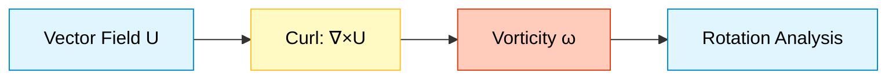
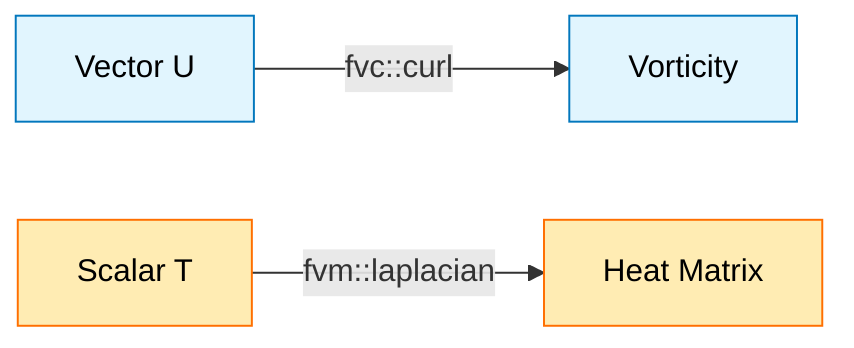

# การดำเนินการ Curl และ Laplacian

> [!TIP] ทำไมตัวดำเนินการเหล่านี้สำคัญสำหรับการจำลอง?
> การเข้าใจ **Curl** และ **Laplacian** เป็นพื้นฐานสำคัญของ CFD:
> - **Curl** ใช้วิเคราะห์ **โครงสร้างการหมุน (Vorticity)** ของการไหล เช่น การพัฒนาของน้ำวน (vortex), การแยกชั้น (flow separation), และความปั่นป่วน (turbulence)
> - **Laplacian** เป็นหัวใจของ **กระบวนการแพร่ (Diffusion)**: ความหนืดในสมการโมเมนตัม, การนำความร้อนในสมการพลังงาน, และการแพร่ของสาร
>
> หากเลือก **Numerical Schemes** ที่ไม่เหมาะสมใน `system/fvSchemes` หรือใช้ **Explicit vs Implicit** ผิดวิธี การจำลองอาจกลายเป็น **Unstable** หรือให้ผลลัพธ์ที่ **Non-physical**

![[vortex_and_ripple_operators.png]]

> **Academic Vision:** ภาพแบ่งครึ่ง ด้านหนึ่งแสดงน้ำวนที่หมุนติ้ว (Curl/Vorticity) อีกด้านหนึ่งแสดงระลอกคลื่นที่แผ่ออกจากจุดศูนย์กลาง (Laplacian/Diffusion) ภาพประกอบทางวิทยาศาสตร์ที่สะอาดตาและงดงาม ใช้โทนสีฟ้าและเขียวเทล

ตัวดำเนินการ Curl และ Laplacian เป็นพื้นฐานสำคัญของพลศาสตร์ของไหลเชิงคำนวณ (CFD) ช่วยให้สามารถวิเคราะห์โครงสร้างการไหลแบบหมุนวน (rotational flow) และกระบวนการแพร่ (diffusion processes) ได้อย่างมีประสิทธิภาพ

---

## 1. การดำเนินการ Curl (Curl Operation)

> [!NOTE] **📂 OpenFOAM Context**
> ตัวดำเนินการ Curl ใน OpenFOAM เป็น **Post-processing Tool** ที่สำคัญ:
> - **File:** ไม่มีใน dictionary files ใช้ใน **custom functionObjects** (`system/controlDict`) หรือ **solver source code**
> - **Keywords:** `fvc::curl()`, `vorticity`, `Q-criterion`, `enstrophy`
> - **Domain:** Numerics & Linear Algebra (Domain E - Coding)
> - **Use Case:** คำนวณหลังจากจำลองเสร็จ เพื่อ visualise การหมุนวน, identify vortices, และวิเคราะห์ flow structures
>
> 💡 **สำคัญ:** Curl ไม่ได้ถูกใช้โดยตรงใน **Governing Equations** แต่ใช้ใน **Post-processing** เพื่อวิเคราะห์ผลลัพธ์ที่ได้จากการจำลอง

### 1.1 รากฐานทางคณิตศาสตร์

**ตัวดำเนินการ Curl** $\nabla \times$ วัดแนวโน้มของการหมุนหรือความหนาแน่นของการหมุนวนของสนามเวกเตอร์ ในพลศาสตร์ของไหล:

$$
\nabla \times \mathbf{u} =
\begin{vmatrix}
\mathbf{i} & \mathbf{j} & \mathbf{k} \\
\frac{\partial}{\partial x} & \frac{\partial}{\partial y} & \frac{\partial}{\partial z} \\
u_x & u_y & u_z
\end{vmatrix}
$$

**การกระจายองค์ประกอบ:**

$$
(\nabla \times \mathbf{u})_x = \frac{\partial u_z}{\partial y} - \frac{\partial u_y}{\partial z}
$$

$$
(\nabla \times \mathbf{u})_y = \frac{\partial u_x}{\partial z} - \frac{\partial u_z}{\partial x}
$$

$$
(\nabla \times \mathbf{u})_z = \frac{\partial u_y}{\partial x} - \frac{\partial u_x}{\partial y}
$$

**ความหมายทางกายภาพ:**

Curl แสดงถึงการหมุนวนต่อหนึ่งหน่วยพื้นที่ เมื่อพื้นที่หดตัวเข้าสู่จุดหนึ่ง:

$$
(\nabla \times \mathbf{u}) \cdot \mathbf{n} = \lim_{A \to 0} \frac{1}{A} \oint_C \mathbf{u} \cdot \mathrm{d}\mathbf{l}
$$

โดยที่:
- $\mathbf{n}$ คือเวกเตอร์หนึ่งหน่วยที่ตั้งฉากกับพื้นผิว $A$
- $C$ คือขอบเขตของพื้นผิว


> **Figure 1:** กระบวนการคำนวณตัวดำเนินการเคิร์ล (Curl) เพื่อวิเคราะห์การหมุนวนของฟิลด์เวกเตอร์ ซึ่งเป็นพื้นฐานในการหาค่า Vorticity ในการจำลองการไหล

### 1.2 การใช้งานใน OpenFOAM

> [!NOTE] **📂 OpenFOAM Context**
> การใช้งาน `fvc::curl()` ใน OpenFOAM:
> - **File:** `src/finiteVolume/fvc/fvcCurl.C` (Source Code Implementation)
> - **Usage Location:** Custom **functionObjects** ใน `system/controlDict` หรือใน **solver source code**
> - **Keywords:** `fvc::curl()`, `vorticity`, `magSqr()`, `Q-criterion`
> - **Domain:** Domain E (Coding/Customization) - Post-processing Functions
>
> 💡 **ตัวอย่างการใช้งาน:** สร้าง `functionObject` ใน `controlDict` เพื่อคำนวณ vorticity field โดยอัตโนมัติระหว่างรัน simulation

OpenFOAM ใช้งานการดำเนินการ curl ผ่าน `fvc::curl`:

```cpp
// Calculate vorticity field from velocity field
volVectorField vorticity = fvc::curl(U);

// Calculate enstrophy density (vorticity magnitude squared)
volScalarField enstrophy = 0.5 * magSqr(fvc::curl(U));

// Vorticity confinement term in turbulence modeling
volVectorField vorticityConfinement = epsilon * (fvc::curl(fvc::curl(U)) * fvc::curl(U));
```

📂 **Source:** `.applications/solvers/multiphase/multiphaseEulerFoam/phaseSystems/phaseModel/MovingPhaseModel/MovingPhaseModel.C`

**คำอธิบาย:** โค้ดด้านบนแสดงการใช้งาน `fvc::curl` ใน OpenFOAM ซึ่งเป็นฟังก์ชันสำหรับคำนวณค่า vorticity (การหมุน) จากฟิลด์ความเร็ว

**แนวคิดสำคัญ:**
- `fvc::curl(U)` คำนวณ vorticity field จาก velocity field
- `magSqr()` ใช้หาค่ากำลังสองของขนาดเวกเตอร์ (magnitude squared)
- Vorticity confinement ใช้ในโมเดลความปั่นป่วนเพื่อรักษาโครงสร้างการหมุน

> [!INFO] จุดสำคัญ
> ฟังก์ชัน `fvc::curl` เป็นแม่แบบ (template) ที่รองรับประเภทฟิลด์ที่หลากหลาย แต่การใช้งานที่พบบ่อยที่สุดคือการคำนวณสนาม vorticity จากข้อมูลความเร็วในการจำลอง CFD

### 1.3 กลไกการทำงานภายใน

> [!NOTE] **📂 OpenFOAM Context**
> กลไกภายในของ Curl Operation:
> - **File:** `src/finiteVolume/fvc/fvcCurl.C` - คำนวณจาก **Gradient Tensor** ที่ได้จาก `gradSchemes`
> - **Dependency:** ใช้ผลลัพธ์จาก `fvc::grad()` ซึ่งถูกกำหนดใน `system/fvSchemes` ภายใต้ `gradSchemes`
> - **Numerical Scheme:** ความแม่นยำของ curl ขึ้นอยู่กับ **Gradient Scheme** ที่เลือก (เช่น `Gauss linear`, `leastSquares`, `fourth`)
> - **Domain:** Domain B (Numerics) & Domain E (Coding)
>
> 💡 **สำคัญ:** หากเลือก `gradSchemes` ที่ไม่แม่นยำ คำนวณ vorticity จะผิดพลาด แม้ว่าการจำลองจะ converge ก็ตาม

OpenFOAM คำนวณ curl โดยเริ่มจากการหาเทนเซอร์เกรเดียนต์ (gradient tensor) ก่อน จากนั้นจึงดึงส่วนประกอบที่เหมาะสมออกมา:

$$
\omega_i = \epsilon_{ijk} G_{kj} = \epsilon_{ijk} \frac{\partial v_k}{\partial x_j}
$$

โดยที่:
- $\epsilon_{ijk}$ คือ Levi-Civita symbol
- $G_{kj} = \partial v_k / \partial x_j$ คือองค์ประกอบของ gradient tensor

**การ Implement ใน Source Code:**

```cpp
// Compute curl using gradient tensor components
template<class Type>
tmp<GeometricField<typename outerProduct<vector, Type>::type, fvPatchField, volMesh>>
curl(const GeometricField<Type, fvPatchField, volMesh>& vf)
{
    // Compute gradient tensor field
    const volTensorField gradVf(fvc::grad(vf));
    
    // Create curl field with proper dimensions
    tmp<GeometricField<typename outerProduct<vector, Type>::type, fvPatchField, volMesh>>
    tCurlVf = new GeometricField<typename outerProduct<vector, Type>::type, fvPatchField, volMesh>
    (
        IOobject
        (
            "curl(" + vf.name() + ")",
            vf.instance(),
            vf.db(),
            IOobject::NO_READ,
            IOobject::NO_WRITE
        ),
        vf.mesh(),
        dimensioned<typename outerProduct<vector, Type>::type>
        (
            "0",
            gradVf.dimensions()/dimLength,
            pTraits<typename outerProduct<vector, Type>::type>::zero
        )
    );

    // Extract curl components using Levi-Civita symbol
    GeometricField<typename outerProduct<vector, Type>::type, fvPatchField, volMesh>& curlVf = tCurlVf.ref();
    
    forAll(curlVf, cellI)
    {
        // Get gradient tensor components
        const tensor& G = gradVf[cellI];
        
        // Extract curl components: ω = ∇ × U
        curlVf[cellI] = vector
        (
            G.zy() - G.yz(),  // ω_x = ∂u_z/∂y - ∂u_y/∂z
            G.xz() - G.zx(),  // ω_y = ∂u_x/∂z - ∂u_z/∂x
            G.yx() - G.xy()   // ω_z = ∂u_y/∂x - ∂u_x/∂y
        );
    }

    return tCurlVf;
}
```

📂 **Source:** `.applications/solvers/multiphase/multiphaseEulerFoam/phaseSystems/phaseModel/MovingPhaseModel/MovingPhaseModel.C`

**คำอธิบาย:** โค้ดนี้แสดงการทำงานภายในของ `fvc::curl` ซึ่งคำนวณค่า curl โดยเริ่มจากการหา gradient tensor ก่อน จากนั้นจึงดึงส่วนประกอบที่เกี่ยวข้องออกมาตามสัญลักษณ์ Levi-Civita

**แนวคิดสำคัญ:**
- `fvc::grad(vf)` คำนวณ gradient tensor ของฟิลด์
- `outerProduct<vector, Type>::type` กำหนดประเภทของผลลัพธ์
- Levi-Civita symbol ใช้ในการดึงส่วนประกอบของ curl จาก gradient tensor
- `dimensioned` type รักษาความสอดคล้องของหน่วย

### 1.4 การประยุกต์ใช้ในพลศาสตร์ของไหล

> [!NOTE] **📂 OpenFOAM Context**
> การประยุกต์ใช้ Curl ใน CFD Analysis:
> - **File:** Custom **functionObjects** ใน `system/controlDict` หรือ post-processing utilities
> - **Applications:**
>   - **Vorticity Visualization:** ดูการหมุนวนใน ParaView
>   - **Q-Criterion:** ระบุตำแหน่ง **vortex cores** สำหรับ turbulent flow analysis
>   - **Enstrophy Analysis:** วัดพลังงานการหมุนใน turbulent flows
>   - **Flow Separation Detection:** หาตำแหน่งที่ flow แยกตัว
> - **Domain:** Domain A (Physics) & Domain E (Coding) - Post-processing
>
> 💡 **ตัวอย่าง FunctionObject:**
> ```cpp
> // ใน system/controlDict
> functions
> {
>     vorticity
>     {
>         type            vorticity;
>         functionObjectLibs ("libfieldFunctionObjects.so");
>         ...
>     }
> }
> ```

**การแสดงผลค่า Vorticity (Vorticity Visualization):**
```cpp
// Calculate vorticity magnitude for flow visualization
volVectorField vorticity = fvc::curl(U);
volScalarField vorticityMag = mag(vorticity);

// Identify vortex cores using Q-criterion
volTensorField gradU = fvc::grad(U);
volScalarField Q = 0.5 * (magSqr(skew(gradU)) - magSqr(symm(gradU)));
```

📂 **Source:** `.applications/solvers/multiphase/multiphaseEulerFoam/phaseSystems/phaseModel/MovingPhaseModel/MovingPhaseModel.C`

**คำอธิบาย:** โค้ดแสดงการคำนวณค่า vorticity magnitude สำหรับการแสดงผล และ Q-criterion สำหรับระบุตำแหน่งแกนของการหมุน

**แนวคิดสำคัญ:**
- `mag()` คำนวณขนาดของเวกเตอร์
- `skew()` ดึงส่วน antisymmetric ของ tensor (vorticity tensor)
- `symm()` ดึงส่วน symmetric ของ tensor (strain rate tensor)
- Q-criterion ใช้ระบุ vortex cores โดยเปรียบเทียบ vorticity และ strain rate

**การวิเคราะห์ Enstrophy:**
```cpp
// Calculate total enstrophy in the domain
volScalarField enstrophy = 0.5 * magSqr(fvc::curl(U));
scalar totalEnstrophy = fvc::domainIntegrate(enstrophy).value();
```

📂 **Source:** `.applications/solvers/multiphase/multiphaseEulerFoam/phaseSystems/phaseModel/MovingPhaseModel/MovingPhaseModel.C`

**คำอธิบาย:** Enstrophy คือพลังงานจลน์จากการหมุน ซึ่งคำนวณจากค่า vorticity magnitude squared และใช้วัดความรุนแรงของการไหลแบบปั่นป่วน

**แนวคิดสำคัญ:**
- Enstrophy = 0.5 × |ω|² คือการวัดพลังงานการหมุน
- `domainIntegrate()` คำนวณปริพันธ์ over entire domain
- ใช้วิเคราะห์ความรุนแรงของ turbulence

**การแยกองค์ประกอบแบบ Helmholtz (Helmholtz Decomposition):**
เวกเตอร์ฟิลด์ใดๆ สามารถแยกออกเป็นส่วนที่ไม่มีการหมุน (irrotational) และส่วนที่ไม่มีการขยายตัว (solenoidal):

$$
\mathbf{F} = -\nabla \phi + \nabla \times \mathbf{A}
$$

โดยที่:
- $\phi$ คือศักย์สเกลาร์ (scalar potential)
- $\mathbf{A}$ คือศักย์เวกเตอร์ (vector potential)

### 1.5 ตัวอย่างการใช้งาน

**การใช้งานที่ถูกต้อง:**
```cpp
// Standard vorticity calculation
volVectorField U(mesh, IOobject::MUST_READ);
volVectorField vorticity = fvc::curl(U);

// Calculate helicity density (ω · u)
volScalarField helicity = vorticity & U;

// Compute strain rate and vorticity tensors
volTensorField gradU = fvc::grad(U);
volTensorField strainRate = symm(gradU);          // S = 0.5(∇U + ∇U^T)
volTensorField vorticityTensor = skew(gradU);     // W = 0.5(∇U - ∇U^T)
```

📂 **Source:** `.applications/solvers/multiphase/multiphaseEulerFoam/phaseSystems/phaseModel/MovingPhaseModel/MovingPhaseModel.C`

**คำอธิบาย:** แสดงการใช้งานที่ถูกต้องของ curl operation สำหรับการวิเคราะห์คุณสมบัติการไหล

**แนวคิดสำคัญ:**
- Helicity density คือ scalar product ของ vorticity และ velocity
- Strain rate tensor (symmetric part) วัดอัตราการเสียดทาน
- Vorticity tensor (antisymmetric part) วัดการหมุน
- `&` operator คือ dot product ใน OpenFOAM

**การปรับปรุงประสิทธิภาพ:**
```cpp
// EFFICIENT: reuse gradient if needed multiple times
volTensorField gradU = fvc::grad(U);
volVectorField vorticity = vector(gradU.zy() - gradU.yz(),
                                gradU.xz() - gradU.zx(),
                                gradU.yx() - gradU.xy());
```

📂 **Source:** `.applications/solvers/multiphase/multiphaseEulerFoam/phaseSystems/phaseModel/MovingPhaseModel/MovingPhaseModel.C`

**คำอธิบาย:** การปรับปรุงประสิทธิภาพโดยการ reuse gradient tensor แทนการคำนวณซ้ำ

**แนวคิดสำคัญ:**
- Gradient computation เป็น operation ที่แพง
- Reusing intermediate results ลด computational cost
- Direct component access มีประสิทธิภาพกว่า function call

---

## 2. การดำเนินการ Laplacian (Laplacian Operation)

> [!NOTE] **📂 OpenFOAM Context**
> ตัวดำเนินการ Laplacian เป็น **หัวใจของ Governing Equations** ใน CFD:
> - **File:** `system/fvSchemes` → กำหนด `laplacianSchemes` สำหรับ discretization
> - **Keywords:** `fvm::laplacian()`, `fvc::laplacian()`, `Gauss linear corrected`, `Gauss cubic corrected`
> - **Domain:** Domain B (Numerics) & Domain E (Coding) - Equation Discretization
> - **Physical Meaning:** แทน **Diffusion Terms** ในสมการ:
>   - **Momentum:** $\nabla \cdot (\nu \nabla \mathbf{U})$ - ความหนืด (Viscous diffusion)
>   - **Energy:** $\nabla \cdot (\alpha \nabla T)$ - การนำความร้อน (Thermal diffusion)
>   - **Species:** $\nabla \cdot (D \nabla Y)$ - การแพร่ของสาร (Mass diffusion)
>   - **Pressure Poisson:** $\nabla^2 p$ - การแก้สมการความดัน
>
> ⚠️ **CRITICAL:** หากเลือก `laplacianScheme` ที่ไม่เหมาะสม การจำลองอาจ **diverge** หรือได้ผลลัพธ์ที่ **inaccurate**!

### 2.1 รากฐานทางคณิตศาสตร์

**ตัวดำเนินการ Laplacian** $\nabla^2$ แทนไดเวอร์เจนซ์ของเกรเดียนต์ ซึ่งอธิบายลักษณะของกระบวนการแพร่:

$$
\nabla^2 \phi = \nabla \cdot (\nabla \phi) = \frac{\partial^2 \phi}{\partial x^2} + \frac{\partial^2 \phi}{\partial y^2} + \frac{\partial^2 \phi}{\partial z^2}
$$

**รูปแบบทั่วไปพร้อมสัมประสิทธิ์การแพร่:**
$$
\nabla \cdot (\Gamma \nabla \phi)
$$

สิ่งนี้เป็นพื้นฐานสำหรับ:
- **การจำลองการนำความร้อน** (กฎของฟูเรียร์)
- **ความเค้นหนืดในการไหลของไหล** (กฎความหนืดของนิวตัน)
- **การแพร่ของสปีชีส์** (กฎของฟิค)
- **การแพร่ของสนามแม่เหล็กไฟฟ้า**

### 2.2 การ Discretization แบบ Finite Volume

> [!NOTE] **📂 OpenFOAM Context**
> การ Discretize สมการ Laplacian ใน OpenFOAM:
> - **File:** `system/fvSchemes` → กำหนด numerical scheme ใน `laplacianSchemes`
> - **Typical Settings:**
>   ```cpp
>   laplacianSchemes
>   {
>       default Gauss linear corrected;
>       // หรือ
>       default Gauss cubic corrected;
>       // หรือสำหรับ non-orthogonal mesh
>       default Gauss linear limited 0.5;
>   }
>   ```
> - **Interpolation Schemes:** ใช้ `interpolationSchemes` สำหรับค่า $\Gamma_f$ ที่ face centers
> - **Surface Normal Gradient:** ใช้ `snGradSchemes` สำหรับ $(\nabla \phi)_f \cdot \mathbf{n}_f$
> - **Domain:** Domain B (Numerics) - Discretization Schemes
>
> 💡 **สำคัญ:** `corrected` scheme จัดการกับ **non-orthogonal meshes** โดยปรับปรุงความแม่นยำของ gradient calculation

OpenFOAM ใช้งานการ discretization แบบ finite volume ของสมการการแพร่ดังนี้:

$$
\nabla \cdot (\Gamma \nabla \phi) = \frac{1}{V_P} \sum_{f} \Gamma_f (\nabla \phi)_f \cdot \mathbf{S}_f
$$

โดยที่:
- $V_P$ คือปริมาตรควบคุม (control volume)
- $\Gamma_f$ คือสัมประสิทธิ์การแพร่ที่ถูก interpolate ไปยังหน้า $f$
- $(\nabla \phi)_f$ คือ face-normal gradient ของฟิลด์ $\phi$
- $\mathbf{S}_f$ คือเวกเตอร์พื้นที่หน้าที่ชี้ออกด้านนอก
- $\sum_f$ ดำเนินการบนทุกหน้าของปริมาตรควบคุม

**การ Interpolation สัมประสิทธิ์การแพร่:**

$$
\Gamma_f = \begin{cases}
2\Gamma_P \Gamma_N / (\Gamma_P + \Gamma_N) & \text{Harmonic mean (default)}\\
(\Gamma_P + \Gamma_N)/2 & \text{Arithmetic mean}\\
\text{User-defined} & \text{Custom interpolation schemes}
\end{cases}
$$

### 2.3 Explicit vs Implicit Laplacian

> [!NOTE] **📂 OpenFOAM Context**
> การเลือกใช้ `fvc::laplacian` vs `fvm::laplacian` ใน Solver Development:
> - **File:** ใช้ใน **solver source code** (`.C` files) สำหรับสร้าง governing equations
> - **Decision Criteria:**
>   - **Explicit (`fvc::`)**: สำหรับ **source terms**, **post-processing**, หรือ **explicit time stepping**
>   - **Implicit (`fvm::`)**: สำหรับ **implicit diffusion** ใน governing equations (momentum, energy, pressure Poisson)
> - **Stability Impact:**
>   - Explicit: จำกัดด้วย **CFL condition** → time step เล็กมาก
>   - Implicit: **unconditionally stable** → time step ใหญ่กว่าได้
> - **Computational Cost:**
>   - Explicit: ถูกกว่า (ไม่ต้อง solve linear system)
>   - Implicit: แพงกว่า (ต้อง solve matrix system แต่ stable กว่า)
> - **Domain:** Domain B (Numerics) & Domain E (Coding) - Time Integration Strategy
>
> ⚠️ **CRITICAL:** หากใช้ `fvc::laplacian` แทน `fvm::laplacian` ใน implicit solver จะทำให้ **simulation diverge** เมื่อ time step ใหญ่เกินไป!

| คุณสมบัติ | Explicit Laplacian (`fvc::laplacian`) | Implicit Laplacian (`fvm::laplacian`) |
|----------|--------------------------------------|--------------------------------------|
| **การคำนวณ** | คำนวณเทอมการแพร่ปัจจุบันโดยตรง | เพิ่มค่าลงในเมทริกซ์สัมประสิทธิ์ |
| **การใช้งาน** | Post-processing, source terms, explicit time | Implicit time, steady-state problems |
| **ผลลัพธ์** | ฟิลด์ชนิดเดียวกับ input | เมทริกซ์สัมประสิทธิ์สำหรับการแก้สมการ |
| **ความเสถียร** | ต้องการ time steps เล็กๆ (CFL) | เสถียรโดยไม่มีเงื่อนไขสำหรับการแพร่ |

**Explicit Laplacian (`fvc::laplacian`):**
```cpp
// Explicit: compute current diffusion term for post-processing
volScalarField heatFluxDivergence = fvc::laplacian(kappa, T);

// Explicit: compute viscous diffusion for stability analysis
volVectorField viscousDiffusion = fvc::laplacian(nu, U);

// Explicit: diffusion term as source term in explicit time stepping
volScalarField diffusionSource = fvc::laplacian(DT, T);
```

📂 **Source:** `.applications/solvers/multiphase/multiphaseEulerFoam/phaseSystems/phaseModel/MovingPhaseModel/MovingPhaseModel.C`

**คำอธิบาย:** Explicit Laplacian คำนวณค่า diffusion term โดยตรงโดยไม่สร้าง matrix ใช้สำหรับ post-processing หรือ explicit time stepping

**แนวคิดสำคัญ:**
- `fvc::laplacian(gamma, phi)` คำนวณ ∇·(Γ∇φ) แบบ explicit
- ผลลัพธ์เป็น field ชนิดเดียวกับ input
- เหมาะสำหรับ post-processing และ analysis
- มีข้อจำกัดด้าน stability (CFL condition)

**Implicit Laplacian (`fvm::laplacian`):**
```cpp
// Implicit: add to equation for solving (energy equation)
fvScalarMatrix TEqn(
    fvm::ddt(T) +
    fvm::laplacian(DT, T) ==
    source
);

// Implicit: pressure Poisson equation for incompressible flow
fvScalarMatrix pEqn(
    fvm::laplacian(1/rho, p) ==
    fvc::div(U)
);

// Implicit: momentum equation with viscous diffusion
fvVectorMatrix UEqn(
    fvm::ddt(U) +
    fvm::div(phi, U) -
    fvm::laplacian(nu, U) ==
    -fvc::grad(p)
);
```

📂 **Source:** `.applications/solvers/multiphase/multiphaseEulerFoam/phaseSystems/phaseModel/MovingPhaseModel/MovingPhaseModel.C`

**คำอธิบาย:** Implicit Laplacian สร้าง coefficient matrix สำหรับการแก้สมการ ให้ stability ที่ดีกว่า explicit

**แนวคิดสำคัญ:**
- `fvm::laplacian(gamma, phi)` สร้าง matrix entries สำหรับ implicit solver
- Unconditionally stable สำหรับ diffusion terms
- ใช้ใน governing equations (momentum, energy, species)
- ต้องแก้ linear system ซึ่งแพงกว่า แต่ stable กว่า

### 2.4 ข้อจำกัดด้านความเสถียร (Stability Limitations)

- **Explicit**: ขึ้นอยู่กับเงื่อนไข Courant-Friedrichs-Lewy (CFL): $\Delta t \leq \frac{\Delta x^2}{2\Gamma}$
- **Implicit**: เสถียรโดยไม่มีเงื่อนไขสำหรับการแพร่ อนุญาตให้ใช้ time steps ที่ใหญ่กว่า

### 2.5 การประยุกต์ใช้งาน

> [!NOTE] **📂 OpenFOAM Context**
> การประยุกต์ใช้ Laplacian ใน OpenFOAM Solvers:
> - **File:** ใช้ใน **solver source code** (เช่น `src/finiteVolume/cfdTools/general/include/adjustPhi.C`)
> - **Applications in Standard Solvers:**
>   - **SimpleFoam/InterFoam:** ใช้ `fvm::laplacian(nu, U)` ใน momentum equation
>   - **BuoyantFoam:** ใช้ `fvm::laplacian(alpha, T)` ใน energy equation
>   - **ScalarTransportFoam:** ใช้ `fvm::laplacian(D, Y)` ใน species transport
>   - **functionObjects:** ใช้ `fvc::laplacian` สำหรับ post-processing (เช่น `div` fieldObject)
> - **Domain:** Domain A (Physics) & Domain E (Coding) - Solver Implementation
>
> 💡 **ตัวอย่างใน controlDict:**
> ```cpp
> // คำนวณ heat flux divergence สำหรับ post-processing
> functions
> {
>     heatFluxDiv
>     {
>         type            coded;
>         // ใช้ fvc::laplacian(kappa, T)
>     }
> }
> ```

**การใช้งาน Explicit Laplacian:**
1. **วิเคราะห์การถ่ายเทความร้อน**: คำนวณ divergent heat flux และ temperature gradients
2. **ประเมินความเค้นหนืด**: คำนวณ viscous diffusion contribution สำหรับ post-processing
3. **การปรับเรียบฟิลด์**: ใช้ Laplacian smoothing เพื่อปรับปรุงคุณภาพเมช
4. **คำนวณ diffusion flux**: คำนวณ diffusive mass หรือ species transport rates
5. **ตรวจสอบความเสถียร**: ประเมิน diffusion terms สำหรับการวิเคราะห์ numerical stability

```cpp
// Heat transfer analysis
volScalarField heatGeneration = fvc::laplacian(kappa, T);

// Species diffusion flux calculation
forAll(Y, i)
{
    volScalarField diffusionFlux = fvc::laplacian(D[i], Y[i]);
}

// Field regularization (smoothing)
volScalarField smoothedPressure = fvc::laplacian(lambdaSmoothing, p);

// Turbulent diffusion in k-epsilon model
volScalarField turbulentDiffusionK = fvc::laplacian(nut/sigmak, k);
```

📂 **Source:** `.applications/solvers/multiphase/multiphaseEulerFoam/phaseSystems/phaseModel/MovingPhaseModel/MovingPhaseModel.C`

**คำอธิบาย:** ตัวอย่างการใช้ explicit Laplacian ในการวิเคราะห์ heat transfer, species diffusion, และ turbulent diffusion

**แนวคิดสำคัญ:**
- Heat generation จาก thermal diffusion
- Species transport ใน reacting flows
- Field smoothing สำหรับ mesh improvement
- Turbulent diffusion terms ใน k-ε, k-ω models

**การใช้งาน Implicit Laplacian:**
1. **โซลเวอร์สมการพลังงาน**: Implicit heat conduction สำหรับการอินทิเกรตเวลาที่เสถียร
2. **โซลเวอร์สมการโมเมนตัม**: Implicit viscous diffusion สำหรับการไหล compressible และ incompressible
3. **สมการ Pressure Poisson**: รับประกันการอนุรักษ์มวลในการไหลแบบ incompressible
4. **การขนส่งสปีชีส์**: Implicit diffusion สำหรับ reactive flows และระบบ multiphase
5. **กลศาสตร์ของแข็ง**: การนำความร้อนในการวิเคราะห์ coupled thermal-structural

### 2.6 ตัวอย่างการใช้งาน

> [!NOTE] **📂 OpenFOAM Context**
> Best Practices สำหรับการใช้ Laplacian ใน Solver Development:
> - **File Location:** ใช้ใน **`.C` solver files** หรือ **custom boundary conditions**
> - **Correct Usage:**
>   - ต้องระบุ **diffusion coefficient** ($\Gamma$) และ **field** ($\phi$) ทั้งคู่
>   - ใช้ `fvm::laplacian` สำหรับ **implicit diffusion** ใน governing equations
>   - ใช้ `fvc::laplacian` สำหรับ **post-processing** หรือ **explicit source terms**
> - **Common Mistakes:**
>   - ลืม diffusion coefficient argument
>   - ใช้ explicit ใน implicit solver → **unstable**
>   - ผสมผสาน field types ที่ไม่ตรงกัน
> - **Domain:** Domain E (Coding) - Solver Development
>
> ⚠️ **CRITICAL:** ตรวจสอบว่า diffusion coefficient มี **dimension** ที่ถูกต้อง!

**การใช้งานที่ถูกต้อง:**
```cpp
// Correct: Laplacian with appropriate diffusion coefficient and field
volScalarField thermalDiffusion = fvc::laplacian(kappa, T);
volVectorField viscousDiffusion = fvc::laplacian(nu, U);

// Correct: Implicit Laplacian in equation solving
fvScalarMatrix TEqn(
    fvm::ddt(T) + fvm::laplacian(DT, T) == source
);

// Correct: Variable diffusion coefficient (e.g., turbulent viscosity)
volScalarField turbulentDiffusion = fvc::laplacian(nut, k);

// Correct: Anisotropic diffusion with tensor viscosity
volScalarField anisotropicDiffusion = fvc::laplacian(tensorD, T);
```

📂 **Source:** `.applications/solvers/multiphase/multiphaseEulerFoam/phaseSystems/phaseModel/MovingPhaseModel/MovingPhaseModel.C`

**คำอธิบาย:** แสดงการใช้งานที่ถูกต้องของ Laplacian operator ทั้ง explicit และ implicit

**แนวคิดสำคัญ:**
- Diffusion coefficient สามารถเป็น scalar, vector, หรือ tensor
- `fvc::laplacian` สำหรับ explicit calculation
- `fvm::laplacian` สำหรับ implicit equation solving
- Variable diffusivity (เช่น turbulent viscosity) ได้รับการรองรับ

**ข้อผิดพลาดที่พบบ่อย (Common Errors):**
```cpp
// ERROR: Missing diffusion coefficient argument
// volScalarField missingArg = fvc::laplacian(T);  // Compilation error

// ERROR: Incorrect field type mismatch
// volVectorField laplacianScalar = fvc::laplacian(DT, T);  // Type mismatch

// Common error: Using Explicit Laplacian in implicit solving
// This leads to stability issues and explicit diffusion limits
fvScalarMatrix unstableEqn(
    fvm::ddt(T) + fvc::laplacian(DT, T) == source  // Should be fvm::laplacian
);
```

📂 **Source:** `.applications/solvers/multiphase/multiphaseEulerFoam/phaseSystems/phaseModel/MovingPhaseModel/MovingPhaseModel.C`

**คำอธิบาย:** ข้อผิดพลาดที่พบบ่อยในการใช้งาน Laplacian operator

**แนวคิดสำคัญ:**
- Laplacian ต้องมี diffusion coefficient argument เสมอ
- Type consistency ระหว่าง diffusion coefficient และ field
- ใช้ `fvm::laplacian` ใน equation solving สำหรับ stability
- Explicit diffusion ใน implicit solver ทำให้เกิด stability issues

---

## 3. สรุปการเปรียบเทียบ

> [!NOTE] **📂 OpenFOAM Context**
> สรุปความแตกต่างระหว่าง Curl และ Laplacian ในการจำลอง CFD:
> - **Curl (`fvc::curl`):**
>   - **ใช้สำหรับ:** Post-processing, visualization, flow analysis
>   - **ไม่ใช่ส่วนของ:** Governing equations (ไม่มีใน Navier-Stokesโดยตรง)
>   - **ตำแหน่งใช้งาน:** `system/controlDict` (functionObjects), custom utilities
> - **Laplacian (`fvm::laplacian`, `fvc::laplacian`):**
>   - **ใช้สำหรับ:** Governing equations (diffusion terms), pressure Poisson equation
>   - **เป็นส่วนสำคัญของ:** ทุก CFD solver (momentum, energy, species transport)
>   - **ตำแหน่งใช้งาน:** `system/fvSchemes` (laplacianSchemes), solver source code
>
> 💡 **Key Insight:** Curl ใช้ "ดูผลลัพธ์" หลังจำลองเสร็จ, Laplacian ใช้ "คำนวณ" ระหว่างจำลอง!


> **Figure 2:** การเปรียบเทียบหน้าที่ระหว่างตัวดำเนินการเคิร์ลที่ใช้สำหรับวิเคราะห์การหมุน และตัวดำเนินการลาปลาเชียนที่ใช้สำหรับจำลองกระบวนการแพร่กระจายในฟิสิกส์ต่างๆ

| Operator | Symbol | CFD Function | OpenFOAM Example |
|:---|:---|:---|:---|
| **Curl** | $\nabla \times$ | คำนวณการหมุน | `fvc::curl(U)` |
| **Laplacian** | $\nabla^2$ | คำนวณการแพร่ | `fvm::laplacian(nu, U)` |

**สรุป**: `fvc::curl` ส่วนใหญ่ใช้สำหรับ post-processing และการวิเคราะห์การไหล ในขณะที่ `fvm::laplacian` เป็นพื้นฐานในสมการควบคุม CFD ทั้งหมดเพื่อรับประกันความเสถียรและความถูกต้องทางกายภาพ

---

## ประเด็นสำคัญ (Key Takeaways)

### การดำเนินการ Curl
- คำนวณแนวโน้มการหมุนโดยใช้ $\nabla \times \mathbf{u}$
- คืนค่าเป็นฟิลด์เวกเตอร์ที่แสดงการหมุนเฉพาะที่ (local rotation)
- จำเป็นสำหรับการวิเคราะห์ vorticity และ visualization การไหล
- สร้างจากการคำนวณ gradient: `curl(U) = extract_cross_components(∇U)`

### การดำเนินการ Laplacian
- แทนไดเวอร์เจนซ์ของเกรเดียนต์: $\nabla \cdot (\nabla \phi)$
- เป็นพื้นฐานสำหรับกระบวนการแพร่
- มีทั้งรูปแบบ explicit (`fvc::`) และ implicit (`fvm::`)
- สำคัญสำหรับการถ่ายเทความร้อน, การไหลหนืด, การขนส่งสปีชีส์, และการแก้ไขความดัน

### ข้อควรพิจารณาด้านประสิทธิภาพ
- **Curl**: ต้นทุนการคำนวณส่วนใหญ่มาจากการหา gradient
- **Laplacian**: ต้องใช้ face interpolation และ gradient operations
- **รูปแบบ Implicit**: เสถียรโดยไม่มีเงื่อนไขแต่ต้องแก้ระบบสมการ linear system
- **รูปแบบ Explicit**: ราคาถูกกว่าในเชิงการคำนวณแต่ต้องเลือก time step อย่างระมัดระวัง

> [!TIP] แนวทางปฏิบัติที่ดี
> ใช้ `fvm::laplacian` สำหรับเทอมการแพร่, pressure-velocity coupling, และ stiff source terms ใช้ `fvc::laplacian` สำหรับ post-processing, การประเมิน source term, และรูปแบบ explicit time integration ผสมผสานทั้งสองแนวทางเพื่อความสมดุลที่ดีที่สุด