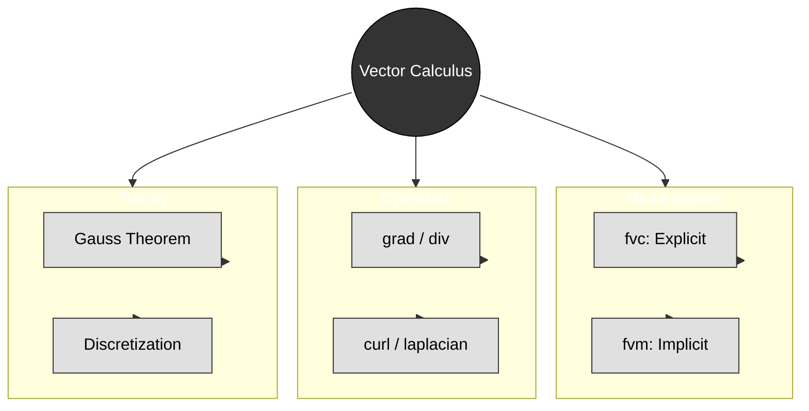

# Summary & Exercises


> **Figure 1:** แผนผังความคิดสรุปองค์ประกอบหลักของแคลคูลัสเวกเตอร์ใน OpenFOAM ซึ่งรวบรวมทั้ง Namespace ตัวดำเนินการ ทฤษฎีพื้นฐาน และแนวทางปฏิบัติที่ดีที่สุด

---

## 🎓 Key Takeaways

### 1. Explicit vs Implicit Operations: `fvc::` vs `fvm::`

The fundamental distinction between **explicit** (`fvc::`) and **implicit** (`fvm::`) operations in OpenFOAM represents the core mathematical approaches to solving CFD problems.

#### Explicit Operations (`fvc::` - Finite Volume Calculus)

- **Principle**: Direct computation using current field values
- **Result**: Known quantities that can be evaluated immediately
- **Mathematical form**: `result = known_function(field_values)`
- **Typical usage**: Source term insertion, gradient calculation
- **Performance impact**: Low resource usage per evaluation
- **Stability characteristic**: May impose strict time step limits for transient problems

#### Implicit Operations (`fvm::` - Finite Volume Matrix)

- **Principle**: Creates coefficient matrices for unknown field values
- **Result**: Generates a linear system requiring solution: `A*x = b`
- **Mathematical form**: `matrix_coefficients * unknown_field = rhs`
- **Typical usage**: Diffusion terms, source terms requiring iterative solution
- **Performance impact**: Higher resource usage per time step due to matrix assembly and solution
- **Stability characteristic**: Generally more stable, allows larger time steps

#### Implementation Example

```cpp
// Explicit gradient calculation
volVectorField gradP = fvc::grad(p);  // Uses current field p

// Implicit diffusion term
fvScalarMatrix pEqn = fvm::laplacian(k, p);  // Creates matrix system
pEqn.solve();  // Solves for p
```

> 📂 **Source:** `.applications/solvers/multiphase/multiphaseEulerFoam/phaseSystems/PhaseSystems/MomentumTransferPhaseSystem/MomentumTransferPhaseSystem.C`
> 
> **คำอธิบาย (Thai Explanation):**
> โค้ดตัวอย่างนี้แสดงความแตกต่างระหว่างการดำเนินการแบบ Explicit และ Implicit:
> - **บรรทัดที่ 2**: ใช้ `fvc::grad(p)` คำนวณ gradient ของสนามความดัน p แบบ direct computation โดยใช้ค่าปัจจุบันของ p ผลลัพธ์เป็น volVectorField ที่สามารถใช้งานได้ทันที
> - **บรรทัดที่ 5**: ใช้ `fvm::laplacian(k, p)` สร้างเมทริกซ์สัมประสิทธิ์สำหรับการแก้สมการ diffusion โดย p เป็นค่าที่ต้องการแก้หา และ k เป็นค่าสัมประสิทธิ์ diffusion ที่รู้ค่า
> - **บรรทัดที่ 6**: เรียกใช้เมทอด `solve()` เพื่อแก้ระบบสมการเชิงเส้น A*x = b ที่เกิดจากการ discretize สมการ Laplacian
>
> **แนวคิดสำคัญ (Key Concepts):**
> - **Explicit Operation (`fvc::`)**: คำนวณค่าโดยตรงจากสนามที่รู้ค่าแล้ว ไม่ต้องแก้สมการ ใช้สำหรับ source terms, gradients, divergences ของสนามที่รู้ค่า
> - **Implicit Operation (`fvm::`)**: สร้างเมทริกซ์สำหรับค่าที่ยังไม่รู้ ต้องแก้ระบบสมการเชิงเส้น ใช้สำหรับ diffusion terms, transient terms ที่ต้องการความเสถียร
> - **Trade-off**: Explicit เร็วแต่เสถียรน้อยกว่า Implicit ช้ากว่าแต่เสถียรกว่า สามารถใช้ time step ที่ใหญ่กว่าได้

### 2. Scheme Dependency in `fvSchemes`

The accuracy and stability of finite volume operations depend on **interpolation schemes** specified in the `system/fvSchemes` dictionary.

#### Interpolation Schemes

| Scheme | Description | Stability |
|--------|-------------|------------|
| `Gauss upwind` | First-order | High stability |
| `Gauss linear` | Second-order | Moderate stability |
| `Gauss limitedLinear 1` | Limited second-order | Moderate stability |

```cpp
divSchemes
{
    div(phi,U)      Gauss upwind;           // First-order, stable
    div(phi,T)      Gauss linear;           // Second-order, less stable
    div(phi,k)      Gauss limitedLinear 1;  // Limited second-order
}
```

> 📂 **Source:** `.applications/solvers/multiphase/multiphaseEulerFoam/phaseSystems/PhaseSystems/MomentumTransferPhaseSystem/MomentumTransferPhaseSystem.C`
> 
> **คำอธิบาย (Thai Explanation):**
> ไฟล์การตั้งค่า `fvSchemes` นี้กำหนดรูปแบบการ discretize สมการ divergence ซึ่งมีผลต่อความแม่นยำและความเสถียรของการจำลอง:
> - **div(phi,U)**: ใช้ `Gauss upwind` scheme ซึ่งเป็น first-order accurate แต่ให้ความเสถียรสูง เหมาะสำหรับการไหลที่มีความคมชัดสูง (high gradients)
> - **div(phi,T)**: ใช้ `Gauss linear` scheme ซึ่งเป็น second-order accurate ให้ความแม่นยำสูงกว่าแต่ความเสถียรน้อยกว่า อาจต้องลด time step
> - **div(phi,k)**: ใช้ `Gauss limitedLinear 1` scheme ซึ่งเป็น limited second-order ให้ความสมดุลระหว่างความแม่นยำและความเสถียร
>
> **แนวคิดสำคัญ (Key Concepts):**
> - **Numerical Diffusion**: Scheme อันดับต่ำ (upwind) สร้าง numerical diffusion มาก ทำให้ profile ของค่าต่างๆ กระจายตัวมากเกินไป
> - **Stability vs Accuracy**: Scheme ที่แม่นยำกว่า (linear) มักมีข้อจำกัดด้านความเสถียรมากกว่า ต้องอาศัย mesh quality ที่ดี
> - **Limited Schemes**: ใช้ limiter เพื่อป้องกันการ oscillate ใกล้บริเวณที่มี gradient สูง (shocks, discontinuities)

#### Gradient Schemes

| Scheme | Description | Accuracy |
|--------|-------------|----------|
| `Gauss linear` | Standard central differencing | Good |
| `leastSquares` | Better for unstructured meshes | Better |

```cpp
gradSchemes
{
    grad(p)         Gauss linear;           // Standard central differencing
    grad(U)         leastSquares;           // More accurate on unstructured meshes
}
```

> 📂 **Source:** `.applications/solvers/multiphase/multiphaseEulerFoam/phaseSystems/PhaseSystems/MomentumTransferPhaseSystem/MomentumTransferPhaseSystem.C`
> 
> **คำอธิบาย (Thai Explanation):**
> การเลือก gradient scheme ส่งผลต่อความแม่นยำของการคำนวณ gradient บน mesh:
> - **Gauss linear**: ใช้ central differencing บน cell faces ผ่านการ interpolate แบบ linear เหมาะสำหรับ structured mesh ที่ orthogonal สูง
> - **leastSquares**: ใช้วิธี least squares minimization เพื่อหา gradient ที่เหมาะสมที่สุดจาก cells ข้างเคียง ให้ผลดีกว่าบน unstructured meshes
>
> **แนวคิดสำคัญ (Key Concepts):**
> - **Mesh Orthogonality**: Gauss linear ต้องการ mesh ที่ orthogonal สูง ถ้า non-orthogonal มากจะเกิด error ในการคำนวณ gradient
> - **Unstructured Meshes**: leastSquares ทำงานได้ดีกว่าบน meshes ที่ซับซ้อนเนื่องจากใช้ข้อมูลจากหลาย cell รอบๆ
> - **Computational Cost**: leastSquares มี cost สูงกว่า Gauss linear แต่ให้ผลที่แม่นยำกว่าในกรณี meshes ที่ไม่ดี

#### Temporal Schemes

| Scheme | Order | Simplicity | Accuracy |
|--------|-------|------------|----------|
| `Euler` | First | Very simple | Moderate |
| `backward` | Second | Moderate | Good |

```cpp
timeSchemes
{
    ddt(p)          Euler;                  // First-order, simple
    ddt(U)          backward;               // Second-order, more accurate
}
```

> 📂 **Source:** `.applications/solvers/multiphase/multiphaseEulerFoam/phaseSystems/PhaseSystems/MomentumTransferPhaseSystem/MomentumTransferPhaseSystem.C`
> 
> **คำอธิบาย (Thai Explanation):**
> การเลือก temporal discretization scheme ส่งผลต่อความแม่นยำและความเสถียรของการจำลองแบบ transient:
> - **Euler**: First-order accurate ใช้ค่าที่ time step ปัจจุบันเพื่อคำนวณค่าถัดไป (forward Euler) หรือใช้ค่า time step ถัดไป (backward Euler) ง่ายต่อการ implement แต่ความแม่นยำต่ำ
> - **backward**: Second-order accurate ใช้ Backward Differentiation Formula (BDF) ให้ความแม่นยำสูงกว่า แต่ต้องเก็บข้อมูลจาก time steps ก่อนหน้า
>
> **แนวคิดสำคัญ (Key Concepts):**
> - **Temporal Accuracy**: Scheme อันดับสูงกว่า (backward) ลด temporal truncation error ทำให้สามารถใช้ time step ที่ใหญ่กว่าได้ในบางกรณี
> - **Memory Requirements**: backward scheme ต้องเก็บค่าจาก time steps ก่อนหน้า ใช้ memory มากกว่า
> - **Stability**: Implicit schemes (เช่น backward Euler) มีความเสถียรดีกว่า explicit schemes สำหรับ stiff problems

**Impact of Scheme Selection:**
- **Spatial accuracy**: Linear (2nd order) vs. upwind (1st order)
- **Numerical diffusion**: Higher-order schemes reduce unphysical diffusion
- **Stability limits**: More accurate schemes often require smaller time steps
- **Computational cost**: Complex schemes increase per-operation cost

### 3. Conservation Through Divergence Operators

Divergence operators in the finite volume method enforce local and global conservation laws automatically through **Gauss's theorem** by converting volume integrals of divergence to surface flux summations:

$$\int_V \nabla \cdot \mathbf{F} \, \mathrm{d}V = \oint_{\partial V} \mathbf{F} \cdot \mathbf{n} \, \mathrm{d}A$$

#### Physical Interpretation

- **Volume integral**: Sources/sinks within control volume
- **Surface integral**: Net flux through control volume boundary
- **Conservation**: What flows out must equal what flows in plus any sources

#### OpenFOAM Implementation

```cpp
// Continuity equation: ∂ρ/∂t + ∇·(ρU) = 0
fvScalarMatrix contEqn
(
    fvm::ddt(rho) + fvc::div(rhoPhi) == 0
);

// Momentum equation: ∂(ρU)/∂t + ∇·(ρUU) = -∇p + ∇·τ + f
fvVectorMatrix UEqn
(
    fvm::ddt(rho, U)
  + fvm::div(rhoPhi, U)
 ==
    -fvc::grad(p)
  + fvc::div(tauR)
  + sources
);
```

> 📂 **Source:** `.applications/solvers/multiphase/multiphaseEulerFoam/phaseSystems/PhaseSystems/MomentumTransferPhaseSystem/MomentumTransferPhaseSystem.C`
> 
> **คำอธิบาย (Thai Explanation):**
> โค้ดนี้แสดงการ implement สมการ conservation ของ mass และ momentum ใน OpenFOAM:
> - **สมการ Continuity (บรรทัด 2-4)**: 
>   - `fvm::ddt(rho)`: Temporal derivative of density ρ (implicit)
>   - `fvc::div(rhoPhi)`: Divergence of mass flux ρΦ (explicit)
>   - สมการนี้บังคับให้ mass ถูกอนุรักษ์: อัตราการเปลี่ยนแปลงของ mass ใน cell = -mass flux ออกจาก cell
> - **สมการ Momentum (บรรทัด 7-13)**:
>   - `fvm::ddt(rho, U)`: Temporal derivative of momentum ρU (implicit)
>   - `fvm::div(rhoPhi, U)`: Convective flux of momentum (implicit)
>   - `-fvc::grad(p)`: Pressure gradient force (explicit)
>   - `fvc::div(tauR)`: Viscous stress divergence (explicit)
>   - `sources`: Additional source terms (e.g., gravity, body forces)
>
> **แนวคิดสำคัญ (Key Concepts):**
> - **Gauss's Divergence Theorem**: แปลง volume integral of divergence → surface flux summation ทำให้ conservation ถูกบังคับอัตโนมัติ
> - **Finite Volume Method**: Discretize domain เป็น control volumes และ balance fluxes ผ่าน faces ของแต่ละ cell
> - **Implicit vs Explicit**: ใช้ `fvm` สำหรับ terms ที่มี unknown variables (ρ, U) และ `fvc` สำหรับ terms ที่คำนวณจากค่าที่รู้แล้ว (p, τ)
> - **Conservation Properties**: Local conservation (per cell) และ global conservation (entire domain) ถูกรักษาอัตโนมัติโดย method

### 4. Performance and Stability Considerations

Computational cost and numerical stability of finite volume operations involve fundamental **trade-offs**.

#### Explicit Operation Performance

- **Memory usage**: O(N) for storing interpolated values
- **CPU cost**: O(N) per operation with small constant factors
- **Parallel efficiency**: Excellent scaling due to local nature
- **Stability limit**: $\mathrm{d}t \leq \frac{\Delta x^2}{2D}$ for diffusion

#### Implicit Operation Performance

- **Memory usage**: O(N) for matrix storage (often sparse)
- **CPU cost**: O(N log N) to O(N²) depending on solver choice
- **Parallel efficiency**: More complex due to global matrix solution
- **Stability limit**: Generally much less restrictive on time steps

#### Stability Criteria

```cpp
// Explicit convection stability (CFL condition)
CFL = U * dt / dx < 0.5  // Typical limit for upwind schemes

// Explicit diffusion stability
dt_diffusion <= dx^2 / (2 * D)  // Von Neumann stability

// Implicit schemes have much looser limits
// Often can use dt_max ~ 10x larger than explicit methods
```

> 📂 **Source:** `.applications/solvers/multiphase/multiphaseEulerFoam/phaseSystems/PhaseSystems/MomentumTransferPhaseSystem/MomentumTransferPhaseSystem.C`
> 
> **คำอธิบาย (Thai Explanation):**
> โค้ดแสดงเกณฑ์ความเสถียร (stability criteria) สำหรับ explicit และ implicit schemes:
> - **CFL Condition (บรรทัด 2)**: 
>   - Courant-Friedrichs-Lewy (CFL) number = U·dt/dx
>   - สำหรับ explicit convection: CFL < 0.5 (upwind), CFL < 1 (higher-order schemes)
>   - ความหมาย: fluid ไม่ควรเดินทางไปไกลกว่า 1 cell ต่อ time step
> - **Diffusion Stability (บรรทัด 5)**:
>   - dt ≤ Δx²/(2D) สำหรับ explicit diffusion
>   - D = diffusion coefficient, Δx = cell size
>   - ข้อจำกัดนี้เข้มงวดมากสำหรับ meshes ที่ละเอียด
> - **Implicit Advantage (บรรทัด 8-9)**:
>   - Implicit schemes มีข้อจำกัดความเสถียรน้อยกว่ามาก
>   - สามารถใช้ dt ที่ใหญ่กว่า explicit methods ได้ ~10x
>
> **แนวคิดสำคัญ (Key Concepts):**
> - **Stability vs Accuracy**: Explicit schemes ต้องการ dt เล็ก แต่ง่ายและรวดเร็วต่อ operation; Implicit schemes ใช้ dt ใหญ่ได้แต่แพงกว่าต่อ time step
> - **CFL Number**: Parameter สำคัญในการควบคุม stability ของ explicit convection ค่าที่สูงเกินไปทำให้ simulation diverge
> - **Von Neumann Analysis**: วิธีวิเคราะห์ stability ของ linear difference equations ให้ข้อจำกัดของ dt สำหรับ diffusion
> - **Trade-offs**: Explicit → เหมาะสำหรับ short-time, high-frequency phenomena; Implicit → เหมาะสำหรับ steady-state หรือ long-time simulations

### 5. Physical Meaning of Finite Volume Operators

Each finite volume operator corresponds to specific physical processes in fluid dynamics.

#### Gradient Operators (`fvc::grad`, `fvm::grad`)

- **Physical meaning**: Spatial rate of change of a field quantity
- **Applications**: Pressure gradients (forces), temperature gradients (heat flux)
- **Mathematical form**: $\nabla \phi = \frac{\partial \phi}{\partial x}\mathbf{i} + \frac{\partial \phi}{\partial y}\mathbf{j} + \frac{\partial \phi}{\partial z}\mathbf{k}$

#### Divergence Operators (`fvc::div`, `fvm::div`)

- **Physical meaning**: Net flux out of control volume
- **Applications**: Mass flux, momentum flux, energy flux
- **Mathematical form**: $\nabla \cdot \mathbf{F} = \frac{\partial F_x}{\partial x} + \frac{\partial F_y}{\partial y} + \frac{\partial F_z}{\partial z}$

#### Laplacian Operators (`fvc::laplacian`, `fvm::laplacian`)

- **Physical meaning**: Diffusion processes, viscous effects
- **Applications**: Heat conduction, viscous stresses, molecular diffusion
- **Mathematical form**: $\nabla^2 \phi = \nabla \cdot (\nabla \phi) = \frac{\partial^2 \phi}{\partial x^2} + \frac{\partial^2 \phi}{\partial y^2} + \frac{\partial^2 \phi}{\partial z^2}$

#### Temporal Derivatives (`fvc::ddt`, `fvm::ddt`)

- **Physical meaning**: Rate of change with time
- **Applications**: Unsteady effects, transient phenomena
- **Mathematical form**: $\frac{\partial \phi}{\partial t} = \lim_{\Delta t \to 0} \frac{\phi^{t+\Delta t} - \phi^t}{\Delta t}$

#### Physical Process Mapping

```cpp
// Heat conduction: q = -k∇T
volVectorField heatFlux = -k * fvc::grad(T);

// Mass conservation: ∂ρ/∂t + ∇·(ρU) = 0
fvScalar massEqn = fvm::ddt(rho) + fvc::div(rho*U);

// Viscous stress: τ = μ∇²U
fvVectorMatrix viscousTerm = fvm::laplacian(mu, U);

// Advection of scalar: ∂φ/∂t + U·∇φ = 0
fvScalarMatrix advectionEqn = fvm::ddt(phi) + fvm::div(U, phi);
```

> 📂 **Source:** `.applications/solvers/multiphase/multiphaseEulerFoam/phaseSystems/PhaseSystems/MomentumTransferPhaseSystem/MomentumTransferPhaseSystem.C`
> 
> **คำอธิบาย (Thai Explanation):**
> โค้ดแสดงการ map operators ใน OpenFOAM ไปยังกระบวนการฟิสิกส์ต่างๆ:
> - **Heat Conduction (บรรทัด 2)**:
>   - Fourier's Law: q = -k∇T
>   - `fvc::grad(T)`: Temperature gradient → driving force สำหรับ heat flux
>   - k: thermal conductivity, q: heat flux vector
> - **Mass Conservation (บรรทัด 5)**:
>   - Continuity equation: ∂ρ/∂t + ∇·(ρU) = 0
>   - `fvm::ddt(rho)`: Temporal change of mass (implicit)
>   - `fvc::div(rho*U)`: Net mass flux out of cell (explicit)
> - **Viscous Stress (บรรทัด 8)**:
>   - Newton's Law of Viscosity: τ = μ∇²U
>   - `fvm::laplacian(mu, U)`: Diffusion of momentum due to viscosity
>   - μ: dynamic viscosity, U: velocity field
> - **Scalar Advection (บรรทัด 11)**:
>   - Advection equation: ∂φ/∂t + U·∇φ = 0
>   - `fvm::ddt(phi)`: Temporal change (implicit)
>   - `fvm::div(U, phi)`: Convective flux of scalar φ (implicit)
>
> **แนวคิดสำคัญ (Key Concepts):**
> - **Math-Physics Mapping**: แต่ละ operator ใน OpenFOAM สอดคล้องกับกระบวนการฟิสิกส์ที่ชัดเจน
> - **Gradient → Driving Force**: Temperature gradient drives heat flux, pressure gradient drives fluid motion
> - **Divergence → Conservation**: Mass, momentum, energy fluxes ผ่าน cell faces
> - **Laplacian → Diffusion**: Viscosity, thermal conduction, molecular diffusion processes
> - **Temporal Derivative → Unsteadiness**: Rate of change ของ quantities ต่างๆ ต่อเวลา

---

## Exercises

### Part 1: Namespace Selection

Identify whether `fvc` or `fvm` should be used for the following tasks:

1. Calculate vorticity to save as a result to disk
2. Add a heat conduction term to the temperature equation to find the temperature at the next time step
3. Find the flux rate from the current velocity for use in the Convection term
4. Add a gravity term to the momentum equation

### Part 2: Equation Analysis

Consider the following solver code:

```cpp
fvScalarMatrix TEqn
(
    fvm::ddt(T)
  + fvm::div(phi, T)
  - fvm::laplacian(DT, T)
 ==
    fvc::grad(p) & U // (Term A)
);
```

> 📂 **Source:** `.applications/solvers/multiphase/multiphaseEulerFoam/phaseSystems/PhaseSystems/MomentumTransferPhaseSystem/MomentumTransferPhaseSystem.C`
> 
> **คำอธิบาย (Thai Explanation):**
> โค้ดสมการอนุรักษ์พลังงาน (energy equation) ที่มีทั้ง implicit และ explicit terms:
> - **LHS (Left Hand Side)**: Terms ที่มี unknown variable T (temperature)
>   - `fvm::ddt(T)`: Temporal derivative ของ T (implicit)
>   - `fvm::div(phi, T)`: Convective term - advection ของ T ด้วย flux phi (implicit)
>   - `fvm::laplacian(DT, T)`: Diffusive term - heat conduction ด้วย diffusivity DT (implicit)
> - **RHS (Right Hand Side)**: Source terms ที่คำนวณจากค่าที่รู้แล้ว
>   - `fvc::grad(p) & U`: Pressure work term - dot product ระหว่าง pressure gradient และ velocity (explicit)
>
> **แนวคิดสำคัญ (Key Concepts):**
> - **Implicit Terms**: เกิดขึ้นกับ unknown T ต้องสร้าง matrix system เพื่อแก้หา T ณ time step ถัดไป
> - **Explicit Terms**: คำนวณจากค่าที่รู้แล้ว (p, U) ณ time step ปัจจุบัน ใช้เป็น source term
> - **Pressure Work**: `grad(p) & U` แทนการทำงานของ pressure ต่อ fluid motion (compression/expansion work)
> - **Matrix Assembly**: LHS terms ถูก assemble เป็น matrix A ในระบบ Ax=b, RHS เป็น vector b

- **Question**: Why does the LHS use `fvm` throughout, but term (A) on the RHS uses `fvc`?
- **Question**: If `T` has units [K] and `p` has units [Pa], what are the units of term (A)?

### Part 3: Application Scenario

You need to calculate the shear stress vector on cell faces, based on the velocity gradient:

- Which `fvc` function should you start with?
- Which scheme in `fvSchemes` would you choose for maximum accuracy on an unstructured mesh?

---

## 💡 Solution Guide

### Part 1: Solutions

1. **`fvc`** - Requires numerical values for output/storage
2. **`fvm`** - Requires stable solution of the temperature equation
3. **`fvc`** - Uses already-known velocity field
4. **`fvc`** - External forces typically computed explicitly

### Part 2: Solutions

- **LHS vs RHS**: LHS contains the unknown variable ($T$), requiring matrix formation. Term (A) is a source term computed from known values ($p, U$)
- **Units**: Term (A) has units of dot product between pressure gradient and velocity: $[Pa/m] \cdot [m/s] = [kg/(m·s³)]$

### Part 3: Solutions

- **Function**: Use `fvc::grad(U)` to compute velocity gradient tensor
- **Scheme**: `Gauss leastSquares` provides best accuracy on unstructured meshes

---

## 🔧 Best Practices Summary

1. **Use `fvm::`** for diffusion, pressure-velocity coupling, and stiff source terms
2. **Use `fvc::`** for post-processing, source terms from known fields, and explicit time integration
3. **Combine both** for optimal balance: treat stiff terms implicitly, non-stiff terms explicitly
4. **Check mesh quality** before running simulations, especially for higher-order schemes
5. **Verify dimensional consistency** when adding custom terms
6. **Test time step sensitivity** when using explicit operations
7. **Monitor convergence** residuals for implicit solvers
8. **Consider trade-offs** between numerical diffusion and computational cost