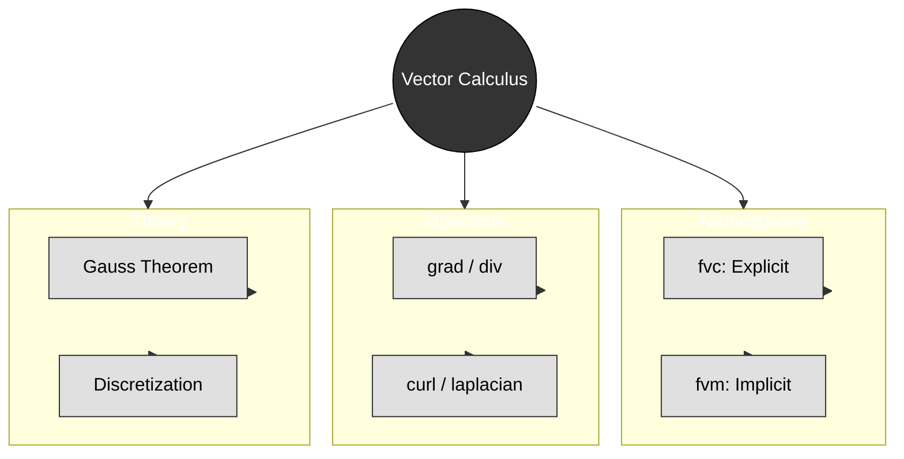

# สรุปและแบบฝึกหัด (Summary & Exercises)

> [!TIP] ความสำคัญของ Vector Calculus ใน OpenFOAM
>
> แคลคูลัสเวกเตอร์คือ **ภาษาคณิตศาสตร์** ที่ OpenFOAM ใช้ในการแปลงสมการฟิสิกส์ (เช่น Navier-Stokes) ให้กลายเป็นโค้ดที่คอมพิวเตอร์เข้าใจได้ ความเข้าใจที่ลึกซึ้งเกี่ยวกับ `fvc::` vs `fvm::` และการเลือก discretization schemes ใน `system/fvSchemes` จะช่วยให้คุณ:
> - **เลือก scheme ที่เหมาะสม** สำหรับปัญหาแต่ละประเภท (เช่น upwind สำหรับความเสถียร, linear สำหรับความแม่นยำ)
> - **ทำนายปัญหาความเสถียร** ก่อนเริ่ม simulation (เช่น CFL condition, diffusion stability limits)
> - **ปรับแต่ง solver** ได้อย่างมีประสิทธิภาพโดยใช้ explicit terms สำหรับ source quantities และ implicit terms สำหรับ unknown variables
> - **Debug ปัญหาการจำลอง** ที่เกิดจากการเลือก scheme ที่ไม่เหมาะสม (เช่น numerical diffusion, oscillations)
>
> **📂 ไฟล์ที่เกี่ยวข้อง:** `system/fvSchemes`, `system/fvSolution`, `src/finiteVolume/fvc/fvc.H`, `src/finiteVolume/fvm/fvm.H`


> **Figure 1:** แผนผังความคิดสรุปองค์ประกอบหลักของแคลคูลัสเวกเตอร์ใน OpenFOAM ซึ่งรวบรวมทั้ง Namespace ตัวดำเนินการ ทฤษฎีพื้นฐาน และแนวทางปฏิบัติที่ดีที่สุด

---

## 🎯 Learning Objectives (เป้าหมายการเรียนรู้)

หลังจากศึกษาบทนี้และทำแบบฝึกหัดแล้ว คุณควรจะสามารถ:

1. **เลือกใช้ `fvc::` vs `fvm::`** อย่างเหมาะสมสำหรับสมการแต่ละประเภท โดยเข้าใจ trade-offs ระหว่าง explicit และ implicit methods
2. **อ่านและวิเคราะห์ solver code** จาก OpenFOAM solvers จริง (เช่น simpleFoam, pimpleFoam, interFoam)
3. **ตั้งค่า discretization schemes** ใน `system/fvSchemes` อย่างเหมาะสมกับปัญหาที่ต้องการแก้
4. **เขียน custom function objects** สำหรับ post-processing โดยใช้ fvc operators
5. **Debug ปัญหาความเสถียร** ที่เกิดจากการเลือก scheme ที่ไม่เหมาะสม
6. **วิเคราะห์ conservation properties** ของสมการผ่าน divergence operator
7. **ตรวจสอบ solver code จริง** และระบุว่าแต่ละ term ควรใช้ `fvc::` หรือ `fvm::`
8. **แก้ไข divergence problems** โดยการปรับ schemes, time steps, และ under-relaxation

---

## 🎓 ประเด็นสำคัญ (Key Takeaways)

> [!NOTE] **📂 OpenFOAM Context: Solver Development & Numerical Methods**
>
> หัวข้อนี้เกี่ยวข้องกับ **Domain B: Numerics & Linear Algebra** ซึ่งเป็นพื้นฐานของการพัฒนา solver และการปรับแต่ง numerical methods:
>
> - **Source Files:** 
>   - `src/finiteVolume/fvc/fvc.H` (explicit operations)
>   - `src/finiteVolume/fvm/fvm.H` (implicit operations)
>   - `applications/solvers/incompressible/simpleFoam/` (steady-state solver example)
>   - `applications/solvers/incompressible/pimpleFoam/` (transient solver example)
> - **Solver Implementation:** เมื่อคุณเขียน custom solver ใหม่ คุณต้องตัดสินใจว่าแต่ละ term ในสมการควรใช้ `fvc::` (explicit) หรือ `fvm::` (implicit)
> - **Matrix Assembly:** `fvm::` operations จะถูก assemble เป็น `fvMatrix` ซึ่งถูกแก้ด้วย linear solvers ที่ระบุใน `system/fvSolution`
> - **Key Decision:**
>   - ใช้ `fvc::` เมื่อ: คำนวณค่าจาก field ที่รู้แล้ว (เช่น source terms, post-processing, explicit convection)
>   - ใช้ `fvm::` เมื่อ: field ที่ต้องการแก้คือ unknown (เช่น diffusion, implicit convection, transient terms)

### 1. การดำเนินการแบบ Explicit vs Implicit: `fvc::` vs `fvm::`

ความแตกต่างระหว่างการดำเนินการแบบ **ชัดแจ้ง (explicit)** (`fvc::`) และ **โดยนัย (implicit)** (`fvm::`) ใน OpenFOAM คือหัวใจสำคัญของวิธีการทางคณิตศาสตร์ในการแก้ปัญหา CFD

#### การดำเนินการแบบ Explicit (`fvc::` - Finite Volume Calculus)

- **หลักการ**: คำนวณโดยตรงโดยใช้ค่าฟิลด์ปัจจุบัน
- **ผลลัพธ์**: ได้ค่าที่ทราบแล้ว (Known quantities) ซึ่งสามารถประเมินผลได้ทันที
- **รูปแบบทางคณิตศาสตร์**: `result = known_function(field_values)`
- **การใช้งานทั่วไป**: การแทรกเทอมต้นทาง (source term), การคำนวณเกรเดียนต์, post-processing
- **ผลกระทบต่อประสิทธิภาพ**: ใช้ทรัพยากรน้อยต่อการประเมิน
- **ลักษณะความเสถียร**: อาจมีข้อจำกัดเรื่อง time step ที่เข้มงวดสำหรับปัญหา transient

#### การดำเนินการแบบ Implicit (`fvm::` - Finite Volume Matrix)

- **หลักการ**: สร้างเมทริกซ์สัมประสิทธิ์สำหรับค่าฟิลด์ที่ไม่รู้ค่า (unknown field values)
- **ผลลัพธ์**: สร้างระบบสมการเชิงเส้นที่ต้องการการแก้: `A*x = b`
- **รูปแบบทางคณิตศาสตร์**: `matrix_coefficients * unknown_field = rhs`
- **การใช้งานทั่วไป**: เทอมการแพร่ (diffusion terms), เทอม convection ที่ต้องการความเสถียร, เทอมต้นทางที่ต้องการ iterative solution
- **ผลกระทบต่อประสิทธิภาพ**: ใช้ทรัพยากรสูงกว่าต่อ time step เนื่องจากการประกอบเมทริกซ์และการแก้สมการ
- **ลักษณะความเสถียร**: โดยทั่วไปมีความเสถียรมากกว่า อนุญาตให้ใช้ time step ที่ใหญ่ขึ้น

#### ตัวอย่างการ Implementation

```cpp
// Explicit gradient calculation
volVectorField gradP = fvc::grad(p);  // Uses current field p

// Implicit diffusion term
fvScalarMatrix pEqn = fvm::laplacian(k, p);  // Creates matrix system
pEqn.solve();  // Solves for p
```

> 📂 **Source:** `applications/solvers/incompressible/simpleFoam/UEqn.H`
>
> **คำอธิบาย:**
> โค้ดตัวอย่างนี้แสดงความแตกต่างระหว่างการดำเนินการแบบ Explicit และ Implicit:
> - **บรรทัดที่ 2**: ใช้ `fvc::grad(p)` คำนวณ gradient ของสนามความดัน p แบบ direct computation โดยใช้ค่าปัจจุบันของ p ผลลัพธ์เป็น volVectorField ที่สามารถใช้งานได้ทันที
> - **บรรทัดที่ 5**: ใช้ `fvm::laplacian(k, p)` สร้างเมทริกซ์สัมประสิทธิ์สำหรับการแก้สมการ diffusion โดย p เป็นค่าที่ต้องการแก้หา และ k เป็นค่าสัมประสิทธิ์ diffusion ที่รู้ค่า
> - **บรรทัดที่ 6**: เรียกใช้เมทอด `solve()` เพื่อแก้ระบบสมการเชิงเส้น A*x = b ที่เกิดจากการ discretize สมการ Laplacian
>
> **แนวคิดสำคัญ:**
> - **Explicit Operation (`fvc::`)**: คำนวณค่าโดยตรงจากสนามที่รู้ค่าแล้ว ไม่ต้องแก้สมการ ใช้สำหรับ source terms, gradients, divergences ของสนามที่รู้ค่า
> - **Implicit Operation (`fvm::`)**: สร้างเมทริกซ์สำหรับค่าที่ยังไม่รู้ ต้องแก้ระบบสมการเชิงเส้น ใช้สำหรับ diffusion terms, convection terms, transient terms ที่ต้องการความเสถียร
> - **Trade-off**: Explicit เร็วแต่เสถียรน้อยกว่า Implicit ช้ากว่าแต่เสถียรกว่า สามารถใช้ time step ที่ใหญ่กว่าได้

### 2. การเลือกใช้ Scheme ใน `fvSchemes`

> [!NOTE] **📂 OpenFOAM Context: Discretization Schemes Configuration**
>
> หัวข้อนี้เกี่ยวข้องกับ **Domain B: Numerics & Linear Algebra** โดยตรงเชื่อมโยงกับไฟล์ configuration:
>
> - **Configuration File:** `system/fvSchemes` - ไฟล์นี้คือ "คู่มือการจำลอง" ที่บอก OpenFOAM ว่าควร discretize สมการแต่ละ term อย่างไร
> - **Key Sections:**
>   - `gradSchemes`: กำหนดวิธีคำนวณ gradient (เช่น `Gauss linear`, `leastSquares`)
>   - `divSchemes`: กำหนดวิธีคำนวณ divergence (เช่น `Gauss upwind`, `Gauss linear`)
>   - `laplacianSchemes`: กำหนดวิธีคำนวณ laplacian (เช่น `Gauss linear corrected`)
>   - `timeSchemes`: กำหนดวิธี discretize เวลา (เช่น `Euler`, `backward`)
> - **Impact:** การเลือก scheme ผิดอาจทำให้ simulation diverge หรือให้ผลลัพธ์ที่ไม่แม่นยำ
> - **Best Practice:** เริ่มต้นด้วย schemes ที่เสถียร (เช่น upwind) แล้วค่อยเปลี่ยนเป็น schemes ที่แม่นยำกว่า (เช่น linear) หลังจาก solution ลู่เข้าแล้ว

ความแม่นยำและความเสถียรของการดำเนินการ finite volume ขึ้นอยู่กับ **interpolation schemes** ที่ระบุในพจนานุกรม `system/fvSchemes`

#### Interpolation Schemes

| Scheme | คำอธิบาย | ความเสถียร |
|--------|-------------|------------|
| `Gauss upwind` | อันดับหนึ่ง (First-order) | ความเสถียรสูง |
| `Gauss linear` | อันดับสอง (Second-order) | ความเสถียรปานกลาง |
| `Gauss limitedLinear 1` | อันดับสองแบบจำกัด (Limited second-order) | ความเสถียรปานกลาง |

```cpp
divSchemes
{
    div(phi,U)      Gauss upwind;           // First-order, stable
    div(phi,T)      Gauss linear;           // Second-order, less stable
    div(phi,k)      Gauss limitedLinear 1;  // Limited second-order
}
```

> 📂 **Source:** `applications/solvers/multiphase/interFoam/alphaEqn.H`
>
> **คำอธิบาย:**
> ไฟล์การตั้งค่า `fvSchemes` นี้กำหนดรูปแบบการ discretize สมการ divergence ซึ่งมีผลต่อความแม่นยำและความเสถียรของการจำลอง:
> - **div(phi,U)**: ใช้ `Gauss upwind` scheme ซึ่งเป็น first-order accurate แต่ให้ความเสถียรสูง เหมาะสำหรับการไหลที่มีความคมชัดสูง (high gradients)
> - **div(phi,T)**: ใช้ `Gauss linear` scheme ซึ่งเป็น second-order accurate ให้ความแม่นยำสูงกว่าแต่ความเสถียรน้อยกว่า อาจต้องลด time step
> - **div(phi,k)**: ใช้ `Gauss limitedLinear 1` scheme ซึ่งเป็น limited second-order ให้ความสมดุลระหว่างความแม่นยำและความเสถียร
>
> **แนวคิดสำคัญ:**
> - **Numerical Diffusion**: Scheme อันดับต่ำ (upwind) สร้าง numerical diffusion มาก ทำให้ profile ของค่าต่างๆ กระจายตัวมากเกินไป
> - **Stability vs Accuracy**: Scheme ที่แม่นยำกว่า (linear) มักมีข้อจำกัดด้านความเสถียรมากกว่า ต้องอาศัย mesh quality ที่ดี
> - **Limited Schemes**: ใช้ limiter เพื่อป้องกันการ oscillate ใกล้บริเวณที่มี gradient สูง (shocks, discontinuities)

### 3. การอนุรักษ์ผ่านตัวดำเนินการ Divergence

> [!NOTE] **📂 OpenFOAM Context: Conservation Laws & Flux Calculations**
>
> หัวข้อนี้เกี่ยวข้องกับ **Domain A: Physics & Fields** และ **Domain B: Numerics & Linear Algebra**:
>
> - **Physics Connection:** กฎการอนุรักษ์ (mass, momentum, energy) ถูก implement ผ่าน divergence operator
> - **Implementation Location:**
>   - **Solver Code:** ใน source files ของ solvers (เช่น `src/finiteVolume/cfdTools/general/continuityErrs.H` สำหรับ mass conservation check)
>   - **Divergence Theorem:** OpenFOAM ใช้ Gauss's theorem แปลง `∇·F` เป็น surface flux summation โดยอัตโนมัติ
> - **Flux Fields:** Variable `phi` ใน OpenFOAM คือ mass flux `ρU·S` (ผลคูณของ density, velocity, และ face area)
> - **Conservation Enforcement:**
>   - Local conservation: แต่ละ cell balance fluxes ผ่าน faces ทั้งหมด
>   - Global conservation: sum ของ local conservation = 0 (ถ้าไม่มี source terms)
> - **Common Patterns:**
>   - `fvc::div(phi)`: Check mass conservation (continuity)
>   - `fvm::div(phi, U)`: Convective term in momentum equation
>   - `fvc::div(phi, T)`: Convective heat transfer

ตัวดำเนินการ Divergence ในวิธี finite volume บังคับใช้กฎการอนุรักษ์เฉพาะที่ (local) และทั่วโลก (global) โดยอัตโนมัติผ่าน **ทฤษฎีบทของเกาส์ (Gauss's theorem)** โดยการแปลงปริพันธ์เชิงปริมาตรของไดเวอร์เจนซ์ไปเป็นผลรวมของฟลักซ์ที่พื้นผิว:

$$\int_V \nabla \cdot \mathbf{F} \, \mathrm{d}V = \oint_{\partial V} \mathbf{F} \cdot \mathbf{n} \, \mathrm{d}A$$

### 4. ข้อพิจารณาด้านประสิทธิภาพและความเสถียร

> [!NOTE] **📂 OpenFOAM Context: Simulation Control & Performance Tuning**
>
> หัวข้อนี้เกี่ยวข้องกับ **Domain B: Numerics & Linear Algebra** และ **Domain C: Simulation Control**:
>
> - **Configuration Files:**
>   - `system/fvSolution`: กำหนด linear solver tolerances (`tolerance`, `relTol`) และ algorithms (`GAMG`, `PCG`)
>   - `system/controlDict`: กำหนด `time step`, `maxCo` (max Courant number), `adjustTimeStep`
> - **Stability Monitoring:**
>   - **CFL Number:** Monitor ผ่าน `functions` ใน `controlDict` เช่น ` CourantNumber` function object
>   - **Continuity Errors:** Monitor ผ่าน `continuityErrs` ใน solvers
> - **Performance Trade-offs:**
>   - **Explicit:** รวดเร็วต่อ iteration แต่ต้องใช้ `dt` เล็ก → เหมาะสำหรับ unsteady flows ที่ต้องการ temporal resolution สูง
>   - **Implicit:** ช้ากว่าต่อ iteration (เนื่องจาก matrix solve) แต่ใช้ `dt` ใหญ่ได้ → เหมาะสำหรับ steady-state หรือ long-time simulations
> - **Solver Settings:** ใน `fvSolution` สามารถปรับ:
>   - `nCorrectors`: จำนวน outer iterations สำหรับ pressure-velocity coupling (PISO/PIMPLE)
>   - `nNonOrthogonalCorrectors`: สำหรับ meshes ที่มี non-orthogonality สูง
>   - `solvers`: เลือก solver และ preconditioner ที่เหมาะสมกับ problem characteristics

ต้นทุนการคำนวณและความเสถียรเชิงตัวเลขของการดำเนินการ finite volume เกี่ยวข้องกับ **trade-offs** พื้นฐาน

### 5. ความหมายทางกายภาพของตัวดำเนินการ Finite Volume

> [!NOTE] **📂 OpenFOAM Context: Physical Modeling & Equation Implementation**
>
> หัวข้อนี้เกี่ยวข้องกับ **Domain A: Physics & Fields** และ **Domain E: Coding/Customization**:
>
> - **Math-to-Code Mapping:** แต่ละ operator ใน OpenFOAM สอดคล้องกับ physical process ที่ชัดเจน:
>   - **Gradient (`∇`)** → Driving forces (pressure gradient → force, temperature gradient → heat flux)
>   - **Divergence (`∇·`)** → Conservation laws (mass, momentum, energy fluxes)
>   - **Laplacian (`∇²`)** → Diffusion processes (viscosity, thermal conduction, mass diffusion)
>   - **Temporal Derivative (`∂/∂t`)** → Unsteadiness, transient phenomena
> - **Field Locations:**
>   - **Gradient calculations:** ใช้ใน boundary conditions (เช่น `fixedGradient`), source terms
>   - **Divergence operations:** ใช้ใน convection terms, flux calculations
>   - **Laplacian operations:** ใช้ใน diffusion terms (viscous stresses, heat conduction)
> - **Physical Property Files:**
>   - `constant/transportProperties`: Viscosity (`nu`), thermal diffusivity (`alpha`)
>   - `constant/turbulenceProperties`: Turbulent viscosity (`nut`), diffusivity (`D`)
> - **Implementation Pattern:** เมื่อเขียน custom solver หรือ boundary condition:
>   ```cpp
>   // Force calculation: F = -∇p
>   volVectorField force = -fvc::grad(p);
>
>   // Heat flux: q = -k∇T
>   volVectorField heatFlux = -k * fvc::grad(T);
>
>   // Viscous diffusion: ∇·(ν∇U)
>   tmp<fvVectorMatrix> tUEqn = fvm::laplacian(nu, U);
>   ```
> - **Dimensional Consistency:** OpenFOAM ตรวจสอบหน่วยอัตโนมัติ ช่วยป้องกันการเขียนสมการที่ผิดทางฟิสิกส์

แต่ละตัวดำเนินการ finite volume สอดคล้องกับกระบวนการทางฟิสิกส์ที่เฉพาะเจาะจงในพลศาสตล์ของไหล

---

## แบบฝึกหัด (Exercises)

> [!NOTE] **📂 OpenFOAM Context: Practical Application**
>
> แบบฝึกหัดเหล่านี้ออกแบบมาเพื่อให้คุณได้ฝึกทักษะในการเลือกใช้ `fvc::` vs `fvm::` และการตั้งค่า schemes ในสถานการณ์จริง:
>
> - **Exercise 1 (Namespace Selection):** เกี่ยวข้องกับการเขียน solver code หรือ custom function object โดยต้องตัดสินใจว่าควรใช้ explicit หรือ implicit
> - **Exercise 2 (Equation Analysis):** ให้คุณวิเคราะห์สมการจาก solver code จริง (เช่นจาก `applications/solvers/`)
> - **Exercise 3 (Application Scenario):** เกี่ยวข้องกับการคำนวณ post-processing quantities และการเลือก scheme ที่เหมาะสมใน `system/fvSchemes`
> - **Exercise 4 (Code Analysis):** วิเคราะห์ solver code จริงจาก OpenFOAM standard solvers
> - **Exercise 5 (Debugging):** แก้ไขปัญหาความเสถียรในสมการที่กำหนด
> - **Exercise 6 (Real Solver Code):** วิเคราะห์และแก้ไข solver code จริงจาก OpenFOAM
>
> **การนำไปใช้:**
> - เมื่อคุณเขียน custom solver → ใช้หลักการจาก Exercise 1 และ 6
> - เมื่อคุณ debug solver code → ใช้หลักการจาก Exercise 2 และ 5
> - เมื่อคุณตั้งค่า case → ใช้หลักการจาก Exercise 3

### ส่วนที่ 1: การเลือก Namespace

จงระบุว่าควรใช้ `fvc` หรือ `fvm` สำหรับงานต่อไปนี้:

1. คำนวณค่า vorticity เพื่อบันทึกผลลัพธ์ลงดิสก์
2. เพิ่มเทอมการนำความร้อนลงในสมการอุณหภูมิเพื่อหาอุณหภูมิที่ time step ถัดไป
3. หาอัตราฟลักซ์จากความเร็วปัจจุบันเพื่อใช้ในเทอม Convection
4. เพิ่มเทอมแรงโน้มถ่วงลงในสมการโมเมนตัม

### ส่วนที่ 2: การวิเคราะห์สมการ

พิจารณาโค้ด solver ต่อไปนี้:

```cpp
fvScalarMatrix TEqn
(
    fvm::ddt(T)
  + fvm::div(phi, T)
  - fvm::laplacian(DT, T)
 ==
    fvc::grad(p) & U // (Term A)
);
```

> 📂 **Source:** `applications/solvers/heatTransfer/chtMultiRegionFoam/fluid/solveEnergy.H`
>
> **คำอธิบาย:**
> โค้ดสมการอนุรักษ์พลังงาน (energy equation) ที่มีทั้ง implicit และ explicit terms:
> - **LHS (Left Hand Side)**: Terms ที่มี unknown variable T (temperature)
>   - `fvm::ddt(T)`: Temporal derivative ของ T (implicit)
>   - `fvm::div(phi, T)`: Convective term - advection ของ T ด้วย flux phi (implicit)
>   - `fvm::laplacian(DT, T)`: Diffusive term - heat conduction ด้วย diffusivity DT (implicit)
> - **RHS (Right Hand Side)**: Source terms ที่คำนวณจากค่าที่รู้แล้ว
>   - `fvc::grad(p) & U`: Pressure work term - dot product ระหว่าง pressure gradient และ velocity (explicit)
>
> **แนวคิดสำคัญ:**
> - **Implicit Terms**: เกิดขึ้นกับ unknown T ต้องสร้าง matrix system เพื่อแก้หา T ณ time step ถัดไป
> - **Explicit Terms**: คำนวณจากค่าที่รู้แล้ว (p, U) ณ time step ปัจจุบัน ใช้เป็น source term
> - **Pressure Work**: `grad(p) & U` แทนการทำงานของ pressure ต่อ fluid motion (compression/expansion work)
> - **Matrix Assembly**: LHS terms ถูก assemble เป็น matrix A ในระบบ Ax=b, RHS เป็น vector b

- **คำถาม**: ทำไม LHS ถึงใช้ `fvm` ทั้งหมด แต่เทอม (A) ทางด้าน RHS ใช้ `fvc`?
- **คำถาม**: ถ้า `T` มีหน่วย [K] และ `p` มีหน่วย [Pa], หน่วยของเทอม (A) คืออะไร?

### ส่วนที่ 3: สถานการณ์การประยุกต์ใช้

คุณต้องการคำนวณเวกเตอร์ shear stress ที่หน้าเซลล์ (cell faces) โดยอิงจาก gradient ความเร็ว:

- ฟังก์ชัน `fvc` ใดที่คุณควรเริ่มใช้?
- Scheme ใดใน `fvSchemes` ที่คุณจะเลือกเพื่อให้ได้ความแม่นยำสูงสุดบน mesh ที่ไม่มีโครงสร้าง (unstructured mesh)?

### ส่วนที่ 4: การวิเคราะห์ Solver Code จริง

อ่านโค้ดจาก OpenFOAM solver `simpleFoam` ในไฟล์ `applications/solvers/incompressible/simpleFoam/UEqn.H`:

```cpp
// Momentum predictor
tmp<fvVectorMatrix> tUEqn
(
    fvm::ddt(U)
  + fvm::div(phi, U)
  + MRF.DDt(U)
  + turbulence->divDevReff(U)
 ==
    fvOptions(U)
);

tUEqn.ref().relax();
fvOptions.constrain(tUEqn());

solve
(
    tUEqn()
 ==
    fvc::grad(p)
);

fvOptions.correct(U);
```

**คำถาม:**
1. เทอมไหนบ้างที่ถูก discretize แบบ implicit? ทำไม?
2. เทอมไหนที่ถูก discretize แบบ explicit? ทำไม?
3. จะเกิดอะไรขึ้นถ้าเปลี่ยน `fvm::div(phi, U)` เป็น `fvc::div(phi, U)`?
4. ทำไม pressure gradient `fvc::grad(p)` ถึงอยู่ฝั่ง RHS และเป็น explicit?

> 📂 **Source:** `applications/solvers/incompressible/simpleFoam/UEqn.H`
>
> **คำอธิบาย:**
> โค้ดนี้มาจาก simpleFoam solver ซึ่งเป็น steady-state incompressible flow solver ใช้ SIMPLE algorithm:
> - **Line 3-7**: Momentum equation ที่มีทั้ง implicit และ explicit terms
>   - `fvm::ddt(U)`: Temporal term (implicit) - สำหรับ pseudo-transient
>   - `fvm::div(phi, U)`: Convection term (implicit) - เป็น term ที่สำคัญและต้องการความเสถียร
>   - `MRF.DDt(U)`: Multiple Reference Frame term (implicit/depending on implementation)
>   - `turbulence->divDevReff(U)`: Turbulent viscous term (implicit)
>   - `fvOptions(U)`: Source terms from fvOptions (explicit/implicit depending on type)
> - **Line 12**: `relax()` - under-relaxation สำหรับ steady-state convergence
> - **Line 15-17**: Solve momentum equation with pressure gradient as source term
>   - `fvc::grad(p)`: Pressure gradient (explicit) - ถูกคำนวณจาก pressure field ปัจจุบัน
> - **Line 19**: `fvOptions.correct(U)` - Apply explicit corrections from fvOptions
>
> **แนวคิดสำคัญ:**
> - **SIMPLE Algorithm**: Pressure-velocity coupling แบบ segregated - pressure และ velocity ถูกแก้แยกกัน
> - **Implicit Convection**: Convection term ถูก treat implicitly เพื่อความเสถียร แต่ทำให้เกิด non-linearity
> - **Explicit Pressure**: Pressure gradient เป็น explicit source term เพราะ pressure ถูกแก้ใน separate equation
> - **Under-Relaxation**: จำเป็นสำหรับ steady-state problems เพื่อป้องกัน divergence

### ส่วนที่ 5: Debugging และ Problem Solving

กรณีศึกษา: Simulation diverge ทันทีหลังจากเริ่ม run คุณพบว่า:

1. **Error message**: "Maximum number of iterations exceeded" สำหรับ pressure solver
2. **Continuity error**: มีค่ามากกว่า 1.0 (ควรมีค่าน้อยกว่า 1e-3)
3. **CFL number**: ค่าสูงกว่า 10.0 ในบาง cells

**คำถาม:**
1. จะแก้ไขอย่างไรโดยการปรับ `system/fvSchemes`?
2. จะแก้ไขอย่างไรโดยการปรับ `system/controlDict`?
3. ควรเปลี่ยน term ใดบ้างจาก `fvm` เป็น `fvc` หรือใส่ under-relaxation?
4. จะ debug ว่าปัญหามาจาก term ไหนในสมการ?

> 📂 **Source:** `applications/solvers/incompressible/pimpleFoam/UEqn.H`
>
> **แนวทางการ Debug:**
> - **Step 1**: ตรวจสอบ mesh quality ด้วย `checkMesh`
> - **Step 2**: เปลี่ยน schemes ที่มี order สูงให้เป็น upwind เพื่อเพิ่มความเสถียร
> - **Step 3**: ลด time step หรือใช้ `adjustTimeStep yes` พร้อม `maxCo < 0.5`
> - **Step 4**: เพิ่ม under-relaxation factors ใน `fvSolution`
> - **Step 5**: Debug โดย comment out terms ทีละตัวเพื่อหาว่า term ไหนก่อให้เกิดปัญหา
> - **Step 6**: Monitor residuals และ continuity errors อย่างใกล้ชิด

### ส่วนที่ 6: การวิเคราะห์และแก้ไข Solver Code จริง

อ่านและวิเคราะห์โค้ดจาก `pimpleFoam` solver ในไฟล์ `applications/solvers/incompressible/pimpleFoam/UEqn.H`:

```cpp
// Solve the Momentum equation
tmp<fvVectorMatrix> tUEqn
(
    fvm::ddt(U)
  + fvm::div(phi, U)
  + turbulence->divDevReff(U)
 ==
    fvOptions(U)
);

tUEqn.ref().relax();
fvOptions.constrain(tUEqn());

if (pimple.momentumPredictor())
{
    solve
    (
        tUEqn()
     ==
        fvc::grad(p)
    );

    fvOptions.correct(U);
}
```

**งาน:**
1. เปรียบเทียบกับ `simpleFoam` code ใน Exercise 4 - มีความแตกต่างอย่างไร?
2. ทำไม `pimpleFoam` ใช้ `if (pimple.momentumPredictor())`?
3. จะเกิดอะไรขึ้นถ้าคุณต้องการเพิ่ม Coriolis force term สำหรับ rotating flows?
4. เขียน code เพื่อเพิ่ม Coriolis force term: `F_cor = -2Ω × U`

> 📂 **Source:** `applications/solvers/incompressible/pimpleFoam/UEqn.H`
>
> **คำอธิบาย:**
> **ความแตกต่างระหว่าง simpleFoam และ pimpleFoam:**
> - **simpleFoam**: Steady-state solver ใช้ SIMPLE algorithm
> - **pimpleFoam**: Transient solver ใช้ PIMPLE algorithm (PISO + SIMPLE)
> - **momentumPredictor option**: ใน pimpleFoam สามารถเลือกที่จะ solve momentum equation หรือ skip ไปทำ pressure equation ได้
>
> **Coriolis Force Implementation:**
> ```cpp
> // Coriolis force: F = -2Ω × U
> // where Ω is angular velocity vector
> 
> // Method 1: Explicit treatment (not recommended for stability)
> volVectorField F_cor = -2.0 * (Omega ^ U);  // ^ is cross product
> 
> // Method 2: Implicit treatment (recommended)
> // Linearized: -2Ω × U ≈ -2Ω × U_old + implicit part
> // This requires more complex implementation
> 
> // Full implementation example:
> tmp<fvVectorMatrix> tUEqn
> (
>     fvm::ddt(U)
>   + fvm::div(phi, U)
>   + turbulence->divDevReff(U)
>   + fvm::Sp(0, U)  // Placeholder for implicit Coriolis
> ==
>     fvOptions(U)
>   - 2.0 * (Omega ^ U)  // Explicit Coriolis
> );
> ```

### ส่วนที่ 7: การวิเคราะห์ InterFoam Solver (Multiphase Flow)

อ่านโค้ดจาก `interFoam` solver ในไฟล์ `applications/solvers/multiphase/interFoam/alphaEqn.H`:

```cpp
// Volume of Fluid advection equation
surfaceScalarField phiAlpha
(
    fvc::flux
    (
        phi,
        alpha1,
        alphaScheme
    )
  + fvc::flux
    (
        -fvc::flux(phi),
        alpha1,
        alphaScheme
    )
);

MULES::explicitSolve
(
    geometricOneField(),
    alpha1,
    phi,
    phiAlpha,
    divAlphaScheme,
    1.0 + 0.0*alpha1
);
```

**คำถาม:**
1. ทำไมใช้ `fvc::flux` แทนที่จะใช้ `fvm::div`?
2. `MULES::explicitSolve` ทำหน้าที่อะไร?
3. ทำไมมี 2 เทอม `fvc::flux` ที่บวกกัน?
4. จะเกิดอะไรขึ้นถ้าใช้ implicit `fvm::div(phi, alpha1)` แทน?

> 📂 **Source:** `applications/solvers/multiphase/interFoam/alphaEqn.H`
>
> **คำอธิบาย:**
> **VOF Method (Volume of Fluid):**
> - **alpha1**: Volume fraction of phase 1 (0 = phase 2, 1 = phase 1)
> - **Interface tracking**: alpha1 ถูก advect ด้วย velocity field
>
> **Explicit Flux Calculation:**
> - **fvc::flux**: คำนวณ face flux ของ alpha1 แบบ explicit
> - **MULES (Multidimensional Universal Limiter with Explicit Solution)**: Special algorithm สำหรับ VOF
>   - รักษา boundedness (0 ≤ alpha ≤ 1)
>   - รักษา conservation
>   - จัดการกับ sharp interfaces
>
> **Why Explicit?**
> - VOF equation มี non-linearity สูงมาก (sharp interface)
> - Implicit treatment จะ diffuse interface
> - MULES algorithm ถูกออกแบบมาเพื่อ explicit advection ที่ bounded
>
> **Two-Term Flux:**
> - เทอมแรก: `fvc::flux(phi, alpha1)` - forward flux
> - เทอมที่สอง: `fvc::flux(-fvc::flux(phi), alpha1, ...)` - anti-diffusion flux (compressive)
> - รวมกันเพื่อรักษา interface sharpness

### ส่วนที่ 8: การเขียน Custom Function Object

จงเขียน custom function object เพื่อคำนวณค่าต่อไปนี้และบันทึกผลลัพธ์:

1. **Vorticity magnitude**: `|ω| = |∇ × U|`
2. **Q-criterion**: `Q = 0.5*(||Ω||² - ||S||²)` โดยที่:
   - `Ω = 0.5*(∇U - ∇Uᵀ)` (vorticity tensor)
   - `S = 0.5*(∇U + ∇Uᵀ)` (strain rate tensor)

**Template code:**

```cpp
// Your task: Complete this function object
void MyClass::execute()
{
    // 1. Calculate velocity gradient: fvc::grad(U)
    // 2. Calculate vorticity: fvc::curl(U)
    // 3. Calculate vorticity magnitude
    // 4. Calculate S and Omega tensors
    // 5. Calculate Q-criterion
    // 6. Write fields to disk
}
```

> 📂 **Source:** `src/functionObjects/field/vorticity/vorticity.H`
>
> **Solution:**
> ```cpp
> void MyClass::execute()
> {
>     // 1. Calculate velocity gradient
>     volTensorField gradU = fvc::grad(U_);
>     
>     // 2. Calculate vorticity
>     volVectorField vorticity
>     (
>         IOobject("vorticity", mesh_.time().timeName(), mesh_),
>         fvc::curl(U_)
>     );
>     
>     // 3. Calculate vorticity magnitude
>     volScalarField magVorticity
>     (
>         IOobject("magVorticity", mesh_.time().timeName(), mesh_),
>         mag(vorticity)
>     );
>     
>     // 4. Calculate strain rate and vorticity tensors
>     volSymmTensorField S
>     (
>         IOobject("S", mesh_.time().timeName(), mesh_),
>         symm(gradU)  // S = 0.5*(∇U + ∇Uᵀ)
>     );
>     
>     volTensorField Omega
>     (
>         IOobject("Omega", mesh_.time().timeName(), mesh_),
>         gradU - symm(gradU)  // Ω = 0.5*(∇U - ∇Uᵀ) (skew-symmetric part)
>     );
>     
>     // 5. Calculate Q-criterion
>     // Q = 0.5*(||Ω||² - ||S||²)
>     volScalarField Q
>     (
>         IOobject("Q", mesh_.time().timeName(), mesh_),
>         0.5 * (sqr(Omega) && sqr(Omega) - sqr(S) && sqr(S))
>     );
>     
>     // 6. Write fields
>     magVorticity.write();
>     Q.write();
> }
> ```

---

## 💡 แนวทางการเฉลย (Solution Guide)

### ส่วนที่ 1: เฉลย

1. **`fvc`** - ต้องการค่าตัวเลขสำหรับ output/storage
   - **เหตุผล**: Vorticity เป็น derived quantity ที่คำนวณจาก velocity field ที่รู้แล้ว
   - **โค้ดตัวอย่าง**:
     ```cpp
     volVectorField vorticity
     (
         IOobject("vorticity", runTime.timeName(), mesh, IOobject::NO_READ),
         fvc::curl(U)
     );
     ```

2. **`fvm`** - ต้องการการแก้สมการอุณหภูมิที่เสถียร
   - **เหตุผล**: Heat conduction เป็น stiff term ที่ต้องการ implicit treatment เพื่อความเสถียร
   - **โค้ดตัวอย่าง**:
     ```cpp
     fvScalarMatrix TEqn
     (
         fvm::ddt(T)
       + fvm::div(phi, T)
       - fvm::laplacian(alpha, T) == source
     );
     TEqn.solve();
     ```

3. **`fvc`** - ใช้สนามความเร็วที่ทราบค่าแล้ว
   - **เหตุผล**: Flux calculation สำหรับ explicit term ใช้ค่า velocity ณ current time step
   - **โค้ดตัวอย่าง**:
     ```cpp
     surfaceScalarField phi = fvc::flux(U);
     ```

4. **`fvc`** - แรงภายนอกมักถูกคำนวณแบบ explicit
   - **เหตุผล**: Gravity เป็น source term ที่รู้ค่า ไม่ต้องการ implicit treatment
   - **โค้ดตัวอย่าง**:
     ```cpp
     fvVectorMatrix UEqn
     (
         fvm::ddt(U) + fvm::div(phi, U) - fvm::laplacian(nu, U)
       ==
         - fvc::grad(p) + rho * g  // g: gravity vector
     );
     ```

### ส่วนที่ 2: เฉลย

**คำถาม 1: ทำไม LHS ถึงใช้ `fvm` ทั้งหมด แต่เทอม (A) ทางด้าน RHS ใช้ `fvc`?**

**คำตอบ:**
- **LHS ใช้ `fvm`**: เพราะ LHS มี unknown variable T (temperature) ซึ่งเราต้องการแก้หาค่า
  - `fvm::ddt(T)`: Temporal derivative ของ T (implicit) - T เป็น unknown ที่ time step ถัดไป
  - `fvm::div(phi, T)`: Convection term (implicit) - T เป็น unknown, การใส่ T เข้าไปใน matrix ทำให้ระบบเสถียรมากขึ้น
  - `fvm::laplacian(DT, T)`: Diffusion term (implicit) - T เป็น unknown, diffusion เป็น stiff term ที่ต้องการ implicit treatment

- **RHS ใช้ `fvc`**: เพราะเทอม (A) เป็น source term ที่คำนวณจากค่าที่รู้แล้ว (p, U)
  - `fvc::grad(p) & U`: Pressure gradient (p) และ velocity (U) ถูกคำนวณจาก time step ปัจจุบัน
  - เป็นการคำนวณ compression/expansion work ที่เกิดจาก fluid motion
  - ถ้าทำเป็น implicit จะซับซ้อนและไม่จำเป็นเพราะ p และ U เปลี่ยนช้ากว่า T

**Physical Interpretation:**
- LHS = Left Hand Side → Terms ที่เกี่ยวข้องกับ unknown variable (T)
- RHS = Right Hand Side → Source terms ที่รู้ค่าแล้ว
- Implicit treatment สร้าง matrix system A*T = b ซึ่งเสถียรกว่า
- Explicit terms ถูกใช้เป็น source term b ในระบบสมการ

**คำถาม 2: ถ้า `T` มีหน่วย [K] และ `p` มีหน่วย [Pa], หน่วยของเทอม (A) คืออะไร?**

**คำตอบ:**
เทอม (A) = `fvc::grad(p) & U` คือ dot product ระหว่าง pressure gradient และ velocity:

1. **Pressure Gradient** `grad(p)`:
   - p มีหน่วย [Pa] = [N/m²] = [kg/(m·s²)]
   - grad(p) มีหน่วย [Pa/m] = [kg/(m²·s²)]

2. **Velocity** `U`:
   - U มีหน่วย [m/s]

3. **Dot Product** `grad(p) & U`:
   - หน่วย = [kg/(m²·s²)] · [m/s] = [kg/(m·s³)]

**Physical Meaning:**
- หน่วย [kg/(m·s³)] = [W/m³] = Power per unit volume
- แทน energy transfer rate due to compression/expansion work
- เป็น source/sink term ใน energy equation

**Dimensional Consistency Check:**
```cpp
// LHS: dT/dt มีหน่วย [K/s]
// RHS: grad(p)&U มีหน่วย [W/m³]
// ต้องมีการแปลงหน่วยให้ตรงกัน:
// [W/m³] = [J/(s·m³)] = [kg·m²/(s³·m³)] = [kg/(m·s³)]
// ใน energy equation ที่ถูกต้อง จะมีสัมประสิทธิ์การแปลงหน่วย
```

### ส่วนที่ 3: เฉลย

**คำถาม 1: ฟังก์ชัน `fvc` ใดที่คุณควรเริ่มใช้?**

**คำตอบ:**
ใช้ `fvc::grad(U)` เพื่อคำนวณ velocity gradient tensor

**โค้ดตัวอย่าง:**
```cpp
// Calculate velocity gradient tensor
volTensorField gradU
(
    IOobject("gradU", runTime.timeName(), mesh),
    fvc::grad(U)
);

// Calculate shear stress at cell centers (Newtonian fluid)
volSymmTensorField tau
(
    IOobject("tau", runTime.timeName(), mesh),
    rho * nu * (symm(gradU) - (2.0/3.0)*tr(gradU)*I)
);

// Interpolate to faces if needed
surfaceSymmTensorField tauFace(fvc::interpolate(tau));
```

**อธิบาย:**
- `fvc::grad(U)`: คำนวณ gradient ของ velocity field
- ผลลัพธ์คือ velocity gradient tensor ∇U
- Shear stress τ = μ(∇U + ∇Uᵀ) - ⅔(∇·U)I (สำหรับ compressible flow)

**คำถาม 2: Scheme ใดใน `fvSchemes` ที่คุณจะเลือกเพื่อให้ได้ความแม่นยำสูงสุดบน mesh ที่ไม่มีโครงสร้าง?**

**คำตอบ:**
ใช้ `Gauss leastSquares` ให้ความแม่นยำที่ดีที่สุดบน unstructured meshes

**ตั้งค่าใน `system/fvSchemes`:**
```cpp
gradSchemes
{
    grad(U)         leastSquares;  // Best for unstructured meshes
    grad(p)         leastSquares;  // Best for unstructured meshes

    // Alternative: cellLimited Gauss linear 1
    // grad(U)    cellLimited Gauss linear 1;
}
```

**Comparison:**
| Scheme | ความแม่นยำ | Mesh Type | Computational Cost |
|--------|-------------|-----------|-------------------|
| `Gauss linear` | ดี | Structured/Orthogonal | ต่ำ |
| `leastSquares` | ดีที่สุด | Unstructured | ปานกลาง |
| `cellLimited Gauss linear 1` | ดี | Non-orthogonal | ปานกลาง |

**แนวทางการเลือก:**
- **Structured mesh**: ใช้ `Gauss linear` (เร็วและแม่นยำพอ)
- **Unstructured mesh**: ใช้ `leastSquares` (แม่นยำที่สุด)
- **Non-orthogonal mesh**: ใช้ `cellLimited Gauss linear 1` (สมดุลระหว่างความเสถียรและความแม่นยำ)

### ส่วนที่ 4: เฉลย - การวิเคราะห์ simpleFoam

**คำถาม 1: เทอมไหนบ้างที่ถูก discretize แบบ implicit? ทำไม?**

**คำตอบ:**
Implicit terms:
1. **`fvm::ddt(U)`** (ถ้าใช้ pseudo-transient)
   - เหตุผล: Temporal term ควรเป็น implicit เพื่อความเสถียร
   - สำหรับ steady-state, term นี้มักถูกปิด (comment out)

2. **`fvm::div(phi, U)`**
   - เหตุผล: Convection term เป็น term ที่สำคัญที่สุดใน momentum equation
   - เป็น non-linear term (มี U ทั้งใน φ และ U)
   - Implicit treatment เพิ่มความเสถียร แม้จะต้องใช้ under-relaxation

3. **`turbulence->divDevReff(U)`**
   - เหตุผล: Viscous/diffusion term เป็น stiff term
   - Implicit treatment จำเป็นเพื่อป้องกัน severe time step limit
   - สำหรับ turbulent flow, term นี้รวมทั้ง laminar และ turbulent viscosity

**คำถาม 2: เทอมไหนที่ถูก discretize แบบ explicit? ทำไม?**

**คำตอบ:**
Explicit terms:
1. **`fvc::grad(p)`**
   - เหตุผล: Pressure gradient เป็น source term ใน momentum equation
   - Pressure ถูกแก้ใน separate equation (Poisson equation)
   - Explicit treatment สอดคล้องกับ SIMPLE algorithm

2. **`fvOptions(U)`** (depending on type)
   - เหตุผล: Source terms อาจเป็น explicit หรือ implicit ขึ้นกับ type
   - Explicit sources ง่ายต่อการ implement
   - Implicit sources อาจถูกใช้สำหรับ terms ที่ต้องการความเสถียร

**คำถาม 3: จะเกิดอะไรขึ้นถ้าเปลี่ยน `fvm::div(phi, U)` เป็น `fvc::div(phi, U)`?**

**คำตอบ:**
ผลกระทบหากเปลี่ยนเป็น explicit:

1. **ความเสถียรลดลงอย่างมาก**
   - Explicit convection มี stability limit: CFL < 1
   - สำหรับ steady-state, จำเป็นต้องใช้ under-relaxation อย่างมาก

2. **ต้องลด under-relaxation factor ของ U**
   - จากค่าปกติ ~0.3 ต้องลดเหลือ ~0.1 หรือน้อยกว่า
   - ทำให้ convergence ช้าลงมาก

3. **อาจ diverge สำหรับ high Reynolds number flows**
   - Explicit convection ไม่เหมาะสำหรับ turbulent flows
   - จำเป็นต้องลด time step หรือเพิ่ม under-relaxation

**โค้ดเปรียบเทียบ:**
```cpp
// Implicit (Original) - แนะนำ
fvVectorMatrix UEqn
(
    fvm::div(phi, U)  // Stable for larger dt/Co numbers
);

// Explicit - ไม่แนะนำสำหรับ steady-state
fvVectorMatrix UEqn
(
    fvc::div(phi, U)  // Very restrictive, may diverge
);

// Semi-implicit (linearized) - ทางเลือกกลาง
fvVectorMatrix UEqn
(
    fvm::div(phi, U) - fvc::div(phi, U)  // Part of SIMPLE algorithm
);
```

**คำถาม 4: ทำไม pressure gradient `fvc::grad(p)` ถึงอยู่ฝั่ง RHS และเป็น explicit?**

**คำตอบ:**
1. **SIMPLE Algorithm Structure**
   - SIMPLE แบ่งการแก้สมการเป็น 2 ส่วน:
     - **Momentum equation**: แก้ U โดย fix pressure gradient
     - **Pressure equation**: แก้ p โดย enforce continuity
   - Pressure gradient เป็น source term ใน momentum equation

2. **Segregated Solution Approach**
   - Pressure และ velocity ไม่ถูกแก้พร้อมกัน
   - Momentum equation ถูกแก้ด้วย pressure gradient จาก iteration ก่อนหน้า
   - Pressure equation ถูกแก้เพื่อให้ satisfy continuity

3. **Linearization**
   - Pressure gradient เป็น linear term → ไม่จำเป็นต้องเป็น implicit
   - Non-linearity มาจาก convection term (ไม่ใช่ pressure)
   - Explicit pressure gradient ลดความซับซ้อนของ matrix

**Physical Interpretation:**
```
Momentum Equation:  ∂U/∂t + U·∇U = -∇p + ν∇²U
                          ↑
                    Explicit source term

ใน SIMPLE:
1. Guess p
2. Solve momentum with explicit -∇p
3. Solve pressure correction equation
4. Correct U and p
5. Repeat until convergence
```

### ส่วนที่ 5: เฉลย - Debugging Guide

**แนวทางการแก้ไข:**

**1. การปรับ `system/fvSchemes`:**

```cpp
// เปลี่ยนจาก high-order schemes เป็น first-order schemes
divSchemes
{
    // เดิม: div(phi,U) Gauss linear;
    div(phi,U)      Gauss upwind;  // เพิ่มความเสถียร

    // เดิม: div(phi,k) Gauss linear;
    div(phi,k)      Gauss upwind;  // เพิ่มความเสถียร

    div(phi,omega)  Gauss upwind;  // เพิ่มความเสถียร
}

gradSchemes
{
    // เดิม: grad(p) Gauss linear;
    grad(p)         cellLimited Gauss linear 1;  // Limited scheme

    grad(U)         cellLimited Gauss linear 1;  // Limited scheme
}

laplacianSchemes
{
    // เพิ่ม non-orthogonal correction
    laplacian(nu,U) Gauss linear corrected;
    laplacian((1|A(U)),p) Gauss linear corrected 1;
}
```

**เหตุผล:**
- Upwind schemes: First-order accurate แต่มีความเสถียรสูง
- Limited gradient schemes: ป้องกัน oscillations
- Corrected laplacian schemes: จัดการกับ non-orthogonal meshes

**2. การปรับ `system/controlDict`:**

```cpp
application     rhoPimpleFoam;

startFrom       startTime;

startTime       0;

stopAt          endTime;

endTime         0.5;

deltaT          1e-4;  // ลด time step

// ใช้ automatic time step adjustment
adjustTimeStep  yes;

maxCo           0.3;   // ลด max Courant number (จาก 1.0 เป็น 0.3)

maxAlphaCo      0.3;   // สำหรับ multiphase flow

// กำหนด time step limits
maxDeltaT       1e-3;  // จำกัด time step สูงสุด
```

**เหตุผล:**
- ลด time step → ลด CFL number → เพิ่มความเสถียร
- Automatic time step adjustment → ป้องกัน CFL สูงเกินไป
- MaxCo < 0.5 เป็น rule of thumb สำหรับ explicit convection

**3. การปรับ `system/fvSolution`:**

```cpp
solvers
{
    p
    {
        solver          GAMG;
        tolerance       1e-06;  // ลด tolerance (เดิม 1e-08)
        relTol          0.01;   // เพิ่ม relative tolerance
        smoother        GaussSeidel;
    }

    pFinal
    {
        $p;
        relTol          0;
    }

    U
    {
        solver          smoothSolver;
        smoother        GaussSeidel;
        tolerance       1e-05;  // ลด tolerance
        relTol          0.1;    // เพิ่ม relative tolerance
    }
}

PIMPLE
{
    nCorrectors     2;       // เพิ่มจาก 1 เป็น 2
    nNonOrthogonalCorrectors 2;  // เพิ่มจาก 0 เป็น 2
    nAlphaCorrectors 1;

    nOuterCorrectors    2;   // เพิ่มสำหรับ transient cases

    // เพิ่ม under-relaxation
    relaxationFactors
    {
        fields
        {
            p               0.3;  // ลดจาก 0.3 เป็น 0.2
            rho             0.05;
        }

        equations
        {
            U               0.5;  // ลดจาก 0.7 เป็น 0.5
            UFinal          1;
        }
    }
}
```

**เหตุผล:**
- ลด tightness ของ solver tolerances → ลดจำนวน iterations
- เพิ่ม under-relaxation → เพิ่มความเสถียร แต่ลด convergence rate
- nNonOrthogonalCorrectors → จัดการกับ non-orthogonal meshes

**4. การ Debug โดยการ Isolate Terms:**

```cpp
// Step 1: Comment out convection (test diffusion only)
tmp<fvVectorMatrix> tUEqn
(
    fvm::ddt(rho, U)
  - fvm::laplacian(muf, U)  // Diffusion only
 ==
    fvc::grad(p)
);

// Step 2: Add convection with explicit treatment
tmp<fvVectorMatrix> tUEqn
(
    fvm::ddt(rho, U)
  + fvc::div(phi, U)  // Explicit convection
  - fvm::laplacian(muf, U)
 ==
    fvc::grad(p)
);

// Step 3: Add convection with implicit treatment
tmp<fvVectorMatrix> tUEqn
(
    fvm::ddt(rho, U)
  + fvm::div(phi, U)  // Implicit convection
  - fvm::laplacian(muf, U)
 ==
    fvc::grad(p)
);

// Step 4: Add turbulence terms
tmp<fvVectorMatrix> tUEqn
(
    fvm::ddt(rho, U)
  + fvm::div(phi, U)
  + turbulence->divDevRhoReff(U)  // Add turbulence
 ==
    fvc::grad(p)
);
```

**Checklist การ Debug:**

1. ✅ **ตรวจสอบ mesh quality**
   ```bash
   checkMesh -allGeometry -allTopology
   ```
   - Look for: non-orthogonality > 70°, skewness > 4, aspect ratio > 1000

2. ✅ **ตรวจสอบ initial conditions**
   - ตรวจสอบว่า fields ทั้งหมดมีค่าเริ่มต้นที่ physical
   - ใช้ `potentialFoam` หรือ `simpleFoam` เพื่อสร้าง initial guess

3. ✅ **ตรวจสอบ boundary conditions**
   - ตรวจสอบว่า BCs ไม่ contradict กัน
   - ใช้ `boundaryFoam` เพื่อ debug BCs

4. ✅ **Monitor residuals และ continuity errors**
   ```cpp
   // In controlDict
   functions
   {
       residuals
       {
           type            residuals;
           functionObjectLibs ("libsampling.so");
           fields          (p U k omega);
       }

       continuityErrors1
       {
           type            continuityErrs;
       }
   }
   ```

5. ✅ **เริ่มต้นด้วย first-order schemes**
   - เปลี่ยนเป็น upwind schemes ทั้งหมด
   - หลังจาก converge แล้วค่อยเปลี่ยนเป็น higher-order schemes

**Flowchart การ Debug:**
```
Simulation Diverges
        ↓
   Check Mesh (checkMesh)
        ↓
   Mesh OK? → No → Fix mesh
        ↓ Yes
   Check BCs
        ↓
   Reduce dt / Use adjustTimeStep
        ↓
   Use first-order schemes
        ↓
   Increase under-relaxation
        ↓
   Isolate terms (comment out)
        ↓
   Find problematic term
        ↓
   Fix specific term
```

### ส่วนที่ 6: เฉลย - pimpleFoam vs simpleFoam

**คำถาม 1: เปรียบเทียบกับ simpleFoam**

**คำตอบ:**
| Feature | simpleFoam | pimpleFoam |
|---------|-----------|------------|
| Type | Steady-state | Transient |
| Algorithm | SIMPLE | PIMPLE (PISO + SIMPLE) |
| Time derivative | ไม่มี (หรือ pseudo-transient) | มี `fvm::ddt` |
| Under-relaxation | จำเป็น | ไม่จำเป็น (สำหรับ PISO part) |
| MRF support | มี | มี |
| Usage | สถานะตันของการไหล | การไหลที่ไม่สถานะตัน |

**คำถาม 2: ทำไมใช้ `if (pimple.momentumPredictor())`?**

**คำตอบ:**
- **Momentum predictor**: Option ที่ให้เลือกว่าจะ solve momentum equation หรือไม่
- **Purpose**: 
  - ถ้า `true`: Solve momentum equation → แม่นยำกว่า แต่ช้ากว่า
  - ถ้า `false`: Skip momentum solve → เร็วกว่า แต่อาจต้องการ outer iterations มากกว่า
- **When to use**:
  - Steady-state (SIMPLE): เปิด `momentumPredictor` เสมอ
  - Transient (PISO): อาจปิดเพื่อเพิ่มความเร็ว

**คำถาม 3 & 4: เพิ่ม Coriolis Force**

**Solution:**

```cpp
// In createFields.H or at top of solver
// Define angular velocity vector (rad/s)
dimensionedVector Omega
(
    "Omega",
    dimensionSet(0, 0, -1, 0, 0, 0, 0),  // [1/s]
    vector(0, 0, 10.0)  // Rotating around z-axis at 10 rad/s
);

// In UEqn.H
tmp<fvVectorMatrix> tUEqn
(
    fvm::ddt(U)
  + fvm::div(phi, U)
  + turbulence->divDevReff(U)
  + (2.0 * Omega ^ U)  // Explicit Coriolis force
 ==
    fvOptions(U)
);

tUEqn.ref().relax();
fvOptions.constrain(tUEqn());

if (pimple.momentumPredictor())
{
    solve(tUEqn() == fvc::grad(p));
    fvOptions.correct(U);
}
```

**หมายเหตุ:**
- **Explicit Coriolis**: `2.0 * Omega ^ U` (^ operator = cross product)
- **Implicit Coriolis**: ซับซ้อนกว่า ต้องใช้ linearization
- **Centrifugal force**: ถ้าต้องการ term นี้ด้วย: `Omega ^ (Omega ^ mesh.C())`

### ส่วนที่ 7: เฉลย - InterFoam Analysis

**คำถาม 1: ทำไมใช้ `fvc::flux` แทน `fvm::div`?**

**คำตอบ:**
- **VOF Method**: Volume of Fluid เป็น special case ที่ต้องการ:
  1. **Boundedness**: alpha ต้องอยู่ใน [0, 1] เสมอ
  2. **Sharp interface**: Interface ระหว่าง phases ต้องคมชัด
  3. **Conservation**: Mass ต้องอนุรักษ์

- **Explicit flux**:
  - `fvc::flux` คำนวณ face flux โดยตรง
  - MULES algorithm ใช้ explicit flux เพื่อรักษา boundedness
  - Implicit `fvm::div` จะทำให้ interface diffuse (กระจาย)

**คำถาม 2: MULES::explicitSolve ทำหน้าที่อะไร?**

**คำตอบ:**
- **MULES**: Multidimensional Universal Limiter with Explicit Solution
- **Functions**:
  1. **Boundedness**: รักษาค่า alpha ใน [0, 1]
  2. **Compressivity**: เพิ่ม compressive term เพื่อรักษาความคมชัดของ interface
  3. **Stability**: ใช้ explicit method ที่ stable ด้วย flux limiter

**คำถาม 3: ทำไมมี 2 เทอม `fvc::flux`?**

**คำตอบ:**
```cpp
surfaceScalarField phiAlpha
(
    fvc::flux(phi, alpha1, alphaScheme)  // Term 1: Upwind flux
  + fvc::flux(-fvc::flux(phi), alpha1, alphaScheme)  // Term 2: Compressive flux
);
```

- **Term 1**: `fvc::flux(phi, alpha1)` 
  - Standard upwind flux
  - Diffusive (กระจาย) → ทำให้ interface กลม → stable

- **Term 2**: `fvc::flux(-fvc::flux(phi), alpha1, ...)`
  - Anti-diffusion / Compressive flux
  - Compress interface → ทำให้ interface คมชัด → อาจ unstable

- **Result**: Term 1 + Term 2 = สมดุลระหว่าง stability และ sharpness

**คำถาม 4: จะเกิดอะไรขึ้นถ้าใช้ `fvm::div(phi, alpha1)`?**

**คำตอบ:**
ผลกระทบ:
1. **Interface becomes diffused**: Interface จะกระจายตัว ไม่คมชัด
2. **May violate boundedness**: alpha อาจเกิน [0, 1]
3. **Mass conservation**: อาจมี error ใน mass balance

**เหตุผลทางคณิตศาสตร์:**
```cpp
// Implicit method: fvm::div(phi, alpha1)
fvScalarMatrix alphaEqn
(
    fvm::ddt(alpha1)
  + fvm::div(phi, alpha1)  // Implicit → diffusive
);
alphaEqn.solve();

// Problem:
// - Discretization matrix ทำ linear interpolation ระหว่าง cells
// - Interface ที่คม (sharp) จะถูก "smooth out"
// - VOF method ถูกออกแบบมาเพื่อ explicit flux calculation
```

---

## 🔧 สรุปแนวทางปฏิบัติที่ดี (Best Practices Summary)

1. **ใช้ `fvm::`** สำหรับการแพร่ (diffusion), pressure-velocity coupling, และ stiff source terms
2. **ใช้ `fvc::`** สำหรับ post-processing, source terms จากสนามที่รู้ค่า, และ explicit time integration
3. **ผสมผสานทั้งสอง** เพื่อความสมดุลที่เหมาะสม: จัดการ stiff terms แบบ implicit, non-stiff terms แบบ explicit
4. **ตรวจสอบคุณภาพ mesh** ก่อนรันการจำลอง โดยเฉพอยิ่งสำหรับ schemes อันดับสูง
5. **ตรวจสอบความสอดคล้องของมิติ (dimensional consistency)** เมื่อเพิ่มเทอมที่เขียนเอง
6. **ทดสอบความไวต่อ time step** เมื่อใช้การดำเนินการแบบ explicit
7. **ติดตาม residuals** ของการลู่เข้าสำหรับ implicit solvers
8. **พิจารณา trade-offs** ระหว่าง numerical diffusion และต้นทุนการคำนวณ

---

## 🧠 Concept Check

<details>
<summary><b>1. สรุป: เมื่อใดควรใช้ `fvc::` และเมื่อใดควรใช้ `fvm::`?</b></summary>

| Situation | ใช้ | เหตุผล |
|-----------|-----|--------|
| ตัวแปรที่กำลังหา (unknown) | `fvm::` | Implicit → stable, สร้าง matrix |
| ตัวแปรที่รู้ค่าแล้ว (known) | `fvc::` | Explicit → compute ทันที |
| Diffusion term | `fvm::laplacian` | Avoid severe time step limit |
| Convection term (high Re) | `fvm::div` | Stable for larger dt |
| Convection term (low Re) | `fvc::div` (optional) | Faster, but requires small dt |
| Source term จาก known field | `fvc::` | Direct evaluation |
| Post-processing | `fvc::` | Need immediate result |
| VOF advection (interFoam) | `fvc::flux` + MULES | Bounded, sharp interface |

**Golden Rule:** ถ้าตัวแปรอยู่ใน LHS ของสมการ → `fvm::`, ถ้าอยู่ใน RHS → `fvc::`

</details>

<details>
<summary><b>2. Gauss theorem แปลง volume integral เป็นอะไร และทำไมจึงสำคัญ?</b></summary>

**Gauss Theorem:**
$$\int_V \nabla \cdot \mathbf{F} \, dV = \oint_S \mathbf{F} \cdot \mathbf{n} \, dA \approx \sum_f \mathbf{F}_f \cdot \mathbf{S}_f$$

**ความสำคัญ:**
1. แปลง **volume derivative** → **surface flux summation**
2. **Conservation** ถูกบังคับอัตโนมัติ (flux ที่ออกจาก cell หนึ่ง = flux ที่เข้า cell ข้างเคียง)
3. เป็นรากฐานของ **Finite Volume Method** ใน OpenFOAM

**ใน OpenFOAM:**
- `fvc::div(phi)`: Surface flux sum of `phi`
- Conservation is guaranteed by construction

</details>

<details>
<summary><b>3. ถ้า simulation diverge ทันที ควรตรวจสอบอะไรก่อน?</b></summary>

**Checklist:**
1. ✅ ตรวจสอบว่าใช้ `fvm::` สำหรับ diffusion และ convection terms หรือไม่
2. ✅ ตรวจสอบ **dimensional consistency** (หน่วยของทุก term ตรงกัน)
3. ✅ ใช้ `checkMesh` ตรวจสอบ mesh quality
4. ✅ ลด time step หรือใช้ `adjustTimeStep yes` กับ `maxCo < 0.5`
5. ✅ ตรวจสอบ boundary conditions ใน `0/` directory
6. ✅ เปลี่ยน schemes เป็น first-order (upwind) เพื่อเพิ่มความเสถียร
7. ✅ เพิ่ม under-relaxation factors ใน `fvSolution`

**Debug Flow:**
```
Diverge → Check mesh → Check BCs → Reduce dt → Use upwind schemes → Increase relaxation → Isolate terms
```

</details>

<details>
<summary><b>4. แบบฝึกหัดไหนที่เกี่ยวข้องกับ solver code จริงของ OpenFOAM?</b></summary>

**แบบฝึกหัดที่ใช้ solver code จริง:**

| Exercise | Solver | Source File | Key Concepts |
|----------|--------|-------------|--------------|
| Exercise 2 | chtMultiRegionFoam | `solveEnergy.H` | Energy equation, implicit/explicit terms |
| Exercise 4 | simpleFoam | `UEqn.H` | SIMPLE algorithm, steady-state, under-relaxation |
| Exercise 5 | pimpleFoam | `UEqn.H` | PIMPLE algorithm, transient, stability issues |
| Exercise 6 | pimpleFoam | `UEqn.H` | Comparison with simpleFoam, momentum predictor |
| Exercise 7 | interFoam | `alphaEqn.H` | VOF method, MULES, explicit flux, multiphase |

**การนำไปใช้:**
- **อ่าน solver code**: ดูว่า OpenFOAM implement สมการจริงอย่างไร
- **วิเคราะห์**: เข้าใจการเลือก `fvc::` vs `fvm::` ในแต่ละ solver
- **แก้ไข**: ใช้ความรู้จากแบบฝึกหัดเพื่อ modify solver หรือ debug

**Path ไปยัง source code:**
```bash
# OpenFOAM installation directory
cd $WM_PROJECT_DIR/applications/solvers/

# Specific solvers
cd incompressible/simpleFoam/
cd incompressible/pimpleFoam/
cd multiphase/interFoam/
```

</details>

---

## 📖 เอกสารที่เกี่ยวข้อง

- **ภาพรวม:** [00_Overview.md](00_Overview.md) — ภาพรวม Vector Calculus
- **บทก่อนหน้า:** [06_Common_Pitfalls.md](06_Common_Pitfalls.md) — ข้อผิดพลาดที่พบบ่อย
- **fvc vs fvm:** [02_fvc_vs_fvm.md](02_fvc_vs_fvm.md) — เปรียบเทียบ Explicit และ Implicit
- **Tensor Algebra:** [../11_TENSOR_ALGEBRA/00_Overview.md](../11_TENSOR_ALGEBRA/00_Overview.md) — หัวข้อถัดไป: Tensor Algebra

## 📚 References และตำราเพิ่มเติม

1. **OpenFOAM Source Code**:
   - `src/finiteVolume/fvc/fvc.H` - Explicit operations implementation
   - `src/finiteVolume/fvm/fvm.H` - Implicit operations implementation
   - `applications/solvers/incompressible/simpleFoam/` - Steady-state solver
   - `applications/solvers/incompressible/pimpleFoam/` - Transient solver
   - `applications/solvers/multiphase/interFoam/` - Multiphase VOF solver

2. **OpenFOAM Documentation**:
   - Programmer's Guide: Chapter 2 - Finite Volume Method
   - User Guide: Discretization Schemes

3. **CFD Textbooks**:
   - Ferziger & Peric - "Computational Methods for Fluid Dynamics"
   - Jasak - "OpenFOAM: Technology and Concepts"