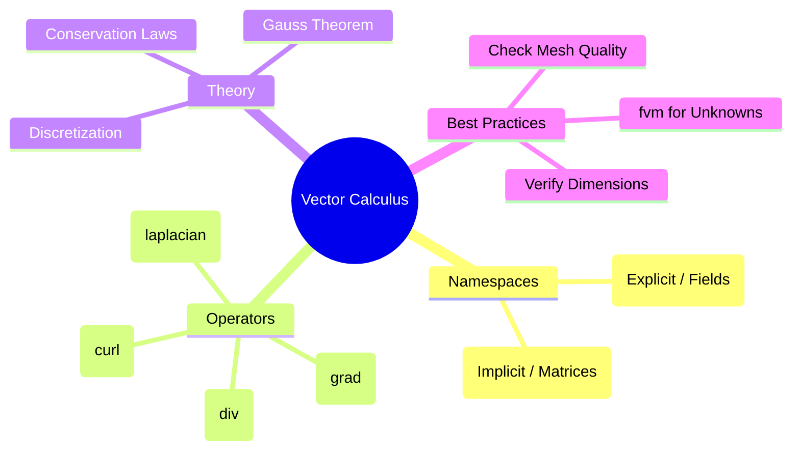

# Summary & Exercises


> **Figure 1:** แผนผังความคิดสรุปองค์ประกอบหลักของแคลคูลัสเวกเตอร์ใน OpenFOAM ซึ่งรวบรวมทั้ง Namespace ตัวดำเนินการ ทฤษฎีพื้นฐาน และแนวทางปฏิบัติที่ดีที่สุดความปลอดภัยทางฟิสิกส์ไม่ส่งผลกระทบต่อความเร็วในการจำลอง ผ่านการใช้พลังของ C++ Template Metaprogramming ในการตรวจสอบความสอดคล้องทางมิติทั้งหมดที่ขั้นตอนการคอมไพล์โปรแกรมเพียงครั้งเดียว

---

## 🎓 Key Takeaways

### 1. Explicit vs Implicit Operations: `fvc::` vs `fvm::`

The fundamental distinction between **explicit** (`fvc::`) and **implicit** (`fvm::`) operations in OpenFOAM represents the core mathematical approaches to solving CFD problems.

#### Explicit Operations (`fvc::` - Finite Volume Calculus)

- **Principle**: Direct computation using current field values
- **Result**: Known quantities that can be evaluated immediately
- **Mathematical form**: `result = known_function(field_values)`
- **Typical usage**: Source term insertion, gradient calculation
- **Performance impact**: Low resource usage per evaluation
- **Stability characteristic**: May impose strict time step limits for transient problems

#### Implicit Operations (`fvm::` - Finite Volume Matrix)

- **Principle**: Creates coefficient matrices for unknown field values
- **Result**: Generates a linear system requiring solution: `A*x = b`
- **Mathematical form**: `matrix_coefficients * unknown_field = rhs`
- **Typical usage**: Diffusion terms, source terms requiring iterative solution
- **Performance impact**: Higher resource usage per time step due to matrix assembly and solution
- **Stability characteristic**: Generally more stable, allows larger time steps

#### Implementation Example

```cpp
// Explicit gradient calculation
volVectorField gradP = fvc::grad(p);  // Uses current field p

// Implicit diffusion term
fvScalarMatrix pEqn = fvm::laplacian(k, p);  // Creates matrix system
pEqn.solve();  // Solves for p
```

### 2. Scheme Dependency in `fvSchemes`

The accuracy and stability of finite volume operations depend on **interpolation schemes** specified in the `system/fvSchemes` dictionary.

#### Interpolation Schemes

| Scheme | Description | Stability |
|--------|-------------|------------|
| `Gauss upwind` | First-order | High stability |
| `Gauss linear` | Second-order | Moderate stability |
| `Gauss limitedLinear 1` | Limited second-order | Moderate stability |

```cpp
divSchemes
{
    div(phi,U)      Gauss upwind;           // First-order, stable
    div(phi,T)      Gauss linear;           // Second-order, less stable
    div(phi,k)      Gauss limitedLinear 1;  // Limited second-order
}
```

#### Gradient Schemes

| Scheme | Description | Accuracy |
|--------|-------------|----------|
| `Gauss linear` | Standard central differencing | Good |
| `leastSquares` | Better for unstructured meshes | Better |

```cpp
gradSchemes
{
    grad(p)         Gauss linear;           // Standard central differencing
    grad(U)         leastSquares;           // More accurate on unstructured meshes
}
```

#### Temporal Schemes

| Scheme | Order | Simplicity | Accuracy |
|--------|-------|------------|----------|
| `Euler` | First | Very simple | Moderate |
| `backward` | Second | Moderate | Good |

```cpp
timeSchemes
{
    ddt(p)          Euler;                  // First-order, simple
    ddt(U)          backward;               // Second-order, more accurate
}
```

**Impact of Scheme Selection:**
- **Spatial accuracy**: Linear (2nd order) vs. upwind (1st order)
- **Numerical diffusion**: Higher-order schemes reduce unphysical diffusion
- **Stability limits**: More accurate schemes often require smaller time steps
- **Computational cost**: Complex schemes increase per-operation cost

### 3. Conservation Through Divergence Operators

Divergence operators in the finite volume method enforce local and global conservation laws automatically through **Gauss's theorem** by converting volume integrals of divergence to surface flux summations:

$$\int_V \nabla \cdot \mathbf{F} \, \mathrm{d}V = \oint_{\partial V} \mathbf{F} \cdot \mathbf{n} \, \mathrm{d}A$$

#### Physical Interpretation

- **Volume integral**: Sources/sinks within control volume
- **Surface integral**: Net flux through control volume boundary
- **Conservation**: What flows out must equal what flows in plus any sources

#### OpenFOAM Implementation

```cpp
// Continuity equation: ∂ρ/∂t + ∇·(ρU) = 0
fvScalarMatrix contEqn
(
    fvm::ddt(rho) + fvc::div(rhoPhi) == 0
);

// Momentum equation: ∂(ρU)/∂t + ∇·(ρUU) = -∇p + ∇·τ + f
fvVectorMatrix UEqn
(
    fvm::ddt(rho, U)
  + fvm::div(rhoPhi, U)
 ==
    -fvc::grad(p)
  + fvc::div(tauR)
  + sources
);
```

### 4. Performance and Stability Considerations

Computational cost and numerical stability of finite volume operations involve fundamental **trade-offs**.

#### Explicit Operation Performance

- **Memory usage**: O(N) for storing interpolated values
- **CPU cost**: O(N) per operation with small constant factors
- **Parallel efficiency**: Excellent scaling due to local nature
- **Stability limit**: $\mathrm{d}t \leq \frac{\Delta x^2}{2D}$ for diffusion

#### Implicit Operation Performance

- **Memory usage**: O(N) for matrix storage (often sparse)
- **CPU cost**: O(N log N) to O(N²) depending on solver choice
- **Parallel efficiency**: More complex due to global matrix solution
- **Stability limit**: Generally much less restrictive on time steps

#### Stability Criteria

```cpp
// Explicit convection stability (CFL condition)
CFL = U * dt / dx < 0.5  // Typical limit for upwind schemes

// Explicit diffusion stability
dt_diffusion <= dx^2 / (2 * D)  // Von Neumann stability

// Implicit schemes have much looser limits
// Often can use dt_max ~ 10x larger than explicit methods
```

### 5. Physical Meaning of Finite Volume Operators

Each finite volume operator corresponds to specific physical processes in fluid dynamics.

#### Gradient Operators (`fvc::grad`, `fvm::grad`)

- **Physical meaning**: Spatial rate of change of a field quantity
- **Applications**: Pressure gradients (forces), temperature gradients (heat flux)
- **Mathematical form**: $\nabla \phi = \frac{\partial \phi}{\partial x}\mathbf{i} + \frac{\partial \phi}{\partial y}\mathbf{j} + \frac{\partial \phi}{\partial z}\mathbf{k}$

#### Divergence Operators (`fvc::div`, `fvm::div`)

- **Physical meaning**: Net flux out of control volume
- **Applications**: Mass flux, momentum flux, energy flux
- **Mathematical form**: $\nabla \cdot \mathbf{F} = \frac{\partial F_x}{\partial x} + \frac{\partial F_y}{\partial y} + \frac{\partial F_z}{\partial z}$

#### Laplacian Operators (`fvc::laplacian`, `fvm::laplacian`)

- **Physical meaning**: Diffusion processes, viscous effects
- **Applications**: Heat conduction, viscous stresses, molecular diffusion
- **Mathematical form**: $\nabla^2 \phi = \nabla \cdot (\nabla \phi) = \frac{\partial^2 \phi}{\partial x^2} + \frac{\partial^2 \phi}{\partial y^2} + \frac{\partial^2 \phi}{\partial z^2}$

#### Temporal Derivatives (`fvc::ddt`, `fvm::ddt`)

- **Physical meaning**: Rate of change with time
- **Applications**: Unsteady effects, transient phenomena
- **Mathematical form**: $\frac{\partial \phi}{\partial t} = \lim_{\Delta t \to 0} \frac{\phi^{t+\Delta t} - \phi^t}{\Delta t}$

#### Physical Process Mapping

```cpp
// Heat conduction: q = -k∇T
volVectorField heatFlux = -k * fvc::grad(T);

// Mass conservation: ∂ρ/∂t + ∇·(ρU) = 0
fvScalar massEqn = fvm::ddt(rho) + fvc::div(rho*U);

// Viscous stress: τ = μ∇²U
fvVectorMatrix viscousTerm = fvm::laplacian(mu, U);

// Advection of scalar: ∂φ/∂t + U·∇φ = 0
fvScalarMatrix advectionEqn = fvm::ddt(phi) + fvm::div(U, phi);
```

---

## Exercises

### Part 1: Namespace Selection

Identify whether `fvc` or `fvm` should be used for the following tasks:

1. Calculate vorticity to save as a result to disk
2. Add a heat conduction term to the temperature equation to find the temperature at the next time step
3. Find the flux rate from the current velocity for use in the Convection term
4. Add a gravity term to the momentum equation

### Part 2: Equation Analysis

Consider the following solver code:

```cpp
fvScalarMatrix TEqn
(
    fvm::ddt(T)
  + fvm::div(phi, T)
  - fvm::laplacian(DT, T)
 ==
    fvc::grad(p) & U // (Term A)
);
```

- **Question**: Why does the LHS use `fvm` throughout, but term (A) on the RHS uses `fvc`?
- **Question**: If `T` has units [K] and `p` has units [Pa], what are the units of term (A)?

### Part 3: Application Scenario

You need to calculate the shear stress vector on cell faces, based on the velocity gradient:

- Which `fvc` function should you start with?
- Which scheme in `fvSchemes` would you choose for maximum accuracy on an unstructured mesh?

---

## 💡 Solution Guide

### Part 1: Solutions

1. **`fvc`** - Requires numerical values for output/storage
2. **`fvm`** - Requires stable solution of the temperature equation
3. **`fvc`** - Uses already-known velocity field
4. **`fvc`** - External forces typically computed explicitly

### Part 2: Solutions

- **LHS vs RHS**: LHS contains the unknown variable ($T$), requiring matrix formation. Term (A) is a source term computed from known values ($p, U$)
- **Units**: Term (A) has units of dot product between pressure gradient and velocity: $[Pa/m] \cdot [m/s] = [kg/(m·s³)]$

### Part 3: Solutions

- **Function**: Use `fvc::grad(U)` to compute velocity gradient tensor
- **Scheme**: `Gauss leastSquares` provides best accuracy on unstructured meshes

---

## 🔧 Best Practices Summary

1. **Use `fvm::`** for diffusion, pressure-velocity coupling, and stiff source terms
2. **Use `fvc::`** for post-processing, source terms from known fields, and explicit time integration
3. **Combine both** for optimal balance: treat stiff terms implicitly, non-stiff terms explicitly
4. **Check mesh quality** before running simulations, especially for higher-order schemes
5. **Verify dimensional consistency** when adding custom terms
6. **Test time step sensitivity** when using explicit operations
7. **Monitor convergence** residuals for implicit solvers
8. **Consider trade-offs** between numerical diffusion and computational cost
