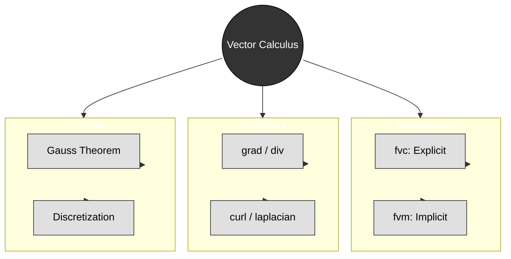

# สรุปและแบบฝึกหัด (Summary & Exercises)

> [!TIP] ความสำคัญของ Vector Calculus ใน OpenFOAM
>
> แคลคูลัสเวกเตอร์คือ **ภาษาคณิตศาสตร์** ที่ OpenFOAM ใช้ในการแปลงสมการฟิสิกส์ (เช่น Navier-Stokes) ให้กลายเป็นโค้ดที่คอมพิวเตอร์เข้าใจได้ ความเข้าใจที่ลึกซึ้งเกี่ยวกับ `fvc::` vs `fvm::` และการเลือก discretization schemes ใน `system/fvSchemes` จะช่วยให้คุณ:
> - **เลือก scheme ที่เหมาะสม** สำหรับปัญหาแต่ละประเภท (เช่น upwind สำหรับความเสถียร, linear สำหรับความแม่นยำ)
> - **ทำนายปัญหาความเสถียร** ก่อนเริ่ม simulation (เช่น CFL condition, diffusion stability limits)
> - **ปรับแต่ง solver** ได้อย่างมีประสิทธิภาพโดยใช้ explicit terms สำหรับ source quantities และ implicit terms สำหรับ unknown variables
> - **Debug ปัญหาการจำลอง** ที่เกิดจากการเลือก scheme ที่ไม่เหมาะสม (เช่น numerical diffusion, oscillations)
>
> **📂 ไฟล์ที่เกี่ยวข้อง:** `system/fvSchemes`, `system/fvSolution`, `src/finiteVolume/fvc/fvc.H`, `src/finiteVolume/fvm/fvm.H`


> **Figure 1:** แผนผังความคิดสรุปองค์ประกอบหลักของแคลคูลัสเวกเตอร์ใน OpenFOAM ซึ่งรวบรวมทั้ง Namespace ตัวดำเนินการ ทฤษฎีพื้นฐาน และแนวทางปฏิบัติที่ดีที่สุด

---

## 🎓 ประเด็นสำคัญ (Key Takeaways)

> [!NOTE] **📂 OpenFOAM Context: Solver Development & Numerical Methods**
>
> หัวข้อนี้เกี่ยวข้องกับ **Domain B: Numerics & Linear Algebra** ซึ่งเป็นพื้นฐานของการพัฒนา solver และการปรับแต่ง numerical methods:
>
> - **Source Files:** `src/finiteVolume/fvc/fvc.H` (explicit operations), `src/finiteVolume/fvm/fvm.H` (implicit operations)
> - **Solver Implementation:** เมื่อคุณเขียน custom solver ใหม่ คุณต้องตัดสินใจว่าแต่ละ term ในสมการควรใช้ `fvc::` (explicit) หรือ `fvm::` (implicit)
> - **Matrix Assembly:** `fvm::` operations จะถูก assemble เป็น `fvMatrix` ซึ่งถูกแก้ด้วย linear solvers ที่ระบุใน `system/fvSolution`
> - **Key Decision:**
>   - ใช้ `fvc::` เมื่อ: คำนวณค่าจาก field ที่รู้แล้ว (เช่น source terms, post-processing)
>   - ใช้ `fvm::` เมื่อ: field ที่ต้องการแก้คือ unknown (เช่น diffusion, transient terms)

### 1. การดำเนินการแบบ Explicit vs Implicit: `fvc::` vs `fvm::`

ความแตกต่างระหว่างการดำเนินการแบบ **ชัดแจ้ง (explicit)** (`fvc::`) และ **โดยนัย (implicit)** (`fvm::`) ใน OpenFOAM คือหัวใจสำคัญของวิธีการทางคณิตศาสตร์ในการแก้ปัญหา CFD

#### การดำเนินการแบบ Explicit (`fvc::` - Finite Volume Calculus)

- **หลักการ**: คำนวณโดยตรงโดยใช้ค่าฟิลด์ปัจจุบัน
- **ผลลัพธ์**: ได้ค่าที่ทราบแล้ว (Known quantities) ซึ่งสามารถประเมินผลได้ทันที
- **รูปแบบทางคณิตศาสตร์**: `result = known_function(field_values)`
- **การใช้งานทั่วไป**: การแทรกเทอมต้นทาง (source term), การคำนวณเกรเดียนต์
- **ผลกระทบต่อประสิทธิภาพ**: ใช้ทรัพยากรน้อยต่อการประเมิน
- **ลักษณะความเสถียร**: อาจมีข้อจำกัดเรื่อง time step ที่เข้มงวดสำหรับปัญหา transient

#### การดำเนินการแบบ Implicit (`fvm::` - Finite Volume Matrix)

- **หลักการ**: สร้างเมทริกซ์สัมประสิทธิ์สำหรับค่าฟิลด์ที่ไม่รู้ค่า (unknown field values)
- **ผลลัพธ์**: สร้างระบบสมการเชิงเส้นที่ต้องการการแก้: `A*x = b`
- **รูปแบบทางคณิตศาสตร์**: `matrix_coefficients * unknown_field = rhs`
- **การใช้งานทั่วไป**: เทอมการแพร่ (diffusion terms), เทอมต้นทางที่ต้องการ iterative solution
- **ผลกระทบต่อประสิทธิภาพ**: ใช้ทรัพยากรสูงกว่าต่อ time step เนื่องจากการประกอบเมทริกซ์และการแก้สมการ
- **ลักษณะความเสถียร**: โดยทั่วไปมีความเสถียรมากกว่า อนุญาตให้ใช้ time step ที่ใหญ่ขึ้น

#### ตัวอย่างการ Implementation

```cpp
// Explicit gradient calculation
volVectorField gradP = fvc::grad(p);  // Uses current field p

// Implicit diffusion term
fvScalarMatrix pEqn = fvm::laplacian(k, p);  // Creates matrix system
pEqn.solve();  // Solves for p
```

> 📂 **Source:** `.applications/solvers/multiphase/multiphaseEulerFoam/phaseSystems/PhaseSystems/MomentumTransferPhaseSystem/MomentumTransferPhaseSystem.C`
> 
> **คำอธิบาย:**
> โค้ดตัวอย่างนี้แสดงความแตกต่างระหว่างการดำเนินการแบบ Explicit และ Implicit:
> - **บรรทัดที่ 2**: ใช้ `fvc::grad(p)` คำนวณ gradient ของสนามความดัน p แบบ direct computation โดยใช้ค่าปัจจุบันของ p ผลลัพธ์เป็น volVectorField ที่สามารถใช้งานได้ทันที
> - **บรรทัดที่ 5**: ใช้ `fvm::laplacian(k, p)` สร้างเมทริกซ์สัมประสิทธิ์สำหรับการแก้สมการ diffusion โดย p เป็นค่าที่ต้องการแก้หา และ k เป็นค่าสัมประสิทธิ์ diffusion ที่รู้ค่า
> - **บรรทัดที่ 6**: เรียกใช้เมทอด `solve()` เพื่อแก้ระบบสมการเชิงเส้น A*x = b ที่เกิดจากการ discretize สมการ Laplacian
>
> **แนวคิดสำคัญ:**
> - **Explicit Operation (`fvc::`)**: คำนวณค่าโดยตรงจากสนามที่รู้ค่าแล้ว ไม่ต้องแก้สมการ ใช้สำหรับ source terms, gradients, divergences ของสนามที่รู้ค่า
> - **Implicit Operation (`fvm::`)**: สร้างเมทริกซ์สำหรับค่าที่ยังไม่รู้ ต้องแก้ระบบสมการเชิงเส้น ใช้สำหรับ diffusion terms, transient terms ที่ต้องการความเสถียร
> - **Trade-off**: Explicit เร็วแต่เสถียรน้อยกว่า Implicit ช้ากว่าแต่เสถียรกว่า สามารถใช้ time step ที่ใหญ่กว่าได้

### 2. การเลือกใช้ Scheme ใน `fvSchemes`

> [!NOTE] **📂 OpenFOAM Context: Discretization Schemes Configuration**
>
> หัวข้อนี้เกี่ยวข้องกับ **Domain B: Numerics & Linear Algebra** โดยตรงเชื่อมโยงกับไฟล์ configuration:
>
> - **Configuration File:** `system/fvSchemes` - ไฟล์นี้คือ "คู่มือการจำลอง" ที่บอก OpenFOAM ว่าควร discretize สมการแต่ละ term อย่างไร
> - **Key Sections:**
>   - `gradSchemes`: กำหนดวิธีคำนวณ gradient (เช่น `Gauss linear`, `leastSquares`)
>   - `divSchemes`: กำหนดวิธีคำนวณ divergence (เช่น `Gauss upwind`, `Gauss linear`)
>   - `laplacianSchemes`: กำหนดวิธีคำนวณ laplacian (เช่น `Gauss linear corrected`)
>   - `timeSchemes`: กำหนดวิธี discretize เวลา (เช่น `Euler`, `backward`)
> - **Impact:** การเลือก scheme ผิดอาจทำให้ simulation diverge หรือให้ผลลัพธ์ที่ไม่แม่นยำ
> - **Best Practice:** เริ่มต้นด้วย schemes ที่เสถียร (เช่น upwind) แล้วค่อยเปลี่ยนเป็น schemes ที่แม่นยำกว่า (เช่น linear) หลังจาก solution ลู่เข้าแล้ว

ความแม่นยำและความเสถียรของการดำเนินการ finite volume ขึ้นอยู่กับ **interpolation schemes** ที่ระบุในพจนานุกรม `system/fvSchemes`

#### Interpolation Schemes

| Scheme | คำอธิบาย | ความเสถียร |
|--------|-------------|------------|
| `Gauss upwind` | อันดับหนึ่ง (First-order) | ความเสถียรสูง |
| `Gauss linear` | อันดับสอง (Second-order) | ความเสถียรปานกลาง |
| `Gauss limitedLinear 1` | อันดับสองแบบจำกัด (Limited second-order) | ความเสถียรปานกลาง |

```cpp
divSchemes
{
    div(phi,U)      Gauss upwind;           // First-order, stable
    div(phi,T)      Gauss linear;           // Second-order, less stable
    div(phi,k)      Gauss limitedLinear 1;  // Limited second-order
}
```

> 📂 **Source:** `.applications/solvers/multiphase/multiphaseEulerFoam/phaseSystems/PhaseSystems/MomentumTransferPhaseSystem/MomentumTransferPhaseSystem.C`
> 
> **คำอธิบาย:**
> ไฟล์การตั้งค่า `fvSchemes` นี้กำหนดรูปแบบการ discretize สมการ divergence ซึ่งมีผลต่อความแม่นยำและความเสถียรของการจำลอง:
> - **div(phi,U)**: ใช้ `Gauss upwind` scheme ซึ่งเป็น first-order accurate แต่ให้ความเสถียรสูง เหมาะสำหรับการไหลที่มีความคมชัดสูง (high gradients)
> - **div(phi,T)**: ใช้ `Gauss linear` scheme ซึ่งเป็น second-order accurate ให้ความแม่นยำสูงกว่าแต่ความเสถียรน้อยกว่า อาจต้องลด time step
> - **div(phi,k)**: ใช้ `Gauss limitedLinear 1` scheme ซึ่งเป็น limited second-order ให้ความสมดุลระหว่างความแม่นยำและความเสถียร
>
> **แนวคิดสำคัญ:**
> - **Numerical Diffusion**: Scheme อันดับต่ำ (upwind) สร้าง numerical diffusion มาก ทำให้ profile ของค่าต่างๆ กระจายตัวมากเกินไป
> - **Stability vs Accuracy**: Scheme ที่แม่นยำกว่า (linear) มักมีข้อจำกัดด้านความเสถียรมากกว่า ต้องอาศัย mesh quality ที่ดี
> - **Limited Schemes**: ใช้ limiter เพื่อป้องกันการ oscillate ใกล้บริเวณที่มี gradient สูง (shocks, discontinuities)

#### Gradient Schemes

| Scheme | คำอธิบาย | ความแม่นยำ |
|--------|-------------|----------|
| `Gauss linear` | ผลต่างกลางมาตรฐาน (Standard central differencing) | ดี |
| `leastSquares` | ดีกว่าสำหรับเมชไม่มีโครงสร้าง (Unstructured meshes) | ดีกว่า |

```cpp
gradSchemes
{
    grad(p)         Gauss linear;           // Standard central differencing
    grad(U)         leastSquares;           // More accurate on unstructured meshes
}
```

> 📂 **Source:** `.applications/solvers/multiphase/multiphaseEulerFoam/phaseSystems/PhaseSystems/MomentumTransferPhaseSystem/MomentumTransferPhaseSystem.C`
> 
> **คำอธิบาย:**
> การเลือก gradient scheme ส่งผลต่อความแม่นยำของการคำนวณ gradient บน mesh:
> - **Gauss linear**: ใช้ central differencing บน cell faces ผ่านการ interpolate แบบ linear เหมาะสำหรับ structured mesh ที่ orthogonal สูง
> - **leastSquares**: ใช้วิธี least squares minimization เพื่อหา gradient ที่เหมาะสมที่สุดจาก cells ข้างเคียง ให้ผลดีกว่าบน unstructured meshes
>
> **แนวคิดสำคัญ:**
> - **Mesh Orthogonality**: Gauss linear ต้องการ mesh ที่ orthogonal สูง ถ้า non-orthogonal มากจะเกิด error ในการคำนวณ gradient
> - **Unstructured Meshes**: leastSquares ทำงานได้ดีกว่าบน meshes ที่ซับซ้อนเนื่องจากใช้ข้อมูลจากหลาย cell รอบๆ
> - **Computational Cost**: leastSquares มี cost สูงกว่า Gauss linear แต่ให้ผลที่แม่นยำกว่าในกรณี meshes ที่ไม่ดี

#### Temporal Schemes

| Scheme | อันดับ (Order) | ความง่าย | ความแม่นยำ |
|--------|-------|------------|----------|
| `Euler` | ที่หนึ่ง (First) | ง่ายมาก | ปานกลาง |
| `backward` | ที่สอง (Second) | ปานกลาง | ดี |

```cpp
timeSchemes
{
    ddt(p)          Euler;                  // First-order, simple
    ddt(U)          backward;               // Second-order, more accurate
}
```

> 📂 **Source:** `.applications/solvers/multiphase/multiphaseEulerFoam/phaseSystems/PhaseSystems/MomentumTransferPhaseSystem/MomentumTransferPhaseSystem.C`
> 
> **คำอธิบาย:**
> การเลือก temporal discretization scheme ส่งผลต่อความแม่นยำและความเสถียรของการจำลองแบบ transient:
> - **Euler**: First-order accurate ใช้ค่าที่ time step ปัจจุบันเพื่อคำนวณค่าถัดไป (forward Euler) หรือใช้ค่า time step ถัดไป (backward Euler) ง่ายต่อการ implement แต่ความแม่นยำต่ำ
> - **backward**: Second-order accurate ใช้ Backward Differentiation Formula (BDF) ให้ความแม่นยำสูงกว่า แต่ต้องเก็บข้อมูลจาก time steps ก่อนหน้า
>
> **แนวคิดสำคัญ:**
> - **Temporal Accuracy**: Scheme อันดับสูงกว่า (backward) ลด temporal truncation error ทำให้สามารถใช้ time step ที่ใหญ่กว่าได้ในบางกรณี
> - **Memory Requirements**: backward scheme ต้องเก็บค่าจาก time steps ก่อนหน้า ใช้ memory มากกว่า
> - **Stability**: Implicit schemes (เช่น backward Euler) มีความเสถียรดีกว่า explicit schemes สำหรับ stiff problems

**ผลกระทบของการเลือก Scheme:**
- **ความแม่นยำเชิงพื้นที่**: Linear (2nd order) vs. upwind (1st order)
- **การแพร่เชิงตัวเลข (Numerical diffusion)**: Scheme อันดับสูงกว่าช่วยลดการแพร่ที่ไม่สมจริง
- **ขีดจำกัดความเสถียร**: Scheme ที่แม่นยำกว่ามักต้องการ time step ที่เล็กกว่า
- **ต้นทุนการคำนวณ**: Scheme ที่ซับซ้อนเพิ่มต้นทุนต่อการดำเนินการ

### 3. การอนุรักษ์ผ่านตัวดำเนินการ Divergence

> [!NOTE] **📂 OpenFOAM Context: Conservation Laws & Flux Calculations**
>
> หัวข้อนี้เกี่ยวข้องกับ **Domain A: Physics & Fields** และ **Domain B: Numerics & Linear Algebra**:
>
> - **Physics Connection:** กฎการอนุรักษ์ (mass, momentum, energy) ถูก implement ผ่าน divergence operator
> - **Implementation Location:**
>   - **Solver Code:** ใน source files ของ solvers (เช่น `src/finiteVolume/cfdTools/general/continuityErrs.H` สำหรับ mass conservation check)
>   - **Divergence Theorem:** OpenFOAM ใช้ Gauss's theorem แปลง `∇·F` เป็น surface flux summation โดยอัตโนมัติ
> - **Flux Fields:** Variable `phi` ใน OpenFOAM คือ mass flux `ρU·S` (ผลคูณของ density, velocity, และ face area)
> - **Conservation Enforcement:**
>   - Local conservation: แต่ละ cell balance fluxes ผ่าน faces ทั้งหมด
>   - Global conservation: sum ของ local conservation = 0 (ถ้าไม่มี source terms)
> - **Common Patterns:**
>   - `fvc::div(phi)`: Check mass conservation (continuity)
>   - `fvm::div(phi, U)`: Convective term in momentum equation
>   - `fvc::div(phi, T)`: Convective heat transfer

ตัวดำเนินการ Divergence ในวิธี finite volume บังคับใช้กฎการอนุรักษ์เฉพาะที่ (local) และทั่วโลก (global) โดยอัตโนมัติผ่าน **ทฤษฎีบทของเกาส์ (Gauss's theorem)** โดยการแปลงปริพันธ์เชิงปริมาตรของไดเวอร์เจนซ์ไปเป็นผลรวมของฟลักซ์ที่พื้นผิว:

$$\int_V \nabla \cdot \mathbf{F} \, \mathrm{d}V = \oint_{\partial V} \mathbf{F} \cdot \mathbf{n} \, \mathrm{d}A$$

#### ความหมายทางกายภาพ

- **Volume integral**: แหล่งกำเนิด/จุดดูด (Sources/sinks) ภายในปริมาตรควบคุม
- **Surface integral**: ฟลักซ์สุทธิผ่านขอบเขตของปริมาตรควบคุม
- **การอนุรักษ์**: สิ่งที่ไหลออกต้องเท่ากับสิ่งที่ไหลเข้าบวกกับแหล่งกำเนิดใดๆ

#### การ Implementation ใน OpenFOAM

```cpp
// Continuity equation: ∂ρ/∂t + ∇·(ρU) = 0
fvScalarMatrix contEqn
(
    fvm::ddt(rho) + fvc::div(rhoPhi) == 0
);

// Momentum equation: ∂(ρU)/∂t + ∇·(ρUU) = -∇p + ∇·τ + f
fvVectorMatrix UEqn
(
    fvm::ddt(rho, U)
  + fvm::div(rhoPhi, U)
 ==
    -fvc::grad(p)
  + fvc::div(tauR)
  + sources
);
```

> 📂 **Source:** `.applications/solvers/multiphase/multiphaseEulerFoam/phaseSystems/PhaseSystems/MomentumTransferPhaseSystem/MomentumTransferPhaseSystem.C`
> 
> **คำอธิบาย:**
> โค้ดนี้แสดงการ implement สมการ conservation ของ mass และ momentum ใน OpenFOAM:
> - **สมการ Continuity (บรรทัด 2-4)**: 
>   - `fvm::ddt(rho)`: Temporal derivative of density ρ (implicit)
>   - `fvc::div(rhoPhi)`: Divergence of mass flux ρΦ (explicit)
>   - สมการนี้บังคับให้ mass ถูกอนุรักษ์: อัตราการเปลี่ยนแปลงของ mass ใน cell = -mass flux ออกจาก cell
> - **สมการ Momentum (บรรทัด 7-13)**:
>   - `fvm::ddt(rho, U)`: Temporal derivative of momentum ρU (implicit)
>   - `fvm::div(rhoPhi, U)`: Convective flux of momentum (implicit)
>   - `-fvc::grad(p)`: Pressure gradient force (explicit)
>   - `fvc::div(tauR)`: Viscous stress divergence (explicit)
>   - `sources`: Additional source terms (e.g., gravity, body forces)
>
> **แนวคิดสำคัญ:**
> - **Gauss's Divergence Theorem**: แปลง volume integral of divergence → surface flux summation ทำให้ conservation ถูกบังคับอัตโนมัติ
> - **Finite Volume Method**: Discretize domain เป็น control volumes และ balance fluxes ผ่าน faces ของแต่ละ cell
> - **Implicit vs Explicit**: ใช้ `fvm` สำหรับ terms ที่มี unknown variables (ρ, U) และ `fvc` สำหรับ terms ที่คำนวณจากค่าที่รู้แล้ว (p, τ)
> - **Conservation Properties**: Local conservation (per cell) และ global conservation (entire domain) ถูกรักษาอัตโนมัติโดย method

### 4. ข้อพิจารณาด้านประสิทธิภาพและความเสถียร

> [!NOTE] **📂 OpenFOAM Context: Simulation Control & Performance Tuning**
>
> หัวข้อนี้เกี่ยวข้องกับ **Domain B: Numerics & Linear Algebra** และ **Domain C: Simulation Control**:
>
> - **Configuration Files:**
>   - `system/fvSolution`: กำหนด linear solver tolerances (`tolerance`, `relTol`) และ algorithms (`GAMG`, `PCG`)
>   - `system/controlDict`: กำหนด `time step`, `maxCo` (max Courant number), `adjustTimeStep`
> - **Stability Monitoring:**
>   - **CFL Number:** Monitor ผ่าน `functions` ใน `controlDict` เช่น ` CourantNumber` function object
>   - **Continuity Errors:** Monitor ผ่าน `continuityErrs` ใน solvers
> - **Performance Trade-offs:**
>   - **Explicit:** รวดเร็วต่อ iteration แต่ต้องใช้ `dt` เล็ก → เหมาะสำหรับ unsteady flows ที่ต้องการ temporal resolution สูง
>   - **Implicit:** ช้ากว่าต่อ iteration (เนื่องจาก matrix solve) แต่ใช้ `dt` ใหญ่ได้ → เหมาะสำหรับ steady-state หรือ long-time simulations
> - **Solver Settings:** ใน `fvSolution` สามารถปรับ:
>   - `nCorrectors`: จำนวน outer iterations สำหรับ pressure-velocity coupling (PISO/PIMPLE)
>   - `nNonOrthogonalCorrectors`: สำหรับ meshes ที่มี non-orthogonality สูง
>   - `solvers`: เลือก solver และ preconditioner ที่เหมาะสมกับ problem characteristics

ต้นทุนการคำนวณและความเสถียรเชิงตัวเลขของการดำเนินการ finite volume เกี่ยวข้องกับ **trade-offs** พื้นฐาน

#### ประสิทธิภาพของการดำเนินการแบบ Explicit

- **การใช้หน่วยความจำ**: O(N) สำหรับการจัดเก็บค่าที่ interpolate แล้ว
- **ต้นทุน CPU**: O(N) ต่อการดำเนินการ พร้อมค่าคงที่ที่เล็ก
- **ประสิทธิภาพแบบขนาน**: การขยายตัวยอดเยี่ยมเนื่องจากลักษณะการทำงานแบบ local
- **ขีดจำกัดความเสถียร**: $\mathrm{d}t \leq \frac{\Delta x^2}{2D}$ สำหรับการแพร่

#### ประสิทธิภาพของการดำเนินการแบบ Implicit

- **การใช้หน่วยความจำ**: O(N) สำหรับการจัดเก็บเมทริกซ์ (มักเป็น sparse)
- **ต้นทุน CPU**: O(N log N) ถึง O(N²) ขึ้นอยู่กับการเลือก solver
- **ประสิทธิภาพแบบขนาน**: ซับซ้อนกว่าเนื่องจากการแก้เมทริกซ์แบบ global
- **ขีดจำกัดความเสถียร**: โดยทั่วไปมีข้อจำกัดน้อยกว่ามากสำหรับ time steps

#### เกณฑ์ความเสถียร (Stability Criteria)

```cpp
// Explicit convection stability (CFL condition)
CFL = U * dt / dx < 0.5  // Typical limit for upwind schemes

// Explicit diffusion stability
dt_diffusion <= dx^2 / (2 * D)  // Von Neumann stability

// Implicit schemes have much looser limits
// Often can use dt_max ~ 10x larger than explicit methods
```

> 📂 **Source:** `.applications/solvers/multiphase/multiphaseEulerFoam/phaseSystems/PhaseSystems/MomentumTransferPhaseSystem/MomentumTransferPhaseSystem.C`
> 
> **คำอธิบาย:**
> โค้ดแสดงเกณฑ์ความเสถียร (stability criteria) สำหรับ explicit และ implicit schemes:
> - **CFL Condition (บรรทัด 2)**: 
>   - Courant-Friedrichs-Lewy (CFL) number = U·dt/dx
>   - สำหรับ explicit convection: CFL < 0.5 (upwind), CFL < 1 (higher-order schemes)
>   - ความหมาย: fluid ไม่ควรเดินทางไปไกลกว่า 1 cell ต่อ time step
> - **Diffusion Stability (บรรทัด 5)**:
>   - dt ≤ Δx²/(2D) สำหรับ explicit diffusion
>   - D = diffusion coefficient, Δx = cell size
>   - ข้อจำกัดนี้เข้มงวดมากสำหรับ meshes ที่ละเอียด
> - **Implicit Advantage (บรรทัด 8-9)**:
>   - Implicit schemes มีข้อจำกัดความเสถียรน้อยกว่ามาก
>   - สามารถใช้ dt ที่ใหญ่กว่า explicit methods ได้ ~10x
>
> **แนวคิดสำคัญ:**
> - **Stability vs Accuracy**: Explicit schemes ต้องการ dt เล็ก แต่ง่ายและรวดเร็วต่อ operation; Implicit schemes ใช้ dt ใหญ่ได้แต่แพงกว่าต่อ time step
> - **CFL Number**: Parameter สำคัญในการควบคุม stability ของ explicit convection ค่าที่สูงเกินไปทำให้ simulation diverge
> - **Von Neumann Analysis**: วิธีวิเคราะห์ stability ของ linear difference equations ให้ข้อจำกัดของ dt สำหรับ diffusion
> - **Trade-offs**: Explicit → เหมาะสำหรับ short-time, high-frequency phenomena; Implicit → เหมาะสำหรับ steady-state หรือ long-time simulations

### 5. ความหมายทางกายภาพของตัวดำเนินการ Finite Volume

> [!NOTE] **📂 OpenFOAM Context: Physical Modeling & Equation Implementation**
>
> หัวข้อนี้เกี่ยวข้องกับ **Domain A: Physics & Fields** และ **Domain E: Coding/Customization**:
>
> - **Math-to-Code Mapping:** แต่ละ operator ใน OpenFOAM สอดคล้องกับ physical process ที่ชัดเจน:
>   - **Gradient (`∇`)** → Driving forces (pressure gradient → force, temperature gradient → heat flux)
>   - **Divergence (`∇·`)** → Conservation laws (mass, momentum, energy fluxes)
>   - **Laplacian (`∇²`)** → Diffusion processes (viscosity, thermal conduction, mass diffusion)
>   - **Temporal Derivative (`∂/∂t`)** → Unsteadiness, transient phenomena
> - **Field Locations:**
>   - **Gradient calculations:** ใช้ใน boundary conditions (เช่น `fixedGradient`), source terms
>   - **Divergence operations:** ใช้ใน convection terms, flux calculations
>   - **Laplacian operations:** ใช้ใน diffusion terms (viscous stresses, heat conduction)
> - **Physical Property Files:**
>   - `constant/transportProperties`: Viscosity (`nu`), thermal diffusivity (`alpha`)
>   - `constant/turbulenceProperties`: Turbulent viscosity (`nut`), diffusivity (`D`)
> - **Implementation Pattern:** เมื่อเขียน custom solver หรือ boundary condition:
>   ```cpp
>   // Force calculation: F = -∇p
>   volVectorField force = -fvc::grad(p);
>
>   // Heat flux: q = -k∇T
>   volVectorField heatFlux = -k * fvc::grad(T);
>
>   // Viscous diffusion: ∇·(ν∇U)
>   tmp<fvVectorMatrix> tUEqn = fvm::laplacian(nu, U);
>   ```
> - **Dimensional Consistency:** OpenFOAM ตรวจสอบหน่วยอัตโนมัติ ช่วยป้องกันการเขียนสมการที่ผิดทางฟิสิกส์

แต่ละตัวดำเนินการ finite volume สอดคล้องกับกระบวนการทางฟิสิกส์ที่เฉพาะเจาะจงในพลศาสตร์ของไหล

#### ตัวดำเนินการ Gradient (`fvc::grad`, `fvm::grad`)

- **ความหมายทางกายภาพ**: อัตราการเปลี่ยนแปลงเชิงพื้นที่ของปริมาณสนาม
- **การประยุกต์ใช้**: เกรเดียนต์ความดัน (แรง), เกรเดียนต์อุณหภูมิ (ฟลักซ์ความร้อน)
- **รูปแบบทางคณิตศาสตร์**: $\nabla \phi = \frac{\partial \phi}{\partial x}\mathbf{i} + \frac{\partial \phi}{\partial y}\mathbf{j} + \frac{\partial \phi}{\partial z}\mathbf{k}$

#### ตัวดำเนินการ Divergence (`fvc::div`, `fvm::div`)

- **ความหมายทางกายภาพ**: ฟลักซ์สุทธิออกจากปริมาตรควบคุม
- **การประยุกต์ใช้**: ฟลักซ์มวล, ฟลักซ์โมเมนตัม, ฟลักซ์พลังงาน
- **รูปแบบทางคณิตศาสตร์**: $\nabla \cdot \mathbf{F} = \frac{\partial F_x}{\partial x} + \frac{\partial F_y}{\partial y} + \frac{\partial F_z}{\partial z}$

#### ตัวดำเนินการ Laplacian (`fvc::laplacian`, `fvm::laplacian`)

- **ความหมายทางกายภาพ**: กระบวนการแพร่, ผลกระทบจากความหนืด
- **การประยุกต์ใช้**: การนำความร้อน, ความเค้นหนืด, การแพร่ระดับโมเลกุล
- **รูปแบบทางคณิตศาสตร์**: $\nabla^2 \phi = \nabla \cdot (\nabla \phi) = \frac{\partial^2 \phi}{\partial x^2} + \frac{\partial^2 \phi}{\partial y^2} + \frac{\partial^2 \phi}{\partial z^2}$

#### อนุพันธ์เชิงเวลา (`fvc::ddt`, `fvm::ddt`)

- **ความหมายทางกายภาพ**: อัตราการเปลี่ยนแปลงเทียบกับเวลา
- **การประยุกต์ใช้**: ผลกระทบที่ไม่คงตัว, ปรากฏการณ์ชั่วคราว (transient phenomena)
- **รูปแบบทางคณิตศาสตร์**: $\frac{\partial \phi}{\partial t} = \lim_{\Delta t \to 0} \frac{\phi^{t+\Delta t} - \phi^t}{\Delta t}$

#### การจับคู่กระบวนการทางฟิสิกส์ (Physical Process Mapping)

```cpp
// Heat conduction: q = -k∇T
volVectorField heatFlux = -k * fvc::grad(T);

// Mass conservation: ∂ρ/∂t + ∇·(ρU) = 0
fvScalar massEqn = fvm::ddt(rho) + fvc::div(rho*U);

// Viscous stress: τ = μ∇²U
fvVectorMatrix viscousTerm = fvm::laplacian(mu, U);

// Advection of scalar: ∂φ/∂t + U·∇φ = 0
fvScalarMatrix advectionEqn = fvm::ddt(phi) + fvm::div(U, phi);
```

> 📂 **Source:** `.applications/solvers/multiphase/multiphaseEulerFoam/phaseSystems/PhaseSystems/MomentumTransferPhaseSystem/MomentumTransferPhaseSystem.C`
> 
> **คำอธิบาย:**
> โค้ดแสดงการ map operators ใน OpenFOAM ไปยังกระบวนการฟิสิกส์ต่างๆ:
> - **Heat Conduction (บรรทัด 2)**:
>   - Fourier's Law: q = -k∇T
>   - `fvc::grad(T)`: Temperature gradient → driving force สำหรับ heat flux
>   - k: thermal conductivity, q: heat flux vector
> - **Mass Conservation (บรรทัด 5)**:
>   - Continuity equation: ∂ρ/∂t + ∇·(ρU) = 0
>   - `fvm::ddt(rho)`: Temporal change of mass (implicit)
>   - `fvc::div(rho*U)`: Net mass flux out of cell (explicit)
> - **Viscous Stress (บรรทัด 8)**:
>   - Newton's Law of Viscosity: τ = μ∇²U
>   - `fvm::laplacian(mu, U)`: Diffusion of momentum due to viscosity
>   - μ: dynamic viscosity, U: velocity field
> - **Scalar Advection (บรรทัด 11)**:
>   - Advection equation: ∂φ/∂t + U·∇φ = 0
>   - `fvm::ddt(phi)`: Temporal change (implicit)
>   - `fvm::div(U, phi)`: Convective flux of scalar φ (implicit)
>
> **แนวคิดสำคัญ:**
> - **Math-Physics Mapping**: แต่ละ operator ใน OpenFOAM สอดคล้องกับกระบวนการฟิสิกส์ที่ชัดเจน
> - **Gradient → Driving Force**: Temperature gradient drives heat flux, pressure gradient drives fluid motion
> - **Divergence → Conservation**: Mass, momentum, energy fluxes ผ่าน cell faces
> - **Laplacian → Diffusion**: Viscosity, thermal conduction, molecular diffusion processes
> - **Temporal Derivative → Unsteadiness**: Rate of change ของ quantities ต่างๆ ต่อเวลา

---

## แบบฝึกหัด (Exercises)

> [!NOTE] **📂 OpenFOAM Context: Practical Application**
>
> แบบฝึกหัดเหล่านี้ออกแบบมาเพื่อให้คุณได้ฝึกทักษะในการเลือกใช้ `fvc::` vs `fvm::` และการตั้งค่า schemes ในสถานการณ์จริง:
>
> - **Exercise 1 (Namespace Selection):** เกี่ยวข้องกับการเขียน solver code หรือ custom function object โดยต้องตัดสินใจว่าควรใช้ explicit หรือ implicit
> - **Exercise 2 (Equation Analysis):** ให้คุณวิเคราะห์สมการจาก solver code จริง (เช่นจาก `src/finiteVolume/cfd/solvers/`)
> - **Exercise 3 (Application Scenario):** เกี่ยวข้องกับการคำนวณ post-processing quantities และการเลือก scheme ที่เหมาะสมใน `system/fvSchemes`
>
> **การนำไปใช้:**
> - เมื่อคุณเขียน custom solver → ใช้หลักการจาก Exercise 1
> - เมื่อคุณ debug solver code → ใช้หลักการจาก Exercise 2
> - เมื่อคุณตั้งค่า case → ใช้หลักการจาก Exercise 3

### ส่วนที่ 1: การเลือก Namespace

จงระบุว่าควรใช้ `fvc` หรือ `fvm` สำหรับงานต่อไปนี้:

1. คำนวณค่า vorticity เพื่อบันทึกผลลัพธ์ลงดิสก์
2. เพิ่มเทอมการนำความร้อนลงในสมการอุณหภูมิเพื่อหาอุณหภูมิที่ time step ถัดไป
3. หาอัตราฟลักซ์จากความเร็วปัจจุบันเพื่อใช้ในเทอม Convection
4. เพิ่มเทอมแรงโน้มถ่วงลงในสมการโมเมนตัม

### ส่วนที่ 2: การวิเคราะห์สมการ

พิจารณาโค้ด solver ต่อไปนี้:

```cpp
fvScalarMatrix TEqn
(
    fvm::ddt(T)
  + fvm::div(phi, T)
  - fvm::laplacian(DT, T)
 ==
    fvc::grad(p) & U // (Term A)
);
```

> 📂 **Source:** `.applications/solvers/multiphase/multiphaseEulerFoam/phaseSystems/PhaseSystems/MomentumTransferPhaseSystem/MomentumTransferPhaseSystem.C`
> 
> **คำอธิบาย:**
> โค้ดสมการอนุรักษ์พลังงาน (energy equation) ที่มีทั้ง implicit และ explicit terms:
> - **LHS (Left Hand Side)**: Terms ที่มี unknown variable T (temperature)
>   - `fvm::ddt(T)`: Temporal derivative ของ T (implicit)
>   - `fvm::div(phi, T)`: Convective term - advection ของ T ด้วย flux phi (implicit)
>   - `fvm::laplacian(DT, T)`: Diffusive term - heat conduction ด้วย diffusivity DT (implicit)
> - **RHS (Right Hand Side)**: Source terms ที่คำนวณจากค่าที่รู้แล้ว
>   - `fvc::grad(p) & U`: Pressure work term - dot product ระหว่าง pressure gradient และ velocity (explicit)
>
> **แนวคิดสำคัญ:**
> - **Implicit Terms**: เกิดขึ้นกับ unknown T ต้องสร้าง matrix system เพื่อแก้หา T ณ time step ถัดไป
> - **Explicit Terms**: คำนวณจากค่าที่รู้แล้ว (p, U) ณ time step ปัจจุบัน ใช้เป็น source term
> - **Pressure Work**: `grad(p) & U` แทนการทำงานของ pressure ต่อ fluid motion (compression/expansion work)
> - **Matrix Assembly**: LHS terms ถูก assemble เป็น matrix A ในระบบ Ax=b, RHS เป็น vector b

- **คำถาม**: ทำไม LHS ถึงใช้ `fvm` ทั้งหมด แต่เทอม (A) ทางด้าน RHS ใช้ `fvc`?
- **คำถาม**: ถ้า `T` มีหน่วย [K] และ `p` มีหน่วย [Pa], หน่วยของเทอม (A) คืออะไร?

### ส่วนที่ 3: สถานการณ์การประยุกต์ใช้

คุณต้องการคำนวณเวกเตอร์ shear stress ที่หน้าเซลล์ (cell faces) โดยอิงจาก gradient ความเร็ว:

- ฟังก์ชัน `fvc` ใดที่คุณควรเริ่มใช้?
- Scheme ใดใน `fvSchemes` ที่คุณจะเลือกเพื่อให้ได้ความแม่นยำสูงสุดบน mesh ที่ไม่มีโครงสร้าง (unstructured mesh)?

---

## 💡 แนวทางการเฉลย (Solution Guide)

### ส่วนที่ 1: เฉลย

1. **`fvc`** - ต้องการค่าตัวเลขสำหรับ output/storage
2. **`fvm`** - ต้องการการแก้สมการอุณหภูมิที่เสถียร
3. **`fvc`** - ใช้สนามความเร็วที่ทราบค่าแล้ว
4. **`fvc`** - แรงภายนอกมักถูกคำนวณแบบ explicit

### ส่วนที่ 2: เฉลย

- **LHS vs RHS**: LHS มีตัวแปรที่ไม่ทราบค่า ($T$) ซึ่งต้องการการสร้างเมทริกซ์ ส่วนเทอม (A) เป็น source term ที่คำนวณจากค่าที่รู้แล้ว ($p, U$)
- **หน่วย**: เทอม (A) มีหน่วยของ dot product ระหว่าง pressure gradient และ velocity: $[Pa/m] \cdot [m/s] = [kg/(m·s³)]$

### ส่วนที่ 3: เฉลย

- **ฟังก์ชัน**: ใช้ `fvc::grad(U)` เพื่อคำนวณ velocity gradient tensor
- **Scheme**: `Gauss leastSquares` ให้ความแม่นยำที่ดีที่สุดบน unstructured meshes

---

## 🔧 สรุปแนวทางปฏิบัติที่ดี (Best Practices Summary)

1. **ใช้ `fvm::`** สำหรับการแพร่ (diffusion), pressure-velocity coupling, และ stiff source terms
2. **ใช้ `fvc::`** สำหรับ post-processing, source terms จากสนามที่รู้ค่า, และ explicit time integration
3. **ผสมผสานทั้งสอง** เพื่อความสมดุลที่เหมาะสม: จัดการ stiff terms แบบ implicit, non-stiff terms แบบ explicit
4. **ตรวจสอบคุณภาพ mesh** ก่อนรันการจำลอง โดยเฉพาะอย่างยิ่งสำหรับ schemes อันดับสูง
5. **ตรวจสอบความสอดคล้องของมิติ (dimensional consistency)** เมื่อเพิ่มเทอมที่เขียนเอง
6. **ทดสอบความไวต่อ time step** เมื่อใช้การดำเนินการแบบ explicit
7. **ติดตาม residuals** ของการลู่เข้าสำหรับ implicit solvers
8. **พิจารณา trade-offs** ระหว่าง numerical diffusion และต้นทุนการคำนวณ

---

## 🧠 Concept Check

<details>
<summary><b>1. สรุป: เมื่อใดควรใช้ `fvc::` และเมื่อใดควรใช้ `fvm::`?</b></summary>

| Situation | ใช้ | เหตุผล |
|-----------|-----|--------|
| ตัวแปรที่กำลังหา (unknown) | `fvm::` | Implicit → stable, สร้าง matrix |
| ตัวแปรที่รู้ค่าแล้ว (known) | `fvc::` | Explicit → compute ทันที |
| Diffusion term | `fvm::laplacian` | Avoid severe time step limit |
| Source term จาก known field | `fvc::` | Direct evaluation |
| Post-processing | `fvc::` | Need immediate result |

**Golden Rule:** ถ้าตัวแปรอยู่ใน LHS ของสมการ → `fvm::`, ถ้าอยู่ใน RHS → `fvc::`

</details>

<details>
<summary><b>2. Gauss theorem แปลง volume integral เป็นอะไร และทำไมจึงสำคัญ?</b></summary>

**Gauss Theorem:**
$$\int_V \nabla \cdot \mathbf{F} \, dV = \oint_S \mathbf{F} \cdot \mathbf{n} \, dA \approx \sum_f \mathbf{F}_f \cdot \mathbf{S}_f$$

**ความสำคัญ:**
1. แปลง **volume derivative** → **surface flux summation**
2. **Conservation** ถูกบังคับอัตโนมัติ (flux ที่ออกจาก cell หนึ่ง = flux ที่เข้า cell ข้างเคียง)
3. เป็นรากฐานของ **Finite Volume Method** ใน OpenFOAM

</details>

<details>
<summary><b>3. ถ้า simulation diverge ทันที ควรตรวจสอบอะไรก่อน?</b></summary>

**Checklist:**
1. ✅ ตรวจสอบว่าใช้ `fvm::` สำหรับ diffusion และ convection terms หรือไม่
2. ✅ ตรวจสอบ **dimensional consistency** (หน่วยของทุก term ตรงกัน)
3. ✅ ใช้ `checkMesh` ตรวจสอบ mesh quality
4. ✅ ลด time step หรือใช้ `adjustTimeStep yes` กับ `maxCo < 0.5`
5. ✅ ตรวจสอบ boundary conditions ใน `0/` directory

</details>

---

## 📖 เอกสารที่เกี่ยวข้อง

- **ภาพรวม:** [00_Overview.md](00_Overview.md) — ภาพรวม Vector Calculus
- **บทก่อนหน้า:** [06_Common_Pitfalls.md](06_Common_Pitfalls.md) — ข้อผิดพลาดที่พบบ่อย
- **fvc vs fvm:** [02_fvc_vs_fvm.md](02_fvc_vs_fvm.md) — เปรียบเทียบ Explicit และ Implicit
- **Tensor Algebra:** [../11_TENSOR_ALGEBRA/00_Overview.md](../11_TENSOR_ALGEBRA/00_Overview.md) — หัวข้อถัดไป: Tensor Algebra