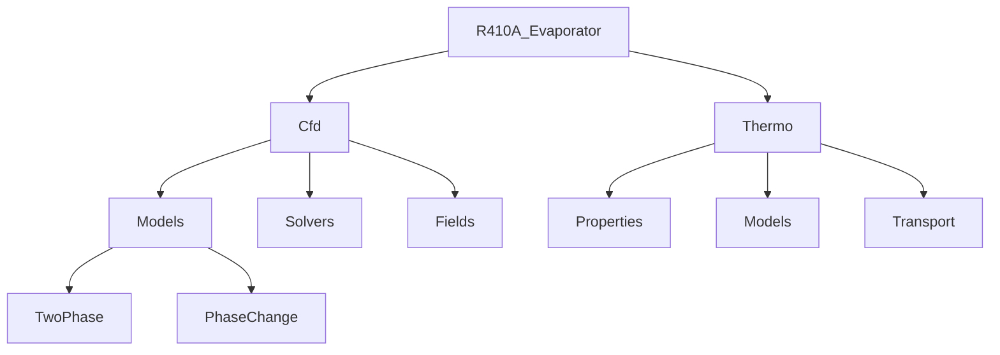

# Code Organization (การจัดระเบียบโค้ด)

ภาพรวมระบบการจัดการโค้ด OpenFOAM — โครงสร้างไฟล์ การแบ่งแยก Header และ Source การใช้งาน Templates
และ Best Practices สำหรับ Custom Solver ของ R410A Two-Phase Flow

---

## 🎯 Learning Objectives

**Learning Objectives:**
- Understand OpenFOAM's directory structure and file organization
- Master header/source file separation patterns
- Learn template instantiation in OpenFOAM
- Organize namespaces and avoid name clashes
- Apply best practices for R410A custom solver development
- Create maintainable and scalable code structures

**เป้าหมายการเรียนรู้:**
- เข้าใโครงสร้างไดเรกทอรีและรูปแบบการจัดการไฟล์ของ OpenFOAM
- เรียนรู้การแบ่งแยกไฟล์ Header และ Source
- ใช้งาน Template Instantiation ใน OpenFOAM
- จัดการ Namespace และหลีกเลี่ยง Name Clashes
- นำ Best Practices ไปใช้กับ Custom Solver R410A
- สร้างโครงสร้างโค้ดที่สามารถบำรุงรักษาและขยายได้

---

## What is Code Organization?

> **💡 คิดแบบนี้:**
> Code Organization = **กระดาษหน้าปก + หัวข้อย่อย + ดัชนี**
>
> - Directory Structure = หน้าปกบ้างหน้า
> - Header/Source separation = หัวข้อย่อย + เนื้อหา
> - Templates = ดัชนีเพื่อค้นหาเร็ว

**What:** Code organization in OpenFOAM refers to the systematic arrangement of source files, headers, templates, and directories to create maintainable, scalable, and understandable codebases.

**Why Organization Matters:**
- **Maintainability:** หาง่ายที่จะแก้ไขและเพิ่มเติม
- **Scalability:** ขยายได้เมื่อโปรเจกต์ใหญ่ขึ้น
- **Collaboration:** ทีมสามารถทำงานร่วมกันได้
- **Performance:** Compile time + Runtime efficiency
- **Debugging:** หาและแก้บั๊กได้ง่ายขึ้น

---

## 1. OpenFOAM Directory Structure (โครงสร้างไดเรกทอรี OpenFOAM)

### 1.1 Standard OpenFOAM Layout (โครงสร้างมาตรฐานของ OpenFOAM)

```bash
OpenFOAM/
├── src/                    # Source code
│   ├── OpenFOAM/          # Core libraries
│   │   ├── primitives/     # Basic data types
│   │   ├── dimensionedTypes/  # Types with dimensions
│   │   ├── meshes/        # Mesh classes
│   │   ├── fields/        # Field classes
│   │   ├── matrices/      # Matrix classes
│   │   └── db/           # Database/IO
│   ├── finiteVolume/      # FV-specific code
│   │   ├── fvMesh/        # FV mesh
│   │   ├── fvMatrices/    # FV matrices
│   │   └── finiteVolume/  # FV operators
│   └── otherLibs/         # Other libraries
├── applications/          # Solvers and utilities
│   ├── solvers/          # Main solvers
│   └── utilities/        # Post-processing tools
└── tutorials/             # Example cases
```

### 1.2 Custom Solver Directory Structure (โครงสร้างไดเรกทอรีสำหรับ Custom Solver)

```bash
R410A_Evaporator/
├── Make/                 # Build files
│   ├── files            # List of source files
│   └── options          # Library linking
├── src/
│   ├── R410A_Evaporator/
│   │   ├── Cfd/
│   │   │   ├── Models/        # Physics models
│   │   │   │   ├── TwoPhase/
│   │   │   │   ├── Evaporation/
│   │   │   │   └── PhaseChange/
│   │   │   ├── Solvers/       # Numerical solvers
│   │   │   │   ├── Pressure/
│   │   │   │   ├── Velocity/
│   │   │   │   └── Temperature/
│   │   │   ├── Fields/        # Field definitions
│   │   │   │   ├── Vol/
│   │   │   │   └── Surface/
│   │   │   └── Utilities/     # Helper functions
│   │   └── Thermo/
│   │       ├── Properties/    # R410A properties
│   │       ├── Equations/     # State equations
│   │       └── Models/         # Property models
│   └── main.C               # Main solver file
├── constant/
│   ├── transportProperties  # R410A properties
│   ├── thermophysicalProperties
│   └── polyMesh/           # Mesh data
├── system/
│   ├── controlDict        # Time control
│   ├── fvSolution        # Solver settings
│   ├── fvSchemes         # Numerical schemes
│   └── setFieldsDict     # Field initialization
└── 0/                    # Initial conditions
    ├── p
    ├── U
    ├── T
    └── alpha
```

---

## 2. Header File Organization (.H Files) (การจัดระเบียบไฟล์ Header)

### 2.1 OpenFOAM Header File Structure (โครงสร้างไฟล์ Header ของ OpenFOAM)

```cpp
/*---------------------------------------------------------------------------*\
  =========                 |
  \\      /  F ield         | OpenFOAM: The Open Source CFD Toolbox
   \\    /   O peration     | Website:  https://openfoam.org
    \\  /    A nd           | Copyright (C) 2011-2025 OpenFOAM Foundation
     \\/     M anipulation  |
-------------------------------------------------------------------------------
License
    This file is part of OpenFOAM.

    OpenFOAM is free software: you can redistribute it and/or modify it
    under the terms of the GNU General Public License as published by
    the Free Software Foundation, either version 3 of the License, or
    (at your option) any later version.

Class
    Foam::ClassName

Description
    Brief description of the class purpose.

SourceFiles
    ClassName.C
    ClassNameI.H

\*---------------------------------------------------------------------------*/

#ifndef ClassName_H
#define ClassName_H

#include "baseClass.H"
#include "tmp.H"
#include "geometricField.H"

// * * * * * * * * * * * * * * * * * * * * * * * * * * * * * * * * * * * * * //

namespace Foam
{

/*---------------------------------------------------------------------------*\
                           Class ClassName Declaration
\*---------------------------------------------------------------------------*/

class ClassName
:
    public baseClass
{
    // Private Data

        private:

            //- Private member data
            scalarField data_;


    // Private Member Functions

        private:

            //- Disallow copy construct
            ClassName(const ClassName&);

            //- Disallow assignment
            void operator=(const ClassName&);


    // Protected Member Functions

        protected:

            //- Protected member function
            void protectedFunction();


    // Public Member Functions

        public:

            //- Construct from components
            ClassName(const volScalarField& field);

            //- Destructor
            ~ClassName();

            //- Access function
            inline const scalarField& data() const;

            //- Modify function
            inline scalarField& data();

            //- Main calculation function
            void calculate();
};

// * * * * * * * * * * * * * * * * * * * * * * * * * * * * * * * * * * * * * //

} // End namespace Foam

// * * * * * * * * * * * * * * * * * * * * * * * * * * * * * * * * * * * * * //

#ifdef NoRepository
    #include "ClassName.C"
#endif

// * * * * * * * * * * * * * * * * * * * * * * * * * * * * * * * * * * * * * //

#endif
```

### 2.2 Header File Organization Patterns (รูปแบบการจัดระเบียบไฟล์ Header)

**Pattern 1: Single Class Per File**

```cpp
// R410AProperties.H
#ifndef R410AProperties_H
#define R410AProperties_H

namespace Foam
{
namespace R410A
{

class R410AProperties
{
    // Properties calculation methods
    scalar density(scalar p, scalar T) const;
    scalar viscosity(scalar p, scalar T) const;
    // ...
};

}
}
#endif
```

**Pattern 2: Related Classes Together**

```cpp
// TwoPhaseModels.H
#ifndef TwoPhaseModels_H
#define TwoPhaseModels_H

namespace Foam
{
namespace TwoPhase
{

class HomogeneousModel
{
    // Homogeneous model implementation
};

class DriftFluxModel
{
    // Drift flux model implementation
};

class MixtureModel
{
    // Mixture model implementation
};

}
}
#endif
```

### 2.3 Header File Best Practices (แนวทาปฏิบัติที่ดีสำหรับไฟล์ Header)

**Include Guard Pattern:**

```cpp
// Good: Unique include guard
#ifndef FOAM_R410A_EVAPORATOR_H
#define FOAM_R410A_EVAPORATOR_H

// Bad: Generic name that might clash
#ifndef CLASS_H
#define CLASS_H
```

**Forward Declarations:**

```cpp
// Use forward declarations when possible
class volScalarField;
class fvMesh;

// Only include full definitions when needed
#include "volScalarField.H"  // For actual usage
```

**Hierarchical Includes:**

```cpp
// Level 1: Basic types
#include "scalar.H"
#include "vector.H"

// Level 2: Composite types
#include "geometricField.H"
#include "fvMesh.H"

// Level 3: Application specific
#include "R410AProperties.H"
```

---

## 3. Source File Organization (.C Files) (การจัดระเบียบไฟล์ Source)

### 3.1 Source File Structure (โครงสร้างไฟล์ Source)

```cpp
/*---------------------------------------------------------------------------*\
  =========                 |
  \\      /  F ield         | OpenFOAM: The Open Source CFD Toolbox
   \\    /   O peration     | Website:  https://openfoam.org
    \\  /    A nd           | Copyright (C) 2011-2025 OpenFOAM Foundation
     \\/     M anipulation  |
-------------------------------------------------------------------------------
License
    This file is part of OpenFOAM.

    OpenFOAM is free software: you can redistribute it and/or modify it
    under the terms of the GNU General Public License as published by
    the Free Software Foundation, either version 3 of the License, or
    (at your option) any later version.

Namespace
    Foam

Description
    Implementation of ClassName methods.

\*---------------------------------------------------------------------------*/

#include "ClassName.H"
#include "addToRunTimeSelectionTable.H"

// * * * * * * * * * * * * * * * * * * * * * * * * * * * * * * * * * * * * * //

namespace Foam
{

// * * * * * * * * * * * * * * * * * * * * * * * * * * * * * * * * * * * * * //

defineTypeNameAndDebug(ClassName, 0);

// * * * * * * * * * * * * * * * * * * * * * * * * * * * * * * * * * * * * * //

// Constructors

ClassName::ClassName(const volScalarField& field)
:
    baseClass(field),
    data_(field.size())
{
    // Constructor implementation
}


ClassName::~ClassName()
{
    // Destructor implementation
}


// Member Functions

inline const scalarField& ClassName::data() const
{
    return data_;
}


inline scalarField& ClassName::data()
{
    return data_;
}


void ClassName::calculate()
{
    // Main calculation implementation
}


// * * * * * * * * * * * * * * * * * * * * * * * * * * * * * * * * * * * * * //

} // End namespace Foam
```

### 3.2 Source File Organization (การจัดระเบียบไฟล์ Source)

**File Naming Conventions:**

```bash
# Implementation files
ClassName.C          # Main implementation
ClassName.C          # Same name as header
ClassNameI.H         # Template implementations
```

**Template Implementation Files:**

```cpp
// R410APropertiesI.H
template<class ThermoType>
inline Foam::scalar Foam::R410AProperties<ThermoType>::density
(
    scalar p,
    scalar T
) const
{
    // Implementation
    return rho_;
}
```

### 3.3 Source File Best Practices (แนวทาปฏิบัติที่ดีสำหรับไฟล์ Source)

**Implementation Files:**

```cpp
// Include corresponding header first
#include "ClassName.H"

// Then other headers
#include "otherHeader.H"

// Implementation goes here
```

**Template Instantiation:**

```cpp
// Explicit instantiation if needed
template class R410AProperties<icoPoly>;
template class R410AProperties<janafPoly>;
```

---

## 4. Template Instantiation Patterns (รูปแบบการสร้าง Instance ของ Template)

### 4.1 Template Declaration in Headers (การประกาศ Template ในไฟล์ Header)

```cpp
// TwoPhaseModel.H
#ifndef TwoPhaseModel_H
#define TwoPhaseModel_H

namespace Foam
{
namespace TwoPhase
{

template<class Phase1, class Phase2>
class TwoPhaseModel
{
    // Template class declaration
    typedef Phase1 phase1Type;
    typedef Phase2 phase2Type;

    scalar calculateHeatTransfer();
};

}
}
#endif
```

### 4.2 Template Implementation in .I Files (การ Implement Template ในไฟล์ .I)

```cpp
// TwoPhaseModelI.H
template<class Phase1, class Phase2>
inline Foam::scalar Foam::TwoPhaseModel<Phase1, Phase2>::calculateHeatTransfer()
{
    // Template implementation
    scalar Nu = 0.0;

    // Calculate Nusselt number
    Nu = calculateNusselt();

    return Nu;
}
```

### 4.3 Explicit Template Instantiation (การสร้าง Instance ของ Template โดยตรง)

```cpp
// TwoPhaseModel.C
#include "TwoPhaseModel.H"
#include "TwoPhaseModelI.H"
#include "icoPoly.H"
#include "janafPoly.H"

// Explicit instantiation for common combinations
template class TwoPhaseModel<icoPoly, icoPoly>;
template class TwoPhaseModel<icoPoly, janafPoly>;
template class TwoPhaseModel<janafPoly, janafPoly>;
```

### 4.4 Template Specialization (การ Specialization ของ Template)

```cpp
// Specialization for R410A properties
template<>
class R410AProperties<icoPoly>
{
public:
    scalar density(scalar p, scalar T) const
    {
        // R410A-specific density calculation
        return calculateR410ADensity(p, T);
    }
};
```

---

## 5. Namespace Organization (การจัดระเบียบ Namespace)

### 5.1 Namespace Hierarchy (ลำดับชั้นของ Namespace)

```cpp
// Top-level namespace
namespace Foam
{
    // OpenFOAM core functionality

    // Custom solver namespace
    namespace R410A
    {
        namespace Thermo
        {
            // Thermal properties
            class R410AProperties;
        }

        namespace TwoPhase
        {
            // Two-phase models
            class EvaporationModel;
            class CondensationModel;
        }

        namespace Solvers
        {
            // Solver classes
            class R410AEvaporatorSolver;
        }
    }
}
```

### 5.2 Namespace Usage Patterns (รูปแบบการใช้งาน Namespace)

**Good Practice:**

```cpp
// Using declarations for frequently used types
using Foam::volScalarField;
using Foam::fvMesh;
using Foam::runTime;

// Namespace qualification for clarity
void Foam::R410A::TwoPhase::EvaporationModel::calculate()
{
    // Implementation
}
```

**Avoid:**

```cpp
// Don't pull everything into global namespace
using namespace Foam;
using namespace R410A;
using namespace TwoPhase;

// This can cause name clashes
```

### 5.3 Namespace Aliases (Alias ของ Namespace)

```cpp
// Create convenient aliases
namespace R410A = Foam::R410A;
namespace Thermo = Foam::R410A::Thermo;
namespace TwoPhase = Foam::R410A::TwoPhase;
```

---

## 6. Best Practices for Code Organization (แนวทาปฏิบัติที่ดีสำหรับการจัดระเบียบโค้ด)

### 6.1 File Organization Checklist (Checklist สำหรับการจัดระเบียบไฟล์)

**✅ Directory Structure:**
- [ ] Logical separation of concerns
- [ ] Clear hierarchy
- [ ] Consistent naming conventions

**✅ Header Files:**
- [ ] Proper include guards
- [ ] Forward declarations where possible
- [ ] Minimal includes

**✅ Source Files:**
- [ ] Implementation in separate .C files
- [ ] Template implementations in .I files
- [ ] No circular dependencies

**✅ Namespace Management:**
- [ ] Hierarchical namespace structure
- [ ] Avoid name clashes
- [ ] Proper qualification

### 6.2 R410A Custom Solver Organization Example (ตัวอย่างการจัดระเบียบ Custom Solver R410A)

**File Structure:**

```
R410A_Evaporator/
├── Make/
│   ├── files
│   └── options
├── src/
│   ├── R410A_Evaporator/
│   │   ├── Cfd/
│   │   │   ├── Models/
│   │   │   │   ├── TwoPhase/
│   │   │   │   │   ├── TwoPhaseModel.H
│   │   │   │   │   ├── TwoPhaseModel.C
│   │   │   │   │   ├── TwoPhaseModelI.H
│   │   │   │   │   ├── Evaporation.H
│   │   │   │   │   ├── Evaporation.C
│   │   │   │   │   ├── Condensation.H
│   │   │   │   │   └── Condensation.C
│   │   │   │   └── PhaseChange/
│   │   │   │       ├── Nucleation.H
│   │   │   │       ├── Nucleation.C
│   │   │   │       ├── BubbleDynamics.H
│   │   │   │       └── BubbleDynamics.C
│   │   │   ├── Solvers/
│   │   │   │   ├── Pressure/
│   │   │   │   │   ├── PressureSolver.H
│   │   │   │   │   └── PressureSolver.C
│   │   │   │   ├── Velocity/
│   │   │   │   │   ├── MomentumSolver.H
│   │   │   │   │   └── MomentumSolver.C
│   │   │   │   └── Temperature/
│   │   │   │       ├── EnergySolver.H
│   │   │   │       └── EnergySolver.C
│   │   │   └── Fields/
│   │   │       ├── Vol/
│   │   │       │   ├── volR410AField.H
│   │   │       │   ├── volR410AField.C
│   │   │       │   ├── volPhaseFractionField.H
│   │   │       │   └── volPhaseFractionField.C
│   │   │       └── Surface/
│   │   │           ├── surfaceR410AFlux.H
│   │   │           └── surfaceR410AFlux.C
│   │   └── Thermo/
│   │       ├── Properties/
│   │       │   ├── R410AProperties.H
│   │       │   ├── R410AProperties.C
│   │       │   ├── R410APropertiesI.H
│   │       │   ├── EquationOfState.H
│   │       │   └── EquationOfState.C
│   │       ├── Models/
│   │       │   ├── IdealGas.H
│   │       │   ├── PengRobinson.H
│   │       │   └── RefpropInterface.H
│   │       └── Transport/
│   │           ├── ThermalConductivity.H
│   │           ├── Viscosity.H
│   │           └── SurfaceTension.H
│   └── main.C
```

### 6.3 Make File Organization (การจัดระเบียบไฟล์ Make)

**Make/files:**

```bash
EXE = $(APPLICATIONS)/$(TARGET)

EXE_INC = \
    -I$(LIB_SRC)/finiteVolume/lnInclude \
    -I$(SRC)/R410A_Evaporator/lnInclude

EXE_LIBS = \
    -lfiniteVolume \
    -lR410A_Evaporator
```

**Make/options:**

```bash
EXE_INC = \
    -I$(LIB_SRC)/finiteVolume/lnInclude \
    -I$(SRC)/R410A_Evaporator/lnInclude \
    -I$(SRC)/thermophysicalModels/basic/lnInclude \
    -I$(SRC)/thermophysicalModels/specie/lnInclude

EXE_LIBS = \
    -lfiniteVolume \
    -lR410A_Evaporator \
    -lthermophysicalModels
```

### 6.4 Code Quality Guidelines (แนวทาปฏิบัติที่ดีสำหรับคุณภาพโค้ด)

**Naming Conventions:**

```cpp
// Class names: PascalCase
class R410AProperties;
class TwoPhaseModel;

// Method names: camelCase
void calculateHeatTransfer();
scalar getDensity();

// Variable names: camelCase
scalarField temperature_;
volVectorField velocity_;

// Constants: UPPER_CASE
const scalar R = 8.314;
const scalar TCRIT = 344.45; // R410A critical temperature
```

**Code Structure:**

```cpp
// 1. Includes
#include "volScalarField.H"
#include "R410AProperties.H"

// 2. Namespace
namespace Foam
{
namespace R410A
{

// 3. Class definition
class TwoPhaseModel
{
    // 3.1 Member variables
    private:
        scalarField alpha_;
        volScalarField T_;

    // 3.2 Methods
    public:
        void solve();
        scalar calculateHeatTransfer();
};

}
}
```

---

## 7. Common Organization Pitfalls (ข้อผิดพลาดทั่วไปในการจัดระเบียบโค้ด)

### 7.1 Circular Dependencies (การพึ่งพาแบบวงกลม)

**Problem:**

```cpp
// File A.H
#include "B.H"
class A { void method(B& b); };

// File B.H
#include "A.H"
class B { void method(A& a); };  // Circular!
```

**Solution:**

```cpp
// File A.H
class B;  // Forward declaration
class A { void method(B& b); };

// File B.H
class A;  // Forward declaration
class B { void method(A& a); };
```

### 7.2 Excessive Header Dependencies (การพึ่งพาไฟล์ Header มากเกินไป)

**Problem:**

```cpp
// Too many includes
#include "volScalarField.H"
#include "volVectorField.H"
#include "surfaceScalarField.H"
#include "fvMesh.H"
#include "fvCFD.H"
#include "IOobject.H"
#include "runTimeSelectionTables.H"
// ...
```

**Solution:**

```cpp
// Minimal includes with forward declarations
class volScalarField;
class fvMesh;
#include "fvCFD.H"  // Most OpenFOAM headers include this
```

### 7.3 Poor Namespace Management (การจัดการ Namespace ที่ไม่ดี)

**Problem:**

```cpp
// Polluting global namespace
using namespace Foam;
using namespace R410A;

// Potential name clashes
class Properties { ... };  // Might clash with other libraries
```

**Solution:**

```cpp
// Proper namespace qualification
void Foam::R410A::TwoPhaseModel::calculate()
{
    // Implementation
}
```

---

## 8. Tools for Code Organization (เครื่องมือสำหรับการจัดระเบียบโค้ด)

### 8.1 File Structure Analysis (การวิเคราะห์โครงสร้างไฟล์)

```bash
# Find all header files
find . -name "*.H" | sort

# Count lines of code per file
find . -name "*.H" -o -name "*.C" | xargs wc -l

# Check include dependencies
grep -r "#include" src/ | head -20
```

### 8.2 Compilation Analysis (การวิเคราะห์ Compilation)

```bash
# Check include paths
wmake 2>&1 | grep "include"

# Check template instantiation
nm libR410A_Evaporator.so | grep "T>"

# Check symbol dependencies
ldd libR410A_Evaporator.so
```

---

## 9. Advanced Organization Patterns (รูปแบบการจัดระเบียบขั้นสูง)

### 9.1 Plugin Architecture (สถาปัตยกรรม Plugin)

```cpp
// Plugin interface
class EvaporationModel
{
    public:
        virtual ~EvaporationModel() = default;
        virtual scalar calculate
        (
            const scalarField& alpha,
            const scalarField& T,
            const scalarField& p
        ) const = 0;

        declareRunTimeSelectionTable
        (
            autoPtr,
            EvaporationModel,
            dictionary,
            (
                const dictionary& dict
            ),
            dict
        );
};

// Plugin registry
namespace Foam
{
    defineTypeNameAndDebug(EvaporationModel, 0);
    defineRunTimeSelectionTable(EvaporationModel, dictionary);
}

// Plugin implementation
class NucleateBoilingEvaporation
:
    public EvaporationModel
{
    // Implementation
};

// Plugin registration
addToRunTimeSelectionTable
(
    EvaporationModel,
    NucleateBoilingEvaporation,
    dictionary
);
```

### 9.2 Module System (ระบบ Module)

```cpp
// Module interface
class R410AModule
{
    public:
        virtual ~R410AModule() = default;
        virtual void initialize(const fvMesh& mesh) = 0;
        virtual void solve(scalarField& alpha) = 0;
        virtual void write() = 0;
};

// Module registry
std::map<word, autoPtr<R410AModule>> moduleRegistry_;
```

---

## 10. Summary and Best Practices (สรุปและแนวทาปฏิบัติที่ดี)

### 10.1 Key Takeaways (ข้อสรุปสำคัญ)

1. **Directory Structure:** Clear separation of concerns is essential
2. **Header Organization:** Proper include guards and minimal dependencies
3. **Templates:** Use .I files for template implementations
4. **Namespaces:** Hierarchical structure to avoid clashes
5. **Build System:** Proper Make/files and Make/options

### 10.2 R410A Solver Organization Summary (สรุปการจัดระเบียบ Solver R410A)



### 10.3 Final Checklist (Checklist สุดท้าย)

**Before Release:**
- [ ] All header files have proper include guards
- [ ] No circular dependencies
- [ ] Template implementations in .I files
- [ ] Proper namespace organization
- [ ] Clear directory structure
- [ ] Documentation for public interfaces
- [ ] Build system tested

**Ongoing Maintenance:**
- [ ] Regular dependency analysis
- [ ] Remove unused includes
- [ ] Monitor compile times
- [ ] Update documentation with changes

---

## References and Further Reading (อ้างอิงและการอ่านเพิ่มเติม)

1. **OpenFOAM Programmer's Guide** - Official documentation
2. **The OpenFOAM Foundation** - Best practices repository
3. **OpenFOAM Wiki** - Code organization guidelines
4. **C++ Core Guidelines** - C++ best practices
5. **Modern C++ for CFD** - Advanced patterns and techniques

---

*Last Updated: 2026-01-28*
*Section: Code Organization*
*Target: R410A Two-Phase Flow Solver Development*