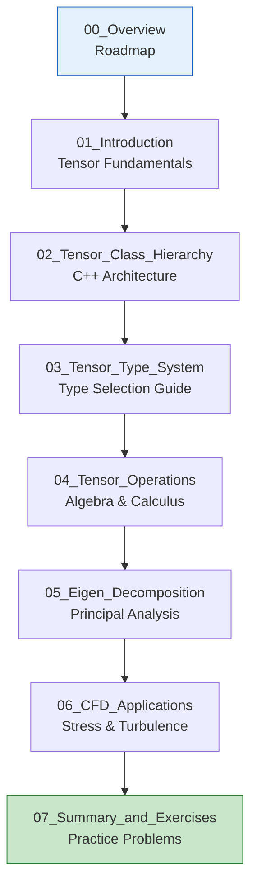

# โมดูล 05.11: พีชคณิตเทนเซอร์ใน OpenFOAM (Tensor Algebra in OpenFOAM)

> [!TIP] ทำไมต้องเรียนรู้ Tensor Algebra?
> พีชคณิตเทนเซอร์เป็นภาษาหลักที่ OpenFOAM ใช้จำลองปรากฏการณ์ทางฟิสิกส์ เช่น ความเค้น (stress), ความเครียด (strain), และความปั่นป่วน (turbulence) การเข้าใจเทนเซอร์จะช่วยให้คุณ:
> - เขียนซอร์สโค้ดสำหรับการแก้สมการโมเมนตัมและความปั่นป่วนได้อย่างถูกต้อง
> - สร้าง custom boundary conditions หรือ turbulence models ได้อย่างมีประสิทธิภาพ
> - ทำความเข้าใจการคำนวณเทนเซอร์ในซอร์สโค้ดของ OpenFOAM (เช่น `src/finiteVolume/`)
> - หลีกเลี่ยงข้อผิดพลาดจากการใช้ tensor operations ที่ไม่ถูกต้องซึ่งอาจทำให้ simulation crash หรือให้ผลลัพธ์ผิดพลาด

---

## ภาพรวมโมดูล (Module Overview)

พีชคณิตเทนเซอร์เป็นรากฐานทางคณิตศาสตร์สำหรับการแสดง **ปริมาณที่มีทิศทาง (directional quantities)** และการเปลี่ยนแปลงเชิงพื้นที่ในพลศาสตร์ของไหลเชิงคำนวณ (CFD) ซึ่งแตกต่างจากสเกลาร์ (เทนเซอร์อันดับ 0) และเวกเตอร์ (เทนเซอร์อันดับ 1) โดย **เทนเซอร์อันดับสอง (second-order tensors)** อธิบายการแปลงเชิงเส้นระหว่างปริภูมิเวกเตอร์ ทำให้มีความจำเป็นอย่างยิ่งสำหรับการสร้างแบบจำลองความเค้น (stress), ความเครียด (strain) และปรากฏการณ์ความปั่นป่วน (turbulence)

> [!INFO] ทำไมเทนเซอร์ถึงสำคัญใน CFD
> เฟรมเวิร์กเทนเซอร์ของ OpenFOAM ขยายขอบเขตไปไกลกว่าคณิตศาสตร์ของสเกลาร์และเวกเตอร์ เพื่อจับ **พฤติกรรมแบบแอนไอโซทรอปิก (anisotropic behaviors)** ที่ซับซ้อนซึ่งพบในการไหลของของไหลจริงและการตอบสนองของวัสดุ สิ่งนี้ช่วยให้สามารถสร้างแบบจำลองที่แม่นยำของ:
> - **เทนเซอร์ความเค้น (Stress tensors)** (ความเค้น Cauchy, ความเค้นหนืด)
> - **เทนเซอร์อัตราความเครียด (Strain rate tensors)** (เกรเดียนต์ของการเสียรูป)
> - **เทนเซอร์ความเค้นเรย์โนลด์ส (Reynolds stress tensors)** (ความสัมพันธ์ในความปั่นป่วน)
> - **สัมประสิทธิ์การขนส่งแบบแอนไอโซทรอปิก (Anisotropic transport coefficients)**

### แผนที่เส้นทางการเรียนรู้ (Learning Roadmap)



---

## วัตถุประสงค์การเรียนรู้ (Learning Objectives)

> [!NOTE] **📂 OpenFOAM Context**
> **ส่วนประกอบ (Components):** ซอร์สโค้ด OpenFOAM, Custom solvers, Boundary conditions
>
> **ไฟล์ที่เกี่ยวข้อง (Files):**
> - `src/OpenFOAM/fields/Fields/tensor/` - คลาสเทนเซอร์พื้นฐาน
> - `src/OpenFOAM/fields/Fields/symmTensor/` - คลาสเทนเซอร์สมมาตร
> - `src/finiteVolume/fields/volFields/volFields.H` - สนามเทนเซอร์บน mesh
> - `applications/solvers/` - ตัวอย่างการใช้งานใน solvers
>
> **คำสั่ง/คำสำคัญ (Keywords):** `tensor`, `symmTensor`, `sphericalTensor`, `volTensorField`, `fvc::grad`, `fvc::div`, `eigenValues`, `eigenVectors`

หลังจากจบโมดูลนี้ คุณจะสามารถ:

### **1. เข้าใจคลาสเทนเซอร์ของ OpenFOAM และการแทนทางคณิตศาสตร์**
- อธิบายความแตกต่างระหว่าง `tensor`, `symmTensor`, และ `sphericalTensor`
- เลือกใช้คลาสเทนเซอร์ที่เหมาะสมกับปัญหาฟิสิกส์ที่ต้องการแก้
- ประกาศและเริ่มต้นเทนเซอร์ใน OpenFOAM ได้อย่างถูกต้อง

### **2. ดำเนินการพื้นฐานทางพีชคณิตเทนเซอร์**
- ใช้การดำเนินการเชิงพีชคณิต (บวก, ลบ, คูณ, หาร) กับเทนเซอร์ได้อย่างถูกต้อง
- แยกแยะและใช้ single contraction (`&`), double contraction (`&&`), และ outer product (`*`) ได้อย่างเหมาะสม
- คำนวณค่า invariant ของเทนเซอร์ (trace, determinant) เพื่อการวิเคราะห์

### **3. คำนวณการแยกตัวประกอบไอเกน (Eigen Decomposition)**
- แก้ eigenvalue problem เพื่อหา principal stresses และ principal directions
- ใช้ `eigenValues()` และ `eigenVectors()` ใน OpenFOAM สำหรับการวิเคราะห์ความเค้น
- ตีความผลลัพธ์จาก eigen decomposition ในบริบทของ CFD

### **4. ประยุกต์ใช้ตัวดำเนินการแคลคูลัส (Apply Tensor Calculus Operators)**
- คำนวณ gradient, divergence, และ Laplacian ของสนามเทนเซอร์ด้วย `fvc`
- ใช้ตัวดำเนินการ `symm()`, `skew()`, `dev()` สำหรับการวิเคราะห์แรงเฉือนและการหมุน
- เชื่อมโยงตัวดำเนินการแคลคูลัสกับสมการการไหลใน CFD

### **5. ใช้งานในแอปพลิเคชัน CFD จริง**
- สร้างแบบจำลองความปั่นป่วนด้วย Reynolds stress tensor
- วิเคราะห์ความเค้นและความเครียดในโครงสร้าง
- เขียนโค้ด OpenFOAM ที่มีประสิทธิภาพสำหรับการคำนวณทางพีชคณิตเทนเซอร์

---

## สรุปเนื้อหาโมดูล (Module Content Summary)

### **ไฟล์ที่ 01: Introduction**
เรียนรู้พื้นฐานของเทนเซอร์: นิยาม, การแทนเทนเซอร์ใน 3 มิติ, และแนวคิดเรื่อง rank ของเทนเซอร์

### **ไฟล์ที่ 02: Tensor Class Hierarchy**
ศึกษาสถาปัตยกรรม C++ ของเทนเซอร์ใน OpenFOAM: `VectorSpace`, `MatrixSpace`, และ template metaprogramming

### **ไฟล์ที่ 03: Tensor Type System**
เรียนรู้เกณฑ์การเลือกใช้ `tensor` vs `symmTensor` vs `sphericalTensor` สำหรับสถานการณ์ต่างๆ

### **ไฟล์ที่ 04: Tensor Operations**
เจาะลึกการดำเนินการพีชคณิตและแคลคูลัส: addition, subtraction, multiplication, contractions, gradient, divergence

### **ไฟล์ที่ 05: Eigen Decomposition**
แก้ eigenvalue problem และประยุกต์ใช้กับการวิเคราะห์ความเค้นและความปั่นป่วน

### **ไฟล์ที่ 06: CFD Applications**
ตัวอย่างการประยุกต์ใช้เทนเซอร์ใน turbulence modeling, stress analysis, และ custom boundary conditions

### **ไฟล์ที่ 07: Summary and Exercises**
แบบฝึกหัดปัญหาจริงและโค้ดชิ้นส่วน (code snippets) สำหรับการฝึกปฏิบัติ

---

## ภาพรวมคลาสเทนเซอร์ของ OpenFOAM (Tensor Classes Overview)

OpenFOAM มอบเฟรมเวิร์กพีชคณิตเทนเซอร์ที่ครอบคลุมผ่านคลาสเทนเซอร์หลัก 3 คลาส:

| คลาส (Class) | ขนาด (Size) | องค์ประกอบอิสระ (Independent Components) | การใช้หน่วยความจำ | คำอธิบาย (Description) |
|-------|-------|---------------------|----------|----------|
| **`tensor`** | 3×3 | 9 องค์ประกอบ | 100% | เทนเซอร์อันดับสองทั่วไป |
| **`symmTensor`** | 3×3 | 6 องค์ประกอบ | 67% | เทนเซอร์สมมาตร |
| **`sphericalTensor`** | 3×3 | 1 องค์ประกอบ | 11% | เทนเซอร์ทรงกลม (ไอโซทรอปิก) |

> **หมายเหตุ:** การเลือกใช้คลาสเทนเซอร์ที่เหมาะสมไม่เพียงแต่ประหยัดหน่วยความจำ แต่ยังช่วยลดเวลาการคำนวณลงอย่างมาก เนื่องจาก OpenFOAM สามารถใช้ประโยชน์จากสมบัติของความสมมาตรในการเพิ่มประสิทธิภาพการคำนวณได้

---

## การตีความทางฟิสิกส์: ก้อนความเค้น (Physical Interpretation)

> [!NOTE] **📂 OpenFOAM Context**
> **ส่วนประกอบ (Components):** Physics modeling, Stress analysis
>
> **ไฟล์ที่เกี่ยวข้อง (Files):**
> - `0/` - directory สำหรับเก็บสนามเทนเซอร์ (เช่น `0/sigma`, `0/tau`)
> - `constant/transportProperties` - ค่า viscosity ที่ใช้คำนวณ stress
> - `applications/solvers/stressAnalysis/` - solvers สำหรับ stress analysis
>
> **คำสั่ง/คำสำคัญ (Keywords):** `stress`, `strain`, `symmTensor`, `symm(fvc::grad(U))`, `dev()`, `tr()`

### เทนเซอร์ความเค้น Cauchy

พิจารณาชิ้นส่วนเล็กๆ รูปบาศก์ของวัสดุภายใต้ภาระ บนทั้ง 6 หน้าของบาศก์นี้ มีแรงกระทำซึ่งสามารถแตกแรงได้เป็น:
- **องค์ประกอบตั้งฉาก (Normal component)**: ตั้งฉากกับพื้นผิว
- **สององค์ประกอบเฉือน (Shear components)**: ขนานกับพื้นผิว

เพื่ออธิบาย **สถานะความเค้น** ที่จุดใดๆ อย่างสมบูรณ์ เราต้องการ **ตัวเลขอิสระ 9 ตัว** ที่จัดเรียงเป็นเมทริกซ์ 3×3:

$$\boldsymbol{\tau} = \begin{bmatrix}
\tau_{xx} & \tau_{xy} & \tau_{xz} \\
\tau_{yx} & \tau_{yy} & \tau_{yz} \\
\tau_{zx} & \tau_{zy} & \tau_{zz}
\end{bmatrix}$$

เนื่องจากการอนุรักษ์โมเมนตัมเชิงมุม เทนเซอร์ความเค้นจึง **สมมาตร** ($\tau_{ij} = \tau_{ji}$) ลดจำนวนองค์ประกอบอิสระเหลือ 6 ตัว

### การวิเคราะห์ความเค้นหลัก (Principal Stress Analysis)

คำถามพื้นฐากคือ: **ในทิศทางใดที่ก้อนความเค้นนี้จะรับแรงเฉพาะในแนวตั้งฉากเท่านั้น?** (ไม่มีแรงเฉือน)
คำถามนี้นำไปสู่การหา **Principal Stresses** ผ่าน eigen decomposition ซึ่งจะหมุนก้อนบาศก์ไปยังมุมที่แรงเฉือนหายไปทั้งหมด เหลือเพียงแรงดึง/อัดในแนวแกนหลัก

---

## สรุปโมดูล (Module Summary)

> [!NOTE] **📂 OpenFOAM Context**
> **ส่วนประกอบ (Components):** Complete tensor workflow implementation
>
> **ไฟล์ที่เกี่ยวข้อง (Files):**
> - Custom solver source files (เช่น `mySolver.C`) - ใช้ tensor operations ในสมการโมเมนตัม
> - `0/` directory - เก็บเงื่อนไขเริ่มต้นของสนามเทนเซอร์
> - `Make/files` และ `Make/options` - compile custom code
> - `system/controlDict` - run-time function objects สำหรับ tensor fields
>
> **คำสั่ง/คำสำคัญ (Keywords):** `volTensorField`, `volSymmTensorField`, `fvc::grad`, `fvc::div`, `eigenValues`, `Reynolds stress`

### **แนวคิดสำคัญ (Key Concepts)**

1.  **สถาปัตยกรรมเทนเซอร์**: OpenFOAM มี 3 คลาสหลัก (`tensor`, `symmTensor`, `sphericalTensor`) เพื่อเพิ่มประสิทธิภาพหน่วยความจำและการคำนวณ
2.  **ความสำคัญของการเลือกใช้**: การเลือกประเภทเทนเซอร์ที่ถูกต้องช่วยประหยัดหน่วยความจำและลดเวลาการคำนวณลงได้อย่างมาก
3.  **Eigen Decomposition**: เครื่องมือสำคัญในการวิเคราะห์ความเค้นและความปั่นป่วน หาแกนหลักและค่าหลัก
4.  **ความหมายทางฟิสิกส์**: เทนเซอร์เชื่อมโยงคณิตศาสตร์กับพฤติกรรมของวัสดุและการไหล (Stress, Strain, Rate of deformation)

### **ตารางสรุปการดำเนินการ (Tensor Calculus Operations)**

| การดำเนินการ | สัญลักษณ์ | OpenFOAM Syntax | ผลลัพธ์ | การใช้งาน |
|-----------|--------|-----------------|-------------|-------------|
| **Gradient** |1$\nabla \mathbf{T}1| `fvc::grad(T)` | Third-order tensor | Stress gradients |
| **Divergence** |1$\nabla \cdot \boldsymbol{\tau}1| `fvc::div(tau)` | Vector | Body forces |
| **Laplacian** |1$\nabla^2 \mathbf{T}1| `fvc::laplacian(T)` | Tensor | Diffusion |
| **Symmetric part** |1$\text{sym}(\mathbf{T})1| `symm(T)` | symmTensor | Strain rates |
| **Skew part** |1$\text{skew}(\mathbf{T})1| `skew(T)` | tensor | Vorticity |
| **Deviatoric** |1$\text{dev}(\mathbf{T})1| `dev(T)` | symmTensor | Deviatoric stress |

---

## จุดประกายการเรียนรู้ (Key Takeaways)

> [!SUCCESS] **สิ่งที่ควรจำไว้**
> 1. **เลือกให้ถูกประเภท** - ใช้ `symmTensor` สำหรับ stress/strain, `sphericalTensor` สำหรับ pressure, และ `tensor` เฉพาะเมื่อจำเป็น
> 2. **รู้จักการลด rank** - Single contraction (`&`) ลด rank 1, Double contraction (`&&`) ลด rank 2 (ได้ scalar)
> 3. **ใช้ eigen อย่างชาญฉลาด** - Eigen decomposition ให้ principal stresses และ principal directions สำหรับการวิเคราะห์ความเค้น
> 4. **เชื่อมโยงกับฟิสิกส์** - เทนเซอร์ไม่ใช่แค่คณิตศาสตร์ แต่เป็นภาษาที่อธิบายพฤติกรรมของวัสดุและการไหล
> 5. **เขียนโค้ดอย่างมีประสิทธิภาพ** - ใช้ references (`const volTensorField&`) และ `tmp<>` templates เพื่อลดการ copy ข้อมูล

---

## 🧠 Concept Check

<details>
<summary><b>1. ทำไม OpenFOAM จึงมี 3 คลาสเทนเซอร์แยกกัน (tensor, symmTensor, sphericalTensor)?</b></summary>

เพื่อ **เพิ่มประสิทธิภาพหน่วยความจำ** และ **ลดการคำนวณ**:

| คลาส | Components | Memory | ใช้สำหรับ |
|------|------------|--------|----------|
| `tensor` | 9 | มากสุด | General tensors (velocity gradient) |
| `symmTensor` | 6 | ประหยัด 33% | Stress, Strain (ใช้1$T_{ij} = T_{ji}$) |
| `sphericalTensor` | 1 | ประหยัด 89% | Isotropic pressure |

**Rule:** ใช้คลาสที่เฉพาะเจาะจงที่สุดที่เหมาะกับ physics

</details>

<details>
<summary><b>2. `symm(gradU)` และ `skew(gradU)` คืออะไรทางฟิสิกส์?</b></summary>

**Gradient tensor decomposition:**
$$\nabla \mathbf{U} = \underbrace{\frac{1}{2}(\nabla \mathbf{U} + \nabla \mathbf{U}^T)}_{\text{symm}(\nabla U) = \mathbf{S}} + \underbrace{\frac{1}{2}(\nabla \mathbf{U} - \nabla \mathbf{U}^T)}_{\text{skew}(\nabla U) = \mathbf{\Omega}}$$

- **`symm(gradU)` = S** → **Strain rate tensor** (การเปลี่ยนรูป, stretching)
- **`skew(gradU)` = Ω** → **Rotation rate tensor** (การหมุน, vorticity)

</details>

<details>
<summary><b>3. Eigen decomposition ใช้ทำอะไรใน CFD?</b></summary>

หา **principal directions** และ **principal values** ของ tensor:

```cpp
vector eigenVal = eigenValues(sigma);  // ค่าหลัก (principal stresses)
tensor eigenVec = eigenVectors(sigma); // ทิศทางหลัก (principal directions)
```

**การใช้งาน:**
- **Principal stresses:** หาความเค้นสูงสุด/ต่ำสุด
- **Anisotropy analysis:** วิเคราะห์ Reynolds stress tensor ใน turbulence
- **Failure criteria:** Von Mises, Tresca stress

</details>

---

## ขั้นตอนถัดไป (Next Steps)

ไปที่ [[01_Introduction]] เพื่อเริ่มต้นเจาะลึกเนื้อหาการดำเนินการเทนเซอร์อย่างละเอียด

---

## 📖 เอกสารที่เกี่ยวข้อง

- **บทถัดไป:** [01_Introduction.md](01_Introduction.md) — บทนำสู่ Tensor Algebra
- **Vector Calculus:** [../10_VECTOR_CALCULUS/00_Overview.md](../10_VECTOR_CALCULUS/00_Overview.md) — โมดูลก่อนหน้า: Vector Calculus
- **Field Algebra:** [../09_FIELD_ALGEBRA/00_Overview.md](../09_FIELD_ALGEBRA/00_Overview.md) — โมดูลก่อนหน้า: Field Algebra