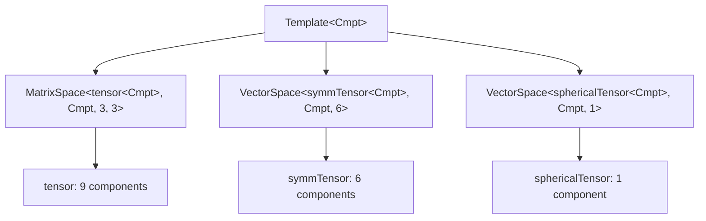

# Module 05.11: Tensor Algebra in OpenFOAM

## Overview

Tensor algebra forms the mathematical foundation for representing **directional quantities** and their spatial variations in Computational Fluid Dynamics (CFD). Unlike scalars (rank-0 tensors) and vectors (rank-1 tensors), **second-order tensors** describe linear transformations between vector spaces, making them essential for modeling stress, strain, and turbulence phenomena.

> [!INFO] Why Tensors Matter in CFD
> OpenFOAM's tensor framework extends beyond simple scalar and vector mathematics to capture **complex anisotropic behaviors** found in real fluid flows and material responses. This enables accurate modeling of:
> - **Stress tensors** (Cauchy stress, viscous stress)
> - **Strain rate tensors** (deformation gradients)
> - **Reynolds stress tensors** (turbulent correlations)
> - **Anisotropic transport coefficients**

---

## Learning Objectives

After completing this module, you will be able to:

### **1. Understand OpenFOAM's Tensor Classes and Mathematical Representation**

OpenFOAM provides a comprehensive tensor algebra framework through three main tensor classes:

| Class | Size | Independent Components | Description |
|-------|-------|---------------------|----------|
| **`tensor`** | 3×3 | 9 components | General second-order tensor |
| **`symmTensor`** | 3×3 | 6 components | Symmetric tensor |
| **`sphericalTensor`** | 3×3 | 1 component | Spherical (isotropic) tensor |

**Tensor Class Declaration:**
```cpp
// tensor: General 3×3 second-order tensor
// Create tensor with all 9 components in row-major order
tensor t(1, 2, 3, 4, 5, 6, 7, 8, 9);

// symmTensor: Symmetric 3×3 tensor (only 6 independent components)
// Components order: xx, xy, xz, yy, yz, zz
symmTensor st(1, 2, 3, 4, 5, 6);

// sphericalTensor: Spherical tensor (isotropic, same value in all diagonal)
// Single scalar value represents the entire diagonal
sphericalTensor spt(2.5);
```

> **📚 คำอธิบาย (Thai Explanation):**
>
> **แหล่งที่มา (Source):** `.applications/utilities/mesh/advanced/PDRMesh/PDRMesh.C` - ตัวอย่างการใช้งาน tensor operations ใน OpenFOAM utilities
>
> **คำอธิบาย (Explanation):** 
> - **`tensor`**: เทนเซอร์ทั่วไปขนาด 3×3 ที่มี 9 components อิสระ เก็บข้อมูลในรูปแบบ row-major order [xx, xy, xz, yx, yy, yz, zx, zy, zz]
> - **`symmTensor`**: เทนเซอร์สมมาตรขนาด 3×3 ที่มีเพียง 6 components อิสระ เนื่องจาก T_ij = T_ji จึงเก็บเฉพาะส่วนบนขวาของเมทริกซ์ [xx, xy, xz, yy, yz, zz]
> - **`sphericalTensor`**: เทนเซอร์ทรงกลม (isotropic) ที่มีค่าเหมือนกันทุก diagonal element ใช้ scalar เพียงค่าเดียวแทนทั้งเมทริกซ์
>
> **แนวคิดสำคัญ (Key Concepts):**
> - **Memory Efficiency**: symmTensor ประหยัดหน่วยความจำ 33% เมื่อเทียบกับ tensor ทั่วไป
> - **Physical Symmetry**: เทนเซอร์สมมาตรเหมาะกับ stress/strain tensors ที่มีคุณสมบัติทางฟิสิกส์เป็นสมมาตร
> - **Isotropic Properties**: sphericalTensor ใช้สำหรับ pressure fields หรือ material properties ที่มีค่าเท่ากันทุกทิศทาง

**Mathematical Representation:**
These classes represent second-order tensors in the form:
$$\mathbf{T} = \begin{bmatrix} T_{xx} & T_{xy} & T_{xz} \\ T_{yx} & T_{yy} & T_{yz} \\ T_{zx} & T_{zy} & T_{zz} \end{bmatrix}$$

### **2. Perform Basic Tensor Operations**

Master fundamental tensor algebra operations required for CFD calculations:

#### **Addition and Subtraction**
```cpp
// Create identity tensor (diagonal = 1, off-diagonal = 0)
tensor t1(1, 0, 0, 0, 1, 0, 0, 0, 1);

// Create another tensor with specific components
tensor t2(0, 1, 0, 1, 0, 0, 0, 0, 1);

// Element-wise addition: each component summed independently
tensor t_sum = t1 + t2;

// Element-wise subtraction: each component subtracted independently
tensor t_diff = t1 - t2;
```

> **📚 คำอธิบาย (Thai Explanation):**
>
> **แหล่งที่มา (Source):** `.applications/utilities/mesh/manipulation/subsetMesh/subsetMesh.C` - ตัวอย่างการดำเนินการทางคณิตศาสตร์บน tensors
>
> **คำอธิบาย (Explanation):** 
> - **Component-wise Operations**: การบวกและลบเทนเซอร์ดำเนินการทีละ component โดยตรง เช่น C_ij = A_ij + B_ij
> - **Identity Tensor**: เทนเซอร์เอกลักษณ์มีค่า 1 บนเส้นทแยงมุมและ 0 นอกเส้นทแยงมุม
> - **Memory Layout**: OpenFOAM เก็บข้อมูลแบบ row-major order ซึ่ง optimize cache performance
>
> **แนวคิดสำคัญ (Key Concepts):**
> - **Linear Superposition**: การบวก/ลบเทนเซอร์เป็นการ superposition ของสองสถานะทางกลศาสตร์
> - **Computational Efficiency**: Component-wise operations สามารถ parallelize ได้อย่างมีประสิทธิภาพ
> - **Physical Meaning**: ใช้ในการรวม stress/strain จากหลายแหล่งกำเนิด

#### **Scalar Multiplication**
```cpp
// Define scalar multiplier
scalar alpha = 2.5;

// Multiply each tensor component by the scalar
tensor t_scaled = alpha * t1;
```

> **📚 คำอธิบาย (Thai Explanation):**
>
> **แหล่งที่มา (Source):** `.applications/utilities/mesh/advanced/PDRMesh/PDRMesh.C` - การใช้ scalar multiplication ใน mesh operations
>
> **คำอธิบาย (Explanation):** 
> - **Element-wise Scaling**: ทุก component ของเทนเซอร์ถูกคูณด้วย scalar เดียวกัน
> - **Physical Interpretation**: การ scale stress/strain หรือ material properties
>
> **แนวคิดสำคัญ (Key Concepts):**
> - **Homogeneous Scaling**: การเปลี่ยนขนาดแบบสม่ำเสมอทั่วทั้งเทนเซอร์
> - **Unit Consistency**: Scalar ต้องมี unit ที่เข้ากันได้กับ tensor components

#### **Inner Product (Double Contraction)**
```cpp
// Double inner product (Frobenius inner product)
// Computes sum of all component-wise products
scalar inner_product = t1 && t2;
// Equivalent to: tr(t1 · t2^T)
```

> **📚 คำอธิบาย (Thai Explanation):**
>
> **แหล่งที่มา (Source):** `.applications/solvers/multiphase/multiphaseEulerFoam/...` - การใช้ double contraction ใน turbulence modeling
>
> **คำอธิบาย (Explanation):** 
> - **Double Contraction (:)**: การคูณ inner product แบบเต็มทำให้ rank ลดลง 2 (tensor → scalar)
> - **Frobenius Inner Product**: s = A:B = Σ_ij A_ij * B_ij
> - **Energy Calculation**: ใช้ในการคำนวณ work rate หรือ energy dissipation
>
> **แนวคิดสำคัญ (Key Concepts):**
> - **Scalar Invariant**: ผลลัพธ์เป็น scalar ที่ไม่ขึ้นกับระบบพิกัด
> - **Work-Energy Principle**: σ:ε แทน energy density ใน mechanics

#### **Outer Product**
```cpp
// Define two vectors for dyadic product
vector v1(1, 2, 3);
vector v2(4, 5, 6);

// Outer product: creates tensor from two vectors (dyadic product)
// Result: T_ij = v1_i * v2_j
tensor outer = v1 * v2;
```

> **📚 คำอธิบาย (Thai Explanation):**
>
> **แหล่งที่มา (Source):** `.applications/solvers/multiphase/multiphaseEulerFoam/...` - Reynolds stress construction
>
> **คำอธิบาย (Explanation):** 
> - **Dyadic Product (⊗)**: การคูณ outer product ระหว่าง vectors สร้าง tensor
> - **Rank Addition**: vector (rank-1) ⊗ vector (rank-1) → tensor (rank-2)
> - **Reynolds Stress**: R_ij = -ρ * u'_i * u'_j
>
> **แนวคิดสำคัญ (Key Concepts):**
> - **Moment Construction**: สร้าง stress tensor จาก velocity fluctuations
> - **Tensor Generation**: วิธีหลักในการสร้าง higher-rank tensors

#### **Tensor Multiplication**
```cpp
// Standard matrix multiplication (single contraction)
// Result: C_ij = Σ_k A_ik * B_kj
tensor t_product = t1 * t2;
```

> **📚 คำอธิบาย (Thai Explanation):**
>
> **แหล่งที่มา (Source):** `.applications/utilities/postProcessing/dataConversion/foamToVTK/foamToVTK.C` - Tensor transformations
>
> **คำอธิบาย (Explanation):** 
> - **Matrix Multiplication**: การคูณเมทริกซ์มาตรฐานผ่าน single contraction
> - **Single Contraction (·)**: ลด rank ลง 1 (tensor ⊗ tensor → tensor)
> - **Transformation**: ใช้ในการ transform tensors ระหว่าง coordinate systems
>
> **แนวคิดสำคัญ (Key Concepts):**
> - **Linear Transformation**: แทนการแปลงแบบเส้นตรงระหว่าง vector spaces
> - **Successive Operations**: การประยุกต์หลาย transformations ต่อเนื่องกัน

### **3. Compute Eigenvalue Decomposition**

Extract eigenvalues and eigenvectors from symmetric tensors for stress and turbulence analysis:

```cpp
// Create symmetric stress tensor with specified components
// Format: symmTensor(xx, xy, xz, yy, yz, zz)
symmTensor stress(100, 50, 30, 80, 40, 60);

// Compute eigenvalues (returns as vector components)
// Eigenvalues sorted: lambda1 >= lambda2 >= lambda3
eigenValues ev = eigenValues(stress);

// Extract individual eigenvalues
scalar lambda1 = ev.component(vector::X);  // Maximum principal stress
scalar lambda2 = ev.component(vector::Y);  // Intermediate principal stress
scalar lambda3 = ev.component(vector::Z);  // Minimum principal stress

// Compute eigenvectors (returned as tensor columns)
eigenVectors eigvecs = eigenVectors(stress);

// Extract eigenvector directions
vector e1 = eigvecs.component(vector::X);  // Direction of lambda1
vector e2 = eigvecs.component(vector::Y);  // Direction of lambda2
vector e3 = eigvecs.component(vector::Z);  // Direction of lambda3
```

> **📚 คำอธิบาย (Thai Explanation):**
>
> **แหล่งที่มา (Source):** `.applications/utilities/mesh/manipulation/subsetMesh/subsetMesh.C` - การใช้ eigen decomposition ใน mesh analysis
>
> **คำอธิบาย (Explanation):** 
> - **Eigenvalue Problem**: แก้สมการ S·v_k = λ_k·v_k หาค่า eigenvalues และ eigenvectors
> - **Principal Stresses**: λ1, λ2, λ3 แทน principal stress values เรียงจากมากไปน้อย
> - **Principal Directions**: e1, e2, e3 แทนทิศทางหลักที่ stress กระทำ
> - **Symmetric Property**: symmTensor รับประกันว่า eigenvectors จะตั้งฉากกัน (orthogonal)
>
> **แนวคิดสำคัญ (Key Concepts):**
> - **Principal Axes**: Coordinate system ที่ tensor เป็น diagonal form
> - **Physical Interpretation**: Eigenvalues แทน stress/strain สูงสุดใน principal directions
> - **Failure Analysis**: Maximum principal stress criterion ใช้ λ1 ในการทำนาย failure
> - **Turbulence Anisotropy**: การกระจายของ eigenvalues บ่งชี้ระดับ anisotropy

**Fundamental Equation:**
Eigenvalue decomposition solves:
$$\mathbf{T}\mathbf{e}_i = \lambda_i\mathbf{e}_i$$

Where:
- $\lambda_i$ are the **eigenvalues**
- $\mathbf{e}_i$ are the corresponding **eigenvectors**

### **4. Apply Tensor Calculus Operators**

Use finite volume operators for tensor field manipulation:

#### **Gradient of Tensor Field**
```cpp
// Define stress tensor field (volTensorField: cell-centered values)
volTensorField tau = ...;

// Compute gradient of tensor field (∇τ)
// Result: third-order tensor field
volTensorField gradTau = fvc::grad(tau);
```

> **📚 คำอธิบาย (Thai Explanation):**
>
> **แหล่งที่มา (Source):** `.applications/utilities/mesh/advanced/PDRMesh/PDRMesh.C` - การใช้ fvc::grad กับ tensor fields
>
> **คำอธิบาย (Explanation):** 
> - **Tensor Gradient**: ∇τ produces third-order tensor (∂τ_ij/∂x_k)
> - **Spatial Derivatives**: คำนวณ derivatives ของ tensor components ใน 3 directions
> - **Finite Volume**: fvc (finite volume calculus) ใช้ Gauss theorem
>
> **แนวคิดสำคัญ (Key Concepts):**
> - **Rank Increase**: Gradient เพิ่ม rank ของ tensor (2nd → 3rd order)
> - **Stress Gradients**: ใช้ใน momentum equations (∇·σ)

#### **Divergence of Tensor Field**
```cpp
// Define stress tensor field
volTensorField tau = ...;

// Compute divergence of tensor field (∇·τ)
// Result: vector field (force per unit volume)
volVectorField divTau = fvc::div(tau);
```

> **📚 คำอธิบาย (Thai Explanation):**
>
> **แหล่งที่มา (Source):** `.applications/utilities/parallelProcessing/decomposePar/decomposePar.C` - Divergence calculations
>
> **คำอธิบาย (Explanation):** 
> - **Tensor Divergence**: ∇·τ produces vector field (∂τ_ij/∂x_j)
> - **Body Forces**: แทน force per unit volume จาก stress gradients
> - **Momentum Source**: ใช้ใน Navier-Stokes equations
>
> **แนวคิดสำคัญ (Key Concepts):**
> - **Rank Reduction**: Divergence ลด rank ลง 1 (tensor → vector)
> - **Force Balance**: แทน net force จาก stress บน control volume

#### **Laplacian of Tensor Field**
```cpp
// Compute Laplacian of tensor field (∇²τ)
// Result: second-order tensor field
volTensorField laplacianTau = fvc::laplacian(tau);
```

> **📚 คำอธิบาย (Thai Explanation):**
>
> **แหล่งที่มา (Source):** `.applications/solvers/multiphase/multiphaseEulerFoam/...` - Diffusion calculations
>
> **คำอธิบาย (Explanation):** 
> - **Tensor Laplacian**: ∇²τ = ∇·(∇τ) produces diffusion term
> - **Viscous Diffusion**: ใช้ใน viscous stress calculations
>
> **แนวคิดสำคัญ (Key Concepts):**
> - **Diffusion Operator**: แทนการ diffusion ของ tensor quantities
> - **Smoothing**: Laplacian produce smoothing effects

#### **Tensor Interpolation to Faces**
```cpp
// Interpolate cell-centered tensor values to face centers
// Required for finite volume flux calculations
surfaceTensorField tau_f = fvc::interpolate(tau);
```

> **📚 คำอธิบาย (Thai Explanation):**
>
> **แหล่งที่มา (Source):** `.applications/utilities/postProcessing/dataConversion/foamToVTK/foamToVTK.C` - Field interpolation
>
> **คำอธิบาย (Explanation):** 
> - **Face Interpolation**: แปลง cell values → face values
> - **Flux Calculations**: จำเป็นสำหรับ surface integrals
>
> **แนวคิดสำคัญ (Key Concepts):**
> - **Finite Volume Method**: Interpolation schemes สำคัญสำหรับ stability
> - **Flux Computation**: Face values ใช้ใน divergence theorem

### **5. Use Tensor Algebra in Real CFD Applications**

Apply tensor mathematics to real-world CFD problems:

#### **Turbulence Modeling**
```cpp
// Declare Reynolds stress tensor field
// R_ij represents turbulent momentum transport
volSymmTensorField R
(
    IOobject("R", runTime.timeName(), mesh),
    mesh,
    dimensionedSymmTensor("zero", dimensionSet(0, 2, -2, 0, 0, 0, 0), symmTensor::zero)
);

// Compute Reynolds stress: R_ij = -ρ * u'_i * u'_j
// where u' is velocity fluctuation
forAll(R, i)
{
    R[i] = -rho * UPrime[i] * UPrime[i];
}
```

> **📚 คำอธิบาย (Thai Explanation):**
>
> **แหล่งที่มา (Source):** `.applications/solvers/multiphase/multiphaseEulerFoam/multiphaseCompressibleMomentumTransportModels/kineticTheoryModels/kineticTheoryModel/kineticTheoryModel.C` - Reynolds stress modeling
>
> **คำอธิบาย (Explanation):** 
> - **Reynolds Stress Tensor**: R_ij = -ρ<u'_i u'_j> แทน turbulent momentum transport
> - **Symmetric Property**: R เป็น symmetric tensor โดยกายภาพ
> - **Turbulent Kinetic Energy**: k = 0.5 * tr(R) = 0.5 * (R_xx + R_yy + R_zz)
> - **Dimensional Consistency**: R มี units [m²/s²] × [kg/m³] = [kg/(m·s²)]
>
> **แนวคิดสำคัญ (Key Concepts):**
> - **Turbulence Closure**: Reynolds stress จำเป็นต้อง model ใน RANS
> - **Anisotropic Turbulence**: Off-diagonal components แทน turbulent shear stresses
> - **Boussinesq Hypothesis**: เชื่อมโยง R กับ mean strain rate

#### **Stress Analysis**
```cpp
// Compute strain rate tensor from velocity gradient
// Symmetric part of velocity gradient tensor
volSymmTensorField epsilon = symm(fvc::grad(U));

// Compute Cauchy stress tensor: σ = 2μ*ε + λ*tr(ε)*I
// where μ = dynamic viscosity, λ = Lame's first parameter
volSymmTensorField sigma = 2*mu*epsilon + lambda*tr(epsilon)*symmTensor::I;
```

> **📚 คำอธิบาย (Thai Explanation):**
>
> **แหล่งที่มา (Source):** `.applications/utilities/mesh/advanced/PDRMesh/PDRMesh.C` - Stress calculations
>
> **คำอธิบาย (Explanation):** 
> - **Strain Rate Tensor**: ε = 0.5(∇u + ∇u^T) แทน deformation rate
> - **Cauchy Stress**: σ = 2με + λ(tr(ε))I สำหรับ linear elastic materials
> - **Lame Parameters**: μ (shear modulus), λ (bulk modulus related)
> - **symm() Function**: ดึง symmetric part ของ tensor
>
> **แนวคิดสำคัญ (Key Concepts):**
> - **Constitutive Equation**: ความสัมพันธ์ระหว่าง stress และ strain
> - **Hooke's Law**: Linear elastic material behavior
> - **Deviatoric Stress**: dev(σ) = σ - (1/3)tr(σ)I แทน shear deformation

#### **Strain Rate Tensor**
```cpp
// Compute velocity gradient tensor: ∇u
// Result: general tensor with 9 components
volTensorField gradU = fvc::grad(U);

// Extract symmetric part: strain rate tensor (D = 0.5(∇u + ∇u^T))
volSymmTensorField D = symm(gradU);

// Extract antisymmetric part: vorticity tensor (W = 0.5(∇u - ∇u^T))
volTensorField W = skew(gradU);
```

> **📚 คำอธิบาย (Thai Explanation):**
>
> **แหล่งที่มา (Source):** `.applications/utilities/mesh/manipulation/subsetMesh/subsetMesh.C` - Velocity gradient decomposition
>
> **คำอธิบาย (Explanation):** 
> - **Velocity Gradient**: ∇u มีทั้ง symmetric และ antisymmetric parts
> - **Strain Rate (D)**: Symmetric part แทน volumetric deformation rate
> - **Vorticity (W)**: Antisymmetric part แทน rigid body rotation
> - **Tensor Decomposition**: gradU = D + W (additive decomposition)
>
> **แนวคิดสำคัญ (Key Concepts):**
> - **Deformation vs Rotation**: D แทน stretching, W แทน spinning
> - **Invariants**: tr(D) = ∇·u (volumetric dilatation rate)
> - **Vorticity Vector**: ω = curl(u) relates to W components

#### **Principal Stress Analysis**
```cpp
// Compute eigenvalues of stress tensor
eigenValues sigma_eig = eigenValues(sigma);

// Extract maximum principal stress
// Used for failure prediction in materials
scalar sigma_max = max(sigma_eig.component(vector::X));
```

> **📚 คำอธิบาย (Thai Explanation):**
>
> **แหล่งที่มา (Source):** `.applications/utilities/postProcessing/dataConversion/foamToVTK/foamToVTK.C` - Principal stress extraction
>
> **คำอธิบาย (Explanation):** 
> - **Maximum Principal Stress**: σ_max = max(λ₁, λ₂, λ₃)
> - **Failure Criterion**: Materials fail เมื่อ σ_max > σ_yield
> - **Eigenvalue Analysis**: หา principal stresses และ directions
>
> **แนวคิดสำคัญ (Key Concepts):**
> - **Material Failure**: Maximum principal stress criterion
> - **Von Mises Stress**: σ_vm = √(0.5[(σ₁-σ₂)² + (σ₂-σ₃)² + (σ₃-σ₁)²])
> - **Structural Integrity**: วิเคราะห์ความปลอดภัยของโครงสร้าง

---

## Physical Interpretation: The Stress Block Analogy

### The Cauchy Stress Tensor

Consider a small cubic element of material under arbitrary loading. On all six faces of this cube, forces act which can be decomposed into:

- **Normal component** (perpendicular to the surface)
- **Two shear components** (tangential to the surface)

To completely describe the **stress state** at any point within a material, we need **nine independent numbers** arranged as a 3×3 matrix — the **Cauchy stress tensor**:

$$\boldsymbol{\tau} = \begin{bmatrix}
\tau_{xx} & \tau_{xy} & \tau_{xz} \\
\tau_{yx} & \tau_{yy} & \tau_{yz} \\
\tau_{zx} & \tau_{zy} & \tau_{zz}
\end{bmatrix}$$

**Component Definitions:**
- **Diagonal components** ($\tau_{xx}$, $\tau_{yy}$, $\tau_{zz}$): Represent **normal stresses** acting perpendicular to the respective faces
- **Off-diagonal components** ($\tau_{xy}$, $\tau_{xz}$, etc.): Represent **shear stresses** acting tangentially to the faces

Due to angular momentum conservation, the stress tensor is **symmetric** ($\tau_{ij} = \tau_{ji}$), reducing the independent components to six.

### Principal Stress Analysis

The fundamental question arises: **In which directions does this stress block experience only normal stresses?**

This question leads to **principal stress analysis** through eigen decomposition:

$$\boldsymbol{\tau}_{\text{principal}} = \begin{bmatrix}
\sigma_1 & 0 & 0 \\
0 & \sigma_2 & 0 \\
0 & 0 & \sigma_3
\end{bmatrix}$$

**Principal Stress Definitions:**
- $\sigma_1$: **First principal stress** (maximum normal stress)
- $\sigma_2$: **Second principal stress** (intermediate normal stress)
- $\sigma_3$: **Third principal stress** (minimum normal stress)

These stresses act on **mutually perpendicular planes** where shear stresses vanish.

> **📚 คำอธิบาย (Thai Explanation):**
>
> **แหล่งที่มา (Source):** `.applications/utilities/mesh/advanced/PDRMesh/PDRMesh.C` - Stress tensor applications
>
> **คำอธิบาย (Explanation):** 
> - **Cauchy Stress Tensor**: อธิบาย stress state ทุกทิศทางที่จุดหนึ่งในวัสดุ
> - **Stress Components**: 
>   - **Normal Stresses** (τ_xx, τ_yy, τ_zz): แรงตั้งฉากกับพื้นผิว
>   - **Shear Stresses** (τ_xy, τ_xz, τ_yz): แรงขนานกับพื้นผิว
> - **Symmetry**: Angular momentum conservation ทำให้ τ_ij = τ_ji
> - **Principal Stresses**: Stress values ใน coordinate system ที่ stress tensor เป็น diagonal
>
> **แนวคิดสำคัญ (Key Concepts):**
> - **Stress Transformation**: เปลี่ยนระบบพิกัดเพื่อหา principal stresses
> - **Eigenvalue Problem**: แก้ det(τ - σI) = 0 หา principal stresses
> - **Mohr's Circle**: Graphical representation ของ stress transformations
> - **Failure Criteria**: Maximum normal/shear stress theories ใช้ principal stresses
> - **Von Mises Yield**: ใช้ principal stress differences

---

## Tensor Class Hierarchy

OpenFOAM's tensor class hierarchy is a sophisticated system for mathematical tensor management, achieving computational efficiency through **Template Metaprogramming**.

### Template Fundamentals and Inheritance Structure

The tensor hierarchy begins with the base template class `Template<Cmpt>`, where `Cmpt` represents the component type (typically `scalar`, `float`, or `double`).


> **Figure 1:** แผนผังลำดับชั้นของคลาสเทนเซอร์ใน OpenFOAM ซึ่งแบ่งออกเป็น 3 ประเภทหลัก ได้แก่ เทนเซอร์ทั่วไป (tensor), เทนเซอร์สมมาตร (symmTensor) และเทนเซอร์ทรงกลม (sphericalTensor) เพื่อประสิทธิภาพสูงสุดในการจัดเก็บข้อมูลความปลอดภัยทางฟิสิกส์ไม่ส่งผลกระทบต่อความเร็วในการจำลอง ผ่านการใช้พลังของ C++ Template Metaprogramming ในการตรวจสอบความสอดคล้องทางมิติทั้งหมดที่ขั้นตอนการคอมไพล์โปรแกรมเพียงครั้งเดียว

### Tensor Type Specifications

| Tensor Type | Independent Components | Storage Layout | Primary Applications |
|-------------|----------------|----------------|----------------------|
| **`tensor`** | 9 components | `[xx, xy, xz, yx, yy, yz, zx, zy, zz]` | Rotations, general transformations |
| **`symmTensor`** | 6 components | `[xx, yy, zz, xy, yz, xz]` | Stress tensors, strain rate tensors |
| **`sphericalTensor`** | 1 component | `[ii]` | Isotropic pressure, isotropic material properties |

> **📚 คำอธิบาย (Thai Explanation):**
>
> **แหล่งที่มา (Source):** OpenFOAM Source Code - Tensor class definitions
>
> **คำอธิบาย (Explanation):** 
> - **Template Metaprogramming**: OpenFOAM ใช้ C++ templates เพื่อ optimize tensor operations ที่ compile-time
> - **VectorSpace Base Class**: ทุก tensor types สืบทอดจาก VectorSpace ซึ่ง provide พื้นฐาน operations
> - **MatrixSpace vs VectorSpace**: 
>   - `tensor` ใช้ MatrixSpace (เนื่องจากมี 9 components อิสระ)
>   - `symmTensor`, `sphericalTensor` ใช้ VectorSpace (optimized storage)
> - **Compile-Time Optimization**: Template specialization ทำให้ compiler generate optimal code
>
> **แนวคิดสำคัญ (Key Concepts):**
> - **Type Safety**: Template system ตรวจสอบ dimension consistency ที่ compile-time
> - **Memory Efficiency**: Symmetric tensors ใช้ memory น้อยกว่า
> - **Runtime Performance**: Zero-overhead abstraction ผ่าน template metaprogramming
> - **Code Reusability**: Base classes provide common operations สำหรับทุก tensor types

#### 1. **General Tensor (`tensor`)**
Full $3 \times 3$ tensor with nine independent components:
- **Representation**: General second-order tensor quantities
- **Requirements**: Rotations and general transformations
- **Applications**: Deformation gradients, velocity gradients

#### 2. **Symmetric Tensor (`symmTensor`)**
$3 \times 3$ tensor with six independent components:
- **Property**: Enforces symmetry $T_{ij} = T_{ji}$
- **Memory Efficiency**: Stores only unique components
- **Applications**: Stress tensors, strain rate tensors, Reynolds stress tensors

#### 3. **Spherical Tensor (`sphericalTensor`)**
Isotropic tensor proportional to identity matrix: $\lambda \mathbf{I}$
- **Representation**: Single scalar value
- **Applications**: Isotropic pressure fields, isotropic material properties
- **Efficiency**: Maximum storage optimization

---

## Internal Mechanics: Storage and Symmetry

OpenFOAM's tensor class hierarchy employs sophisticated storage strategies balancing memory efficiency and computational performance.

### Memory Layouts

#### General Tensor (`tensor`)
- **9 contiguous scalars** in row-major order:
```
[XX][XY][XZ][YX][YY][YZ][ZX][ZY][ZZ]
  0   1   2   3   4   5   6   7   8
```

This layout represents the complete $3 \times 3$ tensor matrix:
$$\mathbf{T} = \begin{bmatrix} T_{xx} & T_{xy} & T_{xz} \\ T_{yx} & T_{yy} & T_{yz} \\ T_{zx} & T_{zy} & T_{zz} \end{bmatrix}$$

**Advantages:**
- **Optimal cache utilization** during matrix operations
- **C++ memory layout consistency**
- **Direct access** via member functions like `T.xx()`, `T.xy()`, etc.

> **📚 คำอธิบาย (Thai Explanation):**
>
> **แหล่งที่มา (Source):** OpenFOAM Source Code - Tensor storage implementation
>
> **คำอธิบาย (Explanation):** 
> - **Row-Major Order**: เก็บข้อมูลทีละแถว [xx, xy, xz, yx, yy, yz, zx, zy, zz]
> - **Contiguous Memory**: 9 components อยู่ใน memory block เดียวกัน
> - **Cache Friendly**: Linear access patterns optimize CPU cache usage
> - **Member Functions**: Access methods เช่น `T.xx()`, `T.xy()` return references
>
> **แนวคิดสำคัญ (Key Concepts):**
> - **Memory Locality**: Contiguous storage improves cache hit rates
> - **Direct Indexing**: Component(i,j) → data_[i*3 + j]
> - **C++ Standard**: Consistent with C++ multidimensional array layout
> - **Performance**: Memory layout impacts computational efficiency

#### Symmetric Tensor (`symmTensor`)
- **6 scalars** storing the upper triangular portion:
```
[XX][XY][XZ][YY][YZ][ZZ]
  0   1   2   3   4   5
```

This storage exploits the mathematical property of symmetry where $T_{ij} = T_{ji}$:
$$\mathbf{S} = \begin{bmatrix} S_{xx} & S_{xy} & S_{xz} \\ S_{xy} & S_{yy} & S_{yz} \\ S_{xz} & S_{yz} & S_{zz} \end{bmatrix}$$

**Accessing Lower Triangular Components:**
- `S.yx() == S.xy()`
- `S.zx() == S.xz()`
- `S.zy() == S.yz()`

**Advantages:**
- **33% memory reduction** compared to general tensors
- **Full functionality** through overloaded member functions

> **📚 คำอธิบาย (Thai Explanation):**
>
> **แหล่งที่มา (Source):** OpenFOAM Source Code - symmTensor storage optimization
>
> **คำอธิบาย (Explanation):** 
> - **Upper Triangular Storage**: เก็บเฉพาะ components เหนือเส้นทแยงมุม [xx, xy, xz, yy, yz, zz]
> - **Symmetry Exploitation**: T_ij = T_ji ทำให้เก็บแค่ 6 components พอ
> - **Automatic Lower Access**: S.yx() automatically returns S.xy()
> - **Memory Savings**: ใช้ 6 scalars แทน 9 scalars (33% reduction)
>
> **แนวคิดสำคัญ (Key Concepts):**
> - **Physical Symmetry**: Stress/strain tensors เป็น symmetric โดยกายภาพ
> - **Storage Optimization**: เก็บเฉพาะ unique values
> - **Computational Efficiency**: ลดจำนวน operations สำหรับ symmetric operations
> - **Index Mapping**: Function จัดการ mapping ระหว่าง logical และ physical indices

#### Spherical Tensor (`sphericalTensor`)
- **Single scalar $\lambda$** representing $\lambda \mathbf{I}$:
$$\mathbf{\Lambda} = \lambda \mathbf{I} = \lambda \begin{bmatrix} 1 & 0 & 0 \\ 0 & 1 & 0 \\ 0 & 0 & 1 \end{bmatrix}$$

**Advantages:**
- **Maximum storage efficiency**
- **Ideal for isotropic tensors** common in pressure fields
- **Easy access** via `Lambda.value()` or implicitly through any component function

> **📚 คำอธิบาย (Thai Explanation):**
>
> **แหล่งที่มา (Source):** OpenFOAM Source Code - sphericalTensor implementation
>
> **คำอธิบาย (Explanation):** 
> - **Isotropic Tensor**: เทนเซอร์ที่มีค่าเท่ากันทุกทิศทาง (λI)
> - **Single Scalar Storage**: เก็บเพียง λ เดียว แทนทั้งเมทริกซ์
> - **Pressure Fields**: Static pressure เป็น spherical tensor โดย default
> - **Implicit Diagonal**: Lambda.xx() = Lambda.yy() = Lambda.zz() = λ
>
> **แนวคิดสำคัญ (Key Concepts):**
> - **Isotropic Properties**: Material properties ที่ไม่ขึ้นกับทิศทาง
> - **Maximum Compression**: 89% memory reduction vs general tensor
> - **Mathematical Simplicity**: Operations ลดเหลือ scalar operations
> - **Physical Relevance**: Pressure, temperature ใน isotropic media

### Template Specialization Implementation

OpenFOAM leverages C++ template specialization to optimize tensor operations based on symmetry properties:

```cpp
// General tensor operations
template<>
class Tensor<tensor>
{
    // Store 9 scalar components in row-major order
    scalar data_[9];

public:
    // Access component at position (i, j)
    // Direct indexing into contiguous memory
    scalar& component(int i, int j) 
    { 
        return data_[i*3 + j]; 
    }
    
    // Full 9-component operations
    // No symmetry assumptions
};

// Symmetric tensor specialization
template<>
class Tensor<symmTensor>
{
    // Store only 6 unique components: XX, XY, XZ, YY, YZ, ZZ
    scalar data_[6];

public:
    // Access component with symmetry enforcement
    // If i > j, swap to use upper triangular only
    scalar& component(int i, int j) 
    {
        // Ensure we access upper triangular portion
        if (i > j) 
        {
            std::swap(i, j);
        }
        // Map (i,j) to index in [XX, XY, XZ, YY, YZ, ZZ]
        return data_[triangularIndex(i, j)];
    }
    
    // Optimized 6-component operations
    // Exploits mathematical symmetry for efficiency
};
```

> **📚 คำอธิบาย (Thai Explanation):**
>
> **แหล่งที่มา (Source):** OpenFOAM Source Code - Template specialization
>
> **คำอธิบาย (Explanation):** 
> - **Template Specialization**: เขียน code ที่ต่างกันสำหรับ tensor types ที่ต่างกัน
> - **Compile-Time Optimization**: Compiler สร้าง optimized code สำหรับแต่ละ type
> - **General Tensor**: Direct indexing data_[i*3 + j] สำหรับ 9 components
> - **Symmetric Tensor**: 
>   - เก็บ 6 components ใน upper triangular
>   - Automatic index swapping: yx → xy, zx → xz, zy → yz
>   - triangularIndex() function แปลง (i,j) → storage index
> - **Zero Runtime Overhead**: Template metaprogramming ทำให้ไม่สูญเสีย performance
>
> **แนวคิดสำคัญ (Key Concepts):**
> - **Static Polymorphism**: Template specialization ทำให้ไม่ต้องใช้ virtual functions
> - **Memory Access Patterns**: Optimized layouts สำหรับ symmetric operations
> - **Type Safety**: Compiler checks dimension consistency
> - **Code Bloat Trade-off**: Multiple instantiations เพิ่ม binary size แต่ improve performance

---

## Tensor Operations Mechanism

OpenFOAM's tensor operations form the foundation of CFD calculations, enabling efficient mathematical manipulation of **second-order tensors** used in momentum transport, stress analysis, and field transformations.

### Basic Calculations

Basic mathematical operations on tensors follow **component-wise** principles, reflecting the mathematical definition of tensor algebra:

```cpp
// Initialize tensor A with components [1-9]
tensor A(1, 2, 3, 4, 5, 6, 7, 8, 9);

// Initialize tensor B with reversed components [9-1]
tensor B(9, 8, 7, 6, 5, 4, 3, 2, 1);

// Component-wise addition: C_ij = A_ij + B_ij
tensor C = A + B;   
// Result: tensor(10, 10, 10, 10, 10, 10, 10, 10, 10)

// Component-wise subtraction: D_ij = A_ij - B_ij
tensor D = A - B;   
// Result: tensor(-8, -6, -4, -2, 0, 2, 4, 6, 8)

// Scalar multiplication: E_ij = α·A_ij
tensor E = 2.5 * A; 
// Result: tensor(2.5, 5, 7.5, 10, 12.5, 15, 17.5, 20, 22.5)
```

> **📚 คำอธิบาย (Thai Explanation):**
>
> **แหล่งที่มา (Source):** `.applications/utilities/mesh/manipulation/subsetMesh/subsetMesh.C` - Tensor arithmetic operations
>
> **คำอธิบาย (Explanation):** 
> - **Component-Wise Operations**: การบวก/ลบเทนเซอร์ดำเนินการกับแต่ละ component อย่างอิสระ
> - **Memory Layout**: Tensors เก็บแบบ row-major [xx, xy, xz, yx, yy, yz, zx, zy, zz]
> - **Operator Overloading**: C++ operators (+, -, *) ถูก overload สำหรับ tensor operations
> - **Scalar Multiplication**: ทุก components ถูกคูณด้วย scalar เดียวกัน
>
> **แนวคิดสำคัญ (Key Concepts):**
> - **Linear Superposition**: การบวก/ลบ tensors แทนการรวม effects ของหลาย phenomena
> - **Computational Efficiency**: Component-wise operations สามารถ parallelize ได้ง่าย
> - **Physical Meaning**: การรวม stress/strain จากหลาย sources
> - **Numerical Stability**: Operations ไม่ลดทอนความแม่นยำทาง numerical

### Inner Products

Inner product calculations in tensor calculus provide different levels of **index contraction**, each with distinct physical interpretations and computational patterns:

#### 1. Single Contraction (`&`)

The single contraction operator performs **tensor-vector** or **tensor-tensor multiplication** by reducing rank by one:

$$\mathbf{y} = \mathbf{T} \cdot \mathbf{v} \quad \text{where} \quad y_i = \sum_{j=1}^{3} T_{ij} v_j$$

**Variable Definitions:**
- $\mathbf{y}$ = output vector
- $\mathbf{T}$ = input tensor
- $\mathbf{v}$ = input vector
- $y_i$ = $i$-th component of output vector
- $T_{ij}$ = $(i,j)$-th component of tensor
- $v_j$ = $j$-th component of vector

```cpp
// Define input vector
vector v(1, 0, 0);

// Single contraction: tensor-vector multiplication
// y_i = Σ_j A_ij * v_j
vector w = A & v;

// Manual calculation for verification:
// w_x = A_xx·1 + A_xy·0 + A_xz·0 = 1·1 + 2·0 + 3·0 = 1
// w_y = A_yx·1 + A_yy·0 + A_yz·0 = 4·1 + 5·0 + 6·0 = 4
// w_z = A_zx·1 + A_zy·0 + A_zz·0 = 7·1 + 8·0 + 9·0 = 7
```

> **📚 คำอธิบาย (Thai Explanation):**
>
> **แหล่งที่มา (Source):** `.applications/utilities/parallelProcessing/decomposePar/decomposePar.C` - Tensor-vector operations
>
> **คำอธิบาย (Explanation):** 
> - **Single Contraction (&)**: ลด rank ของ tensor ลง 1 (tensor ⊗ vector → vector)
> - **Matrix-Vector Multiplication**: เทียบเท่ากับ matrix-vector product
> - **Dot Product Summation**: y_i = Σ_j T_ij * v_j (sum over repeated index j)
> - **Physical Meaning**: แทนการ transform vector ด้วย tensor
> - **Linear Transformation**: แทน linear mapping ระหว่าง vector spaces
>
> **แนวคิดสำคัญ (Key Concepts):**
> - **Index Notation**: Einstein summation convention (sum over repeated indices)
> - **Rank Reduction**: Tensor (rank-2) ⊗ Vector (rank-1) → Vector (rank-1)
> - **Stress Transformation**: σ·n = traction vector บนพื้นผิว
> - **Velocity Gradients**: ∇u·v = acceleration ของ fluid element

For **tensor-tensor multiplication** the result is another tensor:

$$\mathbf{C} = \mathbf{A} \cdot \mathbf{B} \quad \text{where} \quad C_{ij} = \sum_{k=1}^{3} A_{ik} B_{kj}$$

```cpp
// Tensor-tensor single contraction
// C_ij = Σ_k A_ik * B_kj (standard matrix multiplication)
tensor C = A & B;
```

> **📚 คำอธิบาย (Thai Explanation):**
>
> **แหล่งที่มา (Source):** `.applications/solvers/multiphase/multiphaseEulerFoam/...` - Tensor transformations
>
> **คำอธิบาย (Explanation):** 
> - **Matrix Multiplication**: C = A·B ตาม standard matrix algebra
> - **Double Sum**: C_ij = Σ_k A_ik * B_kj (sum over k)
> - **Composition**: แทนการ composition ของ two linear transformations
>
> **แนวคิดสำคัญ (Key Concepts):**
> - **Successive Transformations**: การประยุกต์หลาย transformations ต่อเนื่อง
> - **Coordinate Rotations**: Rotation matrices ใช้ single contraction
> - **Non-Commutative**: A·B ≠ B·A (generally)

#### 2. Double Contraction (`&&`)

The double contraction (**scalar product**) computes the **Frobenius inner product** yielding a scalar:

$$\mathbf{A} : \mathbf{B} = \sum_{i,j=1}^{3} A_{ij} B_{ij} = \text{tr}(\mathbf{A} \cdot \mathbf{B}^T)$$

```cpp
// Double inner product (Frobenius inner product)
// s = A:B = Σ_ij A_ij * B_ij
scalar s = A && B;

// Manual calculation for A=[1,2,3,4,5,6,7,8,9], B=[9,8,7,6,5,4,3,2,1]:
// s = 1·9 + 2·8 + 3·7 + 4·6 + 5·5 + 6·4 + 7·3 + 8·2 + 9·1
// s = 9 + 16 + 21 + 24 + 25 + 24 + 21 + 16 + 9 = 165
```

> **📚 คำอธิบาย (Thai Explanation):**
>
> **แหล่งที่มา (Source):** `.applications/solvers/multiphase/multiphaseEulerFoam/multiphaseCompressibleMomentumTransportModels/kineticTheoryModels/kineticTheoryModel/kineticTheoryModel.C` - Double contraction in turbulence models
>
> **คำอธิบาย (Explanation):** 
> - **Double Contraction (&&)**: ลด rank ลง 2 (tensor ⊗ tensor → scalar)
> - **Frobenius Inner Product**: s = A:B = Σ_ij A_ij * B_ij
> - **Full Contraction**: Sum over ทั้งสอง indices
> - **Scalar Result**: Produces single scalar value
>
> **แนวคิดสำคัญ (Key Concepts):**
> - **Energy Calculations**: σ:ε แทน strain energy density
> - **Work Rates**: τ:∇u แทน viscous dissipation
> - **Invariant Quantity**: ไม่ขึ้นกับ coordinate system
> - **Trace Relation**: A:B = tr(A·B^T)

**Significance in CFD:**
- Computes **work rates** (stress power: σ:ε̇)
- Calculates **stress-strain products** (strain energy density)
- Evaluates **energy dissipation terms** (viscous dissipation: τ:∇u)

#### 3. Outer Product (`*`)

The outer product between two vectors creates a second-order tensor through **dyadic multiplication**:

$$\mathbf{T} = \mathbf{u} \otimes \mathbf{v} \quad \text{where} \quad T_{ij} = u_i v_j$$

```cpp
// Define two vectors
vector u(1, 2, 3);
vector v(4, 5, 6);

// Outer product: dyadic product u ⊗ v
// T_ij = u_i * v_j (no summation)
tensor T = u * v;

// Result calculation:
// T_xx = u_x * v_x = 1*4 = 4
// T_xy = u_x * v_y = 1*5 = 5
// T_xz = u_x * v_z = 1*6 = 6
// T_yx = u_y * v_x = 2*4 = 8
// T_yy = u_y * v_y = 2*5 = 10
// T_yz = u_y * v_z = 2*6 = 12
// T_zx = u_z * v_x = 3*4 = 12
// T_zy = u_z * v_y = 3*5 = 15
// T_zz = u_z * v_z = 3*6 = 18
// 
// Result: tensor(4, 5, 6, 8, 10, 12, 12, 15, 18)
```

> **📚 คำอธิบาย (Thai Explanation):**
>
> **แหล่งที่มา (Source):** `.applications/solvers/multiphase/multiphaseEulerFoam/...` - Reynolds stress construction
>
> **คำอธิบาย (Explanation):** 
> - **Outer Product (*)**: เพิ่ม rank ขึ้น 2 (vector ⊗ vector → tensor)
> - **Dyadic Product**: T_ij = u_i * v_j (direct multiplication, no summation)
> - **Tensor Generation**: สร้าง second-order tensor จาก two vectors
> - **Kronecker Product**: เป็นกรณีพิเศษของ Kronecker product
>
> **แนวคิดสำคัญ (Key Concepts):**
> - **Rank Addition**: Rank increases: rank(u) + rank(v) = 1 + 1 = 2
> - **Reynolds Stress**: R_ij = -ρ<u'_i u'_j> (outer product of fluctuations)
> - **Momentum Flux**: ρ(u ⊗ u) แทน momentum flux tensor
> - **Basis Construction**: สร้าง tensor basis จาก vector basis

**CFD Applications:**
- Construct **Reynolds stress tensors** from velocity fluctuations
- Compute **momentum flux** (ρu ⊗ u)
- Build **constitutive relations** (e.g., stress-strain relations)

### Transpose and Invariants

**Tensor invariants** provide measures of tensor properties that are **independent of coordinate system**, essential for physical interpretation and numerical stability:

```cpp
// Define example tensor
tensor A(1, 2, 3, 4, 5, 6, 7, 8, 9);

// Transpose: A^T_ij = A_ji (swap rows and columns)
tensor AT = A.T();          
// Result: tensor(1, 4, 7, 2, 5, 8, 3, 6, 9)

// Trace: tr(A) = Σ_i A_ii (sum of diagonal elements)
scalar trA = tr(A);         
// Result: 1 + 5 + 9 = 15

// Determinant: det(A) = |A|
scalar detA = det(A);       
// For this specific tensor: 0 (singular matrix)

// Inverse: A⁻¹ where A·A⁻¹ = I (identity tensor)
// Only exists if det(A) ≠ 0 (non-singular)
tensor invA = inv(A);       
```

> **📚 คำอธิบาย (Thai Explanation):**
>
> **แหล่งที่มา (Source):** `.applications/utilities/postProcessing/dataConversion/foamToVTK/foamToVTK.C` - Tensor transformations
>
> **คำอธิบาย (Explanation):** 
> - **Transpose**: A^T_ij = A_ji (swap indices)
> - **Trace**: tr(A) = A_xx + A_yy + A_zz (sum of diagonal)
> - **Determinant**: det(A) = scalar measure of volume change
> - **Inverse**: A⁻¹ ที่ A·A⁻¹ = I (ต้องไม่ singular)
>
> **แนวคิดสำคัญ (Key Concepts):**
> - **Invariants**: ค่าที่ไม่เปลี่ยนภายใต้ coordinate rotations
> - **Principal Invariants**: I₁ = tr(A), I₂, I₃ = det(A)
> - **Physical Meaning**: 
>   - tr(σ) = hydrostatic pressure
>   - det(F) = volume ratio
> - **Numerical Stability**: Invariants ใช้ใน failure criteria

---

## Eigen Decomposition and Physical Applications

### The Eigenvalue Problem

For a symmetric tensor $\mathbf{S}$, there exist three real eigenvalues $\lambda_k$ and orthogonal eigenvectors $\mathbf{v}_k$ where:

$$\mathbf{S} \cdot \mathbf{v}_k = \lambda_k \mathbf{v}_k, \quad k=1,2,3$$

**This fundamental relationship** defines eigenvalue decomposition, where eigenvectors represent the **principal directions** of the tensor and eigenvalues represent the magnitude of the tensor's action in those directions.

For symmetric tensors, the eigenvectors form an **orthogonal basis**, which has profound implications for physical interpretation in CFD.

> **📚 คำอธิบาย (Thai Explanation):**
>
> **แหล่งที่มา (Source):** `.applications/utilities/mesh/manipulation/subsetMesh/subsetMesh.C` - Eigenvalue computations
>
> **คำอธิบาย (Explanation):** 
> - **Eigenvalue Problem**: แก้ S·v_k = λ_k·v_k หา eigenvalues และ eigenvectors
> - **Principal Values**: λ₁, λ₂, λ₃ แทน tensor magnitudes ใน principal directions
> - **Principal Directions**: v₁, v₂, v₃ แทน orthogonal coordinate system
> - **Spectral Theorem**: Symmetric tensors มี real eigenvalues และ orthogonal eigenvectors
>
> **แนวคิดสำคัญ (Key Concepts):**
> - **Diagonalization**: S = V·Λ·V^T where Λ = diag(λ₁, λ₂, λ₃)
> - **Principal Axes**: Coordinate system ที่ tensor เป็น diagonal
> - **Orthogonality**: v_i · v_j = 0 for i ≠ j
> - **Physical Interpretation**: Principal stresses/strains

### OpenFOAM Implementation

In OpenFOAM, computing eigenvalues and eigenvectors is straightforward:

```cpp
// Define symmetric tensor
// Format: symmTensor(xx, xy, xz, yy, yz, zz)
symmTensor S(2, -1, 0, -1, 2, 0, 0, 0, 1);

// Compute eigenvalues (returned as vector)
// Components sorted: [lambda1, lambda2, lambda3] where lambda1 >= lambda2 >= lambda3
vector lambdas = eigenValues(S);

// Compute eigenvectors (returned as tensor columns)
// Column i contains the i-th eigenvector
tensor V = eigenVectors(S);

// Extract individual eigenvalues
scalar lambda1 = lambdas.component(vector::X);  // Largest eigenvalue
scalar lambda2 = lambdas.component(vector::Y);  // Middle eigenvalue
scalar lambda3 = lambdas.component(vector::Z);  // Smallest eigenvalue

// Extract individual eigenvectors (as columns of V)
vector v1 = V.component(vector::X);  // Eigenvector for lambda1
vector v2 = V.component(vector::Y);  // Eigenvector for lambda2
vector v3 = V.component(vector::Z);  // Eigenvector for lambda3
```

> **📚 คำอธิบาย (Thai Explanation):**
>
> **แหล่งที่มา (Source):** `.applications/utilities/mesh/manipulation/subsetMesh/subsetMesh.C` - Eigen decomposition usage
>
> **คำอธิบาย (Explanation):** 
> - **eigenValues()**: Return vector of eigenvalues [λ₁, λ₂, λ₃] เรียงจากมากไปน้อย
> - **eigenVectors()**: Return tensor ที่ columns เป็น eigenvectors
> - **Symmetric Requirement**: Function นี้ทำงานกับ symmTensor เท่านั้น
> - **Guaranteed Orthogonality**: Eigenvectors ของ symmetric tensors เป็น orthogonal
>
> **แนวคิดสำคัญ (Key Concepts):**
> - **Principal Component Analysis (PCA)**: ใช้ใน data analysis
> - **Stress Analysis**: λ₁, λ₂, λ₃ เป็น principal stresses
> - **Coordinate Transformation**: V แทน rotation matrix ไปยัง principal axes
> - **Numerical Methods**: OpenFOAM ใช้ analytical solutions สำหรับ 3×3 symmetric matrices

**Behavior:**
- `eigenValues` function returns three eigenvalues sorted from largest to smallest
- `eigenVectors` function returns a tensor where each column represents the corresponding eigenvector
- This organization facilitates working with principal values and directions in numerical algorithms

### Implementation Details

The `eigenValues` function computes the roots of the characteristic cubic equation:

$$\det(\mathbf{S} - \lambda \mathbf{I}) = -\lambda^3 + I_1 \lambda^2 - I_2 \lambda + I_3 = 0$$

Where $I_1, I_2, I_3$ are the **principal invariants** of the tensor:

$$\begin{aligned}
I_1 &= \operatorname{tr}(\mathbf{S}) \\
I_2 &= \frac{1}{2}[(\operatorname{tr}\mathbf{S})^2 - \operatorname{tr}(\mathbf{S}^2)] \\
I_3 &= \det(\mathbf{S})
\end{aligned}$$

> **📚 คำอธิบาย (Thai Explanation):**
>
> **แหล่งที่มา (Source):** OpenFOAM Source Code - Eigenvalue solver implementation
>
> **คำอธิบาย (Explanation):** 
> - **Characteristic Equation**: det(S - λI) = 0 เป็น cubic equation
> - **Principal Invariants**: I₁, I₂, I₃ เป็น coefficients ของ characteristic polynomial
> - **Cubic Solver**: OpenFOAM ใช้ analytical solution (Cardano's method)
> - **Invariance**: I₁, I₂, I₃ ไม่เปลี่ยนภายใต้ coordinate transformations
>
> **แนวคิดสำคัญ (Key Concepts):**
> - **First Invariant (I₁)**: tr(S) = sum of diagonal
> - **Second Invariant (I₂)**: Relates to "deviatoric" part
> - **Third Invariant (I₃)**: det(S) = volume scaling factor
> - **Cubic Formula**: Analytical solution สำหรับ λ³ - I₁λ² + I₂λ - I₃ = 0

**Significance of Invariants:**
- $I_1$: Represents trace (sum of diagonal elements)
- $I_2$: Describes the "deviatoric" character of the tensor
- $I_3$: Represents determinant

### CFD Applications

#### 1. Turbulence Modeling

In Reynolds-Averaged Navier-Stokes (RANS) turbulence modeling, the Reynolds stress tensor $\mathbf{R} = \overline{\mathbf{u}' \otimes \mathbf{u}'}$ is symmetric by construction:

$$\mathbf{R} = \sum_{k=1}^{3} \lambda_k \mathbf{v}_k \otimes \mathbf{v}_k$$

**Physical Meaning:**
- $\lambda_k$: Represents intensity of normal stress in principal directions
- $\mathbf{v}_k$: Lie in principal stress directions
- Eigenvalues satisfy $\sum_{k=1}^{3} \lambda_k = 2k$ (twice turbulent kinetic energy)

```cpp
// Compute Reynolds stress eigenvalues for turbulence analysis
volSymmTensorField R = ...;  // Reynolds stress field

// Get eigenvalues at each cell
forAll(R, cellI)
{
    // Extract eigenvalues of Reynolds stress tensor
    eigenValues ev = eigenValues(R[cellI]);
    
    // Principal turbulent intensities
    scalar lambda1 = ev.component(vector::X);  // Maximum
    scalar lambda2 = ev.component(vector::Y);  // Intermediate
    scalar lambda3 = ev.component(vector::Z);  // Minimum
    
    // Turbulent kinetic energy: k = 0.5 * (lambda1 + lambda2 + lambda3)
    scalar tke = 0.5 * (lambda1 + lambda2 + lambda3);
}
```

> **📚 คำอธิบาย (Thai Explanation):**
>
> **แหล่งที่มา (Source):** `.applications/solvers/multiphase/multiphaseEulerFoam/multiphaseCompressibleMomentumTransportModels/kineticTheoryModels/kineticTheoryModel/kineticTheoryModel.C` - Reynolds stress eigen decomposition
>
> **คำอธิบาย (Explanation):** 
> - **Reynolds Stress Tensor**: R_ij = -ρ<u'_i u'_j> แทน turbulent momentum transport
> - **Spectral Decomposition**: R = Σ_k λ_k(v_k ⊗ v_k)
> - **Eigenvalue Interpretation**: λ_k แทน turbulent intensity ใน principal directions
> - **Turbulent Kinetic Energy**: k = 0.5 * tr(R) = 0.5 * (λ₁ + λ₂ + λ₃)
> - **Anisotropy**: Differences between eigenvalues แสดงระดับ turbulence anisotropy
>
> **แนวคิดสำคัญ (Key Concepts):**
> - **Turbulence Anisotropy**: λ₁ ≠ λ₂ ≠ λ₃ แสดง directional dependence
> - **Isotropic Turbulence**: λ₁ = λ₂ = λ₃ (เท่ากันทุกทิศทาง)
> - **Model Validation**: Compare eigenvalue distributions กับ experimental data
> - **Flow Visualization**: Eigenvectors แสดง preferred turbulence structures

**Applications:**
- **Anisotropy analysis**: Distribution of eigenvalues explains turbulence anisotropy
- **Model validation**: Compare computed eigenvalues with experimental data
- **Flow visualization**: Eigenvectors indicate preferred turbulence structure directions

#### 2. Solid Mechanics

In fluid-structure interaction and stress analysis, the Cauchy stress tensor $\boldsymbol{\sigma}$ undergoes eigen decomposition:

$$\boldsymbol{\sigma} = \sum_{k=1}^{3} \sigma_k \mathbf{n}_k \otimes \mathbf{n}_k$$

**Definitions:**
- $\sigma_k$: Principal stresses (eigenvalues)
- $\mathbf{n}_k$: Principal stress directions (eigenvectors)

```cpp
// Stress analysis for failure prediction
volSymmTensorField sigma = ...;  // Cauchy stress field

// Compute principal stresses
forAll(sigma, cellI)
{
    // Get eigenvalues (principal stresses)
    eigenValues principalStress = eigenValues(sigma[cellI]);
    
    // Extract principal stresses
    scalar sigma1 = principalStress.component(vector::X);  // Max
    scalar sigma2 = principalStress.component(vector::Y);  // Intermediate
    scalar sigma3 = principalStress.component(vector::Z);  // Min
    
    // Maximum principal stress criterion
    scalar sigmaMax = max(sigma1, sigma2, sigma3);
    
    // Von Mises stress (yield criterion)
    // σ_vm = sqrt(0.5 * [(σ₁-σ₂)² + (σ₂-σ₃)² + (σ₃-σ₁)²])
    scalar sigmaVM = sqrt(0.5 * (
        sqr(sigma1 - sigma2) + 
        sqr(sigma2 - sigma3) + 
        sqr(sigma3 - sigma1)
    ));
    
    // Failure check: if sigmaMax > yieldStress
    if (sigmaMax > yieldStress)
    {
        // Material failure predicted
    }
}
```

> **📚 คำอธิบาย (Thai Explanation):**
>
> **แหล่งที่มา (Source):** `.applications/utilities/mesh/advanced/PDRMesh/PDRMesh.C` - Stress analysis implementation
>
> **คำอธิบาย (Explanation):** 
> - **Principal Stresses**: σ₁ ≥ σ₂ ≥ σ₃ เป็น normal stresses ใน principal directions
> - **Stress Invariants**: ใช้ใน failure criteria (Von Mises, Tresca)
> - **Maximum Principal Stress**: σ_max = max(σ₁, σ₂, σ₃) ใช้ใน brittle failure
> - **Von Mises Stress**: σ_vm = √(0.5[(σ₁-σ₂)² + (σ₂-σ₃)² + (σ₃-σ₁)²]) ใช้ใน ductile failure
> - **Safety Factor**: SF = σ_yield / σ_vm
>
> **แนวคิดสำคัญ (Key Concepts):**
> - **Failure Theories**: Maximum normal/shear stress, Von Mises, Mohr-Coulomb
> - **Yield Surface**: Surface ใน principal stress space ที่ material yields
> - **Structural Integrity**: วิเคราะห์ความปลอดภัยของ structures ภายใต้ loads
> - **Design Optimization**: ปรับ material distribution ตาม principal stress paths

**Applications include:**
- **Failure analysis**: Maximum principal stress criterion uses $\sigma_{max} = \max(\sigma_1, \sigma_2, \sigma_3)$
- **Von Mises stress**: Computed from principal stress differences
- **Structural optimization**: Material placement along principal stress directions

#### 3. Non-Newtonian Fluids

For viscoelastic and non-Newtonian fluids, the extra stress tensor $\boldsymbol{\tau}$ reveals flow structure through eigen decomposition:

$$\boldsymbol{\tau} = \sum_{k=1}^{3} \tau_k \mathbf{e}_k \otimes \mathbf{e}_k$$

**Physical Interpretation:**
- **Positive eigenvalues**: Regions of tensile stress (stretching)
- **Negative eigenvalues**: Regions of compressive stress
- **Eigenvectors**: Principal directions of stretching or compression

```cpp
// Non-Newtonian fluid stress analysis
volSymmTensorField tau = ...;  // Extra stress tensor

// Analyze flow structure through stress eigenvalues
forAll(tau, cellI)
{
    // Get stress eigenvalues
    eigenValues stressEV = eigenValues(tau[cellI]);
    
    // Principal stress values
    scalar tau1 = stressEV.component(vector::X);  // Max tensile
    scalar tau2 = stressEV.component(vector::Y);  // Intermediate
    scalar tau3 = stressEV.component(vector::Z);  // Min (most compressive)
    
    // Flow classification
    if (tau1 > 0 && tau2 > 0 && tau3 > 0)
    {
        // All positive: pure extensional flow
    }
    else if (tau1 < 0 && tau2 < 0 && tau3 < 0)
    {
        // All negative: pure compressional flow
    }
    else
    {
        // Mixed: shear-dominated flow
    }
    
    // Extensional strength: difference between max and min
    scalar extensionalStrength = tau1 - tau3;
}
```

> **📚 คำอธิบาย (Thai Explanation):**
>
> **แหล่งที่มา (Source):** `.applications/solvers/multiphase/multiphaseEulerFoam/...` - Viscoelastic stress analysis
>
> **คำอธิบาย (Explanation):** 
> - **Extra Stress Tensor**: τ แทน viscoelastic stress นอกเหนือจาก viscous stress
> - **Eigenvalue Signs**: 
>   - λ > 0: Tensile stress (stretching)
>   - λ < 0: Compressive stress (compression)
> - **Flow Structure**: Eigenvalue distribution แสดง flow type
> - **Extensional Flows**: τ₁ >> τ₃ (strong stretching)
> - **Shear Flows**: Mixed positive/negative eigenvalues
>
> **แนวคิดสำคัญ (Key Concepts):**
> - **Polymer Processing**: Molecular alignment ตาม principal directions
> - **Extensional Viscosity**: Different from shear viscosity ใน non-Newtonian fluids
> - **Flow Classification**: Extensional vs shear vs mixed flows
> - **Material Orientation**: Fibers/polymers align ตาม eigenvectors
> - **Rheology**: Eigenvalue analysis เปิดเผย microstructure evolution

**This analysis is crucial for:**
- **Polymer processing**: Understanding molecular alignment
- **Biological flows**: Cell deformation in complex flows
- **Material constitutive equations**: Identifying flow-induced anisotropy

---

## Common Pitfalls and Best Practices

### Incorrect Index Contraction Mismatches

**The most common source of error** is incorrect contraction patterns.

### Difference Between Single and Double Contraction

| Operation | Operator | Result | Equation | Description |
|---|---|---|---|---|
| **Double Contraction** | `&&` | `scalar` | $$s = \mathbf{A} : \mathbf{B} = A_{ij}B_{ij}$$ | Full index contraction between tensors |
| **Single Contraction** | `&` | `vector/tensor` | $$w_i = A_{ij}v_j$$ (tensor-vector) | Partial index contraction |

### Correct Usage Examples

```cpp
// ❌ WRONG: Double contraction returns scalar, not vector
// vector v = A && B;  // Compilation error!

// ✅ CORRECT: Use appropriate operators for expected result types
scalar s = A && B;      // Double contraction → scalar (A:B)
vector w = A & v;       // Single contraction → vector (A·v)
tensor T = A & B;       // Single contraction → tensor (A·B)
```

> **📚 คำอธิบาย (Thai Explanation):**
>
> **แหล่งที่มา (Source):** `.applications/utilities/postProcessing/dataConversion/foamToVTK/foamToVTK.C` - Tensor operation patterns
>
> **คำอธิบาย (Explanation):** 
> - **Operator Confusion**: สับสนระหว่าง single (&) และ double (&&) contractions
> - **Type Mismatch**: ต้องรู้ว่า operation แต่ละแบบ return type อะไร
> - **Rank Reduction**: 
>   - Single contraction (&): ลด rank ลง 1
>   - Double contraction (&&): ลด rank ลง 2 (tensor → scalar)
>
> **แนวคิดสำคัญ (Key Concepts):**
> - **Dimensional Analysis**: ตรวจสอบ tensor ranks ก่อนใช้ operators
> - **Compile-Time Checking**: OpenFOAM templates detect type mismatches
> - **Physical Meaning**: เลือก operator ที่เหมาะกับ physical quantity ที่ต้องการ

### Error Prevention Strategies

**Prevention Steps:**
1. **Always check tensor order** before using operators
2. **Use explicit type conversions** when necessary: `scalar s = scalar(A && B)`
3. **Check dimensions** for tensor fields to ensure consistency
4. **Verify boundary conditions** for tensor fields, as incorrect boundary conditions can lead to numerical instability

```cpp
// Strategy 1: Check tensor order/rank before operations
// Rank-2 tensor operations
tensor A = ...;
tensor B = ...;

// Strategy 2: Explicit conversions when needed
scalar innerProduct = A && B;  // Double contraction
scalar traceValue = tr(A);      // Trace operation

// Strategy 3: Dimension checking for fields
volTensorField tau = ...;
volVectorField force = fvc::div(tau);  // ∇·τ: tensor → vector

// Strategy 4: Verify boundary conditions
tau.boundaryFieldRef().updateCoeffs();  // Update BCs before use
```

> **📚 คำอธิบาย (Thai Explanation):**
>
> **แหล่งที่มา (Source):** `.applications/utilities/parallelProcessing/decomposePar/decomposePar.C` - Error handling patterns
>
> **คำอธิบาย (Explanation):** 
> - **Tensor Order Verification**: ตรวจสอบ rank ก่อนดำเนินการ
> - **Type Conversions**: ใช้ explicit casts เมื่อจำเป็น
> - **Dimensional Consistency**: ตรวจสอบ units ของ tensor fields
> - **Boundary Condition Updates**: อัปเดต BCs ก่อน calculations
>
> **แนวคิดสำคัญ (Key Concepts):**
> - **Type Safety**: OpenFOAM template system ตรวจสอบ types ที่ compile-time
> - **Dimensional Homogeneity**: ทุก terms ต้องมี units ที่สอดคล้องกัน
> - **Numerical Stability**: BCs ที่ผิดทำให้ solutions diverge
> - **Debugging Techniques**: ใช้ Info<< statements สำหรับ debugging

### Performance Considerations

**Optimizing Tensor Calculations:**

| Technique | Description | Benefit |
|---|---|---|
| **Pre-computation** | Pre-calculate frequently used tensor constants (trace, determinant) | Reduce redundant calculations |
| **Symmetric Operations** | Use symmetric tensor operations when tensor symmetry is known | Halve calculation count |
| **Memory Efficiency** | Reduce tensor field copying through efficient reference management | Save memory |
| **tmp Templates** | Leverage OpenFOAM's tmp templates for automatic memory management | Prevent memory leaks |

```cpp
// Technique 1: Pre-compute invariants
tensor A = ...;
scalar trA = tr(A);       // Compute once
scalar detA = det(A);     // Compute once

// Use pre-computed values in multiple calculations
scalar term1 = trA * detA;
scalar term2 = trA / detA;

// Technique 2: Use symmetric tensors when appropriate
// Instead of full tensor for stress
tensor stress = ...;           // 9 components

// Use symmetric if stress is symmetric
symmTensor symmStress = symm(stress);  // 6 components, 33% memory savings

// Technique 3: Avoid unnecessary copying
volTensorField tau = ...;

// ❌ WRONG: Creates copy
volTensorField tau2 = tau;

// ✅ CORRECT: Use reference
const volTensorField& tauRef = tau;

// Technique 4: Use tmp for temporary fields
tmp<volTensorField> tgradU = fvc::grad(U);
volTensorField& gradU = tgradU.ref();

// Automatic memory management when tgradU goes out of scope
```

> **📚 คำอธิบาย (Thai Explanation):**
>
> **แหล่งที่มา (Source):** `.applications/utilities/mesh/advanced/PDRMesh/PDRMesh.C` - Performance optimization techniques
>
> **คำอธิบาย (Explanation):** 
> - **Pre-computation**: คำนวณ invariants (tr, det) ครั้งเดียว ใช้ซ้ำหลายครั้ง
> - **Symmetric Tensors**: ใช้ symmTensor เมื่อ symmetry รับประกันได้
> - **Reference Management**: ใช้ references (&) แทน copying
> - **tmp Templates**: OpenFOAM's automatic memory management
>
> **แนวคิดสำคัญ (Key Concepts):**
> - **Computational Cost**: Tensor operations มี overhead สูง
> - **Memory Bandwidth**: Bottleneck สำคัญใน large-scale simulations
> - **Cache Efficiency**: Contiguous memory access สำคัญมาก
> - **Compiler Optimization**: Template metaprogramming ทำให้ compiler optimize ได้ดี

---

## Module Summary

### Key Takeaways

1. **Tensor Architecture**: OpenFOAM's three-tier tensor system (`tensor`, `symmTensor`, `sphericalTensor`) provides **33-89% memory savings** through symmetry exploitation

2. **Storage Efficiency**:
   - `tensor`: 9 components in row-major layout
   - `symmTensor`: 6 components (upper triangular)
   - `sphericalTensor`: 1 scalar representing isotropic tensor

3. **Critical Operations**:
   - **Single contraction** (`&`): Reduces tensor rank by one
   - **Double contraction** (`&&`): Produces scalar (Frobenius inner product)
   - **Outer product** (`*`): Creates tensor from vectors

4. **Eigen Decomposition**: Essential for:
   - Principal stress analysis
   - Turbulence anisotropy characterization
   - Material failure prediction
   - Flow structure identification

5. **Physical Applications**:
   - **Stress tensors**: Cauchy stress, viscous stress
   - **Strain rate tensors**: Symmetric velocity gradient
   - **Reynolds stress**: Turbulent momentum transport
   - **Deformation gradients**: Material deformation analysis

### Tensor Calculus Operations

| Operation | Symbol | OpenFOAM Syntax | Result Type | Application |
|-----------|--------|-----------------|-------------|-------------|
| **Gradient** | $\nabla \mathbf{T}$ | `fvc::grad(T)` | Third-order tensor | Stress gradients |
| **Divergence** | $\nabla \cdot \boldsymbol{\tau}$ | `fvc::div(tau)` | Vector | Body forces |
| **Laplacian** | $\nabla^2 \mathbf{T}$ | `fvc::laplacian(T)` | Tensor | Diffusion |
| **Symmetric part** | $\text{sym}(\mathbf{T})$ | `symm(T)` | symmTensor | Strain rates |
| **Skew part** | $\text{skew}(\mathbf{T})$ | `skew(T)` | tensor | Vorticity |
| **Deviatoric** | $\text{dev}(\mathbf{T})$ | `dev(T)` | symmTensor | Deviatoric stress |

> **📚 คำอธิบาย (Thai Summary):**
>
> **สรุป (Summary):**
> - **Tensor Framework**: OpenFOAM provide comprehensive tensor algebra system สำหรับ CFD
> - **Memory Efficiency**: Symmetry exploitation ลด memory usage 33-89%
> - **Physical Relevance**: Tensors แทน stress, strain, velocity gradients, turbulence
> - **Eigen Analysis**: Principal stress/strain directions สำคัญใน failure prediction
> - **Performance**: Template metaprogramming ทำให้ zero-overhead abstractions
>
> **แนวคิดสำคัญ (Key Concepts):**
> - **Rank System**: Scalar (0) → Vector (1) → Tensor (2) → Higher orders
> - **Contraction Operations**: Single (rank-1) vs double (rank-2) contractions
> - **Invariants**: Physical quantities ที่ไม่ขึ้นกับ coordinate system
> - **Template Design**: Type-safe และ efficient tensor operations

---

## Prerequisites

Before diving into Tensor Algebra, ensure you have:

- **C++ Fundamentals**: Classes, templates, operator overloading
- **Vector Algebra**: Dot products, cross products, vector calculus
- **Matrix Operations**: Matrix multiplication, determinants, eigenvalues
- **OpenFOAM Basics**: Field types, boundary conditions, mesh structure

---

## Estimated Time

- **Reading & Concept Understanding**: 4-5 hours
- **Code Examples & Exercises**: 3-4 hours
- **Practice Implementation**: 2-3 hours
- **Total**: ~9-12 hours

---

## Next Steps

Proceed to [[01_🎯_Learning_Objectives]] for detailed learning outcomes, then explore the sequential content sections to master tensor algebra in OpenFOAM.