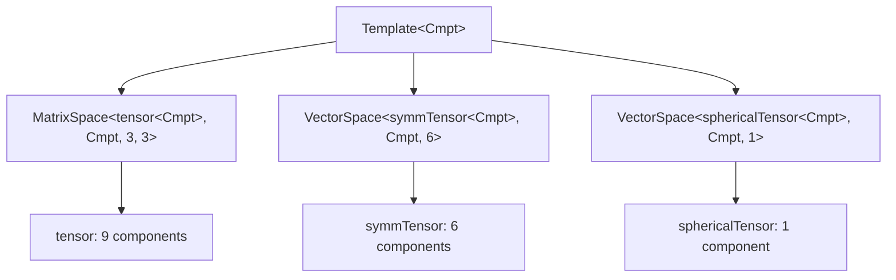

# Module 05.11: Tensor Algebra in OpenFOAM

## Overview

Tensor algebra forms the mathematical foundation for representing **directional quantities** and their spatial variations in Computational Fluid Dynamics (CFD). Unlike scalars (rank-0 tensors) and vectors (rank-1 tensors), **second-order tensors** describe linear transformations between vector spaces, making them essential for modeling stress, strain, and turbulence phenomena.

> [!INFO] Why Tensors Matter in CFD
> OpenFOAM's tensor framework extends beyond simple scalar and vector mathematics to capture **complex anisotropic behaviors** found in real fluid flows and material responses. This enables accurate modeling of:
> - **Stress tensors** (Cauchy stress, viscous stress)
> - **Strain rate tensors** (deformation gradients)
> - **Reynolds stress tensors** (turbulent correlations)
> - **Anisotropic transport coefficients**

---

## Learning Objectives

After completing this module, you will be able to:

### **1. Understand OpenFOAM's Tensor Classes and Mathematical Representation**

OpenFOAM provides a comprehensive tensor algebra framework through three main tensor classes:

| Class | Size | Independent Components | Description |
|-------|-------|---------------------|----------|
| **`tensor`** | 3×3 | 9 components | General second-order tensor |
| **`symmTensor`** | 3×3 | 6 components | Symmetric tensor |
| **`sphericalTensor`** | 3×3 | 1 component | Spherical (isotropic) tensor |

**Tensor Class Declaration:**
```cpp
// tensor: General 3×3 second-order tensor
tensor t(1, 2, 3, 4, 5, 6, 7, 8, 9);  // Row-major order components

// symmTensor: Symmetric 3×3 tensor
symmTensor st(1, 2, 3, 4, 5, 6);  // xx, xy, xz, yy, yz, zz

// sphericalTensor: Spherical tensor (isotropic)
sphericalTensor spt(2.5);  // Diagonal tensor with value 2.5
```

**Mathematical Representation:**
These classes represent second-order tensors in the form:
$$\mathbf{T} = \begin{bmatrix} T_{xx} & T_{xy} & T_{xz} \\ T_{yx} & T_{yy} & T_{yz} \\ T_{zx} & T_{zy} & T_{zz} \end{bmatrix}$$

### **2. Perform Basic Tensor Operations**

Master fundamental tensor algebra operations required for CFD calculations:

#### **Addition and Subtraction**
```cpp
tensor t1(1, 0, 0, 0, 1, 0, 0, 0, 1);  // Identity tensor
tensor t2(0, 1, 0, 1, 0, 0, 0, 0, 1);  // Another tensor
tensor t_sum = t1 + t2;  // Element-wise addition
tensor t_diff = t1 - t2; // Element-wise subtraction
```

#### **Scalar Multiplication**
```cpp
scalar alpha = 2.5;
tensor t_scaled = alpha * t1;  // Multiply each element by scalar
```

#### **Inner Product (Double Contraction)**
```cpp
scalar inner_product = t1 && t2;  // Equivalent to tr(t1 · t2^T)
```

#### **Outer Product**
```cpp
vector v1(1, 2, 3);
vector v2(4, 5, 6);
tensor outer = v1 * v2;  // Dyadic product v1 ⊗ v2
```

#### **Tensor Multiplication**
```cpp
tensor t_product = t1 * t2;  // Standard matrix multiplication
```

### **3. Compute Eigenvalue Decomposition**

Extract eigenvalues and eigenvectors from symmetric tensors for stress and turbulence analysis:

```cpp
// Create symmetric stress tensor
symmTensor stress(100, 50, 30, 80, 40, 60);

// Compute eigenvalues
eigenValues ev = eigenValues(stress);
scalar lambda1 = ev.component(vector::X);  // Maximum principal stress
scalar lambda2 = ev.component(vector::Y);  // Intermediate principal stress
scalar lambda3 = ev.component(vector::Z);  // Minimum principal stress

// Compute eigenvectors
eigenVectors eigvecs = eigenVectors(stress);
vector e1 = eigvecs.component(vector::X);  // Direction of lambda1
vector e2 = eigvecs.component(vector::Y);  // Direction of lambda2
vector e3 = eigvecs.component(vector::Z);  // Direction of lambda3
```

**Fundamental Equation:**
Eigenvalue decomposition solves:
$$\mathbf{T}\mathbf{e}_i = \lambda_i\mathbf{e}_i$$

Where:
- $\lambda_i$ are the **eigenvalues**
- $\mathbf{e}_i$ are the corresponding **eigenvectors**

### **4. Apply Tensor Calculus Operators**

Use finite volume operators for tensor field manipulation:

#### **Gradient of Tensor Field**
```cpp
volTensorField tau = ...;  // Stress tensor field
volTensorField gradTau = fvc::grad(tau);  // ∇τ
```

#### **Divergence of Tensor Field**
```cpp
volVectorField velocity = ...;  // Velocity gradient tensor
volVectorField divTau = fvc::div(tau);  // ∇·τ
```

#### **Laplacian of Tensor Field**
```cpp
volTensorField laplacianTau = fvc::laplacian(tau);  // ∇²τ
```

#### **Tensor Interpolation to Faces**
```cpp
surfaceTensorField tau_f = fvc::interpolate(tau);  // Values at face centers
```

### **5. Use Tensor Algebra in Real CFD Applications**

Apply tensor mathematics to real-world CFD problems:

#### **Turbulence Modeling**
```cpp
// Reynolds stress tensor calculation
volSymmTensorField R
(
    IOobject("R", runTime.timeName(), mesh),
    mesh,
    dimensionedSymmTensor("zero", dimensionSet(0, 2, -2, 0, 0, 0, 0), symmTensor::zero)
);

// R_ij = -ρ * u'_i * u'_j
forAll(R, i)
{
    R[i] = -rho * UPrime[i] * UPrime[i];
}
```

#### **Stress Analysis**
```cpp
// Cauchy stress tensor: σ = 2μ*ε + λ*tr(ε)*I
volSymmTensorField epsilon = symm(fvc::grad(U));  // Strain rate tensor
volSymmTensorField sigma = 2*mu*epsilon + lambda*tr(epsilon)*symmTensor::I;
```

#### **Strain Rate Tensor**
```cpp
// Velocity gradient tensor: ∇u
volTensorField gradU = fvc::grad(U);

// Symmetric part: strain rate tensor
volSymmTensorField D = symm(gradU);

// Antisymmetric part: vorticity tensor
volTensorField W = skew(gradU);
```

#### **Principal Stress Analysis**
```cpp
// Maximum principal stress direction
eigenValues sigma_eig = eigenValues(sigma);
scalar sigma_max = max(sigma_eig.component(vector::X));
```

---

## Physical Interpretation: The Stress Block Analogy

### The Cauchy Stress Tensor

Consider a small cubic element of material under arbitrary loading. On all six faces of this cube, forces act which can be decomposed into:

- **Normal component** (perpendicular to the surface)
- **Two shear components** (tangential to the surface)

To completely describe the **stress state** at any point within a material, we need **nine independent numbers** arranged as a 3×3 matrix — the **Cauchy stress tensor**:

$$\boldsymbol{\tau} = \begin{bmatrix}
\tau_{xx} & \tau_{xy} & \tau_{xz} \\
\tau_{yx} & \tau_{yy} & \tau_{yz} \\
\tau_{zx} & \tau_{zy} & \tau_{zz}
\end{bmatrix}$$

**Component Definitions:**
- **Diagonal components** ($\tau_{xx}$, $\tau_{yy}$, $\tau_{zz}$): Represent **normal stresses** acting perpendicular to the respective faces
- **Off-diagonal components** ($\tau_{xy}$, $\tau_{xz}$, etc.): Represent **shear stresses** acting tangentially to the faces

Due to angular momentum conservation, the stress tensor is **symmetric** ($\tau_{ij} = \tau_{ji}$), reducing the independent components to six.

### Principal Stress Analysis

The fundamental question arises: **In which directions does this stress block experience only normal stresses?**

This question leads to **principal stress analysis** through eigen decomposition:

$$\boldsymbol{\tau}_{\text{principal}} = \begin{bmatrix}
\sigma_1 & 0 & 0 \\
0 & \sigma_2 & 0 \\
0 & 0 & \sigma_3
\end{bmatrix}$$

**Principal Stress Definitions:**
- $\sigma_1$: **First principal stress** (maximum normal stress)
- $\sigma_2$: **Second principal stress** (intermediate normal stress)
- $\sigma_3$: **Third principal stress** (minimum normal stress)

These stresses act on **mutually perpendicular planes** where shear stresses vanish.

---

## Tensor Class Hierarchy

OpenFOAM's tensor class hierarchy is a sophisticated system for mathematical tensor management, achieving computational efficiency through **Template Metaprogramming**.

### Template Fundamentals and Inheritance Structure

The tensor hierarchy begins with the base template class `Template<Cmpt>`, where `Cmpt` represents the component type (typically `scalar`, `float`, or `double`).



### Tensor Type Specifications

| Tensor Type | Independent Components | Storage Layout | Primary Applications |
|-------------|----------------|----------------|----------------------|
| **`tensor`** | 9 components | `[xx, xy, xz, yx, yy, yz, zx, zy, zz]` | Rotations, general transformations |
| **`symmTensor`** | 6 components | `[xx, yy, zz, xy, yz, xz]` | Stress tensors, strain rate tensors |
| **`sphericalTensor`** | 1 component | `[ii]` | Isotropic pressure, isotropic material properties |

#### 1. **General Tensor (`tensor`)**
Full $3 \times 3$ tensor with nine independent components:
- **Representation**: General second-order tensor quantities
- **Requirements**: Rotations and general transformations
- **Applications**: Deformation gradients, velocity gradients

#### 2. **Symmetric Tensor (`symmTensor`)**
$3 \times 3$ tensor with six independent components:
- **Property**: Enforces symmetry $T_{ij} = T_{ji}$
- **Memory Efficiency**: Stores only unique components
- **Applications**: Stress tensors, strain rate tensors, Reynolds stress tensors

#### 3. **Spherical Tensor (`sphericalTensor`)**
Isotropic tensor proportional to identity matrix: $\lambda \mathbf{I}$
- **Representation**: Single scalar value
- **Applications**: Isotropic pressure fields, isotropic material properties
- **Efficiency**: Maximum storage optimization

---

## Internal Mechanics: Storage and Symmetry

OpenFOAM's tensor class hierarchy employs sophisticated storage strategies balancing memory efficiency and computational performance.

### Memory Layouts

#### General Tensor (`tensor`)
- **9 contiguous scalars** in row-major order:
```
[XX][XY][XZ][YX][YY][YZ][ZX][ZY][ZZ]
  0   1   2   3   4   5   6   7   8
```

This layout represents the complete $3 \times 3$ tensor matrix:
$$\mathbf{T} = \begin{bmatrix} T_{xx} & T_{xy} & T_{xz} \\ T_{yx} & T_{yy} & T_{yz} \\ T_{zx} & T_{zy} & T_{zz} \end{bmatrix}$$

**Advantages:**
- **Optimal cache utilization** during matrix operations
- **C++ memory layout consistency**
- **Direct access** via member functions like `T.xx()`, `T.xy()`, etc.

#### Symmetric Tensor (`symmTensor`)
- **6 scalars** storing the upper triangular portion:
```
[XX][XY][XZ][YY][YZ][ZZ]
  0   1   2   3   4   5
```

This storage exploits the mathematical property of symmetry where $T_{ij} = T_{ji}$:
$$\mathbf{S} = \begin{bmatrix} S_{xx} & S_{xy} & S_{xz} \\ S_{xy} & S_{yy} & S_{yz} \\ S_{xz} & S_{yz} & S_{zz} \end{bmatrix}$$

**Accessing Lower Triangular Components:**
- `S.yx() == S.xy()`
- `S.zx() == S.xz()`
- `S.zy() == S.yz()`

**Advantages:**
- **33% memory reduction** compared to general tensors
- **Full functionality** through overloaded member functions

#### Spherical Tensor (`sphericalTensor`)
- **Single scalar $\lambda$** representing $\lambda \mathbf{I}$:
$$\mathbf{\Lambda} = \lambda \mathbf{I} = \lambda \begin{bmatrix} 1 & 0 & 0 \\ 0 & 1 & 0 \\ 0 & 0 & 1 \end{bmatrix}$$

**Advantages:**
- **Maximum storage efficiency**
- **Ideal for isotropic tensors** common in pressure fields
- **Easy access** via `Lambda.value()` or implicitly through any component function

### Template Specialization Implementation

OpenFOAM leverages C++ template specialization to optimize tensor operations based on symmetry properties:

```cpp
// General tensor operations
template<>
class Tensor<tensor>
{
    scalar data_[9];
public:
    // Full 9-component operations
    scalar& component(int i, int j) { return data_[i*3 + j]; }
    // ... full tensor functionality
};

// Symmetric tensor specialization
template<>
class Tensor<symmTensor>
{
    scalar data_[6];  // XX, XY, XZ, YY, YZ, ZZ
public:
    // Optimized 6-component operations
    scalar& component(int i, int j) {
        if (i > j) std::swap(i, j);  // Use upper triangular only
        return data_[triangularIndex(i, j)];
    }
    // ... symmetric tensor functionality
};
```

---

## Tensor Operations Mechanism

OpenFOAM's tensor operations form the foundation of CFD calculations, enabling efficient mathematical manipulation of **second-order tensors** used in momentum transport, stress analysis, and field transformations.

### Basic Calculations

Basic mathematical operations on tensors follow **component-wise** principles, reflecting the mathematical definition of tensor algebra:

```cpp
tensor A(1,2,3,4,5,6,7,8,9);  // Components: [xx, xy, xz, yx, yy, yz, zx, zy, zz]
tensor B(9,8,7,6,5,4,3,2,1);

// Component-wise addition: C_ij = A_ij + B_ij
tensor C = A + B;   // Results in tensor(10,10,10,10,10,10,10,10,10)

// Component-wise subtraction: D_ij = A_ij - B_ij
tensor D = A - B;   // Results in tensor(-8,-6,-4,-2,0,2,4,6,8)

// Scalar multiplication: E_ij = α·A_ij
tensor E = 2.5 * A; // Results in tensor(2.5,5,7.5,10,12.5,15,17.5,20,22.5)
```

### Inner Products

Inner product calculations in tensor calculus provide different levels of **index contraction**, each with distinct physical interpretations and computational patterns:

#### 1. Single Contraction (`&`)

The single contraction operator performs **tensor-vector** or **tensor-tensor multiplication** by reducing rank by one:

$$\mathbf{y} = \mathbf{T} \cdot \mathbf{v} \quad \text{where} \quad y_i = \sum_{j=1}^{3} T_{ij} v_j$$

**Variable Definitions:**
- $\mathbf{y}$ = output vector
- $\mathbf{T}$ = input tensor
- $\mathbf{v}$ = input vector
- $y_i$ = $i$-th component of output vector
- $T_{ij}$ = $(i,j)$-th component of tensor
- $v_j$ = $j$-th component of vector

```cpp
vector v(1, 0, 0);
vector w = A & v;  // Matrix-vector multiplication
// Results: w_x = A_xx·1 + A_xy·0 + A_xz·0 = 1
//          w_y = A_yx·1 + A_yy·0 + A_yz·0 = 4
//          w_z = A_zx·1 + A_zy·0 + A_zz·0 = 7
```

For **tensor-tensor multiplication** the result is another tensor:

$$\mathbf{C} = \mathbf{A} \cdot \mathbf{B} \quad \text{where} \quad C_{ij} = \sum_{k=1}^{3} A_{ik} B_{kj}$$

#### 2. Double Contraction (`&&`)

The double contraction (**scalar product**) computes the **Frobenius inner product** yielding a scalar:

$$\mathbf{A} : \mathbf{B} = \sum_{i,j=1}^{3} A_{ij} B_{ij} = \text{tr}(\mathbf{A} \cdot \mathbf{B}^T)$$

```cpp
scalar s = A && B;  // Double inner product
// For A=[1,2,3,4,5,6,7,8,9], B=[9,8,7,6,5,4,3,2,1]:
// s = 1·9 + 2·8 + 3·7 + 4·6 + 5·5 + 6·4 + 7·3 + 8·2 + 9·1 = 165
```

**Significance in CFD:**
- Computes **work rates**
- Calculates **stress-strain products**
- Evaluates **energy dissipation terms**

#### 3. Outer Product (`*`)

The outer product between two vectors creates a second-order tensor through **dyadic multiplication**:

$$\mathbf{T} = \mathbf{u} \otimes \mathbf{v} \quad \text{where} \quad T_{ij} = u_i v_j$$

```cpp
vector u(1, 2, 3);
vector v(4, 5, 6);
tensor T = u * v;  // Outer product
// Results: tensor(4,5,6,8,10,12,12,15,18)
```

**CFD Applications:**
- Construct **Reynolds stress tensors** from velocity fluctuations
- Compute **momentum flux**

### Transpose and Invariants

**Tensor invariants** provide measures of tensor properties that are **independent of coordinate system**, essential for physical interpretation and numerical stability:

```cpp
tensor A(1,2,3,4,5,6,7,8,9);

// Transpose: A^T_ij = A_ji
tensor AT = A.T();          // Results: tensor(1,4,7,2,5,8,3,6,9)

// Trace: tr(A) = Σ_i A_ii (sum of diagonal elements)
scalar trA = tr(A);         // Results: 1 + 5 + 9 = 15

// Determinant: det(A) = |A|
scalar detA = det(A);       // For this specific tensor: 0

// Inverse: A⁻¹ where A·A⁻¹ = I (identity tensor)
tensor invA = inv(A);       // Only if invertible (det(A) ≠ 0)
```

---

## Eigen Decomposition and Physical Applications

### The Eigenvalue Problem

For a symmetric tensor $\mathbf{S}$, there exist three real eigenvalues $\lambda_k$ and orthogonal eigenvectors $\mathbf{v}_k$ where:

$$\mathbf{S} \cdot \mathbf{v}_k = \lambda_k \mathbf{v}_k, \quad k=1,2,3$$

**This fundamental relationship** defines eigenvalue decomposition, where eigenvectors represent the **principal directions** of the tensor and eigenvalues represent the magnitude of the tensor's action in those directions.

For symmetric tensors, the eigenvectors form an **orthogonal basis**, which has profound implications for physical interpretation in CFD.

### OpenFOAM Implementation

In OpenFOAM, computing eigenvalues and eigenvectors is straightforward:

```cpp
symmTensor S(2,-1,0, -1,2,0, 0,0,1);  // Example symmetric tensor
vector lambdas = eigenValues(S);      // Returns eigenvalues as vector
tensor V = eigenVectors(S);           // Returns eigenvectors as tensor columns
```

**Behavior:**
- `eigenValues` function returns three eigenvalues sorted from largest to smallest
- `eigenVectors` function returns a tensor where each column represents the corresponding eigenvector
- This organization facilitates working with principal values and directions in numerical algorithms

### Implementation Details

The `eigenValues` function computes the roots of the characteristic cubic equation:

$$\det(\mathbf{S} - \lambda \mathbf{I}) = -\lambda^3 + I_1 \lambda^2 - I_2 \lambda + I_3 = 0$$

Where $I_1, I_2, I_3$ are the **principal invariants** of the tensor:

$$\begin{aligned}
I_1 &= \operatorname{tr}(\mathbf{S}) \\
I_2 &= \frac{1}{2}[(\operatorname{tr}\mathbf{S})^2 - \operatorname{tr}(\mathbf{S}^2)] \\
I_3 &= \det(\mathbf{S})
\end{aligned}$$

**Significance of Invariants:**
- $I_1$: Represents trace (sum of diagonal members)
- $I_2$: Describes the "deviatoric" character of the tensor
- $I_3$: Represents determinant

### CFD Applications

#### 1. Turbulence Modeling

In Reynolds-Averaged Navier-Stokes (RANS) turbulence modeling, the Reynolds stress tensor $\mathbf{R} = \overline{\mathbf{u}' \otimes \mathbf{u}'}$ is symmetric by construction:

$$\mathbf{R} = \sum_{k=1}^{3} \lambda_k \mathbf{v}_k \otimes \mathbf{v}_k$$

**Physical Meaning:**
- $\lambda_k$: Represents intensity of normal stress in principal directions
- $\mathbf{v}_k$: Lie in principal stress directions
- Eigenvalues satisfy $\sum_{k=1}^{3} \lambda_k = 2k$ (twice turbulent kinetic energy)

**Applications:**
- **Anisotropy analysis**: Distribution of eigenvalues explains turbulence anisotropy
- **Model validation**: Compare computed eigenvalues with experimental data
- **Flow visualization**: Eigenvectors indicate preferred turbulence structure directions

#### 2. Solid Mechanics

In fluid-structure interaction and stress analysis, the Cauchy stress tensor $\boldsymbol{\sigma}$ undergoes eigen decomposition:

$$\boldsymbol{\sigma} = \sum_{k=1}^{3} \sigma_k \mathbf{n}_k \otimes \mathbf{n}_k$$

**Definitions:**
- $\sigma_k$: Principal stresses (eigenvalues)
- $\mathbf{n}_k$: Principal stress directions (eigenvectors)

**Applications include:**
- **Failure analysis**: Maximum principal stress criterion uses $\sigma_{max} = \max(\sigma_1, \sigma_2, \sigma_3)$
- **Von Mises stress**: Computed from principal stress differences
- **Structural optimization**: Material placement along principal stress directions

#### 3. Non-Newtonian Fluids

For viscoelastic and non-Newtonian fluids, the extra stress tensor $\boldsymbol{\tau}$ reveals flow structure through eigen decomposition:

$$\boldsymbol{\tau} = \sum_{k=1}^{3} \tau_k \mathbf{e}_k \otimes \mathbf{e}_k$$

**Physical Interpretation:**
- **Positive eigenvalues**: Regions of tensile stress (stretching)
- **Negative eigenvalues**: Regions of compressive stress
- **Eigenvectors**: Principal directions of stretching or compression

**This analysis is crucial for:**
- **Polymer processing**: Understanding molecular alignment
- **Biological flows**: Cell deformation in complex flows
- **Material constitutive equations**: Identifying flow-induced anisotropy

---

## Common Pitfalls and Best Practices

### Incorrect Index Contraction Mismatches

**The most common source of error** is incorrect contraction patterns.

### Difference Between Single and Double Contraction

| Operation | Operator | Result | Equation | Description |
|---|---|---|---|---|
| **Double Contraction** | `&&` | `scalar` | $$s = \mathbf{A} : \mathbf{B} = A_{ij}B_{ij}$$ | Full index contraction between tensors |
| **Single Contraction** | `&` | `vector/tensor` | $$w_i = A_{ij}v_j$$ (tensor-vector) | Partial index contraction |

### Correct Usage Examples

```cpp
// ❌ WRONG
vector v = A && B;  // Error: double contraction yields scalar, not vector

// ✅ CORRECT
scalar s = A && B;      // Double contraction → scalar
vector w = A & v;       // Single contraction → vector
tensor T = A & B;       // Single contraction → tensor
```

### Error Prevention Strategies

**Prevention Steps:**
1. **Always check tensor order** before using operators
2. **Use explicit type conversions** when necessary: `scalar s = scalar(A && B)`
3. **Check dimensions** for tensor fields to ensure consistency
4. **Verify boundary conditions** for tensor fields, as incorrect boundary conditions can lead to numerical instability

### Performance Considerations

**Optimizing Tensor Calculations:**

| Technique | Description | Benefit |
|---|---|---|
| **Pre-computation** | Pre-calculate frequently used tensor constants (trace, determinant) | Reduce redundant calculations |
| **Symmetric Operations** | Use symmetric tensor operations when tensor symmetry is known | Halve calculation count |
| **Memory Efficiency** | Reduce tensor field copying through efficient reference management | Save memory |
| **tmp Templates** | Leverage OpenFOAM's tmp templates for automatic memory management | Prevent memory leaks |

---

## Module Summary

### Key Takeaways

1. **Tensor Architecture**: OpenFOAM's three-tier tensor system (`tensor`, `symmTensor`, `sphericalTensor`) provides **33-89% memory savings** through symmetry exploitation

2. **Storage Efficiency**:
   - `tensor`: 9 components in row-major layout
   - `symmTensor`: 6 components (upper triangular)
   - `sphericalTensor`: 1 scalar representing isotropic tensor

3. **Critical Operations**:
   - **Single contraction** (`&`): Reduces tensor rank by one
   - **Double contraction** (`&&`): Produces scalar (Frobenius inner product)
   - **Outer product** (`*`): Creates tensor from vectors

4. **Eigen Decomposition**: Essential for:
   - Principal stress analysis
   - Turbulence anisotropy characterization
   - Material failure prediction
   - Flow structure identification

5. **Physical Applications**:
   - **Stress tensors**: Cauchy stress, viscous stress
   - **Strain rate tensors**: Symmetric velocity gradient
   - **Reynolds stress**: Turbulent momentum transport
   - **Deformation gradients**: Material deformation analysis

### Tensor Calculus Operations

| Operation | Symbol | OpenFOAM Syntax | Result Type | Application |
|-----------|--------|-----------------|-------------|-------------|
| **Gradient** | $\nabla \mathbf{T}$ | `fvc::grad(T)` | Third-order tensor | Stress gradients |
| **Divergence** | $\nabla \cdot \boldsymbol{\tau}$ | `fvc::div(tau)` | Vector | Body forces |
| **Laplacian** | $\nabla^2 \mathbf{T}$ | `fvc::laplacian(T)` | Tensor | Diffusion |
| **Symmetric part** | $\text{sym}(\mathbf{T})$ | `symm(T)` | symmTensor | Strain rates |
| **Skew part** | $\text{skew}(\mathbf{T})$ | `skew(T)` | tensor | Vorticity |
| **Deviatoric** | $\text{dev}(\mathbf{T})$ | `dev(T)` | symmTensor | Deviatoric stress |

---

## Prerequisites

Before diving into Tensor Algebra, ensure you have:

- **C++ Fundamentals**: Classes, templates, operator overloading
- **Vector Algebra**: Dot products, cross products, vector calculus
- **Matrix Operations**: Matrix multiplication, determinants, eigenvalues
- **OpenFOAM Basics**: Field types, boundary conditions, mesh structure

---

## Estimated Time

- **Reading & Concept Understanding**: 4-5 hours
- **Code Examples & Exercises**: 3-4 hours
- **Practice Implementation**: 2-3 hours
- **Total**: ~9-12 hours

---

## Next Steps

Proceed to [[01_🎯_Learning_Objectives]] for detailed learning outcomes, then explore the sequential content sections to master tensor algebra in OpenFOAM.
