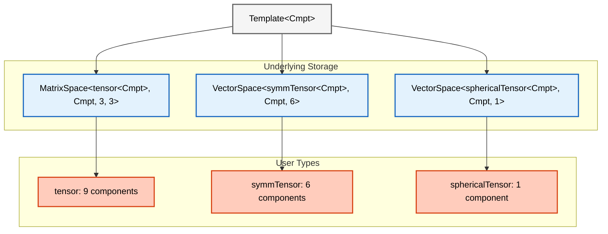

# โมดูล 05.11: พีชคณิตเทนเซอร์ใน OpenFOAM (Tensor Algebra in OpenFOAM)

> [!TIP] ทำไมต้องเรียนรู้ Tensor Algebra?
> พีชคณิตเทนเซอร์เป็นภาษาหลักที่ OpenFOAM ใช้จำลองปรากฏการณ์ทางฟิสิกส์ เช่น ความเค้น (stress), ความเครียด (strain), และความปั่นป่วน (turbulence) การเข้าใจเทนเซอร์จะช่วยให้คุณ:
> - เขียนซอร์สโค้ดสำหรับการแก้สมการโมเมนตัมและความปั่นป่วนได้อย่างถูกต้อง
> - สร้าง custom boundary conditions หรือ turbulence models ได้อย่างมีประสิทธิภาพ
> - ทำความเข้าใจการคำนวณเทนเซอร์ในซอร์สโค้ดของ OpenFOAM (เช่น `src/finiteVolume/`)
> - หลีกเลี่ยงข้อผิดพลาดจากการใช้ tensor operations ที่ไม่ถูกต้องซึ่งอาจทำให้ simulation crash หรือให้ผลลัพธ์ผิดพลาด

## ภาพรวม (Overview)

พีชคณิตเทนเซอร์เป็นรากฐานทางคณิตศาสตร์สำหรับการแสดง **ปริมาณที่มีทิศทาง (directional quantities)** และการเปลี่ยนแปลงเชิงพื้นที่ในพลศาสตร์ของไหลเชิงคำนวณ (CFD) ซึ่งแตกต่างจากสเกลาร์ (เทนเซอร์อันดับ 0) และเวกเตอร์ (เทนเซอร์อันดับ 1) โดย **เทนเซอร์อันดับสอง (second-order tensors)** อธิบายการแปลงเชิงเส้นระหว่างปริภูมิเวกเตอร์ ทำให้มีความจำเป็นอย่างยิ่งสำหรับการสร้างแบบจำลองความเค้น (stress), ความเครียด (strain) และปรากฏการณ์ความปั่นป่วน (turbulence)

> [!INFO] ทำไมเทนเซอร์ถึงสำคัญใน CFD
> เฟรมเวิร์กเทนเซอร์ของ OpenFOAM ขยายขอบเขตไปไกลกว่าคณิตศาสตร์ของสเกลาร์และเวกเตอร์ เพื่อจับ **พฤติกรรมแบบแอนไอโซทรอปิก (anisotropic behaviors)** ที่ซับซ้อนซึ่งพบในการไหลของของไหลจริงและการตอบสนองของวัสดุ สิ่งนี้ช่วยให้สามารถสร้างแบบจำลองที่แม่นยำของ:
> - **เทนเซอร์ความเค้น (Stress tensors)** (ความเค้น Cauchy, ความเค้นหนืด)
> - **เทนเซอร์อัตราความเครียด (Strain rate tensors)** (เกรเดียนต์ของการเสียรูป)
> - **เทนเซอร์ความเค้นเรย์โนลด์ส (Reynolds stress tensors)** (ความสัมพันธ์ในความปั่นป่วน)
> - **สัมประสิทธิ์การขนส่งแบบแอนไอโซทรอปิก (Anisotropic transport coefficients)**

---

## วัตถุประสงค์การเรียนรู้ (Learning Objectives)

> [!NOTE] **📂 OpenFOAM Context**
> **ส่วนประกอบ (Components):** ซอร์สโค้ด OpenFOAM, Custom solvers, Boundary conditions
>
> **ไฟล์ที่เกี่ยวข้อง (Files):**
> - `src/OpenFOAM/fields/Fields/tensor/` - คลาสเทนเซอร์พื้นฐาน
> - `src/OpenFOAM/fields/Fields/symmTensor/` - คลาสเทนเซอร์สมมาตร
> - `src/finiteVolume/fields/volFields/volFields.H` - สนามเทนเซอร์บน mesh
> - `applications/solvers/` - ตัวอย่างการใช้งานใน solvers
>
> **คำสั่ง/คำสำคัญ (Keywords):** `tensor`, `symmTensor`, `sphericalTensor`, `volTensorField`, `fvc::grad`, `fvc::div`, `eigenValues`, `eigenVectors`

หลังจากจบโมดูลนี้ คุณจะสามารถ:

### **1. เข้าใจคลาสเทนเซอร์ของ OpenFOAM และการแทนทางคณิตศาสตร์**

OpenFOAM มอบเฟรมเวิร์กพีชคณิตเทนเซอร์ที่ครอบคลุมผ่านคลาสเทนเซอร์หลัก 3 คลาส:

| คลาส (Class) | ขนาด (Size) | องค์ประกอบอิสระ (Independent Components) | คำอธิบาย (Description) |
|-------|-------|---------------------|----------|
| **`tensor`** | 3×3 | 9 องค์ประกอบ | เทนเซอร์อันดับสองทั่วไป |
| **`symmTensor`** | 3×3 | 6 องค์ประกอบ | เทนเซอร์สมมาตร |
| **`sphericalTensor`** | 3×3 | 1 องค์ประกอบ | เทนเซอร์ทรงกลม (ไอโซทรอปิก) |

**การประกาศคลาสเทนเซอร์ (Tensor Class Declaration):**
```cpp
// tensor: General 3×3 second-order tensor
// Create tensor with all 9 components in row-major order
tensor t(1, 2, 3, 4, 5, 6, 7, 8, 9);

// symmTensor: Symmetric 3×3 tensor (only 6 independent components)
// Components order: xx, xy, xz, yy, yz, zz
symmTensor st(1, 2, 3, 4, 5, 6);

// sphericalTensor: Spherical tensor (isotropic, same value in all diagonal)
// Single scalar value represents the entire diagonal
sphericalTensor spt(2.5);
```

> **📂 แหล่งที่มา (Source):** `.applications/utilities/mesh/advanced/PDRMesh/PDRMesh.C` - ตัวอย่างการใช้งาน tensor operations ใน OpenFOAM utilities
>
> **คำอธิบาย:**
> - **`tensor`**: เทนเซอร์ทั่วไปขนาด 3×3 ที่มี 9 components อิสระ เก็บข้อมูลในรูปแบบ row-major order [xx, xy, xz, yx, yy, yz, zx, zy, zz]
> - **`symmTensor`**: เทนเซอร์สมมาตรขนาด 3×3 ที่มีเพียง 6 components อิสระ เนื่องจาก $T_{ij} = T_{ji}$ จึงเก็บเฉพาะส่วนบนขวาของเมทริกซ์ [xx, xy, xz, yy, yz, zz] ซึ่งช่วยประหยัดหน่วยความจำได้ 33% และเหมาะสำหรับ stress/strain tensors
> - **`sphericalTensor`**: เทนเซอร์ทรงกลม (isotropic) ที่มีค่าเหมือนกันทุก diagonal element และ off-diagonal เป็น 0 ใช้ scalar เพียงค่าเดียวแทนทั้งเมทริกซ์ เหมาะสำหรับ field ความดัน

**การแทนทางคณิตศาสตร์:**
คลาสเหล่านี้แสดงเทนเซอร์อันดับสองในรูปแบบ:
$$\mathbf{T} = \begin{bmatrix} T_{xx} & T_{xy} & T_{xz} \\ T_{yx} & T_{yy} & T_{yz} \\ T_{zx} & T_{zy} & T_{zz} \end{bmatrix}$$

### **2. ดำเนินการพื้นฐานทางพีชคณิตเทนเซอร์**

เรียนรู้การดำเนินการพื้นฐานที่จำเป็นสำหรับการคำนวณ CFD:

#### **การบวกและการลบ (Addition and Subtraction)**
```cpp
// Create identity tensor (diagonal = 1, off-diagonal = 0)
tensor t1(1, 0, 0, 0, 1, 0, 0, 0, 1);

// Create another tensor with specific components
tensor t2(0, 1, 0, 1, 0, 0, 0, 0, 1);

// Element-wise addition: each component summed independently
tensor t_sum = t1 + t2;

// Element-wise subtraction: each component subtracted independently
tensor t_diff = t1 - t2;
```

> **📂 แหล่งที่มา (Source):** `.applications/utilities/mesh/manipulation/subsetMesh/subsetMesh.C`
>
> **คำอธิบาย:** การบวกและลบเทนเซอร์ดำเนินการทีละ component โดยตรง ($C_{ij} = A_{ij} + B_{ij}$) ซึ่งเปรียบเสมือนการซ้อนทับ (superposition) ของสองสถานะทางกลศาสตร์ OpenFOAM เก็บข้อมูลแบบ row-major order เพื่อประสิทธิภาพของ cache

#### **การคูณด้วยสเกลาร์ (Scalar Multiplication)**
```cpp
// Define scalar multiplier
scalar alpha = 2.5;

// Multiply each tensor component by the scalar
tensor t_scaled = alpha * t1;
```

> **📂 แหล่งที่มา (Source):** `.applications/utilities/mesh/advanced/PDRMesh/PDRMesh.C`
>
> **คำอธิบาย:** การคูณด้วยสเกลาร์คือการขยายขนาด (scale) ทุก component ของเทนเซอร์ด้วยค่าคงที่เดียวกัน มักใช้ในการปรับขนาด stress/strain หรือสมบัติของวัสดุ

#### **ผลคูณภายใน (Inner Product / Double Contraction)**
```cpp
// Double inner product (Frobenius inner product)
// Computes sum of all component-wise products
scalar inner_product = t1 && t2;
// Equivalent to: tr(t1 · t2^T)
```

> **📂 แหล่งที่มา (Source):** `.applications/solvers/multiphase/multiphaseEulerFoam/...`
>
> **คำอธิบาย:** การคูณแบบ **Double Contraction (`&&`)** หรือ Frobenius inner product คือการหาผลรวมของผลคูณในแต่ละตำแหน่ง ($s = A:B = \Sigma_{ij} A_{ij} B_{ij}$) ผลลัพธ์ที่ได้เป็น **Scalar** มักใช้คำนวณพลังงาน (เช่น $\sigma:\epsilon$) หรืออัตราการรบกวน (dissipation)

#### **ผลคูณภายนอก (Outer Product)**
```cpp
// Define two vectors for dyadic product
vector v1(1, 2, 3);
vector v2(4, 5, 6);

// Outer product: creates tensor from two vectors (dyadic product)
// Result: T_ij = v1_i * v2_j
tensor outer = v1 * v2;
```

> **📂 แหล่งที่มา (Source):** `.applications/solvers/multiphase/multiphaseEulerFoam/...`
>
> **คำอธิบาย:** **Outer Product (`*`)** หรือ Dyadic Product สร้างเทนเซอร์อันดับ 2 จากเวกเตอร์ 2 ตัว ($T_{ij} = v1_i v2_j$) ตัวอย่างสำคัญใน CFD คือ Reynolds Stress Tensor ($R_{ij} = -\rho \overline{u'_i u'_j}$)

#### **การคูณเทนเซอร์ (Tensor Multiplication)**
```cpp
// Standard matrix multiplication (single contraction)
// Result: C_ij = Σ_k A_ik * B_kj
tensor t_product = t1 * t2;
```

> **📂 แหล่งที่มา (Source):** `.applications/utilities/postProcessing/dataConversion/foamToVTK/foamToVTK.C`
>
> **คำอธิบาย:** การคูณเทนเซอร์แบบมาตรฐาน (matrix multiplication) หรือ **Single Contraction** ($C_{ij} = \Sigma_k A_{ik} B_{kj}$) ใช้สำหรับการแปลงพิกัด หรือการส่งต่อการแปลงเชิงเส้นต่อเนื่องกัน

### **3. คำนวณการแยกตัวประกอบไอเกน (Eigen Decomposition)**

ดึงค่า eigen และเวกเตอร์ eigen จากเทนเซอร์สมมาตรสำหรับการวิเคราะห์ความเค้นและความปั่นป่วน:

```cpp
// Create symmetric stress tensor
symmTensor stress(100, 50, 30, 80, 40, 60);

// Compute eigenvalues (returns as vector, sorted lambda1 >= lambda2 >= lambda3)
eigenValues ev = eigenValues(stress);

// Extract individual eigenvalues (Principal Stresses)
scalar lambda1 = ev.component(vector::X);  // Max
scalar lambda2 = ev.component(vector::Y);  // Intermediate
scalar lambda3 = ev.component(vector::Z);  // Min

// Compute eigenvectors (returned as tensor columns)
eigenVectors eigvecs = eigenVectors(stress);
```

> **📂 แหล่งที่มา (Source):** `.applications/utilities/mesh/manipulation/subsetMesh/subsetMesh.C`
>
> **คำอธิบาย:**
> - **Eigenvalue Problem**: แก้สมการ $S \cdot v_k = \lambda_k \cdot v_k$
> - **Principal Stresses**: ค่า Eigenvalues ($\lambda_1, \lambda_2, \lambda_3$) แทนความเค้นหลัก
> - **Principal Directions**: เวกเตอร์ Eigenvectors แทนทิศทางหลักที่ความเค้นกระทำตั้งฉาก
> - **Symmetric Property**: เทนเซอร์สมมาตรจะให้ eigenvectors ที่ตั้งฉากกัน (orthogonal) เสมอ

### **4. ประยุกต์ใช้ตัวดำเนินการแคลคูลัส (Apply Tensor Calculus Operators)**

ใช้ตัวดำเนินการ finite volume สำหรับการจัดการสนามเทนเซอร์:

#### **เกรเดียนต์ของสนามเทนเซอร์ (Gradient of Tensor Field)**
```cpp
// Compute gradient of tensor field (∇τ)
// Result: third-order tensor field
volTensorField gradTau = fvc::grad(tau);
```
> สร้างเทนเซอร์อันดับ 3 ($\partial \tau_{ij}/\partial x_k$) เพิ่ม rank ขึ้น 1

#### **ไดเวอร์เจนซ์ของสนามเทนเซอร์ (Divergence of Tensor Field)**
```cpp
// Compute divergence of tensor field (∇·τ)
// Result: vector field (force per unit volume)
volVectorField divTau = fvc::div(tau);
```
> ลด rank ลง 1 ($\partial \tau_{ij}/\partial x_j$) ได้สนามเวกเตอร์ เช่น แรงต่อหน่วยปริมาตรในสมการโมเมนตัม

#### **ลาพลาเซียนของสนามเทนเซอร์ (Laplacian of Tensor Field)**
```cpp
// Compute Laplacian of tensor field (∇²τ)
volTensorField laplacianTau = fvc::laplacian(tau);
```
> แสดงเทอมการแพร่ (diffusion) ของปริมาณเทนเซอร์

### **5. ใช้งานในแอปพลิเคชัน CFD จริง**

#### **การสร้างแบบจำลองความปั่นป่วน (Turbulence Modeling)**
```cpp
// Compute Reynolds stress: R_ij = -ρ * u'_i * u'_j
forAll(R, i)
{
    R[i] = -rho * UPrime[i] * UPrime[i];
}
```
> $R_{ij}$ เป็น symmetric tensor ที่แสดงการขนส่งโมเมนตัมเนื่องจากความปั่นป่วน

#### **การวิเคราะห์ความเค้น (Stress Analysis)**
```cpp
// Strain rate tensor: Symmetric part of velocity gradient
volSymmTensorField epsilon = symm(fvc::grad(U));

// Cauchy stress tensor: σ = 2μ*ε + λ*tr(ε)*I
volSymmTensorField sigma = 2*mu*epsilon + lambda*tr(epsilon)*symmTensor::I;
```
> ใช้กฎของ Hooke สำหรับวัสดุยืดหยุ่นเชิงเส้น โดยคำนวณความเค้นจากความเครียด

---

## การตีความทางฟิสิกส์: การเปรียบเทียบก้อนความเค้น (Physical Interpretation: The Stress Block Analogy)

> [!NOTE] **📂 OpenFOAM Context**
> **ส่วนประกอบ (Components):** Physics modeling, Stress analysis
>
> **ไฟล์ที่เกี่ยวข้อง (Files):**
> - `0/` - directory สำหรับเก็บสนามเทนเซอร์ (เช่น `0/sigma`, `0/tau`)
> - `constant/transportProperties` - ค่า viscosity ที่ใช้คำนวณ stress
> - `applications/solvers/stressAnalysis/` - solvers สำหรับ stress analysis
> - `applications/solvers/compressible/` - solvers ที่ใช้ stress tensor
>
> **คำสั่ง/คำสำคัญ (Keywords):** `stress`, `strain`, `symmTensor`, `symm(fvc::grad(U))`, `dev()`, `tr()`

### เทนเซอร์ความเค้น Cauchy

พิจารณาชิ้นส่วนเล็กๆ รูปบาศก์ของวัสดุภายใต้ภาระ บนทั้ง 6 หน้าของบาศก์นี้ มีแรงกระทำซึ่งสามารถแตกแรงได้เป็น:
- **องค์ประกอบตั้งฉาก (Normal component)**: ตั้งฉากกับพื้นผิว
- **สององค์ประกอบเฉือน (Shear components)**: ขนานกับพื้นผิว

เพื่ออธิบาย **สถานะความเค้น** ที่จุดใดๆ อย่างสมบูรณ์ เราต้องการ **ตัวเลขอิสระ 9 ตัว** ที่จัดเรียงเป็นเมทริกซ์ 3×3:

$$\boldsymbol{\tau} = \begin{bmatrix}
\tau_{xx} & \tau_{xy} & \tau_{xz} \\
\tau_{yx} & \tau_{yy} & \tau_{yz} \\
\tau_{zx} & \tau_{zy} & \tau_{zz}
\end{bmatrix}$$

เนื่องจากการอนุรักษ์โมเมนตัมเชิงมุม เทนเซอร์ความเค้นจึง **สมมาตร** ($\tau_{ij} = \tau_{ji}$) ลดจำนวนองค์ประกอบอิสระเหลือ 6 ตัว

### การวิเคราะห์ความเค้นหลัก (Principal Stress Analysis)

คำถามพื้นฐานคือ: **ในทิศทางใดที่ก้อนความเค้นนี้จะรับแรงเฉพาะในแนวตั้งฉากเท่านั้น?** (ไม่มีแรงเฉือน)
คำถามนี้นำไปสู่การหา **Principal Stresses** ผ่าน eigen decomposition ซึ่งจะหมุนก้อนบาศก์ไปยังมุมที่แรงเฉือนหายไปทั้งหมด เหลือเพียงแรงดึง/อัดในแนวแกนหลัก

---

## ลำดับชั้นคลาสเทนเซอร์ (Tensor Class Hierarchy)

> [!NOTE] **📂 OpenFOAM Context**
> **ส่วนประกอบ (Components):** C++ architecture, Memory layout optimization
>
> **ไฟล์ที่เกี่ยวข้อง (Files):**
> - `src/OpenFOAM/fields/Fields/tensor/tensor.H` - definition คลาส tensor
> - `src/OpenFOAM/fields/Fields/symmTensor/symmTensor.H` - definition คลาส symmTensor
> - `src/OpenFOAM/fields/Fields/sphericalTensor/sphericalTensor.H` - definition คลาส sphericalTensor
> - `src/OpenFOAM/primitives/VectorSpace/` - base classes สำหรับ algebra
>
> **คำสั่ง/คำสำคัญ (Keywords):** `VectorSpace`, `MatrixSpace`, template metaprogramming, row-major storage

OpenFOAM ใช้ระบบลำดับชั้นคลาสที่ซับซ้อนสำหรับการจัดการเทนเซอร์ เพื่อให้ได้ประสิทธิภาพการคำนวณสูงสุดผ่าน **Template Metaprogramming**



### รูปแบบการจัดเก็บในหน่วยความจำ (Internal Storage Layouts)

1.  **General Tensor (`tensor`)**:
    - เก็บ 9 สเกลาร์เรียงกันแบบ row-major `[XX][XY][XZ][YX][YY][YZ][ZX][ZY][ZZ]`
    - เหมาะสำหรับ cache

2.  **Symmetric Tensor (`symmTensor`)**:
    - เก็บ 6 สเกลาร์ (ส่วนบนขวา) `[XX][XY][XZ][YY][YZ][ZZ]`
    - ประหยัดหน่วยความจำ 33%
    - การเข้าถึงส่วนล่างซ้าย (`yx`) จะถูก map กลับไปที่ส่วนบนขวา (`xy`) โดยอัตโนมัติ

3.  **Spherical Tensor (`sphericalTensor`)**:
    - เก็บ 1 สเกลาร์ `[ii]`
    - ประหยัดหน่วยความจามากที่สุด ใช้สำหรับ isotropic fields (เช่น ความดัน)

---

## กลไกการดำเนินการเทนเซอร์ (Tensor Operations Mechanism)

> [!NOTE] **📂 OpenFOAM Context**
> **ส่วนประกอบ (Components):** Tensor algebra operations, C++ operator overloading
>
> **ไฟล์ที่เกี่ยวข้อง (Files):**
> - `src/OpenFOAM/fields/Fields/tensor/tensorI.H` - implementation การดำเนินการ tensor
> - `src/OpenFOAM/fields/Fields/symmTensor/symmTensorI.H` - implementation การดำเนินการ symmTensor
> - `src/finiteVolume/finiteVolume/fvc/fvcGrad.C` - gradient operations
> - `src/finiteVolume/finiteVolume/fvc/fvcDiv.C` - divergence operations
>
> **คำสั่ง/คำสำคัญ (Keywords):** `&` (single contraction), `&&` (double contraction), `*` (outer product), `fvc::grad`, `fvc::div`

### 1. Single Contraction (`&`)
ลด rank ลง 1:
- Tensor & Vector → Vector ($y_i = \Sigma_j T_{ij} v_j$)
- Tensor & Tensor → Tensor ($C_{ij} = \Sigma_k A_{ik} B_{kj}$)

### 2. Double Contraction (`&&`)
ลด rank ลง 2 (ได้ Scalar):
- Tensor && Tensor → Scalar ($s = \Sigma_{ij} A_{ij} B_{ij}$)
- เทียบเท่ากับ `tr(A & B.T())`
- ใช้คำนวณงานและพลังงาน

### 3. Outer Product (`*`)
เพิ่ม rank ขึ้น 2 (จาก Vector เป็น Tensor):
- Vector * Vector → Tensor ($T_{ij} = u_i v_j$)
- ใช้สร้าง Reynolds stress tensor

---

## หลุมพรางทั่วไปและแนวทางปฏิบัติที่ดี (Common Pitfalls and Best Practices)

> [!NOTE] **📂 OpenFOAM Context**
> **ส่วนประกอบ (Components):** Performance optimization, Memory management, Debugging
>
> **ไฟล์ที่เกี่ยวข้อง (Files):**
> - `src/OpenFOAM/fields/tmp/` - `tmp<T>` class สำหรับ temporary field management
> - `src/finiteVolume/fields/volFields/` - vol*Field สำหรับ field references
> - `applications/solvers/multiphase/multiphaseEulerFoam/` - ตัวอย่างการใช้งานจริง
>
> **คำสั่ง/คำสำคัญ (Keywords):** `const volTensorField&`, `tmp<volTensorField>`, `symm()`, `dev()`, `component()`

### การสับสนระหว่าง Single และ Double Contraction
- **ผิด**: `vector v = A && B;` (ผลลัพธ์ของ `&&` คือ scalar ไม่ใช่ vector)
- **ถูก**: `scalar s = A && B;`

### เทคนิคเพื่อประสิทธิภาพ (Performance Considerations)
1.  **Pre-computation**: คำนวณค่า invariants (det, tr) เก็บไว้ถ้าต้องใช้ซ้ำ
2.  **Symmetric Operations**: ใช้ `symmTensor` เมื่อทราบว่าสมมาตร เพื่อลดการคำนวณลงครึ่งหนึ่ง
3.  **References**: ใช้ `const volTensorField&` แทนการ copy field ทั้งก้อน
4.  **tmp Templates**: ใช้ `tmp<>` สำหรับการจัดการหน่วยความจำของ field ชั่วคราว

---

## สรุปโมดูล (Module Summary)

> [!NOTE] **📂 OpenFOAM Context**
> **ส่วนประกอบ (Components):** Complete tensor workflow implementation
>
> **ไฟล์ที่เกี่ยวข้อง (Files):**
> - Custom solver source files (เช่น `mySolver.C`) - ใช้ tensor operations ในสมการโมเมนตัม
> - `0/` directory - เก็บเงื่อนไขเริ่มต้นของสนามเทนเซอร์
> - `Make/files` และ `Make/options` - compile custom code
> - `system/controlDict` - run-time function objects สำหรับ tensor fields
>
> **คำสั่ง/คำสำคัญ (Keywords):** `volTensorField`, `volSymmTensorField`, `fvc::grad`, `fvc::div`, `eigenValues`, `Reynolds stress`

1.  **สถาปัตยกรรมเทนเซอร์**: OpenFOAM มี 3 คลาสหลัก (`tensor`, `symmTensor`, `sphericalTensor`) เพื่อเพิ่มประสิทธิภาพหน่วยความจำ
2.  **ความสำคัญของการเลือกใช้**: การเลือกประเภทเทนเซอร์ที่ถูกต้องช่วยประหยัดหน่วยความจำและลดเวลาการคำนวณ
3.  **Eigen Decomposition**: เครื่องมือสำคัญในการวิเคราะห์ความเค้นและความปั่นป่วน หาแกนหลักและค่าหลัก
4.  **ความหมายทางฟิสิกส์**: เทนเซอร์เชื่อมโยงคณิตศาสตร์กับพฤติกรรมของวัสดุและการไหล (Stress, Strain, Rate of deformation)

### ตารางสรุปการดำเนินการ (Tensor Calculus Operations)

| การดำเนินการ | สัญลักษณ์ | OpenFOAM Syntax | ผลลัพธ์ | การใช้งาน |
|-----------|--------|-----------------|-------------|-------------|
| **Gradient** | $\nabla \mathbf{T}$ | `fvc::grad(T)` | Third-order tensor | Stress gradients |
| **Divergence** | $\nabla \cdot \boldsymbol{\tau}$ | `fvc::div(tau)` | Vector | Body forces |
| **Laplacian** | $\nabla^2 \mathbf{T}$ | `fvc::laplacian(T)` | Tensor | Diffusion |
| **Symmetric part** | $\text{sym}(\mathbf{T})$ | `symm(T)` | symmTensor | Strain rates |
| **Skew part** | $\text{skew}(\mathbf{T})$ | `skew(T)` | tensor | Vorticity |
| **Deviatoric** | $\text{dev}(\mathbf{T})$ | `dev(T)` | symmTensor | Deviatoric stress |

## ขั้นตอนถัดไป
ไปที่ [[01_Introduction]] เพื่อเริ่มต้นเจาะลึกเนื้อหาการดำเนินการเทนเซอร์อย่างละเอียด

---

## 🧠 Concept Check

<details>
<summary><b>1. ทำไม OpenFOAM จึงมี 3 คลาสเทนเซอร์แยกกัน (tensor, symmTensor, sphericalTensor)?</b></summary>

เพื่อ **เพิ่มประสิทธิภาพหน่วยความจำ** และ **ลดการคำนวณ**:

| คลาส | Components | Memory | ใช้สำหรับ |
|------|------------|--------|----------|
| `tensor` | 9 | มากสุด | General tensors (velocity gradient) |
| `symmTensor` | 6 | ประหยัด 33% | Stress, Strain (ใช้ $T_{ij} = T_{ji}$) |
| `sphericalTensor` | 1 | ประหยัด 89% | Isotropic pressure |

**Rule:** ใช้คลาสที่เฉพาะเจาะจงที่สุดที่เหมาะกับ physics

</details>

<details>
<summary><b>2. `symm(gradU)` และ `skew(gradU)` คืออะไรทางฟิสิกส์?</b></summary>

**Gradient tensor decomposition:**
$$\nabla \mathbf{U} = \underbrace{\frac{1}{2}(\nabla \mathbf{U} + \nabla \mathbf{U}^T)}_{\text{symm}(\nabla U) = \mathbf{S}} + \underbrace{\frac{1}{2}(\nabla \mathbf{U} - \nabla \mathbf{U}^T)}_{\text{skew}(\nabla U) = \mathbf{\Omega}}$$

- **`symm(gradU)` = S** → **Strain rate tensor** (การเปลี่ยนรูป, stretching)
- **`skew(gradU)` = Ω** → **Rotation rate tensor** (การหมุน, vorticity)

</details>

<details>
<summary><b>3. Eigen decomposition ใช้ทำอะไรใน CFD?</b></summary>

หา **principal directions** และ **principal values** ของ tensor:

```cpp
vector eigenVal = eigenValues(sigma);  // ค่าหลัก (principal stresses)
tensor eigenVec = eigenVectors(sigma); // ทิศทางหลัก (principal directions)
```

**การใช้งาน:**
- **Principal stresses:** หาความเค้นสูงสุด/ต่ำสุด
- **Anisotropy analysis:** วิเคราะห์ Reynolds stress tensor ใน turbulence
- **Failure criteria:** Von Mises, Tresca stress

</details>

---

## 📖 เอกสารที่เกี่ยวข้อง

- **บทถัดไป:** [01_Introduction.md](01_Introduction.md) — บทนำสู่ Tensor Algebra
- **Tensor Class Hierarchy:** [02_Tensor_Class_Hierarchy.md](02_Tensor_Class_Hierarchy.md) — ลำดับชั้นคลาสเทนเซอร์
- **Vector Calculus:** [../10_VECTOR_CALCULUS/00_Overview.md](../10_VECTOR_CALCULUS/00_Overview.md) — โมดูลก่อนหน้า: Vector Calculus