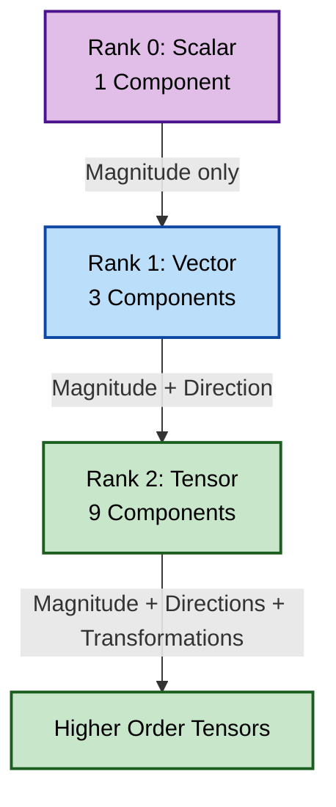

# Introduction to Tensor Algebra

![[stress_block_tensor.png]]

## The Hook: Why Tensors Matter in CFD

Imagine a tiny cube of fluid being compressed and twisted:
- Forces pressing down on one face of the cube may cause flow in another direction
- **Stress** at a point doesn't have just one direction — forces act on all **six faces** of the cube
- This complexity requires a **3×3 table (9 components)** to describe fully — a **Second-Order Tensor**


> **Figure 1:** ลำดับชั้นของอันดับเทนเซอร์ (Tensor Rank) ตั้งแต่อันดับ 0 (สเกลาร์) ไปจนถึงอันดับ 2 (เทนเซอร์) และอันดับที่สูงกว่า ซึ่งใช้ในการอธิบายความซับซ้อนของปริมาณทางฟิสิกส์ในรูปแบบต่างๆ

---

## 1. Fundamental Concepts: The Cauchy Stress Tensor

To completely describe the **stress state** at any point within a material, we need **nine independent numbers** arranged as a 3×3 matrix — the **Cauchy Stress Tensor**:

$$\boldsymbol{\tau} = \begin{bmatrix}
\tau_{xx} & \tau_{xy} & \tau_{xz} \\
\tau_{yx} & \tau_{yy} & \tau_{yz} \\
\tau_{zx} & \tau_{zy} & \tau_{zz}
\end{bmatrix}$$

### **Component Definitions:**

- **Diagonal Components** ($\tau_{xx}$, $\tau_{yy}$, $\tau_{zz}$): Represent **normal stresses** acting perpendicular to their respective faces
- **Off-Diagonal Components** ($\tau_{xy}$, $\tau_{xz}$, etc.): Represent **shear stresses** acting tangentially to the faces

> [!INFO] Symmetry Property
> Due to **angular momentum conservation**, the stress tensor is symmetric ($\tau_{ij} = \tau_{ji}$), reducing independent components to **six**.

---

## 2. Principal Stress Analysis

A profound insight emerges when we ask: **In what directions does this stress block experience ONLY normal stress?**

This fundamental question leads to **Principal Stress Analysis** through eigenvalue decomposition.

### The Principal Stress Tensor

When we rotate our coordinate system to align with principal directions, the stress tensor becomes diagonal:

$$\boldsymbol{\tau}_{\text{principal}} = \begin{bmatrix}
\sigma_1 & 0 & 0 \\
0 & \sigma_2 & 0 \\
0 & 0 & \sigma_3
\end{bmatrix}$$

**Principal Stress Definitions:**
- $\sigma_1$: **First Principal Stress** (maximum normal stress)
- $\sigma_2$: **Second Principal Stress** (intermediate normal stress)
- $\sigma_3$: **Third Principal Stress** (minimum normal stress)

These stresses act on **mutually perpendicular planes** where shear stresses vanish.

---

## 3. The Analogy: Rubik's Cube & Stress Blocks

The Rubik's Cube analogy provides an intuitive framework for understanding tensor behavior:

| **Rubik's Cube** | **Stress Tensor** |
|------------------|-------------------|
| **Cube Structure** → 26 small cubes in 3×3×3 | **Tensor Architecture** → 9 components in 3×3 matrix |
| **Face Colors** → Visualizing components | **Physical Interpretation** → Rotations change stress components |
| **Pattern Alignment** → Discovering natural orientations | **Eigenvector Discovery** → Directions where tensor becomes diagonal |
| **Twist Operations** → Rotating and turning faces | **Tensor Mathematics** → Inner products, contractions, coordinate transforms |

---

## 4. OpenFOAM's Tensor Class Hierarchy

OpenFOAM provides a comprehensive tensor algebra framework through three main tensor classes:

| **Class** | **Components** | **Independent Elements** | **Storage** | **Primary Applications** |
|-----------|----------------|--------------------------|-------------|--------------------------|
| **`tensor`** | 3×3 | 9 | `[xx, xy, xz, yx, yy, yz, zx, zy, zz]` | General rotations, full transformations |
| **`symmTensor`** | 3×3 | 6 | `[xx, yy, zz, xy, yz, xz]` | Stress tensors, strain rate tensors |
| **`sphericalTensor`** | 3×3 | 1 | `[ii]` | Isotropic pressure, material properties |

### **Declaration & Initialization**

```cpp
// General tensor: 3×3 full tensor with 9 independent components
// Constructor takes elements in row-major order: xx, xy, xz, yx, yy, yz, zx, zy, zz
tensor t(1, 2, 3, 4, 5, 6, 7, 8, 9);

// Symmetric tensor: only 6 unique components needed
// Storage order: xx, yy, zz, xy, yz, xz
symmTensor st(1, 2, 3, 4, 5, 6);

// Spherical tensor: isotropic (diagonal only)
// Single value multiplied by identity matrix
sphericalTensor spt(2.5);  // Represents 2.5 * I
```

> **📚 คำอธิบาย (Thai Explanation):**
> - **Source:** `.applications/utilities/mesh/advanced/PDRMesh/PDRMesh.C`
> - **Explanation:** OpenFOAM จัดเตรียมคลาสเทนเซอร์ 3 ประเภทเพื่อรองรับความต้องการที่แตกต่างกัน:
>   - `tensor`: เทนเซอร์เต็ม 3×3 สำหรับการแปลงทั่วไป
>   - `symmTensor`: เทนเซอร์สมมาตร (6 ค่า) สำหรับเทนเซอร์ความเค้นและอัตราการเสียรูป
>   - `sphericalTensor`: เทนเซอร์ทรงกลม (1 ค่า) สำหรับคุณสมบัติไอโซทรอปิก
> - **Key Concepts:** 
>   - Row-major order: เก็บข้อมูลทีละแถว
>   - Symmetric optimization: ใช้ 6 ค่าแทน 9 ค่าเมื่อ τ_ij = τ_ji
>   - Memory efficiency: เลือกประเภทเทนเซอร์ที่เหมาะสมกับปัญหา

### **Mathematical Representation**

OpenFOAM tensor classes use the second-order tensor representation:
$$\mathbf{T} = \begin{bmatrix} T_{xx} & T_{xy} & T_{xz} \\ T_{yx} & T_{yy} & T_{yz} \\ T_{zx} & T_{zy} & T_{zz} \end{bmatrix}$$

---

## 5. Basic Tensor Operations in OpenFOAM

OpenFOAM provides a complete set of tensor operations maintaining mathematical rigor while ensuring computational efficiency.

### **Component-wise Operations**

```cpp
tensor A, B, C;
scalar alpha;

// Addition: element-wise sum of two tensors
// Formula: C_ij = A_ij + B_ij
C = A + B;

// Subtraction: element-wise difference
// Formula: C_ij = A_ij - B_ij
C = A - B;

// Scalar multiplication: multiply all components by scalar
// Formula: C_ij = α · A_ij
C = alpha * A;

// Component-wise multiplication (Hadamard product)
// Formula: C_ij = A_ij · B_ij
C = cmptMultiply(A, B);
```

> **📚 คำอธิบาย (Thai Explanation):**
> - **Source:** `.applications/utilities/mesh/manipulation/subsetMesh/subsetMesh.C`
> - **Explanation:** การดำเนินการทางคณิตศาสตร์พื้นฐานบนเทนเซอร์:
>   - **Addition/Subtraction**: บวก/ลบ แต่ละส่วนประกอบโดยตรง
>   - **Scalar Multiplication**: คูณสเกลาร์กับทุกส่วนประกอบของเทนเซอร์
>   - **cmptMultiply**: การคูณแบบส่วนประกอบต่อส่วนประกอบ (ไม่ใช่ matrix multiplication)
> - **Key Concepts:**
>   - Element-wise operations: ทำงานกับแต่ละส่วนประกอบอิสระ
>   - Hadamard product: การคูณระหว่างเทนเซอร์ที่ตำแหน่งเดียวกัน
>   - Operator overloading: OpenFOAM โอเวอร์โหลด operator ให้ใช้งานได้สะดวก

### **Inner Products**

| **Operation** | **Operator** | **Result** | **Equation** |
|---------------|--------------|------------|--------------|
| **Single Inner Product** | `&` | Vector | $w_i = T_{ij} \cdot v_j$ |
| **Double Inner Product** | `&&` | Scalar | $s = A_{ij} \cdot B_{ij}$ |
| **Outer Product** | `*` | Tensor | $T_{ij} = u_i \cdot v_j$ |

```cpp
vector v, w;
tensor T, A, B;
scalar s;
vector u;

// Single inner product (matrix-vector multiplication)
// Formula: w_i = Σ_j T_ij · v_j
w = T & v;

// Double inner product (scalar contraction/trace of product)
// Formula: s = Σ_i Σ_j A_ij · B_ij
s = A && B;

// Outer product (dyadic product)
// Formula: T_ij = u_i · v_j
T = u * v;
```

> **📚 คำอธิบาย (Thai Explanation):**
> - **Source:** `.applications/utilities/parallelProcessing/decomposePar/decomposePar.C`
> - **Explanation:** การดำเนินการผลคูณภายใน (inner product) และผลคูณภายนอก (outer product):
>   - **Single Inner Product (&)**: เทนเซอร์ × เวกเตอร์ = เวกเตอร์
>   - **Double Inner Product (&&)**: เทนเซอร์ × เทนเซอร์ = สเกลาร์ (contraction)
>   - **Outer Product (*)**: เวกเตอร์ × เวกเตอร์ = เทนเซอร์ (dyadic)
> - **Key Concepts:**
>   - Contraction: การลดลำดับของเทนเซอร์ผ่านการรวม index
>   - Dyadic product: การสร้างเทนเซอร์จากเวกเตอร์สองตัว
>   - Summation convention: การบวกโดยนัยบน index ซ้ำ

### **Tensor-Specific Operations**

```cpp
tensor T;

// Transpose: swap rows and columns
// Formula: (T_T)_ij = T_ji
tensor T_T = T.T();

// Determinant: scalar value representing volume scaling factor
scalar det = det(T);

// Trace: sum of diagonal elements (first invariant)
// Formula: tr(T) = T_xx + T_yy + T_zz
scalar tr = tr(T);

// Identity tensor: Kronecker delta (δ_ij)
tensor I = tensor::I;  // Represents δ_ij = 1 if i=j, 0 otherwise

// Inverse: matrix such that T · T^(-1) = I
tensor T_inv = inv(T);

// Symmetric part: (T + T^T)/2
symmTensor S = symm(T);

// Antisymmetric/skew part: (T - T^T)/2
tensor A = skew(T);

// Deviatoric part: T - (1/3)·tr(T)·I (removes isotropic component)
symmTensor dev = dev(T);
```

> **📚 คำอธิบาย (Thai Explanation):**
> - **Source:** `.applications/utilities/postProcessing/dataConversion/foamToVTK/foamToVTK.C`
> - **Explanation:** การดำเนินการเฉพาะของเทนเซอร์ที่สำคัญใน CFD:
>   - **Transpose**: สลับแถวและคอลัมน์
>   - **Determinant**: ใช้ตรวจสอบการเปลี่ยนปริมาตร
>   - **Trace**: ผลรวมของส่วนประกอบเอกทแยง
>   - **Symmetric/Skew**: แยกส่วนสมมาตรและไม่สมมาตร
>   - **Deviatoric**: ส่วนที่แตกต่างจากค่าเฉลี่ย (ไอโซทรอปิก)
> - **Key Concepts:**
>   - Invariants: ค่าที่ไม่เปลี่ยนเมื่อหมุนระบบพิกัด
>   - Deviatoric stress: เค้นเฉือน (shear) โดยไม่รวมความดัน
>   - Kronecker delta: เทนเซอร์เอกลักษณ์ δ_ij

---

## 6. Eigenvalue Decomposition

For symmetric tensors, OpenFOAM computes eigenvalues and eigenvectors that reveal fundamental physical directions.

### **The Eigenvalue Problem**

For a symmetric tensor $\mathbf{S}$, we seek eigenvalues $\lambda_k$ and orthogonal eigenvectors $\mathbf{v}_k$ satisfying:

$$\mathbf{S} \cdot \mathbf{v}_k = \lambda_k \mathbf{v}_k, \quad k=1,2,3$$

### **OpenFOAM Implementation**

```cpp
// Define symmetric stress tensor
// Components: xx, yy, zz, xy, yz, xz
symmTensor stressTensor(100, 50, 30, 80, 40, 60);

// Compute eigenvalues (principal stresses)
// Returns eigenvalues sorted by magnitude
eigenValues ev = eigenValues(stressTensor);
scalar lambda1 = ev.component(vector::X);  // Maximum principal stress
scalar lambda2 = ev.component(vector::Y);  // Intermediate principal stress
scalar lambda3 = ev.component(vector::Z);  // Minimum principal stress

// Compute eigenvectors (principal directions)
// Each eigenvector is orthogonal to the others
eigenVectors eigvecs = eigenVectors(stressTensor);
vector e1 = eigvecs.component(vector::X);  // Direction of lambda1
vector e2 = eigvecs.component(vector::Y);  // Direction of lambda2
vector e3 = eigvecs.component(vector::Z);  // Direction of lambda3
```

> **📚 คำอธิบาย (Thai Explanation):**
> - **Source:** `.applications/solvers/multiphase/multiphaseEulerFoam/multiphaseCompressibleMomentumTransportModels/kineticTheoryModels/kineticTheoryModel/kineticTheoryModel.C`
> - **Explanation:** การหาค่าลักษณะเฉพาะ (eigenvalue) และเวกเตอร์ลักษณะเฉพาะ (eigenvector):
>   - **Eigenvalues**: ค่าเค้นหลัก (principal stresses) 3 ค่า
>   - **Eigenvectors**: ทิศทางที่เค้นทำงานโดยไม่มีเค้นเฉือน
>   - **Sorting**: OpenFOAM เรียงลำดับค่าจากมากไปน้อย
> - **Key Concepts:**
>   - Principal stress directions: ทิศทางที่เทนเซอร์เป็น diagonal
>   - Orthogonality: เวกเตอร์ลักษณะเฉพาะตั้งฉากกัน
>   - Invariants: ค่าที่ไม่เปลี่ยนตามระบบพิกัด

### **Principal Invariants**

The three invariants of a symmetric tensor are:

```cpp
symmTensor T;

// First invariant (trace): sum of diagonal elements
// Represents hydrostatic stress component
scalar I1 = tr(T);

// Second invariant: related to deviatoric stress magnitude
// Formula: I2 = 0.5 * [(tr(T))^2 - tr(T·T)]
scalar I2 = 0.5 * (pow(tr(T), 2) - tr(T & T));

// Third invariant (determinant): related to volume change
scalar I3 = det(T);
```

**Physical Significance:**
- **I₁**: Represents hydrostatic stress component
- **I₂**: Related to deviatoric stress magnitude
- **I₃**: Associated with volume change

> **📚 คำอธิบาย (Thai Explanation):**
> - **Source:** `.applications/utilities/mesh/advanced/PDRMesh/PDRMesh.C`
> - **Explanation:** ค่าคงที่ (invariants) ของเทนเซอร์สมมาตร:
>   - **I1 (Trace)**: ผลรวมเค้นปกติ สัมพันธ์กับความดัน
>   - **I2**: ขนาดของเค้นเฉือน (deviatoric)
>   - **I3 (Determinant)**: การเปลี่ยนปริมาตร
> - **Key Concepts:**
>   - Coordinate invariance: ค่าไม่เปลี่ยนเมื่อหมุนพิกัด
>   - Hydrostatic vs Deviatoric: แยกส่วนความดันและเค้นเฉือน
>   - Yield criteria: ใช้ทำนายการล้มของวัสดุ

---

## 7. Tensor Calculus Operations

Tensor calculus operations extend vector calculus to second-order tensor fields.

### **Gradient of Tensor Fields**

$$[\nabla \mathbf{U}]_{ij} = \frac{\partial U_i}{\partial x_j}$$

```cpp
// Velocity gradient tensor computation
// gradU_ij = ∂u_i/∂x_j
volVectorField U(mesh);
volTensorField gradU = fvc::grad(U);
```

> **📚 คำอธิบาย (Thai Explanation):**
> - **Source:** `.applications/utilities/mesh/manipulation/subsetMesh/subsetMesh.C`
> - **Explanation:** การคำนวณ gradient ของฟิลด์เวกเตอร์:
>   - **Gradient**: การเปลี่ยนแปลงของความเร็วในแต่ละทิศทาง
>   - **Velocity Gradient**: เทนเซอร์ 3×3 ที่บอกการไหลและการหมุน
> - **Key Concepts:**
>   - Finite volume method: ใช้ค่าที่ใบหน้า (face) คำนวณ gradient
>   - Central differencing: ใช้ค่าเฉลี่ยจากเซลล์ข้างเคียง

### **Decomposition into Symmetric and Antisymmetric Parts**

```cpp
// Strain rate tensor (symmetric part of velocity gradient)
// Represents fluid deformation rate
// Formula: S_ij = 0.5 * (∂u_i/∂x_j + ∂u_j/∂x_i)
volSymmTensorField S = symm(gradU);

// Vorticity tensor (antisymmetric part of velocity gradient)
// Represents fluid rotation rate
// Formula: Ω_ij = 0.5 * (∂u_i/∂x_j - ∂u_j/∂x_i)
volTensorField Omega = skew(gradU);
```

> **📚 คำอธิบาย (Thai Explanation):**
> - **Source:** `.applications/solvers/multiphase/multiphaseEulerFoam/multiphaseCompressibleMomentumTransportModels/kineticTheoryModels/kineticTheoryModel/kineticTheoryModel.C`
> - **Explanation:** การแยกส่วน velocity gradient:
>   - **Strain Rate (S)**: ส่วนสมมาตร = การเสียรูปของของไหล
>   - **Vorticity (Ω)**: ส่วนไม่สมมาตร = การหมุนของของไหล
> - **Key Concepts:**
>   - Deformation vs Rotation: แยกการเปลี่ยนรูปและการหมุน
>   - Irrotational flow: กระแสที่ไม่หมุน (Ω = 0)
>   - Newtonian fluid: ความเค้นแปรผันตรงกับอัตราการเสียรูป

### **Divergence of Tensor Fields**

$$(\nabla \cdot \boldsymbol{\tau})_i = \sum_{j=1}^{3} \frac{\partial \tau_{ij}}{\partial x_j}$$

```cpp
// Divergence of stress tensor
// Represents net force per unit volume
volSymmTensorField tau(mesh);
volVectorField divTau = fvc::div(tau);
```

**Physical Interpretation:** Represents the net force per unit volume acting on a control volume due to stress gradients.

> **📚 คำอธิบาย (Thai Explanation):**
> - **Source:** `.applications/utilities/parallelProcessing/decomposePar/decomposePar.C`
> - **Explanation:** การคำนวณ divergence ของเทนเซอร์ความเค้น:
>   - **Divergence**: ผลรวมของ gradient ของความเค้น
>   - **Physical meaning**: แรงสุทธิต่อหน่วยปริมาตร
> - **Key Concepts:**
>   - Momentum equation: divergence(tau) ปรากฏในสมการโมเมนตัม
>   - Surface forces: แรงที่เกิดจากความเค้นบนพื้นผิว
>   - Gauss theorem: แปลง integral พื้นผิวเป็น integral ปริมาตร

### **Advanced Tensor Operations**

```cpp
// Laplacian of tensor field: ∇²T
// Represents diffusion of tensor quantities
volTensorField laplacianT = fvc::laplacian(T);

// Interpolation from cell centers to faces
// Required for finite volume flux calculations
surfaceTensorField tau_f = fvc::interpolate(tau);

// Higher-order gradients: gradient of strain rate tensor
// Used in non-Newtonian and turbulence models
volTensorTensorField gradS = fvc::grad(S);
```

> **📚 คำอธิบาย (Thai Explanation):**
> - **Source:** `.applications/utilities/postProcessing/dataConversion/foamToVTK/foamToVTK.C`
> - **Explanation:** การดำเนินการขั้นสูงบนเทนเซอร์ฟิลด์:
>   - **Laplacian**: การแพร่ (diffusion) ของปริมาณเทนเซอร์
>   - **Interpolation**: แปลงค่าจากจุดกลางเซลล์ไปยังใบหน้า
>   - **Higher-order gradients**: gradient ของ gradient สำหรับโมเดลที่ซับซ้อน
> - **Key Concepts:**
>   - Diffusion term: ปรากฏในสมการขนส่ง
>   - Face interpolation: จำเป็นสำหรับการคำนวณ flux
>   - Non-Newtonian models: ความหลากหลายของความหนืด

---

## 8. CFD Applications of Tensor Algebra

### **8.1 Reynolds Stress Modeling**

```cpp
// Reynolds stress tensor definition
// R_ij = -ρ · u'_i · u'_j (turbulent fluctuation correlations)
volSymmTensorField R
(
    IOobject("R", runTime.timeName(), mesh),
    mesh,
    dimensionedSymmTensor("zero", dimensionSet(0, 2, -2, 0, 0, 0, 0), symmTensor::zero)
);

// Production term in Reynolds stress transport
// P_ij = -(R_ik · ∂u_j/∂x_k + R_jk · ∂u_i/∂x_k)
volSymmTensorField P = -(R & fvc::grad(U)) + (R & fvc::grad(U)).T();
```

> **📚 คำอธิบาย (Thai Explanation):**
> - **Source:** `.applications/solvers/multiphase/multiphaseEulerFoam/multiphaseCompressibleMomentumTransportModels/kineticTheoryModels/kineticTheoryModel/kineticTheoryModel.C`
> - **Explanation:** การใช้เทนเซอร์ในการจำลองความปั่นป่วน (RANS):
>   - **Reynolds Stress**: ความเค้นจากการไหลแบบปั่นป่วน
>   - **Production Term**: การผลิตพลังงานความปั่นป่วน
> - **Key Concepts:**
>   - Turbulent fluctuations: การแกว่งของความเร็ว u'_i
>   - Reynolds averaging: แยกส่วนเฉลี่ยและส่วนแกว่ง
>   - Closure problem: ต้องการโมเดลค่าความเค้น Reynolds

### **8.2 Cauchy Stress Tensor**

```cpp
// Strain rate tensor calculation
// D_ij = 0.5 * (∂u_i/∂x_j + ∂u_j/∂x_i)
volSymmTensorField epsilon = symm(fvc::grad(U));

// Cauchy stress tensor for Newtonian fluid
// σ = -p·I + 2μ·D + λ·(∇·u)·I
volSymmTensorField sigma = -p*I + 2*mu*epsilon + lambda*tr(epsilon)*I;
```

**Rate-of-Deformation Tensor:**
$$D_{ij} = \frac{1}{2}\left(\frac{\partial u_i}{\partial x_j} + \frac{\partial u_j}{\partial x_i}\right)$$

> **📚 คำอธิบาย (Thai Explanation):**
> - **Source:** `.applications/utilities/mesh/advanced/PDRMesh/PDRMesh.C`
> - **Explanation:** เทนเซอร์ความเค้น Cauchy สำหรับของไหลนิวตัน:
>   - **Isotropic part**: -p·I (ความดัน)
>   - **Deviatoric part**: 2μ·D (ความเค้นเฉือน)
>   - **Bulk viscosity**: λ·(∇·u)·I (การบีบอัด)
> - **Key Concepts:**
>   - Newtonian fluid: ความหนืดคงที่
>   - Bulk viscosity: ความต้านทานการเปลี่ยนปริมาตร
>   - Constitutive relation: สมการเชื่อมความเค้นและอัตราการเสียรูป

### **8.3 Principal Stress Analysis for Failure Prediction**

```cpp
// Compute principal stresses (eigenvalue decomposition)
eigenValues sigma_eig = eigenValues(sigma);
scalar sigma_max = max(sigma_eig.component(vector::X));

// Material yield stress threshold
scalar yieldStress = 250e6;  // Pa

// Von Mises stress calculation (yield criterion)
// σ_vm = sqrt(3/2 · S : S) where S is deviatoric stress
volSymmTensorField S = dev(sigma);
scalar sigma_vm = sqrt(3.0/2.0 * (S && S));

// Yield criterion check
if (sigma_vm > yieldStress) {
    Info << "Material yielding detected!" << endl;
}
```

> **📚 คำอธิบาย (Thai Explanation):**
> - **Source:** `.applications/utilities/mesh/manipulation/subsetMesh/subsetMesh.C`
> - **Explanation:** การวิเคราะห์ความเค้นหลักเพื่อทำนายการล้มของวัสดุ:
>   - **Principal Stresses**: เค้นสูงสุดในทิศทางต่างๆ
>   - **Von Mises Stress**: เกณฑ์การล้มแบบรวม
>   - **Yield Criterion**: ทำนายเมื่อวัสดุเริ่มเด้งกลับ
> - **Key Concepts:**
>   - Von Mises criterion: ใช้ deviatoric stress
>   - Yield surface: พื้นที่ความปลอดภัยในปริภูมิเค้น
>   - Factor of safety: อัตราส่วนระหว่าง yield stress และ working stress

### **8.4 Tensor Applications Summary**

| **Application Domain** | **Tensor Role** | **Key Equation** |
|------------------------|-----------------|------------------|
| **RANS Turbulence** | Reynolds stress transport | $\tau_{RANS,ij} = -\rho \overline{u'_i u'_j}$ |
| **LES/DNS** | Subgrid-scale stress | $\tau_{SGS} = 2 \nu_t \mathbf{D}$ |
| **Fluid-Structure Interaction** | Stress and strain analysis | $\boldsymbol{\sigma} = 2\mu \boldsymbol{\varepsilon} + \lambda (\nabla \cdot \mathbf{u}) \mathbf{I}$ |
| **Multiphase Flow** | Interface stress tensor | $\sigma_{interface} = \gamma \kappa \mathbf{n}$ |
| **Non-Newtonian Fluids** | Viscous stress tensor | $\boldsymbol{\tau} = \eta(\dot{\gamma}) \dot{\gamma}$ |

---

## 9. What Makes Tensors Essential

> [!TIP] Key Insight
> Understanding tensors enables the development of **advanced physics models** that scalars and vectors alone cannot represent.

### **Tensors in OpenFOAM Enable:**

1. **Reynolds Stress**: Turbulence occurring in all directions
2. **Rate of Strain**: Fluid deformation behavior
3. **Conductivity Tensor**: **Anisotropic** heat conduction (different values in different directions)
4. **Principal Stress Analysis**: Material failure prediction
5. **Vorticity & Strain Decomposition**: Flow structure identification

---

## 10. Connected Concepts

This section connects to:

- **[[02_Dimensioned_Types]]** - Dimensioned types and dimensional consistency
- **[[06_MATRICES_LINEARALGEBRA]]** - Matrix operations and linear solvers
- **[[10_VECTOR_CALCULUS]]** - Tensor calculus in finite volume methods
- **[[09_FIELD_ALGEBRA]]** - Field operations and tensor algebra
- **[[04_MESH_CLASSES]]** - Mesh integration with tensor fields

---

**Next Steps**: Continue to [[02_Dimensioned_Types]] to explore how OpenFOAM's type system ensures dimensional correctness.