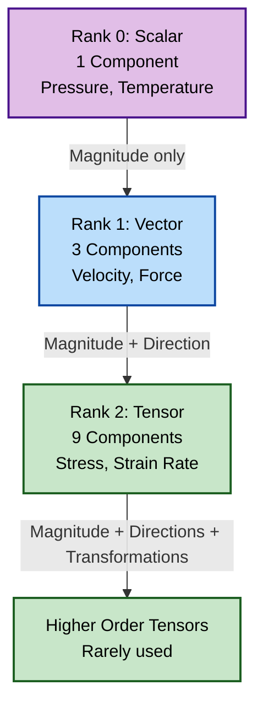
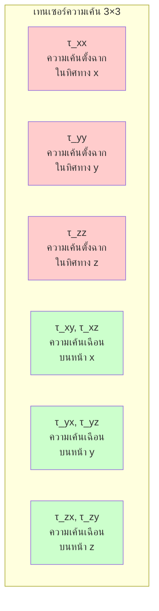
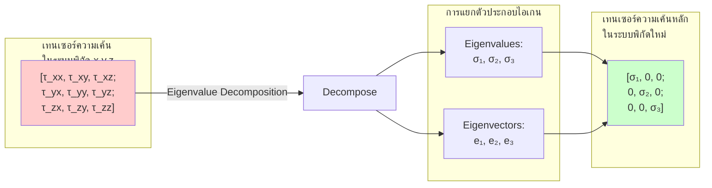
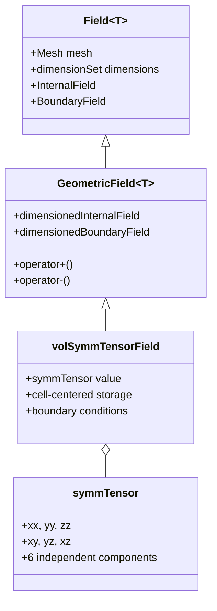
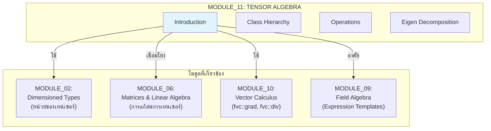

# บทนำสูงพีชคณิตเทนเซอร์ (Introduction to Tensor Algebra)

> **🎯 Learning Objectives**
> หลังจากศึกษาบทนี้ คุณจะสามารถ:
> - อธิบาย **แนวคิดเทนเซอร์ความเค้น Cauchy** และความสำคัญในการไหลของไหล
> - เข้าใจ **การวิเคราะห์ความเค้นหลัก** ผ่านการแยกตัวประกอบไอเกน
> - เชื่อมโยง **แนวคิดทางฟิสิกส์** กับ **การจัดเก็บและการคำนวณเทนเซอร์** ใน OpenFOAM
> - รู้จัก **คลาสเทนเซอร์พื้นฐาน** ที่ใช้ใน OpenFOAM (ตัวอย่างเบื้องต้น)
> - ตระหนักถึง **การประยุกต์ใช้เทนเซอร์** ใน CFD applications

> [!TIP] ทำไมต้องเรียนรู้เทนเซอร์?
> เทนเซอร์เป็นภาษาหลักที่ใช้อธิบาย **ปรากฎการณ์ทางฟิสิกส์ที่ซับซ้อน** ในการไหลของไหล (Fluid Dynamics) และความเค้น (Stress) ที่เกิดขึ้นในวัสดุ การเข้าใจเทนเซอร์จะช่วยให้คุณ:
> - สามารถตีความ **เทนเซอร์ความเค้น** และ **เทนเซอร์อัตราการเปลี่ยนรูป (Strain Rate Tensor)** ในสมการ Navier-Stokes
> - เขียนโค้ดที่จัดการกับ **ความปั่นป่วน (Turbulence)**, **ความหนืด (Viscosity)**, และ **ความนำความร้อน (Thermal Conductivity)** ได้อย่างถูกต้อง
> - ทำความเข้าใจการคำนวณเทนเซอร์ใน `fvSchemes` และการแยกตัวประกอบไอเกน (Eigenvalue) สำหรับการวิเคราะห์ความเค้น
>
> **การเรียนรู้เทนเซอร์จะทำให้คุณเข้าใจฟิสิกส์เชิงลึกและเขียนโค้ด OpenFOAM ได้อย่างมั่นใจ**

![[stress_block_tensor.png]]

---

## 1. ทำไมเทนเซอร์จึงสำคัญใน CFD? (Why Tensors Matter in CFD)

> [!NOTE] **📂 OpenFOAM Context**
>
> **โดเมน:** Physics & Fields (ฟิสิกส์และฟิลด์)
>
> เทนเซอร์ความเค้นในทางปฏิบัติจะถูกคำนวณและจัดเก็บในรูปแบบ **VolFields**:
> - **0/* (Initial Conditions):** เทนเซอร์ความเค้นเริ่มต้น (ถ้ามี) จะถูกกำหนดที่นี่
> - **constant/transportProperties:** ความหนืด ($\mu$) และความหนืดของปั่นป่วน ($\mu_t$) ที่ใช้คำนวณเทนเซอร์ความเค้น
> - **constant/turbulenceProperties:** เทนเซอร์ความเค้น Reynolds ($R_{ij}$) ในโมเดลความปั่นป่วน RANS
> - **Code Context:** ใน Solver Code จะใช้ `volSymmTensorField` เพื่อเก็บความเค้นทุกจุดใน mesh
>
> **คำสำคัญ:** `symmTensor`, `volSymmTensorField`, `transportProperties`, `R`

### 1.1 ลำดับชั้นของปริมาณทางฟิสิกส์

ลองจินตนาการถึงลูกบาศก์ของของไหลขนาดเล็กที่ถูกบีบและบิด:
- แรงที่กดลงบนหน้าหนึ่งของลูกบาศก์อาจทำให้เกิดการไหลในอีกทิศทางหนึ่ง
- **ความเค้น (Stress)** ที่จุดหนึ่งไม่ได้มีแค่ทิศทางเดียว — แรงกระทำต่อทั้ง **6 หน้า** ของลูกบาศก์
- ความซับซ้อนนี้ต้องการ **ตารางขนาด 3×3 (9 องค์ประกอบ)** ในการอธิบายอย่างครบถ้วน — ซึ่งก็คือ **เทนเซอร์อันดับสอง (Second-Order Tensor)**



> **Figure 1:** ลำดับชั้นของอันดับเทนเซอร์ (Tensor Rank) ตั้งแต่อันดับ 0 (สเกลาร์) ไปจนถึงอันดับ 2 (เทนเซอร์) ซึ่งใช้อธิบายความซับซ้อนของปริมาณทางฟิสิกส์ในรูปแบบต่างๆ

### 1.2 การเปรียบเทียบ: Rubik's Cube กับ Stress Block

| **รูบิค (Rubik's Cube)** | **เทนเซอร์ความเค้น (Stress Tensor)** |
|------------------|-------------------|
| **โครงสร้างลูกบาศก์** → ลูกบาศก์เล็ก 26 ชิ้นใน 3×3×3 | **สถาปัตยกรรมเทนเซอร์** → 9 องค์ประกอบในเมทริกซ์ 3×3 |
| **สีหน้าลูกบาศก์** → การมองเห็นองค์ประกอบ | **การตีความทางฟิสิกส์** → การหมุนเปลี่ยนค่าองค์ประกอบความเค้น |
| **การจัดเรียงรูปแบบ** → การค้นหาทิศทางธรรมชาติ | **การค้นหา Eigenvector** → ทิศทางที่เทนเซอร์กลายเป็น diagonal |

> [!INFO] **จุดเชื่อมต่อกับ OpenFOAM**
> - แต่ละ "ลูกบาศก์" ใน Rubik's Cube เปรียบเทียบกับแต่ละ **Cell** ใน **polyMesh** ของ OpenFOAM
> - 6 หน้าของลูกบาศก์ Rubik's Cube เปรียบเทียบกับ 6 **Boundary Faces** ที่เทนเซอร์ความเค้นกระทำ

---

## 2. เทนเซอร์ความเค้น Cauchy (The Cauchy Stress Tensor)

> [!NOTE] **📂 OpenFOAM Context**
>
> **โดเมน:** Physics & Fields (ฟิสิกส์และฟิลด์)
>
> เทนเซอร์ความเค้น Cauchy ในทางปฏิบัติจะถูกคำนวณและจัดเก็บในรูปแบบ **VolFields**:
> - **0/* (Initial Conditions):** เทนเซอร์ความเค้นเริ่มต้น (ถ้ามี) จะถูกกำหนดที่นี่
> - **constant/transportProperties:** ความหนื粘 ($\mu$) และความหนื粘ของปั่นป่วน ($\mu_t$) ที่ใช้คำนวณเทนเซอร์ความเค้น
> - **constant/turbulenceProperties:** เทนเซอร์ความเค้น Reynolds ($R_{ij}$) ในโมเดลความปั่นป่วน RANS
> - **Code Context:** ใน Solver Code จะใช้ `volSymmTensorField` เพื่อเก็บความเค้นทุกจุดใน mesh
>
> **คำสำคัญ:** `symmTensor`, `volSymmTensorField`, `transportProperties`, `R`

### 2.1 คำจำกัดความ

เพื่ออธิบาย **สถานะความเค้น** ที่จุดใดๆ ภายในวัสดุอย่างสมบูรณ์ เราต้องการ **ตัวเลขอิสระ 9 ตัว** ที่จัดเรียงเป็นเมทริกซ์ 3×3 — เรียกว่า **เทนเซอร์ความเค้น Cauchy**:

$$\boldsymbol{\tau} = \begin{bmatrix}
\tau_{xx} & \tau_{xy} & \tau_{xz} \\
\tau_{yx} & \tau_{yy} & \tau_{yz} \\
\tau_{zx} & \tau_{zy} & \tau_{zz}
\end{bmatrix}$$

### 2.2 องค์ประกอบของเทนเซอร์ความเค้น



**คำจำกัดความองค์ประกอบ:**

- **องค์ประกอบแนวทแยง (Diagonal Components)** ($\tau_{xx}$, $\tau_{yy}$, $\tau_{zz}$): แทน **ความเค้นตั้งฉาก (normal stresses)** ที่กระทำตั้งฉากกับหน้าของตัวเอง
- **องค์ประกอบนอกแนวทแยง (Off-Diagonal Components)** ($\tau_{xy}$, $\tau_{xz}$, ฯลฯ): แทน **ความเค้นเฉือน (shear stresses)** ที่กระทำขนานไปกับหน้า

> [!INFO] คุณสมบัติสมมาตร (Symmetry Property)
> เนื่องจาก **การอนุรักษ์โมเมนตัมเชิงมุม**, เทนเซอร์ความเค้นจึงมีสมมาตร ($\tau_{ij} = \tau_{ji}$) ทำให้ลดจำนวนองค์ประกอบอิสระเหลือเพียง **6 ตัว**

### 2.3 From Math to OpenFOAM Code

```cpp
// สร้างเทนเซอร์ความเค้นใน OpenFOAM
volSymmTensorField sigma
(
    IOobject("sigma", runTime.timeName(), mesh, IOobject::NO_READ),
    mesh,
    dimensionedSymmTensor("zero", dimPressure, symmTensor::zero)
);

// คำนวณเทนเซอร์ความเค้นจากความเร็ว
// Cauchy stress for Newtonian fluid: σ = -p·I + 2·μ·ε
volSymmTensorField epsilon = symm(fvc::grad(U));  // Strain rate tensor
sigma = -p*I + 2*mu*epsilon;
```

> **คำอธิบาย:** 
> - `volSymmTensorField`: เก็บเทนเซอร์สมมาตรทุกจุดใน mesh (cell-centered storage)
> - `dimensionedSymmTensor`: เทนเซอร์ที่มีหน่วย (dimensions) ในที่นี้คือความดัน (Pa)
> - `symm(fvc::grad(U))`: คำนวณ strain rate tensor จาก gradient ของความเร็ว
> - สมการ: $\boldsymbol{\sigma} = -p\mathbf{I} + 2\mu\boldsymbol{\varepsilon}$

---

## 3. การวิเคราะห์ความเค้นหลัก (Principal Stress Analysis)

> [!NOTE] **📂 OpenFOAM Context**
>
> **โดเมน:** Numerics & Linear Algebra (เลขวิธีและพีชคณิชเชิงเส้น)
>
> การแยกตัวประกอบไอเกน (Eigenvalue Decomposition) เป็นเทคนิคเชิงตัวเลขที่ใช้ใน:
> - **system/controlDict:** ใช้ `functionObjects` เช่น `eigenValues`, `stressComponents` เพื่อคำนวณและบันทึกค่า eigenvalues ระหว่าง simulation
> - **Post-processing:** การวิเคราะห์ความเค้นหลักเพื่อทำนายจุดที่เกิด fracture หรือ failure ในวัสดุ
> - **Code Context:** ใน Solver หรือ Custom FunctionObject จะเรียกใช้ `eigenValues()` และ `eigenVectors()` จาก OpenFOAM tensor library
>
> **คำสำคัญ:** `eigenValues`, `eigenVectors`, `functionObjects`, `stressComponents`

### 3.1 แนวคิดพื้นฐาน

ความเข้าใจเชิงลึกเกิดขึ้นเมื่อเราถามว่า: **ในทิศทางใดที่ก้อนความเค้นนี้จะรับแรงเฉพาะในแนวตั้งฉากเท่านั้น?** (ไม่มีแรงเฉือน)

คำถามพื้นฐานนี้นำไปสู่ **การวิเคราะห์ความเค้นหลัก** ผ่านการแยกตัวประกอบไอเกน (eigenvalue decomposition)



### 3.2 เทนเซอร์ความเค้นหลัก (The Principal Stress Tensor)

เมื่อเราหมุนระบบพิกัดให้ตรงกับทิศทางหลัก เทนเซอร์ความเค้นจะกลายเป็นรูปแบบทแยงมุม (diagonal):

$$\boldsymbol{\tau}_{\text{principal}} = \begin{bmatrix}
\sigma_1 & 0 & 0 \\
0 & \sigma_2 & 0 \\
0 & 0 & \sigma_3
\end{bmatrix}$$

**คำจำกัดความความเค้นหลัก:**
- $\sigma_1$: **ความเค้นหลักที่หนึ่ง** (ความเค้นตั้งฉากสูงสุด)
- $\sigma_2$: **ความเค้นหลักที่สอง** (ความเค้นตั้งฉากปานกลาง)
- $\sigma_3$: **ความเค้นหลักที่สาม** (ความเค้นตั้งฉากต่ำสุด)

ความเค้นเหล่านี้กระทำบน **ระนาบที่ตั้งฉากซึ่งกันและกัน** ซึ่งความเค้นเฉือนมีค่าเป็นศูนย์

### 3.3 From Math to OpenFOAM Code

```cpp
// สร้างเทนเซอร์ความเค้นตัวอย่าง
symmTensor stressTensor(100, 50, 30, 80, 40, 60);

// คำนวณ eigenvalues (ความเค้นหลัก σ₁, σ₂, σ₃)
vector principals = eigenValues(stressTensor);
scalar sigma1 = principals.component(vector::X);  // Max principal stress
scalar sigma2 = principals.component(vector::Y);
scalar sigma3 = principals.component(vector::Z);

// คำนวณ eigenvectors (ทิธิทางหลัก e₁, e₂, e₃)
tensor directions = eigenVectors(stressTensor);
vector e1 = directions.component(vector::X);  // ทิศทางของ σ₁
```

> **📂 แหล่งที่มา (Source):** `.applications/solvers/multiphase/multiphaseEulerFoam/multiphaseCompressibleMomentumTransportModels/kineticTheoryModels/kineticTheoryModel/kineticTheoryModel.C`
>
> **คำอธิบาย:** `eigenValues()` และ `eigenVectors()` ใช้หาทิศทางหลักและค่าเค้นหลัก ซึ่งสำคัญมากในการวิเคราะห์ความแข็งแรงของวัสดุและพฤติกรรมความปั่นป่วน

> [!TIP] **การประยุกต์ใช้งาน**
> - **Failure Analysis:** ใช้ Von Mises stress หรือ Tresca criterion เพื่อทำนายจุดที่เกิด fracture
> - **Turbulence:** วิเคราะห์ Reynolds stress tensor เพื่อเข้าใจโครงสร้างของกระแสปั่นป่วน
> - **Post-processing:** ใช้ `stressComponents` functionObject เพื่อ visualize ความเค้นหลัก

---

## 4. คลาสเทนเซอร์ใน OpenFOAM (Tensor Classes in OpenFOAM)

> [!NOTE] **📂 OpenFOAM Context**
>
> **โดเมน:** Coding/Customization (การเขียนโค้ดและปรับแต่ง)
>
> คลาสเทนเซอร์ใน OpenFOAM ถูกกำหนดไว้ใน **Source Code** และใช้ทั่วทั้ง framework:
> - **src/OpenFOAM/fields/Fields/:** ไฟล์ header ที่กำหนด `tensor`, `symmTensor`, `sphericalTensor`
> - **src/OpenFOAM/matrices/:** ไฟล์ที่รับผิดชอบการดำเนินการทางคณิตศาสตร์ของเทนเซอร์
> - **Make/files:** เมื่อสร้าง Custom Solver หรือ Library ที่ใช้เทนเซอร์ ต้อง link กับ OpenFOAM core libraries
>
> **คำสำคัญ:** `tensor`, `symmTensor`, `sphericalTensor`, `src/OpenFOAM`, `volSymmTensorField`

### 4.1 ภาพรวมคลาสเทนเซอร์

OpenFOAM มอบเฟรมเวิร์กพีชคณิตเทนเซอร์ที่ครอบคลุมผ่านคลาสเทนเซอร์หลัก 3 คลาส:

| **คลาส** | **องค์ประกอบ** | **องค์ประกอบอิสระ** | **การจัดเก็บ** | **การใช้งานหลัก** |
|-----------|----------------|--------------------------|-------------|--------------------------|
| **`tensor`** | 3×3 | 9 | `[xx, xy, xz, yx, yy, yz, zx, zy, zz]` | การหมุนทั่วไป, การแปลงเต็มรูปแบบ |
| **`symmTensor`** | 3×3 | 6 | `[xx, yy, zz, xy, yz, xz]` | เทนเซอร์ความเค้น, เทนเซอร์อัตราความเครียด |
| **`sphericalTensor`** | 3×3 | 1 | `[ii]` | ความดันไอโซทรอปิก, สมบัติวัสดุ |

### 4.2 ลำดับชั้นคลาสเทนเซอร์



> **Figure 2:** ลำดับชั้นคลาสเทนเซอร์ใน OpenFOAM แสดงความสัมพันธ์ระหว่าง Field class กับ Tensor class

> [!INFO] **ข้อมูลเพิ่มเติม**
> สำหรับรายละเอียดเชิงลึกเกี่ยวกับลำดับชั้นคลาสเทนเซอร์ และการดำเนินการเทนเซอร์ทั้งหมด โปรดดู:
> - **[[02_Tensor_Class_Hierarchy.md]]**: โครงสร้างคลาสเทนเซอร์อย่างละเอียด
> - **[[04_Tensor_Operations.md]]**: การดำเนินการเทนเซอร์ทั้งหมด

### 4.3 การประกาศและการเริ่มต้นค่า (Declaration & Initialization)

```cpp
// General tensor: 3×3 full tensor with 9 independent components
// Constructor takes elements in row-major order: xx, xy, xz, yx, yy, yz, zx, zy, zz
tensor t(1, 2, 3, 4, 5, 6, 7, 8, 9);

// Symmetric tensor: only 6 unique components needed
// Storage order: xx, yy, zz, xy, yz, xz
symmTensor st(1, 2, 3, 4, 5, 6);

// Spherical tensor: isotropic (diagonal only)
// Single value multiplied by identity matrix
sphericalTensor spt(2.5);  // Represents 2.5 * I
```

> **📂 แหล่งที่มา (Source):** `.applications/utilities/mesh/advanced/PDRMesh/PDRMesh.C`
>
> **คำอธิบาย:**
> - `tensor`: เทนเซอร์ทั่วไป เก็บข้อมูลแบบ row-major
> - `symmTensor`: เทนเซอร์สมมาตร เก็บเฉพาะ 6 ค่า (xx, yy, zz และส่วนบนขวา xy, yz, xz) เพื่อประหยัดหน่วยความจำ
> - `sphericalTensor`: เทนเซอร์ทรงกลม เก็บค่าเดียวแทนแนวทแยงทั้งหมด
> - **แนวคิดสำคัญ:** การเลือกประเภทเทนเซอร์ที่เหมาะสมช่วยเพิ่มประสิทธิภาพทั้งหน่วยความจำและความเร็วในการคำนวณ

---

## 5. การประยุกต์ใช้เทนเซอร์ใน CFD (CFD Applications)

> [!NOTE] **📂 OpenFOAM Context**
>
> **โดเมน:** Physics & Fields + Simulation Control (ฟิสิกส์และฟิลด์ + การควบคุมการจำลอง)
>
> การประยุกต์ใช้เทนเซอร์ใน CFD ปรากฏในหลายส่วนของ OpenFOAM Case:
> - **0/U, 0/p, 0/k, 0/epsilon:** เทนเซอร์ความเค้น Reynolds ($R_{ij}$) และ strain rate tensor ถูกคำนวณจากฟิลด์ความเร็วและฟิลด์ความปั่นป่วน
> - **constant/turbulenceProperties:** โมเดลความปั่นป่วนต่างๆ (k-ε, k-ω, Reynolds Stress Model) ใช้เทนเซอร์เพื่ออธิบายความสัมพันธ์ของความเร็วผันผวน
> - **constant/transportProperties:** ความหนืด ($\mu$) และความนำความร้อน ($k$) ใช้ในการคำนวณ stress tensor และ heat flux tensor
> - **system/controlDict:** สามารถเพิ่ม functionObjects เช่น `shearStress`, `strainRate` เพื่อคำนวณและบันทึกค่าเทนเซอร์เหล่านี้
>
> **คำสำคัญ:** `Reynolds stress`, `strain rate tensor`, `heat flux tensor`, `turbulenceProperties`

### 5.1 การประยุกต์ใช้เทนเซอร์ใน OpenFOAM

```mermaid
flowchart TD
    subgraph Applications["การประยุกต์ใช้เทนเซอร์ใน OpenFOAM"]
        direction TB
        
        subgraph Turbulence["ความปั่นป่วน"]
            T1["Reynolds Stress Model<br/>R_ij = -ρ·u'_i·u'_j"]
            T2["k-ε Model<br/>Uses isotropic viscosity"]
            T3["Anisotropic Turbulence<br/>Full tensor treatment"]
        end
        
        subgrid Stress["ความเค้นและความเครียด"]
            S1["Cauchy Stress Tensor<br/>σ = -p·I + 2·μ·ε"]
            S2["Strain Rate Tensor<br/>ε_ij = 0.5·∂u_i/∂x_j + ∂u_j/∂x_i"]
            S3["Deviatoric Stress<br/>σ' = σ - 1/3·trσ·I"]
        end
        
        subgrid Transport["การส่งผ่าน"]
            TR1["Heat Flux Tensor<br/>q_i = -k·∇T"]
            TR2["Momentum Flux<br/>Π_ij = ρ·u_i·u_j + σ_ij"]
            TR3["Species Diffusion<br/>Anisotropic diffusivity"]
        end
    end
    
    style T1 fill:#ffcccc
    style S1 fill:#ccffcc
    style TR1 fill:#ccccff
```

### 5.2 From Math to OpenFOAM Code

#### 5.2.1 เทนเซอร์ความเค้น Reynolds (Reynolds Stress Tensor)

```cpp
// Reynolds stress tensor definition: R_ij = -ρ · u'_i · u'_j
volSymmTensorField R
(
    IOobject("R", runTime.timeName(), mesh),
    mesh,
    dimensionedSymmTensor("zero", dimMass/dimLength/sqr(dimTime), symmTensor::zero)
);
```

**คำอธิบาย:**
- เทนเซอร์ความเค้น Reynolds ใช้เก็บความสัมพันธ์ของความเร็วผันผวนในกระแสปั่นป่วน (Turbulence)
- ใช้ใน Reynolds Stress Model (RSM) ซึ่งเป็นโมเดลความปั่นป่วนแบบ anisotropic
- แต่ละองค์ประกอบ $R_{ij} = -\rho \overline{u'_i u'_j}$ แทนความสัมพันธ์ของความเร็วผันผวนในทิศทาง i และ j

#### 5.2.2 เทนเซอร์ความเค้น Cauchy (Cauchy Stress Tensor)

```cpp
// Strain rate tensor: D_ij = 0.5 * (∂u_i/∂x_j + ∂u_j/∂x_i)
volSymmTensorField epsilon = symm(fvc::grad(U));

// Cauchy stress for Newtonian fluid
volSymmTensorField sigma = -p*I + 2*mu*epsilon;
```

**คำอธิบาย:**
- `fvc::grad(U)`: คำนวณ gradient ของความเร็ว → ให้เทนเซอร์อัตราการเปลี่ยนรูป
- `symm()`: สร้างส่วนสมมาตรของเทนเซอร์ → เหลือเฉพาะ 6 องค์ประกอบอิสระ
- สมการ: $\boldsymbol{\sigma} = -p\mathbf{I} + 2\mu\boldsymbol{\varepsilon}$ ใช้คำนวณแรงภายในของไหลนิวตัน

> [!TIP] **ข้อมูลเชิงลึก (Key Insight)**
> การเข้าใจเทนเซอร์ช่วยให้สามารถพัฒนา **โมเดลฟิสิกส์ขั้นสูง** ที่สเกลาร์และเวกเตอร์เพียงอย่างเดียวไม่สามารถอธิบายได้:
> 1. **ความเค้น Reynolds**: อธิบายความปั่นป่วนที่เกิดขึ้นในทุกทิศทาง
> 2. **อัตราความเครียด**: อธิบายพฤติกรรมการเปลี่ยนรูปของของไหล
> 3. **เทนเซอร์การนำความร้อน**: จำลองการนำความร้อนแบบ **Anisotropic** (ค่าต่างกันในแต่ละทิศทาง)
> 4. **การวิเคราะห์ความเค้นหลัก**: ทำนายการล้มเหลวของวัสดุ
> 5. **การแยก Vorticity & Strain**: ระบุโครงสร้างการไหล

---

## 6. การเชื่อมโยงกับโมดูลอื่น (Connected Concepts)

> [!NOTE] **📂 OpenFOAM Context**
>
> **โดเมน:** Cross-Referencing (การอ้างอิงข้ามโมดูล)
>
> แนวคิดเทนเซอร์เชื่อมโยงกับโมดูลอื่นๆ ใน OpenFOAM Programming:
> - **Dimensioned Types:** เทนเซอร์มีหน่วย (dimensions) เช่น stress มีหน่วยของความดัน (Pa)
> - **Matrices & Linear Algebra:** การดำเนินการเทนเซอร์เป็นพื้นฐานของ sparse linear solvers ใน OpenFOAM
> - **Vector Calculus:** gradient, divergence และ laplacian operators ใช้กับเทนเซอร์ fields (เช่น `fvc::grad(U)` ให้ tensor field)
> - **Field Algebra:** การคำนวณเทนเซอร์ใน OpenFOAM ใช้ expression templates สำหรับประสิทธิภาพสูง
>
> **คำสำคัญ:** `dimensions`, `fvMatrix`, `fvc::grad`, `field algebra`



โมดูลนี้เชื่อมโยงกับ:
- **[[02_Dimensioned_Types]]**: ความสอดคล้องของมิติ — เทนเซอร์มีหน่วย เช่น stress มีหน่วย Pa
- **[[06_MATRICES_LINEARALGEBRA]]**: การดำเนินการเมทริกซ์ — เทนเซอร์คือเมทริกซ์ที่มีความหมายทางฟิสิกส์
- **[[10_VECTOR_CALCULUS]]**: แคลคูลัสเทนเซอร์ใน FVM — gradient, divergence ของเทนเซอร์ fields

---

## 📋 Key Takeaways

สรุปสิ่งสำคัญที่ควรจำจากบทนี้:

1. **เทนเซอร์คือภาษาของฟิสิกส์ที่ซับซ้อน**: เทนเซอร์อันดับสอง (3×3) ใช้อธิบายปริมาณที่มีทิศทางหลายด้าน เช่น ความเค้น อัตราการเปลี่ยนรูป

2. **เทนเซอร์ความเค้น Cauchy**: 
   - มี 9 องค์ประกอบในเมทริกซ์ 3×3
   - มีคุณสมบัติสมมาตร ($\tau_{ij} = \tau_{ji}$) เหลือ 6 ค่าอิสระ
   - แบ่งเป็น normal stresses (แนวทแยง) และ shear stresses (นอกแนวทแยง)

3. **การวิเคราะห์ความเค้นหลัก (Principal Stress Analysis)**:
   - ใช้ Eigenvalue Decomposition เพื่อหาทิศทางที่ไม่มีความเค้นเฉือน
   - Principal stresses ($\sigma_1, \sigma_2, \sigma_3$) คือความเค้นตั้งฉากสูงสุด/กลาง/ต่ำสุด
   - ใช้ใน OpenFOAM: `eigenValues()`, `eigenVectors()`

4. **OpenFOAM มีคลาสเทนเซอร์ 3 ประเภท**:
   - `tensor`: 9 องค์ประกอบ (full tensor)
   - `symmTensor`: 6 องค์ประกอบ (สมมาตร) — ใช้บ่อยที่สุด
   - `sphericalTensor`: 1 องค์ประกอบ (ไอโซทรอปิก)

5. **การประยุกต์ใช้เทนเซอร์ใน CFD**:
   - Reynolds Stress Model (ความปั่นป่วนแบบ anisotropic)
   - Cauchy Stress Tensor (แรงภายในของไหล)
   - Strain Rate Tensor (อัตราการเปลี่ยนรูป)
   - Heat Flux Tensor (การนำความร้อนแบบ anisotropic)

6. **From Math to Code**:
   - `volSymmTensorField`: เก็บเทนเซอร์ทุกจุดใน mesh
   - `symm(fvc::grad(U))`: คำนวณ strain rate tensor
   - `sigma = -p*I + 2*mu*epsilon`: สมการความเค้นสำหรับไหลนิวตัน

---

**ขั้นตอนถัดไป**: ไปที่ [[02_Tensor_Class_Hierarchy.md]] เพื่อเจาะลึกโครงสร้างคลาสเทนเซอร์ของ OpenFOAM

---

## 🧠 Concept Check

<details>
<summary><b>1. ทำไมเทนเซอร์ความเค้น Cauchy จึงมีคุณสมบัติสมมาตร ($\tau_{ij} = \tau_{ji}$)?</b></summary>

เนื่องจาก **การอนุรักษ์โมเมนตัมเชิงมุม (Angular Momentum Conservation)**:

- ถ้า $\tau_{ij} \neq \tau_{ji}$ → จะเกิด **couple** (แรงบิด) ทำให้เกิดการหมุนที่ไม่สมดุล
- สภาวะสมดุลต้องการ $\tau_{xy} = \tau_{yx}$, $\tau_{xz} = \tau_{zx}$, $\tau_{yz} = \tau_{zy}$
- ลดจำนวนองค์ประกอบอิสระจาก **9 → 6** → ใช้ `symmTensor` ใน OpenFOAM

**OpenFOAM Implementation:**
```cpp
// การใช้ symmTensor เพื่อประหยัดหน่วยความจำ
symmTensor stress;  // เก็บเฉพาะ 6 ค่า: xx, yy, zz, xy, yz, xz
```

</details>

<details>
<summary><b>2. Principal Stresses ($\sigma_1, \sigma_2, \sigma_3$) คืออะไรและหาได้อย่างไร?</b></summary>

**Principal Stresses** คือความเค้นตั้งฉากในทิศทางที่ **ไม่มีความเค้นเฉือน** (shear stresses เป็นศูนย์)

**วิธีหา:** ใช้ **Eigenvalue Decomposition**:

**Mathematical Form:**
$$\det(\boldsymbol{\tau} - \sigma\mathbf{I}) = 0$$

**OpenFOAM Implementation:**
```cpp
// สร้างเทนเซอร์ความเค้น
symmTensor sigma = ...;

// คำนวณ eigenvalues (ความเค้นหลัก σ₁, σ₂, σ₃)
vector principals = eigenValues(sigma);  
scalar sigma1 = principals.component(vector::X);  // Max principal stress
scalar sigma2 = principals.component(vector::Y);
scalar sigma3 = principals.component(vector::Z);

// คำนวณ eigenvectors (ทิศทางหลัก e₁, e₂, e₃)
tensor directions = eigenVectors(sigma);
vector e1 = directions.component(vector::X);  // ทิศทางของ σ₁
```

**การใช้งาน:**
- ทำนาย failure (Von Mises, Tresca)
- Visualize stress distribution
- วิเคราะห์จุดวิกฤตในวัสดุ

</details>

<details>
<summary><b>3. ความแตกต่างระหว่าง `tensor`, `symmTensor`, และ `sphericalTensor` คืออะไร?</b></summary>

| **คลาส** | **องค์ประกอบ** | **องค์ประกอบอิสระ** | **การจัดเก็บ** | **ตัวอย่างการใช้งาน** |
|-----------|----------------|--------------------------|-------------|--------------------------|
| **`tensor`** | 3×3 | 9 | `[xx, xy, xz, yx, yy, yz, zx, zy, zz]` | การหมุนทั่วไป, การแปลงเต็มรูปแบบ |
| **`symmTensor`** | 3×3 | 6 | `[xx, yy, zz, xy, yz, xz]` | เทนเซอร์ความเค้น, เทนเซอร์อัตราความเครียด |
| **`sphericalTensor`** | 3×3 | 1 | `[ii]` | ความดันไอโซทรอปิก, สมบัติวัสดุ |

**OpenFOAM Implementation:**
```cpp
// General tensor (9 components)
tensor t(1, 2, 3, 4, 5, 6, 7, 8, 9);

// Symmetric tensor (6 components) — ใช้บ่อยที่สุด
symmTensor st(1, 2, 3, 4, 5, 6);

// Spherical tensor (1 component)
sphericalTensor spt(2.5);  // 2.5 * I

// Field examples
volSymmTensorField stressField(...);  // เก็บความเค้นทุกจุดใน mesh
```

**แนวคิดสำคัญ:** การเลือกประเภทเทนเซอร์ที่เหมาะสมช่วยเพิ่มประสิทธิภาพทั้งหน่วยความจำและความเร็วในการคำนวณ

</details>

---

## 📖 เอกสารที่เกี่ยวข้อง

- **ภาพรวม:** [00_Overview.md](00_Overview.md) — ภาพรวม Tensor Algebra
- **บทถัดไป:** [02_Tensor_Class_Hierarchy.md](02_Tensor_Class_Hierarchy.md) — ลำดับชั้นคลาสเทนเซอร์อย่างละเอียด
- **การดำเนินการ:** [04_Tensor_Operations.md](04_Tensor_Operations.md) — การดำเนินการเทนเซอร์ทั้งหมด
- **Eigen Decomposition:** [05_Eigen_Decomposition.md](05_Eigen_Decomposition.md) — การแยกตัวประกอบไอเกนอย่างละเอียด