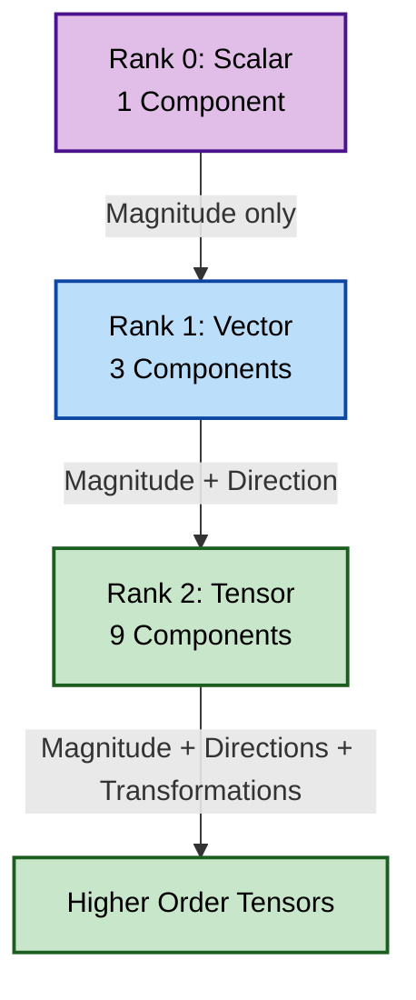

# บทนำสู่พีชคณิตเทนเซอร์ (Introduction to Tensor Algebra)

> [!TIP] ทำไมต้องเรียนรู้เทนเซอร์?
> เทนเซอร์เป็นภาษาหลักที่ใช้อธิบาย **ปรากฎการณ์ทางฟิสิกส์ที่ซับซ้อน** ในการไหลของไหล (Fluid Dynamics) และความเค้น (Stress) ที่เกิดขึ้นในวัสดุ การเข้าใจเทนเซอร์จะช่วยให้คุณ:
> - สามารถตีความ **เทนเซอร์ความเค้น** และ **เทนเซอร์อัตราการเปลี่ยนรูป (Strain Rate Tensor)** ในสมการ Navier-Stokes
> - เขียนโค้ดที่จัดการกับ **ความปั่นป่วน (Turbulence)**, **ความหนืด (Viscosity)**, และ **ความนำความร้อน (Thermal Conductivity)** ได้อย่างถูกต้อง
> - ทำความเข้าใจการคำนวณเทนเซอร์ใน `fvSchemes` และการแยกตัวประกอบไอเกน (Eigenvalue) สำหรับการวิเคราะห์ความเค้น
>
> **การเรียนรู้เทนเซอร์จะทำให้คุณเข้าใจฟิสิกส์เชิงลึกและเขียนโค้ด OpenFOAM ได้อย่างมั่นใจ**

![[stress_block_tensor.png]]

## จุดเริ่มต้น: ทำไมเทนเซอร์ถึงสำคัญใน CFD (The Hook: Why Tensors Matter in CFD)

ลองจินตนาการถึงลูกบาศก์ของของไหลขนาดเล็กที่ถูกบีบและบิด:
- แรงที่กดลงบนหน้าหนึ่งของลูกบาศก์อาจทำให้เกิดการไหลในอีกทิศทางหนึ่ง
- **ความเค้น (Stress)** ที่จุดหนึ่งไม่ได้มีแค่ทิศทางเดียว — แรงกระทำต่อทั้ง **6 หน้า** ของลูกบาศก์
- ความซับซ้อนนี้ต้องการ **ตารางขนาด 3×3 (9 องค์ประกอบ)** ในการอธิบายอย่างครบถ้วน — ซึ่งก็คือ **เทนเซอร์อันดับสอง (Second-Order Tensor)**


> **Figure 1:** ลำดับชั้นของอันดับเทนเซอร์ (Tensor Rank) ตั้งแต่อันดับ 0 (สเกลาร์) ไปจนถึงอันดับ 2 (เทนเซอร์) และอันดับที่สูงกว่า ซึ่งใช้ในการอธิบายความซับซ้อนของปริมาณทางฟิสิกส์ในรูปแบบต่างๆ

---

## 1. แนวคิดพื้นฐาน: เทนเซอร์ความเค้น Cauchy (Fundamental Concepts: The Cauchy Stress Tensor)

> [!NOTE] **📂 OpenFOAM Context**
>
> **โดเมน:** Physics & Fields (ฟิสิกส์และฟิลด์)
>
> เทนเซอร์ความเค้น Cauchy ในทางปฏิบัติจะถูกคำนวณและจัดเก็บในรูปแบบ **VolFields**:
> - **0/* (Initial Conditions):** เทนเซอร์ความเค้นเริ่มต้น (ถ้ามี) จะถูกกำหนดที่นี่
> - **constant/transportProperties:** ความหนื粘 ($\mu$) และความหนื粘ของปั่นป่วน ($\mu_t$) ที่ใช้คำนวณเทนเซอร์ความเค้น
> - **constant/turbulenceProperties:** เทนเซอร์ความเค้น Reynolds ($R_{ij}$) ในโมเดลความปั่นป่วน RANS
> - **Code Context:** ใน Solver Code จะใช้ `volSymmTensorField` เพื่อเก็บความเค้นทุกจุดใน mesh
>
> **คำสำคัญ:** `symmTensor`, `volSymmTensorField`, `transportProperties`, `R`

เพื่ออธิบาย **สถานะความเค้น** ที่จุดใดๆ ภายในวัสดุอย่างสมบูรณ์ เราต้องการ **ตัวเลขอิสระ 9 ตัว** ที่จัดเรียงเป็นเมทริกซ์ 3×3 — เรียกว่า **เทนเซอร์ความเค้น Cauchy**:

$$\boldsymbol{\tau} = \begin{bmatrix}
\tau_{xx} & \tau_{xy} & \tau_{xz} \\
\tau_{yx} & \tau_{yy} & \tau_{yz} \\
\tau_{zx} & \tau_{zy} & \tau_{zz}
\end{bmatrix}$$

### **คำจำกัดความองค์ประกอบ:**

- **องค์ประกอบแนวทแยง (Diagonal Components)** ($\tau_{xx}$, $\tau_{yy}$, $\tau_{zz}$): แทน **ความเค้นตั้งฉาก (normal stresses)** ที่กระทำตั้งฉากกับหน้าของตัวเอง
- **องค์ประกอบนอกแนวทแยง (Off-Diagonal Components)** ($\tau_{xy}$, $\tau_{xz}$, ฯลฯ): แทน **ความเค้นเฉือน (shear stresses)** ที่กระทำขนานไปกับหน้า

> [!INFO] คุณสมบัติสมมาตร (Symmetry Property)
> เนื่องจาก **การอนุรักษ์โมเมนตัมเชิงมุม**, เทนเซอร์ความเค้นจึงมีสมมาตร ($\tau_{ij} = \tau_{ji}$) ทำให้ลดจำนวนองค์ประกอบอิสระเหลือเพียง **6 ตัว**

---

## 2. การวิเคราะห์ความเค้นหลัก (Principal Stress Analysis)

> [!NOTE] **📂 OpenFOAM Context**
>
> **โดเมน:** Numerics & Linear Algebra (เลขวิธีและพีชคณิตเชิงเส้น)
>
> การแยกตัวประกอบไอเกน (Eigenvalue Decomposition) เป็นเทคนิคเชิงตัวเลขที่ใช้ใน:
> - **system/controlDict:** ใช้ `functionObjects` เช่น `eigenValues`, `stressComponents` เพื่อคำนวณและบันทึกค่า eigenvalues ระหว่าง simulation
> - **Post-processing:** การวิเคราะห์ความเค้นหลักเพื่อทำนายจุดที่เกิด fracture หรือ failure ในวัสดุ
> - **Code Context:** ใน Solver หรือ Custom FunctionObject จะเรียกใช้ `eigenValues()` และ `eigenVectors()` จาก OpenFOAM tensor library
>
> **คำสำคัญ:** `eigenValues`, `eigenVectors`, `functionObjects`, `stressComponents`

ความเข้าใจเชิงลึกเกิดขึ้นเมื่อเราถามว่า: **ในทิศทางใดที่ก้อนความเค้นนี้จะรับแรงเฉพาะในแนวตั้งฉากเท่านั้น?** (ไม่มีแรงเฉือน)

คำถามพื้นฐานนี้นำไปสู่ **การวิเคราะห์ความเค้นหลัก** ผ่านการแยกตัวประกอบไอเกน (eigenvalue decomposition)

### เทนเซอร์ความเค้นหลัก (The Principal Stress Tensor)

เมื่อเราหมุนระบบพิกัดให้ตรงกับทิศทางหลัก เทนเซอร์ความเค้นจะกลายเป็นรูปแบบทแยงมุม (diagonal):

$$\boldsymbol{\tau}_{\text{principal}} = \begin{bmatrix}
\sigma_1 & 0 & 0 \\
0 & \sigma_2 & 0 \\
0 & 0 & \sigma_3
\end{bmatrix}$$

**คำจำกัดความความเค้นหลัก:**
- $\sigma_1$: **ความเค้นหลักที่หนึ่ง** (ความเค้นตั้งฉากสูงสุด)
- $\sigma_2$: **ความเค้นหลักที่สอง** (ความเค้นตั้งฉากปานกลาง)
- $\sigma_3$: **ความเค้นหลักที่สาม** (ความเค้นตั้งฉากต่ำสุด)

ความเค้นเหล่านี้กระทำบน **ระนาบที่ตั้งฉากซึ่งกันและกัน** ซึ่งความเค้นเฉือนมีค่าเป็นศูนย์

---

## 3. การเปรียบเทียบ: รูบิค และ ก้อนความเค้น (The Analogy: Rubik's Cube & Stress Blocks)

> [!NOTE] **📂 OpenFOAM Context**
>
> **โดเมน:** Physics & Fields (ฟิสิกส์และฟิลด์)
>
> แบบจำลอง Rubik's Cube นี้เป็น conceptual analogy ที่ช่วยให้เข้าใจ:
> - **Mesh Structure:** แต่ละ "ลูกบาศก์" ใน Rubik's Cube เปรียบเทียบได้กับแต่ละ **Cell** ใน **polyMesh** ของ OpenFOAM
> - **Cell-centered Values:** ค่าเทนเซอร์ที่จุดศูนย์กลางของ cell (cell center) ใช้แทนค่าเฉลี่ยใน cell นั้น
> - **Boundary Faces:** 6 หน้าของลูกบาศก์ Rubik's Cube เปรียบเทียบกับ 6 **Boundary Faces** ที่เทนเซอร์ความเค้นกระทำ
>
> **คำสำคัญ:** `polyMesh`, `cell center`, `boundary faces`, `cell-based storage`

การเปรียบเทียบกับลูกบาศก์รูบิค (Rubik's Cube) ช่วยให้เข้าใจพฤติกรรมของเทนเซอร์ได้ง่ายขึ้น:

| **รูบิค (Rubik's Cube)** | **เทนเซอร์ความเค้น (Stress Tensor)** |
|------------------|-------------------|
| **โครงสร้างลูกบาศก์** → ลูกบาศก์เล็ก 26 ชิ้นใน 3×3×3 | **สถาปัตยกรรมเทนเซอร์** → 9 องค์ประกอบในเมทริกซ์ 3×3 |
| **สีหน้าลูกบาศก์** → การมองเห็นองค์ประกอบ | **การตีความทางฟิสิกส์** → การหมุนเปลี่ยนค่าองค์ประกอบความเค้น |
| **การจัดเรียงรูปแบบ** → การค้นหาทิศทางธรรมชาติ | **การค้นหา Eigenvector** → ทิศทางที่เทนเซอร์กลายเป็น diagonal |
| **การบิดหมุน** → การหมุนและพลิกหน้า | **คณิตศาสตร์เทนเซอร์** → Inner products, contractions, coordinate transforms |

---

## 4. ลำดับชั้นคลาสเทนเซอร์ของ OpenFOAM (OpenFOAM's Tensor Class Hierarchy)

> [!NOTE] **📂 OpenFOAM Context**
>
> **โดเมน:** Coding/Customization (การเขียนโค้ดและปรับแต่ง)
>
> คลาสเทนเซอร์ใน OpenFOAM ถูกกำหนดไว้ใน **Source Code** และใช้ทั่วทั้ง framework:
> - **src/OpenFOAM/fields/Fields/:** ไฟล์ header ที่กำหนด `tensor`, `symmTensor`, `sphericalTensor`
> - **src/OpenFOAM/matrices/:** ไฟล์ที่รับผิดชอบการดำเนินการทางคณิตศาสตร์ของเทนเซอร์
> - **Make/files:** เมื่อสร้าง Custom Solver หรือ Library ที่ใช้เทนเซอร์ ต้อง link กับ OpenFOAM core libraries
> - **Usage:** ใน `.C` files ของ solver หรือ custom boundary conditions
>
> **คำสำคัญ:** `tensor`, `symmTensor`, `sphericalTensor`, `src/OpenFOAM`, `volSymmTensorField`

OpenFOAM มอบเฟรมเวิร์กพีชคณิตเทนเซอร์ที่ครอบคลุมผ่านคลาสเทนเซอร์หลัก 3 คลาส:

| **คลาส** | **องค์ประกอบ** | **องค์ประกอบอิสระ** | **การจัดเก็บ** | **การใช้งานหลัก** |
|-----------|----------------|--------------------------|-------------|--------------------------|
| **`tensor`** | 3×3 | 9 | `[xx, xy, xz, yx, yy, yz, zx, zy, zz]` | การหมุนทั่วไป, การแปลงเต็มรูปแบบ |
| **`symmTensor`** | 3×3 | 6 | `[xx, yy, zz, xy, yz, xz]` | เทนเซอร์ความเค้น, เทนเซอร์อัตราความเครียด |
| **`sphericalTensor`** | 3×3 | 1 | `[ii]` | ความดันไอโซทรอปิก, สมบัติวัสดุ |

### **การประกาศและการเริ่มต้นค่า (Declaration & Initialization)**

```cpp
// General tensor: 3×3 full tensor with 9 independent components
// Constructor takes elements in row-major order: xx, xy, xz, yx, yy, yz, zx, zy, zz
tensor t(1, 2, 3, 4, 5, 6, 7, 8, 9);

// Symmetric tensor: only 6 unique components needed
// Storage order: xx, yy, zz, xy, yz, xz
symmTensor st(1, 2, 3, 4, 5, 6);

// Spherical tensor: isotropic (diagonal only)
// Single value multiplied by identity matrix
sphericalTensor spt(2.5);  // Represents 2.5 * I
```

> **📂 แหล่งที่มา (Source):** `.applications/utilities/mesh/advanced/PDRMesh/PDRMesh.C`
>
> **คำอธิบาย:**
> - `tensor`: เทนเซอร์ทั่วไป เก็บข้อมูลแบบ row-major
> - `symmTensor`: เทนเซอร์สมมาตร เก็บเฉพาะ 6 ค่า (xx, yy, zz และส่วนบนขวา xy, yz, xz) เพื่อประหยัดหน่วยความจำ
> - `sphericalTensor`: เทนเซอร์ทรงกลม เก็บค่าเดียวแทนแนวทแยงทั้งหมด
> - **แนวคิดสำคัญ:** การเลือกประเภทเทนเซอร์ที่เหมาะสมช่วยเพิ่มประสิทธิภาพทั้งหน่วยความจำและความเร็วในการคำนวณ

---

## 5. การดำเนินการเทนเซอร์พื้นฐานใน OpenFOAM (Basic Tensor Operations)

> [!NOTE] **📂 OpenFOAM Context**
>
> **โดเมน:** Coding/Customization (การเขียนโค้ดและปรับแต่ง)
>
> การดำเนินการเทนเซอร์พื้นฐานเป็น **Building Blocks** สำหรับ:
> - **Solver Development:** การเขียนสมการใน solver (เช่น การคำนวณ stress tensor ใน momentum equation)
> - **Custom Boundary Conditions:** การสร้าง BC ที่ต้องการคำนวณค่าที่ boundary faces จากค่าเทนเซอร์
> - **Function Objects:** การสร้าง functionObject สำหรับ post-processing (เช่น การคำนวณ `vorticity` จาก velocity gradient tensor)
>
> **คำสำคัญ:** `&` (single inner), `&&` (double inner), `cmptMultiply`, `T()`, `tr()`, `det()`

OpenFOAM มีชุดการดำเนินการเทนเซอร์ที่ครบถ้วนซึ่งรักษาความถูกต้องทางคณิตศาสตร์พร้อมประสิทธิภาพการคำนวณ

### **การดำเนินการแบบแยกส่วนประกอบ (Component-wise Operations)**

```cpp
tensor A, B, C;
scalar alpha;

// Addition: C_ij = A_ij + B_ij
C = A + B;

// Scalar multiplication: C_ij = α · A_ij
C = alpha * A;

// Component-wise multiplication: C_ij = A_ij · B_ij
C = cmptMultiply(A, B);
```

> **📂 แหล่งที่มา (Source):** `.applications/utilities/mesh/manipulation/subsetMesh/subsetMesh.C`
>
> **คำอธิบาย:** การบวก, ลบ และคูณด้วยสเกลาร์ทำกับทุกองค์ประกอบของเทนเซอร์อย่างอิสระ ส่วน `cmptMultiply` คือการคูณสมาชิกตำแหน่งเดียวกัน (Hadamard product) ไม่ใช่การคูณเมทริกซ์

### **ผลคูณภายใน (Inner Products)**

| **การดำเนินการ** | **ตัวดำเนินการ** | **ผลลัพธ์** | **สมการ** |
|---------------|--------------|------------|--------------|
| **Single Inner Product** | `&` | Vector | $w_i = T_{ij} \cdot v_j$ |
| **Double Inner Product** | `&&` | Scalar | $s = A_{ij} \cdot B_{ij}$ |
| **Outer Product** | `*` | Tensor | $T_{ij} = u_i \cdot v_j$ |

```cpp
vector v, w;
tensor T, A, B;
scalar s;

// Single inner product (Matrix-Vector multiplication)
w = T & v;

// Double inner product (Scalar contraction)
s = A && B;

// Outer product (Dyadic product)
tensor T_out = v * w;
```

> **📂 แหล่งที่มา (Source):** `.applications/utilities/parallelProcessing/decomposePar/decomposePar.C`
>
> **คำอธิบาย:**
> - `&`: ลด rank ลง 1 (Tensor->Vector) เทียบเท่า Matrix-Vector multiplication
> - `&&`: ลด rank ลง 2 (Tensor->Scalar) เทียบเท่า Frobenius inner product หรือการหา trace ของผลคูณ
> - `*`: เพิ่ม rank ขึ้น 2 (Vector->Tensor) เทียบเท่า Outer product

### **การดำเนินการเฉพาะของเทนเซอร์ (Tensor-Specific Operations)**

```cpp
// Transpose: (T_T)_ij = T_ji
tensor T_T = T.T();

// Determinant: volume scaling factor
scalar det = det(T);

// Trace: sum of diagonal elements (first invariant)
scalar tr = tr(T);

// Deviatoric part: T - (1/3)·tr(T)·I
symmTensor dev = dev(T);
```

> **📂 แหล่งที่มา (Source):** `.applications/utilities/postProcessing/dataConversion/foamToVTK/foamToVTK.C`
>
> **คำอธิบาย:** ฟังก์ชันเหล่านี้ช่วยในการวิเคราะห์คุณสมบัติของเทนเซอร์ เช่น `tr()` บอกค่าเฉลี่ยความดัน, `det()` บอกการเปลี่ยนแปลงปริมาตร, และ `dev()` บอกส่วนความเค้นเฉือน

---

## 6. การแยกตัวประกอบไอเกน (Eigenvalue Decomposition)

> [!NOTE] **📂 OpenFOAM Context**
>
> **โดเมน:** Numerics & Linear Algebra (เลขวิธีและพีชคณิตเชิงเส้น)
>
> การแยกตัวประกอบไอเกนใน OpenFOAM เป็น built-in functionality ที่ใช้ใน:
> - **system/controlDict:** ใน `functions` สามารถเพิ่ม `eigenValues` functionObject เพื่อคำนวณและบันทึกค่า eigenvalues ของเทนเซอร์ (เช่น stress tensor, strain rate tensor) ระหว่าง simulation
> - **Post-processing Tools:** utilities เช่น `foamCalc` หรือ custom functionObjects สามารถคำนวณ eigenvalues สำหรับการวิเคราะห์
> - **Code Context:** ฟังก์ชัน `eigenValues()` และ `eigenVectors()` ถูกกำหนดใน `src/OpenFOAM/matrices/`
>
> **คำสำคัญ:** `eigenValues()`, `eigenVectors()`, `functionObjects`, `principal stresses`

สำหรับเทนเซอร์สมมาตร OpenFOAM สามารถคำนวณ eigenvalues และ eigenvectors ซึ่งเปิดเผยทิศทางทางฟิสิกส์ที่สำคัญ

### **OpenFOAM Implementation**

```cpp
symmTensor stressTensor(100, 50, 30, 80, 40, 60);

// Compute eigenvalues (sorted by magnitude)
eigenValues ev = eigenValues(stressTensor);
scalar lambda1 = ev.component(vector::X);  // Max principal stress

// Compute eigenvectors (principal directions)
eigenVectors eigvecs = eigenVectors(stressTensor);
vector e1 = eigvecs.component(vector::X);  // Direction of lambda1
```

> **📂 แหล่งที่มา (Source):** `.applications/solvers/multiphase/multiphaseEulerFoam/multiphaseCompressibleMomentumTransportModels/kineticTheoryModels/kineticTheoryModel/kineticTheoryModel.C`
>
> **คำอธิบาย:** `eigenValues()` และ `eigenVectors()` ใช้หาทิศทางหลักและค่าเค้นหลัก ซึ่งสำคัญมากในการวิเคราะห์ความแข็งแรงของวัสดุและพฤติกรรมความปั่นป่วน

---

## 7. การประยุกต์ใช้เทนเซอร์ใน CFD (CFD Applications of Tensor Algebra)

> [!NOTE] **📂 OpenFOAM Context**
>
> **โดเมน:** Physics & Fields + Simulation Control (ฟิสิกส์และฟิลด์ + การควบคุมการจำลอง)
>
> การประยุกต์ใช้เทนเซอร์ใน CFD ปรากฏในหลายส่วนของ OpenFOAM Case:
> - **0/U, 0/p, 0/k, 0/epsilon:** เทนเซอร์ความเค้น Reynolds ($R_{ij}$) และ strain rate tensor ถูกคำนวณจากฟิลด์ความเร็วและฟิลด์ความปั่นป่วน
> - **constant/turbulenceProperties:** โมเดลความปั่นป่วนต่างๆ (k-ε, k-ω, Reynolds Stress Model) ใช้เทนเซอร์เพื่ออธิบายความสัมพันธ์ของความเร็วผันผวน
> - **constant/transportProperties:** ความหนื粘 ($\mu$) และความนำความร้อน ($k$) ใช้ในการคำนวณ stress tensor และ heat flux tensor
> - **system/controlDict:** สามารถเพิ่ม functionObjects เช่น `shearStress`, `strainRate` เพื่อคำนวณและบันทึกค่าเทนเซอร์เหล่านี้
>
> **คำสำคัญ:** `Reynolds stress`, `strain rate tensor`, `heat flux tensor`, `turbulenceProperties`

### **7.1 แบบจำลองความเค้น Reynolds (Reynolds Stress Modeling)**

```cpp
// Reynolds stress tensor definition: R_ij = -ρ · u'_i · u'_j
volSymmTensorField R
(
    IOobject("R", runTime.timeName(), mesh),
    mesh,
    dimensionedSymmTensor("zero", dimMass/dimLength/sqr(dimTime), symmTensor::zero)
);
```
> ใช้เก็บความสัมพันธ์ของความเร็วผันผวนในกระแสปั่นป่วน (Turbulence)

### **7.2 เทนเซอร์ความเค้น Cauchy (Cauchy Stress Tensor)**

```cpp
// Strain rate tensor: D_ij = 0.5 * (∂u_i/∂x_j + ∂u_j/∂x_i)
volSymmTensorField epsilon = symm(fvc::grad(U));

// Cauchy stress for Newtonian fluid
volSymmTensorField sigma = -p*I + 2*mu*epsilon;
```
> ใช้คำนวณแรงภายในของไหลนิวตัน (ความดัน + ความหนืด)

---

## 8. สิ่งที่ทำให้เทนเซอร์มีความจำเป็น (What Makes Tensors Essential)

> [!NOTE] **📂 OpenFOAM Context**
>
> **โดเมน:** Coding/Customization + Advanced Physics (การเขียนโค้ดและฟิสิกส์ขั้นสูง)
>
> เทนเซอร์เป็นสิ่งจำเป็นเมื่อต้องการ:
> - **พัฒนาโมเดลฟิสิกส์ขั้นสูง:** การสร้าง custom turbulence models, constitutive laws หรือ material models ที่ต้องการเทนเซอร์
> - **Post-processing ขั้นสูง:** การวิเคราะห์ principal stresses, vorticity structures, หรือ anisotropic diffusion
> - **Solver Development:** การเขียนสมการที่มีเทนเซอร์ (เช่น momentum equation with stress tensor, energy equation with heat flux tensor)
>
> **คำสำคัญ:** `custom turbulence models`, `constitutive laws`, `principal stress analysis`

> [!TIP] ข้อมูลเชิงลึก (Key Insight)
> การเข้าใจเทนเซอร์ช่วยให้สามารถพัฒนา **โมเดลฟิสิกส์ขั้นสูง** ที่สเกลาร์และเวกเตอร์เพียงอย่างเดียวไม่สามารถอธิบายได้

### **เทนเซอร์ใน OpenFOAM ช่วยให้สามารถ:**

1.  **ความเค้น Reynolds**: อธิบายความปั่นป่วนที่เกิดขึ้นในทุกทิศทาง
2.  **อัตราความเครียด**: อธิบายพฤติกรรมการเปลี่ยนรูปของของไหล
3.  **เทนเซอร์การนำความร้อน**: จำลองการนำความร้อนแบบ **Anisotropic** (ค่าต่างกันในแต่ละทิศทาง)
4.  **การวิเคราะห์ความเค้นหลัก**: ทำนายการล้มเหลวของวัสดุ
5.  **การแยก Vorticity & Strain**: ระบุโครงสร้างการไหล

---

## 9. แนวคิดที่เชื่อมโยงกัน (Connected Concepts)

> [!NOTE] **📂 OpenFOAM Context**
>
> **โดเมน:** Cross-Referencing (การอ้างอิงข้ามโมดูล)
>
> แนวคิดเทนเซอร์เชื่อมโยงกับโมดูลอื่นๆ ใน OpenFOAM Programming:
> - **Dimensioned Types:** เทนเซอร์มีหน่วย (dimensions) เช่น stress มีหน่วยของความดัน (Pa)
> - **Matrices & Linear Algebra:** การดำเนินการเทนเซอร์เป็นพื้นฐานของ sparse linear solvers ใน OpenFOAM
> - **Vector Calculus:** gradient, divergence และ laplacian operators ใช้กับเทนเซอร์ fields (เช่น `fvc::grad(U)` ให้ tensor field)
> - **Field Algebra:** การคำนวณเทนเซอร์ใน OpenFOAM ใช้ expression templates สำหรับประสิทธิภาพสูง
>
> **คำสำคัญ:** `dimensions`, `fvMatrix`, `fvc::grad`, `field algebra`

โมดูลนี้เชื่อมโยงกับ:
- **[[02_Dimensioned_Types]]**: ความสอดคล้องของมิติ
- **[[06_MATRICES_LINEARALGEBRA]]**: การดำเนินการเมทริกซ์
- **[[10_VECTOR_CALCULUS]]**: แคลคูลัสเทนเซอร์ใน FVM

---

**ขั้นตอนถัดไป**: ไปที่ [[02_Tensor_Class_Hierarchy]] เพื่อเจาะลึกโครงสร้างคลาสเทนเซอร์ของ OpenFOAM