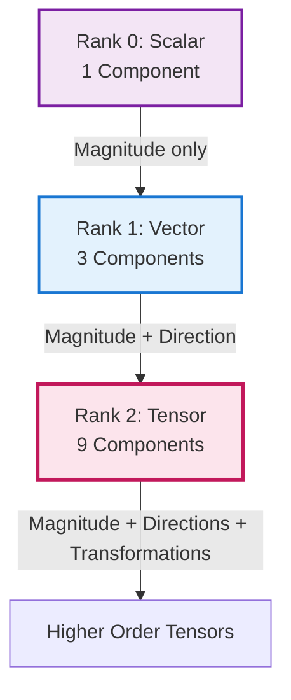

# Introduction to Tensor Algebra

![[stress_block_tensor.png]]

## The Hook: Why Tensors Matter in CFD

Imagine a tiny cube of fluid being compressed and twisted:
- Forces pressing down on one face of the cube may cause flow in another direction
- **Stress** at a point doesn't have just one direction — forces act on all **six faces** of the cube
- This complexity requires a **3×3 table (9 components)** to describe fully — a **Second-Order Tensor**


> **Figure 1:** ลำดับชั้นของอันดับเทนเซอร์ (Tensor Rank) ตั้งแต่อันดับ 0 (สเกลาร์) ไปจนถึงอันดับ 2 (เทนเซอร์) และอันดับที่สูงกว่า ซึ่งใช้ในการอธิบายความซับซ้อนของปริมาณทางฟิสิกส์ในรูปแบบต่างๆความปลอดภัยทางฟิสิกส์ไม่ส่งผลกระทบต่อความเร็วในการจำลอง ผ่านการใช้พลังของ C++ Template Metaprogramming ในการตรวจสอบความสอดคล้องทางมิติทั้งหมดที่ขั้นตอนการคอมไพล์โปรแกรมเพียงครั้งเดียว

---

## 1. Fundamental Concepts: The Cauchy Stress Tensor

To completely describe the **stress state** at any point within a material, we need **nine independent numbers** arranged as a 3×3 matrix — the **Cauchy Stress Tensor**:

$$\boldsymbol{\tau} = \begin{bmatrix}
\tau_{xx} & \tau_{xy} & \tau_{xz} \\
\tau_{yx} & \tau_{yy} & \tau_{yz} \\
\tau_{zx} & \tau_{zy} & \tau_{zz}
\end{bmatrix}$$

### **Component Definitions:**

- **Diagonal Components** ($\tau_{xx}$, $\tau_{yy}$, $\tau_{zz}$): Represent **normal stresses** acting perpendicular to their respective faces
- **Off-Diagonal Components** ($\tau_{xy}$, $\tau_{xz}$, etc.): Represent **shear stresses** acting tangentially to the faces

> [!INFO] Symmetry Property
> Due to **angular momentum conservation**, the stress tensor is symmetric ($\tau_{ij} = \tau_{ji}$), reducing independent components to **six**.

---

## 2. Principal Stress Analysis

A profound insight emerges when we ask: **In what directions does this stress block experience ONLY normal stress?**

This fundamental question leads to **Principal Stress Analysis** through eigenvalue decomposition.

### The Principal Stress Tensor

When we rotate our coordinate system to align with principal directions, the stress tensor becomes diagonal:

$$\boldsymbol{\tau}_{\text{principal}} = \begin{bmatrix}
\sigma_1 & 0 & 0 \\
0 & \sigma_2 & 0 \\
0 & 0 & \sigma_3
\end{bmatrix}$$

**Principal Stress Definitions:**
- $\sigma_1$: **First Principal Stress** (maximum normal stress)
- $\sigma_2$: **Second Principal Stress** (intermediate normal stress)
- $\sigma_3$: **Third Principal Stress** (minimum normal stress)

These stresses act on **mutually perpendicular planes** where shear stresses vanish.

---

## 3. The Analogy: Rubik's Cube & Stress Blocks

The Rubik's Cube analogy provides an intuitive framework for understanding tensor behavior:

| **Rubik's Cube** | **Stress Tensor** |
|------------------|-------------------|
| **Cube Structure** → 26 small cubes in 3×3×3 | **Tensor Architecture** → 9 components in 3×3 matrix |
| **Face Colors** → Visualizing components | **Physical Interpretation** → Rotations change stress components |
| **Pattern Alignment** → Discovering natural orientations | **Eigenvector Discovery** → Directions where tensor becomes diagonal |
| **Twist Operations** → Rotating and turning faces | **Tensor Mathematics** → Inner products, contractions, coordinate transforms |

---

## 4. OpenFOAM's Tensor Class Hierarchy

OpenFOAM provides a comprehensive tensor algebra framework through three main tensor classes:

| **Class** | **Components** | **Independent Elements** | **Storage** | **Primary Applications** |
|-----------|----------------|--------------------------|-------------|--------------------------|
| **`tensor`** | 3×3 | 9 | `[xx, xy, xz, yx, yy, yz, zx, zy, zz]` | General rotations, full transformations |
| **`symmTensor`** | 3×3 | 6 | `[xx, yy, zz, xy, yz, xz]` | Stress tensors, strain rate tensors |
| **`sphericalTensor`** | 3×3 | 1 | `[ii]` | Isotropic pressure, material properties |

### **Declaration & Initialization**

```cpp
// General tensor: 3×3 full tensor
tensor t(1, 2, 3, 4, 5, 6, 7, 8, 9);  // Row-major order

// Symmetric tensor: 6 unique components
symmTensor st(1, 2, 3, 4, 5, 6);  // xx, xy, xz, yy, yz, zz

// Spherical tensor: isotropic
sphericalTensor spt(2.5);  // 2.5 * Identity matrix
```

### **Mathematical Representation**

OpenFOAM tensor classes use the second-order tensor representation:
$$\mathbf{T} = \begin{bmatrix} T_{xx} & T_{xy} & T_{xz} \\ T_{yx} & T_{yy} & T_{yz} \\ T_{zx} & T_{zy} & T_{zz} \end{bmatrix}$$

---

## 5. Basic Tensor Operations in OpenFOAM

OpenFOAM provides a complete set of tensor operations maintaining mathematical rigor while ensuring computational efficiency.

### **Component-wise Operations**

```cpp
tensor A, B, C;
scalar alpha;

// Addition and subtraction
C = A + B;  // C_ij = A_ij + B_ij
C = A - B;  // C_ij = A_ij - B_ij

// Scalar multiplication
C = alpha * A;  // C_ij = α · A_ij

// Component-wise multiplication
C = cmptMultiply(A, B);  // C_ij = A_ij · B_ij
```

### **Inner Products**

| **Operation** | **Operator** | **Result** | **Equation** |
|---------------|--------------|------------|--------------|
| **Single Inner Product** | `&` | Vector | $w_i = T_{ij} \cdot v_j$ |
| **Double Inner Product** | `&&` | Scalar | $s = A_{ij} \cdot B_{ij}$ |
| **Outer Product** | `*` | Tensor | $T_{ij} = u_i \cdot v_j$ |

```cpp
vector v, w;
tensor T, A, B;
scalar s;
vector u;

// Single inner product (matrix-vector multiplication)
w = T & v;  // w_i = T_ij · v_j

// Double inner product (scalar contraction)
s = A && B;  // s = Σ A_ij · B_ij

// Outer product
T = u * v;  // T_ij = u_i · v_j
```

### **Tensor-Specific Operations**

```cpp
tensor T;

// Transpose
tensor T_T = T.T();  // (T_T)_ij = T_ji

// Determinant
scalar det = det(T);

// Trace (sum of diagonal elements)
scalar tr = tr(T);

// Identity tensor
tensor I = tensor::I;  // δ_ij (Kronecker delta)

// Inverse
tensor T_inv = inv(T);

// Symmetric part
symmTensor S = symm(T);  // S = (T + T_T)/2

// Antisymmetric part
tensor A = skew(T);  // A = (T - T_T)/2

// Deviatoric part
symmTensor dev = dev(T);  // dev = T - (1/3)·tr(T)·I
```

---

## 6. Eigenvalue Decomposition

For symmetric tensors, OpenFOAM computes eigenvalues and eigenvectors that reveal fundamental physical directions.

### **The Eigenvalue Problem**

For a symmetric tensor $\mathbf{S}$, we seek eigenvalues $\lambda_k$ and orthogonal eigenvectors $\mathbf{v}_k$ satisfying:

$$\mathbf{S} \cdot \mathbf{v}_k = \lambda_k \mathbf{v}_k, \quad k=1,2,3$$

### **OpenFOAM Implementation**

```cpp
symmTensor stressTensor(100, 50, 30, 80, 40, 60);

// Compute eigenvalues (principal stresses)
eigenValues ev = eigenValues(stressTensor);
scalar lambda1 = ev.component(vector::X);  // Maximum principal stress
scalar lambda2 = ev.component(vector::Y);  // Intermediate principal stress
scalar lambda3 = ev.component(vector::Z);  // Minimum principal stress

// Compute eigenvectors (principal directions)
eigenVectors eigvecs = eigenVectors(stressTensor);
vector e1 = eigvecs.component(vector::X);  // Direction of lambda1
vector e2 = eigvecs.component(vector::Y);  // Direction of lambda2
vector e3 = eigvecs.component(vector::Z);  // Direction of lambda3
```

### **Principal Invariants**

The three invariants of a symmetric tensor are:

```cpp
symmTensor T;

// First invariant (trace)
scalar I1 = tr(T);

// Second invariant (deviatoric part)
scalar I2 = 0.5 * (pow(tr(T), 2) - tr(T & T));

// Third invariant (determinant)
scalar I3 = det(T);
```

**Physical Significance:**
- **I₁**: Represents hydrostatic stress component
- **I₂**: Related to deviatoric stress magnitude
- **I₃**: Associated with volume change

---

## 7. Tensor Calculus Operations

Tensor calculus operations extend vector calculus to second-order tensor fields.

### **Gradient of Tensor Fields**

$$[\nabla \mathbf{U}]_{ij} = \frac{\partial U_i}{\partial x_j}$$

```cpp
volVectorField U(mesh);
volTensorField gradU = fvc::grad(U);  // Velocity gradient tensor
```

### **Decomposition into Symmetric and Antisymmetric Parts**

```cpp
// Strain rate tensor (symmetric part)
volSymmTensorField S = symm(gradU);
// S_ij = 0.5 * (∂u_i/∂x_j + ∂u_j/∂x_i)

// Vorticity tensor (antisymmetric part)
volTensorField Omega = skew(gradU);
// Ω_ij = 0.5 * (∂u_i/∂x_j - ∂u_j/∂x_i)
```

### **Divergence of Tensor Fields**

$$(\nabla \cdot \boldsymbol{\tau})_i = \sum_{j=1}^{3} \frac{\partial \tau_{ij}}{\partial x_j}$$

```cpp
volSymmTensorField tau(mesh);
volVectorField divTau = fvc::div(tau);  // Divergence of stress tensor
```

**Physical Interpretation:** Represents the net force per unit volume acting on a control volume due to stress gradients.

### **Advanced Tensor Operations**

```cpp
// Laplacian of tensor field
volTensorField laplacianT = fvc::laplacian(T);

// Interpolation to faces
surfaceTensorField tau_f = fvc::interpolate(tau);

// Higher-order gradients
volTensorTensorField gradS = fvc::grad(S);  // Gradient of strain rate
```

---

## 8. CFD Applications of Tensor Algebra

### **8.1 Reynolds Stress Modeling**

```cpp
// Reynolds stress tensor: R_ij = -ρ * u'_i * u'_j
volSymmTensorField R
(
    IOobject("R", runTime.timeName(), mesh),
    mesh,
    dimensionedSymmTensor("zero", dimensionSet(0, 2, -2, 0, 0, 0, 0), symmTensor::zero)
);

// Production term: P_ij = -(R_ik·∂u_j/∂x_k + R_jk·∂u_i/∂x_k)
volSymmTensorField P = -(R & fvc::grad(U)) + (R & fvc::grad(U)).T();
```

### **8.2 Cauchy Stress Tensor**

```cpp
// Cauchy stress: σ = -pI + 2μD + λ(∇·u)I
volSymmTensorField epsilon = symm(fvc::grad(U));  // Strain rate tensor
volSymmTensorField sigma = -p*I + 2*mu*epsilon + lambda*tr(epsilon)*I;
```

**Rate-of-Deformation Tensor:**
$$D_{ij} = \frac{1}{2}\left(\frac{\partial u_i}{\partial x_j} + \frac{\partial u_j}{\partial x_i}\right)$$

### **8.3 Principal Stress Analysis for Failure Prediction**

```cpp
// Compute principal stresses
eigenValues sigma_eig = eigenValues(sigma);
scalar sigma_max = max(sigma_eig.component(vector::X));

scalar yieldStress = 250e6;  // Pa

// Von Mises stress calculation
volSymmTensorField S = dev(sigma);  // Deviatoric stress
scalar sigma_vm = sqrt(3.0/2.0 * (S && S));

if (sigma_vm > yieldStress) {
    Info << "Material yielding detected!" << endl;
}
```

### **8.4 Tensor Applications Summary**

| **Application Domain** | **Tensor Role** | **Key Equation** |
|------------------------|-----------------|------------------|
| **RANS Turbulence** | Reynolds stress transport | $\tau_{RANS,ij} = -\rho \overline{u'_i u'_j}$ |
| **LES/DNS** | Subgrid-scale stress | $\tau_{SGS} = 2 \nu_t \mathbf{D}$ |
| **Fluid-Structure Interaction** | Stress and strain analysis | $\boldsymbol{\sigma} = 2\mu \boldsymbol{\varepsilon} + \lambda (\nabla \cdot \mathbf{u}) \mathbf{I}$ |
| **Multiphase Flow** | Interface stress tensor | $\sigma_{interface} = \gamma \kappa \mathbf{n}$ |
| **Non-Newtonian Fluids** | Viscous stress tensor | $\boldsymbol{\tau} = \eta(\dot{\gamma}) \dot{\gamma}$ |

---

## 9. What Makes Tensors Essential

> [!TIP] Key Insight
> Understanding tensors enables the development of **advanced physics models** that scalars and vectors alone cannot represent.

### **Tensors in OpenFOAM Enable:**

1. **Reynolds Stress**: Turbulence occurring in all directions
2. **Rate of Strain**: Fluid deformation behavior
3. **Conductivity Tensor**: **Anisotropic** heat conduction (different values in different directions)
4. **Principal Stress Analysis**: Material failure prediction
5. **Vorticity & Strain Decomposition**: Flow structure identification

---

## 10. Connected Concepts

This section connects to:

- **[[#]]** - Tensor class hierarchy and storage mechanisms
- **[[#]]** - Eigenvalue decomposition algorithms
- **[[#]]** - Tensor calculus in finite volume methods
- **[[#]]** - Practical tensor usage and error examples

---

**Next Steps**: Continue to [[#]] to explore OpenFOAM's tensor class hierarchy in detail.
