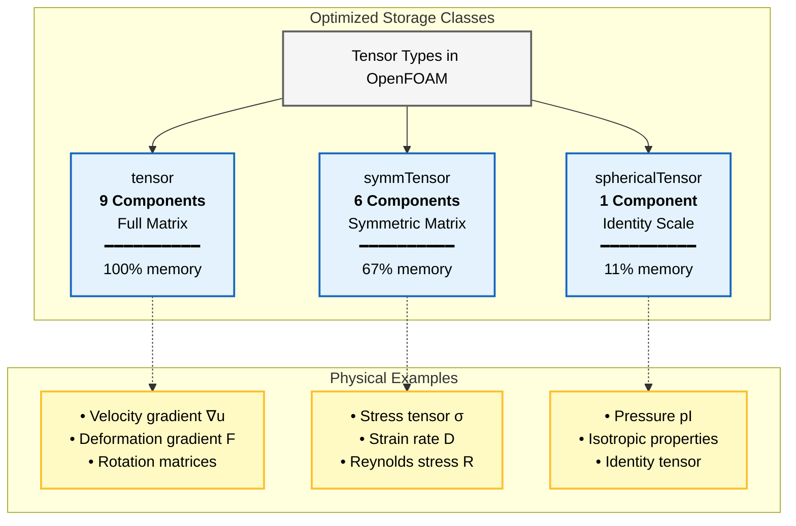
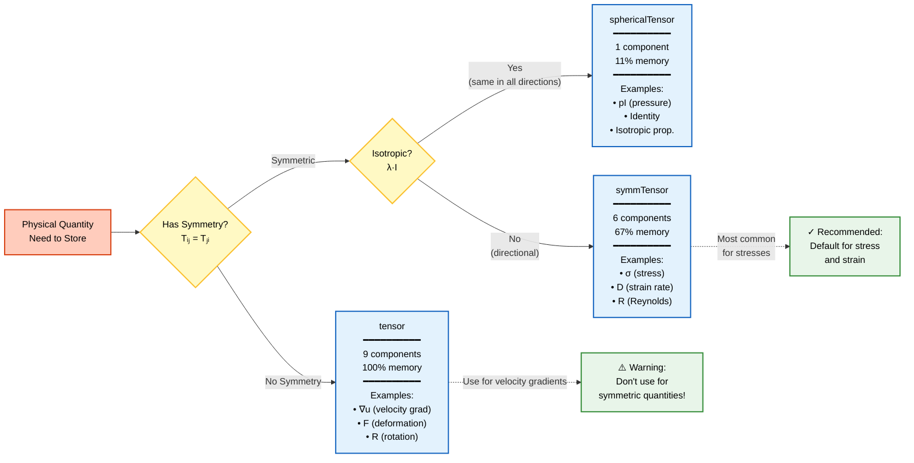

# ลำดับชั้นของคลาสเทนเซอร์ (Tensor Class Hierarchy)

## 🎯 Learning Objectives

หลังจากศึกษาบทนี้ คุณจะสามารถ:
1. **อธิบาย** ความแตกต่างระหว่างสามประเภทหลักของเทนเซอร์ใน OpenFOAM (`tensor`, `symmTensor`, `sphericalTensor`)
2. **เลือก** คลาสเทนเซอร์ที่เหมาะสมสำหรับปัญหาทางฟิสิกส์ที่กำหนด
3. **คำนวณ** การประหยัดหน่วยความจำที่ได้จากการใช้เทนเซอร์เฉพาะทาง
4. **เขียน** โค้ด OpenFOAM ที่ใช้เทนเซอร์ทั้งสามประเภทอย่างถูกต้อง
5. **แปลง** ปัญหาทางคณิตศาสตร์ให้เป็นโค้ด OpenFOAM โดยใช้เทนเซอร์ที่เหมาะสม

---

## 📋 3W Framework Overview

### 🎯 What (อะไรคือ Tensor Class Hierarchy?)
ระบบลำดับชั้นของคลาสเทนเซอร์ใน OpenFOAM ประกอบด้วยสามประเภทหลัก:
- **`tensor`**: เมทริกซ์ 3×3 เต็ม 9 components
- **`symmTensor`**: เมทริกซ์สมมาตร 6 components
- **`sphericalTensor`**: เมทรเซอร์ไอโซทรอปิก 1 component

### 💡 Why (ทำไมต้องเข้าใจ?)
- **ประสิทธิภาพหน่วยความจำ:** การเลือก `symmTensor` แทน `tensor` ประหยัด **33%** ของหน่วยความจำ
- **ความถูกต้องทางฟิสิกส์:** การใช้เทนเซอร์ที่ไม่ตรงกับคุณสมบัติทางฟิสิกส์ อาจทำให้เกิดความผิดพลาดในการคำนวณ
- **พื้นฐานการพัฒนา Solver:** ทุก solver ใน OpenFOAM ใช้เทนเซอร์ทั้งสามประเภทนี้

### 🔧 How (ใช้อย่างไร?)
1. **วิเคราะห์** คุณสมบัติทางฟิสิกส์ของปริมาณที่ต้องการจัดเก็บ
2. **เลือก** คลาสเทนเซอร์ที่ตรงกับคุณสมบัตินั้น
3. **ใช้งาน** ผ่าน `typedef` ของ Field Types (`volTensorField`, `volSymmTensorField`, etc.)

---

## 🔗 From Math to OpenFOAM Code

### คณิตศาสตร์ → โค้ด

| คณิตศาสตร์ | คำอธิบาย | OpenFOAM Code |
|--------------|------------|---------------|
|1$\mathbf{T} = \begin{bmatrix} T_{xx} & T_{xy} & T_{xz} \\ T_{yx} & T_{yy} & T_{yz} \\ T_{zx} & T_{zy} & T_{zz} \end{bmatrix}1| เมทริกซ์เต็ม 9 components | `tensor T(1,2,3,4,5,6,7,8,9);` |
|1$\mathbf{S} = \begin{bmatrix} S_{xx} & S_{xy} & S_{xz} \\ S_{xy} & S_{yy} & S_{yz} \\ S_{xz} & S_{yz} & S_{zz} \end{bmatrix}1| เมทริกซ์สมมาตร 6 components | `symmTensor S(1,2,3,4,5,6);` |
|1$\boldsymbol{\Lambda} = \lambda\mathbf{I}1| เมทริกซ์ไอโซทรอปิก | `sphericalTensor P(2.0);` |

### ตัวอย่างการเลือกประเภทเทนเซอร์

<details>
<summary>📖 <b>Example: Velocity Gradient vs. Stress Tensor</b></summary>

**Velocity Gradient ($\nabla \mathbf{u}$):**
- **ไม่มีคุณสมบัติสมมาตร** → ใช้ `tensor`
```cpp
volTensorField gradU(fvc::grad(U));  // 9 components
```

**Cauchy Stress Tensor ($\boldsymbol{\sigma}$):**
- **สมมาตร** ($\sigma_{ij} = \sigma_{ji}$) → ใช้ `symmTensor`
```cpp
volSymmTensorField sigma(...);  // 6 components
```

**Pressure ($p\mathbf{I}$):**
- **ไอโซทรอปิก** → ใช้ `scalar` หรือ `sphericalTensor`
```cpp
volScalarField p(...);  // 1 component
sphericalTensor pI = p * sphericalTensor(1.0);  // pressure tensor
```

</details>

---

## 📊 Tensor Type Classification



> **Figure 1:** การจำแนกประเภทเทนเซอร์ตามจำนวน components และการเชื่อมโยงกับตัวอย่างทางฟิสิกส์ ซึ่งส่งผลต่อประสิทธิภาพหน่วยความจำ

---

## 🏗️ Architecture Overview

> [!NOTE] **📂 OpenFOAM Context**
> **การเชื่อมโยงกับ Source Code:**
> - **Template Definitions:** 📂 `src/OpenFOAM/primitives/Tensor/Tensor.H`, `SymmTensor.H`, `SphericalTensor.H`
> - **Implementation Files:** 📂 `src/OpenFOAM/primitives/Tensor/Tensor.C`, `SymmTensor.C`, `SphericalTensor.C`
> - **Field Types:** 📂 `src/finiteVolume/fields/volFields/volFields.H`
>
> **ใน Custom Solver:**
> ```cpp
> #include "fvCFD.H"  // รวมเทนเซอร์ทั้งหมด
> // หรือ include เฉพาะที่ต้องการ
> #include "tensor.H"
> #include "symmTensor.H"
> #include "sphericalTensor.H"
> ```

### Class Hierarchy Summary

| ประเภทเทนเซอร์ | Components | Base Class | หน่วยความจำ |
|----------------|-----------|------------|--------------|
| **`tensor`** | 9 อิสระ | `MatrixSpace<tensor<Cmpt>, Cmpt, 3, 3>` | 9 × sizeof(Cmpt) |
| **`symmTensor`** | 6 อิสระ | `VectorSpace<symmTensor<Cmpt>, Cmpt, 6>` | 6 × sizeof(Cmpt) |
| **`sphericalTensor`** | 1 อิสระ | `VectorSpace<sphericalTensor<Cmpt>, Cmpt, 1>` | 1 × sizeof(Cmpt) |

---

## 🧩 1. เทนเซอร์ทั่วไป (`tensor`)

> [!NOTE] **📂 OpenFOAM Context**
> **การใช้งานใน OpenFOAM:**
> - **Gradient Calculations:** 📂 `system/fvSchemes` → `gradSchemes`
> - **Deformation Tensors:** solvers เช่น `solidDisplacementFoam`
> - **Rotation Matrices:** solvers เช่น `MRFSimpleFoam`
> - **Field Files:** 📂 `0/` → `class volTensorField;`
>
> **ตัวอย่างใน Dictionary:**
> ```cpp
> // ในไฟล์ 0/gradU
> dimensions      [0 0 -1 0 0 0 0];
> internalField   uniform (0 0 0 0 0 0 0 0 0);  // 9 components
> ```

### What & Why
เมทริกซ์ 3×3 แบบเต็มที่จัดเก็บข้อมูลแบบ **Row-major** เหมาะสำหรับปริมาณที่ไม่มีคุณสมบัติสมมาตร

### How: การจัดเก็บและการเข้าถึง

**Memory Layout:**
```
[XX][XY][XZ][YX][YY][YZ][ZX][ZY][ZZ]
  0   1   2   3   4   5   6   7   8
```

**Mathematical Representation:**
$$\mathbf{T} = \begin{bmatrix} T_{xx} & T_{xy} & T_{xz} \\ T_{yx} & T_{yy} & T_{yz} \\ T_{zx} & T_{zy} & T_{zz} \end{bmatrix}$$

**Code Implementation:**
```cpp
// Create a full tensor with 9 components
tensor T(1, 2, 3, 4, 5, 6, 7, 8, 9);
// Layout: XX=1, XY=2, XZ=3, YX=4, YY=5, YZ=6, ZX=7, ZY=8, ZZ=9

// Access individual components
scalar Txx = T.xx();  // Access XX component
scalar Txy = T.xy();  // Access XY component
```

### From Math to Code: Velocity Gradient

**Math:**
$$\nabla \mathbf{u} = \begin{bmatrix} \frac{\partial u_x}{\partial x} & \frac{\partial u_x}{\partial y} & \frac{\partial u_x}{\partial z} \\ \frac{\partial u_y}{\partial x} & \frac{\partial u_y}{\partial y} & \frac{\partial u_y}{\partial z} \\ \frac{\partial u_z}{\partial x} & \frac{\partial u_z}{\partial y} & \frac{\partial u_z}{\partial z} \end{bmatrix}$$

**OpenFOAM Code:**
```cpp
volVectorField U(...);
volTensorField gradU(fvc::grad(U));  // Automatically creates 9-component tensor
```

### การประยุกต์ใช้
- เกรเดียนต์ความเร็ว (Velocity gradients,1$\nabla \mathbf{u}$)
- เกรเดียนต์การเปลี่ยนรูปทรง (Deformation gradients,1$\mathbf{F}$)
- เทนเซอร์การหมุน (Rotation tensors)
- การแปลงทั่วไป

---

## ⚖️ 2. เทนเซอร์สมมาตร (`symmTensor`)

> [!NOTE] **📂 OpenFOAM Context**
> **การใช้งานใน OpenFOAM:**
> - **Stress Tensors:** 📂 `0/` → `class volSymmTensorField;`
> - **Strain Rate Tensors:** solvers เช่น `simpleFoam`, `pimpleFoam`
> - **Reynolds Stresses:** 📂 `constant/turbulenceProperties`
>
> **ตัวอย่างใน Dictionary:**
> ```cpp
> // ในไฟล์ 0/R (Reynolds stress)
> dimensions      [0 2 -2 0 0 0 0];
> internalField   uniform (0 0 0 0 0 0);  // 6 components
> ```
>
> **ใน Solver Code:**
> ```cpp
> volSymmTensorField S = symm(fvc::grad(U));
> ```

### What & Why
เทนเซอร์ที่มีคุณสมบัติสมมาตร1$T_{ij} = T_{ji}1จัดเก็บเพียง **6 components** ประหยัดหน่วยความจำ **33%**

### How: การจัดเก็บที่เพิ่มประสิทธิภาพ

**Memory Layout:**
```
[XX][XY][XZ][YY][YZ][ZZ]
  0   1   2   3   4   5
```

**Mathematical Representation:**
$$\mathbf{S} = \begin{bmatrix} S_{xx} & S_{xy} & S_{xz} \\ \mathbf{S_{xy}} & S_{yy} & S_{yz} \\ \mathbf{S_{xz}} & \mathbf{S_{yz}} & S_{zz} \end{bmatrix}$$

**Code Implementation:**
```cpp
// Create with 6 independent components
symmTensor S(1, 2, 3, 4, 5, 6);
// XX=1, XY=2, XZ=3, YY=4, YZ=5, ZZ=6

// Access auto-computed components
scalar Syx = S.yx();  // Equal to S.xy() (auto-computed)
```

### Template Specialization

```cpp
template<>
class Tensor<symmTensor>
{
    scalar data_[6];  // XX, XY, XZ, YY, YZ, ZZ

public:
    scalar& component(int i, int j) {
        if (i > j) std::swap(i, j);  // Upper triangular only
        return data_[triangularIndex(i, j)];
    }
};
```

### From Math to Code: Cauchy Stress Tensor

**Math:**
$$\boldsymbol{\sigma} = \begin{bmatrix} \sigma_{xx} & \sigma_{xy} & \sigma_{xz} \\ \sigma_{xy} & \sigma_{yy} & \sigma_{yz} \\ \sigma_{xz} & \sigma_{yz} & \sigma_{zz} \end{bmatrix}$$

**OpenFOAM Code:**
```cpp
volSymmTensorField sigma
(
    IOobject("sigma", runTime.timeName(), mesh, IOobject::NO_READ, IOobject::AUTO_WRITE),
    mesh,
    dimensionedSymmTensor("sigma", dimensionSet(1, -1, -2, 0, 0, 0, 0), symmTensor::zero)
);
```

### การประยุกต์ใช้
- Reynolds stress tensor ($\mathbf{R} = -\rho \overline{u'_i u'_j}$)
- Rate of strain tensor ($\mathbf{D} = \frac{1}{2}(\nabla \mathbf{u} + \nabla \mathbf{u}^T)$)
- Cauchy stress tensor

---

## 🌐 3. เทนเซอร์ทรงกลม (`sphericalTensor`)

> [!NOTE] **📂 OpenFOAM Context**
> **การใช้งานใน OpenFOAM:**
> - **Identity Operations:** `sphericalTensor(1)` สำหรับ identity tensor
> - **Porous Media:** 📂 `constant/porousProperties` → isotropic resistance
>
> **ใน Solver Code:**
> ```cpp
> sphericalTensor I(1.0);  // Identity tensor
> sphericalTensor pI = p * I;  // Pressure tensor
> ```

### What & Why
เทนเซอร์ไอโซทรอปิก ($\lambda \mathbf{I}$) จัดเก็บเพียง **1 component** ประหยัดหน่วยความจำ **89%**

### How: การจัดเก็บที่เพิ่มประสิทธิภาพสูงสุด

**Mathematical Representation:**
$$\boldsymbol{\Lambda} = \lambda \mathbf{I} = \lambda \begin{bmatrix} 1 & 0 & 0 \\ 0 & 1 & 0 \\ 0 & 0 & 1 \end{bmatrix}$$

**Code Implementation:**
```cpp
// Create (isotropic scaling)
sphericalTensor P(2.0);  // Represents 2.0 * I

// Access the scalar value
scalar value = P.value();
```

### From Math to Code: Pressure Tensor

**Math:**
$$p\mathbf{I} = p \begin{bmatrix} 1 & 0 & 0 \\ 0 & 1 & 0 \\ 0 & 0 & 1 \end{bmatrix}$$

**OpenFOAM Code:**
```cpp
volScalarField p(...);
sphericalTensor I(1.0);
sphericalTensor pI = p * I;  // Pressure as spherical tensor
```

### การประยุกต์ใช้
- ฟิลด์ความดันไอโซทรอปิก (Isotropic pressure fields)
- การดำเนินการเทนเซอร์เอกลักษณ์ (Identity tensor operations)
- คุณสมบัติวัสดุไอโซทรอปิก

---

## 🔗 Integration with Field Framework

> [!NOTE] **📂 OpenFOAM Context**
> **Field Type Definitions:** 📂 `src/finiteVolume/fields/volFields/volFields.H`

```cpp
typedef GeometricField<tensor, fvPatchField, volMesh> volTensorField;
typedef GeometricField<symmTensor, fvPatchField, volMesh> volSymmTensorField;
typedef GeometricField<sphericalTensor, fvPatchField, volMesh> volSphericalTensorField;
```

**ตัวอย่างใน Field File (`0/someField`):**
```cpp
class       volTensorField;  // หรือ volSymmTensorField, volSphericalTensorField
dimensions  [0 0 -1 0 0 0 0];
internalField   uniform (0 0 0 0 0 0 0 0 0);
```

---

## ⚡ Performance Optimization

> [!NOTE] **📂 OpenFOAM Context**
> **Memory Impact:** สำหรับ mesh 10 ล้านเซลล์:
- `volTensorField`: ~720 MB
- `volSymmTensorField`: ~480 MB (ประหยัด 240 MB)
- `volSphericalTensorField`: ~80 MB (ประหยัด 640 MB)

### Memory Efficiency Comparison

| ประเภทเทนเซอร์ | ขนาด (bytes) | การประหยัด | 10M Cells |
|----------------|---------------|-------------|-----------|
| `tensor` | 9 × sizeof(Cmpt) | - | 720 MB |
| `symmTensor` | 6 × sizeof(Cmpt) | 33% | 480 MB |
| `sphericalTensor` | 1 × sizeof(Cmpt) | 89% | 80 MB |

### Computation Efficiency

```cpp
// Symmetric tensor multiplication: compute only 6 unique entries
symmTensor C = A & B;  // Optimized vs. full 9x9 multiplication
```

---

## 🎯 Decision Flowchart: Which Tensor Type to Use?



> **Figure 2:** แผนผังการตัดสินใจเลือกคลาสเทนเซอร์ที่เหมาะสม พร้อมตัวอย่างการใช้งาน

---

## 🧠 Concept Check

<details>
<summary><b>1. ถ้าต้องการเก็บ Cauchy Stress Tensor ควรใช้คลาสใด และทำไม?</b></summary>

✅ **ใช้ `symmTensor`**
- **Why:** Cauchy stress tensor มีคุณสมบัติสมมาตร ($\tau_{ij} = \tau_{ji}$)
- **Benefit:** ประหยัดหน่วยความจำ **33%** (6 แทน 9 components)
- **Code:**
```cpp
volSymmTensorField sigma(...);  // Cauchy stress
```
</details>

<details>
<summary><b>2. ความแตกต่างระหว่าง `volTensorField` และ `volSymmTensorField`?</b></summary>

| Aspect | `volTensorField` | `volSymmTensorField` |
|--------|------------------|---------------------|
| **Components** | 9 (full 3×3) | 6 (symmetric) |
| **Memory** | 100% | 67% |
| **ใช้สำหรับ** | Velocity gradient1$\nabla U1| Stress, Strain rate |
| **Symmetry** | ไม่มี |1$T_{ij} = T_{ji}1|

**Rule:** ใช้ `symmTensor` เมื่อ physics requires symmetry
</details>

<details>
<summary><b>3. เมื่อใดควรใช้ `sphericalTensor`?</b></summary>

✅ **ใช้เมื่อ tensor เป็น isotropic** (ค่าเท่ากันทุกทิศทาง):
- **Pressure:**1$p\mathbf{I}1(hydrostatic pressure)
- **Isotropic resistance:** ใน porous media
- **Identity operations:** scaling ทุกทิศทางเท่ากัน

**Benefit:** ประหยัดหน่วยควาจำ **89%**
</details>

<details>
<summary><b>4. จากคณิตศาสตร์ → โค้ด: Strain Rate Tensor</b></summary>

**Math:**
$$\mathbf{D} = \frac{1}{2}(\nabla \mathbf{u} + \nabla \mathbf{u}^T)$$

**OpenFOAM Code:**
```cpp
volVectorField U(...);
volTensorField gradU(fvc::grad(U));  // Full gradient (9 components)
volSymmTensorField D(symm(gradU));    // Symmetric part (6 components)
// หรือโดยตรง:
volSymmTensorField D = symm(fvc::grad(U));
```
</details>

---

## 📚 Cross-References

### การเชื่อมโยงกับบทอื่นๆ

| บทที่เกี่ยวข้อง | ความสำคัญต่อบทนี้ |
|----------------|-------------------|
| **[01_Introduction.md](01_Introduction.md)** | พื้นฐานทางทฤษฎีของเทนเซอร์ |
| **[03_Tensor_Operations.md](03_Tensor_Operations.md)** | การดำเนินการกับเทนเซอร์แต่ละประเภท |
| **[04_Storage_and_Symmetry.md](04_Storage_and_Symmetry.md)** | รายละเอียดการจัดเก็บและ symmetry |
| **[05_Eigen_Decomposition.md](05_Eigen_Decomposition.md)** | การคำนวณค่าลักษณะเฉพาะของแต่ละประเภท |

### เส้นทางการเรียนรู้

```
01_Introduction (Theory)
        ↓
02_Tensor_Class_Hierarchy ← คุณอยู่ที่นี่
        ↓
03_Tensor_Operations (How to manipulate)
        ↓
04_Storage_and_Symmetry (Memory details)
        ↓
05_Eigen_Decomposition (Advanced analysis)
```

---

## 📖 เอกสารที่เกี่ยวข้อง

- **ภาพรวม:** [00_Overview.md](00_Overview.md)
- **บทก่อนหน้า:** [01_Introduction.md](01_Introduction.md)
- **บทถัดไป:** [03_Tensor_Operations.md](03_Tensor_Operations.md)
- **Module นี้:** [00_Overview.md](../00_Overview.md)

---

## ✅ Key Takeaways

1. **เลือกให้ถูกประเภท:** ใช้ `tensor` สำหรับเกรเดียนต์ความเร็ว, `symmTensor` สำหรับ stress, `sphericalTensor` สำหรับ isotropic quantities

2. **ประหยัดหน่วยความจำ:** `symmTensor` ประหยัด 33%, `sphericalTensor` ประหยัด 89%

3. **ความถูกต้องทางฟิสิกส์:** การใช้เทนเซอร์ที่ไม่ตรงกับคุณสมบัติทางฟิสิกส์ อาจทำให้คำนวณผิด

4. **From Math to Code:** เรียนรู้การแปลงสมการทางคณิตศาสตร์ให้เป็นโค้ด OpenFOAM อย่างถูกต้อง

5. **Framework Integration:** ใช้ `typedef` ของ Field Types (`volTensorField`, etc.) เพื่อทำงานร่วมกับ finite volume framework