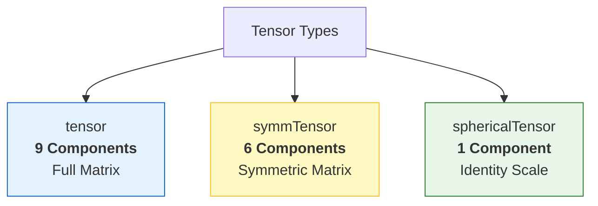
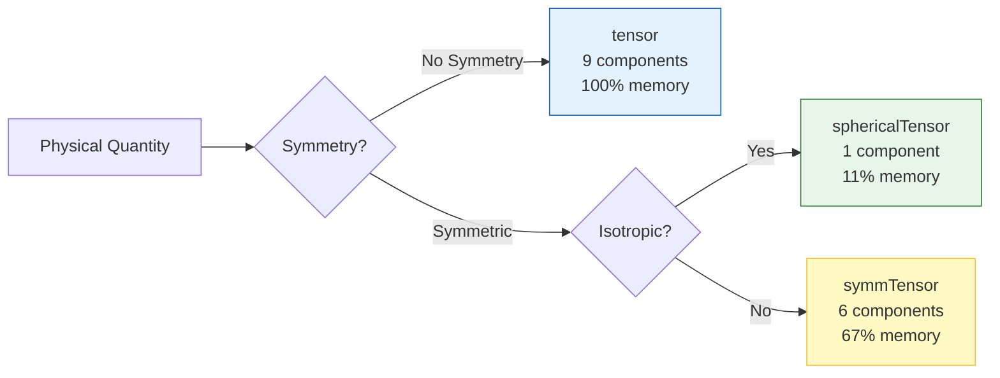

# ลำดับชั้นของคลาสเทนเซอร์ (Tensor Class Hierarchy)

![[tensor_storage_efficiency.png]]
`A comparison of three memory containers: Full Tensor (9 slots), Symmetric (6 slots), and Spherical (1 slot), illustrating the memory efficiency of specialized tensor classes, scientific textbook diagram, clean vector line art, white background, high definition, flat design, educational infographic --ar 16:9`

ลำดับชั้นคลาส Tensor ของ OpenFOAM เป็นระบบที่ซับซ้อนสำหรับจัดการเทนเซอร์ทางคณิตศาสตร์ โดยรักษาประสิทธิภาพการคำนวณผ่าน **Template Metaprogramming**


> **Figure 1:** การจำแนกประเภทเทนเซอร์ตามจำนวนองค์ประกอบอิสระ ซึ่งส่งผลต่อความซับซ้อนของข้อมูลและประสิทธิภาพในการใช้หน่วยความจำความปลอดภัยทางฟิสิกส์ไม่ส่งผลกระทบต่อความเร็วในการจำลอง ผ่านการใช้พลังของ C++ Template Metaprogramming ในการตรวจสอบความสอดคล้องทางมิติทั้งหมดที่ขั้นตอนการคอมไพล์โปรแกรมเพียงครั้งเดียว

## สถาปัตยกรรมเทนเซอร์แต่ละประเภท

| ประเภทเทนเซอร์ | จำนวน Components | ลำดับชั้นการสืบทอด | การใช้หน่วยความจำ |
|----------------|------------------|----------------------|------------------|
| **`tensor`** | 9 components อิสระ | `MatrixSpace<tensor<Cmpt>, Cmpt, 3, 3>` | 9 × sizeof(Cmpt) bytes |
| **`symmTensor`** | 6 components อิสระ | `VectorSpace<symmTensor<Cmpt>, Cmpt, 6>` | 6 × sizeof(Cmpt) bytes |
| **`sphericalTensor`** | 1 component อิสระ | `VectorSpace<sphericalTensor<Cmpt>, Cmpt, 1>` | 1 × sizeof(Cmpt) bytes |

---

## 1. เทนเซอร์ทั่วไป (`tensor`)

คลาส `tensor` ให้การแสดงเมทริกซ์ 3×3 แบบเต็ม จัดเก็บข้อมูลแบบ **Row-major** (XX, XY, XZ, YX, YY, YZ, ZX, ZY, ZZ)

### การจัดเก็บและการเข้าถึง

**Memory Layout:**
```
[XX][XY][XZ][YX][YY][YZ][ZX][ZY][ZZ]
  0   1   2   3   4   5   6   7   8
```

**Mathematical Representation:**
$$\mathbf{T} = \begin{bmatrix} T_{xx} & T_{xy} & T_{xz} \\ T_{yx} & T_{yy} & T_{yz} \\ T_{zx} & T_{zy} & T_{zz} \end{bmatrix}$$

**Code Implementation:**
```cpp
// การสร้างเทนเซอร์แบบเต็ม
tensor T(1, 2, 3, 4, 5, 6, 7, 8, 9);
// Layout: XX=1, XY=2, XZ=3, YX=4, YY=5, YZ=6, ZX=7, ZY=8, ZZ=9

// การเข้าถึง component
scalar Txx = T.xx();  // Access XX component
scalar Txy = T.xy();  // Access XY component
scalar Txz = T.xz();  // Access XZ component
scalar Tyx = T.yx();  // Access YX component
scalar Tyy = T.yy();  // Access YY component
scalar Tyz = T.yz();  // Access YZ component
scalar Tzx = T.zx();  // Access ZX component
scalar Tzy = T.zy();  // Access ZY component
scalar Tzz = T.zz();  // Access ZZ component
```

### คุณสมบัติและการประยุกต์ใช้

- **ความยืดหยุ่น**: รองรับการดำเนินการที่ต้องการเทนเซอร์แบบเต็ม
- **การประยุกต์ใช้**:
  - Deformation gradients ($\mathbf{F}$)
  - Velocity gradients ($\nabla \mathbf{u}$)
  - Rotation tensors
  - General transformations

---

## 2. เทนเซอร์สมมาตร (`symmTensor`)

คลาส `symmTensor` ใช้คุณสมบัติ $T_{ij} = T_{ji}$ จัดเก็บเพียง **6 ตัว** (XX, XY, XZ, YY, YZ, ZZ)

### การจัดเก็บที่เพิ่มประสิทธิภาพ

**Memory Layout:**
```
[XX][XY][XZ][YY][YZ][ZZ]
  0   1   2   3   4   5
```

**Mathematical Representation:**
$$\mathbf{S} = \begin{bmatrix} S_{xx} & S_{xy} & S_{xz} \\ S_{xy} & S_{yy} & S_{yz} \\ S_{xz} & S_{yz} & S_{zz} \end{bmatrix}$$

**Code Implementation:**
```cpp
// การสร้างเทนเซอร์สมมาตร
symmTensor S(1, 2, 3, 4, 5, 6);
// Independent components: XX=1, XY=2, XZ=3, YY=4, YZ=5, ZZ=6
// Implied components: YX=2, ZX=3, ZY=5

// การเข้าถึง component ที่จัดเก็บ
scalar Sxx = S.xx();  // Direct access
scalar Sxy = S.xy();  // Direct access
scalar Sxz = S.xz();  // Direct access
scalar Syy = S.yy();  // Direct access
scalar Syz = S.yz();  // Direct access
scalar Szz = S.zz();  // Direct access

// การเข้าถึงที่คำนวณโดยอัตโนมัติ (symmetry)
scalar Syx = S.yx();  // Equal to S.xy()
scalar Szx = S.zx();  // Equal to S.xz()
scalar Szy = S.zy();  // Equal to S.yz()
```

### Template Specialization สำหรับ Symmetry

```cpp
template<>
class Tensor<symmTensor>
{
    scalar data_[6];  // XX, XY, XZ, YY, YZ, ZZ

public:
    // Optimized 6-component operations
    scalar& component(int i, int j) {
        if (i > j) std::swap(i, j);  // Use upper triangular only
        return data_[triangularIndex(i, j)];
    }

    // Transpose is identity for symmetric tensors
    static symmTensor transpose(const symmTensor& t) {
        return t;  // เทนเซอร์สมมาตรคือทรานสโพสของตัวเอง
    }
};
```

### คุณสมบัติและการประยุกต์ใช้

- **การเพิ่มประสิทธิภาพ**: ลดการใช้หน่วยความจำลง **33%**
- **การประยุกต์ใช้**:
  - Reynolds stress tensor ($\mathbf{R} = -\rho \overline{u'_i u'_j}$)
  - Rate of strain tensor ($\mathbf{D} = \frac{1}{2}(\nabla \mathbf{u} + \nabla \mathbf{u}^T)$)
  - Cauchy stress tensor
  - Material property tensors

---

## 3. เทนเซอร์ทรงกลม (`sphericalTensor`)

คลาส `sphericalTensor` แทนเทนเซอร์ไอโซทรอปิก ($\lambda \mathbf{I}$) จัดเก็บเพียง **1 ตัว**

### การจัดเก็บที่เพิ่มประสิทธิภาพสูงสุด

**Mathematical Representation:**
$$\boldsymbol{\Lambda} = \lambda \mathbf{I} = \lambda \begin{bmatrix} 1 & 0 & 0 \\ 0 & 1 & 0 \\ 0 & 0 & 1 \end{bmatrix}$$

**Code Implementation:**
```cpp
// การสร้างเทนเซอร์ทรงกลม
sphericalTensor P(2.0);  // Represents 2.0 * I
// All diagonal = 2.0, all off-diagonal = 0.0

// การเข้าถึงค่า
scalar value = P.value();  // Direct access to scalar value
```

### คุณสมบัติและการประยุกต์ใช้

- **การเพิ่มประสิทธิภาพ**: ลดการใช้หน่วยความจำลงถึง **89%**
- **การประยุกต์ใช้**:
  - Isotropic pressure fields
  - Identity tensor operations
  - Isotropic material properties
  - Volume change phenomena

---

## การบูรณาการ Field Framework

OpenFOAM บูรณาการ tensor types กับ field framework ผ่าน template specializations:

```cpp
typedef GeometricField<tensor, fvPatchField, volMesh> volTensorField;
typedef GeometricField<symmTensor, fvPatchField, volMesh> volSymmTensorField;
typedef GeometricField<sphericalTensor, fvPatchField, volMesh> volSphericalTensorField;
```

### การประกาศและใช้งาน Tensor Fields

```cpp
// General tensor field
volTensorField sigma
(
    IOobject
    (
        "sigma",
        runTime.timeName(),
        mesh,
        IOobject::MUST_READ,
        IOobject::AUTO_WRITE
    ),
    mesh
);

// Symmetric tensor field
volSymmTensorField stress
(
    IOobject
    (
        "stress",
        runTime.timeName(),
        mesh,
        IOobject::MUST_READ,
        IOobject::AUTO_WRITE
    ),
    mesh
);

// Spherical tensor field (identity)
volSphericalTensorField I
(
    IOobject
    (
        "identity",
        runTime.timeName(),
        mesh,
        IOobject::NO_READ,
        IOobject::AUTO_WRITE
    ),
    mesh
);
I = tensor::I;  // Set to identity tensor
```

### ประโยชน์ของการบูรณาการ

- **การจัดการ boundary conditions อัตโนมัติ**
- **Interpolation schemes ที่เข้ากันได้**
- **Gradient operations ที่เหมาะสม**

---

## การดำเนินการทางคณิตศาสตร์

### 1. การดำเนินการพื้นฐาน

```cpp
// การสร้างและการดำเนินการพื้นฐาน
tensor T1(1, 0, 0, 0, 1, 0, 0, 0, 1);  // Identity tensor
tensor T2(2, 1, 0, 1, 2, 1, 0, 1, 2);  // Symmetric tensor

tensor T3 = T1 + T2;  // Element-wise addition: C_ij = A_ij + B_ij
tensor T4 = T1 * 2.0; // Scalar multiplication: C_ij = α·A_ij
tensor T5 = T1 * T2;  // Matrix multiplication: C_ij = Σ_k A_ik·B_kj
```

### 2. การดำเนินการ Vector-Tensor

```cpp
vector v(1, 2, 3);
tensor T(1, 2, 3, 4, 5, 6, 7, 8, 9);

// Single inner product (tensor-vector multiplication)
vector result = T & v;  // w_i = Σ_j T_ij·v_j

// Double inner product (scalar contraction)
scalar s = T1 && T2;    // s = Σ_i,j A_ij·B_ij

// Outer product (dyadic multiplication)
tensor outer = v * vector(4, 5, 6);  // T_ij = u_i·v_j
```

### 3. การดำเนินการเทนเซอร์เฉพาะ

```cpp
symmTensor S(1, 2, 3, 4, 5, 6);

// การดำเนินการทางคณิตศาสตร์เฉพาะ
scalar trace = tr(S);           // Trace: Σ_i S_ii
scalar determinant = det(S);    // Determinant
tensor inverseTensor = inv(S);  // Tensor inverse
symmTensor deviatoric = dev(S); // Deviatoric: S - (1/3)·tr(S)·I

// Symmetric part
symmTensor symmPart = symm(T);  // S = (T + T^T)/2

// Antisymmetric part
tensor skewPart = skew(T);      // A = (T - T^T)/2
```

---

## การเพิ่มประสิทธิภาพประสิทธิภาพ

### การเพิ่มประสิทธิภาพหน่วยความจำ

| ประเภทเทนเซอร์ | ขนาด (bytes) | การประหยัด | สัดส่วน |
|----------------|----------------|---------------|----------|
| `tensor` | 9 × sizeof(Cmpt) | - | 100% |
| `symmTensor` | 6 × sizeof(Cmpt) | 3 × sizeof(Cmpt) | 67% |
| `sphericalTensor` | 1 × sizeof(Cmpt) | 8 × sizeof(Cmpt) | 11% |

### ผลกระทบด้านประสิทธิภาพ

ในการจำลองขนาด 10 ล้านเซลล์:
- การใช้ `tensor` จะใช้แรมประมาณ 720 MB
- การใช้ `symmTensor` จะเหลือเพียง 480 MB (ลดลง 33%)
- การใช้ `sphericalTensor` จะเหลือเพียง 80 MB (ลดลง 89%)

### การเพิ่มประสิทธิภาพการคำนวณ

```cpp
// การคูณเทนเซอร์สมมาตร: คำนวณเฉพาะ 6 entries ที่ไม่ซ้ำกัน
symmTensor A(1, 2, 3, 4, 5, 6);
symmTensor B(6, 5, 4, 3, 2, 1);
symmTensor C = A & B;  // การคูณที่เพิ่มประสิทธิภาพ
```

**ประโยชน์:**
- **แบนด์วิดท์หน่วยความจำ**: ลดการจราจรหน่วยความจำลง 33-89%
- **การใช้งานแคช**: รูปแบบหน่วยความจำที่เล็กลงช่วยปรับปรุงอัตราการ hit ของแคช
- **การเวกเตอร์ไลเซชัน SIMD**: โครงสร้างหน่วยความจำแบบสม่ำเสมอช่วยให้สามารถปรับปรุง SIMD ในการดำเนินการพีชคณิตเชิงเส้น

---

## บริบทการประยุกต์ใช้ทางฟิสิกส์

### เทนเซอร์ทั่วไป
- **เทนเซอร์การบิดเปลี่ยน ($\mathbf{F}$)**: อธิบายการบิดเปลี่ยนของวัสดุ
- **เทนเซอร์การไล่ระดับความเร็ว ($\nabla\mathbf{u}$)**: อนุพันธ์ความเร็วแบบเต็ม
  $$[\nabla \mathbf{U}]_{ij} = \frac{\partial U_i}{\partial x_j}$$
- **เทนเซอร์การหมุน**: การหมุนวัตถุแข็งเกร็จทั่วไป

### เทนเซอร์สมมาตร
- **เทนเซอร์ความเครียด**: Cauchy stress, viscous stress
  $$\boldsymbol{\sigma} = -p\mathbf{I} + 2\mu\mathbf{D} + \lambda(\nabla \cdot \mathbf{u})\mathbf{I}$$
- **เทนเซอร์อัตราการบิดเปลี่ยน**: ส่วนสมมาตรของการไล่ระดับความเร็ว
  $$\mathbf{D} = \frac{1}{2}\left(\nabla \mathbf{u} + (\nabla \mathbf{u})^T\right)$$
- **เทนเซอร์ความเครียด Reynolds**: ส่วนประกอบความเครียดที่มีความปัวเปียน
  $$\mathbf{R}_{ij} = -\rho \overline{u'_i u'_j}$$
- **เทนเซอร์การเรียงสับเปลี่ยน**: เทนเซอร์คุณสมบัติวัสดุสมมาตร

### เทนเซอร์ทรงกลม
- **ฟิลด์ความดัน**: ส่วนประกอบความเครียดไอโซทรอปิก
- **Identity tensor ($\mathbf{I}$)**: การดำเนินการทางคณิตศาสตร์
  $$\mathbf{I} = \begin{bmatrix} 1 & 0 & 0 \\ 0 & 1 & 0 \\ 0 & 0 & 1 \end{bmatrix}$$
- **คุณสมบัติวัสดุไอโซทรอปิก**: คุณสมบัติวัสดุที่สม่ำเสมอ

---

## Template Metaprogramming และ Type Safety

การออกแบบที่ใช้ template ให้ความปลอดภัยของประเภทตอน compile-time:

```cpp
template<class Type>
void processTensor(const Type& tensor) {
    if constexpr (std::is_same_v<Type, tensor>) {
        // Process general tensor with full 9 components
        // การประมวลผลเทนเซอร์ทั่วไปพร้อม 9 components
    } else if constexpr (std::is_same_v<Type, symmTensor>) {
        // Process symmetric tensor with optimized 6-component operations
        // การประมวลผลเทนเซอร์สมมาตรพร้อมการดำเนินการ 6 components ที่เพิ่มประสิทธิภาพ
    } else if constexpr (std::is_same_v<Type, sphericalTensor>) {
        // Process spherical tensor with scalar operations
        // การประมวลผลเทนเซอร์ทรงกลมพร้อมการดำเนินการสเกลาร์
    }
}
```

### ประโยชน์ของ Template Specialization

- **Compile-time Optimization**: การตรวจสอบคุณสมบัติที่คอมไพล์
- **Specialized Operations**: การดำเนินการที่ปรับให้เหมาะสมสำหรับสมมาตร
- **Memory Efficiency**: การใช้หน่วยความจำที่ลดลง

---

## 🎯 สรุป

การเลือกคลาสเทนเซอร์ที่สอดคล้องกับคุณสมบัติทางฟิสิกส์ ไม่เพียงแต่ช่วยให้โค้ดทำงานได้ถูกต้อง แต่ยังเป็นการปรับแต่งประสิทธิภาพ (Optimization) ที่ได้ผลมหาศาลโดยไม่ต้องออกแรงมาก


> **Figure 2:** แผนผังการตัดสินใจเลือกคลาสเทนเซอร์ที่เหมาะสมตามคุณสมบัติความสมมาตรและความสม่ำเสมอในทุกทิศทาง (Isotropy) เพื่อลดโอเวอร์เฮดในการคำนวณความปลอดภัยทางฟิสิกส์ไม่ส่งผลกระทบต่อความเร็วในการจำลอง ผ่านการใช้พลังของ C++ Template Metaprogramming ในการตรวจสอบความสอดคล้องทางมิติทั้งหมดที่ขั้นตอนการคอมไพล์โปรแกรมเพียงครั้งเดียว

**โครงสร้างแบบลำดับชั้นของเทนเซอร์ใน OpenFOAM** ให้ประสิทธิภาพการคำนวณ CFD ที่สูง ในขณะเดียวกันก็รักษาความเข้มงวดทางคณิตศาสตร์และการเพิ่มประสิทธิภาพด้านหน่วยความจำสำหรับประเภทเทนเซอร์ที่แตกต่างกันในการประยุกต์ใช้พลศาสตร์ของไหล
