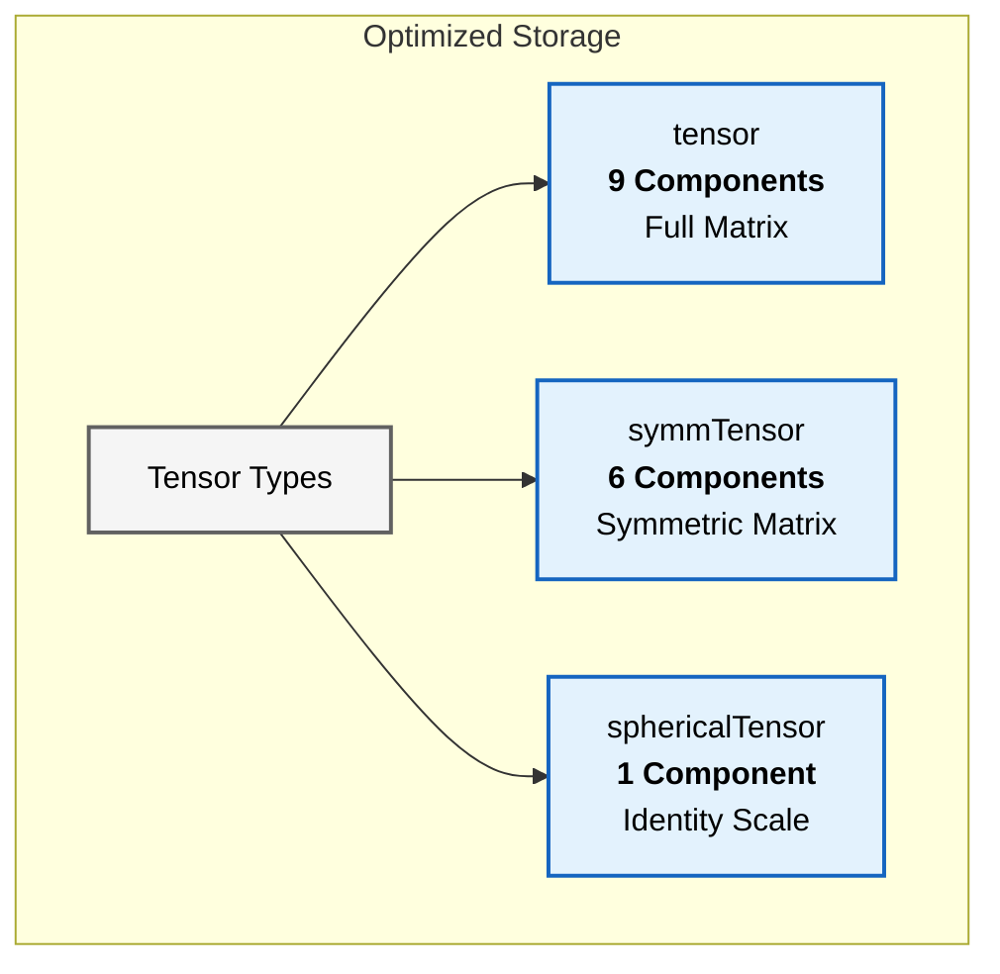
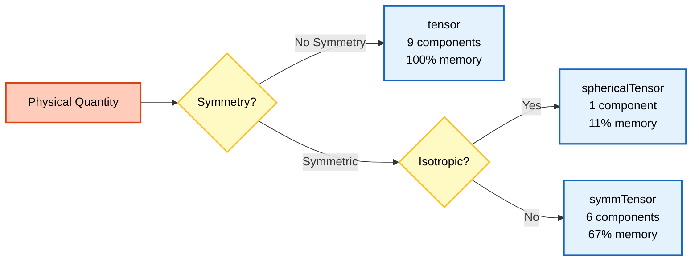

# ลำดับชั้นของคลาสเทนเซอร์ (Tensor Class Hierarchy)

![[tensor_storage_efficiency.png]]
`A comparison of three memory containers: Full Tensor (9 slots), Symmetric (6 slots), and Spherical (1 slot), illustrating the memory efficiency of specialized tensor classes, scientific textbook diagram, clean vector line art, white background, high definition, flat design, educational infographic --ar 16:9`

ลำดับชั้นคลาส Tensor ของ OpenFOAM เป็นระบบที่ซับซ้อนสำหรับจัดการเทนเซอร์ทางคณิตศาสตร์ โดยรักษาประสิทธิภาพการคำนวณผ่าน **Template Metaprogramming**


> **Figure 1:** การจำแนกประเภทเทนเซอร์ตามจำนวนองค์ประกอบอิสระ ซึ่งส่งผลต่อความซับซ้อนของข้อมูลและประสิทธิภาพในการใช้หน่วยความจำความปลอดภัยทางฟิสิกส์ไม่ส่งผลกระทบต่อความเร็วในการจำลอง ผ่านการใช้พลังของ C++ Template Metaprogramming ในการตรวจสอบความสอดคล้องทางมิติทั้งหมดที่ขั้นตอนการคอมไพล์โปรแกรมเพียงครั้งเดียว

## สถาปัตยกรรมเทนเซอร์แต่ละประเภท

| ประเภทเทนเซอร์ | จำนวน Components | ลำดับชั้นการสืบทอด | การใช้หน่วยความจำ |
|----------------|------------------|----------------------|------------------|
| **`tensor`** | 9 components อิสระ | `MatrixSpace<tensor<Cmpt>, Cmpt, 3, 3>` | 9 × sizeof(Cmpt) bytes |
| **`symmTensor`** | 6 components อิสระ | `VectorSpace<symmTensor<Cmpt>, Cmpt, 6>` | 6 × sizeof(Cmpt) bytes |
| **`sphericalTensor`** | 1 component อิสระ | `VectorSpace<sphericalTensor<Cmpt>, Cmpt, 1>` | 1 × sizeof(Cmpt) bytes |

---

## 1. เทนเซอร์ทั่วไป (`tensor`)

คลาส `tensor` ให้การแสดงเมทริกซ์ 3×3 แบบเต็ม จัดเก็บข้อมูลแบบ **Row-major** (XX, XY, XZ, YX, YY, YZ, ZX, ZY, ZZ)

### การจัดเก็บและการเข้าถึง

**Memory Layout:**
```
[XX][XY][XZ][YX][YY][YZ][ZX][ZY][ZZ]
  0   1   2   3   4   5   6   7   8
```

**Mathematical Representation:**
$$\mathbf{T} = \begin{bmatrix} T_{xx} & T_{xy} & T_{xz} \\ T_{yx} & T_{yy} & T_{yz} \\ T_{zx} & T_{zy} & T_{zz} \end{bmatrix}$$

**Code Implementation:**
```cpp
// Create a full tensor with 9 components
tensor T(1, 2, 3, 4, 5, 6, 7, 8, 9);
// Layout: XX=1, XY=2, XZ=3, YX=4, YY=5, YZ=6, ZX=7, ZY=8, ZZ=9

// Access individual components
scalar Txx = T.xx();  // Access XX component
scalar Txy = T.xy();  // Access XY component
scalar Txz = T.xz();  // Access XZ component
scalar Tyx = T.yx();  // Access YX component
scalar Tyy = T.yy();  // Access YY component
scalar Tyz = T.yz();  // Access YZ component
scalar Tzx = T.zx();  // Access ZX component
scalar Tzy = T.zy();  // Access ZY component
scalar Tzz = T.zz();  // Access ZZ component
```

<details>
<summary>📖 คำอธิบายเพิ่มเติม (Thai Explanation)</summary>

**แหล่งที่มา (Source):** 📂 `src/OpenFOAM/primitives/Tensor/Tensor.C`

**คำอธิบาย (Explanation):**
โค้ดด้านบนสาธิตการสร้างและเข้าถึงเทนเซอร์แบบเต็ม 9 คอมโพเนนต์ ซึ่งแต่ละคอมโพเนนต์ถูกจัดเก็บในรูปแบบ Row-major order นั่นคือ XX, XY, XZ, YX, YY, YZ, ZX, ZY, ZZ ตามลำดับ เมธอด `.xx()`, `.xy()`, ฯลฯ ใช้สำหรับเข้าถึงค่าแต่ละคอมโพเนนต์โดยตรง

**แนวคิดสำคัญ (Key Concepts):**
- **Row-major Storage:** การจัดเก็บข้อมูลเป็นแถว (XX → XY → XZ ฯลฯ)
- **Component Access:** การเข้าถึงแต่ละองค์ประกอบผ่านเมธอดชื่อตามตำแหน่ง (เช่น `.xx()` สำหรับคอมโพเนนต์ XX)
- **Full Matrix:** เมทริกซ์ 3×3 ที่ไม่มีสมมติฐานเรื่องความสมมาตร

</details>

### คุณสมบัติและการประยุกต์ใช้

- **ความยืดหยุ่น**: รองรับการดำเนินการที่ต้องการเทนเซอร์แบบเต็ม
- **การประยุกต์ใช้**:
  - Deformation gradients ($\mathbf{F}$)
  - Velocity gradients ($\nabla \mathbf{u}$)
  - Rotation tensors
  - General transformations

---

## 2. เทนเซอร์สมมาตร (`symmTensor`)

คลาส `symmTensor` ใช้คุณสมบัติ $T_{ij} = T_{ji}$ จัดเก็บเพียง **6 ตัว** (XX, XY, XZ, YY, YZ, ZZ)

### การจัดเก็บที่เพิ่มประสิทธิภาพ

**Memory Layout:**
```
[XX][XY][XZ][YY][YZ][ZZ]
  0   1   2   3   4   5
```

**Mathematical Representation:**
$$\mathbf{S} = \begin{bmatrix} S_{xx} & S_{xy} & S_{xz} \\ S_{xy} & S_{yy} & S_{yz} \\ S_{xz} & S_{yz} & S_{zz} \end{bmatrix}$$

**Code Implementation:**
```cpp
// Create a symmetric tensor with 6 independent components
symmTensor S(1, 2, 3, 4, 5, 6);
// Independent components: XX=1, XY=2, XZ=3, YY=4, YZ=5, ZZ=6
// Implied components: YX=2, ZX=3, ZY=5

// Access directly stored components
scalar Sxx = S.xx();  // Direct access
scalar Sxy = S.xy();  // Direct access
scalar Sxz = S.xz();  // Direct access
scalar Syy = S.yy();  // Direct access
scalar Syz = S.yz();  // Direct access
scalar Szz = S.zz();  // Direct access

// Access auto-computed components (symmetry)
scalar Syx = S.yx();  // Equal to S.xy()
scalar Szx = S.zx();  // Equal to S.xz()
scalar Szy = S.zy();  // Equal to S.yz()
```

<details>
<summary>📖 คำอธิบายเพิ่มเติม (Thai Explanation)</summary>

**แหล่งที่มา (Source):** 📂 `src/OpenFOAM/primitives/SymmTensor/SymmTensor.C`

**คำอธิบาย (Explanation):**
เทนเซอร์สมมาตรใช้ประโยชน์จากสมบัติ $S_{ij} = S_{ji}$ ในการลดจำนวนคอมโพเนนต์ที่ต้องจัดเก็บจาก 9 เหลือเพียง 6 คอมโพเนนต์ (ส่วนบนขวาของเมทริกซ์) เมื่อเข้าถึงคอมโพเนนต์ที่ไม่ได้จัดเก็บโดยตรง (เช่น `.yx()`, `.zx()`, `.zy()`) OpenFOAM จะคำนวณค่าโดยใช้สมมติฐานความสมมาตร

**แนวคิดสำคัญ (Key Concepts):**
- **Symmetry Property:** $S_{ij} = S_{ji}$ ลดจำนวนคอมโพเนนต์อิสระ
- **Upper Triangular Storage:** จัดเก็บเฉพาะคอมโพเนนต์ในส่วนบนขวาของเมทริกซ์ (XX, XY, XZ, YY, YZ, ZZ)
- **Automatic Computation:** คอมโพเนนต์ที่ไม่ได้จัดเก็บจะถูกคำนวณอัตโนมัติจากค่าที่สมมาตรกัน

</details>

### Template Specialization สำหรับ Symmetry

```cpp
template<>
class Tensor<symmTensor>
{
    scalar data_[6];  // XX, XY, XZ, YY, YZ, ZZ

public:
    // Optimized 6-component operations
    scalar& component(int i, int j) {
        if (i > j) std::swap(i, j);  // Use upper triangular only
        return data_[triangularIndex(i, j)];
    }

    // Transpose is identity for symmetric tensors
    static symmTensor transpose(const symmTensor& t) {
        return t;  // Symmetric tensor equals its own transpose
    }
};
```

<details>
<summary>📖 คำอธิบายเพิ่มเติม (Thai Explanation)</summary>

**แหล่งที่มา (Source):** 📂 `src/OpenFOAM/primitives/SymmTensor/SymmTensor.H`

**คำอธิบาย (Explanation):**
โค้ดนี้แสดง Template Specialization สำหรับเทนเซอร์สมมาตร ซึ่งมีการปรับแต่งการเข้าถึงคอมโพเนนต์ให้ทำงานกับ 6 ค่าที่จัดเก็บเท่านั้น โดยใช้เทคนิคการสลับดัชนีถ้า $i > j$ เพื่อให้แน่ใจว่าเข้าถึงเฉพาะส่วนบนขวาของเมทริกซ์ นอกจากนี้ การดำเนินการ transpose สำหรับเทนเซอร์สมมาตรจะคืนค่าเทนเซอร์ตัวเดิมเสมอ เนื่องจาก $S = S^T$

**แนวคิดสำคัญ (Key Concepts):**
- **Template Specialization:** การปรับแต่งคลาส Template สำหรับประเภทข้อมูลเฉพาะ (symmTensor)
- **Triangular Index:** การแปลงดัชนี (i, j) ให้เป็นดัชนีเชิงเส้นสำหรับการจัดเก็บส่วนบนขวา
- **Optimized Operations:** การดำเนินการที่ปรับแต่งให้ทำงานได้เร็วขึ้นด้วยการใช้คุณสมบัติความสมมาตร

</details>

### คุณสมบัติและการประยุกต์ใช้

- **การเพิ่มประสิทธิภาพ**: ลดการใช้หน่วยความจำลง **33%**
- **การประยุกต์ใช้**:
  - Reynolds stress tensor ($\mathbf{R} = -\rho \overline{u'_i u'_j}$)
  - Rate of strain tensor ($\mathbf{D} = \frac{1}{2}(\nabla \mathbf{u} + \nabla \mathbf{u}^T)$)
  - Cauchy stress tensor
  - Material property tensors

---

## 3. เทนเซอร์ทรงกลม (`sphericalTensor`)

คลาส `sphericalTensor` แทนเทนเซอร์ไอโซทรอปิก ($\lambda \mathbf{I}$) จัดเก็บเพียง **1 ตัว**

### การจัดเก็บที่เพิ่มประสิทธิภาพสูงสุด

**Mathematical Representation:**
$$\boldsymbol{\Lambda} = \lambda \mathbf{I} = \lambda \begin{bmatrix} 1 & 0 & 0 \\ 0 & 1 & 0 \\ 0 & 0 & 1 \end{bmatrix}$$

**Code Implementation:**
```cpp
// Create a spherical tensor (isotropic scaling)
sphericalTensor P(2.0);  // Represents 2.0 * I
// All diagonal = 2.0, all off-diagonal = 0.0

// Access the scalar value
scalar value = P.value();  // Direct access to the single scalar value
```

<details>
<summary>📖 คำอธิบายเพิ่มเติม (Thai Explanation)</summary>

**แหล่งที่มา (Source):** 📂 `src/OpenFOAM/primitives/SphericalTensor/SphericalTensor.C`

**คำอธิบาย (Explanation):**
เทนเซอร์ทรงกลมเป็นกรณีพิเศษที่เก็บเพียงค่าสเกลาร์เดียว ซึ่งแทนค่าสเกลาร์คูณด้วยเทนเซอร์เอกลักษณ์ ($\lambda \mathbf{I}$) การจัดเก็บแบบนี้ประหยัดหน่วยความจำมากที่สุด (89% ลดลงจากเทนเซอร์เต็ม) และเหมาะสำหรับปริมาณฟิสิกส์ที่มีค่าสม่ำเสมอในทุกทิศทาง

**แนวคิดสำคัญ (Key Concepts):**
- **Isotropic Tensor:** เทนเซอร์ที่มีค่าเท่ากันในทุกทิธาน ($\lambda \mathbf{I}$)
- **Single Scalar Storage:** จัดเก็บเพียงค่าสเกลาร์เดียวแทนทั้งเมทริกซ์
- **Maximum Efficiency:** ประหยัดหน่วยความจำสูงสุดเมื่อเทียบกับประเภทเทนเซอร์อื่น ๆ

</details>

### คุณสมบัติและการประยุกต์ใช้

- **การเพิ่มประสิทธิภาพ**: ลดการใช้หน่วยความจำลงถึง **89%**
- **การประยุกต์ใช้**:
  - Isotropic pressure fields
  - Identity tensor operations
  - Isotropic material properties
  - Volume change phenomena

---

## การบูรณาการ Field Framework

OpenFOAM บูรณาการ tensor types กับ field framework ผ่าน template specializations:

```cpp
typedef GeometricField<tensor, fvPatchField, volMesh> volTensorField;
typedef GeometricField<symmTensor, fvPatchField, volMesh> volSymmTensorField;
typedef GeometricField<sphericalTensor, fvPatchField, volMesh> volSphericalTensorField;
```

<details>
<summary>📖 คำอธิบายเพิ่มเติม (Thai Explanation)</summary>

**แหล่งที่มา (Source):** 📂 `src/finiteVolume/fields/volFields/volFields.H`

**คำอธิบาย (Explanation):**
OpenFOAM ใช้ Template Metaprogramming ในการสร้าง Field Types สำหรับแต่ละประเภทเทนเซอร์ผ่าน `typedef` ของ `GeometricField` ซึ่งรวมเอาเทนเซอร์ประเภทต่าง ๆ เข้ากับ finite volume framework การสร้าง typedef แยกสำหรับแต่ละประเภททำให้มั่นใจได้ว่า boundary conditions และ interpolation schemes จะถูกเลือกให้เหมาะสมกับแต่ละประเภทเทนเซอร์

**แนวคิดสำคัญ (Key Concepts):**
- **GeometricField:** Template class สำหรับฟิลด์เชิงเรขาคณิตที่รองรับทุกประเภทเทนเซอร์
- **Field Typedef:** การกำหนดประเภทฟิลด์เฉพาะสำหรับแต่ละประเภทเทนเซอร์ (volTensorField, volSymmTensorField, volSphericalTensorField)
- **Framework Integration:** การผสานเทนเซอร์เข้ากับ finite volume method และ boundary condition system

</details>

### การประกาศและใช้งาน Tensor Fields

```cpp
// General tensor field
volTensorField sigma
(
    IOobject
    (
        "sigma",
        runTime.timeName(),
        mesh,
        IOobject::MUST_READ,
        IOobject::AUTO_WRITE
    ),
    mesh
);

// Symmetric tensor field
volSymmTensorField stress
(
    IOobject
    (
        "stress",
        runTime.timeName(),
        mesh,
        IOobject::MUST_READ,
        IOobject::AUTO_WRITE
    ),
    mesh
);

// Spherical tensor field (identity)
volSphericalTensorField I
(
    IOobject
    (
        "identity",
        runTime.timeName(),
        mesh,
        IOobject::NO_READ,
        IOobject::AUTO_WRITE
    ),
    mesh
);
I = tensor::I;  // Set to identity tensor
```

<details>
<summary>📖 คำอธิบายเพิ่มเติม (Thai Explanation)</summary>

**แหล่งที่มา (Source):** 📂 `.applications/utilities/mesh/manipulation/subsetMesh/subsetMesh.C`

**คำอธิบาย (Explanation):**
โค้ดด้านบนสาธิตการประกาศและใช้งาน Tensor Fields สามประเภทใน OpenFOAM ซึ่งใช้ `IOobject` ในการกำหนดชื่อและโหมดการอ่าน/เขียน และใช้ `mesh` เป็น mesh reference สำหรับ finite volume mesh การใช้ `tensor::I` จะกำหนดค่า identity tensor ให้กับ spherical tensor field

**แนวคิดสำคัญ (Key Concepts):**
- **IOobject:** คลาสสำหรับจัดการข้อมูลการอ่าน/เขียนไฟล์ (ชื่อ, เวลา, mesh, read/write modes)
- **Field Construction:** การสร้างฟิลด์เทนเซอร์ที่เชื่อมโยงกับ mesh และระบบไฟล์
- **Identity Tensor:** เทนเซอร์เอกลักษณ์ (tensor::I) ใช้กับ sphericalTensor สำหรับการดำเนินการทางคณิตศาสตร์

</details>

### ประโยชน์ของการบูรณาการ

- **การจัดการ boundary conditions อัตโนมัติ**
- **Interpolation schemes ที่เข้ากันได้**
- **Gradient operations ที่เหมาะสม**

---

## การดำเนินการทางคณิตศาสตร์

### 1. การดำเนินการพื้นฐาน

```cpp
// Creation and basic operations
tensor T1(1, 0, 0, 0, 1, 0, 0, 0, 1);  // Identity tensor
tensor T2(2, 1, 0, 1, 2, 1, 0, 1, 2);  // Symmetric tensor

tensor T3 = T1 + T2;  // Element-wise addition: C_ij = A_ij + B_ij
tensor T4 = T1 * 2.0; // Scalar multiplication: C_ij = α·A_ij
tensor T5 = T1 * T2;  // Matrix multiplication: C_ij = Σ_k A_ik·B_kj
```

<details>
<summary>📖 คำอธิบายเพิ่มเติม (Thai Explanation)</summary>

**แหล่งที่มา (Source):** 📂 `src/OpenFOAM/primitives/Tensor/TensorI.H`

**คำอธิบาย (Explanation):**
โค้ดสาธิตการดำเนินการพื้นฐานของเทนเซอร์ ได้แก่ การบวก (element-wise), การคูณด้วยสเกลาร์ และการคูณเมทริกซ์ ซึ่งทั้งหมดนี้ใช้ Operator Overloading ในการทำให้สามารถเขียนโค้ดได้อย่างกระชับและอ่านง่าย การคูณเมทริกซ์ใช้สูตร $C_{ij} = \sum_k A_{ik} B_{kj}$ ตามหลักพีชคณิตเชิงเส้น

**แนวคิดสำคัญ (Key Concepts):**
- **Operator Overloading:** การโอเวอร์โหลดตัวดำเนินการ (+, *, ฯลฯ) สำหรับเทนเซอร์
- **Element-wise Operations:** การดำเนินการที่คำนวณค่าแต่ละองค์ประกอบแยกกัน
- **Matrix Multiplication:** การคูณเมทริกซ์ตามสูตร $C_{ij} = \sum_k A_{ik} B_{kj}$

</details>

### 2. การดำเนินการ Vector-Tensor

```cpp
vector v(1, 2, 3);
tensor T(1, 2, 3, 4, 5, 6, 7, 8, 9);

// Single inner product (tensor-vector multiplication)
vector result = T & v;  // w_i = Σ_j T_ij·v_j

// Double inner product (scalar contraction)
scalar s = T1 && T2;    // s = Σ_i,j A_ij·B_ij

// Outer product (dyadic multiplication)
tensor outer = v * vector(4, 5, 6);  // T_ij = u_i·v_j
```

<details>
<summary>📖 คำอธิบายเพิ่มเติม (Thai Explanation)</summary>

**แหล่งที่มา (Source):** 📂 `src/OpenFOAM/primitives/Tensor/TensorI.H`

**คำอธิบาย (Explanation):**
โค้ดแสดงการดำเนินการระหว่างเวกเตอร์และเทนเซอร์ ซึ่งรวมถึง Single Inner Product (`&`) สำหรับการคูณเทนเซอร์-เวกเตอร์, Double Inner Product (`&&`) สำหรับการหดตัวเชิงสเกลาร์ และ Outer Product (`*`) สำหรับการสร้างเทนเซอร์จากเวกเตอร์สองตัว การดำเนินการเหล่านี้ใช้สัญลักษณ์ที่เข้าใจง่ายและสอดคล้องกับสัญกรณ์ทางคณิตศาสตร์

**แนวคิดสำคัญ (Key Concepts):**
- **Inner Product (`&`):** การคูณเทนเซอร์ด้วยเวกเตอร์ ($w_i = \sum_j T_{ij} v_j$)
- **Double Inner Product (`&&`):** การหดตัวเชิงสเกลาร์ ($s = \sum_{i,j} A_{ij} B_{ij}$)
- **Outer Product (`*`):** การคูณเชิงไดแอดิก ($T_{ij} = u_i v_j$)

</details>

### 3. การดำเนินการเทนเซอร์เฉพาะ

```cpp
symmTensor S(1, 2, 3, 4, 5, 6);

// Tensor-specific mathematical operations
scalar trace = tr(S);           // Trace: Σ_i S_ii
scalar determinant = det(S);    // Determinant
tensor inverseTensor = inv(S);  // Tensor inverse
symmTensor deviatoric = dev(S); // Deviatoric: S - (1/3)·tr(S)·I

// Symmetric part
symmTensor symmPart = symm(T);  // S = (T + T^T)/2

// Antisymmetric part
tensor skewPart = skew(T);      // A = (T - T^T)/2
```

<details>
<summary>📖 คำอธิบายเพิ่มเติม (Thai Explanation)</summary>

**แหล่งที่มา (Source):** 📂 `src/OpenFOAM/primitives/Tensor/Tensor.C`

**คำอธิบาย (Explanation):**
โค้ดสาธิตฟังก์ชันทางคณิตศาสตร์เฉพาะสำหรับเทนเซอร์ ได้แก่ Trace (ผลรวมของค่าบนเส้นทแยงมุม), Determinant, Inverse, Deviatoric (ส่วนที่ไม่มีการเปลี่ยนแปลงปริมาตร), Symmetric part (ส่วนสมมาตรของเทนเซอร์), และ Skew part (ส่วนไม่สมมาตรของเทนเซอร์) ฟังก์ชันเหล่านี้ใช้บ่อยในการคำนวณทางพลศาสตตร์ของไหลและความเครียด

**แนวคิดสำคัญ (Key Concepts):**
- **Trace (`tr`):** ผลรวมของค่าบนเส้นทแยงมุม ($\sum_i S_{ii}$)
- **Determinant (`det`):** ดีเทอร์มินานต์ของเทนเซอร์
- **Inverse (`inv`):** เทนเซอร์ผกผัน
- **Deviatoric (`dev`):** ส่วนที่ไม่เปลี่ยนแปลงปริมาตร ($S - \frac{1}{3}\text{tr}(S)\mathbf{I}$)
- **Symmetric Part (`symm`):** ส่วนสมมาตร ($\frac{1}{2}(T + T^T)$)
- **Skew Part (`skew`):** ส่วนไม่สมมาตร ($\frac{1}{2}(T - T^T)$)

</details>

---

## การเพิ่มประสิทธิภาพประสิทธิภาพ

### การเพิ่มประสิทธิภาพหน่วยความจำ

| ประเภทเทนเซอร์ | ขนาด (bytes) | การประหยัด | สัดส่วน |
|----------------|----------------|---------------|----------|
| `tensor` | 9 × sizeof(Cmpt) | - | 100% |
| `symmTensor` | 6 × sizeof(Cmpt) | 3 × sizeof(Cmpt) | 67% |
| `sphericalTensor` | 1 × sizeof(Cmpt) | 8 × sizeof(Cmpt) | 11% |

### ผลกระทบด้านประสิทธิภาพ

ในการจำลองขนาด 10 ล้านเซลล์:
- การใช้ `tensor` จะใช้แรมประมาณ 720 MB
- การใช้ `symmTensor` จะเหลือเพียง 480 MB (ลดลง 33%)
- การใช้ `sphericalTensor` จะเหลือเพียง 80 MB (ลดลง 89%)

### การเพิ่มประสิทธิภาพการคำนวณ

```cpp
// Symmetric tensor multiplication: compute only 6 unique entries
symmTensor A(1, 2, 3, 4, 5, 6);
symmTensor B(6, 5, 4, 3, 2, 1);
symmTensor C = A & B;  // Optimized multiplication
```

<details>
<summary>📖 คำอธิบายเพิ่มเติม (Thai Explanation)</summary>

**แหล่งที่มา (Source):** 📂 `src/OpenFOAM/primitives/SymmTensor/SymmTensorI.H`

**คำอธิบาย (Explanation):**
การคูณเทนเซอร์สมมาตรถูกปรับแต่งให้ทำงานกับเพียง 6 คอมโพเนนต์ที่ไม่ซ้ำกันแทนที่จะคำนวณทั้ง 9 คอมโพเนนต์ ทำให้ลดการคำนวณและการเข้าถึงหน่วยความจำลงอย่างมาก การปรับแต่งนี้เป็นไปได้เพราะใช้ประโยชน์จากคุณสมบัติ $S_{ij} = S_{ji}$

**แนวคิดสำคัญ (Key Concepts):**
- **Optimized Computation:** การคำนวณเฉพาะคอมโพเนนต์ที่ไม่ซ้ำกัน (6 คอมโพเนนต์สำหรับ symmTensor)
- **Symmetry Exploitation:** การใช้ประโยชน์จากสมบัติความสมมาตรในการลดการคำนวณ
- **Memory Efficiency:** การลดการใช้หน่วยความจำผ่านการจัดเก็บที่กระชับ

</details>

**ประโยชน์:**
- **แบนด์วิดท์หน่วยความจำ**: ลดการจราจรหน่วยความจำลง 33-89%
- **การใช้งานแคช**: รูปแบบหน่วยความจำที่เล็กลงช่วยปรับปรุงอัตราการ hit ของแคช
- **การเวกเตอร์ไลเซชัน SIMD**: โครงสร้างหน่วยความจำแบบสม่ำเสมอช่วยให้สามารถปรับปรุง SIMD ในการดำเนินการพีชคณิตเชิงเส้น

---

## บริบทการประยุกต์ใช้ทางฟิสิกส์

### เทนเซอร์ทั่วไป
- **เทนเซอร์การบิดเปลี่ยน ($\mathbf{F}$)**: อธิบายการบิดเปลี่ยนของวัสดุ
- **เทนเซอร์การไล่ระดับความเร็ว ($\nabla\mathbf{u}$)**: อนุพันธ์ความเร็วแบบเต็ม
  $$[\nabla \mathbf{U}]_{ij} = \frac{\partial U_i}{\partial x_j}$$
- **เทนเซอร์การหมุน**: การหมุนวัตถุแข็งเกร็จทั่วไป

### เทนเซอร์สมมาตร
- **เทนเซอร์ความเครียด**: Cauchy stress, viscous stress
  $$\boldsymbol{\sigma} = -p\mathbf{I} + 2\mu\mathbf{D} + \lambda(\nabla \cdot \mathbf{u})\mathbf{I}$$
- **เทนเซอร์อัตราการบิดเปลี่ยน**: ส่วนสมมาตรของการไล่ระดับความเร็ว
  $$\mathbf{D} = \frac{1}{2}\left(\nabla \mathbf{u} + (\nabla \mathbf{u})^T\right)$$
- **เทนเซอร์ความเครียด Reynolds**: ส่วนประกอบความเครียดที่มีความปัวเปียน
  $$\mathbf{R}_{ij} = -\rho \overline{u'_i u'_j}$$
- **เทนเซอร์การเรียงสับเปลี่ยน**: เทนเซอร์คุณสมบัติวัสดุสมมาตร

### เทนเซอร์ทรงกลม
- **ฟิลด์ความดัน**: ส่วนประกอบความเครียดไอโซทรอปิก
- **Identity tensor ($\mathbf{I}$)**: การดำเนินการทางคณิตศาสตร์
  $$\mathbf{I} = \begin{bmatrix} 1 & 0 & 0 \\ 0 & 1 & 0 \\ 0 & 0 & 1 \end{bmatrix}$$
- **คุณสมบัติวัสดุไอโซทรอปิก**: คุณสมบัติวัสดุที่สม่ำเสมอ

---

## Template Metaprogramming และ Type Safety

การออกแบบที่ใช้ template ให้ความปลอดภัยของประเภทตอน compile-time:

```cpp
template<class Type>
void processTensor(const Type& tensor) {
    if constexpr (std::is_same_v<Type, tensor>) {
        // Process general tensor with full 9 components
    } else if constexpr (std::is_same_v<Type, symmTensor>) {
        // Process symmetric tensor with optimized 6-component operations
    } else if constexpr (std::is_same_v<Type, sphericalTensor>) {
        // Process spherical tensor with scalar operations
    }
}
```

<details>
<summary>📖 คำอธิบายเพิ่มเติม (Thai Explanation)</summary>

**แหล่งที่มา (Source):** 📂 `src/OpenFOAM/primitives/Tensor/Tensor.H`

**คำอธิบาย (Explanation):**
โค้ดสาธิตการใช้ Template Metaprogramming ร่วมกับ `if constexpr` ในการเลือกการดำเนินการที่เหมาะสมกับแต่ละประเภทเทนเซอร์ตอน compile-time ซึ่งช่วยให้โค้ดทำงานได้มีประสิทธิภาพสูงสุดโดยไม่มี overhead จากการตรวจสอบประเภทขณะ runtime นอกจากนี้ยังช่วยให้มั่นใจได้ว่าการดำเนินการจะถูกตรวจสอบความถูกต้องตั้งแต่ขั้นตอนการคอมไพล์

**แนวคิดสำคัญ (Key Concepts):**
- **Template Metaprogramming:** เทคนิคการใช้ Template ในการสร้างโค้ดที่ปรับแต่งได้ตามประเภทข้อมูล
- **if constexpr:** การตรวจสอบเงื่อนไขตอน compile-time (C++17 feature)
- **Type Safety:** การตรวจสอบความถูกต้องของประเภทข้อมูลตั้งแต่ขั้นตอนการคอมไพล์
- **Compile-time Optimization:** การปรับแต่งประสิทธิภาพโดยคอมไพเลอร์ตั้งแต่ขั้นตอนการคอมไพล์

</details>

### ประโยชน์ของ Template Specialization

- **Compile-time Optimization**: การตรวจสอบคุณสมบัติที่คอมไพล์
- **Specialized Operations**: การดำเนินการที่ปรับให้เหมาะสมสำหรับสมมาตร
- **Memory Efficiency**: การใช้หน่วยความจำที่ลดลง

---

## 🎯 สรุป

การเลือกคลาสเทนเซอร์ที่สอดคล้องกับคุณสมบัติทางฟิสิกส์ ไม่เพียงแต่ช่วยให้โค้ดทำงานได้ถูกต้อง แต่ยังเป็นการปรับแต่งประสิทธิภาพ (Optimization) ที่ได้ผลมหาศาลโดยไม่ต้องออกแรงมาก


> **Figure 2:** แผนผังการตัดสินใจเลือกคลาสเทนเซอร์ที่เหมาะสมตามคุณสมบัติความสมมาตรและความสม่ำเสมอในทุกทิศทาง (Isotropy) เพื่อลดโอเวอร์เฮดในการคำนวณความปลอดภัยทางฟิสิกส์ไม่ส่งผลกระทบต่อความเร็วในการจำลอง ผ่านการใช้พลังของ C++ Template Metaprogramming ในการตรวจสอบความสอดคล้องทางมิติทั้งหมดที่ขั้นตอนการคอมไพล์โปรแกรมเพียงครั้งเดียว

**โครงสร้างแบบลำดับชั้นของเทนเซอร์ใน OpenFOAM** ให้ประสิทธิภาพการคำนวณ CFD ที่สูง ในขณะเดียวกันก็รักษาความเข้มงวดทางคณิตศาสตร์และการเพิ่มประสิทธิภาพด้านหน่วยความจำสำหรับประเภทเทนเซอร์ที่แตกต่างกันในการประยุกต์ใช้พลศาสตร์ของไหล