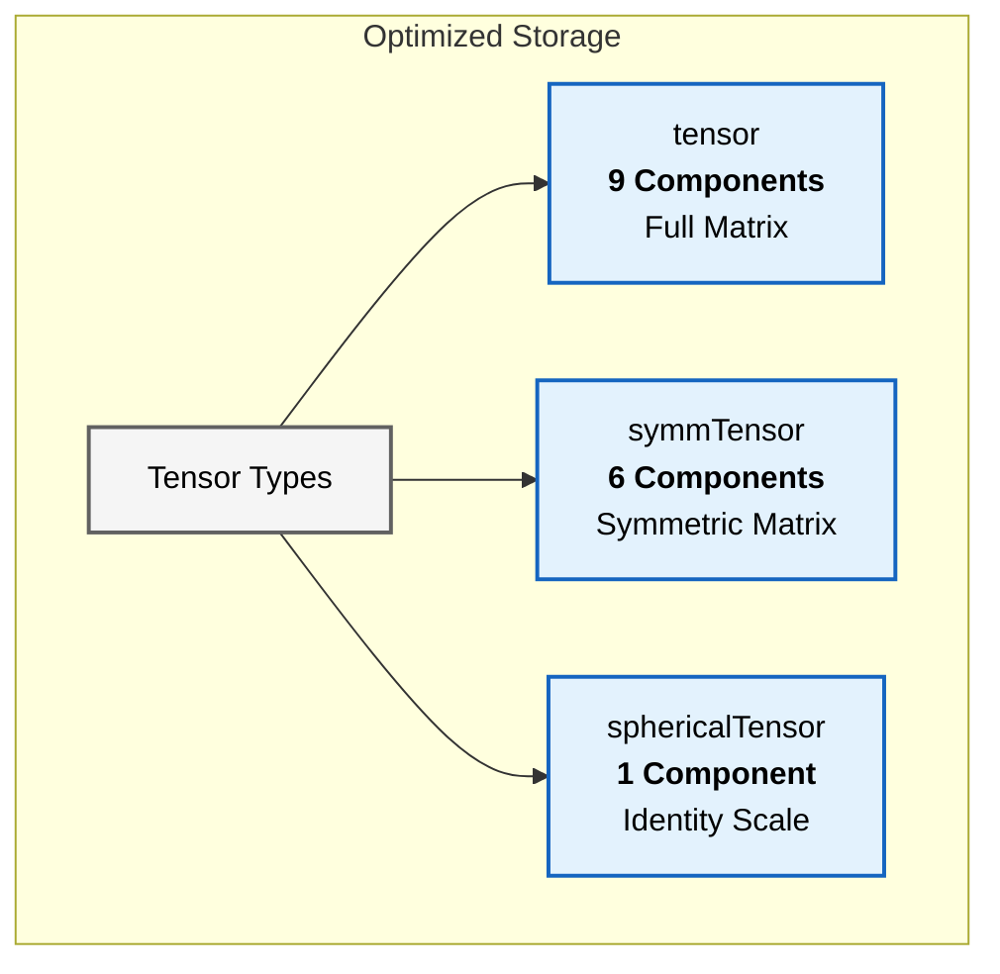
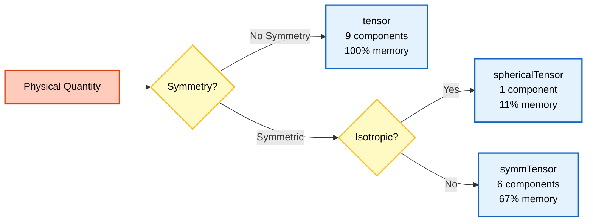

# ลำดับชั้นของคลาสเทนเซอร์ (Tensor Class Hierarchy)

> [!TIP] ทำไมต้องเข้าใจ Tensor Class Hierarchy?
> **ความสำคัญต่อการพัฒนาโค้ด OpenFOAM:**
> - **ประสิทธิภาพหน่วยควาจำ:** การเลือกประเภทเทนเซอร์ที่เหมาะสม (`symmTensor` แทน `tensor`) สามารถลดการใช้หน่วยความจำลง 33% ซึ่งมีผลต่อการจำลองขนาดใหญ่
> - **ความถูกต้องทางฟิสิกส์:** การใช้เทนเซอร์ที่ไม่ตรงกับคุณสมบัติทางฟิสิกส์ (เช่น ใช้ `tensor` แทน `symmTensor` สำหรับ stress) อาจทำให้เกิดความผิดพลาดในการคำนวณ
> - **พื้นฐานการพัฒนา Solver:** ทุก solver ใน OpenFOAM ใช้เทนเซอร์ทั้งสามประเภทนี้ การเข้าใจลำดับชั้นจึงเป็นพื้นฐานที่จำเป็นสำหรับการแก้ไขหรือสร้าง solver ใหม่
>
> **การเชื่อมโยงกับไฟล์ใน OpenFOAM:**
> - **Source Code:** 📂 `src/OpenFOAM/primitives/Tensor/`, `src/OpenFOAM/primitives/SymmTensor/`, `src/OpenFOAM/primitives/SphericalTensor/`
> - **Field Types:** 📂 `src/finiteVolume/fields/volFields/volFields.H` (สำหรับ `volTensorField`, `volSymmTensorField`, `volSphericalTensorField`)

![[tensor_storage_efficiency.png]]
> การเปรียบเทียบตัวเก็บหน่วยความจำสามแบบ: เทนเซอร์เต็ม (9 ช่อง), สมมาตร (6 ช่อง), และทรงกลม (1 ช่อง) แสดงให้เห็นถึงประสิทธิภาพหน่วยความจำของคลาสเทนเซอร์เฉพาะทาง ภาพประกอบทางวิทยาศาสตร์ที่สะอาดตา

ลำดับชั้นคลาสเทนเซอร์ของ OpenFOAM เป็นระบบที่ซับซ้อนสำหรับจัดการเทนเซอร์ทางคณิตศาสตร์ โดยรักษาประสิทธิภาพการคำนวณผ่าน **Template Metaprogramming**


> **Figure 1:** การจำแนกประเภทเทนเซอร์ตามจำนวนองค์ประกอบอิสระ ซึ่งส่งผลต่อความซับซ้อนของข้อมูลและประสิทธิภาพในการใช้หน่วยความจำ ผ่านการใช้พลังของ C++ Template Metaprogramming ในการตรวจสอบความสอดคล้องทางมิติทั้งหมดที่ขั้นตอนการคอมไพล์โปรแกรมเพียงครั้งเดียว

## สถาปัตยกรรมเทนเซอร์แต่ละประเภท

> [!NOTE] **📂 OpenFOAM Context**
> **การเชื่อมโยงกับการพัฒนาโค้ด:**
> - **Template Definitions:** 📂 `src/OpenFOAM/primitives/Tensor/Tensor.H`, `SymmTensor.H`, `SphericalTensor.H`
> - **Implementation Files:** 📂 `src/OpenFOAM/primitives/Tensor/Tensor.C`, `SymmTensor.C`, `SphericalTensor.C`
> - **Usage in Solvers:** เมื่อคุณสร้าง custom solver หรือ boundary condition คุณจำเป็นต้อง `#include` ไฟล์เหล่านี้
> - **Compilation:** เมื่อคอมไพล์ solver หรือ library ใหม่ ต้องเพิ่ม dependencies ใน `Make/files` และ `Make/options`
>
> **ตัวอย่างการใช้งานในโค้ด:**
> ```cpp
> // ในไฟล์ .C ของ custom solver
> #include "fvCFD.H"  // ซึ่งจะ include เทนเซอร์ทั้งหมด
> // หรือ include เฉพาะที่ต้องการ
> #include "tensor.H"
> #include "symmTensor.H"
> ```

| ประเภทเทนเซอร์ | จำนวน Components | ลำดับชั้นการสืบทอด | การใช้หน่วยความจำ |
|----------------|------------------|----------------------|------------------|
| **`tensor`** | 9 components อิสระ | `MatrixSpace<tensor<Cmpt>, Cmpt, 3, 3>` | 9 × sizeof(Cmpt) bytes |
| **`symmTensor`** | 6 components อิสระ | `VectorSpace<symmTensor<Cmpt>, Cmpt, 6>` | 6 × sizeof(Cmpt) bytes |
| **`sphericalTensor`** | 1 component อิสระ | `VectorSpace<sphericalTensor<Cmpt>, Cmpt, 1>` | 1 × sizeof(Cmpt) bytes |

---

## 1. เทนเซอร์ทั่วไป (`tensor`)

> [!NOTE] **📂 OpenFOAM Context**
> **การใช้งานใน OpenFOAM:**
> - **Gradient Calculations:** 📂 `system/fvSchemes` → `gradSchemes` - เกรเดียนต์ของความเร็วเป็น `tensor` (เช่น `grad(U)`)
> - **Deformation Tensors:** ใน solvers ที่เกี่ยวกับ solid mechanics (เช่น `solidDisplacementFoam`) ใช้ `tensor` สำหรับ deformation gradient
> - **Rotation Matrices:** ใน solvers ที่เกี่ยวกับ rotating machinery (เช่น `MRFSimpleFoam`) ใช้ `tensor` สำหรับ rotation
> - **Field Files:** 📂 `0/` → ไฟล์ที่มี `class volTensorField;` (เช่ง `0/tensorField`)
>
> **ตัวอย่างใน Dictionary:**
> ```cpp
> // ในไฟล์ 0/gradU
> dimensions      [0 0 -1 0 0 0 0];
> internalField   uniform (0 0 0 0 0 0 0 0 0);  // 9 components
> ```

คลาส `tensor` ให้การแสดงเมทริกซ์ 3×3 แบบเต็ม จัดเก็บข้อมูลแบบ **Row-major** (XX, XY, XZ, YX, YY, YZ, ZX, ZY, ZZ)

### การจัดเก็บและการเข้าถึง

**รูปแบบการจัดเก็บ (Memory Layout):**
```
[XX][XY][XZ][YX][YY][YZ][ZX][ZY][ZZ]
  0   1   2   3   4   5   6   7   8
```

**การแทนทางคณิตศาสตร์ (Mathematical Representation):**
$$\mathbf{T} = \begin{bmatrix} T_{xx} & T_{xy} & T_{xz} \\ T_{yx} & T_{yy} & T_{yz} \\ T_{zx} & T_{zy} & T_{zz} \end{bmatrix}$$

**การนำไปใช้ในโค้ด (Code Implementation):**
```cpp
// Create a full tensor with 9 components
tensor T(1, 2, 3, 4, 5, 6, 7, 8, 9);
// Layout: XX=1, XY=2, XZ=3, YX=4, YY=5, YZ=6, ZX=7, ZY=8, ZZ=9

// Access individual components
scalar Txx = T.xx();  // Access XX component
scalar Txy = T.xy();  // Access XY component
// ... (access other components)
```

<details>
<summary>📖 คำอธิบายเพิ่มเติม (Thai Explanation)</summary>

**แหล่งที่มา (Source):** 📂 `src/OpenFOAM/primitives/Tensor/Tensor.C`

**คำอธิบาย (Explanation):**
โค้ดด้านบนสาธิตการสร้างและเข้าถึงเทนเซอร์แบบเต็ม 9 คอมโพเนนต์ ซึ่งแต่ละคอมโพเนนต์ถูกจัดเก็บในรูปแบบ Row-major order นั่นคือ XX, XY, XZ, YX, YY, YZ, ZX, ZY, ZZ ตามลำดับ เมธอด `.xx()`, `.xy()`, ฯลฯ ใช้สำหรับเข้าถึงค่าแต่ละคอมโพเนนต์โดยตรง

**แนวคิดสำคัญ (Key Concepts):**
- **Row-major Storage:** การจัดเก็บข้อมูลเป็นแถว (XX → XY → XZ ฯลฯ)
- **Component Access:** การเข้าถึงแต่ละองค์ประกอบผ่านเมธอดชื่อตามตำแหน่ง
- **Full Matrix:** เมทริกซ์ 3×3 ที่ไม่มีสมมติฐานเรื่องความสมมาตร

</details>

### คุณสมบัติและการประยุกต์ใช้

- **ความยืดหยุ่น**: รองรับการดำเนินการที่ต้องการเทนเซอร์แบบเต็ม
- **การประยุกต์ใช้**:
  - เกรเดียนต์ของการเปลี่ยนแปลงรูปทรง (Deformation gradients, $\mathbf{F}$)
  - เกรเดียนต์ความเร็ว (Velocity gradients, $\nabla \mathbf{u}$)
  - เทนเซอร์การหมุน (Rotation tensors)
  - การแปลงทั่วไป

---

## 2. เทนเซอร์สมมาตร (`symmTensor`)

> [!NOTE] **📂 OpenFOAM Context**
> **การใช้งานใน OpenFOAM:**
> - **Stress Tensors:** 📂 `0/` → ไฟล์ที่มี `class volSymmTensorField;` (เช่น `0/Tau` ใน viscoelastic flows)
> - **Strain Rate Tensors:** ใน solvers ส่วนใหญ่ (เช่น `simpleFoam`, `pimpleFoam`) คำนวณ strain rate tensor เป็น `symmTensor`
> - **Reynolds Stresses:** 📂 `constant/turbulenceProperties` → turbulence models ใช้ `symmTensor` สำหรับ Reynolds stresses
> - **Transport Properties:** 📂 `constant/transportProperties` → ค่า viscosity สามารถเป็น `symmTensor` สำหรับ anisotropic viscosity
>
> **ตัวอย่างใน Dictionary:**
> ```cpp
> // ในไฟล์ 0/R  (Reynolds stress)
> dimensions      [0 2 -2 0 0 0 0];
> internalField   uniform (0 0 0 0 0 0);  // 6 independent components
> ```
>
> **ตัวอย่างใน Solver Code:**
> ```cpp
> // คำนวณ strain rate tensor
> volSymmTensorField S = symm(fvc::grad(U));
> ```

คลาส `symmTensor` ใช้คุณสมบัติสมมาตร $T_{ij} = T_{ji}$ ในการจัดเก็บเพียง **6 ตัว** (XX, XY, XZ, YY, YZ, ZZ)

### การจัดเก็บที่เพิ่มประสิทธิภาพ

**รูปแบบการจัดเก็บ (Memory Layout):**
```
[XX][XY][XZ][YY][YZ][ZZ]
  0   1   2   3   4   5
```

**การแทนทางคณิตศาสตร์ (Mathematical Representation):**
$$\mathbf{S} = \begin{bmatrix} S_{xx} & S_{xy} & S_{xz} \\ S_{xy} & S_{yy} & S_{yz} \\ S_{xz} & S_{yz} & S_{zz} \end{bmatrix}$$

**การนำไปใช้ในโค้ด (Code Implementation):**
```cpp
// Create a symmetric tensor with 6 independent components
symmTensor S(1, 2, 3, 4, 5, 6);
// Independent components: XX=1, XY=2, XZ=3, YY=4, YZ=5, ZZ=6

// Access auto-computed components (symmetry)
scalar Syx = S.yx();  // Equal to S.xy()
```

<details>
<summary>📖 คำอธิบายเพิ่มเติม (Thai Explanation)</summary>

**แหล่งที่มา (Source):** 📂 `src/OpenFOAM/primitives/SymmTensor/SymmTensor.C`

**คำอธิบาย (Explanation):**
เทนเซอร์สมมาตรใช้ประโยชน์จากสมบัติ $S_{ij} = S_{ji}$ ในการลดจำนวนคอมโพเนนต์ที่ต้องจัดเก็บจาก 9 เหลือเพียง 6 คอมโพเนนต์ เมื่อเข้าถึงคอมโพเนนต์ที่ไม่ได้จัดเก็บโดยตรง (เช่น `.yx()`) OpenFOAM จะคำนวณค่าโดยใช้สมมติฐานความสมมาตร

**แนวคิดสำคัญ (Key Concepts):**
- **Symmetry Property:** $S_{ij} = S_{ji}$ ลดจำนวนคอมโพเนนต์อิสระ
- **Upper Triangular Storage:** จัดเก็บเฉพาะคอมโพเนนต์ในส่วนบนขวาของเมทริกซ์
- **Automatic Computation:** คอมโพเนนต์ที่ไม่ได้จัดเก็บจะถูกคำนวณอัตโนมัติ

</details>

### Template Specialization สำหรับ Symmetry

```cpp
template<>
class Tensor<symmTensor>
{
    scalar data_[6];  // XX, XY, XZ, YY, YZ, ZZ

public:
    // Optimized 6-component operations
    scalar& component(int i, int j) {
        if (i > j) std::swap(i, j);  // Use upper triangular only
        return data_[triangularIndex(i, j)];
    }
};
```

<details>
<summary>📖 คำอธิบายเพิ่มเติม (Thai Explanation)</summary>

**แหล่งที่มา (Source):** 📂 `src/OpenFOAM/primitives/SymmTensor/SymmTensor.H`

**คำอธิบาย (Explanation):**
โค้ดนี้แสดง Template Specialization สำหรับเทนเซอร์สมมาตร ซึ่งปรับแต่งการเข้าถึงคอมโพเนนต์ให้ทำงานกับ 6 ค่าที่จัดเก็บเท่านั้น โดยใช้เทคนิคการสลับ index เพื่อให้แน่ใจว่าเข้าถึงเฉพาะส่วนบนขวาของเมทริกซ์

**แนวคิดสำคัญ (Key Concepts):**
- **Template Specialization:** การปรับแต่งคลาส Template สำหรับประเภทข้อมูลเฉพาะ
- **Triangular Index:** การแปลงดัชนี (i, j) ให้เป็นดัชนีเชิงเส้นสำหรับการจัดเก็บ
- **Optimized Operations:** การดำเนินการที่ปรับแต่งให้ทำงานได้เร็วขึ้น

</details>

### คุณสมบัติและการประยุกต์ใช้

- **การเพิ่มประสิทธิภาพ**: ลดการใช้หน่วยความจำลง **33%**
- **การประยุกต์ใช้**:
  - Reynolds stress tensor ($\mathbf{R} = -\rho \overline{u'_i u'_j}$)
  - Rate of strain tensor ($\mathbf{D} = \frac{1}{2}(\nabla \mathbf{u} + \nabla \mathbf{u}^T)$)
  - Cauchy stress tensor

---

## 3. เทนเซอร์ทรงกลม (`sphericalTensor`)

> [!NOTE] **📂 OpenFOAM Context**
> **การใช้งานใน OpenFOAM:**
> - **Pressure Fields:** 📂 `0/p` → ความดันคือ `sphericalTensor` ในบางสถานการณ์ (แต่ปกติเป็น `scalar`)
> - **Isotropic Properties:** 📂 `constant/transportProperties` → ค่าเช่น viscosity, thermal conductivity ที่เป็น isotropic ใช้ `scalar` แต่สามารถเป็น `sphericalTensor` ในบาง model
> - **Identity Operations:** ใน source code ของ solvers มักใช้ `sphericalTensor(1)` สำหรับ identity tensor
> - **Porous Media:** 📂 `constant/porousProperties` →  resistance coefficients สามารถเป็น `sphericalTensor` สำหรับ isotropic resistance
>
> **ตัวอย่างใน Solver Code:**
> ```cpp
> // สร้าง identity tensor
> sphericalTensor I(1.0);  // เท่ากับ 1.0 * identity matrix
>
> // ใช้ในสมการ
> volScalarField p = ...;
> sphericalTensor pI = p * I;  // สร้าง pressure tensor
> ```

คลาส `sphericalTensor` แทนเทนเซอร์ไอโซทรอปิก ($\lambda \mathbf{I}$) จัดเก็บเพียง **1 ตัว**

### การจัดเก็บที่เพิ่มประสิทธิภาพสูงสุด

**การแทนทางคณิตศาสตร์ (Mathematical Representation):**
$$\boldsymbol{\Lambda} = \lambda \mathbf{I} = \lambda \begin{bmatrix} 1 & 0 & 0 \\ 0 & 1 & 0 \\ 0 & 0 & 1 \end{bmatrix}$$

**การนำไปใช้ในโค้ด (Code Implementation):**
```cpp
// Create a spherical tensor (isotropic scaling)
sphericalTensor P(2.0);  // Represents 2.0 * I

// Access the scalar value
scalar value = P.value();
```

<details>
<summary>📖 คำอธิบายเพิ่มเติม (Thai Explanation)</summary>

**แหล่งที่มา (Source):** 📂 `src/OpenFOAM/primitives/SphericalTensor/SphericalTensor.C`

**คำอธิบาย (Explanation):**
เทนเซอร์ทรงกลมเป็นกรณีพิเศษที่เก็บเพียงค่าสเกลาร์เดียว ซึ่งแทนค่าสเกลาร์คูณด้วยเทนเซอร์เอกลักษณ์ ($\lambda \mathbf{I}$) การจัดเก็บแบบนี้ประหยัดหน่วยความจำมากที่สุด (89% ลดลงจากเทนเซอร์เต็ม)

**แนวคิดสำคัญ (Key Concepts):**
- **Isotropic Tensor:** เทนเซอร์ที่มีค่าเท่ากันในทุกทิศทาง
- **Single Scalar Storage:** จัดเก็บเพียงค่าสเกลาร์เดียว
- **Maximum Efficiency:** ประหยัดหน่วยความจำสูงสุด

</details>

### คุณสมบัติและการประยุกต์ใช้

- **การเพิ่มประสิทธิภาพ**: ลดการใช้หน่วยความจำลงถึง **89%**
- **การประยุกต์ใช้**:
  - ฟิลด์ความดันไอโซทรอปิก (Isotropic pressure fields)
  - การดำเนินการเทนเซอร์เอกลักษณ์ (Identity tensor operations)
  - คุณสมบัติวัสดุไอโซทรอปิก

---

## การบูรณาการกับ Field Framework

> [!NOTE] **📂 OpenFOAM Context**
> **การเชื่อมโยงกับ Field System:**
> - **Field Type Definitions:** 📂 `src/finiteVolume/fields/volFields/volFields.H` → รวม `typedef` ทั้งหมด
> - **Surface Fields:** 📂 `src/finiteVolume/fields/surfaceFields/surfaceFields.H` → `surfaceTensorField`, `surfaceSymmTensorField`, `surfaceSphericalTensorField`
> - **Point Fields:** 📂 `src/finiteVolume/fields/pointFields/pointFields.H` → สำหรับ mesh points
> - **Case Files:** เมื่อสร้าง custom field ใน `0/` directory ต้องระบุ `class` ให้ถูกต้อง
>
> **ตัวอย่างใน Field File (`0/someField`):**
> ```cpp
> class       volTensorField;  // หรือ volSymmTensorField, volSphericalTensorField
> // ... dimensions, internalField, boundaryField ...
> ```
>
> **ตัวอย่างการ Compile Custom Solver:**
> ```cpp
> // ในไฟล์ mySolver.C
> #include "fvCFD.H"  // จะ include volTensorFields ทั้งหมด
>
> int main() {
>     volTensorField gradU(...);  // ใช้งานได้ทันที
> }
> ```
>
> **ใน `Make/files`:**
> ```makefile
> mySolver.C
> EXE = $(FOAM_APPBIN)/mySolver
> ```

OpenFOAM ใช้ `typedef` เพื่อสร้าง Field Types สำหรับแต่ละประเภทเทนเซอร์:

```cpp
typedef GeometricField<tensor, fvPatchField, volMesh> volTensorField;
typedef GeometricField<symmTensor, fvPatchField, volMesh> volSymmTensorField;
typedef GeometricField<sphericalTensor, fvPatchField, volMesh> volSphericalTensorField;
```

<details>
<summary>📖 คำอธิบายเพิ่มเติม (Thai Explanation)</summary>

**แหล่งที่มา (Source):** 📂 `src/finiteVolume/fields/volFields/volFields.H`

**คำอธิบาย (Explanation):**
OpenFOAM ผสานเทนเซอร์เข้ากับ finite volume framework โดยสร้างประเภทฟิลด์เฉพาะ (volTensorField เป็นต้น) ทำให้มั่นใจได้ว่า boundary conditions และ interpolation schemes จะถูกเลือกให้เหมาะสมกับแต่ละประเภทเทนเซอร์

**แนวคิดสำคัญ (Key Concepts):**
- **GeometricField:** คลาสแม่สำหรับฟิลด์ทั้งหมด
- **Field Typedef:** ชื่อย่อสำหรับประเภทฟิลด์ที่ยาวและซับซ้อน
- **Framework Integration:** การทำงานร่วมกันอย่างไร้รอยต่อกับ mesh และ BCs

</details>

---

## การเพิ่มประสิทธิภาพ (Performance Optimization)

> [!NOTE] **📂 OpenFOAM Context**
> **ผลกระทบต่อการจำลองจริง:**
> - **Memory Estimation:** การเลือก `symmTensor` แทน `tensor` สำหรับ stress field ใน mesh 10 ล้านเซลล์ ประหยัด ~240 MB RAM
> - **Solver Performance:** Solvers ที่ใช้ `symmTensor` (เช่น `simpleFoam`) ทำงานเร็วกว่าเนื่องจากลดจำนวน operations
> - **Parallel Efficiency:** การลด memory usage ช่วยให้สามารถรันบน cores มากขึ้นโดยไม่หมด memory
> - **I/O Performance:** ไฟล์ที่เก็บ `symmTensor` มีขนาดเล็กกว่า ทำให้เขียน/อ่านไฟล์เร็วขึ้น
>
> **ตัวอย่างการเลือกประเภทใน Solver:**
> ```cpp
> // ใน custom solver
> // ผิด: ใช้ tensor เต็มสำหรับ symmetric quantity
> volTensorField stress(...);  // ใช้ memory มากเกินไป
>
> // ถูก: ใช้ symmTensor
> volSymmTensorField stress(...);  // ประหยัด memory 33%
> ```

### การเพิ่มประสิทธิภาพหน่วยความจำ

| ประเภทเทนเซอร์ | ขนาด (bytes) | การประหยัด |
|----------------|----------------|---------------|
| `tensor` | 9 × sizeof(Cmpt) | - |
| `symmTensor` | 6 × sizeof(Cmpt) | 33% |
| `sphericalTensor` | 1 × sizeof(Cmpt) | 89% |

ในการจำลองขนาด 10 ล้านเซลล์ การเลือกประเภทเทนเซอร์ที่ถูกต้องสามารถประหยัดหน่วยความจำได้หลายร้อย MB

### การเพิ่มประสิทธิภาพการคำนวณ

```cpp
// Symmetric tensor multiplication: compute only 6 unique entries
symmTensor C = A & B;  // Optimized multiplication
```

<details>
<summary>📖 คำอธิบายเพิ่มเติม (Thai Explanation)</summary>

**แหล่งที่มา (Source):** 📂 `src/OpenFOAM/primitives/SymmTensor/SymmTensorI.H`

**คำอธิบาย (Explanation):**
การคูณเทนเซอร์สมมาตรถูกปรับแต่งให้คำนวณเพียง 6 ค่าที่ไม่ซ้ำกัน ซึ่งลดเวลาการประมวลผลลงอย่างมากเมื่อเทียบกับการคูณเมทริกซ์เต็ม 9 ช่อง

</details>

---

## 🎯 สรุป

การเลือกคลาสเทนเซอร์ที่สอดคล้องกับคุณสมบัติทางฟิสิกส์ ไม่เพียงแต่ช่วยให้โค้ดทำงานได้ถูกต้อง แต่ยังเป็นการปรับแต่งประสิทธิภาพ (Optimization) ที่ได้ผลมหาศาล


> **Figure 2:** แผนผังการตัดสินใจเลือกคลาสเทนเซอร์ที่เหมาะสมตามคุณสมบัติความสมมาตรและความสม่ำเสมอในทุกทิศทาง (Isotropy) เพื่อลดโอเวอร์เฮดในการคำนวณ

---

## 🧠 Concept Check

<details>
<summary><b>1. ถ้าต้องการเก็บ Cauchy Stress Tensor ควรใช้คลาสใด และทำไม?</b></summary>

ใช้ **`symmTensor`** เพราะ:
- Cauchy stress tensor มีคุณสมบัติสมมาตร ($\tau_{ij} = \tau_{ji}$)
- ประหยัดหน่วยความจำ **33%** (6 แทน 9 components)
- OpenFOAM จะจัดการ symmetry โดยอัตโนมัติ

```cpp
volSymmTensorField sigma(...);  // Cauchy stress
```

</details>

<details>
<summary><b>2. ความแตกต่างระหว่าง `volTensorField` และ `volSymmTensorField` คืออะไร?</b></summary>

| Aspect | `volTensorField` | `volSymmTensorField` |
|--------|------------------|---------------------|
| **Components** | 9 (full 3×3) | 6 (symmetric) |
| **Memory** | มากกว่า 50% | ประหยัดกว่า |
| **ใช้สำหรับ** | Velocity gradient $\nabla U$ | Stress, Strain rate |
| **Symmetry** | ไม่มี | $T_{ij} = T_{ji}$ |

**Rule:** ใช้ `symmTensor` เมื่อ physics requires symmetry

</details>

<details>
<summary><b>3. เมื่อใดควรใช้ `sphericalTensor`?</b></summary>

ใช้เมื่อ tensor เป็น **isotropic** (ค่าเท่ากันทุกทิศทาง):

- **Pressure:** $p\mathbf{I}$ (hydrostatic pressure)
- **Isotropic resistance:** ใน porous media
- **Identity operations:** scaling ทุกทิศทางเท่ากัน

**ข้อดี:** ประหยัดหน่วยความจำ **89%** (1 แทน 9 components)

</details>

---

## 📖 เอกสารที่เกี่ยวข้อง

- **ภาพรวม:** [00_Overview.md](00_Overview.md) — ภาพรวม Tensor Algebra
- **บทก่อนหน้า:** [01_Introduction.md](01_Introduction.md) — บทนำสู่ Tensor Algebra
- **บทถัดไป:** [03_Storage_and_Symmetry.md](03_Storage_and_Symmetry.md) — การจัดเก็บและ Symmetry
- **Operations:** [04_Tensor_Operations.md](04_Tensor_Operations.md) — การดำเนินการเทนเซอร์