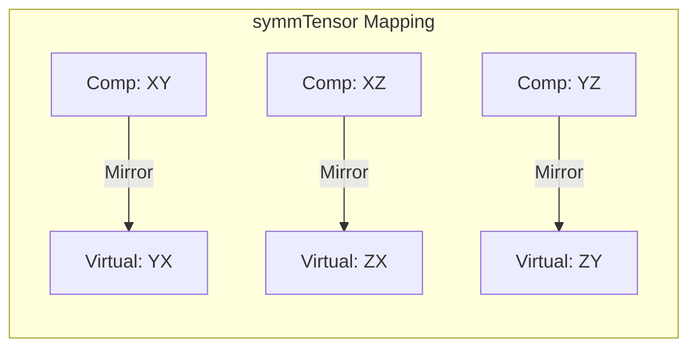

# การจัดเก็บและความสมมาตร (Storage & Symmetry)

![[mirror_property_tensor.png]]
`A 3x3 grid where the diagonal is a mirror. Values above the diagonal (XY, XZ, YZ) are reflected perfectly below to (YX, ZX, ZY), illustrating symmetric tensor properties, scientific textbook diagram, clean vector line art, white background, high definition, flat design, educational infographic --ar 16:9`

## 3. กลไกภายใน: การจัดเก็บและความสมมาตร

ลำดับชั้นคลาสเทนเซอร์ของ OpenFOAM ใช้กลยุทธ์การจัดเก็บข้อมูลที่ซับซ้อนซึ่งสร้างสมดุลระหว่างประสิทธิภาพหน่วยความจำและประสิทธิภาพการคำนวณ

**หลักการออกแบบพื้นฐาน**: แอปพลิเคชัน CFD ส่วนใหญ่ใช้เทนเซอร์สมมาตร (เทนเซอร์ความเครียด เทนเซอร์อัตราการบิดเบือน) เป็นหลัก ซึ่งช่วยให้สามารถปรับปรุงหน่วยความจำได้อย่างมีนัยสำคัญผ่านการจัดรูปแบบการจัดเก็บข้อมูลอย่างชาญฉลาด



---

## รูปแบบหน่วยความจำ

### เทนเซอร์ทั่วไป (`tensor`)

- **9 สเกลาร์ติดต่อกัน** ในลำดับแถวหลัก (row-major):
```
[XX][XY][XZ][YX][YY][YZ][ZX][ZY][ZZ]
  0   1   2   3   4   5   6   7   8
```

รูปแบบนี้แสดงเมทริกซ์เทนเซอร์ $3 \times 3$ แบบสมบูรณ์:
$$\mathbf{T} = \begin{bmatrix} T_{xx} & T_{xy} & T_{xz} \\ T_{yx} & T_{yy} & T_{yz} \\ T_{zx} & T_{zy} & T_{zz} \end{bmatrix}$$

**ข้อดี:**
- **การใช้งานแคชที่เหมาะสมที่สุด** ในระหว่างการดำเนินการเมทริกซ์
- **สอดคล้องกับความคาดหวัง** ของโครงสร้างหน่วยความจำของ C++
- **การเข้าถึงโดยตรง** ผ่านฟังก์ชันสมาชิกเช่น `T.xx()`, `T.xy()` เป็นต้น

---

### เทนเซอร์สมมาตร (`symmTensor`)

- **6 สเกลาร์** ที่จัดเก็บส่วนสามเหลี่ยมด้านบน:
```
[XX][XY][XZ][YY][YZ][ZZ]
  0   1   2   3   4   5
```

การจัดเก็บนี้ใช้ประโยชน์จากคุณสมบัติทางคณิตศาสตร์ของความสมมาตรซึ่ง $T_{ij} = T_{ji}$

โครงสร้างหน่วยความจำสอดคล้องกับ:
$$\mathbf{S} = \begin{bmatrix} S_{xx} & S_{xy} & S_{xz} \\ S_{xy} & S_{yy} & S_{yz} \\ S_{xz} & S_{yz} & S_{zz} \end{bmatrix}$$

**การเข้าถึงส่วนประกอบสามเหลี่ยมด้านล่าง:**
- `S.yx() == S.xy()`
- `S.zx() == S.xz()`
- `S.zy() == S.yz()`

**ข้อดี:**
- **ลดการใช้หน่วยความจำ 33%** เมื่อเทียบกับเทนเซอร์ทั่วไป
- **ฟังก์ชันการทำงานแบบสมบูรณ์** ผ่านการโอเวอร์โหลดฟังก์ชันสมาชิก

---

### เทนเซอร์ทรงกลม (`sphericalTensor`)

- **สเกลาร์เดี่ยว $\lambda$** ที่แสดง $\lambda \mathbf{I}$:
$$\mathbf{\Lambda} = \lambda \mathbf{I} = \lambda \begin{bmatrix} 1 & 0 & 0 \\ 0 & 1 & 0 \\ 0 & 0 & 1 \end{bmatrix}$$

**ข้อดี:**
- **ประสิทธิภาพสูงสุด** ในการจัดเก็บ
- **เหมาะสำหรับ** เทนเซอร์ไอโซทรอปิกที่พบได้ทั่วไปในสนามแรงดันและปรากฏการณ์ปริมาตร
- **การเข้าถึงที่ง่าย** ผ่าน `Lambda.value()` หรือโดยปริยายผ่านฟังก์ชันส่วนประกอบใดๆ

---

## การแสดงทางคณิตศาสตร์

เทนเซอร์ $\mathbf{T}$ ในพื้นที่ 3 มิติคือการแมปเชิงเส้นระหว่างเวกเตอร์:
$$\mathbf{v}_{\text{out}} = \mathbf{T} \cdot \mathbf{v}_{\text{in}}$$

ในรูปแบบส่วนประกอบ ($i,j = 1,2,3$):
$$v_i = \sum_{j=1}^3 T_{ij} \, w_j$$

**ความหมายทางฟิสิกส์ใน CFD:**
- **ความสัมพันธ์ความเครียด-ความบิดเบือน** ในกลศาสตร์ของไหล
- **การไหลของโมเมนตัม** ในกระแสความปั่นป่วน
- **สัมประสิทธิ์การแพร่** ในปรากฏการณ์การขนส่ง
- **การหมุนและการเสียรูป** ในการวิเคราะห์จลนศาสตร์

---

### การสลายเทนเซอร์

**ส่วนสมมาตร** ของเทนเซอร์ใดๆ คือ:
$$\mathbf{S} = \frac{1}{2}(\mathbf{T} + \mathbf{T}^T)$$

การใช้งานใน CFD:
- **เทนเซอร์อัตราการบิดเบือน**: $\mathbf{E} = \frac{1}{2}(\nabla \mathbf{u} + \nabla \mathbf{u}^T)$
- **เทนเซอร์ความเครียดในของไหลนิวตัน**: $\boldsymbol{\tau} = 2\mu \mathbf{E}$
- **เทนเซอร์ความเครียดเรย์โนลด์ส** ในการจำลองความปั่นป่วน

**ส่วนแอนตี้สมมาตร (skew)** คือ:
$$\mathbf{A} = \frac{1}{2}(\mathbf{T} - \mathbf{T}^T)$$

การใช้งาน:
- **แสดงส่วนประกอบการหมุน**
- **เกี่ยวข้องกับ vorticity** ผ่านเทนเซอร์ vorticity $\boldsymbol{\Omega} = \frac{1}{2}(\nabla \mathbf{u} - \nabla \mathbf{u}^T)$

---

## การใช้งาน Template Specialization

OpenFOAM ใช้ประโยชน์จาก C++ template specialization เพื่อปรับปรุงการดำเนินการเทนเซอร์ตามคุณสมบัติของความสมมาตร

### OpenFOAM Code Implementation

```cpp
// General tensor operations
template<>
class Tensor<tensor>
{
    scalar data_[9];
public:
    // Full 9-component operations
    scalar& component(int i, int j) { return data_[i*3 + j]; }
    // ... full tensor functionality
};

// Symmetric tensor specialization
template<>
class Tensor<symmTensor>
{
    scalar data_[6];  // XX, XY, XZ, YY, YZ, ZZ
public:
    // Optimized 6-component operations
    scalar& component(int i, int j) {
        if (i > j) std::swap(i, j);  // Use upper triangular only
        return data_[triangularIndex(i, j)];
    }
    // ... symmetric tensor functionality
};
```

**ประโยชน์ของการเชี่ยวชาญ:**
- **การปรับปรุงประสิทธิภาพในเวลาคอมไพล์**
- **ข้ามการคำนวณที่ซ้ำซ้อน** ในเทนเซอร์สมมาตร
- **เข้าถึงหน่วยความจำที่ไม่จำเป็น** ได้ถูกละเว้น
- **ประสิทธิภาพที่สูงขึ้น** ใน solvers ของ CFD

---

## ประสิทธิภาพการคำนวณ

กลยุทธ์การจัดเก็บส่งผลกระทบโดยตรงต่อประสิทธิภาพการคำนวณ

| ด้านประสิทธิภาพ | เทนเซอร์ทั่วไป | เทนเซอร์สมมาตร | เทนเซอร์ทรงกลม | ผลกระทบ |
|-------------------|------------------|-------------------|-------------------|-----------|
| **การใช้หน่วยความจำ** | 9 สเกลาร์ | 6 สเกลาร์ | 1 สเกลาร์ | ลดลง 89% สำหรับทรงกลม |
| **แบนด์วิดท์หน่วยความจำ** | 100% | 67% | 11% | ปรับปรุงการถ่ายโอนข้อมูล |
| **การใช้งานแคช** | มาตรฐาน | ดีขึ้น | ดีที่สุด | อัตราการ hit ของแคชสูงขึ้น |
| **การเวกเตอร์ไลเซชัน SIMD** | ดี | ดีกว่า | ดีที่สุด | การประมวลผลแบบขนาน |

### ผลกระทบด้านประสิทธิภาพ

1. **แบนด์วิดท์หน่วยความจำ**: เทนเซอร์สมมาตรลดการจราจรหน่วยความจำลง 33% สำหรับการจัดเก็บและการถ่ายโอนข้อมูล

2. **การใช้งานแคช**: รูปแบบหน่วยความจำที่เล็กลงช่วยปรับปรุงอัตราการ hit ของแคชในระหว่างการคำนวณที่ใช้เทนเซอร์หนักๆ

3. **การเวกเตอร์ไลเซชัน**: โครงสร้างหน่วยความจำแบบสม่ำเสมอช่วยให้สามารถปรับปรุง SIMD ในการดำเนินการพีชคณิตเชิงเส้น

4. **ประสิทธิภาพแบบขนาน**: การลดการแย่งชิงหน่วยความจำช่วยปรับปรุงความสามารถในการขยายขนาดบนระบบหลายคอร์และระบบกระจาย

> [!TIP] **ความสำคัญทางวิศวกรรม**
> การปรับปรุงเหล่านี้มีความสำคัญอย่างยิ่งในการจำลอง CFD ขนาดใหญ่ที่การดำเนินการเทนเซอร์เป็นต้นทุนการคำนวณหลัก

---

## 🎯 ประโยชน์ทางวิศวกรรม

การใช้ `symmTensor` ไม่ได้ประหยัดแค่แรม แต่ช่วยเพิ่มความเร็วในการคำนวณด้วย:

### Matrix Operations
การคูณเทนเซอร์สมมาตรจะลดจำนวนรอบการคูณตัวเลขลงเกือบครึ่งหนึ่ง เนื่องจากต้องคำนวณเฉพาะส่วนประกอบที่ไม่ซ้ำกัน

### Numerical Stability
บังคับให้ความเค้นสมมาตรตามกฎฟิสิกส์โดยไม่ต้องกังวลเรื่อง Round-off error ที่อาจทำให้เทนเซอร์เอียงไปข้างใดข้างหนึ่ง

---

## 📊 สรุปการเปรียบเทียบ

| ประเภทเทนเซอร์ | องค์ประกอบอิสระ | เค้าโครงหน่วยความจำ | การใช้งานหลัก |
|-------------|-------------|-------------|------------|
| **Tensor** | 9 องค์ประกอบ | `[xx, xy, xz, yx, yy, yz, zx, zy, zz]` | การดำเนินการหมุน การแปลงแบบทั่วไป |
| **symmTensor** | 6 องค์ประกอบ | `[xx, yy, zz, xy, yz, xz]` | เทนเซอร์ความเครียด เทนเซอร์อัตราการไหล |
| **sphericalTensor** | 1 องค์ประกอบ | `[ii]` | ความดันไอโซทรอปิก คุณสมบัติวัสดุไอโซทรอปิก |

**สรุป**: ความเข้าใจในเรื่องการจัดเก็บจะช่วยไปให้คุณออกแบบฟังก์ชันที่ทำงานร่วมกับเทนเซอร์ทุกประเภทได้อย่างยืดหยุ่นและมีประสิทธิภาพ
