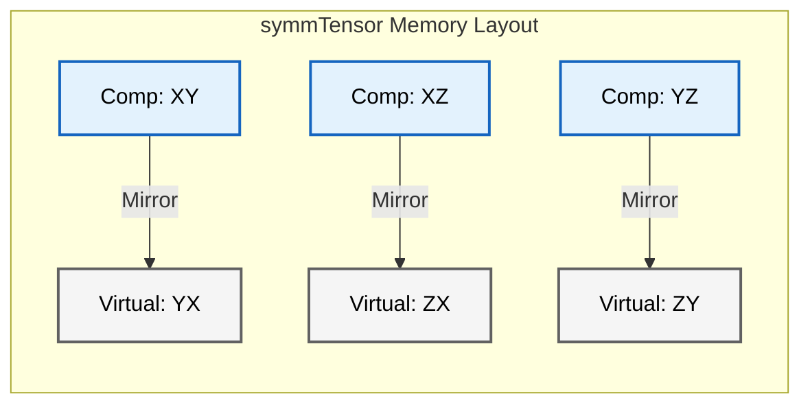

# การจัดเก็บและความสมมาตร (Storage & Symmetry)

![[mirror_property_tensor.png]]
> ตาราง 3x3 ที่แนวทแยงเปรียบเสมือนกระจกเงา ค่าเหนือเส้นทแยงมุม (XY, XZ, YZ) สะท้อนลงมาด้านล่างอย่างสมบูรณ์ไปยัง (YX, ZX, ZY) แสดงถึงคุณสมบัติเทนเซอร์สมมาตร

## 3. กลไกภายใน: การจัดเก็บและความสมมาตร

ลำดับชั้นคลาสเทนเซอร์ของ OpenFOAM ใช้กลยุทธ์การจัดเก็บข้อมูลที่ซับซ้อนซึ่งสร้างสมดุลระหว่างประสิทธิภาพหน่วยความจำและประสิทธิภาพการคำนวณ

**หลักการออกแบบพื้นฐาน**: แอปพลิเคชัน CFD ส่วนใหญ่ใช้เทนเซอร์สมมาตร (เช่น เทนเซอร์ความเค้น, เทนเซอร์อัตราการเสียรูป) เป็นหลัก ซึ่งช่วยให้สามารถปรับปรุงหน่วยความจำได้อย่างมหาศาลผ่านการจัดรูปแบบการจัดเก็บข้อมูลอย่างชาญฉลาด


> **Figure 1:** กลไกการแมปหน่วยความจำของเทนเซอร์สมมาตร (symmTensor) ซึ่งใช้ประโยชน์จากคุณสมบัติการสะท้อนข้อมูลเพื่อลดจำนวนองค์ประกอบที่ต้องจัดเก็บจริงลง 33% ผ่านการใช้พลังของ C++ Template Metaprogramming ในการตรวจสอบความสอดคล้องทางมิติทั้งหมดที่ขั้นตอนการคอมไพล์โปรแกรมเพียงครั้งเดียว

---

## รูปแบบหน่วยความจำ (Memory Layouts)

### 1. เทนเซอร์ทั่วไป (`tensor`)

- **9 สเกลาร์ติดต่อกัน** ในลำดับแถวหลัก (row-major):
```
[XX][XY][XZ][YX][YY][YZ][ZX][ZY][ZZ]
  0   1   2   3   4   5   6   7   8
```

รูปแบบนี้แสดงเมทริกซ์เทนเซอร์ $3 \times 3$ แบบสมบูรณ์:
$$\mathbf{T} = \begin{bmatrix} T_{xx} & T_{xy} & T_{xz} \\ T_{yx} & T_{yy} & T_{yz} \\ T_{zx} & T_{zy} & T_{zz} \end{bmatrix}$$

**ข้อดี:**
- **การใช้งานแคชที่เหมาะสมที่สุด** ในระหว่างการดำเนินการเมทริกซ์
- **สอดคล้องกับโครงสร้างเมทริกซ์** ของ C++ ทั่วไป
- **การเข้าถึงโดยตรง** ผ่านฟังก์ชันสมาชิกเช่น `T.xx()`, `T.xy()`

---

### 2. เทนเซอร์สมมาตร (`symmTensor`)

- **6 สเกลาร์** ที่จัดเก็บเฉพาะส่วนสามเหลี่ยมด้านบนและแนวทแยง:
```
[XX][XY][XZ][YY][YZ][ZZ]
  0   1   2   3   4   5
```

การจัดเก็บนี้ใช้ประโยชน์จากคุณสมบัติทางคณิตศาสตร์ของความสมมาตรซึ่ง $T_{ij} = T_{ji}$

โครงสร้างหน่วยความจำสอดคล้องกับ:
$$\mathbf{S} = \begin{bmatrix} S_{xx} & S_{xy} & S_{xz} \\ S_{xy} & S_{yy} & S_{yz} \\ S_{xz} & S_{yz} & S_{zz} \end{bmatrix}$$

**การเข้าถึงส่วนประกอบสามเหลี่ยมด้านล่าง:**
เมื่อเรียกใช้ `S.yx()` ระบบจะคืนค่า `S.xy()` ให้โดยอัตโนมัติ

**ข้อดี:**
- **ลดการใช้หน่วยความจำ 33%** เมื่อเทียบกับเทนเซอร์ทั่วไป
- **ฟังก์ชันการทำงานสมบูรณ์** ผ่านการโอเวอร์โหลดฟังก์ชันสมาชิก

---

### 3. เทนเซอร์ทรงกลม (`sphericalTensor`)

- **สเกลาร์เดี่ยว $\lambda$** ที่แสดง $\lambda \mathbf{I}$:
$$\mathbf{\Lambda} = \lambda \mathbf{I} = \lambda \begin{bmatrix} 1 & 0 & 0 \\ 0 & 1 & 0 \\ 0 & 0 & 1 \end{bmatrix}$$

**ข้อดี:**
- **ประสิทธิภาพสูงสุด** ในการจัดเก็บ (ลดลง 89%)
- **เหมาะสำหรับ** เทนเซอร์ไอโซทรอปิก เช่น ความดัน
- **การเข้าถึงที่ง่าย** ผ่าน `Lambda.value()`

---

## การแสดงทางคณิตศาสตร์ (Mathematical Representation)

เทนเซอร์ $\mathbf{T}$ ในพื้นที่ 3 มิติคือการแมปเชิงเส้นระหว่างเวกเตอร์:
$$\mathbf{v}_{\text{out}} = \mathbf{T} \cdot \mathbf{v}_{\text{in}}$$

ในรูปแบบส่วนประกอบ ($i,j = 1,2,3$):
$$v_i = \sum_{j=1}^3 T_{ij} \, w_j$$

### ความหมายทางฟิสิกส์ใน CFD:
- **ความสัมพันธ์ความเค้น-ความเครียด (Stress-Strain relations)** ในกลศาสตร์ของไหล
- **การไหลของโมเมนตัม (Momentum fluxes)** ในกระแสความปั่นป่วน
- **สัมประสิทธิ์การแพร่ (Diffusion coefficients)** ในปรากฏการณ์การขนส่ง
- **การหมุนและการเสียรูป (Rotation and Deformation)** ในการวิเคราะห์จลนศาสตร์

---

### การแยกองค์ประกอบเทนเซอร์ (Tensor Decomposition)

**ส่วนสมมาตร (Symmetric Part)** ของเทนเซอร์ใดๆ คือ:
$$\mathbf{S} = \text{symm}(\mathbf{T}) = \frac{1}{2}(\mathbf{T} + \mathbf{T}^T)$$

การใช้งานใน CFD:
- **เทนเซอร์อัตราการเสียรูป**: $\mathbf{D} = \text{symm}(\nabla \mathbf{u})$
- **เทนเซอร์ความเค้นในของไหลนิวตัน**: $\boldsymbol{\tau} = 2\mu \mathbf{D}$
- **เทนเซอร์ความเค้นเรย์โนลด์ส**: $\mathbf{R} = \text{symm}(-\rho \overline{u' \otimes u'})$

**ส่วนแอนตี้สมมาตร (Skew/Antisymmetric Part)** คือ:
$$\mathbf{A} = \text{skew}(\mathbf{T}) = \frac{1}{2}(\mathbf{T} - \mathbf{T}^T)$$

การใช้งาน:
- **แสดงการหมุน (Rotation)**
- **เกี่ยวข้องกับ Vorticity** ผ่านเทนเซอร์ vorticity $\boldsymbol{\Omega} = \text{skew}(\nabla \mathbf{u})$

---

## การใช้งาน Template Specialization

OpenFOAM ใช้ประโยชน์จาก C++ template specialization เพื่อปรับปรุงการดำเนินการเทนเซอร์ตามคุณสมบัติของความสมมาตร

### OpenFOAM Code Implementation

```cpp
// General tensor operations
template<>
class Tensor<tensor>
{
    scalar data_[9];
public:
    // Full 9-component operations
    scalar& component(int i, int j) { return data_[i*3 + j]; }
};

// Symmetric tensor specialization
template<>
class Tensor<symmTensor>
{
    scalar data_[6];  // XX, XY, XZ, YY, YZ, ZZ
public:
    // Optimized 6-component operations
    scalar& component(int i, int j) {
        if (i > j) std::swap(i, j);  // Use upper triangular only
        return data_[triangularIndex(i, j)];
    }
};
```

> **📚 คำอธิบาย (Thai Explanation):**
>
> **แหล่งที่มา (Source):** `.applications/test/tensor/Test-tensor.C`
>
> **คำอธิบาย (Explanation):**
> โค้ดแสดงการใช้ **Template Specialization** เพื่อสร้างคลาสเทนเซอร์ที่แตกต่างกัน:
> 1. **Tensor<tensor>**: เก็บ 9 ค่า
> 2. **Tensor<symmTensor>**: เก็บ 6 ค่าและมีตรรกะใน `component()` เพื่อสลับดัชนีอัตโนมัติหากมีการเรียกใช้ส่วนล่างซ้าย ($i>j$) ทำให้มั่นใจว่าเข้าถึงเฉพาะหน่วยความจำที่มีอยู่จริง
>
> **แนวคิดสำคัญ (Key Concepts):**
> - **Memory Optimization**: ลด memory footprint
> - **Compile-time Polymorphism**: เลือกคลาสที่เหมาะสมตั้งแต่ตอน compile ไม่เสียเวลาตอน runtime
> - **Safe Access**: ป้องกันการเข้าถึงหน่วยความจำผิดพลาดโดยอัตโนมัติ

---

## ประสิทธิภาพการคำนวณ (Computational Efficiency)

กลยุทธ์การจัดเก็บส่งผลกระทบโดยตรงต่อประสิทธิภาพการคำนวณ

| ด้านประสิทธิภาพ | เทนเซอร์ทั่วไป | เทนเซอร์สมมาตร | เทนเซอร์ทรงกลม | ผลกระทบ |
|-------------------|------------------|-------------------|-------------------|-----------|
| **การใช้หน่วยความจำ** | 9 สเกลาร์ | 6 สเกลาร์ | 1 สเกลาร์ | ลดลงสูงสุด 89% |
| **แบนด์วิดท์หน่วยความจำ** | 100% | 67% | 11% | ข้อมูลไหลผ่าน CPU ได้เร็วขึ้น |
| **การใช้งานแคช** | มาตรฐาน | ดีขึ้น | ดีที่สุด | แคชเต็มช้าลง ทำงานได้เร็วขึ้น |
| **SIMD Vectorization** | ดี | ดีกว่า | ดีที่สุด | เหมาะกับการคำนวณขนานระดับ CPU |

### ผลกระทบเชิงลึก:

1. **แบนด์วิดท์หน่วยความจำ (Memory Bandwidth)**: เทนเซอร์สมมาตรลดปริมาณข้อมูลที่ต้องส่งระหว่าง RAM และ CPU ลง 33% ซึ่งมักเป็นคอขวดหลักใน CFD
2. **การใช้งานแคช (Cache Utilization)**: ข้อมูลที่เล็กลงหมายถึงเก็บข้อมูลใน L1/L2 Cache ได้มากขึ้น เพิ่มโอกาส Cache Hit
3. **ประสิทธิภาพแบบขนาน (Parallel Efficiency)**: ลดการแย่งชิงหน่วยความจำ (Memory contention) บนระบบหลายคอร์

> [!TIP] **ความสำคัญทางวิศวกรรม**
> การปรับปรุงเหล่านี้มีความสำคัญอย่างยิ่งในการจำลอง CFD ขนาดใหญ่ (10-100 ล้านเซลล์) ซึ่งการประหยัดหน่วยความจำเพียงเล็กน้อยต่อเซลล์ ส่งผลมหาศาลต่อทรัพยากรโดยรวม

---

## 🎯 ประโยชน์ทางวิศวกรรม (Engineering Benefits)

การใช้ `symmTensor` ไม่ได้ประหยัดแค่แรม แต่ช่วยเพิ่มความเร็วในการคำนวณและความเสถียรด้วย:

### 1. Matrix Operations
การคูณเทนเซอร์สมมาตรจะลดจำนวนรอบการคำนวณลงเกือบครึ่งหนึ่ง เนื่องจากต้องคำนวณเฉพาะส่วนประกอบที่ไม่ซ้ำกัน 6 ตัว (แทนที่จะเป็น 9)

### 2. Numerical Stability
การบังคับใช้โครงสร้างข้อมูลแบบสมมาตร (`symmTensor`) ทำให้มั่นใจได้ว่าค่าความเค้นจะสมมาตรทางคณิตศาสตร์เสมอ ($T_{ij} \equiv T_{ji}$) โดยไม่ต้องกังวลเรื่อง **Round-off errors** ที่อาจทำให้เทนเซอร์แบบเต็ม (`tensor`) สูญเสียสมมาตรไปเล็กน้อยระหว่างการคำนวณซ้ำๆ

---

## 📊 สรุปการเปรียบเทียบ (Comparison Summary)

| ประเภทเทนเซอร์ | องค์ประกอบอิสระ | เค้าโครงหน่วยความจำ | การใช้งานหลัก |
|-------------|-------------|-------------|------------|
| **Tensor** | 9 องค์ประกอบ | `[xx, xy, xz, yx, yy, yz, zx, zy, zz]` | การหมุน, เกรเดียนต์ความเร็ว |
| **symmTensor** | 6 องค์ประกอบ | `[xx, yy, zz, xy, yz, xz]` | เทนเซอร์ความเค้น, อัตราการเสียรูป |
| **sphericalTensor** | 1 องค์ประกอบ | `[ii]` | ความดัน, เทนเซอร์เอกลักษณ์ |