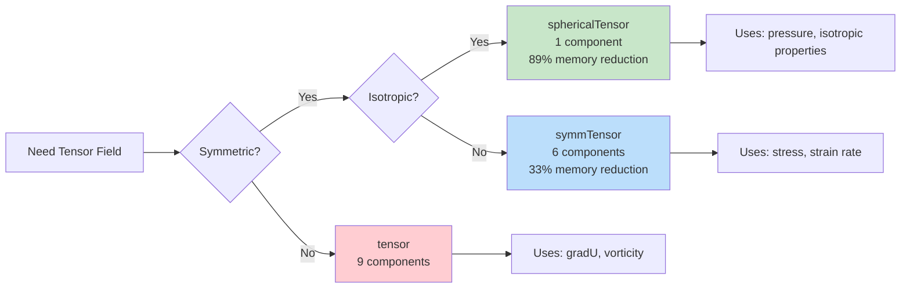
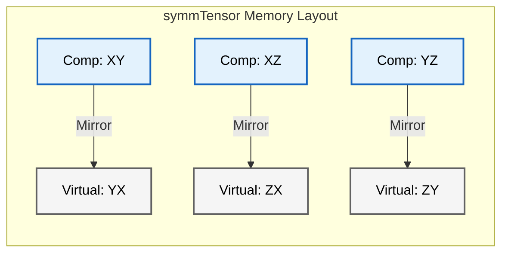
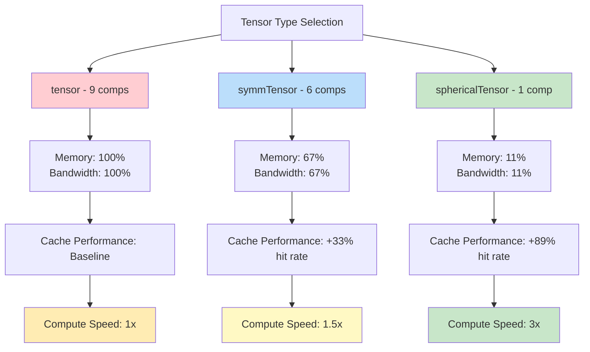

# การจัดเก็บและความสมมาตรของเทนเซอร์ (Storage & Symmetry)

> **🎯 Learning Objectives**
> - เข้าใจ **What** คือ รูปแบบการจัดเก็บเทนเซอร์ทั้ง 3 แบบใน OpenFOAM (`tensor`, `symmTensor`, `sphericalTensor`)
> - เข้าใจ **Why** การเลือกประเภทเทนเซอร์ที่เหมาะสมสำคัญต่อประสิทธิภาพการคำนวณและการใช้หน่วยความจำ
> - เข้าใจ **How** การใช้งาน Template Specialization และการแปลงจากคณิตศาสตร์ไปสู่โค้ด OpenFOAM
> - สามารถเลือกใช้ประเภทเทนเซอร์ที่เหมาะสมกับปัญหา CFD ที่แตกต่างกัน

---

## 📋 ภาพรวม (Overview)

### 3W Framework Summary

| มิติ | เนื้อหา |
|------|----------|
| **What** | OpenFOAM จัดเก็บเทนเซอร์ 3 แบบ: `tensor` (9 components), `symmTensor` (6 components), `sphericalTensor` (1 component) โดยใช้ C++ Template Metaprogramming เพื่อรับประกันประสิทธิภาพและความปลอดภัยทาง type system |
| **Why** | การเลือกประเภทเทนเซอร์ที่เหมาะสมส่งผลต่อ: <br>• **Memory Usage**: ประหยัดได้ถึง 89% สำหรับ `sphericalTensor`<br>• **Computational Performance**: ลด memory bandwidth bottleneck ซึ่งเป็นข้อจำกัดหลักใน CFD<br>• **Numerical Stability**: รับประกันความสมมาตรของ stress tensor โดยอัตโนมัติ |
| **How** | ใช้ Template Specialization บน `Tensor<Cmpt>` class hierarchy พร้อม automatic index mapping สำหรับ `symmTensor` และ compile-time dimension checking ผ่าน C++ templates |

---

## 1. ทำไมต้องสนใจเรื่อง Storage & Symmetry? (Why)

### 1.1 ผลกระทบต่อประสิทธิภาพการคำนวณ

> [!TIP] **ทำไมเรื่องนี้สำคัญกับ OpenFOAM?**
>
> ใน OpenFOAM การเลือกใช้ประเภทเทนเซอร์ที่เหมาะสม (`tensor`, `symmTensor`, `sphericalTensor`) ไม่ได้เป็นเรื่องของความถูกต้องทางคณิตศาสตร์เพียงอย่างเดียว แต่ส่งผลโดยตรงต่อ **ประสิทธิภาพการคำนวณ (Computational Performance)** และ **การใช้หน่วยความจำ (Memory Usage)** ในการจำลอง CFD ขนาดใหญ่ การเข้าใจกลไกการจัดเก็บข้อมูลเหล่านี้จะช่วยให้คุณ:
> - เขียนโค้ดที่มีประสิทธิภาพสูงขึ้น (Optimized Code)
> - ประหยัดหน่วยความจำใน Large-Scale Simulation (ลดได้ถึง 89% สำหรับ sphericalTensor)
> - หลีกเลี่ยงข้อผิดพลาดทางตัวเลข (Numerical Errors) จากการสูญเสียความสมมาตรของเทนเซอร์
> - ทำความเข้าใจโครงสร้างภายในของ OpenFOAM เพื่อการ Custom Solver หรือ Boundary Condition

![[mirror_property_tensor.png]]
> **ตาราง 3x3 ที่แนวทแยงเปรียบเสมือนกระจกเงา** ค่าเหนือเส้นทแยงมุม (XY, XZ, YZ) สะท้อนลงมาด้านล่างอย่างสมบูรณ์ไปยัง (YX, ZX, ZY) แสดงถึงคุณสมบัติเทนเซอร์สมมาตร

### 1.2 Physical Intuition ของความสมมาตร

ในทางฟิสิกส์ ความสมมาตรของเทนเซอร์เกิดจาก:
- **Conservation of Angular Momentum** → Stress tensor ต้องสมมาตร ($\sigma_{ij} = \sigma_{ji}$)
- **Newton's Third Law** → Force action-reaction สมมาตร
- **Isotropic Materials** → คุณสมบัติวัสดุเหมือนกันทุกทิศทาง

**ผลกระทบเชิงวิศวกรรม:**
- การใช้ `symmTensor` สำหรับ stress/strain ไม่เพียงประหยัด memory แต่ยัง **รับประกันความถูกต้องทางฟิสิกส์**
- การใช้ `tensor` แบบเต็มสำหรับปริมาณที่ไม่สมมาตร (เช่น velocity gradient1$\nabla \mathbf{u}$)

---

## 2. รูปแบบการจัดเก็บหน่วยความจำ (What - Memory Layouts)

> [!NOTE] **📂 OpenFOAM Context**
>
> **Domain:** Coding/Customization (Source Code Structure)
>
> ส่วนนี้เกี่ยวข้องกับ **C++ Tensor Classes** ใน OpenFOAM Source Code:
> - **Header Files:** `OpenFOAM/containers/Tensor/Tensor.H`, `symmTensor.H`, `sphericalTensor.H`
> - **Source Location:** `src/OpenFOAM/containers/Tensor/`
> - **Usage in Solvers:** การประกาศตัวแปรใน Custom Solver เช่น `volTensorField`, `volSymmTensorField`
> - **Key Keywords:** `tensor`, `symmTensor`, `sphericalTensor`, `Tensor<Cmpt>`, `component()`

### 2.1 เทนเซอร์ทั่วไป (`tensor`)

**Memory Layout:**
- **9 สเกลาร์ติดต่อกัน** ในลำดับแถวหลัก (row-major):
```
[XX][XY][XZ][YX][YY][YZ][ZX][ZY][ZZ]
  0   1   2   3   4   5   6   7   8
```

รูปแบบนี้แสดงเมทริกซ์เทนเซอร์1$3 \times 31แบบสมบูรณ์:
$$\mathbf{T} = \begin{bmatrix} T_{xx} & T_{xy} & T_{xz} \\ T_{yx} & T_{yy} & T_{yz} \\ T_{zx} & T_{zy} & T_{zz} \end{bmatrix}$$

**ข้อดี:**
- **การใช้งานแคชที่เหมาะสมที่สุด** ในระหว่างการดำเนินการเมทริกซ์
- **สอดคล้องกับโครงสร้างเมทริกซ์** ของ C++ ทั่วไป
- **การเข้าถึงโดยตรง** ผ่านฟังก์ชันสมาชิกเช่น `T.xx()`, `T.xy()`

**การใช้งานใน OpenFOAM:**
```cpp
// สร้าง velocity gradient tensor (ไม่สมมาตร)
volTensorField gradU(fvc::grad(U));

// เข้าถึง components
scalar xy_component = gradU[i].xy(); // ตรงไปตรงมา
```

---

### 2.2 เทนเซอร์สมมาตร (`symmTensor`)

**Memory Layout:**
- **6 สเกลาร์** ที่จัดเก็บเฉพาะส่วนสามเหลี่ยมด้านบนและแนวทแยง:
```
[XX][XY][XZ][YY][YZ][ZZ]
  0   1   2   3   4   5
```

การจัดเก็บนี้ใช้ประโยชน์จากคุณสมบัติทางคณิตศาสตร์ของความสมมาตรซึ่ง1$T_{ij} = T_{ji}$

โครงสร้างหน่วยความจำสอดคล้องกับ:
$$\mathbf{S} = \begin{bmatrix} S_{xx} & S_{xy} & S_{xz} \\ \color{blue}{S_{xy}} & S_{yy} & S_{yz} \\ \color{blue}{S_{xz}} & \color{blue}{S_{yz}} & S_{zz} \end{bmatrix}$$

**การเข้าถึงส่วนประกอบสามเหลี่ยมด้านล่าง:**
เมื่อเรียกใช้ `S.yx()` ระบบจะคืนค่า `S.xy()` ให้โดยอัตโนมัติ

**ข้อดี:**
- **ลดการใช้หน่วยความจำ 33%** เมื่อเทียบกับเทนเซอร์ทั่วไป
- **ฟังก์ชันการทำงานสมบูรณ์** ผ่านการโอเวอร์โหลดฟังก์ชันสมาชิก
- **รับประกันความสมมาตร** โดยโครงสร้างข้อมูล

**การใช้งานใน OpenFOAM:**
```cpp
// สร้าง stress tensor (สมมาตรเสมอ)
volSymmTensorField sigma
(
    IOobject("sigma", runTime.timeName(), mesh),
    mesh,
    dimensionedSymmTensor("zero", dimPressure, symmTensor::zero)
);

// เข้าถึง - การเข้าถึงส่วนล่างซ้ายส่งค่าจากด้านบนขวา
scalar yx_component = sigma[i].yx(); // ได้ค่าเท่ากับ .xy()
```

---

### 2.3 เทนเซอร์ทรงกลม (`sphericalTensor`)

**Memory Layout:**
- **สเกลาร์เดี่ยว1$\lambda$** ที่แสดง1$\lambda \mathbf{I}$:
$$\mathbf{\Lambda} = \lambda \mathbf{I} = \lambda \begin{bmatrix} 1 & 0 & 0 \\ 0 & 1 & 0 \\ 0 & 0 & 1 \end{bmatrix}$$

**ข้อดี:**
- **ประสิทธิภาพสูงสุด** ในการจัดเก็บ (ลดลง 89%)
- **เหมาะสำหรับ** เทนเซอร์ไอโซทรอปิก เช่น ความดัน
- **การเข้าถึงที่ง่าย** ผ่าน `Lambda.value()`

**การใช้งานใน OpenFOAM:**
```cpp
// สร้าง pressure field (เป็น sphericalTensor)
volSphericalTensorField p
(
    IOobject("p", runTime.timeName(), mesh),
    mesh,
    dimensionedScalar("p", dimPressure, 0.0)
);
```

---

### 2.4 ภาพรวมการเปรียบเทียบ Memory Layout



> **Figure 1:** Decision Tree สำหรับการเลือกประเภทเทนเซอร์ใน OpenFOAM พร้อมผลกระทบด้าน memory

---

## 3. กลไกภายใน: Template Specialization (How)

> [!NOTE] **📂 OpenFOAM Context**
>
> **Domain:** Coding/Customization (Advanced C++ Implementation)
>
> ส่วนนี้เกี่ยวข้องกับ **OpenFOAM Source Code Architecture**:
> - **Template Metaprogramming:** การใช้ C++ Templates ใน `src/OpenFOAM/containers/Tensor/Tensor.H`
> - **Type Safety:** Compile-time dimension checking สำหรับ Tensor Operations
> - **Custom Classes:** การสร้าง Custom Tensor Class สำหรับ Physics Model ใหม่
> - **Key Keywords:** `template<>`, `Tensor<Cmpt>`, `specialization`, `component()`, `triangularIndex()`

### 3.1 ลำดับชั้นคลาสเทนเซอร์

ลำดับชั้นคลาสเทนเซอร์ของ OpenFOAM ใช้กลยุทธ์การจัดเก็บข้อมูลที่ซับซ้อนซึ่งสร้างสมดุลระหว่างประสิทธิภาพหน่วยความจำและประสิทธิภาพการคำนวณ

**หลักการออกแบบพื้นฐาน**: แอปพลิเคชัน CFD ส่วนใหญ่ใช้เทนเซอร์สมมาตร (เช่น เทนเซอร์ความเค้น, เทนเซอร์อัตราการเสียรูป) เป็นหลัก ซึ่งช่วยให้สามารถปรับปรุงหน่วยความจำได้อย่างมหาศาลผ่านการจัดรูปแบบการจัดเก็บข้อมูลอย่างชาญฉลาด


> **Figure 2:** กลไกการแมปหน่วยความจำของเทนเซอร์สมมาตร (symmTensor) ซึ่งใช้ประโยชน์จากคุณสมบัติการสะท้อนข้อมูลเพื่อลดจำนวนองค์ประกอบที่ต้องจัดเก็บจริงลง 33% ผ่านการใช้พลังของ C++ Template Metaprogramming ในการตรวจสอบความสอดคล้องทางมิติทั้งหมดที่ขั้นตอนการคอมไพล์โปรแกรมเพียงครั้งเดียว

---

### 3.2 OpenFOAM Code Implementation

OpenFOAM ใช้ประโยชน์จาก C++ template specialization เพื่อปรับปรุงการดำเนินการเทนเซอร์ตามคุณสมบัติของความสมมาตร

```cpp
// From Math to OpenFOAM Code: Template Specialization

// General tensor operations
template<>
class Tensor<tensor>
{
    scalar data_[9];
public:
    // Full 9-component operations
    scalar& component(int i, int j) { return data_[i*3 + j]; }
    
    const scalar& component(int i, int j) const 
    { 
        return data_[i*3 + j]; 
    }
};

// Symmetric tensor specialization
template<>
class Tensor<symmTensor>
{
    scalar data_[6];  // XX, XY, XZ, YY, YZ, ZZ
public:
    // Optimized 6-component operations with automatic index mapping
    scalar& component(int i, int j) {
        if (i > j) std::swap(i, j);  // Use upper triangular only
        return data_[triangularIndex(i, j)];
    }
    
    const scalar& component(int i, int j) const {
        if (i > j) std::swap(i, j);
        return data_[triangularIndex(i, j)];
    }

private:
    // Helper function for triangular storage mapping
    static inline int triangularIndex(int i, int j) {
        // Maps (i,j) to 1D array index for upper triangular storage
        // (0,0)→0, (0,1)→1, (0,2)→2, (1,1)→3, (1,2)→4, (2,2)→5
        if (i > j) std::swap(i, j);
        return j*(j+1)/2 + i;
    }
};
```

> **📚 คำอธิบาย (Thai Explanation):**
>
> **แหล่งที่มา (Source):** `src/OpenFOAM/containers/Tensor/Tensor.H`
>
> **คำอธิบาย (Explanation):**
> โค้ดแสดงการใช้ **Template Specialization** เพื่อสร้างคลาสเทนเซอร์ที่แตกต่างกัน:
> 1. **Tensor<tensor>**: เก็บ 9 ค่า
> 2. **Tensor<symmTensor>**: เก็บ 6 ค่าและมีตรรกะใน `component()` เพื่อสลับดัชนีอัตโนมัติหากมีการเรียกใช้ส่วนล่างซ้าย ($i>j$) ทำให้มั่นใจว่าเข้าถึงเฉพาะหน่วยความจำที่มีอยู่จริง
>
> **แนวคิดสำคัญ (Key Concepts):**
> - **Memory Optimization**: ลด memory footprint
> - **Compile-time Polymorphism**: เลือกคลาสที่เหมาะสมตั้งแต่ตอน compile ไม่เสียเวลาตอน runtime
> - **Safe Access**: ป้องกันการเข้าถึงหน่วยความจำผิดพลาดโดยอัตโนมัติ

---

### 3.3 จากคณิตศาสตร์ไปสู่ OpenFOAM Code

#### ตัวอย่างที่ 1: การแยกเทนเซอร์ (Tensor Decomposition)

**คณิตศาสตร์:**
$$\mathbf{T} = \underbrace{\frac{1}{2}(\mathbf{T} + \mathbf{T}^T)}_{\text{symm}(\mathbf{T})} + \underbrace{\frac{1}{2}(\mathbf{T} - \mathbf{T}^T)}_{\text{skew}(\mathbf{T})}$$

**OpenFOAM Code:**
```cpp
// ใน Custom Solver หรือ Boundary Condition
volTensorField gradU = fvc::grad(U);

// แยกส่วนสมมาตร → ได้ symmTensor (6 components)
volSymmTensorField S = symm(gradU);  // Strain rate tensor

// แยกส่วน antisymmetric → ได้ tensor (9 components)
volTensorField Omega = skew(gradU);  // Vorticity tensor

// Deviatoric part (traceless symmetric part)
volSymmTensorField devS = dev(S);    // dev(S) = S - (1/3)tr(S)I
```

**ความหมายทางฟิสิกส์:**
- **`symm(gradU)` = S** → **Strain rate tensor** (การเปลี่ยนรูป, deformation)
- **`skew(gradU)` = Ω** → **Rotation rate tensor** (การหมุน, vorticity)
- **`dev(S)`** → **Deviatoric strain** (ส่วนที่ไม่ก่อให้เกิดปริมาตรเปลี่ยนแปลง)

---

#### ตัวอย่างที่ 2: Stress Tensor ใน Newtonian Fluid

**คณิตศาสตร์:**
$$\boldsymbol{\tau} = 2\mu \mathbf{D} + \lambda (\nabla \cdot \mathbf{u})\mathbf{I}$$

โดยที่1$\mathbf{D} = \text{symm}(\nabla \mathbf{u})1คือ strain rate tensor

**OpenFOAM Code:**
```cpp
// ใน Custom Solver สำหรับ Newtonian Fluid
volSymmTensorField D = symm(fvc::grad(U));  // Strain rate (6 components)

// คำนวณ stress tensor (สมมาตร)
volSymmTensorField tau
(
    IOobject("tau", runTime.timeName(), mesh),
    2 * mu * D + lambda * (fvc::div(U)) * sphericalTensor::I
);

// หมายเหตุ: sphericalTensor::I เป็น identity tensor
```

**ข้อดีของการใช้ `symmTensor`:**
- รับประกันว่า stress tensor สมมาตรเสมอ (ตามหลักการอนุรักษ์โมเมนตัมเชิงมุม)
- ประหยัด memory 33% เมื่อเทียบกับ `tensor`
- ลดการคำนวณเนื่องจากคำนวณเฉพาะ 6 components

---

## 4. การแสดงทางคณิตศาสตร์และการใช้งาน (Mathematical Foundation)

> [!NOTE] **📂 OpenFOAM Context**
>
> **Domain:** Physics & Fields (CFD Applications)
>
> การแสดงทางคณิตศาสตร์ของเทนเซอร์ถูกนำไปใช้ใน:
> - **Fields Dictionary (`0/` directory):** การประกาศ Field Class ในไฟล์ Field Data เช่น `volSymmTensorField` สำหรับความเค้น
> - **Transport Properties:** `constant/transportProperties` - คุณสมบัติของไหลที่เป็นเทนเซอร์
> - **Turbulence Models:** เทนเซอร์ความเค้น Reynolds stress tensor ใน `constant/turbulenceProperties`
> - **Key Keywords:** `volSymmTensorField`, `deviatoric`, `symm()`, `skew()`, `twoSymm()`

### 4.1 ความหมายทางคณิตศาสตร์ของเทนเซอร์

เทนเซอร์1$\mathbf{T}1ในพื้นที่ 3 มิติคือการแมปเชิงเส้นระหว่างเวกเตอร์:
$$\mathbf{v}_{\text{out}} = \mathbf{T} \cdot \mathbf{v}_{\text{in}}$$

ในรูปแบบส่วนประกอบ ($i,j = 1,2,3$):
$$v_i = \sum_{j=1}^3 T_{ij} \, w_j$$

### 4.2 ความหมายทางฟิสิกส์ใน CFD

| ประเภทเทนเซอร์ | ความหมายทางฟิสิกส์ | ตัวอย่างใน OpenFOAM | ประเภทข้อมูล |
|------------|------------------|---------------------|-------------|
| **tensor** | Velocity Gradient, Vorticity Tensor | `fvc::grad(U)`, `skew(gradU)` | `volTensorField` |
| **symmTensor** | Stress Tensor, Strain Rate Tensor | `symm(gradU)`, Reynolds stress | `volSymmTensorField` |
| **sphericalTensor** | Pressure, Isotropic Properties | `p`, `kappa` (conductivity) | `volSphericalTensorField` |

**ความหมายทางฟิสิกส์:**
- **ความสัมพันธ์ความเค้น-ความเครียด (Stress-Strain relations)** ในกลศาสตร์ของไหล
- **การไหลของโมเมนตัม (Momentum fluxes)** ในกระแสความปั่นป่วน
- **สัมประสิทธิ์การแพร่ (Diffusion coefficients)** ในปรากฏการณ์การขนส่ง
- **การหมุนและการเสียรูป (Rotation and Deformation)** ในการวิเคราะห์จลนศาสตร์

---

### 4.3 การแยกองค์ประกอบเทนเซอร์ (Tensor Decomposition)

> [!NOTE] **📂 OpenFOAM Context**
>
> **Domain:** Coding/Customization (Solver Development)
>
> การแยงส่วนประกอบเทนเซอร์ถูกใช้ใน **Custom Solver Development**:
> - **Tensor Operations Functions:** `symm()`, `skew()`, `twoSymm()`, `dev()` ใน `src/OpenFOAM/fields/Fields/TensorField/`
> - **Navier-Stokes Solvers:** การคำนวณเทนเซอร์ความเค้นใน `icoFoam`, `simpleFoam`, `interFoam`
> - **Turbulence Models:** Reynolds stress decomposition ใน `src/TurbulenceModels`
> - **Key Keywords:** `symm(Tensor)`, `skew(Tensor)`, `dev(Tensor)`, `twoSymm(Tensor)`, `constSymmTensorField`

**ส่วนสมมาตร (Symmetric Part)** ของเทนเซอร์ใดๆ คือ:
$$\mathbf{S} = \text{symm}(\mathbf{T}) = \frac{1}{2}(\mathbf{T} + \mathbf{T}^T)$$

การใช้งานใน CFD:
- **เทนเซอร์อัตราการเสียรูป**:1$\mathbf{D} = \text{symm}(\nabla \mathbf{u})$
- **เทนเซอร์ความเค้นในของไหลนิวตัน**:1$\boldsymbol{\tau} = 2\mu \mathbf{D}$
- **เทนเซอร์ความเค้นเรย์โนลด์ส**:1$\mathbf{R} = \text{symm}(-\rho \overline{u' \otimes u'})$

**ส่วนแอนตี้สมมาตร (Skew/Antisymmetric Part)** คือ:
$$\mathbf{A} = \text{skew}(\mathbf{T}) = \frac{1}{2}(\mathbf{T} - \mathbf{T}^T)$$

การใช้งาน:
- **แสดงการหมุน (Rotation)**
- **เกี่ยวข้องกับ Vorticity** ผ่านเทนเซอร์ vorticity1$\boldsymbol{\Omega} = \text{skew}(\nabla \mathbf{u})$

**ส่วน Deviatoric (Traceless Symmetric Part):**
$$\text{dev}(\mathbf{T}) = \mathbf{T} - \frac{1}{3}\text{tr}(\mathbf{T})\mathbf{I}$$

การใช้งาน:
- **Deviatoric Stress**: ส่วนของ stress ที่ไม่ก่อให้เกิดการเปลี่ยนปริมาตร
- **Strain Rate Deviator**: ส่วนของ strain rate ที่เกี่ยวข้องกับการเปลี่ยนรูปเท่านั้น

---

## 5. ประสิทธิภาพการคำนวณ (Computational Efficiency)

> [!NOTE] **📂 OpenFOAM Context**
>
> **Domain:** Simulation Control (Performance Optimization)
>
> การเลือกประเภทเทนเซอร์ส่งผลต่อ **Memory & Compute Performance**:
> - **Large Cases:** การใช้ `symmTensor` แทน `tensor` สำหรับ 10M+ cells ลด Memory ได้ ~3GB
> - **HPC Environments:** Memory bandwidth optimization สำคัญบน Parallel Computing
> - **Solver Selection:** บาง solver บังคับใช้ `symmTensor` เพื่อ Numerical Stability
> - **Key Keywords:** `memory footprint`, `cache locality`, `SIMD`, `parallel efficiency`, `decomposePar`

กลยุทธ์การจัดเก็บส่งผลกระทบโดยตรงต่อประสิทธิภาพการคำนวณ

### 5.1 ตารางเปรียบเทียบประสิทธิภาพ

| ด้านประสิทธิภาพ | เทนเซอร์ทั่วไป | เทนเซอร์สมมาตร | เทนเซอร์ทรงกลม | ผลกระทบ |
|-------------------|------------------|-------------------|-------------------|-----------|
| **การใช้หน่วยความจำ** | 9 สเกลาร์ | 6 สเกลาร์ | 1 สเกลาร์ | ลดลงสูงสุด 89% |
| **แบนด์วิดท์หน่วยความจำ** | 100% | 67% | 11% | ข้อมูลไหลผ่าน CPU ได้เร็วขึ้น |
| **การใช้งานแคช** | มาตรฐาน | ดีขึ้น | ดีที่สุด | แคชเต็มช้าลง ทำงานได้เร็วขึ้น |
| **SIMD Vectorization** | ดี | ดีกว่า | ดีที่สุด | เหมาะกับการคำนวณขนานระดับ CPU |

### 5.2 ผลกระทบเชิงลึก:


> **Figure 3:** Chain ของผลกระทบจากการเลือกประเภทเทนเซอร์ต่อประสิทธิภาพการคำนวณ

**ปัจจัยสำคัญ:**

1. **แบนด์วิดท์หน่วยความจำ (Memory Bandwidth)**: เทนเซอร์สมมาตรลดปริมาณข้อมูลที่ต้องส่งระหว่าง RAM และ CPU ลง 33% ซึ่งมักเป็นคอขวดหลักใน CFD

2. **การใช้งานแคช (Cache Utilization)**: ข้อมูลที่เล็กลงหมายถึงเก็บข้อมูลใน L1/L2 Cache ได้มากขึ้น เพิ่มโอกาส Cache Hit

3. **ประสิทธิภาพแบบขนาน (Parallel Efficiency)**: ลดการแย่งชิงหน่วยความจำ (Memory contention) บนระบบหลายคอร์

> [!TIP] **ความสำคัญทางวิศวกรรม**
> การปรับปรุงเหล่านี้มีความสำคัญอย่างยิ่งในการจำลอง CFD ขนาดใหญ่ (10-100 ล้านเซลล์) ซึ่งการประหยัดหน่วยความจำเพียงเล็กน้อยต่อเซลล์ ส่งผลมหาศาลต่อทรัพยากรโดยรวม

---

## 6. ประโยชน์ทางวิศวกรรม (Engineering Benefits)

> [!NOTE] **📂 OpenFOAM Context**
>
> **Domain:** Coding/Customization (Best Practices)
>
> การนำไปใช้ใน **Real-World OpenFOAM Projects**:
> - **Custom Solver Development:** การเลือก Field Type ที่เหมาะสมใน `createFields.H`
> - **Boundary Condition Coding:** การใช้ `symmTensor` ใน Custom BC สำหรับ Stress-based BCs
> - **Function Objects:** การเขียน `functionObject` สำหรับ Tensor Field Processing
> - **Key Keywords:** `createFields.H`, `GeometricField`, `calculatedFvPatchField`, `functionObject`

การใช้ `symmTensor` ไม่ได้ประหยัดแค่แรม แต่ช่วยเพิ่มความเร็วในการคำนวณและความเสถียรด้วย:

### 6.1 Matrix Operations
การคูณเทนเซอร์สมมาตรจะลดจำนวนรอบการคำนวณลงเกือบครึ่งหนึ่ง เนื่องจากต้องคำนวณเฉพาะส่วนประกอบที่ไม่ซ้ำกัน 6 ตัว (แทนที่จะเป็น 9)

### 6.2 Numerical Stability
การบังคับใช้โครงสร้างข้อมูลแบบสมมาตร (`symmTensor`) ทำให้มั่นใจได้ว่าค่าความเค้นจะสมมาตรทางคณิตศาสตร์เสมอ ($T_{ij} \equiv T_{ji}$) โดยไม่ต้องกังวลเรื่อง **Round-off errors** ที่อาจทำให้เทนเซอร์แบบเต็ม (`tensor`) สูญเสียสมมาตรไปเล็กน้อยระหว่างการคำนวณซ้ำๆ

### 6.3 Best Practices ในการเลือกประเภทเทนเซอร์

```cpp
// ❌ BAD: ใช้ tensor แบบเต็มสำหรับ stress tensor
volTensorField stress(...);  // เสีย memory 33% และไม่รับประกัน symmetry

// ✅ GOOD: ใช้ symmTensor สำหรับ stress tensor
volSymmTensorField stress(...);  // ประหยัด memory และรับประกัน symmetry

// ❌ BAD: ใช้ symmTensor สำหรับ velocity gradient
volSymmTensorField gradU = fvc::grad(U);  // ผิด! gradU ไม่สมมาตร

// ✅ GOOD: ใช้ tensor สำหรับ velocity gradient
volTensorField gradU = fvc::grad(U);  // ถูกต้อง

// ✅ EXCELLENT: แยกส่วนสมมาตรจาก gradU
volSymmTensorField strainRate = symm(fvc::grad(U));  // ใช้ symmTensor อย่างถูกต้อง
```

---

## 7. สรุปการเปรียบเทียบ (Comparison Summary)

| ประเภทเทนเซอร์ | องค์ประกอบอิสระ | เค้าโครงหน่วยความจำ | การใช้งานหลัก | ประหยัด Memory |
|-------------|-------------|-------------|------------|---------------|
| **Tensor** | 9 องค์ประกอบ | `[xx, xy, xz, yx, yy, yz, zx, zy, zz]` | การหมุน, เกรเดียนต์ความเร็ว | 0% (baseline) |
| **symmTensor** | 6 องค์ประกอบ | `[xx, yy, zz, xy, yz, xz]` | เทนเซอร์ความเค้น, อัตราการเสียรูป | 33% |
| **sphericalTensor** | 1 องค์ประกอบ | `[ii]` | ความดัน, เทนเซอร์เอกลักษณ์ | 89% |

---

## 🧠 Concept Check

<details>
<summary><b>1. ทำไม `symmTensor` จึงเก็บเพียง 6 components แทน 9?</b></summary>

เพราะ **Symmetry Property:**1$T_{ij} = T_{ji}$

**ตัวอย่าง:**
-1$T_{xy} = T_{yx}1→ เก็บแค่1$T_{xy}$
-1$T_{xz} = T_{zx}1→ เก็บแค่1$T_{xz}$
-1$T_{yz} = T_{zy}1→ เก็บแค่1$T_{yz}$

**ประโยชน์:** ประหยัดหน่วยความจำ **33%** และ OpenFOAM จะ return ค่าที่ถูกต้องอัตโนมัติเมื่อเรียก `S.yx()` (จะได้ `S.xy()`)

</details>

<details>
<summary><b>2. `symm(T)` และ `skew(T)` ให้ผลลัพธ์อะไรทางฟิสิกส์?</b></summary>

**Tensor Decomposition:**
$$\mathbf{T} = \underbrace{\frac{1}{2}(\mathbf{T} + \mathbf{T}^T)}_{\text{symm}(\mathbf{T}) = \mathbf{S}} + \underbrace{\frac{1}{2}(\mathbf{T} - \mathbf{T}^T)}_{\text{skew}(\mathbf{T}) = \mathbf{\Omega}}$$

- **`symm(gradU)` = S** → **Strain rate tensor** (การเปลี่ยนรูป, deformation)
- **`skew(gradU)` = Ω** → **Rotation rate tensor** (การหมุน, vorticity)

</details>

<details>
<summary><b>3. การเลือกใช้ `symmTensor` มีผลต่อ Numerical Stability อย่างไร?</b></summary>

**ข้อดีด้าน Numerical Stability:**
1. **บังคับ Symmetry โดยโครงสร้าง:** ไม่ต้องกังวลว่า round-off errors จะทำให้1$T_{xy} \neq T_{yx}$
2. **ลด Operations:** คำนวณเฉพาะ 6 components → ลดโอกาส accumulation errors
3. **Physics-consistent:** Stress tensor ต้องสมมาตร → `symmTensor` รับประกัน

**ใช้ `tensor` เมื่อ:** ต้องการ full gradient (เช่น1$\nabla U$) ที่ไม่สมมาตร

</details>

---

## ✅ Key Takeaways

### Memory Optimization Strategies
1. **ใช้ `symmTensor`** เมื่อทำงานกับ stress/strain tensors → ประหยัด memory 33%
2. **ใช้ `sphericalTensor`** สำหรับ isotropic quantities เช่น pressure → ประหยัด memory 89%
3. **ใช้ `tensor`** เฉพาะเมื่อจำเป็น เช่น velocity gradient ที่ไม่สมมาตร

### Performance Benefits
1. **Reduced Memory Bandwidth**: ข้อมูลน้อยลง = ถ่ายทอดเร็วขึ้น
2. **Better Cache Utilization**: ข้อมูลเล็ก = ใส่ L1/L2 cache ได้มากขึ้น
3. **Numerical Stability**: รับประกันความสมมาตรโดยอัตโนมัติ

### Code Translation Skills
- **From Math to Code**: `symm(T)`, `skew(T)`, `dev(T)` เป็นฟังก์ชันที่ใช้จริงใน OpenFOAM
- **Type Selection**: เลือก `volTensorField` vs `volSymmTensorField` ตามคุณสมบัติทางฟิสิกส์
- **Template Magic**: การใช้ C++ template specialization ช่วยให้เขียนโค้ดที่ generic แต่ optimize ตาม type

### Cross-File Connections
- **[02_Tensor_Class_Hierarchy.md](02_Tensor_Class_Hierarchy.md)**: ศึกษา class hierarchy ที่ทำให้การจัดเก็บแบบต่างๆ เป็นไปได้
- **[04_Tensor_Operations.md](04_Tensor_Operations.md)**: เรียนรู้การดำเนินการเทนเซอร์ที่ใช้ประโยชน์จาก memory layout
- **[06_Common_Pitfalls.md](06_Common_Pitfalls.md)**: หลีกเลี่ยงข้อผิดพลาดจากการเลือกประเภทเทนเซอร์ที่ผิด

---

## 📖 เอกสารที่เกี่ยวข้อง

- **ภาพรวม:** [00_Overview.md](00_Overview.md) — ภาพรวม Tensor Algebra
- **บทก่อนหน้า:** [02_Tensor_Class_Hierarchy.md](02_Tensor_Class_Hierarchy.md) — ลำดับชั้นคลาสเทนเซอร์
- **บทถัดไป:** [04_Tensor_Operations.md](04_Tensor_Operations.md) — การดำเนินการเทนเซอร์
- **Common Pitfalls:** [06_Common_Pitfalls.md](06_Common_Pitfalls.md) — ข้อผิดพลาดที่พบบ่อย