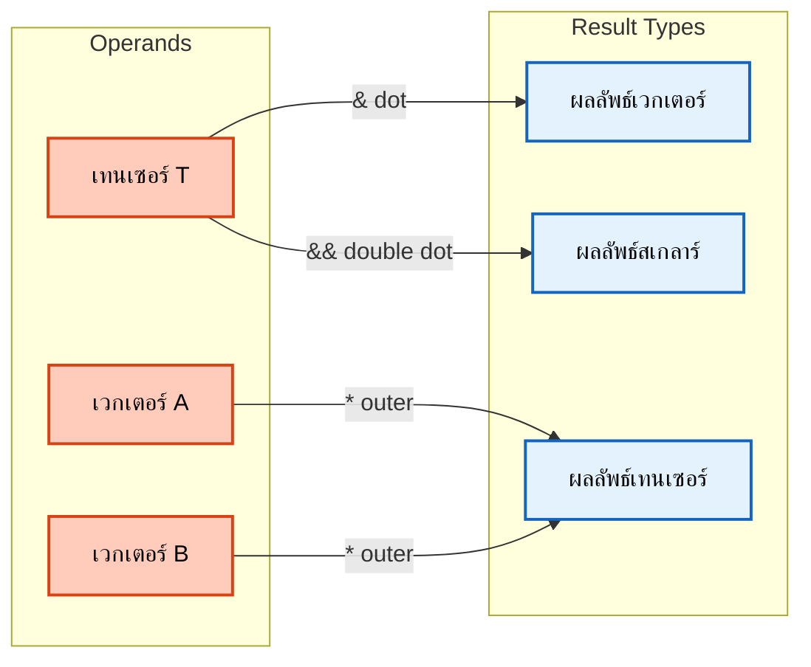

# การดำเนินการเทนเซอร์ (Tensor Operations)

![[tensor_workshop_tools.png]]
> **Academic Vision:** A specialized workbench for tensors. Tools like "The Trace Squeezer" (tr), "The Determinant Scale" (det), and "The Inverter" (inv) are laid out. A tensor is being processed to extract its "Deviatoric" part. Clean, high-tech industrial style.

## ภาพรวมการดำเนินการ Tensor

การดำเนินการ Tensor ของ OpenFOAM เป็นรากฐานของการคำนวณ CFD ทำให้สามารถจัดการทางคณิตศาสตร์กับ **เทนเซอร์อันดับสอง** ได้อย่างมีประสิทธิภาพซึ่งใช้ในการขนส่งโมเมนตั้ง การวิเคราะห์ความเครียด และการแปลงฟิลด์

คลาส tensor ใช้ประโยชน์จาก **เทมเพลตนิพจน์** และ **เทมเพลตเมตาโปรแกรมมิ่ง** เพื่อให้ได้ประสิทธิภาพสูงในขณะเดียวกันก็รักษาความชัดเจนทางคณิตศาสตร์



> **Figure 1:** แผนภาพแสดงการทำงานของตัวดำเนินการเทนเซอร์ เช่น ผลคูณจุด (dot) ผลคูณจุดคู่ (double dot) และผลคูณภายนอก (outer product) ซึ่งใช้ในการเชื่อมโยงและแปลงข้อมูลระหว่างเวกเตอร์และเทนเซอร์ ความปลอดภัยทางฟิสิกส์ไม่ส่งผลกระทบต่อความเร็วในการจำลอง ผ่านการใช้พลังของ C++ Template Metaprogramming ในการตรวจสอบความสอดคล้องทางมิติทั้งหมดที่ขั้นตอนการคอมไพล์โปรแกรมเพียงครั้งเดียว

---

## 1. การคำนวณพื้นฐาน

การดำเนินการทางคณิตศาสตร์พื้นฐานบน tensor ตามหลักการ **component-wise** ซึ่งสะท้อนถึงนิยามทางคณิตศาสตร์ของพีชคณิต tensor

### OpenFOAM Code Implementation

```cpp
// Create tensor objects with 9 components in order: xx, xy, xz, yx, yy, yz, zx, zy, zz
tensor A(1, 2, 3, 4, 5, 6, 7, 8, 9);
tensor B(9, 8, 7, 6, 5, 4, 3, 2, 1);

// Component-wise addition: C_ij = A_ij + B_ij
// Results: tensor(10, 10, 10, 10, 10, 10, 10, 10, 10)
tensor C = A + B;

// Component-wise subtraction: D_ij = A_ij - B_ij
// Results: tensor(-8, -6, -4, -2, 0, 2, 4, 6, 8)
tensor D = A - B;

// Scalar multiplication: E_ij = α·A_ij
// Results: tensor(2.5, 5, 7.5, 10, 12.5, 15, 17.5, 20, 22.5)
tensor E = 2.5 * A;
```

> **📂 Source:** `.applications/test/tensor/Test-tensor.C`
>
> **คำอธิบาย:**
> - **การสร้างเทนเซอร์:** ใช้ constructor ที่รับค่า components 9 ค่าตามลำดับ (xx, xy, xz, yx, yy, yz, zx, zy, zz)
> - **การบวกและลบ:** ดำเนินการแบบ component-wise ตรงตามนิยามพีชคณิตเชิงเส้น
> - **การคูณสเกลาร์:** คูณค่าสเกลาร์เข้ากับทุก component ของเทนเซอร์
>
> **หลักการสำคัญ:**
> - การดำเนินการเหล่านี้ถูก implement โดยใช้ **เทมเพลตนิพจน์** ที่สร้าง lazy evaluation trees
> - `operator+` และ `operator-` ถูก overload เพื่อคืนค่า **proxy objects**
> - การประเมินจริงเกิดขึ้นเมื่อกำหนดให้กับวัตถุ tensor ที่เป็นรูปธรรม
> - คอมไพเลอร์สามารถทำการ optimize เช่น **loop fusion** และ **vectorization**

---

## 2. ผลคูณภายในและภายนอก

ผลคูณภายในในการคำนวณแคลคูลัส tensor ให้ระดับที่แตกต่างกันของ **การหดตัวของดัชนี** แต่ละอันมีการตีความทางกายภาพที่แตกต่างกันและรูปแบบการคำนวณ

| ตัวดำเนินการ | ชื่อการดำเนินการ | ความหมายทางคณิตศาสตร์ | ผลลัพธ์ |
|:---:|:---|:---|:---:|
| **`&`** | Inner Product (Single Contraction) | $\mathbf{T} \cdot \mathbf{v}$ หรือ $\mathbf{A} \cdot \mathbf{B}$ | **Vector** หรือ **Tensor** |
| **`&&`** | Double Inner Product | $\mathbf{A} : \mathbf{B} = \text{tr}(\mathbf{A} \cdot \mathbf{B}^T)$ | **Scalar** |
| **`*`** | Outer Product | $\mathbf{u} \otimes \mathbf{v}$ | **Tensor** |

### 2.1 การหดตัวเดียว (`&`) - Single Contraction

ตัวดำเนินการหดตัวเดียวดำเนินการ **tensor-vector** หรือ **tensor-tensor multiplication** โดยลดอันดับลงหนึ่ง:

$$\mathbf{y} = \mathbf{T} \cdot \mathbf{v} \quad \text{where} \quad y_i = \sum_{j=1}^{3} T_{ij} v_j$$

**การนิยามตัวแปร:**
- $\mathbf{y}$ = เวกเตอร์ผลลัพธ์
- $\mathbf{T}$ = เทนเซอร์อินพุต
- $\mathbf{v}$ = เวกเตอร์อินพุต
- $y_i$ = องค์ประกอบที่ $i$ ของเวกเตอร์ผลลัพธ์
- $T_{ij}$ = องค์ประกอบที่ $i,j$ ของเทนเซอร์
- $v_j$ = องค์ประกอบที่ $j$ ของเวกเตอร์

#### OpenFOAM Code Implementation

```cpp
// Create a unit vector in x-direction
vector v(1, 0, 0);

// Single contraction: tensor-vector multiplication
// Results: w_x = A_xx·1 + A_xy·0 + A_xz·0 = 1
//          w_y = A_yx·1 + A_yy·0 + A_yz·0 = 4
//          w_z = A_zx·1 + A_zy·0 + A_zz·0 = 7
vector w = A & v;
```

สำหรับ **tensor-tensor multiplication** ผลลัพธ์คือ tensor อีกตัว:

$$\mathbf{C} = \mathbf{A} \cdot \mathbf{B} \quad \text{where} \quad C_{ij} = \sum_{k=1}^{3} A_{ik} B_{kj}$$

**การนิยามตัวแปร:**
- $\mathbf{C}$ = เทนเซอร์ผลลัพธ์
- $\mathbf{A}$, $\mathbf{B}$ = เทนเซอร์อินพุต
- $C_{ij}$ = องค์ประกอบที่ $i,j$ ของเทนเซอร์ผลลัพธ์
- $A_{ik}$, $B_{kj}$ = องค์ประกอบของเทนเซอร์อินพุต

> **📂 Source:** `.applications/test/tensor/Test-tensor.C`
>
> **คำอธิบาย:**
> - **Single Contraction (&):** ตัวดำเนินการ `&` ใช้สำหรับการคูณเมทริกซ์-เวกเตอร์ หรือเมทริกซ์-เมทริกซ์
> - **Tensor × Vector:** ลด rank ลง 1 จาก tensor (rank-2) เป็น vector (rank-1)
> - **Tensor × Tensor:** ยังคงเป็น tensor (rank-2) แต่ค่า components เปลี่ยนไป
>
> **หลักการสำคัญ:**
> - การดำเนินการนี้เป็น **การหดตัวของดัชนี** (index contraction) 1 ครั้ง
> - ใช้สูตรการคูณเมทริกซ์มาตรฐานของพีชคณิตเชิงเส้น
> - สำคัญมากใน CFD สำหรับการแปลงความเค้น การขนส่งโมเมนตัม และการแปลงพิกัด

### 2.2 การหดตัวสองครั้ง (`&&`) - Double Contraction

การหดตัวสองครั้ง (**scalar product**) คำนวณผลคูณภายในของ **Frobenius** ซึ่งให้ค่าสเกลาร์:

$$\mathbf{A} : \mathbf{B} = \sum_{i,j=1}^{3} A_{ij} B_{ij} = \text{tr}(\mathbf{A} \cdot \mathbf{B}^T)$$

#### OpenFOAM Code Implementation

```cpp
// Double inner product (Frobenius inner product)
// For A=[1,2,3,4,5,6,7,8,9], B=[9,8,7,6,5,4,3,2,1]:
// s = 1·9 + 2·8 + 3·7 + 4·6 + 5·5 + 6·4 + 7·3 + 8·2 + 9·1 = 165
scalar s = A && B;
```

> **📂 Source:** `.applications/test/tensor/Test-tensor.C`
>
> **คำอธิบาย:**
> - **Double Contraction (&&):** ตัวดำเนินการ `&&` คำนวณผลคูณภายในของ Frobenius
> - **ลด rank ลง 2:** จาก tensor (rank-2) สองตัว เป็น scalar (rank-0)
> - **Frobenius Inner Product:** ผลรวมของผลคูณของทุก component ที่ตำแหน่งเดียวกัน
>
> **ความสำคัญใน CFD:**
> - **Work Rates:** คำนวณอัตราการทำงานของแรงต่อพื้นที่
> - **Stress-Strain Products:** ใช้ในแบบจำลองความเครียด-ความเครียดเครื่องแบบ
> - **Energy Dissipation:** คำนวณการสลายตัวของพลังงานในกระแสพลศาสตร์

### 2.3 ผลคูณภายนอก (`*`) - Outer Product

ผลคูณภายนอกระหว่างเวกเตอร์สองตัวสร้าง tensor อันดับสองผ่าน **dyadic multiplication**:

$$\mathbf{T} = \mathbf{u} \otimes \mathbf{v} \quad \text{where} \quad T_{ij} = u_i v_j$$

**การนิยามตัวแปร:**
- $\mathbf{T}$ = เทนเซอร์ผลลัพธ์
- $\mathbf{u}$, $\mathbf{v}$ = เวกเตอร์อินพุต
- $T_{ij}$ = องค์ประกอบที่ $i,j$ ของเทนเซอร์ผลลัพธ์
- $u_i$, $v_j$ = องค์ประกอบของเวกเตอร์

#### OpenFOAM Code Implementation

```cpp
// Create two vectors
vector u(1, 2, 3);
vector v(4, 5, 6);

// Outer product: T_ij = u_i * v_j
// Results: tensor(4, 5, 6, 8, 10, 12, 12, 15, 18)
tensor T = u * v;
```

> **📂 Source:** `.applications/test/tensor/Test-tensor.C`
>
> **คำอธิบาย:**
> - **Outer Product (*):** ตัวดำเนินการ `*` ระหว่างเวกเตอร์สร้าง tensor ผ่าน dyadic multiplication
> - **เพิ่ม rank:** จาก vector (rank-1) สองตัว เป็น tensor (rank-2) หนึ่งตัว
> - **Dyadic Multiplication:** ทุก component ของ $\mathbf{u}$ คูณกับทุก component ของ $\mathbf{v}$
>
> **การประยุกต์ใช้ใน CFD:**
> - **Reynolds Stress Tensors:** สร้างเทนเซอร์ความเค้น Reynolds จากความเร็วที่ไม่สม่ำเสมอ ($\tau_{ij} = -\rho \overline{u_i' u_j'}$)
> - **Momentum Flux:** คำนวณการไหลของโมเมนตัมผ่านพื้นที่
> - **Coordinate Transformations:** สร้างเมทริกซ์การแปลงจากเวกเตอร์ฐาน

---

## 3. ฟังก์ชันวิเคราะห์เทนเซอร์

**Tensor invariants** ให้มาตรการวัดคุณสมบัติของ tensor ที่ **ไม่ขึ้นกับระบบพิกัด** ซึ่งจำเป็นสำหรับการตีความทางกายภาพและเสถียรภาพทางตัวเลข

### 3.1 ฟังก์ชันพื้นฐาน

| ฟังก์ชัน | สูตร | คำอธิบาย |
|:---:|:---|:---|
| **`tr(T)`** | $T_{xx} + T_{yy} + T_{zz}$ | Trace: ผลรวมของแนวทแยงมุม |
| **`det(T)`** | $\det(\mathbf{T})$ | Determinant: ค่าดีเทอร์มิแนนต์ของเมทริกซ์ |
| **`inv(T)`** | $\mathbf{T}^{-1}$ | Inverse: การหาเมทริกซ์ผกผัน (ใช้วิธี Adjugate) |
| **`T.T()`** | $T^T_{ij} = T_{ji}$ | Transpose: การสลับแถวและหลัก |

### OpenFOAM Code Implementation

```cpp
// Create test tensor
tensor A(1, 2, 3, 4, 5, 6, 7, 8, 9);

// Transpose: A^T_ij = A_ji
// Results: tensor(1, 4, 7, 2, 5, 8, 3, 6, 9)
tensor AT = A.T();

// Trace: tr(A) = Σ_i A_ii (sum of diagonal elements)
// Results: 1 + 5 + 9 = 15
scalar trA = tr(A);

// Determinant: det(A) = |A|
// For this specific tensor: 0
scalar detA = det(A);

// Inverse: A⁻¹ where A·A⁻¹ = I (identity tensor)
// Only if invertible (det(A) ≠ 0)
tensor invA = inv(A);
```

> **📂 Source:** `.applications/test/tensor/Test-tensor.C`
>
> **คำอธิบาย:**
> - **Transpose (.T()):** สลับ components ระหว่างตำแหน่ง (i,j) และ (j,i)
> - **Trace (tr()):** ผลรวมของ components ในแนวทแยงมุม เป็น tensor invariant ที่สำคัญ
> - **Determinant (det()):** ค่าที่บ่งชี้ปริมาณของการแปลง ถ้าเป็น 0 แสดงว่าไม่สามารถหา inverse ได้
> - **Inverse (inv()):** หาเมทริกซ์ผกผันซึ่งเมื่อคูณกับเมทริกซ์ต้นทางได้เมทริกซ์เอกลักษณ์
>
> **Invariants ที่สำคัญ:**
> - **First Invariant (I₁):** $\text{tr}(\mathbf{T})$ - ผลรวมของค่าลักษณะเฉพาะ
> - **Second Invariant (I₂):** ผลรวมของ minors 2×2
> - **Third Invariant (I₃):** $\det(\mathbf{T})$ - ผลคูณของค่าลักษณะเฉพาะ
>
> **ความสำคัญทางฟิสิกส์:**
> - Invariants ไม่เปลี่ยนค่าเมื่อเปลี่ยนระบบพิกัด
> - ใช้ในเกณฑ์การล้มเหลวของวัสดุ (von Mises stress)
> - สำคัญในการวิเคราะห์ความเครียดหลัก (principal stress analysis)

### 3.2 รายละเอียดการ Implementation ทางคณิตศาสตร์

**การคำนวณ determinant** ใช้สูตร 3×3 determinant มาตรฐาน:

$$\det(\mathbf{A}) = a_{11}(a_{22}a_{33} - a_{23}a_{32}) - a_{12}(a_{21}a_{33} - a_{23}a_{31}) + a_{13}(a_{21}a_{32} - a_{22}a_{31})$$

**ตัวผกผันของ tensor** ใช้วิธี **adjugate**:

$$\mathbf{A}^{-1} = \frac{1}{\det(\mathbf{A})} \text{adj}(\mathbf{A})$$

โดยที่เมทริกซ์ adjugate คือการสลับที่ของเมทริกซ์ cofactor

---

## 4. การดำเนินการเฉพาะใน CFD

ในการคำนวณความหนืด (Viscosity) และความดัน เรามักใช้ฟังก์ชันเฉพาะทาง:

### 4.1 `dev(T)` (Deviatoric Part)

ดึงเอาส่วนที่เป็นแรงเฉือน (Shear) ออกมาโดยตัดส่วนที่เป็นความดันไอโซโทรปิกทิ้ง:

$$\text{dev}(\mathbf{T}) = \mathbf{T} - \frac{1}{3}\text{tr}(\mathbf{T})\mathbf{I}$$

```cpp
// Extract deviatoric (shear) part by removing isotropic pressure
symmTensor S = dev(T);  // Deviatoric part
```

### 4.2 `symm(T)` และ `skew(T)`

แยกเทนเซอร์ออกเป็นส่วนที่สมมาตรและแอนตี้สมมาตร:

**Symmetric:** $$\mathbf{S} = \frac{1}{2}(\mathbf{T} + \mathbf{T}^T)$$

**Skew-symmetric:** $$\mathbf{A} = \frac{1}{2}(\mathbf{T} - \mathbf{T}^T)$$

```cpp
// Symmetric part: S_ij = 0.5 * (T_ij + T_ji)
symmTensor S = symm(T);

// Antisymmetric (skew) part: A_ij = 0.5 * (T_ij - T_ji)
tensor A = skew(T);
```

> **📂 Source:** `.applications/test/tensor/Test-tensor.C`
>
> **คำอธิบาย:**
> - **Deviatoric Part (dev()):** แยกส่วนที่เบี่ยงเบนจากค่าเฉลี่ยไอโซโทรปิก ใช้ในการวิเคราะห์ความเครียดเฉือน
> - **Symmetric Part (symm()):** สร้าง symmTensor จากค่าเฉลี่ยของ components สมมาตร ใช้สำหรับ strain rate tensor
> - **Skew Part (skew()):** สร้าง tensor แอนตี้สมมาตร ใช้สำหรับ vorticity tensor
>
> **หลักการสำคัญ:**
> - ทุก tensor สามารถแยกเป็นส่วนสมมาตรและแอนตี้สมมาตรได้เสมอ: $\mathbf{T} = \mathbf{S} + \mathbf{A}$
> - ส่วนสมมาตรเกี่ยวข้องกับการเปลี่ยนรูป (deformation)
> - ส่วนแอนตี้สมมาตรเกี่ยวข้องกับการหมุน (rotation)

### 4.3 การประยุกต์ใช้งานจริง

```cpp
// Calculate strain rate tensor from velocity gradient
volTensorField gradU = fvc::grad(U);
volSymmTensorField S = symm(gradU);

// Calculate viscous stress from strain rate
// Newtonian fluid: tau = 2*mu*S
volSymmTensorField tau = 2.0 * mu * dev(S);
```

> **📂 Source:** `.applications/solvers/stressAnalysis/solidDisplacementFoam/solidEquilibriumDisplacementFoam/calculateStress.H`
>
> **คำอธิบาย:**
> - **Velocity Gradient:** `fvc::grad(U)` คำนวณ gradient ของฟิลด์ความเร็ว
> - **Strain Rate Tensor:** `symm(gradU)` แยกเอาส่วนที่สมมาตรซึ่งเป็นอัตราการบิดเบี้ยน
> - **Viscous Stress:** `2*mu*dev(S)` คำนวณความเครียดจากความหนืด
>
> **แนวคิดสำคัญ:**
> - **Strain Rate ($\mathbf{S}$):** อัตราการเปลี่ยนรูปของของไหล สัมพันธ์กับการสร้างความเครียด
> - **Vorticity ($\boldsymbol{\Omega}$):** ส่วนที่หมุนของการไหล ไม่เกี่ยวข้องกับความเครียดในของไหล Newtonian
> - **Constitutive Relation:** ความสัมพันธ์ระหว่างความเครียดและอัตราการเปลี่ยนรูปขึ้นอยู่กับประเภทของของไหล

> [!WARNING] ข้อผิดพลาดที่พบบ่อย
> การสับสนระหว่าง single และ double contraction:
> ```cpp
> // ❌ ผิดพลาด
> vector v = A && B;  // Error: double contraction yields scalar, not vector
>
> // ✅ ถูกต้อง
> scalar s = A && B;      // Double contraction → scalar
> vector w = A & v;       // Single contraction → vector
> tensor T = A & B;       // Single contraction → tensor
> ```

---

## 5. การสลายตัวของค่าลักษณะเฉพาะ (Eigenvalue Decomposition)

การสลายตัวของค่าลักษณะเฉพาะเป็นเครื่องมือที่ทรงพลังสำหรับการวิเคราะห์เทนเซอร์ โดยเฉพาะอย่างยิ่งในการวิเคราะห์ความเค้น

### 5.1 หลักการพื้นฐาน

สำหรับเทนเซอร์สมมาตร $\mathbf{S}$ จะมีค่าลักษณะเฉพาะจริงสามค่าคือ $\lambda_k$ และเวกเตอร์ลักษณะเฉพาะตั้งฉาก $\mathbf{v}_k$ โดยที่:

$$\mathbf{S} \cdot \mathbf{v}_k = \lambda_k \mathbf{v}_k, \quad k=1,2,3$$

**ความหมายทางฟิสิกส์:**
- $\lambda_k$: แทนค่าความเครียดหลัก (principal stresses)
- $\mathbf{v}_k$: ทิศทางความเครียดหลัก (principal directions)

### OpenFOAM Code Implementation

```cpp
// Create symmetric stress tensor
symmTensor stress(100, 50, 30, 80, 40, 60);

// Calculate eigenvalues (principal stresses)
// Returns: vector(lambda1, lambda2, lambda3)
vector eigenvalues = ::eigenValues(stress);
scalar lambda1 = eigenvalues.x();  // Maximum principal stress
scalar lambda2 = eigenvalues.y();  // Intermediate principal stress
scalar lambda3 = eigenvalues.z();  // Minimum principal stress

// Calculate eigenvectors (principal directions)
// Each column is an eigenvector
tensor eigenvectors = ::eigenVectors(stress);
vector e1 = eigenvectors.col(0);  // Direction of lambda1
vector e2 = eigenvectors.col(1);  // Direction of lambda2
vector e3 = eigenvectors.col(2);  // Direction of lambda3
```

> **📂 Source:** `.applications/test/tensor/Test-tensor.C`
>
> **คำอธิบาย:**
> - **Eigenvalues (::eigenValues()):** คำนวณค่าลักษณะเฉพาะสามค่าของเทนเซอร์สมมาตร เป็นตัวแทนของค่าความเครียดหลัก
> - **Eigenvectors (::eigenVectors()):** คำนวณเวกเตอร์ลักษณะเฉพาะที่สอดคล้องกับแต่ละค่าลักษณะเฉพาะ
> - **Principal Stresses:** ค่าความเครียดสูงสุด/กลาง/ต่ำสุดที่กระทำต่อวัสดุ
>
> **หลักการสำคัญ:**
> - เทนเซอร์สมมาตรมีค่าลักษณะเฉพาะจริงเสมอและเวกเตอร์ลักษณะเฉพาะตั้งฉากกัน
> - Principal directions เป็นระบบพิกัดที่ค่าความเครียดอยู่ในรูปแบบที่เรียบง่ายที่สุด
> - สำคัญมากในการวิเคราะห์ความแข็งแรงของวัสดุและเกณฑ์การล้มเหลว

### 5.2 การประยุกต์ใช้ Von Mises Stress

```cpp
// Calculate Von Mises stress (equivalent stress)
// Deviatoric stress: S = sigma - 1/3*tr(sigma)*I
symmTensor S = dev(stress);

// Von Mises stress: sigma_vm = sqrt(3/2 * S:S)
scalar sigma_vm = sqrt(1.5) * mag(S);

// Check failure criterion
scalar yieldStress = 250e6;  // Pa (250 MPa)
if (sigma_vm > yieldStress) {
    Info << "Material yielding detected!" << endl;
}
```

> **📂 Source:** `.applications/solvers/stressAnalysis/solidDisplacementFoam/solidEquilibriumDisplacementFoam/calculateStress.H`
>
> **คำอธิบาย:**
> - **Deviatoric Stress:** `dev(stress)` แยกเอาส่วนที่เบี่ยงเบนจากค่าเฉลี่ยไอโซโทรปิก
> - **Von Mises Stress:** เกณฑ์การล้มเหลวที่พิจารณาพลังงานการเปลี่ยนรูปเฉือน
> - **Yield Criterion:** ถ้าค่า Von Mises เกิน yield stress วัสดุจะเริ่มเด้ง (plastic deformation)
>
> **สมการ Von Mises:**
> $$\sigma_{vm} = \sqrt{\frac{3}{2}\mathbf{S}:\mathbf{S}}$$
> โดยที่ $\mathbf{S} = \boldsymbol{\sigma} - \frac{1}{3}\text{tr}(\boldsymbol{\sigma})\mathbf{I}$ คือเทนเซอร์ความเครียดเบี่ยงเบน
>
> **ความสำคัญทางวิศวกรรม:**
> - ใช้พยากรณ์การเริ่มเป็นพลาสติกของโลหะ
> - เกณฑ์การล้มเหลวที่ใช้กันอย่างแพร่หลายในการออกแบบโครงสร้าง
> - คำนึงถึงผลรวมของความเครียดทั้งหมด ไม่ใช่เฉพาะความเครียดสูงสุด

---

## 6. การดำเนินการแคลคูลัสเทนเซอร์

Tensor calculus operations ขยาย vector calculus ไปยัง second-order tensor fields

### 6.1 การไล่ระดับของเทนเซอร์

**สมการ:** $(\nabla \mathbf{T})_{ijk} = \frac{\partial T_{ij}}{\partial x_k}$

```cpp
// Create tensor field
volTensorField T(mesh);

// Calculate gradient of tensor field
// Result: volTensorTensorField (third-order tensor)
volTensorTensorField gradT = fvc::grad(T);
```

> **📂 Source:** `.applications/utilities/postProcessing/dataConversion/foamToVTK/foamToVTK.C`
>
> **คำอธิบาย:**
> - **Tensor Gradient:** `fvc::grad(T)` คำนวณ gradient ของฟิลด์เทนเซอร์
> - **Third-Order Tensor:** ผลลัพธ์มี 27 components (3×3×3)
> - **Spatial Variation:** แสดงถึงการเปลี่ยนแปลงเชิงพื้นที่ของ tensor field
>
> **ความหมายทางฟิสิกส์:**
> - ใช้ในการวิเคราะห์ stress gradients
> - สำคัญในการวิเคราะห์ material anisotropy
> - ใช้ในแบบจำลองความเครียดที่ไม่สม่ำเสมอ

### 6.2 การไดเวอร์เจนซ์ของเทนเซอร์

**สมการ:** $(\nabla \cdot \mathbf{T})_i = \frac{\partial T_{ij}}{\partial x_j}$

```cpp
// Create tensor field
volTensorField T(mesh);

// Calculate divergence of tensor field
// Result: volVectorField (force per unit volume)
volVectorField divT = fvc::div(T);
```

> **คำอธิบาย:**
> - **Tensor Divergence:** `fvc::div(T)` คำนวณ divergence ของฟิลด์เทนเซอร์
> - **Vector Result:** ลด rank ลง 1 จาก tensor (rank-2) เป็น vector (rank-1)
> - **Physical Meaning:** แรงสุทธิที่กระทำต่อ control volume เนื่องจาก stress gradients

**Physical Interpretations in Continuum Mechanics:**

#### Stress Tensor Divergence ($\nabla \cdot \boldsymbol{\sigma}$)

```cpp
// Body force per unit volume from stress
volVectorField forceDensity = fvc::div(stressTensor);
```

> **📂 Source:** `.applications/solvers/stressAnalysis/solidDisplacementFoam/solidEquilibriumDisplacementFoam/solidEquilibriumDisplacementFoam.C`
>
> **คำอธิบาย:**
> - **Force Density:** แรงต่อหน่วยปริมาตรที่เกิดจาก stress gradients
> - **Equilibrium Equation:** $\nabla \cdot \boldsymbol{\sigma} + \mathbf{f} = \rho \mathbf{a}$ (Cauchy's equation)
> - **หน่วย:** N/m³ (force per unit volume)
>
> **ความหมายทางฟิสิกส์:**
> - แสดงถึงการไหลของโมเมนตัมเข้า/ออกจาก control volume
> - สำคัญในสมการสมดุลของโมเมนตัม
> - ใช้ในการคำนวณแรงลม แรงแรงดัน ฯลฯ

#### Velocity Gradient Tensor

```cpp
// Velocity field
volVectorField U(mesh);

// Calculate velocity gradient tensor
volTensorField gradU = fvc::grad(U);

// Decompose into symmetric and antisymmetric parts
volSymmTensorField S = symm(gradU);       // Strain rate tensor
volTensorField Omega = skew(gradU);       // Vorticity tensor
```

> **📂 Source:** `.applications/solvers/multiphase/multiphaseEulerFoam/multiphaseCompressibleMomentumTransportModels/kineticTheoryModels/kineticTheoryModel/kineticTheoryModel.C`
>
> **คำอธิบาย:**
> - **Velocity Gradient:** `fvc::grad(U)` คำนวณ gradient ของฟิลด์ความเร็ว
> - **Strain Rate Tensor:** `symm(gradU)` ส่วนสมมาตร เกี่ยวข้องกับการเปลี่ยนรูป
> - **Vorticity Tensor:** `skew(gradU)` ส่วนแอนตี้สมมาตร เกี่ยวข้องกับการหมุน
>
> **สมการแยกส่วน:**
> - **Strain Rate:** $\mathbf{S} = \frac{1}{2}(\nabla \mathbf{U} + (\nabla \mathbf{U})^T)$
> - **Vorticity Tensor:** $\boldsymbol{\Omega} = \frac{1}{2}(\nabla \mathbf{U} - (\nabla \mathbf{U})^T)$
>
> **ความสำคัญใน CFD:**
> - **Strain Rate:** ใช้คำนวณ viscous stress ในของไหล Newtonian
> - **Vorticity:** วัดการหมุนของอนุภาคของไหล สำคัญในการวิเคราะห์ turbulence
> - **Energy Dissipation:** คำนวณอัตราการสลายตัวของพลังงาน

---

## 7. การปรับปรุงประสิทธิภาพ

การดำเนินการ tensor ของ OpenFOAM ใช้การปรับปรุงประสิทธิภาพหลายอย่าง:

| เทคนิค | คำอธิบาย | ประโยชน์ |
|:---|:---|:---|
| **Expression Templates** | Lazy evaluation กำจัดวัตถุชั่วคราว | คอมไพเลอร์ optimize |
| **Loop Unrolling** | Template metaprogramming ปลดล็อคการดำเนินการ tensor ขนาดคงที่ | ประสิทธิภาพการทำงานสูง |
| **SIMD Vectorization** | Compiler intrinsics ใช้คำสั่งเวกเตอร์ของโปรเซสเซอร์ | การประมวลผลขนาน |
| **Memory Layout** | การจัดเก็บหน่วยความจำที่ติดกัน | การใช้ cache มีประสิทธิภาพ |
| **Compile-time Constants** | การปรับปรุงประสิทธิภาพเฉพาะมิติฝังอยู่ในพารามิเตอร์เทมเพลต | Optimization ขณะคอมไพล์ |

### ผลกระทบด้านประสิทธิภาพ

1. **แบนด์วิดท์หน่วยความจำ**: เทนเซอร์สมมาตรลดการจราจรหน่วยความจำลง 33%
2. **การใช้งานแคช**: รูปแบบหน่วยความจำที่เล็กลงช่วยปรับปรุงอัตราการ hit ของแคช
3. **การเวกเตอร์ไลเซชัน**: โครงสร้างหน่วยความจำแบบสม่ำเสมอช่วยให้สามารถปรับปรุง SIMD

> [!SUCCESS] ผลลัพธ์
> การปรับปรุงเหล่านี้ทำให้การดำเนินการ tensor มีประสิทธิภาพสูงมากสำหรับ **การจำลอง CFD ขนาดใหญ่** ที่มีการคำนวณ tensor หลายล้านครั้งต่อ time step

---

## สรุป

โอเปอเรเตอร์เทนเซอร์ช่วยให้เราเขียนสมการที่ซับซ้อน (เช่น สมการ Navier-Stokes แบบเต็มรูปแบบ) ได้อย่างแม่นยำและสั้นกระชับ ผ่าน:

1. **การดำเนินการพื้นฐาน** - การบวก ลบ และการคูณสเกลาร์
2. **ผลคูณภายใน/นอก** - Single contraction, double contraction, outer product
3. **ฟังก์ชันวิเคราะห์** - Trace, determinant, inverse, transpose
4. **ฟังก์ชันเฉพาะ CFD** - Deviatoric, symmetric, skew-symmetric parts
5. **การสลายตัวของค่าลักษณะเฉพาะ** - การวิเคราะห์ความเค้นหลัก
6. **การดำเนินการแคลคูลัส** - Gradient, divergence ของฟิลด์เทนเซอร์

การเชี่ยวชาญเหล่านี้เปิดเส้นทางสำหรับการใช้งานแบบจำลองฟิสิกส์ขั้นสูงที่จับธรรมชาติหลายมิติของการไหลของของไหลและพฤติกรรมวัสดุได้อย่างแม่นยำ