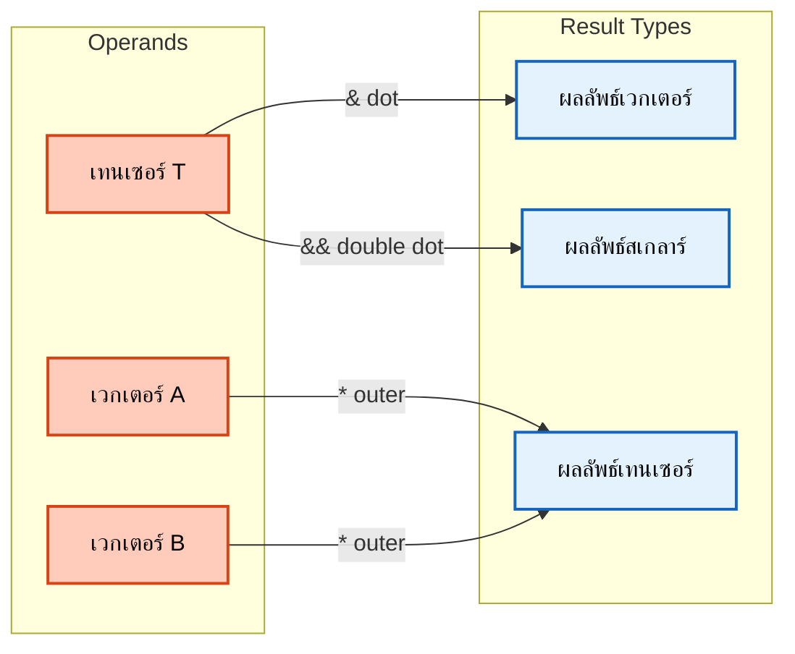
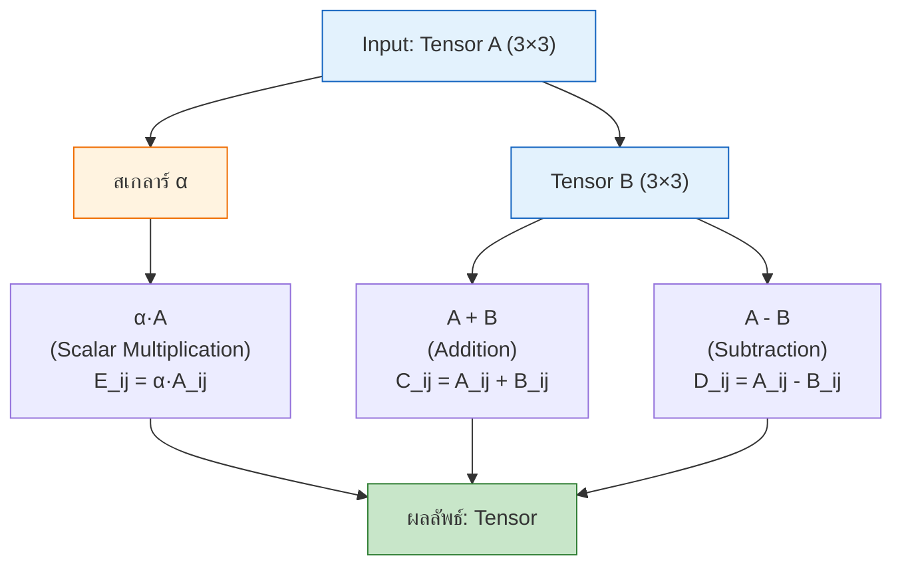
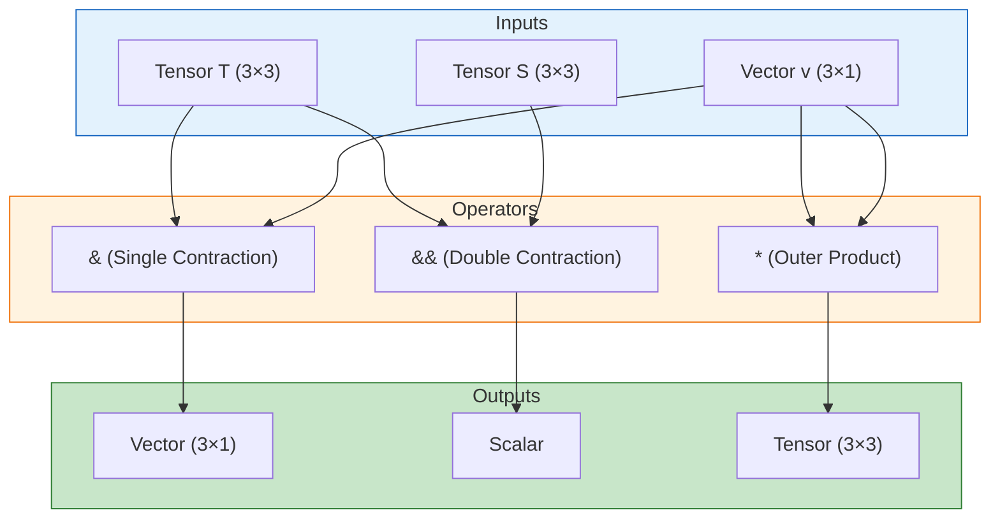
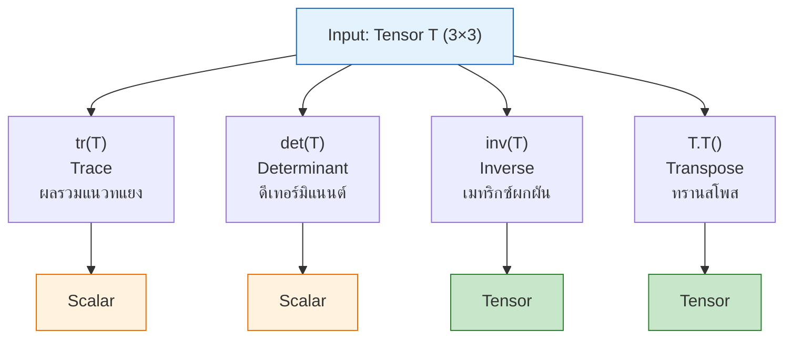
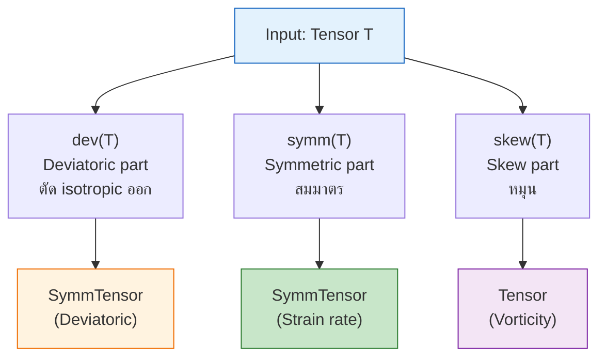
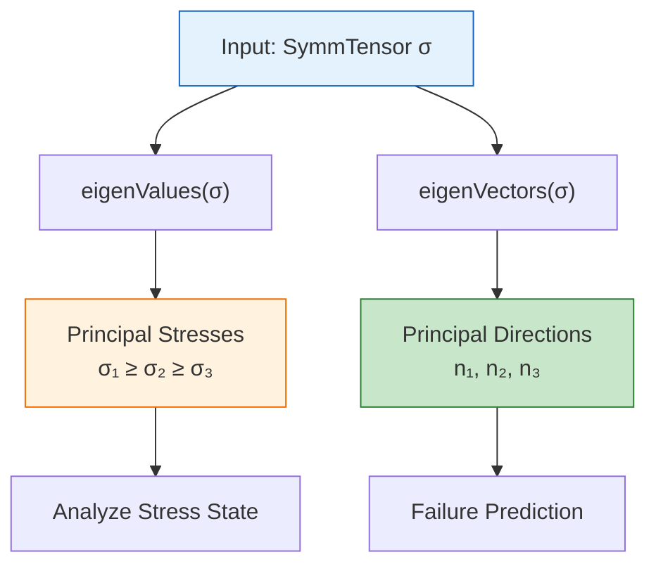
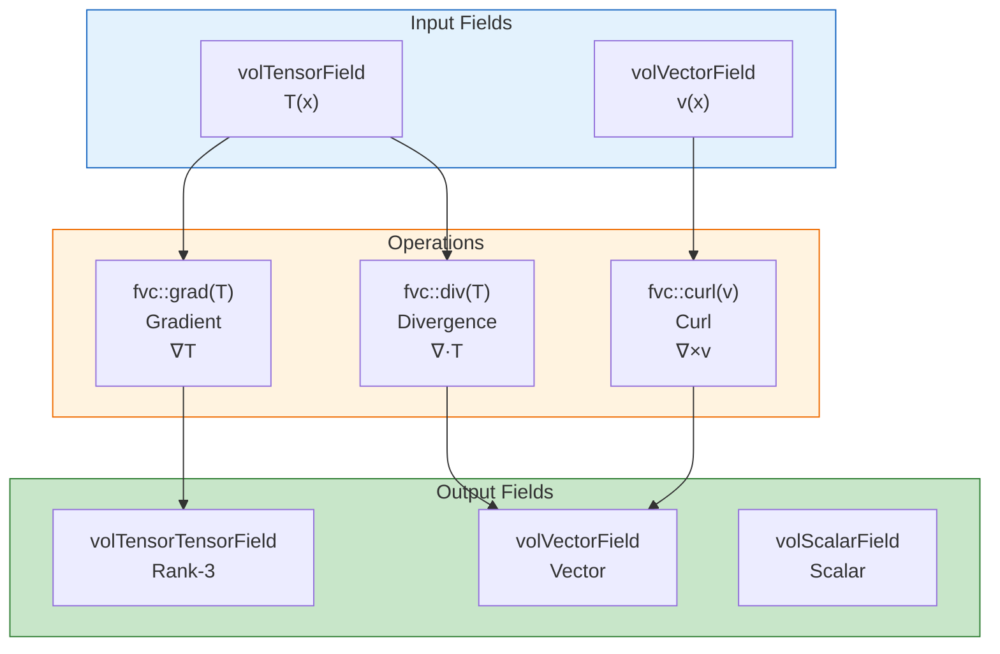
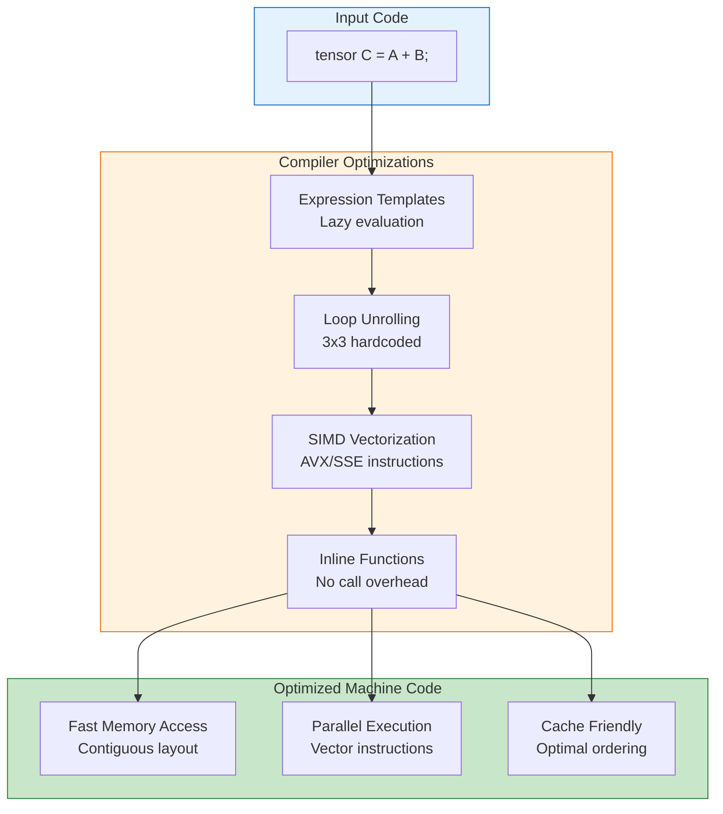
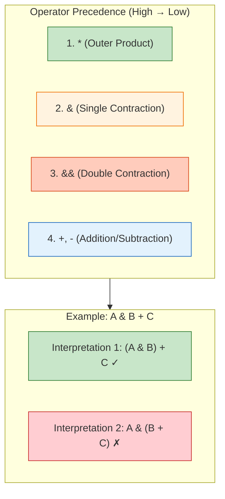

# การดำเนินการเทนเซอร์ (Tensor Operations)

> [!TIP] ทำไมการดำเนินการเทนเซอร์จึงสำคัญใน OpenFOAM?
> **เหตุผล:** การทำความเข้าใจการดำเนินการเทนเซอร์เป็นพื้นฐานสำคัญในการพัฒนาและปรับแต่ง **OpenFOAM Solvers** และ **Turbulence Models** เพราะ:
> - **ความเค้น (Stress Tensor):** ใช้ในการคำนวณความเค้นและอัตราการเสียดทานในสมการโมเมนตัม
> - **Reynolds Stress:** ใช้ในโมเดลความปั่น (Turbulence Models) เช่น k-epsilon, k-omega
> - **Gradient Operations:** ใช้ในการคำนวณ fvc::grad, fvc::div สำหรับ discretization
> - **Post-processing:** ใช้ในการวิเคราะห์ผลลัพธ์ เช่น Principal Stresses, Strain Rates
>
> **ผลกระทบ:** หากเข้าใจผิด อาจทำให้แก้สมการผิด หรือโมเดลความปั่นทำงานไม่ถูกต้อง ส่งผลให้การจำลองทั้งหมดล้มเหลว

![[tensor_workshop_tools.png]]
> **มุมมองวิชาการ:** โต๊ะทำงานเฉพาะทางสำหรับเทนเซอร์ เครื่องมืออย่าง "ตัวรีด Trace" (tr), "ตาชั่ง Determinant" (det), และ "เครื่องกลับด้าน Inverter" (inv) วางเรียงราย เทนเซอร์กำลังถูกประมวลผลเพื่อดึงส่วน "Deviatoric" ออกมา

---

## Learning Objectives

เมื่ออ่านบทนี้จบ คุณจะสามารถ:

1. **เขียนโค้ด OpenFOAM** สำหรับการดำเนินการเทนเซอร์พื้นฐาน (บวก, ลบ, คูณสเกลาร์)
2. **เลือกใช้ตัวดำเนินการ contraction** ที่ถูกต้อง (`&`, `&&`, `*`) ตามบริบททางฟิสิกส์
3. **แปลงสมการความเค้น** เช่น Newtonian stress law หรือ Reynolds stress เป็นโค้ด OpenFOAM
4. **คำนวณ Invariants** (Trace, Determinant) และ Eigenvalues สำหรับวิเคราะห์ความเค้น
5. **ประยุกต์ใช้ฟังก์ชัน CFD-specific** เช่น `dev()`, `symm()`, `skew()` ใน turbulence models
6. **เขียน Tensor Calculus operations** เช่น `fvc::grad()`, `fvc::div()` สำหรับ discretization

---

## ภาพรวมการดำเนินการเทนเซอร์

> [!NOTE] **📂 OpenFOAM Context**
> **Domain:** Coding/Customization (`src/` directory)
> - **Location:** `src/OpenFOAM/fields/Fields/tensor/` และ `src/OpenFOAM/fields/Fields/symmTensor/`
> - **Key Files:**
>   - `tensor.H`, `tensorI.H` - Tensor class definitions
>   - `symmTensor.H`, `symmTensorI.H` - Symmetric tensor definitions
> - **Usage:** ใช้ใน **Solver Development** และ **Turbulence Model** coding
> - **Related Classes:** `Tensor`, `SymmTensor`, `Vector`, `scalar`
> - **Compilation:** Part of `libOpenFOAM.so` core library

การดำเนินการเทนเซอร์ของ OpenFOAM เป็นรากฐานของการคำนวณ CFD ทำให้สามารถจัดการทางคณิตศาสตร์กับ **เทนเซอร์อันดับสอง** ได้อย่างมีประสิทธิภาพ ซึ่งจำเป็นสำหรับการขนส่งโมเมนตัม การวิเคราะห์ความเค้น และการแปลงฟิลด์

คลาสเทนเซอร์ใช้ประโยชน์จาก **Expression Templates** และ **Template Metaprogramming** เพื่อให้ได้ประสิทธิภาพสูงในขณะเดียวกันก็รักษาความชัดเจนทางคณิตศาสตร์



> **Figure 1:** แผนภาพแสดงการทำงานของตัวดำเนินการเทนเซอร์ เช่น ผลคูณจุด (dot), ผลคูณจุดคู่ (double dot), และผลคูณภายนอก (outer product) ซึ่งใช้ในการเชื่อมโยงและแปลงข้อมูลระหว่างเวกเตอร์และเทนเซอร์

---

## 1. การคำนวณพื้นฐาน (Basic Arithmetic)

> [!NOTE] **📂 OpenFOAM Context**
> **Domain:** Coding/Customization (C++ Programming)
> - **Implementation:** Expression Templates ใน `src/OpenFOAM/fields/Fields/tensor/tensorI.H`
> - **Usage Scenarios:**
>   - **Boundary Conditions:** การคำนวณค่าที่ขอบ (patch) เช่น `fixedValue`, `zeroGradient`
>   - **Initial Conditions:** การกำหนดค่าเริ่มต้นของฟิลด์เทนเซอร์
>   - **Custom Models:** การเขียนโมเดลความหนืด (Viscosity Models) หรือ Stress Models
> - **Operator Overloading:** `+`, `-`, `*`, `/` ถูก overload สำหรับ tensor operations
> - **Performance:** Inlined operations ด้วย templates ไม่มี function call overhead

**การดำเนินการทางคณิตศาสตร์พื้นฐานบนเทนเซอร์** บนเทนเซอร์เป็นแบบ **Component-wise** (ทำทีละองค์ประกอบ) ซึ่งสะท้อนถึงนิยามทางคณิตศาสตร์ของพีชคณิตเทนเซอร์

### 1.1 สูตรทางคณิตศาสตร์



> **Figure 2:** แผนภาพแสดงการดำเนินการทางคณิตศาสตร์พื้นฐานบนเทนเซอร์ ได้แก่ การคูณสเกลาร์ การบวก และการลบ

### 1.2 OpenFOAM Code Implementation

```cpp
// Create tensor objects with 9 components in order: xx, xy, xz, yx, yy, yz, zx, zy, zz
tensor A(1, 2, 3, 4, 5, 6, 7, 8, 9);
tensor B(9, 8, 7, 6, 5, 4, 3, 2, 1);

// Component-wise addition: C_ij = A_ij + B_ij
// Results: tensor(10, 10, 10, 10, 10, 10, 10, 10, 10)
tensor C = A + B;

// Component-wise subtraction: D_ij = A_ij - B_ij
// Results: tensor(-8, -6, -4, -2, 0, 2, 4, 6, 8)
tensor D = A - B;

// Scalar multiplication: E_ij = α·A_ij
// Results: tensor(2.5, 5, 7.5, 10, 12.5, 15, 17.5, 20, 22.5)
tensor E = 2.5 * A;
```

> **📂 แหล่งที่มา (Source):** `.applications/test/tensor/Test-tensor.C`
>
> **คำอธิบาย:**
> - **การสร้างเทนเซอร์:** ใช้ constructor ที่รับค่า components 9 ค่าตามลำดับ (xx, xy, xz, yx, yy, yz, zx, zy, zz)
> - **การบวกและลบ:** ดำเนินการแบบ component-wise ตรงตามนิยามพีชคณิตเชิงเส้น
> - **การคูณสเกลาร์:** คูณค่าสเกลาร์เข้ากับทุก component ของเทนเซอร์

### 1.3 จากคณิตศาสตร์ไปยัง OpenFOAM Code

| สมการคณิตศาสตร์ | OpenFOAM Code | คำอธิบาย |
|:---|:---|:---|
| $\mathbf{C} = \mathbf{A} + \mathbf{B}$ | `tensor C = A + B;` | การบวกเทนเซอร์ |
| $\mathbf{D} = \mathbf{A} - \mathbf{B}$ | `tensor D = A - B;` | การลบเทนเซอร์ |
| $\mathbf{E} = \alpha \cdot \mathbf{A}$ | `tensor E = 2.5 * A;` | การคูณสเกลาร์ |
| $F_{ij} = \frac{A_{ij} + B_{ij}}{2}$ | `tensor F = 0.5 * (A + B);` | การหาค่าเฉลี่ย |

> **หลักการสำคัญ:** การดำเนินการเหล่านี้ถูก implement โดยใช้ **Expression Templates** ที่สร้าง lazy evaluation trees เพื่อประสิทธิภาพสูงสุด

---

## 2. ผลคูณภายในและภายนอก (Inner and Outer Products)

> [!NOTE] **📂 OpenFOAM Context**
> **Domain:** Physics & Fields + Numerics
> - **Physics Applications:**
>   - **Stress Calculations:** ใช้ `&` (single contraction) ในสมการโมเมนตัม: `fvm::div(nu*dev(T(gradU)))`
>   - **Reynolds Stress:** ใช้ `*` (outer product) ใน `RASModel` สำหรับ `tau_ = -nuSgs_*dev(gradU.T())`
>   - **Energy Dissipation:** ใช้ `&&` (double contraction) ใน `epsilon` คำนวณ
> - **Numerical Schemes:**
>   - **Gauss Divergence:** `divSchemes` ใน `system/fvSchemes` ใช้ tensor contractions
>   - **Interpolation Schemes:** ใช้ใน surface field interpolations
> - **Key Operators:**
>   - `operator&` - Single contraction (tensor-vector or tensor-tensor)
>   - `operator&&` - Double contraction (tensor-tensor to scalar)
>   - `operator*` - Outer product (vector-vector to tensor)

ผลคูณในแคลคูลัสเทนเซอร์มีการ **ลดอันดับ (Contraction)** ในระดับที่แตกต่างกัน โดยแต่ละแบบมีการตีความทางฟิสิกส์ที่เฉพาะเจาะจง

### 2.1 ภาพรวมตัวดำเนินการ Contraction



> **Figure 3:** แผนภาพแสดงความสัมพันธ์ระหว่างตัวดำเนินการ contraction ต่างๆ และประเภทของผลลัพธ์

| ตัวดำเนินการ | ชื่อการดำเนินการ | ความหมายทางคณิตศาสตร์ | ผลลัพธ์ |
|:---:|:---|:---|:---:|
| **`&`** | Single Contraction (Dot Product) | $\mathbf{T} \cdot \mathbf{v}$ หรือ $\mathbf{A} \cdot \mathbf{B}$ | **Vector** หรือ **Tensor** |
| **`&&`** | Double Contraction (Double Dot) | $\mathbf{A} : \mathbf{B} = \text{tr}(\mathbf{A} \cdot \mathbf{B}^T)$ | **Scalar** |
| **`*`** | Outer Product | $\mathbf{u} \otimes \mathbf{v}$ | **Tensor** |

### 2.2 การหดตัวหนึ่งระดับ (`&`) - Single Contraction

ตัวดำเนินการหดตัวหนึ่งระดับทำหน้าที่คูณ **Tensor-Vector** หรือ **Tensor-Tensor** โดยลด rank ลง 1 (กรณีคูณเวกเตอร์):

$$\mathbf{y} = \mathbf{T} \cdot \mathbf{v} \quad \text{โดยที่} \quad y_i = \sum_{j=1}^{3} T_{ij} v_j$$

#### สูตรทางคณิตศาสตร์

$$
\begin{bmatrix}
y_1 \\
y_2 \\
y_3
\end{bmatrix}
=
\begin{bmatrix}
T_{11} & T_{12} & T_{13} \\
T_{21} & T_{22} & T_{23} \\
T_{31} & T_{32} & T_{33}
\end{bmatrix}
\cdot
\begin{bmatrix}
v_1 \\
v_2 \\
v_3
\end{bmatrix}
=
\begin{bmatrix}
T_{11}v_1 + T_{12}v_2 + T_{13}v_3 \\
T_{21}v_1 + T_{22}v_2 + T_{23}v_3 \\
T_{31}v_1 + T_{32}v_2 + T_{33}v_3
\end{bmatrix}
$$

#### ตัวอย่างโค้ด OpenFOAM

```cpp
vector v(1, 0, 0);
tensor A(1, 2, 3, 4, 5, 6, 7, 8, 9);

// Single contraction: tensor-vector multiplication
// Result vector w has components:
// w_x = 1*1 + 2*0 + 3*0 = 1
// w_y = 4*1 + 5*0 + 6*0 = 4
// w_z = 7*1 + 8*0 + 9*0 = 7
vector w = A & v;
```

> **ความสำคัญ:** ใช้ในการคำนวณแรงบนพื้นผิว (Traction vector = Stress tensor & Normal vector)

#### จากคณิตศาสตร์ไปยัง OpenFOAM Code: Traction Vector

| สมการคณิตศาสตร์ | OpenFOAM Code | บริบททางฟิสิกส์ |
|:---|:---|:---|
| $\mathbf{t} = \boldsymbol{\sigma} \cdot \mathbf{n}$ | `vector t = sigma & n;` | Traction vector บนพื้นผิว |
| $\mathbf{F} = \int_A \boldsymbol{\sigma} \cdot \mathbf{n} \, dA$ | `vector F = sum(mesh.Sf() & sigma.boundaryField()[patchi]);` | แรงรวมบน patch |

### 2.3 การหดตัวสองระดับ (`&&`) - Double Contraction

การหดตัวสองระดับ (**Scalar Product**) คำนวณผลคูณภายในแบบ **Frobenius** ซึ่งให้ค่าสเกลาร์เดียว:

$$\mathbf{A} : \mathbf{B} = \sum_{i,j=1}^{3} A_{ij} B_{ij}$$

#### สูตรทางคณิตศาสตร์

$$\mathbf{A} : \mathbf{B} = A_{11}B_{11} + A_{12}B_{12} + A_{13}B_{13} + A_{21}B_{21} + A_{22}B_{22} + A_{23}B_{23} + A_{31}B_{31} + A_{32}B_{32} + A_{33}B_{33}$$

#### ตัวอย่างโค้ด OpenFOAM

```cpp
// Double inner product
// s = sum of element-wise products
scalar s = A && B;
```

> **ความสำคัญ:** ใช้ในการคำนวณงานและพลังงาน เช่น Dissipation function $\Phi = \boldsymbol{\tau} : \nabla \mathbf{u}$

#### จากคณิตศาสตร์ไปยัง OpenFOAM Code: Dissipation

| สมการคณิตศาสตร์ | OpenFOAM Code | บริบททางฟิสิกส์ |
|:---|:---|:---|
| $\Phi = \boldsymbol{\tau} : \nabla \mathbf{u}$ | `scalar Phi = tau && gradU;` | Dissipation function |
| $k = \frac{1}{2} \mathbf{R} : \mathbf{I}$ | `scalar k = 0.5 * (R && I);` | Turbulent kinetic energy |
| $W = \int_V \boldsymbol{\sigma} : \mathbf{D} \, dV$ | `scalar W = sum(sigma & D * mesh.V());` | งานเสียดทานรวม |

### 2.4 ผลคูณภายนอก (`*`) - Outer Product

สร้างเทนเซอร์อันดับสองจากเวกเตอร์สองตัวผ่าน **Dyadic Multiplication**:

$$\mathbf{T} = \mathbf{u} \otimes \mathbf{v} \quad \text{โดยที่} \quad T_{ij} = u_i v_j$$

#### สูตรทางคณิตศาสตร์

$$
\mathbf{u} \otimes \mathbf{v} =
\begin{bmatrix}
u_1 \\
u_2 \\
u_3
\end{bmatrix}
\otimes
\begin{bmatrix}
v_1 & v_2 & v_3
\end{bmatrix}
=
\begin{bmatrix}
u_1 v_1 & u_1 v_2 & u_1 v_3 \\
u_2 v_1 & u_2 v_2 & u_2 v_3 \\
u_3 v_1 & u_3 v_2 & u_3 v_3
\end{bmatrix}
$$

#### ตัวอย่างโค้ด OpenFOAM

```cpp
vector u(1, 2, 3);
vector v(4, 5, 6);

// Outer product creates a tensor
tensor T = u * v;
```

> **ความสำคัญ:** ใช้สร้าง Reynolds Stress Tensor ($\tau_{ij} = -\rho \overline{u'_i u'_j}$)

#### จากคณิตศาสตร์ไปยัง OpenFOAM Code: Reynolds Stress

| สมการคณิตศาสตร์ | OpenFOAM Code | บริบททางฟิสิกส์ |
|:---|:---|:---|
| $\boldsymbol{\tau} = -\rho \overline{\mathbf{u}' \otimes \mathbf{u}'}$ | `symmTensor tau = -rho * sqrt(k_/k_)*Uprime_*Uprime_;` | Reynolds stress |
| $\mathbf{T} = \mathbf{u} \otimes \mathbf{v}$ | `tensor T = U * V;` | Gradient tensor จาก outer product |

---

## 3. ฟังก์ชันวิเคราะห์เทนเซอร์ (Tensor Analysis Functions)

> [!NOTE] **📂 OpenFOAM Context**
> **Domain:** Coding/Customization + Post-processing
> - **Implementation:** `src/OpenFOAM/fields/Fields/tensor/tensorI.H`
> - **Key Functions:**
>   - `tr(tensor)` - Trace (ผลรวมแนวทแยง)
>   - `det(tensor)` - Determinant (ดีเทอร์มิแนนต์)
>   - `inv(tensor)` - Inverse (เมทริกซ์ผกผัน)
>   - `.T()` - Transpose (ทรานสโพส)
> - **Applications:**
>   - **Invariants Calculation:** ใช้ใน `Turbulence Models` สำหรับคำนวณ `I1`, `I2`, `I3`
>   - **Stress Analysis:** ใช้ใน functionObjects เพื่อวิเคราะห์ความเค้น
>   - **Mesh Quality:** ใช้ `det()` ใน mesh quality checks (Jacobian determinant)
> - **Function Objects:** สามารถเรียกใช้ใน `controlDict` ผ่าน `coded` หรือ custom functions

ฟังก์ชันเหล่านี้คำนวณค่า **Invariants** ซึ่งเป็นคุณสมบัติที่ไม่เปลี่ยนค่าเมื่อเปลี่ยนระบบพิกัด

### 3.1 ภาพรวมฟังก์ชันวิเคราะห์



> **Figure 4:** แผนภาพแสดงฟังก์ชันวิเคราะห์เทนเซอร์และประเภทของผลลัพธ์

| ฟังก์ชัน | สูตร | คำอธิบาย |
|:---:|:---|:---|
| **`tr(T)`** | $T_{xx} + T_{yy} + T_{zz}$ | **Trace**: ผลรวมแนวทแยง (เช่น ความดัน) |
| **`det(T)`** | $\det(\mathbf{T})$ | **Determinant**: ปริมาตรสเกลลิ่ง |
| **`inv(T)`** | $\mathbf{T}^{-1}$ | **Inverse**: เมทริกซ์ผกผัน |
| **`T.T()`** | $T_{ji}$ | **Transpose**: สลับแถว-หลัก |

### 3.2 ตัวอย่างโค้ด OpenFOAM

```cpp
tensor A(1, 2, 3, 4, 5, 6, 7, 8, 9);

tensor AT = A.T();        // Transpose
scalar trA = tr(A);       // Trace = 15
scalar detA = det(A);     // Determinant = 0 (singular)
tensor invA = inv(A);     // Inverse (if det != 0)
```

### 3.3 จากคณิตศาสตร์ไปยัง OpenFOAM Code: Invariants

| สมการคณิตศาสตร์ | OpenFOAM Code | บริบททางฟิสิกส์ |
|:---|:---|:---|
| $I_1 = \text{tr}(\boldsymbol{\sigma})$ | `scalar I1 = tr(sigma);` | Invariant แรกของ stress |
| $J = \det(\mathbf{F})$ | `scalar J = det(F);` | Jacobian determinant |
| $\boldsymbol{\sigma}' = \boldsymbol{\sigma} - \frac{1}{3}\text{tr}(\boldsymbol{\sigma})\mathbf{I}$ | `symmTensor sigma_dev = sigma - (1.0/3.0)*tr(sigma)*I;` | Deviatoric stress |

---

## 4. การดำเนินการเฉพาะใน CFD

> [!NOTE] **📂 OpenFOAM Context**
> **Domain:** Physics & Fields (Turbulence Models + Rheology)
> - **Implementation:** `src/OpenFOAM/fields/Fields/tensor/tensorI.H` และ `symmTensorI.H`
> - **Key Functions:**
>   - `dev(tensor)` - Deviatoric part (ตัด isotropic ออก)
>   - `symm(tensor)` - Symmetric part (สมมาตร)
>   - `skew(tensor)` - Skew-symmetric part (หมุน)
>   - `twoSymm(tensor)` - 2 * symmetric part
> - **Critical Applications:**
>   - **Newtonian Stress:** `tau = 2*mu*dev(symm(gradU))` ใน `Navier-Stokes`
>   - **RANS Models:** `kEpsilon`, `kOmega` ใช้ `dev()` สำหรับ Reynolds stress
>   - **Non-Newtonian:** ใช้ใน `BirdCarreau`, `PowerLaw` models
>   - **Vorticity:** `omega = skew(gradU)` หรือ `curl(U)`
> - **File Location:** ใช้ใน `src/turbulenceModels` และ custom solvers

### 4.1 ภาพรวมฟังก์ชัน CFD-Specific



> **Figure 5:** แผนภาพแสดงฟังก์ชัน CFD-specific และการนำไปใช้

### 4.2 Deviatoric, Symmetric, Skew

#### สูตรทางคณิตศาสตร์

$$
\begin{aligned}
\text{dev}(\mathbf{T}) &= \mathbf{T} - \frac{1}{3}\text{tr}(\mathbf{T})\mathbf{I} \\
\text{symm}(\mathbf{T}) &= \frac{1}{2} (\mathbf{T} + \mathbf{T}^T) \\
\text{skew}(\mathbf{T}) &= \frac{1}{2} (\mathbf{T} - \mathbf{T}^T)
\end{aligned}
$$

#### ตัวอย่างโค้ด OpenFOAM

```cpp
// Deviatoric part: ตัดส่วนความดัน (isotropic) ออก เหลือแต่ shear
// dev(T) = T - 1/3*tr(T)*I
symmTensor S_dev = dev(T);

// Symmetric part: ส่วนสมมาตร (Deformation)
// symm(T) = 0.5 * (T + T^T)
symmTensor S = symm(T);

// Skew part: ส่วนไม่สมมาตร (Rotation)
// skew(T) = 0.5 * (T - T^T)
tensor Omega = skew(T);
```

> **📂 แหล่งที่มา (Source):** `.applications/test/tensor/Test-tensor.C`

#### จากคณิตศาสตร์ไปยัง OpenFOAM Code: Stress Laws

| สมการคณิตศาสตร์ | OpenFOAM Code | บริบททางฟิสิกส์ |
|:---|:---|:---|
| $\boldsymbol{\tau} = 2\mu \text{dev}(\mathbf{D})$ | `symmTensor tau = 2*nu*dev(symm(fvc::grad(U)));` | Newtonian stress |
| $\mathbf{D} = \text{symm}(\nabla \mathbf{u})$ | `symmTensorField D = symm(fvc::grad(U));` | Strain rate tensor |
| $\boldsymbol{\Omega} = \text{skew}(\nabla \mathbf{u})$ | `tensor Omega = skew(fvc::grad(U));` | Vorticity tensor |
| $\mathbf{R} = -\frac{2}{3}k\mathbf{I} + 2\nu_t \text{dev}(\mathbf{D})$ | `symmTensor R = -(2.0/3.0)*k_*I + 2*nut_*dev(symm(fvc::grad(U)));` | Reynolds stress (k-epsilon) |

#### การประยุกต์ใช้

- **dev()**: ใช้ในกฎความหนืดของ Newton ($\tau = 2\mu \text{dev}(\mathbf{D})$)
- **symm()**: ใช้หา Strain Rate Tensor
- **skew()**: ใช้หา Vorticity Tensor

---

## 5. การสลายตัวของค่าลักษณะเฉพาะ (Eigenvalue Decomposition)

> [!NOTE] **📂 OpenFOAM Context**
> **Domain:** Coding/Customization + Post-processing (Solid Mechanics)
> - **Implementation:** `src/OpenFOAM/fields/Fields/tensor/tensorI.H`
> - **Key Functions:**
>   - `eigenValues(tensor)` - คำนวณค่าลักษณะเฉพาะ
>   - `eigenVectors(tensor)` - คำนวณเวกเตอร์ลักษณะเฉพาะ
> - **Applications:**
>   - **Principal Stresses:** วิเคราะห์ความเค้นหลักใน solid mechanics (`solidDisplacementFoam`)
>   - **Turbulence:** ใช้ใน `invariantQ`, `invariantC` สำหรับ vortex identification
>   - **Failure Criteria:** ใช้ใน Von Mises stress คำนวณ
>   - **Flow Visualization:** ใช้ใน `streamlines` และ particle tracking
> - **Post-processing:** สามารถใช้ใน `paraFoam` ผ่าน `Eigenvalues` filter
> - **Function Objects:** เขียน custom functionObject ใน `controlDict` เพื่อคำนวณ

เครื่องมือสำคัญสำหรับวิเคราะห์ความเค้นหลัก (Principal Stresses) และทิศทางหลัก (Principal Directions)

### 5.1 หลักการและการนำไปใช้



> **Figure 6:** แผนภาพแสดงการวิเคราะห์ค่าลักษณะเฉพาะและการนำไปใช้

#### ตัวอย่างโค้ด OpenFOAM

```cpp
// Create symmetric stress tensor
symmTensor stress(100, 50, 30, 80, 40, 60);

// Eigenvalues = Principal Stresses (sorted desc)
vector eigVals = eigenValues(stress);
scalar sigma1 = eigVals.x(); // Max tension
scalar sigma3 = eigVals.z(); // Max compression

// Eigenvectors = Principal Directions
tensor eigVecs = eigenVectors(stress);
vector dir1 = eigVecs.col(0); // Direction of sigma1
```

#### จากคณิตศาสตร์ไปยัง OpenFOAM Code: Failure Analysis

| สมการคณิตศาสตร์ | OpenFOAM Code | บริบททางฟิสิกส์ |
|:---|:---|:---|
| $\sigma_{vm} = \sqrt{\frac{3}{2} \text{dev}(\boldsymbol{\sigma}) : \text{dev}(\boldsymbol{\sigma})}$ | `scalar sigma_vm = sqrt(1.5 * (devSigma && devSigma));` | Von Mises stress |
| $\sigma_1, \sigma_2, \sigma_3 = \text{eig}(\boldsymbol{\sigma})$ | `vector eig = eigenValues(sigma);` | Principal stresses |
| $J_2 = \frac{1}{2} \text{dev}(\boldsymbol{\sigma}) : \text{dev}(\boldsymbol{\sigma})$ | `scalar J2 = 0.5 * (devSigma && devSigma);` | Second invariant |

> **การใช้งาน:** ทำนายการล้มเหลวของวัสดุ (Failure Prediction) โดยตรวจสอบว่าความเค้นหลักเกินขีดจำกัดหรือไม่

---

## 6. แคลคูลัสเทนเซอร์ (Tensor Calculus)

> [!NOTE] **📂 OpenFOAM Context**
> **Domain:** Numerics & Linear Algebra (Finite Volume Discretization)
> - **Implementation:** `src/finiteVolume/finiteVolume/fvc/fvcGrad.C`, `fvcDiv.C`
> - **Key Functions:**
>   - `fvc::grad(volTensorField)` - Gradient of tensor field
>   - `fvc::div(volTensorField)` - Divergence of tensor field
>   - `fvm::div(surfaceTensorField)` - Implicit divergence (matrix building)
> - **Physical Applications:**
>   - **Momentum Equation:** `fvm::div(tau)` ในสมการ Navier-Stokes
>   - **Stress Divergence:** `fvc::div(sigma)` ใน solid mechanics
>   - **Vortex Stretching:** ใช้ใน LES/DNS models
> - **Numerical Schemes:**
>   - **gradSchemes:** ใน `system/fvSchemes` - `Gauss`, `leastSquares`, `fourthGrad`
>   - **divSchemes:** ใน `system/fvSchemes` - `Gauss upwind`, `Gauss linear`
> - **Mesh Requirements:** ต้องมี surface field interpolations (fvc::interpolate)

การดำเนินการเชิงอนุพันธ์บนฟิลด์เทนเซอร์เป็นส่วนสำคัญในการ discretize สมการ CFD

### 6.1 ภาพรวม Tensor Calculus Operations



> **Figure 7:** แผนภาพแสดงการดำเนินการ tensor calculus และประเภทของผลลัพธ์

### 6.2 Gradient (`fvc::grad`)

สร้างเทนเซอร์อันดับ 3 (Rank-3) จากเทนเซอร์อันดับ 2:

$$
(\nabla \mathbf{T})_{ijk} = \frac{\partial T_{ij}}{\partial x_k}
$$

#### ตัวอย่างโค้ด OpenFOAM

```cpp
volTensorTensorField gradT = fvc::grad(T);
```

#### จากคณิตศาสตร์ไปยัง OpenFOAM Code: Gradient Operations

| สมการคณิตศาสตร์ | OpenFOAM Code | บริบททางฟิสิกส์ |
|:---|:---|:---|
| $\nabla \mathbf{u}$ | `volTensorField gradU = fvc::grad(U);` | Velocity gradient tensor |
| $\nabla \boldsymbol{\sigma}$ | `volTensorTensorField gradSigma = fvc::grad(sigma);` | Stress gradient (rank-3) |
| $\nabla p$ | `volVectorField gradP = fvc::grad(p);` | Pressure gradient |

### 6.3 Divergence (`fvc::div`)

ลด rank ลง 1 (Tensor → Vector):

$$
(\nabla \cdot \mathbf{T})_i = \sum_j \frac{\partial T_{ij}}{\partial x_j}
$$

#### ตัวอย่างโค้ด OpenFOAM

```cpp
volVectorField DivT = fvc::div(T); // แรงต่อหน่วยปริมาตร
```

#### ตัวอย่างการใช้งานใน Solver: Momentum Equation

```cpp
// In a Navier-Stokes solver (e.g., simpleFoam, pimpleFoam)
// Source: src/transportModels/incompressible/viscosityModels/Newtonian/Newtonian.C

// Calculate stress tensor
volTensorField gradU = fvc::grad(U);
symmTensorField D = symm(gradU);  // Strain rate tensor
symmTensorField tau = 2*nu*dev(D);  // Newtonian stress

// Divergence of stress (appears in momentum equation)
volVectorField divTau = fvc::div(tau);

// Implicit form (for matrix construction)
tmp<fvVectorMatrix> tUEqn
(
    fvm::div(phi, U)
  + fvm::laplacian(nu, U)  // Equivalent to div(grad(U)) for Newtonian
);
```

#### จากคณิตศาสตร์ไปยัง OpenFOAM Code: Divergence Operations

| สมการคณิตศาสตร์ | OpenFOAM Code | บริบททางฟิสิกส์ |
|:---|:---|:---|
| $\nabla \cdot \boldsymbol{\tau}$ | `volVectorField divTau = fvc::div(tau);` | แรงเฉือนต่อหน่วยปริมาตร |
| $\nabla \cdot (\rho \mathbf{u} \otimes \mathbf{u})$ | `fvc::div(phi*U);` | Convection term |
| $\nabla \cdot (k \nabla T)$ | `fvc::laplacian(k, T);` | Heat conduction |

### 6.4 การตั้งค่า Numerical Schemes

ในไฟล์ `system/fvSchemes`:

```cpp
// Gradient schemes
gradSchemes
{
    default Gauss linear;
    grad(tau) Gauss linear;  // For stress tensor gradients
}

// Divergence schemes
divSchemes
{
    default none;
    div(phi,U) Gauss upwind;  // Momentum convection
    div(tau)  Gauss linear;   // Stress divergence
}
```

> **หมายเหตุ:** การเลือก scheme มีผลต่อความแม่นยำและเสถียรภาพของการจำลอง

### 6.5 ตัวอย่างการใช้งานใน OpenFOAM Case

```cpp
// In a custom solver or boundary condition
// Calculate vorticity from velocity gradient
volTensorField gradU = fvc::grad(U);
volVectorField vorticity
(
    IOobject("vorticity", runTime.timeName(), mesh),
    mesh,
    dimensionedVector("vorticity", dimless/dimTime, vector::zero)
);

vorticity = vector::zero
    + (gradU.zy() - gradU.yz()) * vector(1,0,0)  // ω_x
    + (gradU.xz() - gradU.zx()) * vector(0,1,0)  // ω_y
    + (gradU.yx() - gradU.xy()) * vector(0,0,1); // ω_z
```

---

## 7. การเพิ่มประสิทธิภาพ (Performance Optimization)

> [!NOTE] **📂 OpenFOAM Context**
> **Domain:** Coding/Customization (High-Performance Computing)
> - **Compiler Optimization:** เปิดด้วย `-O3 -march=native` ใน `wmake/rules`
> - **Implementation Details:**
>   - **Expression Templates:** ใน `src/OpenFOAM/fields/Fields/tensor/tensor.H` (lazy evaluation)
>   - **Loop Unrolling:** Hardcoded 3x3 operations ใน `.I` files
>   - **SIMD Instructions:** ใช้ compiler vectorization (AVX, SSE)
> - **Memory Management:**
>   - **Contiguous Memory:** Tensor components stored contiguously
>   - **Cache-Friendly:** Loop ordering optimized for cache locality
> - **Profiling Tools:**
>   - **CPU Time:** `foamListTimes` + `profiler` functionObject
>   - **Memory:** `valgrind --tool=massif`
> - **Best Practices:**
>   - ใช้ `const reference` เพื่อ avoid copying
>   - ใช้ `tmp<GeometricField>` สำหรับ temporary fields
>   - เลี่ยงการสร้าง temporary tensors ใน loops

OpenFOAM ใช้เทคนิคขั้นสูงเพื่อให้การคำนวณเร็วที่สุด

### 7.1 เทคนิคการเพิ่มประสิทธิภาพ



> **Figure 8:** แผนภาพแสดงเทคนิคการเพิ่มประสิทธิภาพใน OpenFOAM

| เทคนิค | คำอธิบาย | ประโยชน์ |
|:---|:---|:---|
| **Expression Templates** | Lazy evaluation (ไม่คำนวณจนกว่าจะจำเป็น) | ลดการสร้างตัวแปรชั่วคราว |
| **Loop Unrolling** | เขียนลูปออกมาเป็นคำสั่งเรียงกัน (สำหรับ 3x3) | ลด overhead ของลูป |
| **SIMD Vectorization** | ใช้คำสั่ง CPU แบบขนานระดับคำสั่ง | คำนวณเร็วขึ้น 2-4 เท่า |
| **Memory Alignment** | จัดข้อมูลให้ตรงล็อกหน่วยความจำ | อ่าน/เขียนข้อมูลเร็วขึ้น |

### 7.2 ตัวอย่าง Best Practices

```cpp
// ❌ BAD: Creates unnecessary temporaries in a loop
forAll(cells, i)
{
    tensor temp1 = A[i] + B[i];  // Temporary 1
    tensor temp2 = temp1 * 2.0;   // Temporary 2
    C[i] = temp2;                 // Assignment
}

// ✅ GOOD: Single expression, no temporaries
forAll(cells, i)
{
    C[i] = 2.0 * (A[i] + B[i]);  // Expression templates handle this efficiently
}

// ✅ BETTER: Use field operations when possible
C = 2.0 * (A + B);  // Handled entirely by optimized field algebra
```

---

## 8. ลำดับความสำคัญของตัวดำเนินการ (Operator Precedence)

> [!NOTE] **📂 OpenFOAM Context**
> **Domain:** Coding/Customization (C++ Operator Precedence)
> - **C++ Precedence Rules:** Tensor operators ใน OpenFOAM ทำตาม C++ standard precedence
> - **Critical Importance:** การเข้าใจ precedence สำคัญเพื่อหลีกเลี่ยงข้อผิดพลาดใน discretization
> - **Common Mistakes:** สับสนระหว่าง `&`, `&&`, และ `*`

### 8.1 ตารางลำดับความสำคัญ



> **Figure 9:** แผนภาพแสดงลำดับความสำคัญของตัวดำเนินการเทนเซอร์

| ลำดับ | ตัวดำเนินการ | คำอธิบาย | ตัวอย่าง |
|:---:|:---:|:---|:---|
| **1 (สูงสุด)** | `*` | Outer Product | `u * v` → Tensor |
| **2** | `&` | Single Contraction | `T & v` → Vector |
| **3** | `&&` | Double Contraction | `A && B` → Scalar |
| **4 (ต่ำสุด)** | `+`, `-` | Addition/Subtraction | `A + B` → Tensor |

### 8.2 ตัวอย่างการใช้งาน

```cpp
tensor A, B, C;
vector v, w;

// Example 1: A & v + B & w
// Correct interpretation: (A & v) + (B & w)
vector result1 = A & v + B & w;  // ✓ Correct

// Example 2: Always use parentheses for clarity
vector result2 = (A & v) + (B & w);  // ✓ Better

// Example 3: Double contraction precedence
scalar s = A && B + C;  // Interpreted as (A && B) + C (error!)
scalar s_correct = A && (B + C);  // ✓ If this is what you meant
```

> **คำแนะนำ:** ใช้เครื่องหมายวงเล็บเสมอเพื่อความชัดเจน แม้ว่าจะรู้ลำดับความสำคัญก็ตาม

---

## Key Takeaways

สรุปสิ่งสำคัญที่คุณได้เรียนรู้จากบทนี้:

1. **Tensor Operations เป็นพื้นฐานของ CFD**
   - การดำเนินการเทนเซอร์ใช้ในทุกส่วนของ OpenFOAM ตั้งแต่ boundary conditions ไปจนถึง turbulence models
   - การเข้าใจ operators (`&`, `&&`, `*`) ขาดไม่ได้สำหรับการเขียน solvers และ models

2. **การเลือกใช้ Contraction Operators ที่ถูกต้อง**
   - `&` (Single Contraction): Tensor → Vector หรือ Tensor → Tensor
   - `&&` (Double Contraction): Tensor → Scalar (ใช้ใน energy calculations)
   - `*` (Outer Product): Vector → Tensor (ใช้ใน Reynolds stress)

3. **ฟังก์ชัน CFD-Specific มีความสำคัญอย่างยิ่ง**
   - `dev()`: ตัดส่วน isotropic ออก (ใช้ใน Newtonian stress)
   - `symm()`: หาส่วนสมมาตร (ใช้ใน strain rate tensor)
   - `skew()`: หาส่วนหมุน (ใช้ใน vorticity tensor)

4. **Tensor Calculus ใช้ใน Discretization**
   - `fvc::grad()`: คำนวณ gradient ของฟิลด์เทนเซอร์
   - `fvc::div()`: คำนวณ divergence สำหรับ stress calculations
   - การเลือก numerical schemes มีผลต่อความแม่นยำ

5. **การเพิ่มประสิทธิภาพด้วย Expression Templates**
   - OpenFOAM ใช้ lazy evaluation เพื่อลด temporaries
   - ใช้ field operations แทน loop-based operations เมื่อเป็นไปได้
   - ใช้ `const reference` และ `tmp<GeometricField>` สำหรับ performance

6. **จากคณิตศาสตร์ไปยัง OpenFOAM Code**
   - แปลงสมการความเค้น ($\boldsymbol{\tau} = 2\mu \text{dev}(\mathbf{D})$) เป็นโค้ดได้โดยตรง
   - ใช้ Invariants และ Eigenvalues สำหรับวิเคราะห์ผลลัพธ์
   - Operator precedence สำคัญ: ใช้วงเล็บเสมอเพื่อความชัดเจน

---

## 🧠 Concept Check

<details>
<summary><b>1. ความแตกต่างระหว่าง `&` (Single Contraction) และ `&&` (Double Contraction) คืออะไร?</b></summary>

| Operator | Result | Formula | ใช้สำหรับ |
|----------|--------|---------|----------|
| `&` | Vector/Tensor | $w_i = T_{ij} v_j$ | Matrix-vector multiplication |
| `&&` | Scalar | $s = A_{ij} B_{ij}$ | Frobenius inner product |

**ตัวอย่าง:**
```cpp
vector w = T & v;      // Tensor × Vector → Vector
scalar s = A && B;     // Tensor : Tensor → Scalar
```

</details>

<details>
<summary><b>2. `dev(T)` (Deviatoric part) คืออะไรและใช้ทำอะไร?</b></summary>

**Deviatoric Part:** ลบส่วน isotropic (pressure) ออก เหลือแต่ shear:
$$\text{dev}(\mathbf{T}) = \mathbf{T} - \frac{1}{3}\text{tr}(\mathbf{T})\mathbf{I}$$

**การใช้งาน:**
- **Newtonian Stress:** $\tau = 2\mu \cdot \text{dev}(\mathbf{S})$
- **Reynolds Stress:** deviatoric part ของ $-\rho \overline{u'_i u'_j}$
- **Von Mises Stress:** $\sigma_{vm} = \sqrt{\frac{3}{2} \text{dev}(\sigma):\text{dev}(\sigma)}$

</details>

<details>
<summary><b>3. Eigenvalue decomposition ใช้ทำอะไรใน Solid Mechanics?</b></summary>

หา **Principal Stresses** และ **Principal Directions**:

```cpp
symmTensor sigma = ...;
vector principals = eigenValues(sigma);  // σ₁, σ₂, σ₃
tensor directions = eigenVectors(sigma); // ทิศทางหลัก
```

**การใช้งาน:**
- หา **maximum/minimum stress** ในวัสดุ
- ทำนาย **failure** (Von Mises, Tresca criteria)
- วิเคราะห์ **anisotropy** ใน turbulence (Reynolds stress)

</details>

<details>
<summary><b>4. จงอธิบายความแตกต่างระหว่าง `fvc::grad(T)` และ `fvc::div(T)`?</b></summary>

| Operation | Input | Output | Physical Meaning |
|:---|:---|:---|:---|
| `fvc::grad(T)` | `volTensorField` | `volTensorTensorField` (Rank-3) | Gradient of each tensor component |
| `fvc::div(T)` | `volTensorField` | `volVectorField` | Divergence (force per unit volume) |

**ตัวอย่าง:**
```cpp
volVectorField divTau = fvc::div(tau);  // Force/volume (appears in momentum eq)
volTensorTensorField gradTau = fvc::grad(tau);  // Stress gradient (rank-3)
```

</details>

---

## 📖 เอกสารที่เกี่ยวข้อง

### ใน Module นี้
- **ภาพรวม:** [00_Overview.md](00_Overview.md) — ภาพรวม Tensor Algebra
- **บทก่อนหน้า:** [03_Storage_and_Symmetry.md](03_Storage_and_Symmetry.md) — การจัดเก็บและ Symmetry
- **บทถัดไป:** [05_Eigen_Decomposition.md](05_Eigen_Decomposition.md) — Eigenvalue Decomposition
- **ข้อผิดพลาดที่พบบ่อย:** [06_Common_Pitfalls.md](06_Common_Pitfalls.md)

### ข้าม Module
- **Vector Calculus:** [10_VECTOR_CALCULUS/03_Gradient_Operations.md](../10_VECTOR_CALCULUS/03_Gradient_Operations.md) — การคำนวณ Gradient ใน OpenFOAM
- **Field Algebra:** [09_FIELD_ALGEBRA/03_Operator_Overloading.md](../09_FIELD_ALGEBRA/03_Operator_Overloading.md) — การ overload operators
- **Turbulence Models:** ดูการใช้งานจริงใน `src/turbulenceModels`