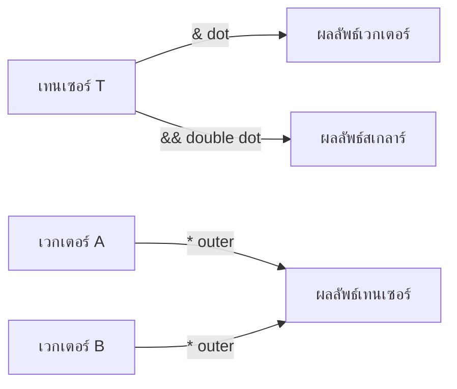

# การดำเนินการเทนเซอร์ (Tensor Operations)

![[tensor_workshop_tools.png]]
> **Academic Vision:** A specialized workbench for tensors. Tools like "The Trace Squeezer" (tr), "The Determinant Scale" (det), and "The Inverter" (inv) are laid out. A tensor is being processed to extract its "Deviatoric" part. Clean, high-tech industrial style.

## ภาพรวมการดำเนินการ Tensor

การดำเนินการ Tensor ของ OpenFOAM เป็นรากฐานของการคำนวณ CFD ทำให้สามารถจัดการทางคณิตศาสตร์กับ **เทนเซอร์อันดับสอง** ได้อย่างมีประสิทธิภาพซึ่งใช้ในการขนส่งโมเมนตั้ม การวิเคราะห์ความเครียด และการแปลงฟิลด์

คลาส tensor ใช้ประโยชน์จาก **เทมเพลตนิพจน์** และ **เทมเพลตเมตาโปรแกรมมิ่ง** เพื่อให้ได้ประสิทธิภาพสูงในขณะเดียวกันก็รักษาความชัดเจนทางคณิตศาสตร์


> **Figure 1:** แผนภาพแสดงการทำงานของตัวดำเนินการเทนเซอร์ เช่น ผลคูณจุด (dot) ผลคูณจุดคู่ (double dot) และผลคูณภายนอก (outer product) ซึ่งใช้ในการเชื่อมโยงและแปลงข้อมูลระหว่างเวกเตอร์และเทนเซอร์ความปลอดภัยทางฟิสิกส์ไม่ส่งผลกระทบต่อความเร็วในการจำลอง ผ่านการใช้พลังของ C++ Template Metaprogramming ในการตรวจสอบความสอดคล้องทางมิติทั้งหมดที่ขั้นตอนการคอมไพล์โปรแกรมเพียงครั้งเดียว

---

## 1. การคำนวณพื้นฐาน

การดำเนินการทางคณิตศาสตร์พื้นฐานบน tensor ตามหลักการ **component-wise** ซึ่งสะท้อนถึงนิยามทางคณิตศาสตร์ของพีชคณิต tensor

### OpenFOAM Code Implementation

```cpp
tensor A(1,2,3,4,5,6,7,8,9);  // Components: [xx, xy, xz, yx, yy, yz, zx, zy, zz]
tensor B(9,8,7,6,5,4,3,2,1);

// Component-wise addition: C_ij = A_ij + B_ij
tensor C = A + B;   // Results in tensor(10,10,10,10,10,10,10,10,10)

// Component-wise subtraction: D_ij = A_ij - B_ij
tensor D = A - B;   // Results in tensor(-8,-6,-4,-2,0,2,4,6,8)

// Scalar multiplication: E_ij = α·A_ij
tensor E = 2.5 * A; // Results in tensor(2.5,5,7.5,10,12.5,15,17.5,20,22.5)
```

> [!TIP] กลไกการทำงาน
> การดำเนินการเหล่านี้ถูก implement โดยใช้ **เทมเพลตนิพจน์** ที่สร้าง lazy evaluation trees
> - `operator+` และ `operator-` ถูก overload เพื่อคืนค่า **proxy objects**
> - การประเมินจริงเกิดขึ้นเมื่อกำหนดให้กับวัตถุ tensor ที่เป็นรูปธรรม
> - คอมไพเลอร์สามารถทำการ optimize เช่น **loop fusion** และ **vectorization**

---

## 2. ผลคูณภายในและภายนอก

ผลคูณภายในในการคำนวณแคลคูลัส tensor ให้ระดับที่แตกต่างกันของ **การหดตัวของดัชนี** แต่ละอันมีการตีความทางกายภาพที่แตกต่างกันและรูปแบบการคำนวณ

| ตัวดำเนินการ | ชื่อการดำเนินการ | ความหมายทางคณิตศาสตร์ | ผลลัพธ์ |
|:---:|:---|:---|:---:|
| **`&`** | Inner Product (Single Contraction) | $\mathbf{T} \cdot \mathbf{v}$ หรือ $\mathbf{A} \cdot \mathbf{B}$ | **Vector** หรือ **Tensor** |
| **`&&`** | Double Inner Product | $\mathbf{A} : \mathbf{B} = \text{tr}(\mathbf{A} \cdot \mathbf{B}^T)$ | **Scalar** |
| **`*`** | Outer Product | $\mathbf{u} \otimes \mathbf{v}$ | **Tensor** |

### 2.1 การหดตัวเดียว (`&`) - Single Contraction

ตัวดำเนินการหดตัวเดียวดำเนินการ **tensor-vector** หรือ **tensor-tensor multiplication** โดยลดอันดับลงหนึ่ง:

$$\mathbf{y} = \mathbf{T} \cdot \mathbf{v} \quad \text{where} \quad y_i = \sum_{j=1}^{3} T_{ij} v_j$$

**การนิยามตัวแปร:**
- $\mathbf{y}$ = เวกเตอร์ผลลัพธ์
- $\mathbf{T}$ = เทนเซอร์อินพุต
- $\mathbf{v}$ = เวกเตอร์อินพุต
- $y_i$ = องค์ประกอบที่ $i$ ของเวกเตอร์ผลลัพธ์
- $T_{ij}$ = องค์ประกอบที่ $i,j$ ของเทนเซอร์
- $v_j$ = องค์ประกอบที่ $j$ ของเวกเตอร์

#### OpenFOAM Code Implementation

```cpp
vector v(1, 0, 0);
vector w = A & v;  // Matrix-vector multiplication
// Results: w_x = A_xx·1 + A_xy·0 + A_xz·0 = 1
//          w_y = A_yx·1 + A_yy·0 + A_yz·0 = 4
//          w_z = A_zx·1 + A_zy·0 + A_zz·0 = 7
```

สำหรับ **tensor-tensor multiplication** ผลลัพธ์คือ tensor อีกตัว:

$$\mathbf{C} = \mathbf{A} \cdot \mathbf{B} \quad \text{where} \quad C_{ij} = \sum_{k=1}^{3} A_{ik} B_{kj}$$

**การนิยามตัวแปร:**
- $\mathbf{C}$ = เทนเซอร์ผลลัพธ์
- $\mathbf{A}$, $\mathbf{B}$ = เทนเซอร์อินพุต
- $C_{ij}$ = องค์ประกอบที่ $i,j$ ของเทนเซอร์ผลลัพธ์
- $A_{ik}$, $B_{kj}$ = องค์ประกอบของเทนเซอร์อินพุต

### 2.2 การหดตัวสองครั้ง (`&&`) - Double Contraction

การหดตัวสองครั้ง (**scalar product**) คำนวณผลคูณภายในของ **Frobenius** ซึ่งให้ค่าสเกลาร์:

$$\mathbf{A} : \mathbf{B} = \sum_{i,j=1}^{3} A_{ij} B_{ij} = \text{tr}(\mathbf{A} \cdot \mathbf{B}^T)$$

#### OpenFOAM Code Implementation

```cpp
scalar s = A && B;  // Double inner product
// For A=[1,2,3,4,5,6,7,8,9], B=[9,8,7,6,5,4,3,2,1]:
// s = 1·9 + 2·8 + 3·7 + 4·6 + 5·5 + 6·4 + 7·3 + 8·2 + 9·1 = 165
```

> [!INFO] ความสำคัญใน CFD
> - คำนวณ **work rates**
> - คำนวณ **stress-strain products**
> - คำนวณ **energy dissipation terms**

### 2.3 ผลคูณภายนอก (`*`) - Outer Product

ผลคูณภายนอกระหว่างเวกเตอร์สองตัวสร้าง tensor อันดับสองผ่าน **dyadic multiplication**:

$$\mathbf{T} = \mathbf{u} \otimes \mathbf{v} \quad \text{where} \quad T_{ij} = u_i v_j$$

**การนิยามตัวแปร:**
- $\mathbf{T}$ = เทนเซอร์ผลลัพธ์
- $\mathbf{u}$, $\mathbf{v}$ = เวกเตอร์อินพุต
- $T_{ij}$ = องค์ประกอบที่ $i,j$ ของเทนเซอร์ผลลัพธ์
- $u_i$, $v_j$ = องค์ประกอบของเวกเตอร์

#### OpenFOAM Code Implementation

```cpp
vector u(1, 2, 3);
vector v(4, 5, 6);
tensor T = u * v;  // Outer product
// Results: tensor(4,5,6,8,10,12,12,15,18)
```

> [!TIP] การประยุกต์ใช้ใน CFD
> - สร้าง **Reynolds stress tensors** จากองค์ประกอบความเร็วที่ไม่สม่ำเสมอ
> - คำนวณ **momentum flux**

---

## 3. ฟังก์ชันวิเคราะห์เทนเซอร์

**Tensor invariants** ให้มาตรการวัดคุณสมบัติของ tensor ที่ **ไม่ขึ้นกับระบบพิกัด** ซึ่งจำเป็นสำหรับการตีความทางกายภาพและเสถียรภาพทางตัวเลข

### 3.1 ฟังก์ชันพื้นฐาน

| ฟังก์ชัน | สูตร | คำอธิบาย |
|:---:|:---|:---|
| **`tr(T)`** | $T_{xx} + T_{yy} + T_{zz}$ | Trace: ผลรวมของแนวทแยงมุม |
| **`det(T)`** | $\det(\mathbf{T})$ | Determinant: ค่าดีเทอร์มิแนนต์ของเมทริกซ์ |
| **`inv(T)`** | $\mathbf{T}^{-1}$ | Inverse: การหาเมทริกซ์ผกผัน (ใช้วิธี Adjugate) |
| **`T.T()`** | $T^T_{ij} = T_{ji}$ | Transpose: การสลับแถวและหลัก |

### OpenFOAM Code Implementation

```cpp
tensor A(1,2,3,4,5,6,7,8,9);

// Transpose: A^T_ij = A_ji
tensor AT = A.T();          // Results: tensor(1,4,7,2,5,8,3,6,9)

// Trace: tr(A) = Σ_i A_ii (sum of diagonal elements)
scalar trA = tr(A);         // Results: 1 + 5 + 9 = 15

// Determinant: det(A) = |A|
scalar detA = det(A);       // For this specific tensor: 0

// Inverse: A⁻¹ where A·A⁻¹ = I (identity tensor)
tensor invA = inv(A);       // Only if invertible (det(A) ≠ 0)
```

### 3.2 รายละเอียดการ Implementation ทางคณิตศาสตร์

**การคำนวณ determinant** ใช้สูตร 3×3 determinant มาตรฐาน:

$$\det(\mathbf{A}) = a_{11}(a_{22}a_{33} - a_{23}a_{32}) - a_{12}(a_{21}a_{33} - a_{23}a_{31}) + a_{13}(a_{21}a_{32} - a_{22}a_{31})$$

**ตัวผกผันของ tensor** ใช้วิธี **adjugate**:

$$\mathbf{A}^{-1} = \frac{1}{\det(\mathbf{A})} \text{adj}(\mathbf{A})$$

โดยที่เมทริกซ์ adjugate คือการสลับที่ของเมทริกซ์ cofactor

---

## 4. การดำเนินการเฉพาะใน CFD

ในการคำนวณความหนืด (Viscosity) และความดัน เรามักใช้ฟังก์ชันเฉพาะทาง:

### 4.1 `dev(T)` (Deviatoric Part)

ดึงเอาส่วนที่เป็นแรงเฉือน (Shear) ออกมาโดยตัดส่วนที่เป็นความดันไอโซโทรปิกทิ้ง:

$$\text{dev}(\mathbf{T}) = \mathbf{T} - \frac{1}{3}\text{tr}(\mathbf{T})\mathbf{I}$$

```cpp
symmTensor S = dev(T);  // Deviatoric part
```

### 4.2 `symm(T)` และ `skew(T)`

แยกเทนเซอร์ออกเป็นส่วนที่สมมาตรและแอนตี้สมมาตร:

**Symmetric:** $$\mathbf{S} = \frac{1}{2}(\mathbf{T} + \mathbf{T}^T)$$

**Skew-symmetric:** $$\mathbf{A} = \frac{1}{2}(\mathbf{T} - \mathbf{T}^T)$$

```cpp
symmTensor S = symm(T);  // Symmetric part
tensor A = skew(T);      // Antisymmetric part
```

### 4.3 การประยุกต์ใช้งานจริง

```cpp
// ตัวอย่างการหาเทนเซอร์อัตราการบิดเบี้ยว (Strain Rate Tensor)
volTensorField gradU = fvc::grad(U);
volSymmTensorField S = symm(gradU);

// คำนวณความเค้นจากความหนืด (Viscous Stress)
volSymmTensorField tau = 2.0 * mu * dev(S);
```

> [!WARNING] ข้อผิดพลาดที่พบบ่อย
> การสับสนระหว่าง single และ double contraction:
> ```cpp
> // ❌ ผิดพลาด
> vector v = A && B;  // Error: double contraction yields scalar, not vector
>
> // ✅ ถูกต้อง
> scalar s = A && B;      // Double contraction → scalar
> vector w = A & v;       // Single contraction → vector
> tensor T = A & B;       // Single contraction → tensor
> ```

---

## 5. การสลายตัวของค่าลักษณะเฉพาะ (Eigenvalue Decomposition)

การสลายตัวของค่าลักษณะเฉพาะเป็นเครื่องมือที่ทรงพลังสำหรับการวิเคราะห์เทนเซอร์ โดยเฉพาะอย่างยิ่งในการวิเคราะห์ความเค้น

### 5.1 หลักการพื้นฐาน

สำหรับเทนเซอร์สมมาตร $\mathbf{S}$ จะมีค่าลักษณะเฉพาะจริงสามค่าคือ $\lambda_k$ และเวกเตอร์ลักษณะเฉพาะตั้งฉาก $\mathbf{v}_k$ โดยที่:

$$\mathbf{S} \cdot \mathbf{v}_k = \lambda_k \mathbf{v}_k, \quad k=1,2,3$$

**ความหมายทางฟิสิกส์:**
- $\lambda_k$: แทนค่าความเครียดหลัก (principal stresses)
- $\mathbf{v}_k$: ทิศทางความเครียดหลัก (principal directions)

### OpenFOAM Code Implementation

```cpp
symmTensor stress(100, 50, 30, 80, 40, 60);

// คำนวณค่าลักษณะเฉพาะ
vector eigenvalues = ::eigenValues(stress);
scalar lambda1 = eigenvalues.x();  // ความเครียดหลักสูงสุด
scalar lambda2 = eigenvalues.y();  // ความเครียดหลักปานกลาง
scalar lambda3 = eigenvalues.z();  // ความเครียดหลักต่ำสุด

// คำนวณเวกเตอร์ลักษณะเฉพาะ
tensor eigenvectors = ::eigenVectors(stress);
vector e1 = eigenvectors.col(0);  // ทิศทางของ lambda1
vector e2 = eigenvectors.col(1);  // ทิศทางของ lambda2
vector e3 = eigenvectors.col(2);  // ทิศทางของ lambda3
```

### 5.2 การประยุกต์ใช้ Von Mises Stress

```cpp
// คำนวณความเครียด Von Mises
symmTensor S = dev(stress);  // Deviatoric stress
scalar sigma_vm = sqrt(1.5) * mag(S);

// ตรวจสอบเกณฑ์การล้มเหลว
scalar yieldStress = 250e6;  // Pa
if (sigma_vm > yieldStress) {
    Info << "Material yielding detected!" << endl;
}
```

$$\sigma_{vm} = \sqrt{\frac{3}{2}\mathbf{S}:\mathbf{S}}$$

โดยที่ $\mathbf{S} = \boldsymbol{\sigma} - \frac{1}{3}\text{tr}(\boldsymbol{\sigma})\mathbf{I}$ คือเทนเซอร์ความเครียดเบี่ยงเบน

---

## 6. การดำเนินการแคลคูลัสเทนเซอร์

Tensor calculus operations ขยาย vector calculus ไปยัง second-order tensor fields

### 6.1 การไล่ระดับของเทนเซอร์

**สมการ:** $(\nabla \mathbf{T})_{ijk} = \frac{\partial T_{ij}}{\partial x_k}$

```cpp
volTensorField T(mesh);
volTensorTensorField gradT = fvc::grad(T);
```

**ความหมายทางฟิสิกส์:**
- แสดงถึงการเปลี่ยนแปลงเชิงพื้นที่ของ tensor field
- สร้าง third-order tensor (27 components)
- ใช้ในการวิเคราะห์ stress gradients และ material anisotropy

### 6.2 การไดเวอร์เจนซ์ของเทนเซอร์

**สมการ:** $(\nabla \cdot \mathbf{T})_i = \frac{\partial T_{ij}}{\partial x_j}$

```cpp
volTensorField T(mesh);
volVectorField divT = fvc::div(T);
```

**Physical Interpretations in Continuum Mechanics:**

#### Stress Tensor Divergence ($\nabla \cdot \boldsymbol{\sigma}$)
```cpp
// Body force per unit volume from stress
volVectorField forceDensity = fvc::div(stressTensor);
```
- **ความหมาย:** แรงสุทธิที่กระทำต่อ control volume เนื่องจาก stress gradients
- **หน่วย:** N/m³ (force per unit volume)

#### Velocity Gradient Tensor
```cpp
volVectorField U(mesh);
volTensorField gradU = fvc::grad(U);

// Decompose into symmetric and antisymmetric parts
volSymmTensorField S = symm(gradU);       // Strain rate tensor
volTensorField Omega = skew(gradU);       // Vorticity tensor
```

**สมการแยกส่วน:**
- **Strain Rate:** $\mathbf{S} = \frac{1}{2}(\nabla \mathbf{U} + (\nabla \mathbf{U})^T)$
- **Vorticity Tensor:** $\boldsymbol{\Omega} = \frac{1}{2}(\nabla \mathbf{U} - (\nabla \mathbf{U})^T)$

---

## 7. การปรับปรุงประสิทธิภาพ

การดำเนินการ tensor ของ OpenFOAM ใช้การปรับปรุงประสิทธิภาพหลายอย่าง:

| เทคนิค | คำอธิบาย | ประโยชน์ |
|:---|:---|:---|
| **Expression Templates** | Lazy evaluation กำจัดวัตถุชั่วคราว | คอมไพเลอร์ optimize |
| **Loop Unrolling** | Template metaprogramming ปลดล็อคการดำเนินการ tensor ขนาดคงที่ | ประสิทธิภาพการทำงานสูง |
| **SIMD Vectorization** | Compiler intrinsics ใช้คำสั่งเวกเตอร์ของโปรเซสเซอร์ | การประมวลผลขนาน |
| **Memory Layout** | การจัดเก็บหน่วยความจำที่ติดกัน | การใช้ cache มีประสิทธิภาพ |
| **Compile-time Constants** | การปรับปรุงประสิทธิภาพเฉพาะมิติฝังอยู่ในพารามิเตอร์เทมเพลต | Optimization ขณะคอมไพล์ |

### ผลกระทบด้านประสิทธิภาพ

1. **แบนด์วิดท์หน่วยความจำ**: เทนเซอร์สมมาตรลดการจราจรหน่วยความจำลง 33%
2. **การใช้งานแคช**: รูปแบบหน่วยความจำที่เล็กลงช่วยปรับปรุงอัตราการ hit ของแคช
3. **การเวกเตอร์ไลเซชัน**: โครงสร้างหน่วยความจำแบบสม่ำเสมอช่วยให้สามารถปรับปรุง SIMD

> [!SUCCESS] ผลลัพธ์
> การปรับปรุงเหล่านี้ทำให้การดำเนินการ tensor มีประสิทธิภาพสูงมากสำหรับ **การจำลอง CFD ขนาดใหญ่** ที่มีการคำนวณ tensor หลายล้านครั้งต่อ time step

---

## สรุป

โอเปอเรเตอร์เทนเซอร์ช่วยให้เราเขียนสมการที่ซับซ้อน (เช่น สมการ Navier-Stokes แบบเต็มรูปแบบ) ได้อย่างแม่นยำและสั้นกระชับ ผ่าน:

1. **การดำเนินการพื้นฐาน** - การบวก ลบ และการคูณสเกลาร์
2. **ผลคูณภายใน/นอก** - Single contraction, double contraction, outer product
3. **ฟังก์ชันวิเคราะห์** - Trace, determinant, inverse, transpose
4. **ฟังก์ชันเฉพาะ CFD** - Deviatoric, symmetric, skew-symmetric parts
5. **การสลายตัวของค่าลักษณะเฉพาะ** - การวิเคราะห์ความเค้นหลัก
6. **การดำเนินการแคลคูลัส** - Gradient, divergence ของฟิลด์เทนเซอร์

การเชี่ยวชาญเหล่านี้เปิดเส้นทางสำหรับการใช้งานแบบจำลองฟิสิกส์ขั้นสูงที่จับธรรมชาติหลายมิติของการไหลของของไหลและพฤติกรรมวัสดุได้อย่างแม่นยำ
