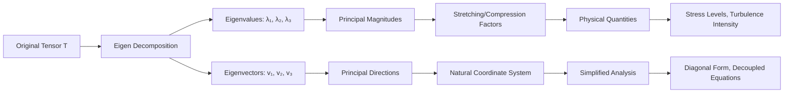
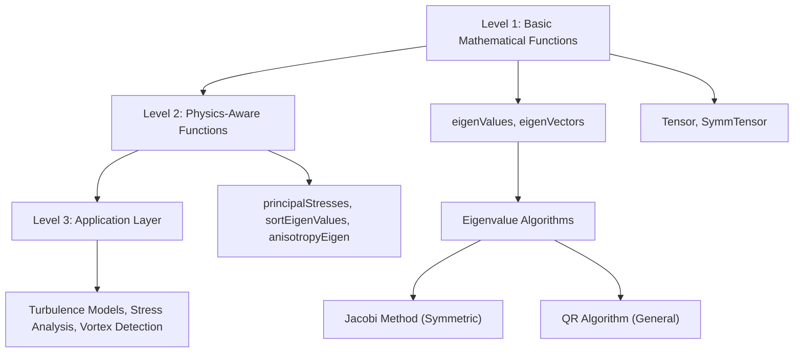
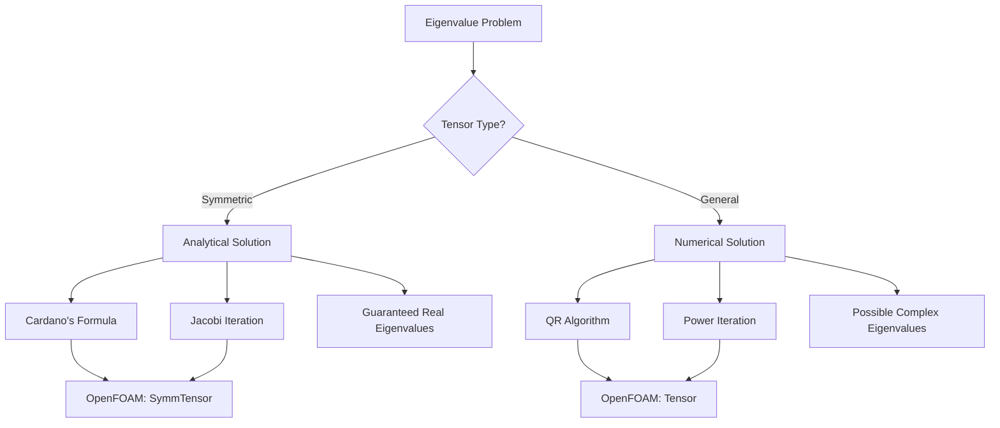
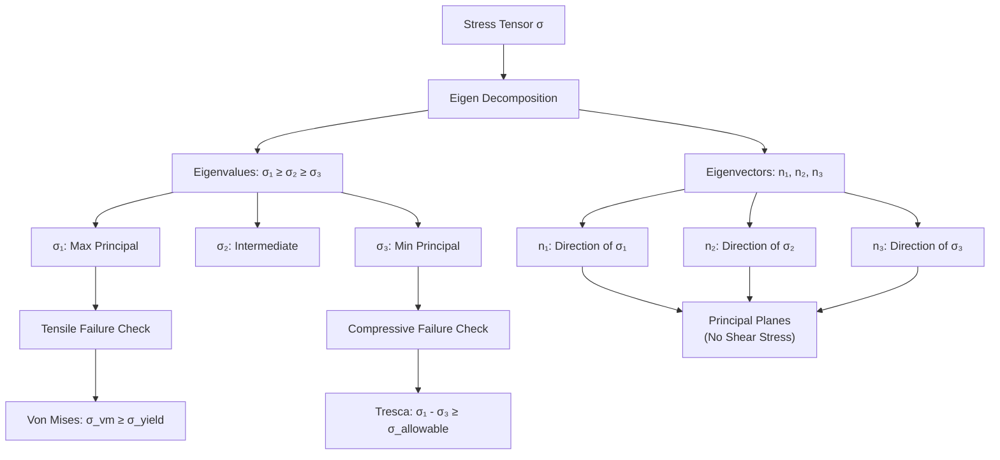
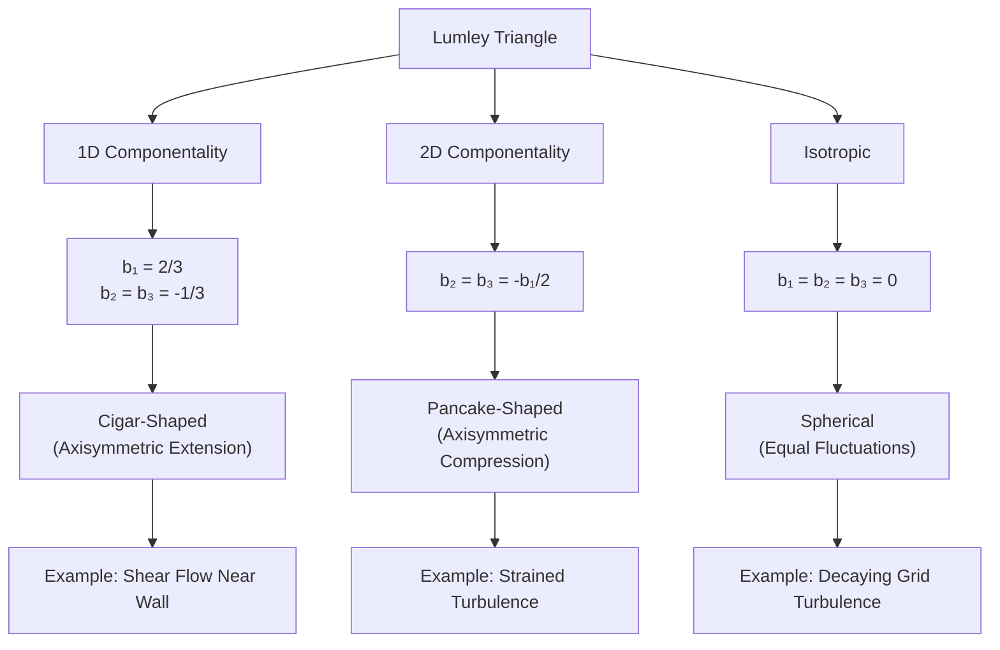
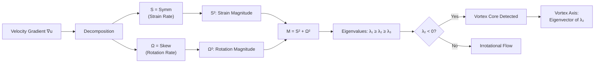

# Eigen Decomposition

---

## Learning Objectives

### What You Will Learn
- **Mathematical Foundation**: Master eigenvalue problems and their geometric/physical interpretation in tensor analysis
- **OpenFOAM Implementation**: Learn eigenvalue/eigenvector functions for tensors and symmetric tensors with practical code patterns
- **Physical Applications**: Apply eigen decomposition to principal stresses, turbulence anisotropy analysis, vortex identification, and coordinate transformations
- **Practical Skills**: Implement eigen analysis in real CFD applications with proper error handling and validation

---

## Overview

### **What** is Eigen Decomposition?

Eigen decomposition is a fundamental matrix/tensor operation that reveals the **intrinsic structure** of linear transformations:

- **Eigenvalues (λ)**: Principal magnitudes representing how much a tensor stretches/compresses along principal directions
- **Eigenvectors (v)**: Principal directions (axes) along which the tensor acts as simple scaling
- **Physical Meaning**: Represents the **natural coordinate system** where tensor operations become diagonal, simplifying analysis

For a tensor **T**, the eigenvalue problem is:

$$\mathbf{T} \cdot \mathbf{v} = \lambda \mathbf{v}$$

Where:
- **T** = second-order tensor (stress, strain, Reynolds stress, velocity gradient, etc.)
- **λ** = eigenvalue (scalar magnitude, can be positive/negative/complex)
- **v** = eigenvector (principal direction, unit vector)

**Geometric Interpretation**:



### **Why** is it Critical in CFD?

Eigen decomposition is **indispensable** in computational fluid dynamics for:

#### 1. **Principal Stress Analysis** (Solid Mechanics & FSI)
- **Purpose**: Find maximum/minimum stress directions for failure prediction
- **Application**: Critical for material design, fatigue analysis, structural integrity
- **OpenFOAM Use**: Stress tensor post-processing, failure criteria (Von Mises, Tresca)

```cpp
// Maximum principal stress → tensile failure
scalar sigmaMax = max(eigenValues(stressTensor));

// Minimum principal stress → compressive failure
scalar sigmaMin = min(eigenValues(stressTensor));
```

#### 2. **Turbulence Modeling** (RANS & LES)
- **Anisotropy Analysis**: Quantify turbulence isotropy vs anisotropy
- **Reynolds Stress Decomposition**: `b = R/(2k) - I/3` (anisotropy tensor)
- **Advanced Models**: Used in second-moment closure, algebraic stress models
- **Lumley Triangle**: Map turbulence states (isotropic, 2D, 1D componentality)

```cpp
// Eigenvalues of anisotropy tensor characterize turbulence state
vector bEigen = eigenValues(anisotropyTensor);
// Isotropic: b₁ = b₂ = b₃ = 0
// 1D: b₁ = 2/3, b₂ = b₃ = -1/3
// 2D: b₁ ≠ 0, b₂ = b₃ = -b₁/2
```

#### 3. **Vortex Identification** (Coherent Structures)
- **Q-Criterion**: Q = ½(|Ω|² - |S|²) where S = strain, Ω = rotation
- **λ₂-Criterion**: Second eigenvalue of S² + Ω²
- **Physical Meaning**: Vortex cores where pressure minimum exists in rotating frame
- **OpenFOAM Use**: Post-processing function objects for vortex visualization

#### 4. **Coordinate System Transformations**
- **Principal Axes**: Transform to coordinate system where tensor is diagonal
- **Mesh Quality**: Aspect ratio, skewness from eigenvalue ratios
- **Numerical Stability**: Diagonalization simplifies complex tensor operations

```cpp
// Diagonalization: T = V Λ V⁻¹
tensor V = eigenVectors(T);        // Rotation to principal axes
vector lambda = eigenValues(T);    // Diagonal entries
```

#### 5. **Numerical Algorithms**
- **Matrix Functions**: exp(T), log(T), √T via eigenvalue decomposition
- **Time Integration**: Exponential integrators, matrix exponentials
- **Stability Analysis**: Eigenvalue spectra determine numerical stability

### **How** OpenFOAM Implements It

OpenFOAM provides a **three-level hierarchy** for eigenvalue operations:



**Implementation Hierarchy**:

1. **Level 1 - Basic Functions** (`src/OpenFOAM/matrices/MathFunctions/`)
   - `eigenValues(tensor)`: Returns vector (λ₁, λ₂, λ₃)
   - `eigenVectors(tensor)`: Returns tensor with eigenvectors as columns
   - Optimized for symmetric tensors (analytical solution)

2. **Level 2 - Physics Functions** (Application code)
   - `principalStresses()`: Alias for eigenvalues of stress tensor
   - Anisotropy calculations in turbulence models
   - Sorting by magnitude or physical significance

3. **Level 3 - Application Usage** (Solver code)
   - Failure criteria in solid mechanics solvers
   - Reynolds stress anisotropy in RANS models
   - Vortex core detection in post-processing

---

## Mathematical Foundation

### 1. Eigenvalue Problem Formulation

#### Standard Eigenvalue Problem

$$\mathbf{T} \cdot \mathbf{v} = \lambda \mathbf{v}$$

Rearranged:

$$(\mathbf{T} - \lambda \mathbf{I}) \cdot \mathbf{v} = \mathbf{0}$$

For non-trivial solutions (v ≠ 0):

$$\det(\mathbf{T} - \lambda \mathbf{I}) = 0$$

#### Characteristic Equation for 3×3 Tensor

$$
\begin{vmatrix}
T_{xx} - \lambda & T_{xy} & T_{xz} \\
T_{yx} & T_{yy} - \lambda & T_{yz} \\
T_{zx} & T_{zy} & T_{zz} - \lambda
\end{vmatrix}
= 0
$$

Expanding to **cubic characteristic equation**:

$$\lambda^3 - I_1 \lambda^2 + I_2 \lambda - I_3 = 0$$

Where **tensor invariants** are:

| Invariant | Formula | Physical Meaning |
|-----------|---------|------------------|
| **I₁** (first) | `tr(T) = T_xx + T_yy + T_zz` | Trace (sum of diagonal) |
| **I₂** (second) | `½[(tr T)² - tr(T²)]` | Deviatoric magnitude |
| **I₃** (third) | `det(T)` | Determinant (volume scaling) |

**Key Properties**:
- Invariants are **coordinate-independent** (same in any rotated frame)
- Invariants fully characterize tensor's physical nature
- Eigenvalues are **roots** of characteristic equation

#### Solution Methods



### 2. Symmetric vs Non-Symmetric Tensors

| Property | Symmetric Tensor | Non-Symmetric Tensor |
|----------|------------------|----------------------|
| **Definition** | `T = Tᵀ` | `T ≠ Tᵀ` |
| **Eigenvalues** | Always **real** | Can be **complex** |
| **Eigenvectors** | **Orthogonal** (mutually perpendicular) | Generally non-orthogonal |
| **Diagonalization** | `T = V Λ Vᵀ` (orthogonal) | `T = V Λ V⁻¹` (general) |
| **Examples** | Stress, strain, Reynolds stress, strain rate | Velocity gradient, vorticity |

**Physical Implications**:

```cpp
// Symmetric: Guaranteed real eigenvalues
symmTensor stress(10e6, 5e6, 3e6, 8e6, 2e6, 6e6);
vector lambdaStress = eigenValues(stress);  // Always real

// Non-symmetric: Possible complex eigenvalues
tensor gradU(0.1, 2.0, 0.5, -1.0, 0.1, 0.3, 0.2, -0.5, 0.1);
vector lambdaGradU = eigenValues(gradU);  // May be complex
```

### 3. Physical Interpretation of Eigenvalues

#### Stress Tensor (Principal Stresses)

$$\boldsymbol{\sigma} = 
\begin{bmatrix}
\sigma_{xx} & \tau_{xy} & \tau_{xz} \\
\tau_{yx} & \sigma_{yy} & \tau_{yz} \\
\tau_{zx} & \tau_{zy} & \sigma_{zz}
\end{bmatrix}
$$

- **λ₁ (largest)**: Maximum principal stress → tensile failure
- **λ₂ (middle)**: Intermediate principal stress
- **λ₃ (smallest)**: Minimum principal stress → compressive failure
- **Eigenvectors**: Principal stress directions (no shear stress on principal planes)

#### Turbulence Anisotropy Tensor

$$\mathbf{b} = \frac{\mathbf{R}}{2k} - \frac{\mathbf{I}}{3}$$

- **Traceless**: `b₁ + b₂ + b₃ = 0` (constraint)
- **Bounds**: `-1/3 ≤ bᵢ ≤ 2/3` (theoretical limits)
- **Isotropic**: `b₁ = b₂ = b₃ = 0`
- **1D Componental**: `b₁ = 2/3, b₂ = b₃ = -1/3`
- **2D Componental**: `b₁ > 0, b₂ = b₃ = -b₁/2`

#### Strain Rate Tensor

$$\mathbf{S} = \frac{1}{2}(\nabla \mathbf{u} + \nabla \mathbf{u}^T)$$

- **λ₁, λ₂, λ₃**: Principal strain rates
- **Positive eigenvalues**: Extension (stretching)
- **Negative eigenvalues**: Compression
- **Sum**: `tr(S) = ∇·u` (volumetric strain rate, zero for incompressible flow)

---

## OpenFOAM Implementation

### 1. Basic Eigenvalue Functions

#### Eigenvalues

```cpp
// Location: src/OpenFOAM/matrices/MathFunctions/MathFunctions.C

// General tensor (uses QR algorithm)
template<class Cmpt>
vector eigenValues(const Tensor<Cmpt>& t)
{
    // Returns vector(λ₁, λ₂, λ₃)
    // Sorted: λ₁ ≥ λ₂ ≥ λ₃ (descending order)
    // May be complex for non-symmetric tensors
}

// Specialized for symmetric tensors (analytical solution)
template<>
vector eigenValues(const symmTensor& st)
{
    // Uses Jacobi iteration or analytical formula
    // Guaranteed real eigenvalues
    // More efficient than general case
}
```

**From Math to Code**:

```cpp
// Mathematical: Solve det(T - λI) = 0
// OpenFOAM: vector lambda = eigenValues(T);

symmTensor T
(
    10, 5, 3,    // Txx, Txy, Txz
    8,  2,       // Tyy, Tyz
    6            // Tzz
);

// Compute eigenvalues
vector lambda = eigenValues(T);

// Access individual eigenvalues
scalar lambda1 = lambda.x();  // Largest (≈ 18.5)
scalar lambda2 = lambda.y();  // Middle (≈ 4.2)
scalar lambda3 = lambda.z();  // Smallest (≈ -4.7)

// Verify: λ₁ + λ₂ + λ₃ = tr(T)
scalar traceCheck = lambda.x() + lambda.y() + lambda.z();
scalar traceT = tr(T);  // Should be equal (within tolerance)
```

#### Eigenvectors

```cpp
// Returns tensor with eigenvectors as columns
template<class Cmpt>
Tensor<Cmpt> eigenVectors(const Tensor<Cmpt>& t)
{
    // Column 0: eigenvector for λ₁ (largest eigenvalue)
    // Column 1: eigenvector for λ₂ (middle eigenvalue)
    // Column 2: eigenvector for λ₃ (smallest eigenvalue)
    // For symmetric tensors: columns are orthogonal unit vectors
}
```

**From Math to Code**:

```cpp
// Mathematical: Solve (T - λᵢI)vᵢ = 0 for each λᵢ
// OpenFOAM: tensor V = eigenVectors(T);

symmTensor stress(...);
tensor V = eigenVectors(stress);

// Extract eigenvectors (principal directions)
vector v1 = V.x();  // Direction of λ₁ (max principal stress)
vector v2 = V.y();  // Direction of λ₂ (intermediate)
vector v3 = V.z();  // Direction of λ₃ (min principal stress)

// Verify orthogonality (for symmetric tensors)
scalar dot12 = v1 & v2;  // Should be ≈ 0
scalar dot13 = v1 & v3;  // Should be ≈ 0
scalar dot23 = v2 & v3;  // Should be ≈ 0

// Verify normalization (unit vectors)
scalar mag1 = mag(v1);   // Should be ≈ 1
scalar mag2 = mag(v2);   // Should be ≈ 1
scalar mag3 = mag(v3);   // Should be ≈ 1

// V is rotation matrix: det(V) ≈ 1 for proper rotation
scalar detV = det(V);
```

### 2. Practical Usage Examples

#### Example 1: Principal Stress Analysis

```cpp
// File: postProcess/principalStress.C

// Read stress tensor field
volSymmTensorField sigma
(
    IOobject
    (
        "sigma",
        runTime.timeName(),
        mesh,
        IOobject::MUST_READ
    ),
    mesh
);

// Step 1: Compute principal stresses at all cells
volVectorField sigmaPrincipal
(
    IOobject
    (
        "sigmaPrincipal",
        runTime.timeName(),
        mesh,
        IOobject::NO_READ
    ),
    mesh,
    dimensionedVector("zero", dimPressure, vector::zero)
);

// For each cell (OpenFOAM handles field operations automatically)
sigmaPrincipal = eigenValues(sigma);

// Step 2: Extract maximum principal stress (for tensile failure)
volScalarField sigmaMax
(
    "sigmaMax",
    sigmaPrincipal.component(0)  // σ₁ (largest)
);

// Step 3: Extract minimum principal stress (for compressive failure)
volScalarField sigmaMin
(
    "sigmaMin",
    sigmaPrincipal.component(2)  // σ₃ (smallest)
);

// Step 4: Von Mises equivalent stress (failure criterion)
// σ_vm = √[½((σ₁-σ₂)² + (σ₂-σ₃)² + (σ₃-σ₁)²)]
volScalarField sigmaVM
(
    "sigmaVM",
    sqrt(
        0.5 * (
            sqr(sigmaPrincipal.x() - sigmaPrincipal.y()) +
            sqr(sigmaPrincipal.y() - sigmaPrincipal.z()) +
            sqr(sigmaPrincipal.z() - sigmaPrincipal.x())
        )
    )
);

// Step 5: Safety factor analysis
dimensionedScalar yieldStress("yieldStress", dimPressure, 250e6);  // Pa
volScalarField safetyFactor
(
    "safetyFactor",
    yieldStress / (sigmaVM + dimensionedScalar("SMALL", dimPressure, SMALL))
);

// Write results
sigmaPrincipal.write();
sigmaMax.write();
sigmaMin.write();
sigmaVM.write();
safetyFactor.write();
```

#### Example 2: Turbulence Anisotropy Analysis

```cpp
// File: turbulenceModels/anisotropyAnalysis.C

// Read Reynolds stress tensor
volSymmTensorField R
(
    IOobject
    (
        "R",
        runTime.timeName(),
        mesh,
        IOobject::MUST_READ
    ),
    mesh
);

// Step 1: Compute turbulent kinetic energy
// k = ½(u'² + v'² + w'²) = ½ tr(R)
volScalarField k
(
    "k",
    0.5 * tr(R)
);

// Step 2: Compute anisotropy tensor
// b = R/(2k) - I/3
volSymmTensorField b
(
    IOobject
    (
        "b",
        runTime.timeName(),
        mesh,
        IOobject::NO_READ
    ),
    mesh,
    dimensionedSymmTensor("zero", dimless, symmTensor::zero)
);

// Protect against division by zero
dimensionedScalar kSmall("kSmall", k.dimensions(), SMALL);
b = R / (2.0 * max(k, kSmall)) - dimensionedSymmTensor("I", dimless, symmTensor::I) / 3.0;

// Step 3: Compute eigenvalues of anisotropy
volVectorField bEigen
(
    "bEigen",
    eigenValues(b)  // (b₁, b₂, b₃) sorted: b₁ ≥ b₂ ≥ b₃
);

// Step 4: Extract individual eigenvalues
volScalarField b1("b1", bEigen.component(0));  // Max anisotropy
volScalarField b2("b2", bEigen.component(1));  // Middle
volScalarField b3("b3", bEigen.component(2));  // Min anisotropy

// Step 5: Compute anisotropy magnitude
volScalarField anisotropyMagnitude
(
    "anisotropyMagnitude",
    sqrt(b1*b1 + b2*b2 + b3*b3)  // |b|
);

// Step 6: Lumley triangle coordinates
// η = √(b₁ - b₂) / √(b₁ - b₃): 0 ≤ η ≤ 1
// ξ = (b₁ + b₂ - 2b₃) / (2√(b₁² + b₂² + b₃²)): -1 ≤ ξ ≤ 1
volScalarField eta
(
    "eta",
    sqrt(max(b1 - b2, scalar(0))) / sqrt(max(b1 - b3, SMALL))
);

volScalarField xi
(
    "xi",
    (b1 + b2 - 2.0*b3) / (2.0 * sqrt(b1*b1 + b2*b2 + b3*b3 + SMALL))
);

// Step 7: Classify turbulence state
volScalarField isotropyIndex
(
    "isotropyIndex",
    anisotropyMagnitude  // 0 = isotropic, larger = more anisotropic
);

// Threshold for "nearly isotropic"
dimensionedScalar isoTol("isoTol", dimless, 0.1);
volScalarField isIsotropic
(
    "isIsotropic",
    pos(anisotropyMagnitude - isoTol)  // 1 where anisotropic, 0 where isotropic
);

// Write results
bEigen.write();
anisotropyMagnitude.write();
eta.write();
xi.write();
isIsotropic.write();
```

#### Example 3: Vortex Identification (λ₂-Criterion)

```cpp
// File: postProcess/lambda2Criterion.C

// Read velocity gradient tensor
volTensorField gradU
(
    IOobject
    (
        "gradU",
        runTime.timeName(),
        mesh,
        IOobject::MUST_READ
    ),
    mesh
);

// Step 1: Decompose into symmetric and anti-symmetric parts
// S = ½(∇u + ∇uᵀ): Strain rate tensor
volSymmTensorField S
(
    "S",
    symm(gradU)
);

// Ω = ½(∇u - ∇uᵀ): Rotation rate tensor
volTensorField Omega
(
    "Omega",
    skew(gradU)
);

// Step 2: Compute S² + Ω²
volTensorField S2_Omega2
(
    "S2_Omega2",
    sqr(S) + sqr(Omega)
);

// Step 3: Compute eigenvalues of S² + Ω²
volVectorField lambdaEigen
(
    "lambdaEigen",
    eigenValues(S2_Omega2)  // (λ₁, λ₂, λ₃)
);

// Step 4: Extract λ₂ (middle eigenvalue)
volScalarField lambda2
(
    "lambda2",
    lambdaEigen.component(1)  // λ₂
);

// Step 5: Identify vortex cores
// Vortex cores where λ₂ < 0 (pressure minimum in rotating frame)
volScalarField vortexCore
(
    "vortexCore",
    neg(lambda2)  // 1 if λ₂ < 0, 0 otherwise
);

// Step 6: Smooth vortex core detection (remove noise)
volScalarField vortexCoreSmooth
(
    "vortexCoreSmooth",
    pos(-0.01 * max(mag(lambda2)) - lambda2)  // Threshold: λ₂ < -0.01|λ_max|
);

// Step 7: Alternative: Q-criterion
// Q = ½(|Ω|² - |S|²)
volScalarField Q
(
    "Q",
    0.5 * (tr(sqr(Omega)) - tr(sqr(S)))
);

volScalarField vortexQ
(
    "vortexQ",
    pos(Q - dimensionedScalar("Qthresh", Q.dimensions(), 0.01 * max(gMax(Q)))
);

// Write results
lambda2.write();
vortexCore.write();
vortexCoreSmooth.write();
Q.write();
vortexQ.write();
```

### 3. Advanced Diagonalization

```cpp
// Diagonalization: T = V Λ V⁻¹
tensor T(1, 2, 3, 4, 5, 6, 7, 8, 9);
vector lambda = eigenValues(T);
tensor V = eigenVectors(T);

// Construct diagonal matrix Λ (Lambda)
tensor Lambda
(
    lambda.x(), 0,          0,
    0,          lambda.y(), 0,
    0,          0,          lambda.z()
);

// Verify reconstruction: T ≈ V Λ V⁻¹
tensor T_reconstructed = V & Lambda & inv(V);

// For symmetric tensors: V⁻¹ = Vᵀ (orthogonal matrix)
symmTensor S(3, 1, 2, 4, 0, 5);
vector lambdaS = eigenValues(S);
tensor VS = eigenVectors(S);

tensor LambdaS
(
    lambdaS.x(), 0,           0,
    0,           lambdaS.y(), 0,
    0,           0,           lambdaS.z()
);

// Simpler reconstruction for symmetric: T = V Λ Vᵀ
tensor S_reconstructed = VS & LambdaS & VS.T();

// Check error
tensor errorS = S_reconstructed - symmTensor(VS & LambdaS & VS.T());
scalar maxError = max(mag(errorS));  // Should be ≈ 0
```

---

## Physical Interpretation

### 1. Principal Stresses and Failure Analysis

**Concept**: Maximum/minimum normal stresses occur on **principal planes** where shear stress is zero

**Mathematical Foundation**:

$$\boldsymbol{\sigma} = 
\begin{bmatrix}
\sigma_{xx} & \tau_{xy} & \tau_{xz} \\
\tau_{yx} & \sigma_{yy} & \tau_{yz} \\
\tau_{zx} & \tau_{zy} & \sigma_{zz}
\end{bmatrix}
$$

Eigenvalue problem: $\boldsymbol{\sigma} \cdot \mathbf{n} = \sigma \mathbf{n}$

- **σ₁ (largest)**: Maximum principal stress → tensile failure criterion
- **σ₂ (middle)**: Intermediate principal stress
- **σ₃ (smallest)**: Minimum principal stress → compressive failure criterion

**Principal Stress Visualization**:



**From Math to OpenFOAM Code**:

```cpp
// Step 1: Define stress tensor
symmTensor sigma
(
    10e6,  5e6,  3e6,   // Pa: σ_xx, τ_xy, τ_xz
    8e6,   2e6,          // σ_yy, τ_yz
    6e6                   // σ_zz
);

// Step 2: Compute principal stresses
vector sigmaP = eigenValues(sigma);

scalar sigma1 = sigmaP.x();  // ≈ 1.85×10⁷ Pa (max, tensile)
scalar sigma2 = sigmaP.y();  // ≈ 7.2×10⁶ Pa (intermediate)
scalar sigma3 = sigmaP.z();  // ≈ -4.7×10⁶ Pa (min, compressive)

// Step 3: Compute principal directions
tensor P = eigenVectors(sigma);
vector n1 = P.x();  // Direction of σ₁
vector n2 = P.y();  // Direction of σ₂
vector n3 = P.z();  // Direction of σ₃

// Step 4: Failure criteria

// Von Mises equivalent stress
// σ_vm = √[½((σ₁-σ₂)² + (σ₂-σ₃)² + (σ₃-σ₁)²)]
scalar sigmaVM = sqrt(
    0.5 * (
        sqr(sigma1 - sigma2) +
        sqr(sigma2 - sigma3) +
        sqr(sigma3 - sigma1)
    )
);  // ≈ 2.1×10⁷ Pa

// Tresca equivalent stress (max shear)
// σ_tresca = σ₁ - σ₃
scalar sigmaTresca = sigma1 - sigma3;  // ≈ 2.3×10⁷ Pa

// Step 5: Check against yield strength
scalar sigmaYield = 250e6;  // Pa (material property)

scalar safetyFactorVM = sigmaYield / sigmaVM;       // ≈ 11.9
scalar safetyFactorTresca = sigmaYield / sigmaTresca;  // ≈ 10.9

if (sigmaVM > sigmaYield)
{
    Warning << "Yielding predicted by Von Mises criterion" << endl;
}
```

### 2. Turbulence Anisotropy and Lumley Triangle

**Concept**: Anisotropy tensor eigenvalues quantify deviation from isotropic turbulence

**Mathematical Foundation**:

Reynolds stress: $\mathbf{R} = \overline{\mathbf{u}' \mathbf{u}'^T}$

Turbulent kinetic energy: $k = \frac{1}{2} \text{tr}(\mathbf{R})$

Anisotropy tensor: $\mathbf{b} = \frac{\mathbf{R}}{2k} - \frac{\mathbf{I}}{3}$

**Constraints**:
- **Traceless**: $b_1 + b_2 + b_3 = 0$
- **Bounds**: $-\frac{1}{3} \leq b_i \leq \frac{2}{3}$

**Lumley Triangle States**:



**From Math to OpenFOAM Code**:

```cpp
// Step 1: Reynolds stress tensor
symmTensor R
(
    1.5,  0.3,  0.1,   // m²/s²: u'², u'v', u'w'
    1.0,  0.05,         // v'², v'w'
    0.8                  // w'²
);

// Step 2: Turbulent kinetic energy
// k = ½(u'² + v'² + w'²) = ½ tr(R)
scalar k = 0.5 * tr(R);  // = 0.5 × (1.5 + 1.0 + 0.8) = 1.65 m²/s²

// Step 3: Anisotropy tensor
// b = R/(2k) - I/3
symmTensor I(one);  // Identity tensor
symmTensor b = R / (2.0 * k) - I / 3.0;

// Step 4: Eigenvalues (sorted: b₁ ≥ b₂ ≥ b₃)
vector bEigen = eigenValues(b);

scalar b1 = bEigen.x();  // ≈ 0.15 (max anisotropy)
scalar b2 = bEigen.y();  // ≈ -0.02
scalar b3 = bEigen.z();  // ≈ -0.13

// Step 5: Verify constraints
scalar traceB = b1 + b2 + b3;  // Should be ≈ 0
scalar maxB = max(bEigen);     // Should be ≤ 2/3
scalar minB = min(bEigen);     // Should be ≥ -1/3

// Step 6: Lumley triangle coordinates
// η = √(b₁ - b₂) / √(b₁ - b₃): shape parameter
// ξ = (b₁ + b₂ - 2b₃) / (2√(b₁² + b₂² + b₃²)): axisymmetry
scalar eta = sqrt(b1 - b2) / sqrt(b1 - b3 + SMALL);
scalar xi = (b1 + b2 - 2.0*b3) / (2.0 * sqrt(b1*b1 + b2*b2 + b3*b3 + SMALL));

// Step 7: Classify turbulence state
scalar tol = 0.1;
word turbulenceState;

if (max(mag(bEigen)) < tol)
{
    turbulenceState = "Isotropic (1-component)";
}
else if (mag(b2 - b3) < tol && mag(b3 + 1.0/3.0) < tol)
{
    turbulenceState = "1D Componentality";
}
else if (mag(b2 - b3) < tol)
{
    turbulenceState = "2D Componentality";
}
else
{
    turbulenceState = "3D Anisotropic";
}

Info << "Turbulence State: " << turbulenceState << endl
     << "  Anisotropy eigenvalues: " << bEigen << endl
     << "  Lumley coords (η, ξ): (" << eta << ", " << xi << ")" << endl;
```

### 3. Vortex Identification (λ₂-Criterion)

**Concept**: Vortex cores are regions where pressure has a local minimum in a rotating reference frame

**Mathematical Foundation**:

Decompose velocity gradient: $\nabla \mathbf{u} = \mathbf{S} + \mathbf{\Omega}$

- **S** (symmetric): Strain rate tensor, $S = \frac{1}{2}(\nabla \mathbf{u} + \nabla \mathbf{u}^T)$
- **Ω** (anti-symmetric): Rotation rate tensor, $\Omega = \frac{1}{2}(\nabla \mathbf{u} - \nabla \mathbf{u}^T)$

**λ₂-Criterion**: Vortex cores where $\lambda_2(\mathbf{S}^2 + \mathbf{\Omega}^2) < 0$

**Physical Interpretation**:



**From Math to OpenFOAM Code**:

```cpp
// Step 1: Velocity gradient tensor
tensor gradU
(
    0.1,  2.0,  0.5,   // 1/s
   -1.0,  0.1,  0.3,
    0.2, -0.5,  0.1
);

// Step 2: Decompose into strain and rotation
symmTensor S = symm(gradU);   // Strain rate: ½(∇u + ∇uᵀ)
tensor Omega = skew(gradU);    // Rotation rate: ½(∇u - ∇uᵀ)

// Step 3: Compute S² + Ω²
tensor S2_Omega2 = sqr(S) + sqr(Omega);

// Step 4: Compute eigenvalues
vector lambda = eigenValues(S2_Omega2);

scalar lambda1 = lambda.x();  // Largest
scalar lambda2 = lambda.y();  // Middle (λ₂ criterion)
scalar lambda3 = lambda.z();  // Smallest

// Step 5: Vortex core identification
bool isVortexCore = (lambda2 < 0);

// Step 6: Vortex axis direction (eigenvector for λ₂)
tensor V = eigenVectors(S2_Omega2);
vector vortexAxis = V.y();  // Middle column = eigenvector for λ₂

Info << "λ₂ = " << lambda2 << " → " 
     << (isVortexCore ? "Vortex core detected" : "No vortex") << endl;

// For field-based analysis
volTensorField gradU_field(...);
volSymmTensorField S_field = symm(gradU_field);
volTensorField Omega_field = skew(gradU_field);
volTensorField M_field = sqr(S_field) + sqr(Omega_field);
volVectorField lambda_field = eigenValues(M_field);
volScalarField lambda2_field = lambda_field.component(1);

// Threshold for visualization (avoid noise)
scalar threshold = -0.01 * max(mag(lambda_field)).value();
volScalarField vortexIsoSurface
(
    "vortexCore",
    pos(lambda2_field - dimensionedScalar("thresh", dimless, threshold))
);
```

### 4. Mesh Quality Assessment

**Concept**: Eigenvalue ratios reveal cell aspect ratio and orthogonality issues

**From Math to OpenFOAM Code**:

```cpp
// For each cell, compute transformation matrix from cell geometry
tensor cellTransform = ...;  // From cell geometry analysis

// Eigenvalues reveal stretching
vector stretchRatios = eigenValues(cellTransform);

// Aspect ratio = max(λ) / min(λ)
scalar aspectRatio = max(stretchRatios) / min(stretchRatios);

// Quality check
if (aspectRatio > 1000)
{
    Warning << "High aspect ratio cell: " << aspectRatio << endl;
}

// Skewness from eigenvector orthogonality
tensor V = eigenVectors(cellTransform);
scalar orthogonalityError = mag((V.x() & V.y()) - 0.0) +  // v₁ · v₂ should be 0
                         mag((V.y() & V.z()) - 0.0) +  // v₂ · v₃ should be 0
                         mag((V.z() & V.x()) - 0.0);   // v₃ · v₁ should be 0
```

---

## Common Pitfalls

### **Pitfall 1: Assuming Eigenvalue Ordering Convention**

**Problem**: Different libraries sort eigenvalues differently

```cpp
// ❌ WRONG: Assuming OpenFOAM sorts ascending
tensor T(...);
vector lambda = eigenValues(T);
scalar minLambda = lambda.x();  // WRONG! x() is largest, not smallest
```

**Solution**: Understand OpenFOAM's sorting convention

```cpp
// ✅ CORRECT: OpenFOAM sorts descending: x ≥ y ≥ z
vector lambda = eigenValues(T);

scalar lambdaMax = lambda.x();  // Largest eigenvalue (λ₁)
scalar lambdaMid = lambda.y();  // Middle eigenvalue (λ₂)
scalar lambdaMin = lambda.z();  // Smallest eigenvalue (λ₃)

// Alternative: Use min/max functions (safer)
scalar lambdaMax_alt = max(lambda);
scalar lambdaMin_alt = min(lambda);

// If you need ascending order
scalar lambdaAsc[3] = {lambda.z(), lambda.y(), lambda.x()};
```

**OpenFOAM Convention**: `eigenValues()` returns `(λ₁, λ₂, λ₃)` with `λ₁ ≥ λ₂ ≥ λ₃`

---

### **Pitfall 2: Mishandling Complex Eigenvalues**

**Problem**: Non-symmetric tensors can have complex eigenvalues

```cpp
// ❌ WRONG: Expecting real eigenvalues for general tensors
tensor gradU(0.1, 5.0, 0.2, -4.0, 0.1, 0.3, 0.1, -0.2, 0.1);
vector lambda = eigenValues(gradU);

// If eigenvalues are complex, lambda.x() may return garbage
scalar realPart = lambda.x();  // Potentially invalid!
```

**Solution**: Use symmetric tensors or check for complex values

```cpp
// ✅ CORRECT: Use symmetric part for guaranteed real eigenvalues
tensor gradU(...);
symmTensor S = symm(gradU);  // Strain rate (always symmetric)
vector lambdaS = eigenValues(S);  // Guaranteed real

// Or check tensor symmetry before computing eigenvalues
bool isSymmetric = 
    mag(gradU.xy() - gradU.yx()) < SMALL &&
    mag(gradU.xz() - gradU.zx()) < SMALL &&
    mag(gradU.yz() - gradU.zy()) < SMALL;

if (isSymmetric)
{
    vector lambda = eigenValues(gradU);  // Safe to use
}
else
{
    // Option 1: Use symmetric part
    vector lambda = eigenValues(symm(gradU));
    
    // Option 2: Use magnitude (real scalar)
    scalar magLambda = mag(eigenValues(gradU));
    
    WarningInFunction
        << "Non-symmetric tensor detected. "
        << "Using symmetric part." << endl;
}
```

**When to Expect Complex Eigenvalues**:
- Velocity gradient tensors with strong rotation
- Vorticity-dominated regions
- Non-physical tensors (numerical errors)

---

### **Pitfall 3: Confusing Eigenvector Storage Convention**

**Problem**: OpenFOAM stores eigenvectors as **columns**, not rows

```cpp
// ❌ WRONG: Assuming row-major storage
tensor V = eigenVectors(T);
vector v1 = V.row(0);  // WRONG! No row() method, and concept is wrong
```

**Solution**: Understand column-major storage

```cpp
// ✅ CORRECT: Eigenvectors are columns
tensor V = eigenVectors(T);

vector v1 = V.x();  // First COLUMN (eigenvector for λ₁)
vector v2 = V.y();  // Second COLUMN (eigenvector for λ₂)
vector v3 = V.z();  // Third COLUMN (eigenvector for λ₃)

// Verify orthogonality (for symmetric tensors)
scalar dot12 = v1 & v2;  // Should be ≈ 0
scalar dot13 = v1 & v3;  // Should be ≈ 0
scalar dot23 = v2 & v3;  // Should be ≈ 0

// Verify normalization
scalar mag1 = mag(v1);   // Should be ≈ 1
scalar mag2 = mag(v2);   // Should be ≈ 1
scalar mag3 = mag(v3);   // Should be ≈ 1

// V should be rotation matrix: det(V) ≈ 1
scalar detV = det(V);
```

**Visualizing Eigenvector Matrix**:

$$
\mathbf{V} = 
\begin{bmatrix}
| & | & | \\
\mathbf{v}_1 & \mathbf{v}_2 & \mathbf{v}_3 \\
| & | & |
\end{bmatrix}
$$

- **Column 0**: $\mathbf{v}_1$ (eigenvector for largest eigenvalue)
- **Column 1**: $\mathbf{v}_2$ (eigenvector for middle eigenvalue)
- **Column 2**: $\mathbf{v}_3$ (eigenvector for smallest eigenvalue)

---

### **Pitfall 4: Division by Zero in Anisotropy Calculation**

**Problem**: Turbulent kinetic energy can be zero or near-zero

```cpp
// ❌ WRONG: No protection against k = 0
symmTensor R = ...;
scalar k = 0.5 * tr(R);
symmTensor b = R / (2.0 * k) - I/3;  // Division by zero if k = 0!
```

**Solution**: Add protection against division by zero

```cpp
// ✅ CORRECT: Protect against zero
symmTensor R = ...;
scalar k = 0.5 * tr(R);

// Option 1: Add small epsilon
scalar kSafe = k + ROOTVSMALL;
symmTensor b = R / (2.0 * kSafe) - symmTensor::I / 3.0;

// Option 2: Explicit check
symmTensor b;
if (k > SMALL)
{
    b = R / (2.0 * k) - symmTensor::I / 3.0;
}
else
{
    b = symmTensor::zero;  // No turbulence → isotropic (b = 0)
    WarningInFunction
        << "Zero turbulent kinetic energy. "
        << "Setting anisotropy to zero." << endl;
}

// Option 3: Use max function (field operations)
volScalarField kField(...);
volSymmTensorField bField = R / (2.0 * max(kField, dimensionedScalar("kSmall", k.dimensions(), SMALL))) 
                              - symmTensor::I / 3.0;
```

---

### **Pitfall 5: Ignoring Physical Constraints on Eigenvalues**

**Problem**: Not validating eigenvalue ranges against theoretical bounds

```cpp
// ❌ WRONG: Not checking anisotropy eigenvalue bounds
vector bEigen = eigenValues(b);
scalar maxAnisotropy = max(bEigen);  // Should be ≤ 2/3, but never checked
```

**Solution**: Validate against theoretical bounds

```cpp
// ✅ CORRECT: Validate bounds
vector bEigen = eigenValues(b);

// Anisotropy bounds: -1/3 ≤ bᵢ ≤ 2/3
scalar bMax = max(bEigen);
scalar bMin = min(bEigen);
scalar bUpperBound = 2.0 / 3.0;
scalar bLowerBound = -1.0 / 3.0;

if (bMax > bUpperBound || bMin < bLowerBound)
{
    WarningInFunction
        << "Anisotropy eigenvalues out of bounds: " << bEigen << nl
        << "  Expected: " << bLowerBound << " ≤ bᵢ ≤ " << bUpperBound << nl
        << "  Actual: b_min = " << bMin << ", b_max = " << bMax << endl;
}

// Trace check: b₁ + b₂ + b₃ = 0 (traceless tensor)
scalar traceB = bEigen.x() + bEigen.y() + bEigen.z();
scalar traceTol = 1e-6;

if (mag(traceB) > traceTol)
{
    WarningInFunction
        << "Anisotropy tensor not traceless: " << traceB << nl
        << "  Expected trace: 0" << endl;
}

// Stress eigenvalue sign check (compressive vs tensile)
vector sigmaEigen = eigenValues(stressTensor);
if (sigmaEigen.x() < 0)
{
    Info << "All principal stresses are compressive (λ_max < 0)" << endl;
}
```

---

### **Pitfall 6: Misinterpreting Eigenvalue Sign Convention**

**Problem**: Confusing compression vs tension sign conventions

```cpp
// ❌ WRONG: Assuming positive = tensile without checking
vector lambda = eigenValues(stressTensor);
if (lambda.x() > 0)  // Assumes tension = positive
{
    // Tensile failure check
}
```

**Solution**: Explicitly define and document sign convention

```cpp
// ✅ CORRECT: Document and check sign convention
// Sign convention: 
//   Tensile stress: positive eigenvalue
//   Compressive stress: negative eigenvalue

vector sigmaPrincipal = eigenValues(stressTensor);

scalar sigmaMax = sigmaPrincipal.x();  // λ₁ (algebraically largest)
scalar sigmaMin = sigmaPrincipal.z();  // λ₃ (algebraically smallest)

// Explicit checks
scalar sigmaTensile = max(sigmaMax, scalar(0));      // Positive part (tensile)
scalar sigmaCompressive = min(sigmaMin, scalar(0));  // Negative part (compressive)

// Failure criteria
scalar yieldStrength = 250e6;  // Pa
if (sigmaTensile > yieldStrength)
{
    Info << "Tensile failure: σ_max = " << sigmaTensile << " Pa" << endl;
}

scalar compressiveStrength = 500e6;  // Pa (often higher than tensile)
if (mag(sigmaCompressive) > compressiveStrength)
{
    Info << "Compressive failure: σ_min = " << sigmaCompressive << " Pa" << endl;
}
```

---

### **Pitfall 7: Recomputing Eigenvalues Unnecessarily**

**Problem**: Computing eigenvalues multiple times for the same tensor

```cpp
// ❌ WRONG: Redundant eigenvalue computations
vector lambda1 = eigenValues(T);
scalar maxLambda = max(lambda1);

vector lambda2 = eigenValues(T);  // Redundant computation!
scalar minLambda = min(lambda2);
```

**Solution**: Store and reuse eigenvalue results

```cpp
// ✅ CORRECT: Compute once, store, reuse
vector lambda = eigenValues(T);  // Single computation

scalar maxLambda = max(lambda);  // Use stored value
scalar minLambda = min(lambda);
scalar midLambda = lambda.y();   // Middle eigenvalue

// For field operations
volVectorField lambdaField = eigenValues(tensorField);
volScalarField maxField = max(lambdaField);
volScalarField minField = min(lambdaField);
// lambdaField is computed once and reused
```

**Performance Note**: Eigenvalue decomposition is **expensive** (O(n³) for 3×3). Always cache results when used multiple times.

---

## Key Takeaways

### **Essential Concepts**

1. **Eigenvalue Problem**: $\mathbf{T} \cdot \mathbf{v} = \lambda \mathbf{v}$
   - **λ (eigenvalue)**: Principal magnitude (stretching/compression factor)
   - **v (eigenvector)**: Principal direction (natural coordinate axis)
   - **Physical Meaning**: Natural coordinate system where tensor is diagonal

2. **OpenFOAM Implementation**:
   ```cpp
   vector lambda = eigenValues(T);   // (λ₁, λ₂, λ₃) sorted descending
   tensor V = eigenVectors(T);       // Columns = eigenvectors
   ```

3. **Symmetric vs Non-Symmetric Tensors**:
   - **Symmetric** (stress, strain, Reynolds stress): Real eigenvalues, orthogonal eigenvectors
   - **Non-symmetric** (velocity gradient): Complex eigenvalues possible
   - **Always prefer symmetric tensors** for eigenvalue analysis when possible

4. **Key Applications**:
   - **Principal Stresses**: $\sigma_1 \geq \sigma_2 \geq \sigma_3$ for failure analysis
   - **Turbulence Anisotropy**: $b = R/(2k) - I/3$ with eigenvalues $[-1/3, 2/3]$
   - **Vortex Identification**: $\lambda_2$-criterion: $\lambda_2(S^2 + \Omega^2) < 0$
   - **Coordinate Transformations**: Diagonalization $T = V \Lambda V^{-1}$

5. **Common Pitfalls**:
   - Eigenvalues **sorted descending**: $\lambda_1 = x() \geq \lambda_2 = y() \geq \lambda_3 = z()$
   - Eigenvectors stored as **columns**, not rows
   - Always validate physical constraints (bounds, trace)
   - Protect against division by zero (e.g., k = 0 in anisotropy)
   - Cache eigenvalue results to avoid redundant computation

### **When to Use Eigen Decomposition**

| Application | Use Eigenvalues For | Use Eigenvectors For | OpenFOAM Functions |
|-------------|---------------------|----------------------|-------------------|
| **Principal Stress Analysis** | Stress magnitudes (σ₁, σ₂, σ₃) | Principal directions | `eigenValues(stressTensor)`, `eigenVectors(stressTensor)` |
| **Turbulence Anisotropy** | Isotropy level (b₁, b₂, b₃) | Alignment with flow | `eigenValues(anisotropyTensor)` |
| **Vortex Detection** | λ₂ criterion | Vortex axis orientation | `eigenValues(S² + Ω²)` |
| **Mesh Quality** | Aspect ratio (λ_max/λ_min) | Principal axes | `eigenValues(cellTransform)` |
| **Matrix Functions** | exp(Λ), log(Λ), √Λ | Transformation matrix | Diagonalization: $V \Lambda V^{-1}$ |

### **Physical Interpretation Guide**

| Tensor Type | Eigenvalue Physical Meaning | Eigenvector Physical Meaning |
|-------------|----------------------------|------------------------------|
| **Stress Tensor** | Principal stress magnitudes | Principal stress directions (planes of max shear) |
| **Strain Tensor** | Principal strain rates | Principal strain directions |
| **Reynolds Stress** | Turbulence intensity in each direction | Preferred fluctuation directions |
| **Anisotropy Tensor** | Deviation from isotropy | Principal axes of turbulence |
| **Velocity Gradient** | Stretching/compression rates | Material line rotation |
| **Inertia Tensor** | Principal moments of inertia | Principal axes of rotation |

### **Validation Checklist**

Before using eigenvalue results:

- [ ] **Bounds Check**: Are eigenvalues within theoretical range?
- [ ] **Trace Check**: Does $\sum \lambda_i = \text{tr}(T)$?
- [ ] **Orthogonality Check**: Are eigenvectors perpendicular (symmetric tensors)?
- [ ] **Normalization Check**: Are eigenvectors unit vectors?
- [ ] **Reality Check**: Are eigenvalues real (for symmetric tensors)?
- [ ] **Physical Consistency**: Do results make physical sense?

---

## Practice Exercises

### **Exercise 1: Principal Stress Failure Analysis**

**Problem**: Given stress tensor at a critical point:

```cpp
symmTensor sigma
(
    150e6,  80e6,  50e6,   // Pa
    120e6,  40e6,
    90e6
);
```

**Tasks**:
1. Compute principal stresses (σ₁, σ₂, σ₃)
2. Calculate Von Mises equivalent stress
3. Calculate Tresca equivalent stress
4. Determine safety factor against yielding (σ_yield = 500 MPa)
5. Find principal directions

<details>
<summary><b>Solution</b></summary>

```cpp
// Step 1: Principal stresses
vector sigmaP = eigenValues(sigma);

scalar sigma1 = sigmaP.x();  // ≈ 2.6×10⁸ Pa (max principal)
scalar sigma2 = sigmaP.y();  // ≈ 1.1×10⁸ Pa (intermediate)
scalar sigma3 = sigmaP.z();  // ≈ 4.0×10⁷ Pa (min principal)

Info << "Principal stresses:" << nl
     << "  σ₁ = " << sigma1 << " Pa (max)" << nl
     << "  σ₂ = " << sigma2 << " Pa (intermediate)" << nl
     << "  σ₃ = " << sigma3 << " Pa (min)" << endl;

// Step 2: Von Mises equivalent stress
// σ_vm = √[½((σ₁-σ₂)² + (σ₂-σ₃)² + (σ₃-σ₁)²)]
scalar sigmaVM = sqrt(
    0.5 * (
        sqr(sigma1 - sigma2) +
        sqr(sigma2 - sigma3) +
        sqr(sigma3 - sigma1)
    )
);

Info << "Von Mises stress: " << sigmaVM << " Pa" << endl;

// Step 3: Tresca equivalent stress (max shear stress)
// σ_tresca = σ₁ - σ₃
scalar sigmaTresca = sigma1 - sigma3;

Info << "Tresca stress: " << sigmaTresca << " Pa" << endl;

// Step 4: Safety factors
scalar sigmaYield = 500e6;  // Pa
scalar safetyFactorVM = sigmaYield / sigmaVM;
scalar safetyFactorTresca = sigmaYield / sigmaTresca;

Info << "Safety factors:" << nl
     << "  Von Mises: " << safetyFactorVM << nl
     << "  Tresca: " << safetyFactorTresca << endl;

// Step 5: Principal directions
tensor P = eigenVectors(sigma);
vector dir1 = P.x();  // Direction of σ₁
vector dir2 = P.y();  // Direction of σ₂
vector dir3 = P.z();  // Direction of σ₃

Info << "Principal directions:" << nl
     << "  n₁ = " << dir1 << nl
     << "  n₂ = " << dir2 << nl
     << "  n₃ = " << dir3 << endl;

// Verify orthogonality
scalar dot12 = dir1 & dir2;
scalar dot23 = dir2 & dir3;
scalar dot31 = dir3 & dir1;

Info << "Orthogonality check (should be ≈ 0):" << nl
     << "  n₁·n₂ = " << dot12 << nl
     << "  n₂·n₃ = " << dot23 << nl
     << "  n₃·n₁ = " << dot31 << endl;
```

</details>

---

### **Exercise 2: Turbulence State Classification**

**Problem**: Given Reynolds stress tensor:

```cpp
symmTensor R
(
    2.5,  0.2,  0.1,   // m²/s²
    1.8,  0.05,
    1.2
);
```

**Tasks**:
1. Compute turbulent kinetic energy: $k = \frac{1}{2} \text{tr}(R)$
2. Compute anisotropy tensor: $\mathbf{b} = \frac{\mathbf{R}}{2k} - \frac{\mathbf{I}}{3}$
3. Find eigenvalues of anisotropy tensor
4. Verify trace constraint: $b_1 + b_2 + b_3 = 0$
5. Classify turbulence state using Lumley triangle

<details>
<summary><b>Solution</b></summary>

```cpp
// Step 1: Turbulent kinetic energy
scalar k = 0.5 * tr(R);  // = 0.5 × (2.5 + 1.8 + 1.2) = 2.75 m²/s²

Info << "Turbulent kinetic energy: k = " << k << " m²/s²" << endl;

// Step 2: Anisotropy tensor
symmTensor I(one);  // Identity tensor
symmTensor b = R / (2.0 * k) - I / 3.0;

Info << "Anisotropy tensor b:" << nl << b << endl;

// Step 3: Eigenvalues
vector bEigen = eigenValues(b);

scalar b1 = bEigen.x();  // ≈ 0.12
scalar b2 = bEigen.y();  // ≈ 0.01
scalar b3 = bEigen.z();  // ≈ -0.13

Info << "Anisotropy eigenvalues:" << nl
     << "  b₁ = " << b1 << nl
     << "  b₂ = " << b2 << nl
     << "  b₃ = " << b3 << endl;

// Step 4: Verify trace constraint
scalar traceB = b1 + b2 + b3;
Info << "Trace check (b₁ + b₂ + b₃): " << traceB 
     << " (should be ≈ 0)" << endl;

// Step 5: Classify turbulence state
scalar tol = 0.05;
word turbulenceState;

if (max(mag(bEigen)) < tol)
{
    turbulenceState = "Isotropic (1-component turbulence)";
}
else if (mag(b2 - b3) < tol && mag(b3 + 1.0/3.0) < tol)
{
    turbulenceState = "1D Componentality (rod-like)";
}
else if (mag(b2 - b3) < tol)
{
    turbulenceState = "2D Componentality (disk-like)";
}
else if (mag(b1 + b2 + b3) > tol)
{
    turbulenceState = "ERROR: Anisotropy tensor not traceless!";
}
else
{
    turbulenceState = "3D Anisotropic";
}

Info << "Turbulence state: " << turbulenceState << endl;

// Lumley triangle coordinates
scalar eta = sqrt(b1 - b2) / sqrt(b1 - b3 + ROOTVSMALL);
scalar xi = (b1 + b2 - 2.0*b3) / (2.0 * sqrt(b1*b1 + b2*b2 + b3*b3 + ROOTVSMALL));

Info << "Lumley triangle coordinates:" << nl
     << "  η (shape) = " << eta << " (0 ≤ η ≤ 1)" << nl
     << "  ξ (axisymmetry) = " << xi << " (-1 ≤ ξ ≤ 1)" << endl;
```

</details>

---

### **Exercise 3: Vortex Core Detection**

**Problem**: Implement λ₂-criterion for vortex identification

**Given**: Velocity gradient tensor field `volTensorField gradU`

**Tasks**:
1. Compute strain rate tensor: $S = \text{symm}(\nabla \mathbf{u})$
2. Compute rotation rate tensor: $\Omega = \text{skew}(\nabla \mathbf{u})$
3. Compute $M = S^2 + \Omega^2$
4. Find eigenvalues of M
5. Extract λ₂ (middle eigenvalue)
6. Create iso-surface where λ₂ < 0

<details>
<summary><b>Solution</b></summary>

```cpp
// Input: volTensorField gradU (MUST_READ)

// Step 1: Strain rate tensor (symmetric part)
volSymmTensorField S
(
    IOobject
    (
        "S",
        runTime.timeName(),
        mesh,
        IOobject::NO_READ
    ),
    symm(gradU)  // S = ½(∇u + ∇uᵀ)
);

// Step 2: Rotation rate tensor (anti-symmetric part)
volTensorField Omega
(
    IOobject
    (
        "Omega",
        runTime.timeName(),
        mesh,
        IOobject::NO_READ
    ),
    skew(gradU)  // Ω = ½(∇u - ∇uᵀ)
);

// Step 3: Compute M = S² + Ω²
volTensorField M
(
    IOobject
    (
        "M",
        runTime.timeName(),
        mesh,
        IOobject::NO_READ
    ),
    sqr(S) + sqr(Omega)
);

// Step 4 & 5: Eigenvalues and λ₂ extraction
volVectorField lambdaEigen
(
    IOobject
    (
        "lambdaEigen",
        runTime.timeName(),
        mesh,
        IOobject::NO_READ
    ),
    eigenValues(M)  // (λ₁, λ₂, λ₃)
);

volScalarField lambda2
(
    IOobject
    (
        "lambda2",
        runTime.timeName(),
        mesh,
        IOobject::NO_READ
    ),
    lambdaEigen.component(1)  // λ₂ (middle eigenvalue)
);

// Step 6: Vortex core iso-surface
volScalarField vortexCore
(
    IOobject
    (
        "vortexCore",
        runTime.timeName(),
        mesh,
        IOobject::NO_READ
    ),
    neg(lambda2)  // 1 where λ₂ < 0, 0 otherwise
);

// Alternative: Threshold at small negative value (avoid noise)
scalar threshold = -0.01 * max(mag(lambdaEigen)).value();
volScalarField vortexCoreThreshold
(
    IOobject
    (
        "vortexCoreThreshold",
        runTime.timeName(),
        mesh,
        IOobject::NO_READ
    ),
    pos0(lambda2 - dimensionedScalar("thresh", dimless, threshold))
);

// Compute vortex volume fraction
scalar vortexVolume = fvc::domainIntegrate(vortexCore).value();
scalar totalVolume = mesh.V().sum();
scalar vortexFraction = vortexVolume / totalVolume;

Info << "Vortex detection:" << nl
     << "  λ₂ range: [" << min(lambda2).value() << ", " 
     << max(lambda2).value() << "]" << nl
     << "  Vortex volume fraction: " << vortexFraction*100 << "%" << endl;

// Write for visualization
S.write();
Omega.write();
lambda2.write();
vortexCore.write();
vortexCoreThreshold.write();
```

**Visualization**: In ParaView:
- Load `lambda2` field
- Create iso-surface at λ₂ = 0
- Apply "Vortex Core Threshold" for cleaner visualization

</details>

---

### **Exercise 4: Matrix Exponential via Eigenvalues**

**Problem**: Compute matrix exponential $\exp(\mathbf{T})$ using eigenvalue decomposition

**Given**: General tensor

```cpp
tensor T(1, 2, 3, 4, 5, 6, 7, 8, 9);
```

**Tasks**:
1. Compute eigenvalues and eigenvectors
2. Construct diagonal matrix with exp(λ)
3. Reconstruct using: $\exp(\mathbf{T}) = \mathbf{V} \exp(\mathbf{\Lambda}) \mathbf{V}^{-1}$

<details>
<summary><b>Solution</b></summary>

```cpp
// Input tensor
tensor T(1, 2, 3, 4, 5, 6, 7, 8, 9);

// Step 1: Eigen decomposition
vector lambda = eigenValues(T);
tensor V = eigenVectors(T);

Info << "Eigenvalues: " << lambda << endl;
Info << "Eigenvector matrix V:" << nl << V << endl;

// Step 2: Construct exp(Λ) diagonal matrix
tensor expLambda
(
    exp(lambda.x()), 0,                 0,
    0,                 exp(lambda.y()), 0,
    0,                 0,                 exp(lambda.z())
);

Info << "exp(Λ):" << nl << expLambda << endl;

// Step 3: Reconstruct exp(T) = V exp(Λ) V⁻¹
tensor expT = V & expLambda & inv(V);

Info << "exp(T):" << nl << expT << endl;

// Verification (should be close for diagonalizable matrices)
tensor T_reconstructed = V & tensor(
    lambda.x(), 0,          0,
    0,          lambda.y(), 0,
    0,          0,          lambda.z()
) & inv(V);

tensor reconstructionError = T - T_reconstructed;
scalar maxError = max(mag(reconstructionError));

Info << "Reconstruction error: " << maxError << endl;

// For symmetric tensors: simpler formula
symmTensor S(3, 1, 2, 4, 0, 5);
vector lambdaS = eigenValues(S);
tensor VS = eigenVectors(S);

tensor expLambdaS
(
    exp(lambdaS.x()), 0,                  0,
    0,                  exp(lambdaS.y()), 0,
    0,                  0,                  exp(lambdaS.z())
);

// For symmetric: V⁻¹ = Vᵀ
tensor expS_symm = VS & expLambdaS & VS.T();

Info << "exp(S) for symmetric tensor:" << nl << expS_symm << endl;
```

</details>

---

## 📖 Cross-References

### **Within This Module**

| Prerequisite | Connection |
|--------------|------------|
| **[02_Tensor_Class_Hierarchy.md](02_Tensor_Class_Hierarchy.md)** | Tensor types (`Tensor`, `symmTensor`) and their properties |
| **[04_Tensor_Operations.md](04_Tensor_Operations.md)** | Basic tensor operations (trace, determinant, transpose) required for eigenvalue algorithms |

| Related Topic | Connection |
|---------------|------------|
| **[03_Storage_and_Symmetry.md](03_Storage_and_Symmetry.md)** | How symmetric tensor storage enables efficient eigenvalue computation |
| **[06_Common_Pitfalls.md](06_Common_Pitfalls.md)** | Common errors in tensor operations, including eigenvalue mistakes |

| Next Steps | Connection |
|------------|------------|
| **[07_Summary_and_Exercises.md](07_Summary_and_Exercises.md)** | Comprehensive review problems integrating all tensor algebra concepts |

### **Across Modules**

| Module | Topic | Connection |
|--------|-------|------------|
| **MODULE_03: Single-Phase Flow** | **[06_Validation_and_Verification.md](../../MODULE_03_SINGLE_PHASE_FLOW/CONTENT/06_VALIDATION_AND_VERIFICATION/02_Mesh_Independence.md)** | Eigenvalue-based stability analysis of numerical schemes |
| **MODULE_03: Single-Phase Flow** | **[02_Pressure_Velocity_Coupling](../../MODULE_03_SINGLE_PHASE_FLOW/CONTENT/02_PRESSURE_VELOCITY_COUPLING/05_Algorithm_Comparison.md)** | Eigenvalue spectra of pressure-velocity coupling matrices |
| **MODULE_04: Multiphase Fundamentals** | **[04_Interphase_Forces](../../MODULE_04_MULTIPHASE_FUNDAMENTALS/CONTENT/04_INTERPHASE_FORCES/04_TURBULENT_DISPERSION/01_Fundamental_Theory.md)** | Eigenvalue analysis of particle-laden flow tensors |
| **MODULE_05: Programming** | **[10_Vector_Calculus.md](10_VECTOR_CALCULUS.md)** | Gradient, divergence, and curl operations often precede eigenvalue analysis |

### **OpenFOAM Source Code Reference**

| File | Location | Description |
|------|----------|-------------|
| **`MathFunctions.C`** | `src/OpenFOAM/matrices/MathFunctions/` | Eigenvalue/eigenvector implementation (Jacobi method, QR algorithm) |
| **`SymmTensorMathFunctions.C`** | `src/OpenFOAM/fields/SymmFields/` | Specialized eigenvalue functions for symmetric tensors |
| **`LUsolve.C`** | `src/OpenFOAM/matrices/LUMatrix/` | Matrix inversion used in eigenvalue reconstruction |
| **`tensor.C`** | `src/OpenFOAM/fields/TensorFields/` | Tensor class definitions and operations |
| **`symmTensor.C`** | `src/OpenFOAM/fields/SymmFields/` | Symmetric tensor class definitions |

### **Further Reading**

1. **Golub, G. H., & Van Loan, C. F.** (2013). *Matrix Computations* (4th ed.). Johns Hopkins University Press.
   - Chapter 8: Eigenvalue problems (algorithms and theory)

2. **Pope, S. B.** (2000). *Turbulent Flows*. Cambridge University Press.
   - Chapter 11: Reynolds stress models and anisotropy (Lumley triangle)

3. **Chorin, A. J., & Marsden, J. E.** (1993). *A Mathematical Introduction to Fluid Mechanics*. Springer.
   - Chapter 3: Eigenvalue analysis in fluid dynamics

4. **Jeong, J., & Hussain, F.** (1995). "On the identification of a vortex." *Journal of Fluid Mechanics*, 285, 69-94.
   - λ₂-criterion derivation and interpretation

5. **OpenFOAM Foundation** (2024). *OpenFOAM Programmer's Guide*.
   - Section 4.5: Tensor operations and eigenvalue functions

---

**Last Updated**: 2024-01-30

**Next**: [07_Summary_and_Exercises.md](07_Summary_and_Exercises.md) - Comprehensive review and practice problems for tensor algebra