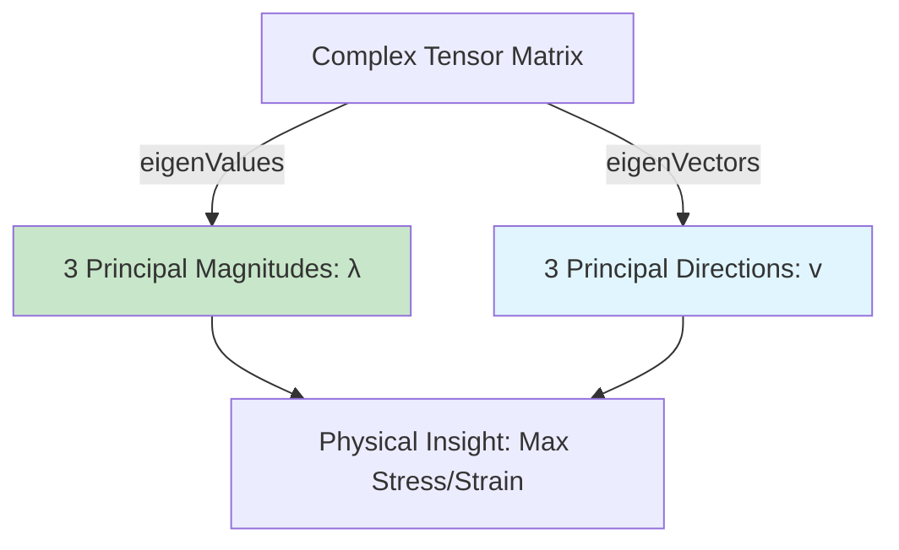

# Eigen Decomposition: The Why & Physical Applications

![[principal_directions_eigen.png]]
> **Academic Vision:** A distorted sphere (Ellipsoid) representing a tensor. Three primary axes (Eigenvectors) are shown originating from the center, each with a different length (Eigenvalues). This illustrates the principal directions of stress or strain. Professional scientific illustration.

---

## The Eigenvalue Problem

For a symmetric tensor $\mathbf{S}$, there exist three real eigenvalues $\lambda_k$ and orthogonal eigenvectors $\mathbf{v}_k$ such that:

$$\mathbf{S} \cdot \mathbf{v}_k = \lambda_k \mathbf{v}_k, \quad k=1,2,3$$

This fundamental relationship defines the eigenvalue decomposition, where eigenvectors represent the principal directions of the tensor and eigenvalues represent the magnitude of the tensor's action in those directions.

For symmetric tensors, the eigenvectors form an orthogonal basis, which has profound implications for physical interpretation in CFD.


> **Figure 1:** ขั้นตอนการแยกส่วนค่าลักษณะเฉพาะ (Eigen Decomposition) เพื่อหาขนาดหลัก (Eigenvalues) และทิศทางหลัก (Eigenvectors) จากเมทริกซ์เทนเซอร์ที่ซับซ้อน ช่วยให้เห็นภาพรวมของความเค้นหรือความเครียดในระบบความปลอดภัยทางฟิสิกส์ไม่ส่งผลกระทบต่อความเร็วในการจำลอง ผ่านการใช้พลังของ C++ Template Metaprogramming ในการตรวจสอบความสอดคล้องทางมิติทั้งหมดที่ขั้นตอนการคอมไพล์โปรแกรมเพียงครั้งเดียว

---

## OpenFOAM Implementation

In OpenFOAM, computing eigenvalues and eigenvectors is straightforward:

```cpp
symmTensor S(2,-1,0, -1,2,0, 0,0,1);  // Example symmetric tensor
vector lambdas = eigenValues(S);      // Returns eigenvalues as vector
tensor V = eigenVectors(S);           // Returns eigenvectors as tensor columns
```

**Key Behavior:**
- The `eigenValues` function returns three eigenvalues sorted from largest to smallest
- The `eigenVectors` function returns a tensor where each column represents the corresponding eigenvector
- This organization makes it easy to work with principal values and directions in numerical algorithms

---

## Mathematical Foundation

### The Characteristic Equation

The `eigenValues` function computes the roots of the characteristic cubic equation:

$$\det(\mathbf{S} - \lambda \mathbf{I}) = -\lambda^3 + I_1 \lambda^2 - I_2 \lambda + I_3 = 0$$

where $I_1, I_2, I_3$ are the principal invariants of the tensor:

$$\begin{aligned}
I_1 &= \operatorname{tr}(\mathbf{S}) \\
I_2 &= \frac{1}{2}[(\operatorname{tr}\mathbf{S})^2 - \operatorname{tr}(\mathbf{S}^2)] \\
I_3 &= \det(\mathbf{S})
\end{aligned}$$

**Meaning of Invariants:**
- $I_1$: Represents the trace (sum of diagonal components)
- $I_2$: Describes the "deviatoric" nature of the tensor
- $I_3$: Represents the determinant

These invariants are coordinate-independent quantities that completely describe the tensor's properties.

### Solving the Eigenvalue Equation

OpenFOAM solves this eigenvalue equation using `cubicEqn`, which implements Cardano's analytical method for solving cubic equations.

The implementation handles various cases, including:

| Case | Description |
|------|-------------|
| Three distinct real roots | General case for non-degenerate tensors |
| Multiple real roots | Occurs when tensor has repeated eigenvalues |
| One real root and two complex conjugates | Cannot occur for symmetric tensors (handled for completeness) |

### Computational Steps

1. **Compute tensor invariants** $I_1, I_2, I_3$
2. **Form characteristic polynomial coefficients**
3. **Apply depressed cubic transformation** to eliminate the quadratic term
4. **Solve the depressed cubic** using trigonometric or logarithmic methods
5. **Transform back** to obtain original eigenvalues
6. **Sort eigenvalues** from largest to smallest

---

## Tensor Invariants

The eigenvalues are the roots of a polynomial whose coefficients are the **Principal Invariants**, which are coordinate-independent values:

| Invariant | Formula | Physical Meaning |
|:---|:---|:---|
| **$I_1$ (Trace)** | $\operatorname{tr}(\mathbf{S}) = \sum \lambda_k$ | Sum of normal forces |
| **$I_2$** | $\frac{1}{2}[(\operatorname{tr}\mathbf{S})^2 - \operatorname{tr}(\mathbf{S}^2)]$ | Distortion energy |
| **$I_3$ (Det)** | $\det(\mathbf{S}) = \prod \lambda_k$ | Volume change |

---

## Physical Applications in CFD

### 1. Turbulence Modeling

In Reynolds-Averaged Navier-Stokes (RANS) modeling, the Reynolds stress tensor $\mathbf{R} = \overline{\mathbf{u}' \otimes \mathbf{u}'}$ is symmetric by construction.

**Eigenvalue Decomposition:**

$$\mathbf{R} = \sum_{k=1}^{3} \lambda_k \mathbf{v}_k \otimes \mathbf{v}_k$$

**Physical Meaning:**
- $\lambda_k$: Represents the intensity of normal stress in principal directions
- $\mathbf{v}_k$: Principal stress directions
- Eigenvalues satisfy $\sum_{k=1}^{3} \lambda_k = 2k$ (twice the turbulent kinetic energy)

**Applications:**
- **Anisotropy Analysis**: The distribution of eigenvalues describes turbulence anisotropy
- **Model Validation**: Compare computed eigenvalues with experimental data
- **Flow Visualization**: Eigenvectors indicate desired turbulent structure directions

**Turbulence Classification:**
- **Isotropic**: Equal turbulence in all directions ($\lambda_1 \approx \lambda_2 \approx \lambda_3$)
- **Disk-like**: Turbulence in one plane
- **Rod-like**: Turbulence in one direction (e.g., in shear layers)

### 2. Solid Mechanics

In fluid-structure interaction and stress analysis, the Cauchy stress tensor $\boldsymbol{\sigma}$ undergoes eigenvalue decomposition:

$$\boldsymbol{\sigma} = \sum_{k=1}^{3} \sigma_k \mathbf{n}_k \otimes \mathbf{n}_k$$

**Definitions:**
- $\sigma_k$: Principal stresses (eigenvalues)
- $\mathbf{n}_k$: Principal stress directions (eigenvectors)

**Applications Include:**
- **Failure Analysis**: Maximum principal stress criterion uses $\sigma_{max} = \max(\sigma_1, \sigma_2, \sigma_3)$
- **Von Mises Stress**: Computed from differences between principal stresses
- **Structural Optimization**: Material placement according to principal stress directions

### 3. Non-Newtonian Fluids

For viscoelastic and non-Newtonian fluids, the extra stress tensor $\boldsymbol{\tau}$ reveals flow structure through eigenvalue decomposition:

$$\boldsymbol{\tau} = \sum_{k=1}^{3} \tau_k \mathbf{e}_k \otimes \mathbf{e}_k$$

**Physical Interpretation:**
- **Positive eigenvalues**: Regions of tensile stress (stretching)
- **Negative eigenvalues**: Regions of compressive stress
- **Eigenvectors**: Principal stretching or compression directions

**This Analysis is Critical For:**
- **Polymer Processing**: Understanding molecular alignment
- **Biological Flows**: Analyzing cell deformation in complex flows
- **Material Characterization**: Identifying flow-induced anisotropy

### 4. Vorticity and Strain Analysis

The strain-rate tensor $\mathbf{D} = \frac{1}{2}(\nabla\mathbf{u} + \nabla\mathbf{u}^T)$ is decomposed to identify:

$$\mathbf{D} = \sum_{k=1}^{3} D_k \mathbf{d}_k \otimes \mathbf{d}_k$$

**Definitions:**
- $D_k$: Principal strain rates
- $\mathbf{d}_k$: Principal strain directions

**This Decomposition Enables:**
- **Coherent Structure Detection**: Identifying regions of high strain
- **Mixing Analysis**: Principal strain rates indicate mixing efficiency
- **Vortex Identification**: Used with vorticity tensor for Q-criterion

### 5. Heat Transfer Applications

In CFD heat transfer, the heat flux tensor $\mathbf{q} = -k\nabla T$ for anisotropic materials uses eigenvalue decomposition:

$$\mathbf{k} = \sum_{k=1}^{3} k_k \mathbf{t}_k \otimes \mathbf{t}_k$$

where $\mathbf{k}$ is the thermal conductivity tensor with:
- $k_k$: Principal thermal conductivities
- $\mathbf{t}_k$: Principal heat conduction directions

**Essential For:**
- **Composite Materials**: Modeling anisotropic heat transfer
- **Crystal Growth**: Understanding directional heat absorption
- **Electronics Cooling**: Optimizing heat sink placement

---

## Numerical Considerations

### Accuracy and Stability

Eigenvalue computation can be sensitive to numerical errors, especially when:
- **Eigenvalues are close together** (nearly degenerate case)
- **Tensor has large condition number**
- **Floating-point precision limitations exist**

**OpenFOAM Implements Robust Algorithms with:**
- **Scaling techniques**: Improving numerical stability through normalization
- **Iterative refinement**: Improving accuracy through Newton iteration
- **Special case handling**: Optimized paths for common tensor types

### Performance Optimization

For large-scale CFD simulations, the efficiency of eigenvalue decomposition is crucial.

**Optimization Techniques:**
- **Vectorization**: SIMD instructions for parallel eigenvalue computation
- **Cache efficiency**: Memory access pattern optimization
- **Approximation methods**: Fast eigenvalue approximation for real-time applications

The implementation exploits the symmetry of stress and strain tensors to achieve computational efficiency, reducing the general eigenvalue problem from $O(n^3)$ to approximately $O(n^2)$ for symmetric cases.

---

## Summary

Eigenvalue decomposition allows engineers to see through nine numbers to the physical "core"—revealing where forces act and how intensely. It transforms complex tensor fields into intuitive principal directions and magnitudes that are essential for:

- Understanding material behavior and failure mechanisms
- Analyzing turbulent flow structures
- Characterizing non-Newtonian fluid dynamics
- Optimizing structural designs
- Visualizing complex flow phenomena

The mathematical elegance and computational efficiency of OpenFOAM's eigenvalue implementation make it a powerful tool for CFD analysis across all application domains.