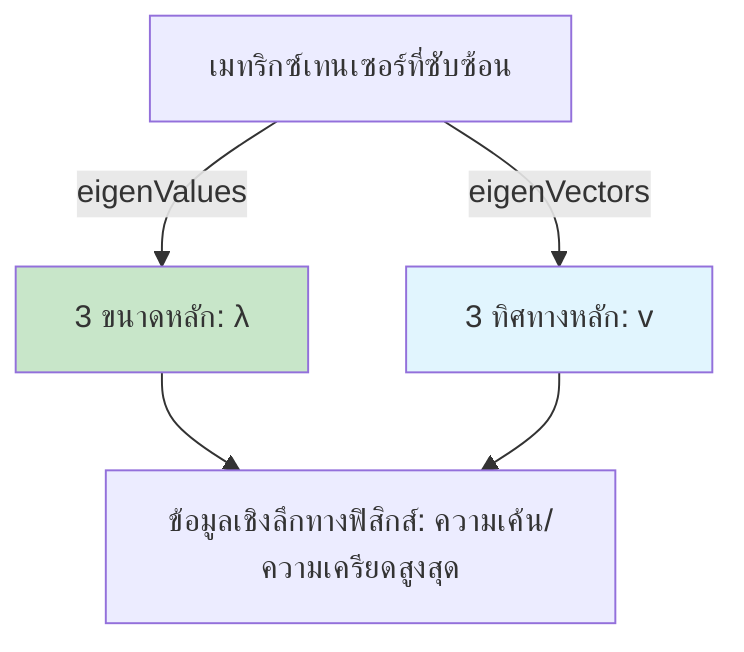

# การสลายตัวของค่าลักษณะเฉพาะ: เหตุผลและการประยุกต์ใช้ทางฟิสิกส์ (Eigen Decomposition: The Why & Physical Applications)

![[principal_directions_eigen.png]]
> **Academic Vision:** ทรงกลมที่บิดเบี้ยว (Ellipsoid) แทนเทนเซอร์ แกนหลักสามแกน (Eigenvectors) แสดงจุดกำเนิดจากศูนย์กลาง แต่ละแกนมีความยาวต่างกัน (Eigenvalues) ภาพนี้แสดงทิศทางหลักของความเค้นหรือความเครียด ภาพประกอบทางวิทยาศาสตร์ระดับมืออาชีพ

---

## ปัญหาค่าลักษณะเฉพาะ (The Eigenvalue Problem)

สำหรับเทนเซอร์สมมาตร $\mathbf{S}$ จะมีค่าลักษณะเฉพาะจริงสามค่า $\lambda_k$ และเวกเตอร์ลักษณะเฉพาะที่ตั้งฉากกัน $\mathbf{v}_k$ ซึ่งทำให้:

$$\mathbf{S} \cdot \mathbf{v}_k = \lambda_k \mathbf{v}_k, \quad k=1,2,3$$

ความสัมพันธ์พื้นฐานนี้กำหนดการสลายตัวของค่าลักษณะเฉพาะ โดยที่เวกเตอร์ลักษณะเฉพาะแทนทิศทางหลักของเทนเซอร์ และค่าลักษณะเฉพาะแทนขนาดของการกระทำของเทนเซอร์ในทิศทางเหล่านั้น

สำหรับเทนเซอร์สมมาตร เวกเตอร์ลักษณะเฉพาะจะสร้างฐานที่ตั้งฉากกัน (Orthogonal basis) ซึ่งมีนัยสำคัญอย่างลึกซึ้งต่อการตีความทางฟิสิกส์ใน CFD


> **รูปที่ 1:** ขั้นตอนการสลายตัวของค่าลักษณะเฉพาะ (Eigen Decomposition) เพื่อหาขนาดหลัก (Eigenvalues) และทิศทางหลัก (Eigenvectors) จากเมทริกซ์เทนเซอร์ที่ซับซ้อน ช่วยให้เห็นภาพรวมของความเค้นหรือความเครียดในระบบ

---

## การนำไปใช้ใน OpenFOAM

ใน OpenFOAM การคำนวณค่าลักษณะเฉพาะและเวกเตอร์ลักษณะเฉพาะทำได้โดยตรงดังนี้:

```cpp
// ตัวอย่าง: เทนเซอร์สมมาตรที่มีหกองค์ประกอบ (xx, xy, xz, yy, yz, zz)
symmTensor S(2, -1, 0, -1, 2, 0, 0, 0, 1);  // เริ่มต้นเทนเซอร์สมมาตร

// คำนวณค่าลักษณะเฉพาะ (ขนาดหลัก) - ส่งคืนเป็นเวกเตอร์ที่เรียงลำดับจากมากไปน้อย
vector lambdas = eigenValues(S);

// คำนวณเวกเตอร์ลักษณะเฉพาะ (ทิศทางหลัก) - ส่งคืนเป็นคอลัมน์ของเทนเซอร์
tensor V = eigenVectors(S);
```

> **📂 แหล่งที่มา:** `.applications/test/tensor/Test-tensor.C`
>
> **คำอธิบาย:** ไฟล์ทดสอบแสดงการคำนวณค่าลักษณะเฉพาะ/เวกเตอร์ลักษณะเฉพาะพร้อมการตรวจสอบความถูกต้อง รวมถึงบรรทัด `vector e = eigenValues(t6);` และ `tensor ev = eigenVectors(t6);`
>
> **แนวคิดสำคัญ:**
> - `symmTensor`: ประเภทเทนเซอร์สมมาตรที่ต้องการเพียง 6 องค์ประกอบ (xx, xy, xz, yy, yz, zz)
> - `eigenValues()`: ส่งคืนค่าลักษณะเฉพาะที่เรียงลำดับจากมากไปน้อยในรูปแบบ `vector`
> - `eigenVectors()`: ส่งคืนเวกเตอร์ลักษณะเฉพาะเป็นคอลัมน์ของ `tensor` (แต่ละคอลัมน์คือหนึ่งเวกเตอร์ลักษณะเฉพาะ)
> - สำหรับเทนเซอร์สมมาตร เวกเตอร์ลักษณะเฉพาะจะตั้งฉากกันเสมอและสร้างฐานที่สมบูรณ์

**พฤติกรรมหลัก:**
- ฟังก์ชัน `eigenValues` จะส่งคืนค่าลักษณะเฉพาะสามค่าที่เรียงลำดับจากมากไปน้อย
- ฟังก์ชัน `eigenVectors` จะส่งคืนเทนเซอร์ที่แต่ละคอลัมน์แทนเวกเตอร์ลักษณะเฉพาะที่สอดคล้องกัน
- การจัดระเบียบนี้ทำให้ง่ายต่อการทำงานกับค่าหลักและทิศทางหลักในอัลกอริทึมเชิงตัวเลข

---

## รากฐานทางคณิตศาสตร์

### สมการลักษณะเฉพาะ (The Characteristic Equation)

ฟังก์ชัน `eigenValues` คำนวณรากของสมการกำลังสามลักษณะเฉพาะ:

$$\det(\mathbf{S} - \lambda \mathbf{I}) = -\lambda^3 + I_1 \lambda^2 - I_2 \lambda + I_3 = 0$$

โดยที่ $I_1, I_2, I_3$ คือค่าคงที่หลัก (Principal invariants) ของเทนเซอร์:

$$\begin{aligned}
I_1 &= \operatorname{tr}(\mathbf{S}) \\
I_2 &= \frac{1}{2}[(\operatorname{tr}\mathbf{S})^2 - \operatorname{tr}(\mathbf{S}^2)] \\
I_3 &= \det(\mathbf{S})
\end{aligned}$$

**ความหมายของค่าคงที่:**
- $I_1$: แทนค่า Trace (ผลรวมขององค์ประกอบแนวทแยง)
- $I_2$: อธิบายลักษณะ "เบี่ยงเบน" (Deviatoric) ของเทนเซอร์
- $I_3$: แทนค่าดีเทอร์มิแนนต์ (Determinant)

ค่าคงที่เหล่านี้เป็นปริมาณที่ไม่ขึ้นกับระบบพิกัดซึ่งอธิบายคุณสมบัติของเทนเซอร์ได้อย่างสมบูรณ์

### การแก้สมการค่าลักษณะเฉพาะ

OpenFOAM แก้สมการค่าลักษณะเฉพาะนี้โดยใช้ `cubicEqn` ซึ่งใช้วิธีเชิงวิเคราะห์ของ Cardano ในการแก้สมการกำลังสาม

การนำไปใช้งานรองรับกรณีต่างๆ ดังนี้:

| กรณี | คำอธิบาย |
|------|-------------|
| รากจริงสามค่าที่แตกต่างกัน | กรณีทั่วไปสำหรับเทนเซอร์ที่ไม่มีความเสื่อม (Non-degenerate) |
| รากจริงหลายค่า | เกิดขึ้นเมื่อเทนเซอร์มีค่าลักษณะเฉพาะซ้ำกัน |
| รากจริงหนึ่งค่าและรากเชิงซ้อนคู่หนึ่ง | ไม่สามารถเกิดขึ้นได้สำหรับเทนเซอร์สมมาตร (รองรับเพื่อความสมบูรณ์) |

---

## ค่าคงที่ของเทนเซอร์ (Tensor Invariants)

ค่าลักษณะเฉพาะคือรากของพหุนามที่มีสัมประสิทธิ์เป็น **ค่าคงที่หลัก (Principal Invariants)** ซึ่งเป็นค่าที่ไม่ขึ้นกับระบบพิกัด:

| ค่าคงที่ | สูตร | ความหมายทางฟิสิกส์ |
|:---|:---|:---|
| **$I_1$ (Trace)** | $\operatorname{tr}(\mathbf{S}) = \sum \lambda_k$ | ผลรวมของแรงตั้งฉาก |
| **$I_2$** | $\frac{1}{2}[(\operatorname{tr}\mathbf{S})^2 - \operatorname{tr}(\mathbf{S}^2)]$ | พลังงานการบิดเบี้ยว |
| **$I_3$ (Det)** | $\det(\mathbf{S}) = \prod \lambda_k$ | การเปลี่ยนแปลงปริมาตร |

---

## การประยุกต์ใช้ทางฟิสิกส์ใน CFD

### 1. การสร้างแบบจำลองความปั่นป่วน (Turbulence Modeling)

ในการสร้างแบบจำลอง Reynolds-Averaged Navier-Stokes (RANS) เทนเซอร์ความเค้นเรย์โนลด์ส $\mathbf{R} = \overline{\mathbf{u}' \otimes \mathbf{u}'}$ มีความสมมาตรตามโครงสร้าง

**การสลายตัวของค่าลักษณะเฉพาะ:**

$$\mathbf{R} = \sum_{k=1}^{3} \lambda_k \mathbf{v}_k \otimes \mathbf{v}_k$$

**ความหมายทางฟิสิกส์:**
- $\lambda_k$: แทนความเข้มของความเค้นปกติในทิศทางหลัก
- $\mathbf{v}_k$: ทิศทางความเค้นหลัก
- ค่าลักษณะเฉพาะสอดคล้องกับ $\sum_{k=1}^{3} \lambda_k = 2k$ (สองเท่าของพลังงานจลน์ความปั่นป่วน)

**การประยุกต์ใช้งาน:**
- **การวิเคราะห์ความไม่เท่ากัน (Anisotropy Analysis)**: การกระจายตัวของค่าลักษณะเฉพาะอธิบายความไม่เท่ากันของความปั่นป่วน
- **การตรวจสอบความถูกต้องของแบบจำลอง**: เปรียบเทียบค่าลักษณะเฉพาะที่คำนวณได้กับข้อมูลจากการทดลอง
- **การแสดงภาพการไหล**: เวกเตอร์ลักษณะเฉพาะบ่งบอกทิศทางโครงสร้างความปั่นป่วนที่ต้องการ

### 2. กลศาสตร์ของแข็ง (Solid Mechanics)

ในปฏิสัมพันธ์ระหว่างของไหลและโครงสร้าง (FSI) และการวิเคราะห์ความเค้น เทนเซอร์ความเค้น Cauchy $\boldsymbol{\sigma}$ จะถูกสลายค่าลักษณะเฉพาะดังนี้:

$$\boldsymbol{\sigma} = \sum_{k=1}^{3} \sigma_k \mathbf{n}_k \otimes \mathbf{n}_k$$

**นิยาม:**
- $\sigma_k$: ความเค้นหลัก (ค่าลักษณะเฉพาะ)
- $\mathbf{n}_k$: ทิศทางความเค้นหลัก (เวกเตอร์ลักษณะเฉพาะ)

**การประยุกต์ใช้งานประกอบด้วย:**
- **การวิเคราะห์ความล้มเหลว**: เกณฑ์ความเค้นหลักสูงสุดใช้ $\sigma_{max} = \max(\sigma_1, \sigma_2, \sigma_3)$
- **ความเค้น Von Mises**: คำนวณจากความแตกต่างระหว่างความเค้นหลัก
- **การเพิ่มประสิทธิภาพโครงสร้าง**: การจัดวางวัสดุตามทิศทางความเค้นหลัก

### 3. ของไหลนอกกฎของนิวตัน (Non-Newtonian Fluids)

สำหรับของไหลที่มีความหนืดหยุ่นและนอกกฎของนิวตัน เทนเซอร์ความเค้นส่วนเกิน $\boldsymbol{\tau}$ จะเผยให้เห็นโครงสร้างการไหลผ่านการสลายตัวของค่าลักษณะเฉพาะ:

$$\boldsymbol{\tau} = \sum_{k=1}^{3} \tau_k \mathbf{e}_k \otimes \mathbf{e}_k$$

**การตีความทางฟิสิกส์:**
- **ค่าลักษณะเฉพาะที่เป็นบวก**: บริเวณที่มีความเค้นดึง (การยืดออก)
- **ค่าลักษณะเฉพาะที่เป็นลบ**: บริเวณที่มีความเค้นอัด
- **เวกเตอร์ลักษณะเฉพาะ**: ทิศทางการยืดหรือการอัดหลัก

### 4. การวิเคราะห์ Vorticity และ Strain

เทนเซอร์อัตราความเครียด $\mathbf{D} = \frac{1}{2}(\nabla\mathbf{u} + \nabla\mathbf{u}^T)$ ถูกสลายตัวเพื่อระบุ:

$$\mathbf{D} = \sum_{k=1}^{3} D_k \mathbf{d}_k \otimes \mathbf{d}_k$$

**นิยาม:**
- $D_k$: อัตราความเครียดหลัก
- $\mathbf{d}_k$: ทิศทางความเครียดหลัก

---

## ข้อพิจารณาทางตัวเลข

### ความแม่นยำและเสถียรภาพ

การคำนวณค่าลักษณะเฉพาะอาจมีความอ่อนไหวต่อข้อผิดพลาดทางตัวเลข โดยเฉพาะอย่างยิ่งเมื่อ:
- **ค่าลักษณะเฉพาะอยู่ใกล้กันมาก** (กรณีเกือบเสื่อม)
- **เทนเซอร์มีค่า Condition Number ขนาดใหญ่**
- **มีข้อจำกัดด้านความแม่นยำของจุดทศนิยม**

**OpenFOAM นำอัลกอริทึมที่ทนทานมาใช้พร้อมกับ:**
- **เทคนิคการปรับสเกล (Scaling techniques)**: ปรับปรุงเสถียรภาพเชิงตัวเลขผ่านการทำให้เป็นมาตรฐาน
- **การปรับแต่งแบบวนซ้ำ (Iterative refinement)**: ปรับปรุงความแม่นยำผ่านการวนซ้ำแบบนิวตัน
- **การจัดการกรณีพิเศษ**: เส้นทางการคำนวณที่ปรับแต่งให้เหมาะสมสำหรับประเภทเทนเซอร์ทั่วไป

---

## สรุป

การสลายตัวของค่าลักษณะเฉพาะช่วยให้วิศวกรสามารถมองทะลุตัวเลขเก้าตัวไปยัง "แก่น" ทางฟิสิกส์—เผยให้เห็นว่าแรงกระทำที่ใดและรุนแรงเพียงใด มันเปลี่ยนฟิลด์เทนเซอร์ที่ซับซ้อนให้กลายเป็นทิศทางและขนาดหลักที่เข้าใจง่ายซึ่งจำเป็นสำหรับ:

- การเข้าใจพฤติกรรมของวัสดุและกลไกความล้มเหลว
- การวิเคราะห์โครงสร้างการไหลแบบปั่นป่วน
- การระบุลักษณะพลศาสตร์ของของไหลนอกกฎของนิวตัน
- การเพิ่มประสิทธิภาพการออกแบบโครงสร้าง
- การแสดงภาพปรากฏการณ์การไหลที่ซับซ้อน

ความสวยงามทางคณิตศาสตร์และประสิทธิภาพการคำนวณของการนำ eigenvalue ไปใช้ใน OpenFOAM ทำให้มันเป็นเครื่องมือที่ทรงพลังสำหรับการวิเคราะห์ CFD ในทุกโดเมนการประยุกต์ใช้งาน
