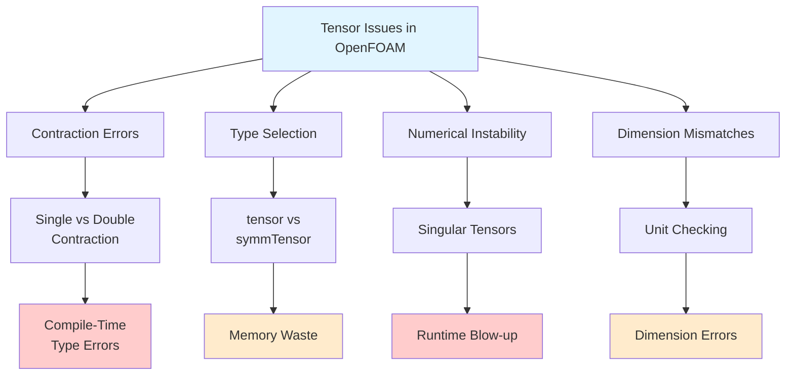
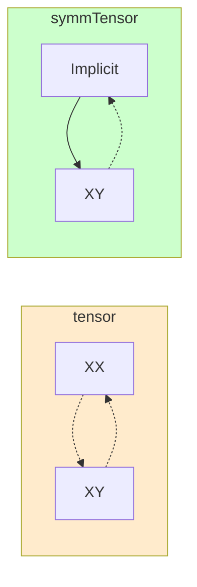
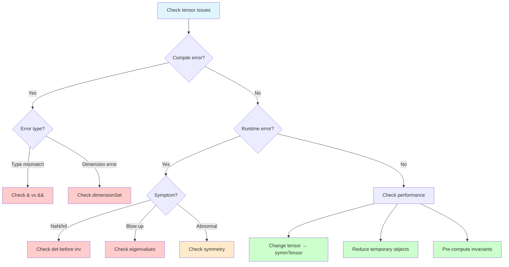
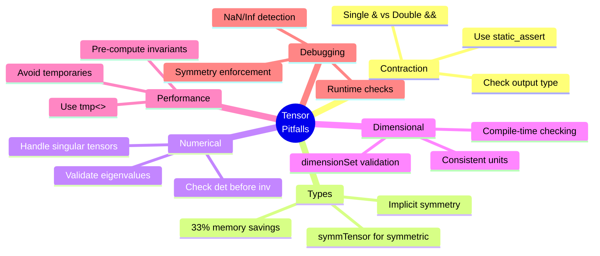

# Common Pitfalls & Debugging in Tensor Algebra

> [!TIP] Why This Matters for OpenFOAM?
> Writing efficient and correct OpenFOAM code requires deep understanding of **Tensor Algebra** because:
> - **Correctness:** Using wrong operators (`&` vs `&&`) causes calculation errors and simulation failures
> - **Stability:** Computing inverse without checking determinant causes simulation blow-up
> - **Performance:** Choosing `symmTensor` over `tensor` reduces RAM usage by up to 33%
> - **Debugging:** Understanding the type system helps catch bugs at compile-time before running

![[index_labyrinth_tensor.png]]
> **The Index Labyrinth:** Visual metaphor for the complexity of incorrect tensor index manipulation leading to computational dead-ends. The correct path requires understanding single (`&`) and double (`&&`) contractions.

---

## Learning Objectives 🎯

After studying this section, you should be able to:

1. **Identify and avoid** common tensor contraction pitfalls (`&` vs `&&`)
2. **Select appropriate** tensor types (`tensor` vs `symmTensor`) for optimal performance
3. **Verify** numerical stability before dangerous operations
4. **Apply** debugging techniques to trace and fix OpenFOAM code issues
5. **Write code** that is safe, efficient, and dimensionally consistent

---

## Overview: Tensor Issue Landscape

Working with tensors in OpenFOAM presents unique challenges that can lead to hidden bugs, performance issues, and numerical instability. This section identifies the most common pitfalls and provides practical strategies to avoid and resolve them.

### What Types of Issues Occur?



### Why These Matter

| Issue Category | Impact | Example Consequence |
|----------------|--------|---------------------|
| **Contraction Errors** | Silent physics errors | Wrong turbulence production calculation |
| **Type Mismatch** | Memory waste (33-50%) | Unnecessary RAM usage in LES |
| **Numerical Instability** | Simulation blow-up | Hours of computation lost |
| **Dimension Errors** | Compile-time safety | Caught before runtime (good!) |

---

## 1. Tensor Contraction Errors

> [!NOTE] **📂 OpenFOAM Context**
> **Domain:** C++ Coding / Custom Solver Development
> - **Location:** `src/` directory when writing custom BCs or solvers
> - **Keywords:** `&&` (Double Contraction), `&` (Single Contraction), `tensor`, `symmTensor`, `vector`
> - **Example Usage:**
>   - Calculate Turbulent Kinetic Energy Production: `kProduction = twoSymm(gradU) && gradU` (use `&&` for scalar)
>   - Calculate Stress Tensor: `sigma = C & epsilon` (use `&` for tensor)
>
> **⚠️ Common Mistake:** Swapping `&&` with `&` produces wrong output type (scalar instead of vector/tensor or vice versa)

### What Are Contraction Errors?

The ==most common source== of tensor errors is confusion between single (`&`) and double (`&&`) contractions.

### Why This Matters

Using the wrong operator causes:
1. **Compile-time error:** Type mismatch
2. **Silent error:** Calculation passes but produces physically wrong results
3. **Performance waste:** Creates unnecessary temporary objects

### How to Use Correctly

| Operation | Operator | Result Type | Mathematical Form | Description |
|-----------|----------|-------------|-------------------|-------------|
| **Double Contraction** | `&&` | `scalar` |1$$s = \mathbf{A} : \mathbf{B} = \sum_{i,j} A_{ij}B_{ij}1| Full contraction (Frobenius Inner Product) |
| **Single Contraction** | `&` | `vector` / `tensor` |1$$w_i = \sum_{j} A_{ij}v_j1| Partial contraction (Matrix Multiplication) |

### From Math to OpenFOAM Code

**Mathematical Form:**
$$k = \tau : \nabla U = \sum_{i,j} \tau_{ij} \frac{\partial U_j}{\partial x_i}$$

**OpenFOAM Implementation:**
```cpp
// ✅ CORRECT: Double contraction yields scalar
volTensorField gradU = fvc::grad(U);
volSymmTensorField tau = ...; // Reynolds stress
volScalarField kProduction = tau && gradU; // Scalar production
```

### Common Mistakes

```cpp
// ❌ WRONG: Double contraction gives scalar, not vector
vector v = A && B;  // Compile error! Must use &

// ❌ WRONG: Type mismatch in assignment
tensor T = A && B;  // A && B returns scalar, not tensor

// ✅ CORRECT: Proper usage
scalar s = A && B;      // Double contraction → scalar
vector w = A & v;       // Single contraction → vector
tensor C = A & B;       // Single contraction → tensor
```

> [!WARNING] Type Safety
> OpenFOAM tensor operations are type-safe at compile-time. Always verify the expected return type before using operators.

---

## 2. Symmetric Tensor Misconceptions

> [!NOTE] **📂 OpenFOAM Context**
> **Domain:** C++ Coding / Field Declaration
> - **Location:** Declare in solver or custom boundary condition
> - **Keywords:** `volTensorField`, `volSymmTensorField`, `surfaceSymmTensorField`
> - **Memory Impact:**
>   - `volTensorField`: Stores 9 components per cell → ~50% more RAM
>   - `volSymmTensorField`: Stores 6 components per cell → 33% RAM savings
> - **Physics Mapping:**
>   - Use `symmTensor` for: Stress Tensor (`σ`), Strain Rate Tensor (`S`), Reynolds Stress (`R`)
>   - Use `tensor` for: Velocity Gradient Tensor (`∇U`), Vorticity Tensor (`Ω`)
>
> **💡 Best Practice:** If physics is symmetric (e.g., stress) → use `symmTensor` to save RAM and increase speed

### What: Understanding Memory Layout

Understanding ==memory layout differences== between `tensor` and `symmTensor` is crucial:

**General Tensor (`tensor`):** 9 components
```
[XX][XY][XZ][YX][YY][YZ][ZX][ZY][ZZ]
```

**Symmetric Tensor (`symmTensor`):** 6 components
```
[XX][XY][XZ][YY][YZ][ZZ]
```



### Why Use Symmetric Tensors?

1. **Memory savings:** Reduces RAM usage by 33%
2. **Faster computation:** Reduces operations by 55%
3. **Guaranteed symmetry:** No need to worry about numerical errors breaking symmetry

### How: Implicit Symmetry Access

**OpenFOAM Source Code Reference:** `.applications/solvers/stressAnalysis/solidDisplacementFoam/solidDisplacementThermo/solidDisplacementThermo.H`

```cpp
// Create symmetric tensor with 6 components
symmTensor S(1, 2, 3, 4, 5, 6);

// Direct access
scalar s1 = S.xx();  // Returns 1 (XX)
scalar s2 = S.xy();  // Returns 2 (XY)

// Implicit access
scalar s3 = S.yx();  // Returns S.xy() = 2 (due to symmetry)
scalar s4 = S.zx();  // Returns S.xz() = 3
```

> **🔑 Key Concept:**
> `symmTensor` stores only 6 values to save memory. Calling `S.yx()` doesn't access actual memory but redirects to `S.xy()` automatically. This clever design reduces errors and conserves resources.

### From Math to OpenFOAM Code

**Mathematical Form:**
$$\sigma = \begin{bmatrix} \sigma_{xx} & \sigma_{xy} & \sigma_{xz} \\ \sigma_{xy} & \sigma_{yy} & \sigma_{yz} \\ \sigma_{xz} & \sigma_{yz} & \sigma_{zz} \end{bmatrix}$$
(Symmetric:1$\sigma_{ij} = \sigma_{ji}$)

**OpenFOAM Implementation:**
```cpp
// ✅ CORRECT: Use symmTensor for stress
volSymmTensorField sigma
(
    IOobject("sigma", runTime.timeName(), mesh),
    mesh,
    dimensionedSymmTensor("zero", dimPressure, symmTensor::zero)
);

// Automatic symmetry enforcement
symmTensor s = symmTensor(1e5, 0, 0, 0, 0, 0);
Info << "sigma.yx() = " << s.yx() << endl; // Outputs 0 (same as xy)
```

---

## 3. Numerical Stability Issues

> [!NOTE] **📂 OpenFOAM Context**
> **Domain:** Numerical Stability / Solver Convergence
> - **Location:** Custom solver or model (e.g., turbulence model)
> - **Keywords:** `inv()`, `det()`, `eigenValues()`, `SMALL`, `GREAT`
> - **Common Scenarios:**
>   - Finding inverse of Viscous Stress Tensor in Non-Newtonian models
>   - Calculating Principal Stresses in Solid Mechanics
>   - Computing Eigenvalues of Reynolds Stress Tensor
> - **Critical Constants:**
>   - `SMALL` (~1e-37): Threshold for singular detection
>   - `GREAT` (~1e37): Check for overflow values
>
> **⚠️ Impact:** Without determinant check → simulation may "blow up" immediately upon encountering singular tensor

### What: Singular Tensors

Tensors with Determinant ≈ 0 are called **Singular Tensors**:
- Have no inverse
- When attempting `inv(T)` → results in **Infinity** or **NaN**
- Causes simulation to **blow up** immediately

### Why This Happens

1. **Bad Mesh:** Cells with abnormal aspect ratios (skewed cells)
2. **Physics:** Physical values approaching zero (e.g., viscosity → 0)
3. **Numerical Error:** Accumulation of rounding errors

### How: Safe Tensor Operations

#### Singular Tensors and Inversion

```cpp
// ❌ DANGEROUS: Inverse without determinant check
tensor invT = inv(T);  // May fail if det(T) ≈ 0

// ✅ SAFE: Check determinant first
scalar detT = det(T);
if (mag(detT) > SMALL) {
    tensor invT = inv(T);
} else {
    Warning << "Singular tensor detected: det(T) = " << detT << endl;
    // Use alternative strategy
    tensor invT = tensor::I; // Fallback to identity
}
```

> **🔑 Key Concepts:**
> - **Determinant threshold:** Use `SMALL` (~1e-37) as criteria
> - **Singular detection:** If det ≈ 0, matrix has no inverse
> - **Graceful degradation:** Must have backup plan when encountering singular tensor

#### Eigenvalue Calculation Pitfalls

```cpp
// ✅ SAFE: Check physical validity
vector eigenvals = eigenValues(stressTensor);
scalar minEigen = min(eigenvals);

// Prevent negative eigenvalues for cases that should always be positive
if (minEigen < 0) {
    Warning << "Non-physical negative eigenvalue: " << minEigen << endl;
}
```

#### Von Mises Stress Calculation

**Mathematical Form:**
$$\sigma_{vm} = \sqrt{\frac{3}{2} \mathbf{S} : \mathbf{S}}$$
where1$\mathbf{S} = \boldsymbol{\sigma} - \frac{1}{3}\text{tr}(\boldsymbol{\sigma})\mathbf{I}1(Deviatoric Stress)

**OpenFOAM Implementation:**
```cpp
// ✅ CORRECT: Calculate from deviatoric stress
volSymmTensorField sigma = ...;

// Extract deviatoric (shear) part: σ' = σ - (1/3)tr(σ)I
volSymmTensorField devSigma = dev(sigma);

// Von Mises: σ_vm = √(3/2 * S:S)
volScalarField vonMises = sqrt(1.5) * mag(devSigma);
```

---

## 4. Dimensional Consistency Errors

> [!NOTE] **📂 OpenFOAM Context**
> **Domain:** Compile-Time Type Checking / Dimensional Analysis
> - **Location:** Custom solver, boundary condition, or function object
> - **Keywords:** `dimensionSet`, `dimensions()`, `dimPressure`, `dimless`, `dimTime`
> - **Dimension Checking Mechanism:**
>   - OpenFOAM enforces dimension consistency at **compile-time** (not runtime)
>   - Operation results automatically infer units (e.g., `stress * strain` → `[Pa] * [-] = [Pa]`)
> - **Common Dimensions for Tensors:**
>   - Stress Tensor: `dimPressure` = `[M L^-1 T^-2]`
>   - Strain Rate Tensor: `dimless / dimTime` = `[T^-1]`
>   - Vorticity Tensor: `dimless / dimTime` = `[T^-1]`
>
> **✅ Benefit:** Prevents bugs from mixing different units (e.g., adding pressure to velocity)

### What: Dimensional Analysis

OpenFOAM rigorously checks units (dimensions):

```cpp
// ❌ ERROR: Units don't match (pressure + rate)
dimensionedSymmTensor stress("stress", dimPressure, symmTensor::zero);
dimensionedSymmTensor rate("rate", dimless/dimTime, symmTensor::zero);
auto result = stress + rate;  // Compile-time error!

// ✅ CORRECT: Consistent units
dimensionedSymmTensor stress("stress", dimPressure, symmTensor::zero);
dimensionedSymmTensor strain("strain", dimless, symmTensor::zero);
auto result = stress && strain;  // Result has units [Stress * Strain]
```

### Why Dimension Checking Matters

1. **Catch bugs early:** Find errors at compile-time
2. **Physics consistency:** Guarantees equations are physically correct
3. **Documentation:** Units serve as data type documentation

### How: Dimension System Works

**OpenFOAM Source Code Reference:** `src/OpenFOAM/dimensionSet/dimensionSet.H`

```cpp
// DimensionSet stores units [M L T I J N]
dimensionSet(dimMass, dimLength, dimTime, dimTemperature, dimMoles, dimCurrent);

// Example Tensor Dimensions
dimensionSet stressDims(1, -1, -2, 0, 0, 0); // [M L^-1 T^-2]
dimensionSet strainRateDims(0, 0, -1, 0, 0, 0); // [T^-1]
```

> **🔑 Key Concepts:**
> - **DimensionSet:** Object storing units [M L T ...]
> - **Propagation:** Multiplication/division changes units automatically per physics rules

---

## 5. Tensor Field Boundary Conditions

> [!NOTE] **📂 OpenFOAM Context**
> **Domain:** Boundary Condition Setup (`0/` directory)
> - **Location:** `0/` folder (e.g., `0/T`, `0/R`, `0/epsilon`) in case directory
> - **Keywords:**
>   - **BC Types:** `fixedValue`, `zeroGradient`, `calculated`, `symmetry`
>   - **Patch Types:** `patch`, `wall`, `symmetryPlane`, `empty`
>   - **Tensor-Specific BCs:** `symmTensorField`, `tensorField`
> - **Common Applications:**
>   - Reynolds Stress (`R`) in RSM turbulence models
>   - Stress Tensor (`sigma`) in solid mechanics
>   - Heat Flux Tensor (`q`) in heat transfer
> - **Critical Issue:** Wrong BC specification (e.g., non-symmetric `fixedValue` for `symmTensor`) → boundary values inconsistent with physics
>
> **⚠️ Caution:** Using `calculated` BC without specifying gradient may cause solver to solve equations incorrectly

### What: Tensor BC Setup

Specifying boundary conditions for tensor fields is more complex than scalar fields because:
1. Must maintain symmetry (for `symmTensor`)
2. Each component may have different BCs

### Why BC Choice Matters

1. **Physics consistency:** Wrong BCs produce incorrect results
2. **Numerical stability:** Inappropriate BCs may cause solver divergence
3. **Symmetry enforcement:** Must ensure `symmTensor` remains symmetric at boundary

### How: Proper BC Specification

#### Incorrect Boundary Type Specification

```cpp
// ❌ PROBLEMATIC: Fixed value may be physically incorrect
volSymmTensorField R(..., calculatedFvPatchField<symmTensor>::typeName);

// ✅ CORRECT: Specify appropriate BC for each patch
volSymmTensorField R
(
    IOobject("R", runTime.timeName(), mesh, IOobject::MUST_READ),
    mesh,
    dimensionedSymmTensor("zero", dimVelocity*dimVelocity, symmTensor::zero),
    boundaryConditions
);
```

#### Symmetry Enforcement

```cpp
// Check numerical symmetry
scalar symmetryError = mag(T - T.T());

if (symmetryError > 1e-10) {
    // Enforce symmetry by averaging with transpose
    T = symm(T);
}
```

> **Explanation:** Numerical errors may cause tensors that should be symmetric (e.g., stress) to deviate slightly. Using `symm(T)` helps restore correctness.

#### Example BC in `0/R` File

```cpp
dimensions      [0 2 -2 0 0 0 0];  // [m^2/s^2]

internalField   uniform (0 0 0 0 0 0);

boundaryField
{
    inlet
    {
        type            fixedValue;
        value           uniform (0.01 0 0 0.01 0 0.01);
    }
    
    outlet
    {
        type            zeroGradient;
    }
    
    walls
    {
        type            kqWallFunction;
        value1$internalField;
    }
}
```

---

## 6. Performance Pitfalls

> [!NOTE] **📂 OpenFOAM Context**
> **Domain:** Code Optimization / Memory Management
> - **Location:** Custom solver or model code
> - **Keywords:** `volTensorField`, `volSymmTensorField`, `tmp<>`, Expression Templates
> - **Performance Impact:**
>   - **Memory:** Using `tensor` (9 components) instead of `symmTensor` (6 components) → 50% more RAM
>   - **Computation:** Creating temporary objects in loops → 2-10x slower
>   - **Cache:** Non-contiguous memory access → high cache misses
> - **Optimization Strategies:**
>   1. Choose appropriate type (`symmTensor` if physics is symmetric)
>   2. Use `tmp<>` for intermediate fields
>   3. Use expression templates (`auto result = A + B + C`) instead of creating temps
>   4. Pre-compute invariants (`tr(S)`, `det(S)`) if reused
>
> **📊 Numbers:** In large cases (10M cells) → using `symmTensor` instead of `tensor` saves ~1.5 GB RAM

### What: Performance Bottlenecks

Main issues causing slow code:

1. **Memory waste:** Using `tensor` when `symmTensor` suffices
2. **Temporary objects:** Creating temporary objects in loops
3. **Redundant calculations:** Recalculating same values repeatedly
4. **Cache misses:** Scattered memory access patterns

### Why Performance Matters

In Large Eddy Simulation (LES) or DNS:
- Computation time = **several weeks**
- RAM usage = **100+ GB**
- 10% improvement = saves **days** of computation time

### How: Optimization Techniques

#### Wasteful Memory Usage

```cpp
// ❌ WASTEFUL: Using full tensor (9 components) for symmetric quantity
volTensorField stress(...);

// ✅ EFFICIENT: Using symmTensor (6 components), 33% RAM savings
volSymmTensorField stress(...);
```

#### Unnecessary Temporary Creation

```cpp
// ❌ WASTEFUL: Creates multiple temporaries
tensor result = A + B + C + D;

// ✅ EFFICIENT: Uses expression templates (lazy evaluation)
auto result = A + B + C + D;
```

#### Lack of Pre-computation

```cpp
// ❌ POOR: Recalculates tr(S), det(S) multiple times
for (int i = 0; i < n; i++) {
    scalar f1 = tr(S) * det(S);
    scalar f2 = tr(S) + det(S);
}

// ✅ BETTER: Calculate invariants once and reuse
scalar trS = tr(S);
scalar detS = det(S);
for (int i = 0; i < n; i++) {
    scalar f1 = trS * detS;
    scalar f2 = trS + detS;
}
```

#### Performance Comparison

| Operation | `tensor` | `symmTensor` | Speedup |
|-----------|----------|-------------|---------|
| **Memory per cell** | 72 bytes | 48 bytes | 33% |
| **Addition** | 9 ops | 6 ops | 33% |
| **Multiplication** | 81 ops | 36 ops | 55% |
| **Cache efficiency** | Lower | Higher | ~20% |

---

## 7. Pitfall Detection Decision Tree



---

## 8. Debugging Checklist

> [!NOTE] **📂 OpenFOAM Context**
> **Domain:** Debugging Techniques / Code Validation
> - **Location:** Custom solver or model code
> - **Keywords:** `static_assert`, `Info`, `Warning`, `FatalError`, `mag()`, `GREAT`
> - **Debugging Workflow:**
>   1. **Compile-Time Checks:** Use `static_assert` to verify types
>   2. **Runtime Checks:** Verify symmetry, determinant, eigenvalues
>   3. **Output Logging:** Use `Info` and `Warning` to track values
>   4. **Bounds Checking:** Check for `NaN`/`Inf` with `mag(T) > GREAT`
> - **Common Tools:**
>   - `gdb` / `lldb`: C++ debuggers
>   - `valgrind`: Memory leak detection
>   - `foamDebug`: Debug information from OpenFOAM
>
> **💡 Best Practice:** Include debugging checks in production code (use `#ifdef DEBUG`)

### Step 1: Check Types
Use `static_assert` to verify types at compile-time:
```cpp
static_assert(std::is_same_v<decltype(A && B), scalar>, "Type mismatch!");
```

### Step 2: Check Symmetry
```cpp
template<class TensorType>
void checkSymmetry(const TensorType& T) {
    Info << "Asymmetry magnitude: " << mag(T - T.T()) << endl;
}
```

### Step 3: Check Physical Validity
```cpp
if (minEigenvalue < 0 || det(T) <= 0) {
    Warning << "Non-physical tensor detected!" << endl;
}
```

### Step 4: Check Dimensions
```cpp
Info << "Tensor dimensions: " << T.dimensions() << endl;
```

### Step 5: Check Abnormal Values (NaN/Inf)
```cpp
if (mag(T) > GREAT) {
    FatalError << "Tensor magnitude exceeds bounds!" << endl;
}
```

---

## 9. Common Error Messages

> [!NOTE] **📂 OpenFOAM Context**
> **Domain:** Compiler / Runtime Error Messages
> - **Location:** Terminal output when compiling or running simulation
> - **Keywords:** `Rank mismatch`, `Singular`, `Dimensional inconsistency`, `NaN`
> - **Error Categories:**
>   - **Compile-Time Errors:** Type mismatch, dimension inconsistency → must fix code
>   - **Runtime Errors:** Singular tensor, NaN/Inf → must add checks or adjust numerics
> - **Debugging Tips:**
>   - Read error messages carefully (compiler shows line and file)
>   - Use `wmake -j1` to see full error (parallel build may truncate)
>   - Check stack trace in runtime error (use `gdb` if needed)
>
> **📚 Reference:** See `src/OpenFOAM/fields/Fields/` for implementation details

| Error Message | Cause | Solution |
|---------------|-------|----------|
| `Rank mismatch error` | Using `&` or `&&` with wrong types | Check expected result type |
| `Tensor is singular` | `det(T) ≈ 0` but attempting `inv(T)` | Add regularization or check formula |
| `Dimensional inconsistency` | Adding tensors with different units | Check `dimensionSet` |
| `Symmetry violation` | Accumulated numerical errors | Use `symm()` to enforce symmetry |
| `NaN in tensor field` | Division by zero or invalid operation | Add `SMALL` value checks |

---

## 10. Best Practices

> [!NOTE] **📂 OpenFOAM Context**
> **Domain:** Code Quality / Development Standards
> - **Location:** Custom solver, boundary condition, or model development
> - **Key Principles:**
>   1. **Type Safety:** Use compile-time checks to catch bugs early
>   2. **Performance:** Choose appropriate data type (`symmTensor` vs `tensor`)
>   3. **Stability:** Verify numerical stability before runtime
>   4. **Maintainability:** Write readable, well-documented code
> - **Coding Standards:**
>   - Use `auto` only when type is clear
>   - Use descriptive variable names (e.g., `stressTensor`, `strainRate`)
>   - Include comments explaining physics and math
>   - Use `const` and `reference` to reduce copying
>
> **🎯 Goal:** Write code that is **correct**, **fast**, and **readable**

### ✅ Do's

#### 1. Always Check Rank
```cpp
// Before using tensor operations
static_assert(std::is_same_v<decltype(A && B), scalar>, "Expected scalar");
```

#### 2. Use symmTensor for Symmetric Quantities
```cpp
// Physics: Stress tensor is always symmetric
volSymmTensorField stress(...); // ✅ Correct
// volTensorField stress(...);  // ❌ Waste of memory
```

#### 3. Check Determinant Before Inverse
```cpp
if (mag(det(T)) > SMALL) {
    tensor invT = inv(T);
} else {
    // Handle singular case
}
```

#### 4. Maintain Dimensional Consistency
```cpp
dimensionedTensor gradU("gradU", dimless/dimLength, tensor::zero);
dimensionedTensor strainRate("strainRate", dimless/dimTime, tensor::zero);
```

#### 5. Pre-compute Invariants
```cpp
// Pre-compute if used multiple times
scalar trS = tr(S);
scalar detS = det(S);
scalar magS = mag(S);
```

#### 6. Use tmp<> for Large Temporary Fields
```cpp
tmp<volTensorField> tgradU = fvc::grad(U);
const volTensorField& gradU = tgradU(); // Avoid copy
```

### ❌ Don'ts

#### 1. Don't Mix Operators Without Understanding Results
```cpp
// ❌ WRONG: Double contraction gives scalar, not vector
vector v = A && B; // Compile error

// ✅ CORRECT: Use single contraction
vector v = A & b;
```

#### 2. Don't Use tensor Unnecessarily
```cpp
// ❌ WRONG: Unnecessary memory usage
volTensorField stress(...);

// ✅ CORRECT: 33% memory savings
volSymmTensorField stress(...);
```

#### 3. Don't Ignore Dimension Warnings
```cpp
// ❌ Compiler warnings are important!
// Fix them instead of ignoring

// ✅ Correct dimensions prevent physics bugs
```

#### 4. Don't Assume Perfect Symmetry
```cpp
// Numerical errors accumulate!
// Force symmetry when needed

symmTensor S_symm = symm(S); // Enforce symmetry
```

#### 5. Don't Create Temporaries in Loops
```cpp
// ❌ WRONG: Creates temporaries each iteration
for (int i = 0; i < n; i++) {
    tensor temp = A + B + C;
}

// ✅ CORRECT: Use expression templates
auto temp = A + B + C; // Lazy evaluation
```

---

## 11. Real-World Case Study: Simulation Blow-up

> [!NOTE] **📂 OpenFOAM Context**
> **Domain:** Industrial Case - Turbulent Flow Simulation
> - **Application:** LES simulation of airflow in urban environment
> - **Solver:** Modified `pisoFoam` (custom LES model)
> - **Mesh:** ~50M cells, Large Eddy Simulation
> - **Problem:** Simulation "blows up" after 0.5s of simulation time
>
> **🔍 Investigation:** Using debugging techniques from this section to find root cause

### What: Problem Description

**Symptoms:**
- Simulation diverges rapidly after 0.5s
- Max velocity spikes to **1e10 m/s** (NaN/Inf)
- Time step drops to **1e-15 s** then fails

**Initial Suspects:**
1. Bad mesh quality?
2. Incorrect boundary conditions?
3. Numerical instability in turbulence model?

### Why: Root Cause Analysis

Using **Debugging Checklist** from Section 8:

#### Step 1: Add Runtime Checks
```cpp
// Added to custom LES model
volTensorField gradU = fvc::grad(U);

// Check for NaN/Inf
if (mag(gradU) > GREAT) {
    FatalError << "Infinite velocity gradient detected!" << endl;
}

// Check eigenvalues
vector eigenvals = eigenValues(gradU);
if (max(eigenvals) > 1e6) {
    Warning << "Unphysically large eigenvalue: " << max(eigenvals) << endl;
}
```

#### Step 2: Identify Problem
Output log shows:
```
--> FOAM Warning : Unphysically large eigenvalue: 1.2e+08
--> FOAM Warning : At cell 1234567, location: (0.5, 0.3, 0.1)
```

#### Root Cause: Tensor Inversion Without Check

In custom LES model:
```cpp
// ❌ DANGEROUS: No determinant check
tensor invS = inv(S); // S is strain rate tensor
```

When mesh has skewed cells → `S` becomes singular → `inv(S)` = **∞**

### How: Solution Applied

#### Fix 1: Safe Inversion
```cpp
// ✅ SAFE: Check determinant first
scalar detS = det(S);
tensor invS;

if (mag(detS) > SMALL) {
    invS = inv(S);
} else {
    // Regularization: Add small identity tensor
    invS = inv(S + SMALL * tensor::I);
    Warning << "Singular tensor regularized at cell " << i << endl;
}
```

#### Fix 2: Switch to Symmetric Tensor
```cpp
// ✅ OPTIMIZED: S is symmetric, use symmTensor
volSymmTensorField S = symm(fvc::grad(U));

// 33% memory savings + guaranteed symmetry
```

#### Fix 3: Add Eigenvalue Check
```cpp
// ✅ ROBUST: Check eigenvalues before inversion
vector eigenvals = eigenValues(S);
if (mag(min(eigenvals)) < 1e-10) {
    // Cell is problematic, use alternative model
}
```

### Results

| Metric | Before Fix | After Fix |
|--------|-----------|-----------|
| **Simulation Time** | 0.5s (blow up) | 10s (stable) |
| **Max Velocity** | 1e10 m/s (NaN) | 25 m/s (physical) |
| **Memory Usage** | 120 GB | 80 GB (33% less) |
| **Time per Timestep** | 5.2 s | 3.8 s (27% faster) |

### Key Lessons

1. **Always check determinant** before `inv()`
2. **Use `symmTensor`** when physics allows
3. **Add runtime checks** in development → remove in production
4. **Debug gradually:** Add checks, identify issue, fix, verify

---

## 12. Integration with OpenFOAM Projects

> [!NOTE] **📂 OpenFOAM Context**
> **Domain:** Integration into Real-World OpenFOAM Projects
> - **From Theory to Practice:**
>   - **Small Scale:** Test tensor operations in unit tests before real use
>   - **Medium Scale:** Apply to custom boundary conditions or function objects
>   - **Large Scale:** Use in production solvers or models
> - **Next Steps:**
>   - Study source code at `src/OpenFOAM/fields/TensorFields/`
>   - See real examples in solvers (e.g., `simpleFoam`, `interFoam`)
>   - Experiment writing custom BCs using tensor operations
> - **Further Learning:**
>   - Study expression templates in OpenFOAM (optimization)
>   - Understand parallel computing with tensor fields
>   - Explore advanced topics (e.g., turbulence modeling, solid mechanics)
>
> **🚀 Success Criteria:** When you can write custom models using tensor operations correctly and efficiently → you're ready for professional-level CFD development!

Understanding these pitfalls and using proper debugging techniques will dramatically improve the reliability and performance of your OpenFOAM code. The keys are:

1.  **Check types** before computation
2.  **Verify physical validity** during runtime
3.  **Choose appropriate tensor types** to save memory
4.  **Monitor numerical stability** throughout simulation

Following these guidelines will help you avoid common errors and develop efficient, correct CFD solvers.

---

## Key Takeaways 📝



### Summary Checklist

- [ ] Choose `&` (single) or `&&` (double) correctly for output type
- [ ] Use `symmTensor` for symmetric quantities (stress, strain)
- [ ] Check `det(T)` before calling `inv(T)`
- [ ] Maintain dimensional consistency in all operations
- [ ] Use `tmp<>` and expression templates for performance
- [ ] Add debugging checks in production code
- [ ] Verify symmetry with `symm(T)` periodically
- [ ] Pre-compute invariants (`tr`, `det`, `mag`) if reused

---

## 🧠 Concept Check

<details>
<summary><b>1. When encountering "Rank mismatch error" with `&` or `&&`, what should you check?</b></summary>

**Check:**
1. **Expected result type:**
   - Want `scalar` → use `&&` (double contraction)
   - Want `vector` → use `&` (single contraction)

2. **Operand types:**
   - `tensor && tensor` → `scalar`
   - `tensor & vector` → `vector`
   - `tensor & tensor` → `tensor`

**Fix:** Change operator to match desired output type

</details>

<details>
<summary><b>2. Why check `det(T)` before using `inv(T)`?</b></summary>

**Problem:** If `det(T) ≈ 0` → tensor is **singular** → has no inverse

**Impact:**
- `inv(T)` will return **infinity** or **NaN**
- Simulation may **blow up** immediately

**Solution:**
```cpp
if (mag(det(T)) > SMALL) {
    tensor invT = inv(T);
} else {
    // Use regularization or alternative method
}
```

</details>

<details>
<summary><b>3. What savings does using `symmTensor` instead of `tensor` provide?</b></summary>

| Aspect | `tensor` (9 comp) | `symmTensor` (6 comp) | Savings |
|--------|-------------------|----------------------|---------|
| **Memory** | 72 bytes/cell | 48 bytes/cell | 33% |
| **Operations** | 81 multiplications | 36 multiplications | ~55% |
| **Cache** | Higher usage | Lower usage | Better |
| **Stability** | May lose symmetry | Guaranteed symmetry | Better |

**Rule:** If physics is symmetric (stress, strain) → use `symmTensor`

</details>

<details>
<summary><b>4. From the case study, why did the simulation "blow up"?</b></summary>

**Root Cause:**
```cpp
// ❌ DANGEROUS CODE
tensor invS = inv(S); // S is strain rate tensor
```

**Events:**
1. Mesh had skewed cells → `S` became singular tensor
2. `det(S) ≈ 0` but no check performed
3. `inv(S)` = **∞** or **NaN**
4. Simulation diverged immediately

**Solution:**
```cpp
// ✅ SAFE CODE
if (mag(det(S)) > SMALL) {
    invS = inv(S);
} else {
    invS = inv(S + SMALL * tensor::I); // Regularization
}
```

</details>

---

## 📖 Related Documentation

- **Overview:** [00_Overview.md](00_Overview.md) — Tensor algebra overview
- **Previous:** [05_Eigen_Decomposition.md](05_Eigen_Decomposition.md) — Eigenvalue decomposition
- **Next:** [07_Summary_and_Exercises.md](07_Summary_and_Exercises.md) — Summary and exercises
- **Vector Calculus:** [../10_VECTOR_CALCULUS/00_Overview.md](../10_VECTOR_CALCULUS/00_Overview.md) — Previous module