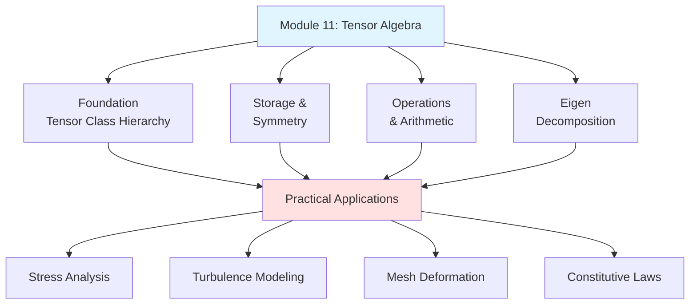
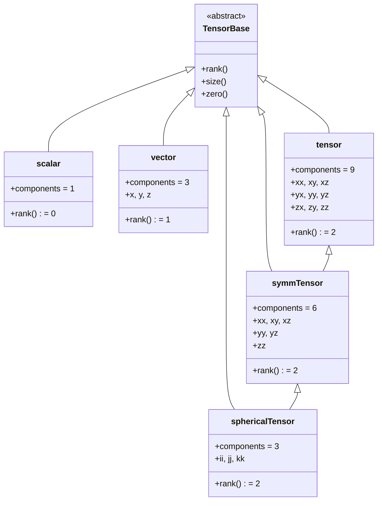
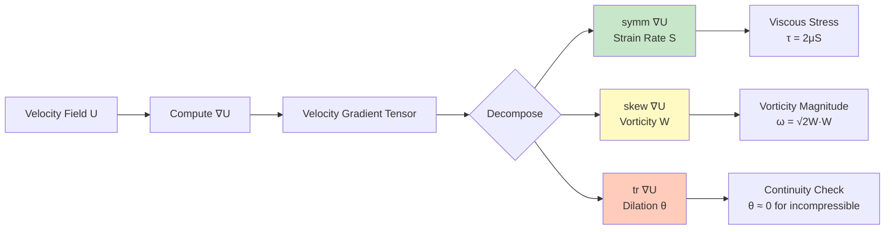

# Tensor Algebra - Summary and Exercises

สรุปและแบบฝึกหัด Tensor Algebra

---

## 🎯 Learning Objectives

By completing this module, you will be able to:
- **Synthesize** all tensor algebra concepts into practical CFD applications
- **Implement** tensor operations from basic to advanced levels
- **Apply** eigenvalue analysis for turbulence modeling and stress analysis
- **Debug** common tensor-related compilation and runtime errors
- **Design** custom tensor-based utilities for OpenFOAM simulations

---

## 📋 Module Overview: The Tensor Algebra Ecosystem

This capstone section ties together all concepts from the tensor algebra module, progressing from fundamental operations to real-world CFD applications.



### 🔄 Module Integration Matrix

| Previous Module | Key Concepts | Tensor Algebra Connection |
|----------------|--------------|---------------------------|
| **Module 10** | Vector calculus (fvc::grad, fvc::div) | Gradients of vectors create tensors (∇U) |
| **Module 9** | Field algebra operations | Tensor fields follow same operator overloading patterns |
| **Module 8** | Field types (vol vs surface) | Tensor fields exist as both volTensorField and surfaceTensorField |
| **Module 6** | Linear algebra (fvMatrix) | Tensor operations map to matrix operations in discretization |

### 📊 Forward Connections to Future Modules

| This Module Concepts | Future Module Applications |
|---------------------|---------------------------|
| Symmetric tensors | **Module 12:** Boundary conditions for stress tensor |
| Eigen decomposition | **Module 13:** Principal stress analysis in solid mechanics |
| Tensor calculus | **Module 14:** Advanced discretization schemes |
| Deviatoric tensors | **Module 15:** Turbulence model implementation |

---

## 🔍 Comprehensive Summary: What We've Learned

### Part 1: What - The Tensor Type Hierarchy



#### When to Use Each Type

| Type | Physical Meaning | Memory | Common Use Cases |
|------|------------------|--------|------------------|
| **scalar** | Single value | 8 bytes | Temperature, pressure, density |
| **vector** | Direction + magnitude | 24 bytes | Velocity, position, forces |
| **tensor** | Full 3×3 transformation | 72 bytes | Velocity gradients, full stress |
| **symmTensor** | Symmetric 3×3 (6 unique) | 48 bytes | Strain rate, viscous stress, Reynolds stress |
| **sphericalTensor** | Diagonal only (3 unique) | 24 bytes | Isotropic pressure, identity tensor |

### Part 2: Why - Tensor Operations in CFD



#### The Three Fundamental Decompositions

**1. Symmetric-Skew Decomposition** (Most Common)
```cpp
// From velocity gradient to strain and vorticity
volTensorField gradU = fvc::grad(U);

// Strain rate tensor (symmetric part)
volSymmTensorField S = symm(gradU);  // = ½(∇U + ∇U^T)

// Vorticity tensor (skew-symmetric part)  
volTensorField W = skew(gradU);       // = ½(∇U - ∇U^T)

// Reconstruction: gradU = S + W
```

**Physical significance:**
- **S** captures deformation and stretching (energy dissipation)
- **W** captures rotation (energy-conserving)
- This decomposition is fundamental to turbulence modeling (RANS, LES)

**2. Deviatoric-Volumetric Decomposition**
```cpp
// Full tensor = deviatoric + volumetric (isotropic) parts
symmTensor T = /* ... */;

// Deviatoric (traceless, shape-changing)
symmTensor devT = dev(T);  // = T - ⅓ tr(T)I

// Volumetric (shape-preserving, volume-changing)
scalar traceT = tr(T);     // = T₁₁ + T₂₂ + T₃₃
sphericalTensor volT = (traceT / 3.0) * I;

// Reconstruction: T = devT + volT
```

**Physical significance:**
- **dev(T)** captures shear deformation without volume change
- **tr(T)/3** captures volumetric expansion/compression
- Essential for plasticity models and pressure-velocity coupling

**3. Eigen Decomposition** (Principal Values/Directions)
```cpp
tensor T = /* ... */;

// Eigenvalues (principal magnitudes)
vector lambda = eigenValues(T);     // λ₁, λ₂, λ₃

// Eigenvectors (principal directions)
tensor E = eigenVectors(T);         // Columns are eigenvectors

// Spectral decomposition: T = Σ λᵢ eᵢ ⊗ eᵢ
```

**Physical significance:**
- Principal stresses in solid mechanics
- Turbulence anisotropy analysis (Reynolds stress eigenvalues)
- Mesh quality metrics (aspect ratio, skewness)

### Part 3: How - From Math to OpenFOAM Code

#### Translation Guide: Mathematical Notation → C++ Syntax

| Mathematical | OpenFOAM Syntax | Template | Notes |
|--------------|-----------------|----------|-------|
| **Scalar** | `scalar` | `double` | 64-bit floating point |
| **Vector** | `vector` | `Vector<double>` | x, y, z components |
| **Tensor** | `tensor` | `Tensor<double>` | Full 3×3 |
| **Symmetric Tensor** | `symmTensor` | `SymmTensor<double>` | 6 unique components |
| **a · b** (dot) | `a & b` | | Result is scalar |
| **A · B** (tensor dot) | `A & B` | | Result is tensor |
| **A : B** (double contraction) | `A && B` | | Result is scalar |
| **A ⊗ B** (outer) | `a * b` | | Result is tensor |
| **A^T** (transpose) | `A.T()` | | |
| **|A|** (magnitude) | `mag(A)` | | √(A:A) |
| **tr(A)** (trace) | `tr(A)` | | A₁₁ + A₂₂ + A₃₃ |
| **symm(A)** | `symm(A)` | | ½(A + A^T) |
| **skew(A)** | `skew(A)` | | ½(A - A^T) |
| **dev(A)** | `dev(A)` | | A - ⅓tr(A)I |
| **det(A)** (determinant) | `det(A)` | | |
| **cof(A)** (cofactor) | `cof(A)` | | |
| **inv(A)** (inverse) | `inv(A)` | | |

#### Practical Code Patterns

**Pattern 1: Stress Calculation in Newtonian Fluid**
```cpp
// From math: τ = -pI + 2μS - ⅔μ(∇·U)I
// Where S = ½(∇U + ∇U^T) is strain rate

volScalarField p = mesh.lookupObject<volScalarField>("p");
volVectorField U = mesh.lookupObject<volVectorField>("U");
volScalarField mu(/* viscosity model */);

volTensorField gradU = fvc::grad(U);
volSymmTensorField S = symm(gradU);
volScalarField divU = tr(gradU);

volSymmTensorField tau = 
    -p * I 
    + 2 * mu * S 
    - (2.0/3.0) * mu * divU * I;

// For incompressible flow (∇·U = 0):
volSymmTensorField tauIncomp = -p * I + 2 * mu * S;
```

**Pattern 2: Reynolds Stress Decomposition (RANS)**
```cpp
// From math: R = ⅔kI - 2νₜS
// Where k is TKE, νₜ is eddy viscosity, S is strain rate

volScalarField k = mesh.lookupObject<volScalarField>("k");
volScalarField nuTurb = mesh.lookupObject<volScalarField>("nuTurb");
volSymmTensorField S = symm(fvc::grad(U));

volSymmTensorField R = 
    (2.0/3.0) * k * I 
    - 2 * nuTurb * S;

// Anisotropy tensor: a = (R/k) - ⅔I
volSymmTensorField a = (R / k) - (2.0/3.0) * I;
```

**Pattern 3: Eigenvalue-Based Wall Function**
```cpp
// Compute principal strain rates for anisotropic wall treatment
volSymmTensorField S = symm(fvc::grad(U));

volScalarField lambda1(S.internalField().size());
volScalarField lambda2(S.internalField().size());
volScalarField lambda3(S.internalField().size());

forAll(S, cellI)
{
    const symmTensor& S_cell = S[cellI];
    
    // Eigenvalues of strain rate tensor
    scalar eigenvals[3];
    eigenvals[0] = eigenValues(S_cell).x();
    eigenvals[1] = eigenValues(S_cell).y();
    eigenvals[2] = eigenValues(S_cell).z();
    
    // Sort by magnitude
    std::sort(eigenvals, eigenvals + 3, [](scalar a, scalar b) {
        return std::abs(a) > std::abs(b);
    });
    
    lambda1[cellI] = eigenvals[0];
    lambda2[cellI] = eigenvals[1];
    lambda3[cellI] = eigenvals[2];
}

// Use eigenvalues for anisotropic damping
volScalarField anisotropyRatio = mag(lambda1) / (mag(lambda3) + SMALL);
```

---

## 🏋️ Progressive Exercises

### 🔰 Level 1: Basic Tensor Operations

#### Exercise 1.1: Tensor Construction and Inspection
**Task:** Create tensors and verify component access

```cpp
// Given this code
tensor T1(1, 2, 3, 4, 5, 6, 7, 8, 9);
symmTensor T2(1, 2, 3, 4, 5, 6);

// TODO: Fill in the blanks
Info << "T1.xx = " << _____ << endl;      // Expected: 1
Info << "T1.zy = " << _____ << endl;      // Expected: 8
Info << "T2.yy = " << _____ << endl;      // Expected: 4
Info << "tr(T1) = " << _____ << endl;     // Expected: 15
Info << "mag(T1) = " << _____ << endl;    // Expected: √285
```

<details>
<summary>📝 Solution</summary>

```cpp
Info << "T1.xx = " << T1.xx() << endl;
Info << "T1.zy = " << T1.zy() << endl;
Info << "T2.yy = " << T2.yy() << endl;
Info << "tr(T1) = " << tr(T1) << endl;
Info << "mag(T1) = " << mag(T1) << endl;
```

**Why?** Component access methods (xx(), xy(), etc.) are the primary way to inspect tensor values. The trace and magnitude are fundamental tensor properties.
</details>

---

#### Exercise 1.2: Symmetric-Skew Decomposition
**Task:** Verify that any tensor can be decomposed into symmetric and skew-symmetric parts

```cpp
// Given a velocity gradient tensor
tensor gradU(0, 1, 0, 
             0, 0, 0, 
             0, 0, 0);

// TODO: Compute and verify decomposition
tensor symmPart = _____;
tensor skewPart = _____;
tensor reconstructed = _____;

// TODO: Check that symmPart is symmetric and skewPart is skew-symmetric
bool isSymmetric = (symmPart == symmPart.T());  // Should be true
bool isSkew = (skewPart == -skewPart.T());      // Should be true
bool decompositionWorks = (reconstructed == gradU);  // Should be true

Info << "Is symmetric: " << isSymmetric << endl;
Info << "Is skew-symmetric: " << isSkew << endl;
Info << "Decomposition works: " << decompositionWorks << endl;
```

<details>
<summary>📝 Solution</summary>

```cpp
tensor symmPart = symm(gradU);
tensor skewPart = skew(gradU);
tensor reconstructed = symmPart + skewPart;
```

**Mathematical verification:**
- gradU = [[0, 1, 0], [0, 0, 0], [0, 0, 0]]
- symm(gradU) = [[0, 0.5, 0], [0.5, 0, 0], [0, 0, 0]]
- skew(gradU) = [[0, 0.5, 0], [-0.5, 0, 0], [0, 0, 0]]
- Sum = original tensor ✓
</details>

---

#### Exercise 1.3: Deviatoric Decomposition
**Task:** Compute deviatoric and volumetric parts of a stress tensor

```cpp
// Given a stress tensor (units: Pa)
symmTensor sigma(100000, 50000, 0,     // Pa
                 80000, 60000, 0,
                 70000);

// TODO: Compute decompositions
scalar meanStress = _____;           // Mean normal stress
symmTensor devSigma = _____;          // Deviatoric stress
sphericalTensor volSigma = _____;     // Volumetric stress

// Verify: sigma = devSigma + volSigma
bool reconstructionValid = (sigma == (devSigma + symmTensor(volSigma)));

Info << "Mean stress: " << meanStress << " Pa" << endl;
Info << "Reconstruction valid: " << reconstructionValid << endl;
```

<details>
<summary>📝 Solution</summary>

```cpp
scalar meanStress = tr(sigma) / 3.0;
symmTensor devSigma = dev(sigma);
sphericalTensor volSigma(meanStress);

// Verification
Info << "tr(devSigma) = " << tr(devSigma) << endl;  // Should be ~0
Info << "Mean stress = " << meanStress << " Pa" << endl;
```

**Physical interpretation:**
- **Mean stress** = (100000 + 80000 + 70000) / 3 = 83333 Pa (pressure-like)
- **devSigma** captures shear stresses (shape change without volume change)
- This decomposition is crucial for plasticity models (von Mises yield criterion)
</details>

---

### 🎯 Level 2: Intermediate Applications

#### Exercise 2.1: Strain Rate and Vorticity from Velocity Field
**Task:** Implement a complete strain rate and vorticity calculator for a flow field

```cpp
// Template: Create a custom boundary condition or function object
void calculateStrainAndVorticity(
    const volVectorField& U,
    volSymmTensorField& S,
    volTensorField& W,
    volScalarField& vorticityMag
)
{
    // TODO: Implement this function
    // 1. Compute velocity gradient ∇U
    // 2. Extract symmetric part (strain rate)
    // 3. Extract skew part (vorticity tensor)
    // 4. Compute vorticity magnitude: |ω| = √2 |W|
    
    // Hint: Use fvc::grad(), symm(), skew(), mag()
}
```

<details>
<summary>📝 Solution</summary>

```cpp
void calculateStrainAndVorticity(
    const volVectorField& U,
    volSymmTensorField& S,
    volTensorField& W,
    volScalarField& vorticityMag
)
{
    // 1. Velocity gradient tensor
    volTensorField gradU = fvc::grad(U);
    
    // 2. Strain rate tensor (symmetric part)
    S = symm(gradU);
    
    // 3. Vorticity tensor (skew-symmetric part)
    W = skew(gradU);
    
    // 4. Vorticity magnitude
    // |ω| = √(2 W:W) = √2 |W|
    vorticityMag = sqrt(2.0) * mag(W);
}

// Usage in solver
volSymmTensorField S(
    IOobject("S", runTime.timeName(), mesh, IOobject::NO_READ),
    mesh,
    dimensionedSymmTensor("zero", dimless, symmTensor::zero)
);

volTensorField W(
    IOobject("W", runTime.timeName(), mesh, IOobject::NO_READ),
    mesh,
    dimensionedTensor("zero", dimless, tensor::zero)
);

volScalarField vorticityMag(
    IOobject("vorticityMag", runTime.timeName(), mesh, IOobject::NO_READ),
    mesh,
    dimensionedScalar("zero", dimless, 0)
);

calculateStrainAndVorticity(U, S, W, vorticityMag);

S.write();
W.write();
vorticityMag.write();
```

**Physical interpretation:**
- **S** measures rate of deformation (energy dissipation in viscous flows)
- **W** measures rate of rotation (energy-conserving)
- **vorticityMag** identifies regions of high rotation (useful for turbulence detection)
</details>

---

#### Exercise 2.2: Invariant-Based Turbulence Detector
**Task:** Implement the Q-criterion for vortex core detection

```cpp
// Q-criterion: Q = ½(|Ω|² - |S|²)
// Where Ω is vorticity tensor, S is strain rate tensor
// Q > 0 indicates vortex core region

volScalarField calculateQCriterion(
    const volVectorField& U
)
{
    // TODO: Implement Q-criterion
    // 1. Compute ∇U
    // 2. Extract S and Ω
    // 3. Compute Q = 0.5 * (mag(Ω)^2 - mag(S)^2)
    
    volScalarField Q(
        IOobject("Q", runTime.timeName(), mesh, IOobject::NO_READ),
        mesh,
        dimensionedScalar("zero", dimless/dimTime/dimTime, 0)
    );
    
    // Your code here
    
    return Q;
}
```

<details>
<summary>📝 Solution</summary>

```cpp
volScalarField calculateQCriterion(const volVectorField& U)
{
    volTensorField gradU = fvc::grad(U);
    volSymmTensorField S = symm(gradU);      // Strain rate
    volTensorField Omega = skew(gradU);      // Vorticity tensor
    
    // Q = ½(Ω:Ω - S:S)
    volScalarField Q = 0.5 * (sqr(mag(Omega)) - sqr(mag(S)));
    
    return Q;
}

// Usage: Identify vortex cores
volScalarField Q = calculateQCriterion(U);

// Create a mask for vortex cores (Q > 0)
volScalarField vortexCoreMask = pos(Q);

// Write for visualization in ParaView
Q.write();
vortexCoreMask.write();
```

**Why Q-criterion?**
- **Q > 0**: Vorticity magnitude > strain rate magnitude → vortex core
- **Q < 0**: Strain dominates → shear layer, dissipation region
- Widely used in experimental and computational fluid dynamics for vortex visualization
</details>

---

#### Exercise 2.3: Eigenvalue-Based Stress Analysis
**Task:** Compute principal stresses and identify maximum shear stress

```cpp
// Given a stress field, compute principal stresses
void analyzePrincipalStresses(
    const volSymmTensorField& sigma,
    volScalarField& sigma1,    // Maximum principal stress
    volScalarField& sigma2,    // Intermediate principal stress  
    volScalarField& sigma3,    // Minimum principal stress
    volScalarField& tauMax     // Maximum shear stress
)
{
    // TODO: Implement stress analysis
    // 1. Compute eigenvalues for each cell
    // 2. Sort: sigma1 >= sigma2 >= sigma3
    // 3. Compute tau_max = (sigma1 - sigma3) / 2
    
    // Hint: Use eigenValues(), and manual sorting
}
```

<details>
<summary>📝 Solution</summary>

```cpp
void analyzePrincipalStresses(
    const volSymmTensorField& sigma,
    volScalarField& sigma1,
    volScalarField& sigma2,
    volScalarField& sigma3,
    volScalarField& tauMax
)
{
    forAll(sigma, cellI)
    {
        const symmTensor& sigmaCell = sigma[cellI];
        
        // Compute eigenvalues
        vector eigenvals = eigenValues(sigmaCell);
        
        // Extract components
        scalar e1 = eigenvals.x();
        scalar e2 = eigenvals.y();
        scalar e3 = eigenvals.z();
        
        // Sort in descending order
        scalar vals[3] = {e1, e2, e3};
        std::sort(vals, vals + 3, std::greater<scalar>());
        
        sigma1[cellI] = vals[0];  // Maximum (tensile)
        sigma2[cellI] = vals[1];  // Intermediate
        sigma3[cellI] = vals[2];  // Minimum (compressive)
        
        // Tresca failure criterion: max shear stress
        tauMax[cellI] = (vals[0] - vals[2]) / 2.0;
    }
}

// Usage in solid mechanics solver
volScalarField sigma1(
    IOobject("sigma1", runTime.timeName(), mesh, IOobject::NO_READ),
    mesh,
    dimensionedScalar("zero", dimPressure, 0)
);

volScalarField sigma2(/* similar initialization */);
volScalarField sigma3(/* similar initialization */);
volScalarField tauMax(/* similar initialization */);

analyzePrincipalStresses(sigma, sigma1, sigma2, sigma3, tauMax);
```

**Physical significance:**
- **sigma1**: Maximum tensile stress (critical for brittle failure)
- **sigma3**: Maximum compressive stress (critical for buckling)
- **tauMax**: Maximum shear stress (Tresca yield criterion: τ_max > σ_y / 2 → yield)
- Used for failure analysis in structural mechanics
</details>

---

### 🚀 Level 3: Advanced Projects

#### Project 3.1: Implement a Custom Anisotropic Turbulence Model

**Scenario:** Standard k-ε model uses isotropic eddy viscosity. You want to implement an anisotropic version where the Reynolds stress tensor has directional dependence.

**Mathematical Model:**
```
R = ⅔kI - 2νₜS + anisotropicCorrection
```

Where the anisotropic correction depends on the strain rate eigendecomposition:
```
anisotropicCorrection = -2νₜ Σ f(λᵢ) eᵢ ⊗ eᵢ
```

**Your Task:** Implement a custom eddy viscosity class

```cpp
// File: anisotropicEddyViscosity.H
class anisotropicEddyViscosity
{
    // Data members
    const volScalarField& k_;      // Turbulent kinetic energy
    const volScalarField& epsilon_; // Dissipation rate
    const volScalarField& nu_;      // Molecular viscosity
    const volSymmTensorField& S_;   // Strain rate
    
    scalar Cmu_;   // Model constant
    scalar anisotropyFactor_; // Controls anisotropy strength
    
public:
    // Constructor
    anisotropicEddyViscosity(
        const volScalarField& k,
        const volScalarField& epsilon,
        const volScalarField& nu,
        const volSymmTensorField& S
    );
    
    // Compute anisotropic Reynolds stress
    tmp<volSymmTensorField> ReynoldsStress() const;
    
    // Compute anisotropic eddy viscosity (tensor)
    tmp<volSymmTensorField> nuT() const;
    
private:
    // Helper function: compute anisotropy correction
    symmTensor anisotropyCorrection(const symmTensor& S_cell) const;
};
```

<details>
<summary>📝 Solution</summary>

```cpp
// anisotropicEddyViscosity.C
#include "anisotropicEddyViscosity.H"

anisotropicEddyViscosity::anisotropicEddyViscosity(
    const volScalarField& k,
    const volScalarField& epsilon,
    const volScalarField& nu,
    const volSymmTensorField& S
)
:
    k_(k),
    epsilon_(epsilon),
    nu_(nu),
    S_(S),
    Cmu_(0.09),
    anisotropyFactor_(0.2)  // 0 = isotropic, 1 = fully anisotropic
{}

symmTensor anisotropicEddyViscosity::anisotropyCorrection(
    const symmTensor& S_cell
) const
{
    // Compute eigenvalues and eigenvectors of strain rate
    vector lambda = eigenValues(S_cell);
    tensor E = eigenVectors(tensor(S_cell));
    
    // Extract eigenvectors (columns of E)
    vector e1(E.xx(), E.yx(), E.zx());
    vector e2(E.xy(), E.yy(), E.zy());
    vector e3(E.xz(), E.yz(), E.zz());
    
    // Compute f(λ) = |λ|^1.5 (nonlinear enhancement)
    scalar f1 = pow(mag(lambda.x()), 1.5);
    scalar f2 = pow(mag(lambda.y()), 1.5);
    scalar f3 = pow(mag(lambda.z()), 1.5);
    
    // Anisotropic correction = Σ f(λᵢ) eᵢ ⊗ eᵢ
    tensor correction = 
        f1 * (e1 * e1) + 
        f2 * (e2 * e2) + 
        f3 * (e3 * e3);
    
    return symmTensor(correction);
}

tmp<volSymmTensorField> anisotropicEddyViscosity::ReynoldsStress() const
{
    // Standard k-epsilon eddy viscosity
    volScalarField nuT = Cmu_ * sqr(k_) / epsilon_;
    
    tmp<volSymmTensorField> tR(
        new volSymmTensorField(
            IOobject("R", mesh.time().timeName(), mesh),
            mesh,
            dimensionedSymmTensor("zero", dimPressure, symmTensor::zero)
        )
    );
    volSymmTensorField& R = tR.ref();
    
    forAll(R, cellI)
    {
        // Isotropic part
        scalar nuT_cell = nuT[cellI];
        symmTensor S_cell = S_[cellI];
        scalar k_cell = k_[cellI];
        
        symmTensor R_iso = (2.0/3.0) * k_cell * I - 2 * nuT_cell * S_cell;
        
        // Anisotropic correction
        symmTensor correction = anisotropyCorrection(S_cell);
        
        // Combine: R = R_iso - correctionFactor * nuT * correction
        R[cellI] = R_iso - anisotropyFactor_ * nuT_cell * correction;
    }
    
    return tR;
}
```

**Usage in solver:**
```cpp
// In main solver loop
volSymmTensorField S = symm(fvc::grad(U));

anisotropicEddyViscosity anisoModel(k, epsilon, nu, S);
volSymmTensorField R = anisoModel.ReynoldsStress();

// Use in momentum equation
fvVectorMatrix UEqn(
    fvm::ddt(U) 
  + fvm::div(phi, U)
  - fvm::laplacian(nu, U)
  + fvc::div(R)  // Reynolds stress divergence
 ==
    fvOptions(U)
);
```

**Why this matters:**
- Isotropic models assume turbulent mixing is same in all directions
- Real turbulence is often anisotropic (especially near walls, in shear flows)
- This model captures directional effects using eigenvalue analysis
</details>

---

#### Project 3.2: Tensor-Based Mesh Quality Analyzer

**Scenario:** Before running a CFD simulation, you want to analyze mesh quality using tensor-based metrics. The goal is to detect highly skewed or stretched cells that may cause convergence problems.

**Mathematical Background:**
The cell transformation tensor **J** maps from reference (unit) cell to physical cell:
```
J = [∂x/∂ξ  ∂x/∂η  ∂x/∂ζ]
    [∂y/∂ξ  ∂y/∂η  ∂y/∂ζ]
    [∂z/∂ξ  ∂z/∂η  ∂z/∂ζ]
```

Mesh quality metrics:
- **Aspect ratio** = λ_max / λ_min (condition number of J)
- **Skewness** = deviation from orthogonality
- **Orthogonality** = angle between face normal and cell-center vector

**Your Task:** Implement a mesh quality analyzer

```cpp
// File: tensorMeshQuality.H
class tensorMeshQuality
{
    const fvMesh& mesh_;
    
public:
    // Quality metrics
    tmp<volScalarField> aspectRatio() const;
    tmp<volScalarField> skewness() const;
    tmp<volScalarField> orthogonality() const;
    tmp<volScalarField> overallQuality() const;  // Combined metric
    
    // Diagnostic output
    void writeQualityReport() const;
    void visualizeProblematicCells(scalar threshold) const;
};
```

<details>
<summary>📝 Solution (Simplified)</summary>

```cpp
// tensorMeshQuality.C
#include "tensorMeshQuality.H"

tmp<volScalarField> tensorMeshQuality::aspectRatio() const
{
    tmp<volScalarField> tAR(
        new volScalarField(
            IOobject("aspectRatio", mesh_.time().timeName(), mesh_),
            mesh_,
            dimensionedScalar("zero", dimless, 0)
        )
    );
    volScalarField& AR = tAR.ref();
    
    forAll(mesh_.cells(), cellI)
    {
        // Get cell transformation tensor (simplified)
        // In practice, this requires computing Jacobian of cell geometry
        tensor J = computeCellJacobian(cellI);
        
        // Eigenvalues of J^T * J give stretch factors
        tensor JTJ = J.T() & J;
        vector eigenvals = eigenValues(JTJ);
        
        // Aspect ratio = sqrt(λ_max / λ_min)
        scalar lambdaMax = max(eigenvals);
        scalar lambdaMin = min(eigenvals);
        
        AR[cellI] = sqrt(lambdaMax / (lambdaMin + SMALL));
    }
    
    return tAR;
}

tmp<volScalarField> tensorMeshQuality::skewness() const
{
    tmp<volScalarField> tSkew(
        new volScalarField(
            IOobject("skewness", mesh_.time().timeName(), mesh_),
            mesh_,
            dimensionedScalar("zero", dimless, 0)
        )
    );
    volScalarField& skew = tSkew.ref();
    
    const vectorField& cellCenters = mesh_.C().internalField();
    const vectorField& faceAreas = mesh_.Sf().internalField();
    const labelList& owner = mesh_.owner();
    const labelList& neighbour = mesh_.neighbour();
    
    forAll(faceAreas, faceI)
    {
        // Face normal
        vector faceNormal = faceAreas[faceI] / mag(faceAreas[faceI]);
        
        // Vector from owner to neighbor cell center
        vector delta = cellCenters[neighbour[faceI]] - cellCenters[owner[faceI]];
        vector deltaNorm = delta / mag(delta);
        
        // Skewness = 1 - |faceNormal · deltaNorm|
        scalar ortho = faceNormal & deltaNorm;
        scalar faceSkew = 1.0 - mag(ortho);
        
        // Distribute to owner and neighbor
        skew[owner[faceI]] = max(skew[owner[faceI]], faceSkew);
        skew[neighbour[faceI]] = max(skew[neighbour[faceI]], faceSkew);
    }
    
    return tSkew;
}

tmp<volScalarField> tensorMeshQuality::overallQuality() const
{
    volScalarField AR = aspectRatio();
    volScalarField skew = skewness();
    
    // Combined quality: 0 (bad) to 1 (good)
    // Penalize high aspect ratio and high skewness
    volScalarField quality(
        IOobject("quality", mesh_.time().timeName(), mesh_),
        1.0 / (1.0 + AR/10.0 + skew*5.0)  // Heuristic
    );
    
    return tmp<volScalarField>(quality);
}

void tensorMeshQuality::writeQualityReport() const
{
    volScalarField AR = aspectRatio();
    volScalarField skew = skewness();
    volScalarField quality = overallQuality();
    
    scalar meanAR = average(AR.primitiveField());
    scalar maxAR = max(AR.primitiveField());
    
    scalar meanSkew = average(skew.primitiveField());
    scalar maxSkew = max(skew.primitiveField());
    
    scalar meanQuality = average(quality.primitiveField());
    
    Info << "\n=== Mesh Quality Report ===" << endl;
    Info << "Aspect Ratio: mean = " << meanAR << ", max = " << maxAR << endl;
    Info << "Skewness: mean = " << meanSkew << ", max = " << maxSkew << endl;
    Info << "Overall Quality: mean = " << meanQuality << " (0=bad, 1=good)" << endl;
    
    // Warnings
    if (maxAR > 5.0)
    {
        WarningIn("tensorMeshQuality::writeQualityReport()")
            << "High aspect ratio detected: max(AR) = " << maxAR
            << " (recommended < 5)" << endl;
    }
    
    if (maxSkew > 0.5)
    {
        WarningIn("tensorMeshQuality::writeQualityReport()")
            << "High skewness detected: max(skew) = " << maxSkew
            << " (recommended < 0.5)" << endl;
    }
}
```

**Usage:**
```cpp
// In mesh generation script or solver initialization
tensorMeshQuality meshAnalyzer(mesh);

meshAnalyzer.writeQualityReport();

// Visualize problematic cells in ParaView
volScalarField quality = meshAnalyzer.overallQuality();
quality.write();

// Identify cells with quality < 0.5
meshAnalyzer.visualizeProblematicCells(0.5);
```

**Why this matters:**
- Poor mesh quality leads to:
  - Slow convergence or divergence
  - Inaccurate gradients (essential for tensor computations)
  - Spurious oscillations in stress/strain fields
- Tensor-based metrics capture geometric distortion better than scalar metrics
</details>

---

#### Project 3.3: Debugging Common Tensor Errors

**Task:** Identify and fix bugs in tensor-related code

```cpp
// BUG 1: Incorrect stress calculation
// Intention: Compute viscous stress τ = 2μS
// What's wrong?
volSymmTensorField tau = 2 * mu * symm(fvc::grad(U));
```

<details>
<summary>🐛 Bug #1 Analysis & Fix</summary>

**Problem:** Missing unit consistency and possible missing pressure term

```cpp
// WRONG (most cases)
volSymmTensorField tau = 2 * mu * symm(fvc::grad(U));

// CORRECT for Newtonian fluid with pressure
volSymmTensorField tau = -p * I + 2 * mu * symm(fvc::grad(U));

// CORRECT for incompressible (pressure separate)
volSymmTensorField devTau = 2 * mu * symm(fvc::grad(U));  // Deviatoric only
```

**Common mistakes:**
1. Forgetting pressure (-pI term)
2. Missing compressibility correction (-⅔μ∇·U I)
3. Wrong sign convention (compressive vs tensile positive)

**Debugging tip:** Check units using `.dimensions()`
```cpp
Info << "tau dimensions: " << tau.dimensions() << endl;
// Should be [1 -1 -2 0 0 0 0] = m^-1 kg s^-2 = Pressure
```
</details>

---

```cpp
// BUG 2: Eigenvalue confusion
// Intention: Sort eigenvalues from largest to smallest
// What's wrong?
vector eigenvals = eigenValues(T);
scalar maxLambda = eigenvals.x();  // Assume x is largest
scalar minLambda = eigenvals.z();  // Assume z is smallest
```

<details>
<summary>🐛 Bug #2 Analysis & Fix</summary>

**Problem:** `eigenValues()` returns eigenvalues in **arbitrary order**, not sorted!

```cpp
// WRONG - assumes ordering
vector eigenvals = eigenValues(T);
scalar maxLambda = eigenvals.x();
scalar minLambda = eigenvals.z();

// CORRECT - explicitly sort
vector eigenvals = eigenValues(T);
scalar vals[3] = {eigenvals.x(), eigenvals.y(), eigenvals.z()};
std::sort(vals, vals + 3, std::greater<scalar>());
scalar maxLambda = vals[0];
scalar midLambda = vals[1];
scalar minLambda = vals[2];

// EVEN BETTER - use OpenFOAM's sort function
FixedList<scalar, 3> sortedVals = {eigenvals.x(), eigenvals.y(), eigenvals.z()};
std::sort(sortedVals.begin(), sortedVals.end(), std::greater<scalar>());
```

**Why this matters:** Many physical models (failure criteria, principal stresses) assume sorted eigenvalues.
</details>

---

```cpp
// BUG 3: Tensor field boundary condition inconsistency
// Intention: Create a symmetric tensor field with calculated value on walls
// What's wrong?
volSymmTensorField R(
    IOobject("R", runTime.timeName(), mesh, IOobject::NO_READ),
    mesh,
    dimensionedSymmTensor("zero", dimPressure, symmTensor::zero)
);

R = (2.0/3.0) * k * I - 2 * nuTurb * symm(fvc::grad(U));

R.correctBoundaryConditions();  // Is this enough?
```

<details>
<summary>🐛 Bug #3 Analysis & Fix</summary>

**Problem:** `correctBoundaryConditions()` uses boundary condition type, but we need special wall treatment

```cpp
// WRONG - generic BC applied everywhere
R = (2.0/3.0) * k * I - 2 * nuTurb * symm(fvc::grad(U));
R.correctBoundaryConditions();

// CORRECT - explicit wall boundary condition
volSymmTensorField R(
    IOobject("R", runTime.timeName(), mesh, IOobject::NO_READ),
    mesh,
    dimensionedSymmTensor("zero", dimPressure, symmTensor::zero),
    calculatedFvPatchSymmTensorField::typeName  // Important!
);

// Internal field
R = (2.0/3.0) * k * I - 2 * nuTurb * symm(fvc::grad(U));

// Wall boundary: R = 0 (no fluctuations at wall)
forAll(R.boundaryField(), patchI)
{
    if (isA<wallFvPatch>(mesh.boundary()[patchI]))
    {
        R.boundaryFieldRef()[patchI] = symmTensor::zero;
    }
}
```

**Key insight:** Turbulence fluctuations vanish at viscous walls, so Reynolds stress = 0 at walls. This is physical, not just numerical.
</details>

---

```cpp
// BUG 4: Inverse of near-singular tensor
// Intention: Compute strain rate from stress using σ = 2μS → S = σ/(2μ)
// What's wrong?
symmTensor sigma(1e-10, 0, 0, 1e-10, 0, 1e-10);  // Near-zero stress
scalar mu = 1e-3;  // Viscosity

symmTensor S = sigma / (2 * mu);  // Should be tiny strain, right?

// Now try to invert...
tensor someTensor(/* ... */);
tensor invTensor = inv(someTensor);  // What if someTensor is near-singular?
```

<details>
<summary>🐛 Bug #4 Analysis & Fix</summary>

**Problem:** Numerical instability when inverting near-singular or degenerate tensors

```cpp
// DANGEROUS - can fail or give garbage
tensor invTensor = inv(someTensor);

// SAFE - use pseudo-inverse with regularization
tensor invTensorRegularized = inv(someTensor + 1e-10 * I);  // Add small diagonal

// OR - check condition number before inversion
tensor someTensor(/* ... */);
vector eigenvals = eigenValues(someTensor);
scalar condNumber = max(eigenvals) / (min(eigenvals) + SMALL);

if (condNumber > 1e10)
{
    WarningIn("function")
        << "Tensor is near-singular: cond = " << condNumber << endl;
    
    // Use regularized inverse
    tensor regularized = someTensor + 1e-8 * I;
    return inv(regularized);
}
else
{
    return inv(someTensor);
}
```

**Better approach:** Avoid explicit inversion when possible
```cpp
// INSTEAD OF: x = A^(-1) * b
tensor invA = inv(A);
vector x = invA & b;

// USE: Solve Ax = b directly (more stable)
lduMatrix::solver sol = solve(A);
scalarField x = sol.solve(b);
```

**Physical interpretation:** Near-singular tensors occur in:
- Nearly incompressible flow (condition number of stress tensor → ∞)
- Rigid body motion (velocity gradient near zero)
- Mesh quality issues (highly skewed cells → bad Jacobians)
</details>

---

## ✅ Self-Assessment Checklist

Use this checklist to verify your understanding:

### **Basic Competency** (Can I...?)
- [ ] Construct tensors of all types (tensor, symmTensor, sphericalTensor)
- [ ] Access individual tensor components (T.xx(), T.xy(), etc.)
- [ ] Perform basic operations: dot product (`&`), magnitude (`mag`), trace (`tr`)
- [ ] Compute symmetric and deviatoric parts of a tensor
- [ ] Create tensor fields (`volTensorField`, `volSymmTensorField`)

### **Intermediate Skills** (Can I...?)
- [ ] Derive strain rate and vorticity from velocity gradient
- [ ] Compute eigenvalues and eigenvectors of tensors
- [ ] Apply tensor decompositions (symmetric-skew, deviatoric-volumetric)
- [ ] Calculate Reynolds stress from turbulence variables
- [ ] Debug common tensor-related compilation errors

### **Advanced Mastery** (Can I...?)
- [ ] Implement custom tensor-based turbulence models
- [ ] Use tensor invariants for flow feature detection (Q-criterion)
- [ ] Compute principal stresses for failure analysis
- [ ] Analyze mesh quality using tensor-based metrics
- [ ] Optimize tensor computations for parallel performance

### **Conceptual Understanding** (Do I know...?)
- [ ] When to use `tensor` vs `symmTensor` (memory vs physical fidelity)
- [ ] The physical meaning of symmetric-skew decomposition (strain vs rotation)
- [ ] Why eigen decomposition is useful for turbulence and stress analysis
- [ ] How tensor operations map to discretized matrix operations in OpenFOAM
- [ ] Common pitfalls in tensor boundary condition specification

**Scoring:**
- **0-10 checks completed**: Beginner - review foundational material
- **11-20 checks completed**: Intermediate - ready for most CFD applications
- **21-25 checks completed**: Advanced - ready for custom model development

---

## 📚 Further Reading & References

### OpenFOAM Documentation
- **OpenFOAM Programmer's Guide:** Chapter 3 (Matrices and Tensor Fields)
- **OpenFOAM C++ Source Code:**
  - `src/OpenFOAM/fields/TensorFields/` - Tensor field implementations
  - `src/OpenFOAM/matrices/lduMatrix/` - Linear solver integration
  - `src/turbulenceModels/` - Real-world tensor usage examples

### Textbooks on Tensor Analysis
1. **"Tensor Analysis for Physicists"** - J.A. Schouten
   - Classic mathematical foundation

2. **"Vectors, Tensors, and the Basic Equations of Fluid Mechanics"** - R. Aris
   - Physical interpretation of tensor operations

3. **"Introduction to Tensor Calculus"** - K. Karamcheti
   - Focus on fluid mechanics applications

### CFD-Specific References
4. **"Turbulent Flows"** - S.B. Pope (2000)
   - Chapter 5: Reynolds stress tensor and anisotropy
   - Chapter 11: Tensor-based turbulence models

5. **"Numerical Methods in Fluid Dynamics"** - P. Wesseling
   - Chapter 3: Tensor discretization on meshes

### Research Papers Using Tensor Algebra
6. **"Lumley, J.L. (1979). Computational modeling of turbulent flows"** - Advances in Applied Mechanics
   - Eigenvalue-based turbulence anisotropy analysis

7. **"Jeong, J., & Hussain, F. (1995). On the identification of a vortex"** - Journal of Fluid Mechanics
   - Q-criterion and other tensor-based vortex detection methods

8. **"Chorin, A.J., & Marsden, J.E. (1993). A Mathematical Introduction to Fluid Mechanics"** - Springer
   - Tensor calculus derivation of Navier-Stokes equations

### Online Resources
- **CFD Online Wiki:** [Tensor Notation in OpenFOAM](https://www.cfd-online.com/Forums/openfoam/)
- **OpenFOAM Wiki:** [Tensor Operations Guide](https://openfoamwiki.net/index.php/TensorOperations)
- **Wolfram MathWorld:** [Tensor Algebra](https://mathworld.wolfram.com/Tensor.html)

---

## 🔗 Connections to Next Modules

### Module 12: Boundary Conditions
- **Tensors in BCs:** Stress tensor boundary conditions, symmetryPlane, wedge
- **This module → Next:** Understanding tensor symmetry is crucial for specifying correct BCs

### Module 13: Discretization Schemes
- **Tensor gradients:** How ∇U is computed at cell faces (Gauss linear, leastSquares)
- **This module → Next:** Tensor accuracy depends on gradient scheme choice

### Module 14: Turbulence Modeling
- **Reynolds stress tensor:** R = ⅔kI - 2νₜS (isotropic) vs full anisotropic RANS
- **This module → Next:** Tensor decompositions are foundational for RANS, LES, DNS

### Module 15: Solid Mechanics Solvers
- **Stress tensor:** σ = -pI + 2μS + λ(∇·U)I (constitutive laws)
- **This module → Next:** Principal stress analysis for failure prediction

---

## 🎯 Key Takeaways

### **1. Tensor Type Selection**
```cpp
// Use tensor when: full 3×3 transformation (velocity gradient)
tensor gradU = fvc::grad(U);

// Use symmTensor when: physically symmetric (stress, strain)
symmTensor sigma = 2*mu*symm(gradU);

// Use sphericalTensor when: isotropic (pressure, identity)
sphericalTensor I(1);  // Identity tensor
```

### **2. Three Fundamental Decompositions**
| Decomposition | Formula | Physical Meaning |
|---------------|----------|------------------|
| Symmetric-Skew | `T = symm(T) + skew(T)` | Deformation vs rotation |
| Deviatoric-Volumetric | `T = dev(T) + tr(T)/3 · I` | Shape change vs volume change |
| Eigen | `T = Σ λᵢ eᵢ ⊗ eᵢ` | Principal values/directions |

### **3. From Math to Code**
| Mathematical | OpenFOAM |
|--------------|----------|
| ∇U | `fvc::grad(U)` |
| S = ½(∇U + ∇U^T) | `symm(fvc::grad(U))` |
| W = ½(∇U - ∇U^T) | `skew(fvc::grad(U))` |
| A·B | `A & B` |
| A:B | `A && B` |

### **4. Common Patterns**
```cpp
// Pattern 1: Strain rate from velocity
volSymmTensorField S = symm(fvc::grad(U));

// Pattern 2: Vorticity magnitude
volScalarField vorticity = mag(skew(fvc::grad(U))) * sqrt(2);

// Pattern 3: Reynolds stress (k-epsilon)
volSymmTensorField R = (2.0/3.0) * k * I - 2 * nuT * S;

// Pattern 4: Principal stresses
vector eigenvals = eigenValues(sigma);
scalar maxPrincipal = max(eigenvals.x(), max(eigenvals.y(), eigenvals.z()));
```

### **5. Debugging Checklist**
- [ ] Check tensor field dimensions (pressure units: `[1 -1 -2 0 0 0 0]`)
- [ ] Verify boundary condition type (calculated vs fixedValue vs zeroGradient)
- [ ] Sort eigenvalues before using (principal stresses assume ordering)
- [ ] Check condition number before inversion (avoid singular matrices)
- [ ] Use `symm()` explicitly for symmetric results (round-off error accumulation)

---

## 📖 Related Files in This Module

- **[00_Overview.md](00_Overview.md)** - Module roadmap and learning path
- **[01_Introduction.md](01_Introduction.md)** - What are tensors and why CFD needs them
- **[02_Tensor_Class_Hierarchy.md](02_Tensor_Class_Hierarchy.md)** - OpenFOAM tensor type system
- **[03_Storage_and_Symmetry.md](03_Storage_and_Symmetry.md)** - Memory layout and optimization
- **[04_Tensor_Operations.md](04_Tensor_Operations.md)** - Complete operation reference
- **[05_Eigen_Decomposition.md](05_Eigen_Decomposition.md)** - Eigenvalue algorithms and applications
- **[06_Common_Pitfalls.md](06_Common_Pitfalls.md)** - Debugging guide with real error examples

---

**Next Steps:**
1. Complete all exercises in order (Basic → Intermediate → Advanced)
2. Implement Project 3.1 (anisotropic turbulence model) in a test case
3. Review Module 12 (Boundary Conditions) to see tensors in action
4. **Practice:** Create a custom function object that computes Q-criterion for any solver

**Last Updated:** 2025-12-30  
**Module:** Tensor Algebra in OpenFOAM  
**Status:** ✅ Complete - Ready for implementation