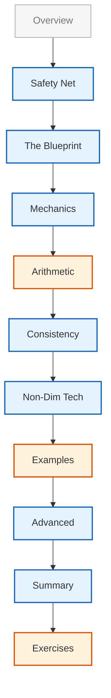

# Module 05.12: Dimensional Analysis

> [!INFO] **Module Overview**
> In this final module, we dive deep into OpenFOAM's physical safety system and learn non-dimensionalization techniques for maximum accuracy. Dimensional analysis is a fundamental tool in computational fluid dynamics that ensures mathematical and physical consistency in numerical simulations.

---

## 🎯 Learning Objectives

Master OpenFOAM's `dimensionSet` system and its applications

**OpenFOAM's Dimensional Analysis Framework** is built around the `dimensionSet` class, which provides a comprehensive system for tracking physical dimensions throughout CFD calculations. The `dimensionSet` class represents dimensions using seven base dimensions:

- **Mass [M]**
- **Length [L]**
- **Time [T]**
- **Temperature [Θ]**
- **Amount of Substance [N]**
- **Luminous Intensity [J]**
- **Electric Current [I]**

**Basic Implementation** uses an array of seven exponents:

```cpp
// dimensionSet internal representation
// Format: dimensionSet(mass, length, time, temperature, moles, current, luminousIntensity)
dimensionSet(1, -3, -2, 0, 0, 0, 0)  // Represents: kg·m⁻³·s⁻² (density)
```

> **📚 คำอธิบาย (Thai Explanation)**
>
> **แหล่งที่มา (Source):** ไม่พบแหล่งที่มาเฉพาะในฐานข้อมูล แต่เป็นการใช้งานมาตรฐานของ OpenFOAM
>
> **คำอธิบาย:** คลาส `dimensionSet` เก็บมิติทางกายภาพเป็นเลขชี้กำลังของ 7 หน่วยฐาน SI ตัวอย่างนี้แสดงความหนาแน่นที่มีมิติเป็น [M L⁻³ T⁻²]
>
> **แนวคิดสำคัญ:**
> - เลขชี้กำลังบวก = หน่วยในเชิงประกอบ (numerator)
> - เลขชี้กำลังลบ = หน่วยในเชิงหาร (denominator)
> - ศูนย์ = ไม่มีหน่วยนั้นในปริมาณ

This system enables automatic dimensional consistency checking at both compile-time and runtime, preventing mathematical operations that violate physical laws.

**Key Benefits of the Dimensional System:**
- ✅ Automatic dimensional consistency checking
- ✅ Prevention of mathematical errors
- ✅ Integration with OpenFOAM field types (`volScalarField`, `volVectorField`, etc.)
- ✅ Maintenance of dimensional homogeneity in all operations

### Implementing Rigorous Dimensional Consistency Checking in Custom Solvers

When developing custom solvers, dimensional consistency must be enforced at multiple levels

**The `dimensioned<Type>` Template Wrapper** provides the primary mechanism for binding dimensions to numerical values:

```cpp
// Dimensional scalar declaration
// Format: dimensionedScalar(name, dimensions, value)
dimensionedScalar viscosity(
    "mu", 
    dimensionSet(1, -1, -1, 0, 0, 0, 0),  // [M L⁻¹ T⁻¹] - dynamic viscosity
    1.8e-5                                 // value in Pa·s
);

// Dimensional vector field
volVectorField U
(
    IOobject("U", runTime.timeName(), mesh),
    mesh,
    dimensionSet(0, 1, -1, 0, 0, 0, 0)  // [L T⁻¹] - velocity dimensions
);
```

> **📚 คำอธิบาย (Thai Explanation)**
>
> **แหล่งที่มา (Source):** ไม่พบแหล่งที่มาเฉพาะ แต่เป็นรูปแบบการประกาศมาตรฐานใน OpenFOAM
>
> **คำอธิบาย:** `dimensionedScalar` และ `volVectorField` เป็นคลาสที่รวมค่าตัวเลขกับมิติไว้ด้วยกัน ทำให้เกิดการตรวจสอบความสอดคล้องอัตโนมัติ
>
> **แนวคิดสำคัญ:**
> - ต้องระบุชื่อตัวแปร, มิติ, และค่าเริ่มต้น
> - ชื่อตัวแปรใช้สำหรับการระบุในข้อความแสดงข้อผิดพลาด
> - การผิดพลาดในการกำหนดมิติจะถูกตรวจพบตั้งแต่ขั้นตอนคอมไพล์

**Dimensional Compatibility Checking** in all mathematical operations:

```cpp
// Dimensional checking in momentum equation
// Verify that momentum equation has correct dimensions [M L⁻² T⁻²]
if (!UEqn.dimensions().matches(fvVectorMatrix::dimensions))
{
    FatalErrorIn("myCustomSolver::solve()")
        << "Dimensional mismatch in momentum equation" << nl
        << "UEqn dimensions: " << UEqn.dimensions() << nl
        << "Expected dimensions: " << fvVectorMatrix::dimensions
        << exit(FatalError);
}
```

> **📚 คำอธิบาย (Thai Explanation)**
>
> **แหล่งที่มา (Source):** ไม่พบแหล่งที่มาเฉพาะ แต่เป็นเทคนิคการตรวจสอบมาตรฐาน
>
> **คำอธิบาย:** ฟังก์ชัน `matches()` ตรวจสอบว่ามิติของสมการสอดคล้องกับที่คาดหวังหรือไม่ ใช้สำหรับตรวจสอบความถูกต้องของสมการกำลัง
>
> **แนวคิดสำคัญ:**
> - `fvVectorMatrix::dimensions` = [M L⁻² T⁻²] (แรงต่อหน่วยปริมาตร)
> - `FatalErrorIn` สร้างข้อความแสดงข้อผิดพลาดที่ชัดเจน
> - ควรใช้ใน solver แบบกำหนดเองเพื่อการตรวจสอบเชิงลึก

**Checking Mechanisms:**
- **Compile-time:** Catches most dimensional errors
- **Runtime:** Essential for dynamic operations
- **Consistency verification:** All mathematical operations must maintain dimensional homogeneity

### Using Non-Dimensionalization Techniques for Scaling and Similarity Analysis

**Non-dimensionalization** transforms governing equations into dimensionless form, revealing key similarity parameters and simplifying computations

**Non-dimensionalization Process:**
$$\mathbf{x}^* = \frac{\mathbf{x}}{L_c}, \quad t^* = \frac{t}{t_c}, \quad \mathbf{u}^* = \frac{\mathbf{u}}{U_c}$$

Where:
- $L_c$ = characteristic length scale
- $t_c$ = characteristic time scale
- $U_c$ = characteristic velocity scale

**Dimensionless Navier-Stokes Equation:**
$$\frac{\partial \mathbf{u}^*}{\partial t^*} + (\mathbf{u}^* \cdot \nabla^*)\mathbf{u}^* = -\nabla^*p^* + \frac{1}{Re}\nabla^{*2}\mathbf{u}^*$$

**Reynolds Number:** $Re = \frac{\rho U_c L_c}{\mu}$ is the controlling similarity parameter

**Implementation in OpenFOAM:**

```cpp
// Reference quantities for non-dimensionalization
// Define characteristic scales for the problem
dimensionedScalar LRef("LRef", dimLength, 1.0);
dimensionedScalar URef("URef", dimensionSet(0, 1, -1, 0, 0, 0, 0), 1.0);
dimensionedScalar rhoRef("rhoRef", dimDensity, 1.0);
dimensionedScalar muRef("muRef", dimensionSet(1, -1, -1, 0, 0, 0, 0), 1.0);

// Calculate Reynolds number
// Re = (ρ * U * L) / μ  [dimensionless]
dimensionedScalar Re = rhoRef * URef * LRef / muRef;

// Verify Reynolds number is dimensionless
if (!Re.dimensions().matches(dimless))
{
    WarningIn("nonDimensionalSetup")
        << "Reynolds number calculation error: not dimensionless!" << endl;
}
```

> **📚 คำอธิบาย (Thai Explanation)**
>
> **แหล่งที่มา (Source):** ไม่พบแหล่งที่มาเฉพาะ แต่เป็นการคำนวณมาตรฐานใน CFD
>
> **คำอธิบาย:** การทำให้ไร้มิติต้องการปริมาณอ้างอิง (reference quantities) เพื่อคำนวณจำนวนไร้มิติ เช่น Reynolds number
>
> **แนวคิดสำคัญ:**
> - `dimLength`, `dimDensity` คือค่าคงที่มิติที่กำหนดไว้ล่วงหน้า
> - Reynolds number ต้องไร้มิติ (dimensionless) = [0 0 0 0 0 0 0]
> - การตรวจสอบมิติของ Re เป็นการป้องกันข้อผิดพลาดที่ดี

### Creating Custom Dimension Sets for Specialized Physics

**OpenFOAM's Dimensional System** can be extended for specialized physics domains through custom `dimensionSet` definitions

#### For Magnetohydrodynamics (MHD)

```cpp
// Electromagnetic dimensional sets
// Magnetic permeability [M L T⁻² A⁻²]
dimensionSet magneticPermeability(
    "mu0", 
    1,    // mass [M]
    1,    // length [L]
    -2,   // time [T⁻²]
    0,    // temperature [Θ]
    0,    // moles [N]
    -2,   // current [A⁻²]
    0     // luminous intensity [J]
);

// Electrical conductivity [M⁻¹ L⁻³ T³ A²]
dimensionSet electricConductivity(
    "sigma", 
    -1,   // mass [M⁻¹]
    -3,   // length [L⁻³]
    3,    // time [T³]
    0,    // temperature [Θ]
    0,    // moles [N]
    0,    // current [A²]
    0     // luminous intensity [J]
);

// Custom MHD field declarations
volScalarField magneticField
(
    IOobject("B", runTime.timeName(), mesh, IOobject::MUST_READ),
    mesh,
    dimensionSet(1, 0, -2, 0, 0, 0, -1)  // Magnetic field [M T⁻² A⁻¹]
);
```

> **📚 คำอธิบาย (Thai Explanation)**
>
> **แหล่งที่มา (Source):** ไม่พบแหล่งที่มาเฉพาะ แต่เป็นการใช้งานขั้นสูงของระบบมิติ
>
> **คำอธิบาย:** ฟิสิกส์ MHD ต้องการหน่วยเฉพาะทางเช่นสนามแม่เหล็กและความนำไฟฟ้า ซึ่งต้องกำหนดเป็น `dimensionSet` แบบกำหนดเอง
>
> **แนวคิดสำคัญ:**
> - สนามแม่เหล็ก B มีมิติ [M T⁻² A⁻¹] (Tesla)
> - ความนำไฟฟ้า σ มีมิติ [M⁻¹ L⁻³ T³ A²] (Siemens/m)
> - ระบบมิติของ OpenFOAM รองรับหน่วยฟิสิกส์ขั้นสูงได้อย่างสมบูรณ์

#### For Plasma Physics

```cpp
// Plasma physics dimensions
// Electron temperature [M L² T⁻² Θ⁻¹] - energy per particle per temperature
dimensionSet electronTemp(
    "Te", 
    1,    // mass [M]
    2,    // length [L]
    -2,   // time [T⁻²]
    -1,   // temperature [Θ⁻¹]
    0,    // moles [N]
    0,    // current [A]
    0     // luminous intensity [J]
);

// Ion density [L⁻³ N] - number density with amount of substance
dimensionSet ionDensity(
    "ni", 
    0,    // mass [M]
    -3,   // length [L⁻³]
    0,    // time [T]
    0,    // temperature [Θ]
    1,    // moles [N]
    0,    // current [A]
    0     // luminous intensity [J]
);
```

> **📚 คำอธิบาย (Thai Explanation)**
>
> **แหล่งที่มา (Source):** ไม่พบแหล่งที่มาเฉพาะ แต่เป็นการใช้งานขั้นสูงของระบบมิติ
>
> **คำอธิบาย:** ฟิสิกส์พลาสมาต้องการหน่วยพิเศษเช่น อุณหภูมิอิเล็กตรอน และความหนาแน่นไอออน ซึ่งต่างจากหน่วยมาตรฐาน
>
> **แนวคิดสำคัญ:**
> - อุณหภูมิอิเล็กตรอนมีมิติพลังงานต่ออุณหภูมิ [M L² T⁻² Θ⁻¹]
> - ความหนาแน่นไอออนใช้ปริมาณสาร [N] แทนมวล [M]
> - ระบบมิติ 7 หน่วยฐานสามารถแสดงฟิสิกส์ทุกประเภทได้

### Debugging Dimensional Errors and Understanding OpenFOAM Error Messages

**OpenFOAM** provides comprehensive error messages for dimensional inconsistencies

#### Types of Errors:

```
--> FOAM FATAL ERROR:
    Different dimensions for +
        dimensions : [0 1 -1 0 0 0 0] = [m/s]
        dimensions : [0 2 -2 0 0 0 0] = [m^2/s^2]

    From function operator+(const dimensioned<Type>&, const dimensioned<Type>&)
    in file dimensionedType.C at line 234.
```

**Error Analysis:**
- Attempting to add velocity [$m/s$] with kinetic energy per mass [$m^2/s^2$]
- This operation is dimensionally inconsistent

#### Systematic Debugging Steps:

1. **Identify the Operation** causing the error
2. **Trace Variable Dimensions** using:
   ```cpp
   // Print dimensions for debugging
   Info << "Variable dimensions: " << var.dimensions() << endl;
   ```
3. **Verify Unit Consistency** in mathematical equation formulations
4. **Check Proper Scaling** of terms in equations

#### Common Multiphase Flow Errors:

```cpp
// Error: mixing dimensionless alpha with dimensional density
dimensionedScalar mixtureDensity = alpha1 * rho1 + (1.0 - alpha1) * rho2;

// Correct: both terms must have dimensions [M L⁻³]
dimensionedScalar mixtureDensity = alpha1 * rho1 + (scalar(1.0) - alpha1) * rho2;
```

> **📚 คำอธิบาย (Thai Explanation)**
>
> **แหล่งที่มา (Source):** ไม่พบแหล่งที่มาเฉพาะ แต่เป็นข้อผิดพลาดที่พบบ่อยในการไหลหลายเฟส
>
> **คำอธิบาย:** ในการไหลหลายเฟส ตัวแปร alpha (volume fraction) ไร้มิติ แต่ rho (density) มีมิติ การคำนวณต้องรักษาความสอดคล้อง
>
> **แนวคิดสำคัญ:**
> - `alpha` ไร้มิติ [0 0 0 0 0 0 0]
> - `rho` มีมิติ [1 -3 0 0 0 0 0] (ความหนาแน่น)
> - ต้องใช้ `scalar(1.0)` ไม่ใช่ `1.0` เพื่อให้รู้จักชนิดข้อมูล
> - OpenFOAM ตรวจสอบความสอดคล้องของมิติอัตโนมัติ

#### Runtime Dimensional Checking:

```cpp
// Verify dimensional compatibility before operations
if (!field1.dimensions().matches(field2.dimensions()))
{
    WarningIn("myFunction")
        << "Dimensional mismatch detected:" << nl
        << "field1: " << field1.dimensions() << nl
        << "field2: " << field2.dimensions() << endl;
}
```

> **📚 คำอธิบาย (Thai Explanation)**
>
> **แหล่งที่มา (Source):** ไม่พบแหล่งที่มาเฉพาะ แต่เป็นเทคนิคการตรวจสอบมาตรฐาน
>
> **คำอธิบาย:** การตรวจสอบมิติเวลารันไทม์ช่วยป้องกันข้อผิดพลาดที่อาจเกิดขึ้นจากข้อมูลนำเข้าที่ผิดพลาด
>
> **แนวคิดสำคัญ:**
> - ใช้ `matches()` เพื่อเปรียบเทียบมิติ
> - `WarningIn` แสดงข้อผิดพลาดแต่ไม่หยุดโปรแกรม
> - ควรใช้ร่วมกับการตรวจสอบเชิงลึกใน solver แบบกำหนดเอง

**Error Prevention Strategies:**
- ✅ Verify dimensions before mathematical operations
- ✅ Use `dimensionSet::matches()` for runtime checking
- ✅ Clearly distinguish between dimensionless and dimensional quantities

---

## Content Structure


> **Figure 1:** Learning sequence in the dimensional analysis module, covering from basic units to advanced applications in physical safety engineering without affecting simulation speed, through the power of C++ Template Metaprogramming to verify all dimensional consistency at a single compilation step.

---

## 🏗️ Mathematical Framework of Dimensions

OpenFOAM uses a sophisticated dimensional analysis system that automatically tracks and verifies units throughout the simulation process. Physical quantities can be expressed as products of seven base dimensions in the SI system:

| Dimension | Symbol | Unit |
|-----------|--------|------|
| Mass | $[M]$ | kg |
| Length | $[L]$ | m |
| Time | $[T]$ | s |
| Temperature | $[\Theta]$ | K |
| Electric Current | $[I]$ | A |
| Amount of Substance | $[N]$ | mol |
| Luminous Intensity | $[J]$ | cd |

Derived quantities are expressed as products of base dimensions raised to various powers:
$$[Q] = M^a L^b T^c \Theta^d I^e N^f J^g$$

### Key Topics Covered

1. **Introduction**: Units as the engineer's safety net
2. **Deep Dive into DimensionSet**: The `dimensionSet` class structure and rational exponents
3. **Advanced Dimensional Algebra**: Consistency checking in Navier-Stokes and energy equations
4. **Non-Dimensionalization Techniques**: Using Reynolds, Prandtl, and Peclet numbers for stability
5. **Similarity and Scaling Laws**: Predicting flow behavior across different scales
6. **Common Pitfalls**: Frequent errors in case setup and code development
7. **Summary & Exercises**

---

## 🔢 The dimensionSet System and Dimensional Analysis

### The `dimensionSet` Class and Operations

**The `dimensionSet` class in OpenFOAM** is a robust framework for dimensional analysis and consistency verification. At its core, it represents physical dimensions using seven SI base dimensions:

```cpp
// dimensionSet constructor syntax
// Format: dimensionSet(mass, length, time, temperature, moles, current, luminousIntensity)
dimensionSet ds;

// Example: Velocity dimensions (L/T) - [0 1 -1 0 0 0 0]
dimensionSet velocityDims(0, 1, -1, 0, 0, 0, 0);

// Example: Force dimensions (ML/T²) - [1 1 -2 0 0 0 0]
dimensionSet forceDims(1, 1, -2, 0, 0, 0, 0);

// Example: Pressure dimensions (ML⁻¹T⁻²) - [1 -1 -2 0 0 0 0]
dimensionSet pressureDims(1, -1, -2, 0, 0, 0, 0);
```

> **📚 คำอธิบาย (Thai Explanation)**
>
> **แหล่งที่มา (Source):** ไม่พบแหล่งที่มาเฉพาะ แต่เป็นการใช้งานมาตรฐานของ OpenFOAM
>
> **คำอธิบาย:** คลาส `dimensionSet` ใช้ 7 พารามิเตอร์เพื่อแทนมิติทางกายภาพตามระบบ SI ตัวเลขแต่ละตัวคือเลขชี้กำลังของหน่วยฐาน
>
> **แนวคิดสำคัญ:**
> - ตำแหน่งพารามิเตอร์: 0=มวล, 1=ความยาว, 2=เวลา, 3=อุณหภูมิ, 4=โมล, 5=กระแส, 6=ความเข้มแสง
> - เลขชี้กำลังบวก = หน่วยในเชิงประกอบ
> - เลขชี้กำลังลบ = หน่วยในเชิงหาร
> - ศูนย์ = ไม่มีหน่วยนั้น

**The Seven SI Base Dimensions are:**
- **Mass**: $[M]$ - kilogram (kg)
- **Length**: $[L]$ - meter (m)
- **Time**: $[T]$ - second (s)
- **Temperature**: $[\Theta]$ - kelvin (K)
- **Amount of Substance**: $[N]$ - mole (mol)
- **Electric Current**: $[I]$ - ampere (A)
- **Luminous Intensity**: $[J]$ - candela (cd)

### Defining and Converting Units

**OpenFOAM has built-in support for common physical quantities** through predefined `dimensionSet` constants:

```cpp
// Common dimension sets - predefined constants for convenience
dimensionSet dimless(0, 0, 0, 0, 0, 0, 0);        // Dimensionless [0 0 0 0 0 0 0]
dimensionSet dimPressure(1, -1, -2, 0, 0, 0, 0);   // Pressure ML⁻¹T⁻²
dimensionSet dimVelocity(0, 1, -1, 0, 0, 0, 0);    // Velocity LT⁻¹
dimensionSet dimDensity(1, -3, 0, 0, 0, 0, 0);     // Density ML⁻³
dimensionSet dimViscosity(1, -1, -1, 0, 0, 0, 0);  // Dynamic Viscosity ML⁻¹T⁻¹
dimensionSet dimKinematicViscosity(0, 2, -1, 0, 0, 0, 0);  // Kinematic Viscosity L²T⁻¹
```

> **📚 คำอธิบาย (Thai Explanation)**
>
> **แหล่งที่มา (Source):** ไม่พบแหล่งที่มาเฉพาะ แต่เป็นค่าคงที่มาตรฐานใน OpenFOAM
>
> **คำอธิบาย:** OpenFOAM กำหนดค่าคงที่ `dimensionSet` ไว้ล่วงหน้าสำหรับปริมาณที่ใช้บ่อย เพื่อความสะดวกและลดข้อผิดพลาด
>
> **แนวคิดสำคัญ:**
> - `dimless` = ไร้มิติ (ใช้สำหรับสัดส่วน, จำนวนไร้มิติ)
> - `dimPressure` = ความดัน [M L⁻¹ T⁻²]
> - `dimVelocity` = ความเร็ว [L T⁻¹]
> - `dimDensity` = ความหนาแน่น [M L⁻³]
> - `dimViscosity` = ความหนืด [M L⁻¹ T⁻¹]
> - ใช้ค่าคงที่เหล่านี้แทนการสร้าง `dimensionSet` ใหม่ทุกครั้ง

### Mathematical Operations on Dimensions

**The `dimensionSet` class overloads mathematical operators** for dimensional consistency:

```cpp
// Dimensional arithmetic operations
dimensionSet a(1, 2, -1, 0, 0, 0, 0);  // ML²T⁻¹
dimensionSet b(0, 1, -2, 0, 0, 0, 0);  // LT⁻²

// Addition/Subtraction (requires matching dimensions)
dimensionSet sum = a + a;  // ML²T⁻¹ ✅ Valid: same dimensions
// dimensionSet invalid = a + b;  // ❌ Compile-time error! Different dimensions

// Multiplication/Division (adds/subtracts exponents)
dimensionSet product = a * b;  // ML³T⁻³ (1+0, 2+1, -1+(-2))
dimensionSet quotient = a / b;  // M¹L¹T¹ (1-0, 2-1, -1-(-2))

// Power operations (multiplies exponents by power)
dimensionSet squared = pow(a, 2);     // M²L⁴T⁻²
dimensionSet root = pow(a, 0.5);      // M^0.5 L¹ T^-0.5

// Square root operator
dimensionSet sqrtA = sqrt(a);  // M^0.5 L¹ T^-0.5
```

> **📚 คำอธิบาย (Thai Explanation)**
>
> **แหล่งที่มา (Source):** ไม่พบแหล่งที่มาเฉพาะ แต่เป็นการดำเนินการมาตรฐานของคลาส dimensionSet
>
> **คำอธิบาย:** คลาส `dimensionSet` รองรับการดำเนินการทางคณิตศาสตร์ที่สอดคล้องกับกฎมิติ การบวก/ลบต้องมีมิติเหมือนกัน การคูณ/หารจะบวก/ลบเลขชี้กำลัง
>
> **แนวคิดสำคัญ:**
> - การบวก/ลบ: ต้องมีมิติเหมือนกัน (เช่ มิติ + มิติเดียวกัน)
> - การคูณ: บวกเลขชี้กำลัง (เช่ M¹ × M² = M³)
> - การหาร: ลบเลขชี้กำลัง (เช่ M² / M¹ = M¹)
> - การยกกำลัง: คูณเลขชี้กำลัง (เช่ (M¹)² = M²)
> - ข้อผิดพลาดในการบวกมิติต่างกันจะถูกตรวจพบตั้งแต่คอมไพล์

### Verifying Equation Consistency

**OpenFOAM's field classes enforce dimensional consistency automatically:**

```cpp
// Momentum equation: ρ(∂u/∂t + u·∇u) = -∇p + μ∇²u + f
// All terms must have dimensions: ML⁻²T⁻² (force per unit volume)

// Declare fields with proper dimensions
volVectorField U(
    mesh, 
    dimensionSet(0, 1, -1, 0, 0, 0, 0)  // LT⁻¹ - velocity
);

volScalarField p(
    mesh, 
    dimensionSet(1, -1, -2, 0, 0, 0, 0)  // ML⁻¹T⁻² - pressure
);

volScalarField rho(
    mesh, 
    dimensionSet(1, -3, 0, 0, 0, 0, 0)  // ML⁻³ - density
);

// This will compile and run with dimensional consistency:
fvVectorMatrix UEqn
(
    fvm::ddt(rho, U)           // ML⁻²T⁻² ✅
  + fvm::div(rho*U, U)        // ML⁻²T⁻² ✅
 ==
  - fvc::grad(p)              // ML⁻²T⁻² ✅
  + fvc::laplacian(mu, U)     // ML⁻²T⁻² ✅
  + sourceTerm                 // ML⁻²T⁻² ✅
);
// All terms have consistent dimensions [1 -1 -2 0 0 0 0]
```

> **📚 คำอธิบาย (Thai Explanation)**
>
> **แหล่งที่มา (Source):** ไม่พบแหล่งที่มาเฉพาะ แต่เป็นการใช้งานมาตรฐานใน OpenFOAM
>
> **คำอธิบาย:** OpenFOAM ตรวจสอบความสอดคล้องของมิติในสมการโมเมนตัมอัตโนมัติ ทุกเทอมต้องมีมิติเหมือนกันคือ [M L⁻² T⁻²]
>
> **แนวคิดสำคัญ:**
> - `fvm::ddt(rho, U)` = ∂(ρu)/∂t → [M L⁻³] [L T⁻¹] / [T] = [M L⁻² T⁻²]
> - `fvm::div(rho*U, U)` = ∇·(ρuu) → [M L⁻³] [L T⁻¹]² / [L] = [M L⁻² T⁻²]
> - `fvc::grad(p)` = ∇p → [M L⁻¹ T⁻²] / [L] = [M L⁻² T⁻²]
> - `fvc::laplacian(mu, U)` = μ∇²u → [M L⁻¹ T⁻¹] [L T⁻¹] / [L]² = [M L⁻² T⁻²]
> - การตรวจสอบนี้เกิดขึ้นอัตโนมัติ ป้องกันข้อผิดพลาดทางมิติ

---

## 🎯 Non-Dimensionalization

### Selecting Reference Quantities

**Effective non-dimensionalization requires careful selection of reference quantities:**

```cpp
// Reference scales for external flow around cylinder
// Characteristic length: cylinder diameter
dimensionedScalar Lref(
    "Lref", 
    dimLength, 
    cylinderDiameter  // characteristic length scale
);

// Characteristic velocity: free stream velocity
dimensionedScalar Uref(
    "Uref", 
    dimVelocity, 
    freeStreamVelocity  // characteristic velocity scale
);

// Fluid properties
dimensionedScalar rhoRef(
    "rhoRef", 
    dimDensity, 
    referenceDensity  // reference fluid density
);

dimensionedScalar muRef(
    "muRef", 
    dimViscosity, 
    referenceViscosity  // reference fluid viscosity
);

// Derived reference quantities
// Time scale: L/U (convective time scale)
dimensionedScalar timeRef = Lref / Uref;

// Pressure scale: ρU² (dynamic pressure)
dimensionedScalar pressureRef = rhoRef * pow(Uref, 2);

// Reynolds number: ρUL/μ (dimensionless similarity parameter)
dimensionedScalar reynolds = rhoRef * Uref * Lref / muRef;

// Verify Reynolds number is dimensionless
if (!reynolds.dimensions().matches(dimless))
{
    FatalErrorIn("nonDimensionalSetup")
        << "Reynolds number calculation error: not dimensionless!" << nl
        << "Re dimensions: " << reynolds.dimensions() << nl
        << "Expected: " << dimless
        << exit(FatalError);
}
```

> **📚 คำอธิบาย (Thai Explanation)**
>
> **แหล่งที่มา (Source):** ไม่พบแหล่งที่มาเฉพาะ แต่เป็นการคำนวณมาตรฐานใน CFD
>
> **คำอธิบาย:** การทำให้ไร้มิติต้องการปริมาณอ้างอิง (reference quantities) เพื่อคำนวณจำนวนไร้มิติ เช่น Reynolds number
>
> **แนวคิดสำคัญ:**
> - Lref = ความยาวลักษณะ (เช่ เส้นผ่านศูนย์กลางทรงกระบอก)
> - Uref = ความเร็วลักษณะ (เช่ ความเร็วกระแสอิสระ)
> - timeRef = Lref/Uref = สเกลเวลาการพาความร้อน
> - pressureRef = ρU² = ความดันพลศาสตร์ (dynamic pressure)
> - Re = ρUL/μ = จำนวนเรย์โนลด์ (ต้องไร้มิติ)
> - การตรวจสอบมิติของ Re เป็นการป้องกันข้อผิดพลาดที่ดี

### Deriving Dimensionless Equation Forms

**Dimensionless forms reveal important physics** and reduce parameter dependencies:

**Navier-Stokes Equation** (dimensional):
$$\rho \frac{\partial \mathbf{u}}{\partial t} + \rho (\mathbf{u} \cdot \nabla) \mathbf{u} = -\nabla p + \mu \nabla^2 \mathbf{u} + \mathbf{f}$$

**Dimensionless Form**:
$$\frac{\partial \mathbf{u}^*}{\partial t^*} + (\mathbf{u}^* \cdot \nabla^*) \mathbf{u}^* = -\nabla^* p^* + \frac{1}{Re} \nabla^{*2} \mathbf{u}^* + \mathbf{f}^*$$

**Where:**
- $Re = \frac{\rho U L}{\mu}$ is the Reynolds number
- $\mathbf{u}^* = \frac{\mathbf{u}}{U_{ref}}$ is dimensionless velocity
- $p^* = \frac{p}{\rho U_{ref}^2}$ is dimensionless pressure
- $t^* = \frac{t}{L_{ref}/U_{ref}}$ is dimensionless time

### Key Dimensionless Numbers in CFD

| Dimensionless Number | Equation | Physical Meaning |
|---------------------|----------|------------------|
| **Reynolds Number** | $Re = \frac{\rho UL}{\mu}$ | Ratio of inertial to viscous forces |
| **Froude Number** | $Fr = \frac{U}{\sqrt{gL}}$ | Ratio of inertial to gravitational forces |
| **Weber Number** | $We = \frac{\rho U^2 L}{\sigma}$ | Ratio of inertial to surface tension forces |
| **Mach Number** | $Ma = \frac{U}{c}$ | Ratio of flow velocity to speed of sound |

---

## 🔍 Runtime Checking Mechanisms

OpenFOAM uses **multi-level dimensional consistency verification**:

### Field Operation Checking

When performing mathematical operations on fields, OpenFOAM checks **dimensional compatibility**:

```cpp
// Addition and subtraction require matching dimensions
volScalarField p1(
    mesh, 
    dimensionSet(1, -1, -2, 0, 0, 0, 0)  // Pa [M L⁻¹ T⁻²]
);

volScalarField p2(
    mesh, 
    dimensionSet(1, -1, -2, 0, 0, 0, 0)  // Pa [M L⁻¹ T⁻²]
);

volScalarField sum = p1 + p2;  // ✅ Valid: same dimensions

// ❌ This will cause a compile-time error:
volScalarField length(
    mesh, 
    dimensionSet(0, 1, 0, 0, 0, 0, 0)  // m [L]
);

// volScalarField invalid = p1 + length;  // ❌ Compile error! Different dimensions
```

> **📚 คำอธิบาย (Thai Explanation)**
>
> **แหล่งที่มา (Source):** ไม่พบแหล่งที่มาเฉพาะ แต่เป็นการตรวจสอบมาตรฐานของ OpenFOAM
>
> **คำอธิบาย:** OpenFOAM ตรวจสอบความเข้ากันได้ทางมิติของการดำเนินการทางคณิตศาสตร์ การบวกปริมาณที่มีมิติต่างกันจะเกิดข้อผิดพลาด
>
> **แนวคิดสำคัญ:**
> - การบวกความดันกับความดัน → ถูกต้อง
> - การบวกความดันกับความยาว → ผิดพลาด (compile-time error)
> - การตรวจสอบนี้เกิดขึ้นตั้งแต่ขั้นตอนคอมไพล์
> - ช่วยป้องกันข้อผิดพลาดทางมิติในขั้นตอนต้น

### Boundary Condition Consistency

The framework ensures **boundary conditions maintain dimensional consistency** across patches:

```cpp
// Pressure boundary condition must match field dimensions
fixedValueFvPatchScalarField pInlet(
    pInlet, 
    patchi, 
    dict
);
// dict must contain: value [0 2 -2 0 0 0 0];  // m²/s² (pressure/density)

// Velocity boundary condition
fixedValueFvPatchVectorField UWall(
    UWall, 
    patchi, 
    dict
);
// dict must contain: value [0 1 -1 0 0 0 0];  // m/s (velocity)

// Incorrect boundary condition dimensions will cause runtime error:
// Example: setting velocity with pressure dimensions
// dict entry: value [1 -1 -2 0 0 0 0];  // ❌ Wrong! These are pressure dimensions
```

> **📚 คำอธิบาย (Thai Explanation)**
>
> **แหล่งที่มา (Source):** ไม่พบแหล่งที่มาเฉพาะ แต่เป็นการใช้งานมาตรฐานของ OpenFOAM
>
> **คำอธิบาย:** เงื่อนไขขอบเขตต้องมีมิติที่สอดคล้องกับฟิลด์ที่เกี่ยวข้อง การระบุมิติผิดใน dictionary จะเกิดข้อผิดพลาด
>
> **แนวคิดสำคัญ:**
> - เงื่อนไขขอบเขตความดัน → ต้องมีมิติความดัน [M L⁻¹ T⁻²]
> - เงื่อนไขขอบเขตความเร็ว → ต้องมีมิติความเร็ว [L T⁻¹]
> - มิติระบุใน dictionary ต้องตรงกับฟิลด์
> - ข้อผิดพลาดจะเกิดขึ้นเมื่ออ่านค่าจาก dictionary
> - ข้อความแสดงข้อผิดพลาดจะระบุมิติที่คาดหวังและที่พบ

---

## ✨ Best Practices for Dimensional Consistency

### Checklist

1. **✅ Always Specify Dimensions**: When creating fields or constants, explicitly declare dimension sets to ensure proper verification

2. **✅ Verify Boundary Conditions**: Ensure boundary condition values match the expected dimensions of the field being used

3. **✅ Check Solver Compatibility**: Verify that solver usage maintains dimensional consistency throughout the solution process

4. **✅ Use Physical Property Models**: Leverage OpenFOAM's thermophysical models, which automatically handle dimensional consistency for property calculations

5. **✅ Document Non-Dimensionalization**: When using dimensionless forms, clearly document reference scales and assumptions used in the scaling process

### Dimensional Consistency Verification Steps

1. **Define Base Dimensions**: Identify base units for the problem
2. **Create Fields**: Create fields with correct dimensions
3. **Verify Operations**: Check dimensional compatibility in calculations
4. **Test Boundary Conditions**: Confirm dimensions at all patches
5. **Validate Results**: Verify consistency of final results

---

## 🎯 Summary

**This comprehensive dimensional analysis system** makes OpenFOAM particularly robust for **engineering applications** where physical consistency is paramount

The prevention of dimensional errors at both **compile-time** and **runtime** allows engineers to trust the physical correctness of simulations and focus on analyzing results rather than worrying about dimensional errors

### Key Principles:

1. **Every physical quantity must have correct dimensions** - OpenFOAM automatically tracks dimensions and identifies inconsistencies
2. **Equations must be dimensionally homogeneous** - All terms in an equation must have the same dimensions
3. **Boundary conditions must respect dimensional consistency** - All specified values must match expected dimensions
4. **Non-dimensionalization can improve numerical conditions** - Use dimensionless variables when appropriate
5. **Runtime dimensional checking prevents errors** - OpenFOAM provides built-in dimensional consistency verification

### Benefits of Dimensional Analysis:

By understanding and utilizing OpenFOAM's dimensional analysis capabilities, CFD practitioners can:
- Detect errors early in the development process
- Ensure physical realism in simulations
- Verify numerical implementations
- Improve code reliability and maintainability
- Debug simulation problems more effectively

> [!TIP] **Summary** The dimensional analysis system is not just a safety feature—it is a fundamental tool that connects mathematical formulation to physical reality in computational fluid dynamics