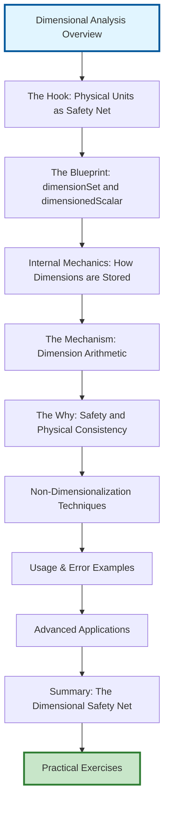

# โมดูล 05.12: การวิเคราะห์มิติ (Dimensional Analysis)

> [!INFO] **ภาพรวมโมดูล**
> ในบทสุดท้ายของโมดูลนี้ เราจะเจาะลึกระบบรักษาความปลอดภัยทางฟิสิกส์ของ OpenFOAM และเรียนรู้เทคนิคการทำให้สมการไร้มิติ (Non-dimensionalization) เพื่อความแม่นยำสูงสุด การวิเคราะห์มิติเป็นเครื่องมือพื้นฐานในพลศาสตร์ของไหลเชิงคำนวณที่ทำให้มั่นใจได้ถึงความสอดคล้องทางคณิตศาสตร์และความเป็นจริงทางกายภาพในการจำลองเชิงตัวเลข

---

## 🎯 วัตถุประสงค์การเรียนรู้

เชี่ยวชาญระบบ `dimensionSet` ของ OpenFOAM และการนำไปใช้งาน

**กรอบการวิเคราะห์มิติของ OpenFOAM** สร้างขึ้นจากคลาส `dimensionSet` ซึ่งให้ระบบที่ครอบคลุมสำหรับติดตามมิติทางกายภาพตลอดการคำนวณ CFD คลาส `dimensionSet` แสดงถึงมิติโดยใช้พื้นฐานเจ็ดมิติ:

- **มวล [M]**
- **ความยาว [L]**
- **เวลา [T]**
- **อุณหภูมิ [Θ]**
- **ปริมาณของสาร [N]**
- **ความเข้มแสง [J]**
- **กระแสไฟฟ้า [I]**

**การนำไปใช้งานพื้นฐาน** ใช้อาร์เรย์ของเลขชี้กำลังเจ็ดตัว:

```cpp
// dimensionSet internal representation
dimensionSet(1, -3, -2, 0, 0, 0, 0)  // Represents: kg·m⁻³·s⁻² (density)
```

ระบบนี้เปิดใช้งานการตรวจสอบความสอดคล้องของมิติโดยอัตโนมัติระหว่างการคอมไพล์และรันไทม์ ป้องกันการดำเนินการทางคณิตศาสตร์ที่ละเมิดกฎฟิสิกส์

**ประโยชน์หลักของระบบมิติ:**
- ✅ การตรวจสอบความสอดคล้องของมิติอัตโนมัติ
- ✅ การป้องกันข้อผิดพลาดทางคณิตศาสตร์
- ✅ การทำงานร่วมกับประเภทฟิลด์ของ OpenFOAM (`volScalarField`, `volVectorField`, ฯลฯ)
- ✅ การรักษาความเป็นเนื้อเดียวกันของมิติในการดำเนินการทั้งหมด

### การนำไปใช้งานการตรวจสอบความสอดคล้องของมิติอย่างเข้มงวดใน Solver แบบกำหนดเอง

เมื่อพัฒนา solver แบบกำหนดเอง ความสอดคล้องของมิติต้องบังคับใช้ในหลายระดับ

**เทมเพลต wrapper `dimensioned<Type>`** ให้กลไกหลักสำหรับเชื่อมโยงมิติกับค่าตัวเลข:

```cpp
// Dimensional scalar declaration
dimensionedScalar viscosity("mu", dimensionSet(1, -1, -1, 0, 0, 0, 0), 1.8e-5);

// Dimensional vector field
volVectorField U
(
    IOobject("U", runTime.timeName(), mesh),
    mesh,
    dimensionSet(0, 1, -1, 0, 0, 0, 0)  // [L T⁻¹]
);
```

**การตรวจสอบความเข้ากันได้ของมิติ** ในการดำเนินการทางคณิตศาสตร์ทั้งหมด:

```cpp
// Dimensional checking in momentum equation
if (!UEqn.dimensions().matches(fvVectorMatrix::dimensions))
{
    FatalErrorIn("myCustomSolver::solve()")
        << "Dimensional mismatch in momentum equation" << nl
        << "UEqn dimensions: " << UEqn.dimensions() << nl
        << "Expected dimensions: " << fvVectorMatrix::dimensions
        << exit(FatalError);
}
```

**กลไกการตรวจสอบ:**
- **คอมไพล์ไทม์:** จับข้อผิดพลาดเกี่ยวกับมิติส่วนใหญ่
- **รันไทม์:** สำคัญสำหรับการดำเนินการไดนามิก
- **การตรวจสอบความสอดคล้อง:** การดำเนินการทางคณิตศาสตร์ทั้งหมดต้องรักษาความเป็นเนื้อเดียวกันของมิติ

### การใช้เทคนิคการทำให้ไร้มิติสำหรับการสเกลและการวิเคราะห์ความคล้ายคลึง

**การทำให้ไร้มิติ** แปลงสมการควบคุมเป็นรูปแบบไร้มิติ เผยให้เห็นพารามิเตอร์ความคล้ายคลึงหลักและลดความซับซ้อนของการคำนวณ

**กระบวนการทำให้ไร้มิติ:**
$$\mathbf{x}^* = \frac{\mathbf{x}}{L_c}, \quad t^* = \frac{t}{t_c}, \quad \mathbf{u}^* = \frac{\mathbf{u}}{U_c}$$

โดยที่:
- $L_c$ = สเกลความยาวลักษณะ
- $t_c$ = สเกลเวลาลักษณะ
- $U_c$ = สเกลความเร็วลักษณะ

**สมการ Navier-Stokes ไร้มิติ:**
$$\frac{\partial \mathbf{u}^*}{\partial t^*} + (\mathbf{u}^* \cdot \nabla^*)\mathbf{u}^* = -\nabla^*p^* + \frac{1}{Re}\nabla^{*2}\mathbf{u}^*$$

**จำนวนเรย์โนลด์:** $Re = \frac{\rho U_c L_c}{\mu}$ เป็นพารามิเตอร์ความคล้ายคลึงที่ควบคุม

**การนำไปใช้ใน OpenFOAM:**

```cpp
// Reference quantities for non-dimensionalization
dimensionedScalar LRef("LRef", dimLength, 1.0);
dimensionedScalar URef("URef", dimensionSet(0, 1, -1, 0, 0, 0, 0), 1.0);
dimensionedScalar rhoRef("rhoRef", dimDensity, 1.0);
dimensionedScalar muRef("muRef", dimensionSet(1, -1, -1, 0, 0, 0, 0), 1.0);

// Calculate Reynolds number
dimensionedScalar Re = rhoRef * URef * LRef / muRef;
```

### การสร้างชุดมิติแบบกำหนดเองสำหรับฟิสิกส์เฉพาะทาง

**ระบบมิติของ OpenFOAM** สามารถขยายสำหรับโดเมนฟิสิกส์เฉพาะทางผ่านคำนิยาม `dimensionSet` แบบกำหนดเอง

#### สำหรับ Magnetohydrodynamics (MHD)

```cpp
// Electromagnetic dimensional sets
dimensionSet magneticPermeability("mu0", 1, 1, -2, 0, 0, -2, 0);  // [M L T⁻² A⁻²]
dimensionSet electricConductivity("sigma", -1, -3, 3, 0, 0, 0, 2); // [M⁻¹ L⁻³ T³ A²]

// Custom MHD field declarations
volScalarField magneticField
(
    IOobject("B", runTime.timeName(), mesh, IOobject::MUST_READ),
    mesh,
    dimensionSet(1, 0, -2, 0, 0, 0, -1)  // Magnetic field [M T⁻² A⁻¹]
);
```

#### สำหรับฟิสิกส์พลาสมา

```cpp
// Plasma physics dimensions
dimensionSet electronTemp("Te", 1, 2, -2, -1, 0, 0, 0);  // [M L² T⁻² Θ⁻¹]
dimensionSet ionDensity("ni", 0, -3, 0, 0, 1, 0, 0);     // [L⁻³ N]
```

### การดีบักข้อผิดพลาดเกี่ยวกับมิติและการเข้าใจข้อความแสดงข้อผิดพลายของ OpenFOAM

**OpenFOAM** ให้ข้อความแสดงข้อผิดพลาดที่ครอบคลุมสำหรับความไม่สอดคล้องของมิติ

#### ข้อผิดพลาดประเภทต่างๆ:

```
--> FOAM FATAL ERROR:
    Different dimensions for +
        dimensions : [0 1 -1 0 0 0 0] = [m/s]
        dimensions : [0 2 -2 0 0 0 0] = [m^2/s^2]

    From function operator+(const dimensioned<Type>&, const dimensioned<Type>&)
    in file dimensionedType.C at line 234.
```

**การวิเคราะห์ข้อผิดพลาด:**
- พยายามบวกความเร็ว [$m/s$] กับพลังงานจลน์ต่อมวล [$m^2/s^2$]
- การดำเนินการนี้ไม่สอดคล้องทางมิติ

#### ขั้นตอนการดีบักเชิงระบบ:

1. **การระบุการดำเนินการ** ที่ทำให้เกิดข้อผิดพลาด
2. **การติดตามมิติของตัวแปร** โดยใช้:
   ```cpp
   Info << "Variable dimensions: " << var.dimensions() << endl;
   ```
3. **การตรวจสอบความสอดคล้องของหน่วย** ในการกำหนดสมการทางคณิตศาสตร์
4. **การตรวจสอบสเกลที่เหมาะสม** ของเทอมในสมการ

#### ข้อผิดพลาดทั่วไปในการไหลหลายเฟส:

```cpp
// Error: mixing dimensionless alpha with dimensional density
dimensionedScalar mixtureDensity = alpha1 * rho1 + (1.0 - alpha1) * rho2;

// Correct: both terms have dimensions [M L⁻³]
dimensionedScalar mixtureDensity = alpha1 * rho1 + (scalar(1.0) - alpha1) * rho2;
```

#### การตรวจสอบมิติเวลารันไทม์:

```cpp
if (!field1.dimensions().matches(field2.dimensions()))
{
    WarningIn("myFunction")
        << "Dimensional mismatch detected:" << nl
        << "field1: " << field1.dimensions() << nl
        << "field2: " << field2.dimensions() << endl;
}
```

**กลยุทธ์การป้องกันข้อผิดพลาด:**
- ✅ การตรวจสอบมิติก่อนการดำเนินการทางคณิตศาสตร์
- ✅ การใช้ `dimensionSet::matches()` สำหรับการตรวจสอบเวลารันไทม์
- ✅ การแยกแยะปริมาณไร้มิติจากมีมิติอย่างชัดเจน

---

## โครงสร้างเนื้อหา



---

## 🏗️ กรอบงานคณิตศาสต์ของมิติ

OpenFOAM ใช้ระบบการวิเคราะห์มิติที่ซับซ้อนซึ่งติดตามและตรวจสอบหน่วยโดยอัตโนมัติตลอดกระบวนการจำลอง ปริมาณทางกายภาพสามารถแสดงเป็นผลคูณของมิติพื้นฐานทั้งเจ็ดในระบบ SI:

| มิติ | สัญลักษณ์ | หน่วย |
|-------|-------------|--------|
| มวล | $[M]$ | kg |
| ความยาว | $[L]$ | m |
| เวลา | $[T]$ | s |
| อุณหภูมิ | $[\Theta]$ | K |
| กระแสไฟฟ้า | $[I]$ | A |
| ปริมาณของสาร | $[N]$ | mol |
| ความเข้มแสง | $[J]$ | cd |

ปริมาณที่ได้มาแสดงเป็นผลคูณของมิติพื้นฐานยกกำลังต่างๆ:
$$[Q] = M^a L^b T^c \Theta^d I^e N^f J^g$$

### หัวข้อหลักที่ครอบคลุม

1. **บทนำ (Introduction)**: หน่วยวัดในฐานะตาข่ายนิรภัยของวิศวกร
2. **เจาะลึก DimensionSet**: โครงสร้างคลาส `dimensionSet` และเลขชี้กำลังจำนวนตรรกยะ
3. **พีชคณิตมิติขั้นสูง**: การตรวจสอบความสอดคล้องในสมการ Navier-Stokes และสมการพลังงาน
4. **เทคนิคการทำให้ไร้มิติ**: การใช้เลข Reynolds, Prandtl และ Peclet เพื่อเพิ่มเสถียรภาพ
5. **ความคล้ายคลึงและกฎการปรับสเกล**: การทำนายพฤติกรรมการไหลในสเกลต่างๆ
6. **ข้อควรระวัง (Common Pitfalls)**: ข้อผิดพลาดที่พบบ่อยในการตั้งค่ากรณีและการพัฒนาโค้ด
7. **สรุปและแบบฝึกหัด (Summary & Exercises)**

---

## 🔢 ระบบ DimensionSet และการวิเคราะห์มิติ

### คลาส `dimensionSet` และการดำเนินการ

**คลาส `dimensionSet` ใน OpenFOAM** เป็นเฟรมเวิร์กที่แข็งแกร่งสำหรับการวิเคราะห์มิติและการตรวจสอบความสม่ำเสมอ ในแกนกลาง มันแสดงถึงมิติทางกายภาพโดยใช้มิติฐานพื้นฐาน SI ทั้งเจ็ด:

```cpp
dimensionSet ds;
// Constructor: mass[0] length[1] time[2] temperature[3]
//             moles[4] current[5] luminousIntensity[6]

// Example: Velocity dimensions (L/T)
dimensionSet velocityDims(0, 1, -1, 0, 0, 0, 0);

// Example: Force dimensions (ML/T²)
dimensionSet forceDims(1, 1, -2, 0, 0, 0, 0);
```

**มิติฐานพื้นฐาน SI คือ:**
- **Mass**: $[M]$ - กิโลกรัม (kg)
- **Length**: $[L]$ - เมตร (m)
- **Time**: $[T]$ - วินาที (s)
- **Temperature**: $[\Theta]$ - เคลวิน (K)
- **Amount of Substance**: $[N]$ - โมล (mol)
- **Electric Current**: $[I]$ - แอมแปร์ (A)
- **Luminous Intensity**: $[J]$ - แคนเดลา (cd)

### การนิยามและการแปลงหน่วย

**OpenFOAM มีการรองรับในตัวสำหรับปริมาณทางกายภาพทั่วไป** ผ่านค่าคงที่ `dimensionSet` ที่นิยามไว้ล่วงหน้า:

```cpp
// Common dimension sets
dimensionSet dimless(0, 0, 0, 0, 0, 0, 0);        // Dimensionless
dimensionSet dimPressure(1, -1, -2, 0, 0, 0, 0);   // ML⁻¹T⁻²
dimensionSet dimVelocity(0, 1, -1, 0, 0, 0, 0);    // LT⁻¹
dimensionSet dimDensity(1, -3, 0, 0, 0, 0, 0);     // ML⁻³
dimensionSet dimViscosity(1, -1, -1, 0, 0, 0, 0);  // ML⁻¹T⁻¹
```

### การดำเนินการทางคณิตศาสต์ของมิติ

**คลาส `dimensionSet` โอเวอร์โหลดตัวดำเนินการทางคณิตศาสต์** สำหรับความสม่ำเสมอของมิติ:

```cpp
dimensionSet a(1, 2, -1, 0, 0, 0, 0);  // ML²T⁻¹
dimensionSet b(0, 1, -2, 0, 0, 0, 0);  // LT⁻²

// Addition/Subtraction (requires matching dimensions)
dimensionSet sum = a + a;  // ML²T⁻¹
// dimensionSet invalid = a + b;  // Compile-time error!

// Multiplication/Division
dimensionSet product = a * b;  // ML³T⁻³
dimensionSet quotient = a / b;  // M¹L¹T¹

// Power operations
dimensionSet squared = pow(a, 2);     // M²L⁴T⁻²
dimensionSet root = pow(a, 0.5);      // M^0.5 L¹ T^-0.5
```

### การตรวจสอบความสม่ำเสมอของสมการ

**คลาสฟิลด์ของ OpenFOAM บังคับใช้ความสม่ำเสมอของมิติโดยอัตโนมัติ:**

```cpp
// Momentum equation: ρ(∂u/∂t + u·∇u) = -∇p + μ∇²u + f
// Dimensions: ML⁻²T⁻² = ML⁻²T⁻² + ML⁻²T⁻² + ML⁻²T⁻²

volVectorField U(mesh, dimensionSet(0, 1, -1, 0, 0, 0, 0));  // LT⁻¹
volScalarField p(mesh, dimensionSet(1, -1, -2, 0, 0, 0, 0)); // ML⁻¹T⁻²
volScalarField rho(mesh, dimensionSet(1, -3, 0, 0, 0, 0, 0));  // ML⁻³

// This will compile and run with dimensional consistency:
fvVectorMatrix UEqn
(
    fvm::ddt(rho, U)           // ML⁻²T⁻²
  + fvm::div(rho*U, U)        // ML⁻²T⁻²
 ==
  - fvc::grad(p)              // ML⁻²T⁻²
  + fvc::laplacian(mu, U)     // ML⁻²T⁻²
  + sourceTerm                 // ML⁻²T⁻²
);
```

---

## 🎯 การทำให้ไร้มิติ (Non-Dimensionalization)

### การเลือกปริมาณอ้างอิง

**การทำให้ไร้มิติอย่างมีประสิทธิภาพต้องการการเลือกปริมาณอ้างอิงอย่างระมัดระวัง:**

```cpp
// Reference scales for external flow around cylinder
dimensionedScalar Lref("Lref", dimLength, cylinderDiameter);      // Cylinder diameter
dimensionedScalar Uref("Uref", dimVelocity, freeStreamVelocity);  // Free stream velocity
dimensionedScalar rhoRef("rhoRef", dimDensity, referenceDensity); // Fluid density
dimensionedScalar muRef("muRef", dimViscosity, referenceViscosity);

// Derived reference quantities
dimensionedScalar timeRef = Lref / Uref;                          // L/U
dimensionedScalar pressureRef = rhoRef * pow(Uref, 2);            // ρU²
dimensionedScalar reynolds = rhoRef * Uref * Lref / muRef;        // Dimensionless
```

### การกำหนดรูปแบบสมการไม่มีมิติ

**รูปแบบไม่มีมิติเปิดเผยฟิสิกส์ที่สำคัญ** และลดการพึ่งพาพารามิเตอร์:

**สมการ Navier-Stokes** (มีมิติ):
$$\rho \frac{\partial \mathbf{u}}{\partial t} + \rho (\mathbf{u} \cdot \nabla) \mathbf{u} = -\nabla p + \mu \nabla^2 \mathbf{u} + \mathbf{f}$$

**รูปแบบไม่มีมิติ**:
$$\frac{\partial \mathbf{u}^*}{\partial t^*} + (\mathbf{u}^* \cdot \nabla^*) \mathbf{u}^* = -\nabla^* p^* + \frac{1}{Re} \nabla^{*2} \mathbf{u}^* + \mathbf{f}^*$$

**โดยที่:**
- $Re = \frac{\rho U L}{\mu}$ คือจำนวนเรย์โนลด์
- $\mathbf{u}^* = \frac{\mathbf{u}}{U_{ref}}$ คือความเร็วไม่มีมิติ
- $p^* = \frac{p}{\rho U_{ref}^2}$ คือความดันไม่มีมิติ
- $t^* = \frac{t}{L_{ref}/U_{ref}}$ คือเวลาไม่มีมิติ

### จำนวนไร้มิติที่สำคัญใน CFD

| จำนวนไร้มิติ | สมการ | ความหมายทางฟิสิกส์ |
|---------------|---------|-------------------|
| **เลข Reynolds** | $Re = \frac{\rho UL}{\mu}$ | อัตราส่วนระหว่างแรงเฉื่อยยภาพต่อแรงหนืด |
| **เลข Froude** | $Fr = \frac{U}{\sqrt{gL}}$ | อัตราส่วนระหว่างแรงเฉื่อยยภาพต่อแรงโน้มถ่วง |
| **เลข Weber** | $We = \frac{\rho U^2 L}{\sigma}$ | อัตราส่วนระหว่างแรงเฉื่อยยภาพต่อแรงตึงผิว |
| **เลข Mach** | $Ma = \frac{U}{c}$ | อัตราส่วนระหว่างความเร็วการไหลต่อความเร็วเสียง |

---

## 🔍 กลไกการตรวจสอบในรันไทม์

OpenFOAM ใช้**การตรวจสอบความสม่ำเสมอทางมิติหลายชั้น**:

### การตรวจสอบการดำเนินการฟิลด์

เมื่อดำเนินการทางคณิตศาสตร์กับฟิลด์ OpenFOAM จะตรวจสอบ**ความเข้ากันได้ทางมิติ**:

```cpp
// การบวกและลบต้องการมิติที่เหมือนกัน
volScalarField p1(mesh, dimensionSet(1, -1, -2, 0, 0, 0, 0));  // Pa
volScalarField p2(mesh, dimensionSet(1, -1, -2, 0, 0, 0, 0));  // Pa
volScalarField sum = p1 + p2;  // ✅ ถูกต้อง

// ❌ นี่จะทำให้เกิดข้อผิดพลาดในช่วงคอมไพล์:
volScalarField length(mesh, dimensionSet(0, 1, 0, 0, 0, 0, 0));  // m
// volScalarField invalid = p1 + length;  // ข้อผิดพลาดการคอมไพล์!
```

### ความสม่ำเสมอของเงื่อนไขขอบเขต

เฟรมเวิร์กมั่นใจว่า**เงื่อนไขขอบเขตยังคงความสม่ำเสมอทางมิติ**ข้าม patches:

```cpp
// เงื่อนไขขอบเขตความดันต้องตรงกับมิติของฟิลด์
fixedValueFvPatchScalarField(pInlet, patchi, dict);
// dict ต้องมี: value [0 2 -2 0 0 0 0];  // m²/s²

// เงื่อนไขขอบเขตความเร็ว
fixedValueFvPatchVectorField(UWall, patchi, dict);
// dict ต้องมี: value [0 1 -1 0 0 0 0];  // m/s
```

---

## ✨ แนวทางปฏิบัติที่ดีสำหรับความสม่ำเสมอทางมิติ

### รายการตรวจสอบ (Checklist)

1. **✅ ระบุมิติเสมอ**: เมื่อสร้างฟิลด์หรือค่าคงที่ ให้ประกาศชุดมิติอย่างชัดเจนเพื่อให้แน่ใจว่ามีการตรวจสอบอย่างถูกต้อง

2. **✅ ตรวจสอบเงื่อนไขขอบเขต**: มั่นใจว่าค่าของเงื่อนไขขอบเขตตรงกับมิติที่คาดหวังของฟิลด์ที่ใช้

3. **✅ ตรวจสอบความเข้ากันได้ของ Solver**: ตรวจสอบว่าการใช้งาน Solver ยังคงความสม่ำเสมอทางมิติตลอดกระบวนการแก้ปัญหา

4. **✅ ใช้โมเดลคุณสมบัติทางกายภาพ**: ใช้ประโยชน์จากโมเดล thermophysical ของ OpenFOAM ซึ่งจัดการความสม่ำเสมอทางมิติสำหรับการคำนวณคุณสมบัติโดยอัตโนมัติ

5. **✅ จัดทำเอกสารการทำให้ไร้มิติ**: เมื่อใช้รูปแบบไร้มิติ ให้จัดทำเอกสารสเกลอ้างอิงและสมมติฐานที่ใช้ในกระบวนการสเกลอย่างชัดเจน

### ขั้นตอนการตรวจสอบความสม่ำเสมอทางมิติ

1. **กำหนดมิติฐาน**: ระบุหน่วยพื้นฐานสำหรับปัญหา
2. **สร้างฟิลด์**: สร้างฟิลด์พร้อมมิติที่ถูกต้อง
3. **ตรวจสอบการดำเนินการ**: ตรวจสอบความเข้ากันได้ทางมิติในการคำนวณ
4. **ทดสอบเงื่อนไขขอบเขต**: ยืนยันมิติที่ patches ทั้งหมด
5. **ตรวจสอบผลลัพธ์**: ตรวจสอบความสม่ำเสมอของผลลัพธ์สุดท้าย

---

## 🎯 บทสรุป

**ระบบการวิเคราะห์มิติที่ครอบคลุม**นี้ทำให้ OpenFOAM มีความแข็งแกร่งโดยเฉพาะสำหรับ**การประยุกต์ใช้ทางวิศวกรรม**ที่ความสม่ำเสมอทางกายภาพเป็นสิ่งสำคัญ

การป้องกันข้อผิดพลาดทางมิติในช่วง**คอมไพล์ไทม์**และ**รันไทม์**ทำให้นักวิศวกรสามารถวางใจในความถูกต้องทางฟิสิกส์ของการจำลอง และมุ่งเน้นไปที่การวิเคราะห์ผลลัพธ์แทนที่จะต้องกังวลเกี่ยวกับข้อผิดพลาดทางมิติ

### หลักการสำคัญ:

1. **ทุกปริมาณทางกายภาพต้องมีมิติที่ถูกต้อง** - OpenFOAM ติดตามมิติโดยอัตโนมัติและระบุความไม่สอดคล้อง
2. **สมการต้องมีความเป็นเนื้อเดียวกันทางมิติ** - ทุกพจน์ในสมการต้องมีมิติเหมือนกัน
3. **เงื่อนไขขอบเขตต้องเคารพความสอดคล้องของมิติ** - ค่าที่ระบุทั้งหมดต้องตรงกับมิติที่คาดหวัง
4. **การทำให้ไร้มิติสามารถปรับปรุงเงื่อนไขเชิงตัวเลขได้** - ใช้ตัวแปรไร้มิติเมื่อเหมาะสม
5. **การตรวจสอบมิติระหว่างรันไทม์ป้องกันข้อผิดพลาด** - OpenFOAM ให้การตรวจสอบความสอดคล้องของมิติในตัว

### ประโยชน์ของการวิเคราะห์มิติ:

โดยการเข้าใจและใช้ความสามารถด้านการวิเคราะห์มิติของ OpenFOAM ผู้ปฏิบัติงาน CFD สามารถ:
- ตรวจจับข้อผิดพลาดได้ตั้งแต่เนิ่นๆ ในกระบวนการพัฒนา
- ทำให้มั่นใจได้ถึงความเป็นจริงทางกายภาพในการจำลอง
- ตรวจสอบการ implement เชิงตัวเลข
- ปรับปรุงความน่าเชื่อถือและการบำรุงรักษาโค้ด
- ดีบักปัญหาการจำลองได้ดียิ่งขึ้น

> [!TIP] **สรุป** ระบบการวิเคราะห์มิติไม่ใช่แค่คุณสมบัติด้านความปลอดภัย—แต่เป็นเครื่องมือพื้นฐานที่เชื่อมโยงระหว่างการกำหนดรูปแบบทางคณิตศาสตร์และความเป็นจริงทางกายภาพในพลศาสตร์ของไหลเชิงคำนวณ
