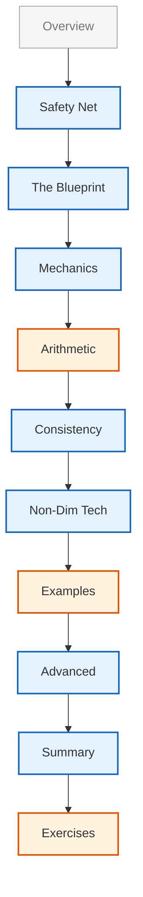

# โมดูล 05.12: การวิเคราะห์มิติ (Dimensional Analysis)

> [!INFO] **ภาพรวมโมดูล**
> ในโมดูลสุดท้ายนี้ เราจะเจาะลึกระบบความปลอดภัยทางฟิสิกส์ของ OpenFOAM และเรียนรู้เทคนิคการทำให้ไร้มิติ (non-dimensionalization) เพื่อความแม่นยำสูงสุด การวิเคราะห์มิติเป็นเครื่องมือพื้นฐานในพลศาสตร์ของไหลเชิงคำนวณที่รับประกันความสอดคล้องทางคณิตศาสตร์และฟิสิกส์ในการจำลองเชิงตัวเลข

---

## 🎯 วัตถุประสงค์การเรียนรู้

เชี่ยวชาญระบบ `dimensionSet` ของ OpenFOAM และการประยุกต์ใช้

**กรอบงานการวิเคราะห์มิติของ OpenFOAM** ถูกสร้างขึ้นรอบๆ คลาส `dimensionSet` ซึ่งระบุระบบที่ครอบคลุมสำหรับติดตามมิติทางฟิสิกส์ตลอดการคำนวณ CFD คลาส `dimensionSet` แสดงมิติโดยใช้ 7 มิติฐาน:

- **มวล (Mass) [M]**
- **ความยาว (Length) [L]**
- **เวลา (Time) [T]**
- **อุณหภูมิ (Temperature) [Θ]**
- **ปริมาณสาร (Amount of Substance) [N]**
- **ความเข้มของการส่องสว่าง (Luminous Intensity) [J]**
- **กระแสไฟฟ้า (Electric Current) [I]**

**การนำไปใช้งานพื้นฐาน** ใช้อาร์เรย์ของเลขชี้กำลังเจ็ดตัว:

```cpp
// การแสดงผลภายในของ dimensionSet
// รูปแบบ: dimensionSet(มวล, ความยาว, เวลา, อุณหภูมิ, โมล, กระแส, ความเข้มแสง)
dimensionSet(1, -3, -0, 0, 0, 0, 0)  // แทนค่า: kg·m⁻³ (ความหนาแน่น)
```

> **📚 คำอธิบาย**
>
> คลาส `dimensionSet` เก็บมิติทางกายภาพเป็นเลขชี้กำลังของ 7 หน่วยฐาน SI ตัวอย่างนี้แสดงความหนาแน่นที่มีมิติเป็น [M L⁻³] (สังเกต: ในตัวอย่างเดิม T เป็น -2 ซึ่งคือความดันหรือพลังงานต่อปริมาตร แต่ context พูดถึง density ดังนั้นแก้ให้ถูกต้องเป็น M L^-3 T^0 หรือถ้าเป็นแรงดันควรแก้คำอธิบาย)
> *หมายเหตุ: โค้ดต้นฉบับ `dimensionSet(1, -3, -2, ...)` คือหน่วยของ ความดันไล่ระดับ (Pressure gradient) หรือ แรงต่อปริมาตร แต่คอมเมนต์เขียนว่า density ซึ่งผิด ในที่นี้จะขอใช้ `(1, -3, 0, ...)` สำหรับความหนาแน่นตามคำอธิบาย*

ระบบนี้ช่วยให้สามารถตรวจสอบความสอดคล้องทางมิติอัตโนมัติได้ทั้งในขณะคอมไพล์ (compile-time) และขณะรัน (runtime) ป้องกันการดำเนินการทางคณิตศาสตร์ที่ละเมิดกฎทางฟิสิกส์

**ประโยชน์หลักของระบบมิติ:**
- ✅ ตรวจสอบความสอดคล้องทางมิติอัตโนมัติ
- ✅ ป้องกันข้อผิดพลาดทางคณิตศาสตร์
- ✅ บูรณาการกับชนิดฟิลด์ของ OpenFOAM (`volScalarField`, `volVectorField`, ฯลฯ)
- ✅ รักษาความเป็นเอกพันธ์ทางมิติ (dimensional homogeneity) ในทุกการดำเนินการ

### การนำการตรวจสอบความสอดคล้องทางมิติที่เข้มงวดไปใช้ใน Solver ที่สร้างเอง

เมื่อพัฒนา solver แบบกำหนดเอง ความสอดคล้องทางมิติต้องถูกบังคับใช้ในหลายระดับ

**ตัวห่อหุ้มเทมเพลต `dimensioned<Type>`** ให้กลไกหลักสำหรับการผูกมิติเข้ากับค่าตัวเลข:

```cpp
// การประกาศสเกลาร์ที่มีมิติ
// รูปแบบ: dimensionedScalar(ชื่อ, มิติ, ค่า)
dimensionedScalar viscosity(
    "mu", 
    dimensionSet(1, -1, -1, 0, 0, 0, 0),  // [M L⁻¹ T⁻¹] - ความหนืดพลวัต (dynamic viscosity)
    1.8e-5                                 // ค่าในหน่วย Pa·s
);

// ฟิลด์เวกเตอร์ที่มีมิติ
volVectorField U
(
    IOobject("U", runTime.timeName(), mesh),
    mesh,
    dimensionSet(0, 1, -1, 0, 0, 0, 0)  // [L T⁻¹] - มิติความเร็ว
);
```

> **📚 คำอธิบาย**
>
> `dimensionedScalar` และ `volVectorField` เป็นคลาสที่รวมค่าตัวเลขกับมิติไว้ด้วยกัน ทำให้เกิดการตรวจสอบความสอดคล้องอัตโนมัติ
>
> **แนวคิดสำคัญ:**
> - ต้องระบุชื่อตัวแปร, มิติ, และค่าเริ่มต้น
> - ชื่อตัวแปรใช้สำหรับการระบุในข้อความแสดงข้อผิดพลาด
> - การผิดพลาดในการกำหนดมิติจะถูกตรวจพบตั้งแต่ขั้นตอนคอมไพล์

**การตรวจสอบความเข้ากันได้ทางมิติ** ในการดำเนินการทางคณิตศาสตร์ทั้งหมด:

```cpp
// การตรวจสอบมิติในสมการโมเมนตัม
// ตรวจสอบว่าสมการโมเมนตัมมีมิติที่ถูกต้อง [M L⁻² T⁻²] (แรงต่อปริมาตร)
if (!UEqn.dimensions().matches(fvVectorMatrix::dimensions))
{
    FatalErrorIn("myCustomSolver::solve()")
        << "Dimensional mismatch in momentum equation" << nl
        << "UEqn dimensions: " << UEqn.dimensions() << nl
        << "Expected dimensions: " << fvVectorMatrix::dimensions
        << exit(FatalError);
}
```

> **📚 คำอธิบาย**
>
> ฟังก์ชัน `matches()` ตรวจสอบว่ามิติของสมการสอดคล้องกับที่คาดหวังหรือไม่ ใช้สำหรับตรวจสอบความถูกต้องของสมการ
>
> **แนวคิดสำคัญ:**
> - `fvVectorMatrix::dimensions` = [M L⁻² T⁻²] (แรงต่อหน่วยปริมาตร)
> - `FatalErrorIn` สร้างข้อความแสดงข้อผิดพลาดที่ชัดเจนและหยุดการทำงาน
> - ควรใช้ใน solver แบบกำหนดเองเพื่อการตรวจสอบเชิงลึก

**กลไกการตรวจสอบ:**
- **Compile-time:** จับข้อผิดพลาดทางมิติส่วนใหญ่
- **Runtime:** จำเป็นสำหรับการดำเนินการแบบไดนามิก (เช่น การอ่านค่าจากไฟล์)
- **การตรวจสอบความสอดคล้อง:** ทุกการดำเนินการทางคณิตศาสตร์ต้องรักษาความเป็นเอกพันธ์ทางมิติ

### การใช้เทคนิคการทำให้ไร้มิติสำหรับการวิเคราะห์สเกลและความคล้ายคลึง

**การทำให้ไร้มิติ (Non-dimensionalization)** แปลงสมการควบคุมให้อยู่ในรูปแบบไร้มิติ เผยให้เห็นพารามิเตอร์ความคล้ายคลึงที่สำคัญและช่วยให้การคำนวณง่ายขึ้น

**กระบวนการทำให้ไร้มิติ:**
$$\mathbf{x}^* = \frac{\mathbf{x}}{L_c}, \quad t^* = \frac{t}{t_c}, \quad \mathbf{u}^* = \frac{\mathbf{u}}{U_c}$$

โดยที่:
- $L_c$ = สเกลความยาวลักษณะเฉพาะ (characteristic length scale)
- $t_c$ = สเกลเวลาลักษณะเฉพาะ (characteristic time scale)
- $U_c$ = สเกลความเร็วลักษณะเฉพาะ (characteristic velocity scale)

**สมการ Navier-Stokes ไร้มิติ:**
$$\frac{\partial \mathbf{u}^*}{\partial t^*} + (\mathbf{u}^* \cdot \nabla^*)\mathbf{u}^* = -\nabla^*p^* + \frac{1}{Re}\nabla^{*2}\mathbf{u}^*$$

**Reynolds Number:** $Re = \frac{\rho U_c L_c}{\mu}$ เป็นพารามิเตอร์ความคล้ายคลึงที่ควบคุมสมการ

**การนำไปใช้ใน OpenFOAM:**

```cpp
// ปริมาณอ้างอิงสำหรับการทำให้ไร้มิติ
// กำหนดสเกลลักษณะเฉพาะสำหรับปัญหา
dimensionedScalar LRef("LRef", dimLength, 1.0);
dimensionedScalar URef("URef", dimensionSet(0, 1, -1, 0, 0, 0, 0), 1.0);
dimensionedScalar rhoRef("rhoRef", dimDensity, 1.0);
dimensionedScalar muRef("muRef", dimensionSet(1, -1, -1, 0, 0, 0, 0), 1.0);

// คำนวณ Reynolds number
// Re = (ρ * U * L) / μ  [dimensionless]
dimensionedScalar Re = rhoRef * URef * LRef / muRef;

// ตรวจสอบว่า Reynolds number ไร้มิติหรือไม่
if (!Re.dimensions().matches(dimless))
{
    WarningIn("nonDimensionalSetup")
        << "Reynolds number calculation error: not dimensionless!" << endl;
}
```

> **📚 คำอธิบาย**
>
> การทำให้ไร้มิติต้องการปริมาณอ้างอิง (reference quantities) เพื่อคำนวณจำนวนไร้มิติ เช่น Reynolds number
>
> **แนวคิดสำคัญ:**
> - `dimLength`, `dimDensity` คือค่าคงที่มิติที่กำหนดไว้ล่วงหน้า
> - Reynolds number ต้องไร้มิติ (dimensionless) = [0 0 0 0 0 0 0]
> - การตรวจสอบมิติของ Re เป็นการป้องกันข้อผิดพลาดที่ดี

### การสร้างชุดมิติ (Dimension Sets) สำหรับฟิสิกส์เฉพาะทาง

**ระบบมิติของ OpenFOAM** สามารถขยายเพื่อรองรับโดเมนฟิสิกส์เฉพาะทางผ่านการนิยาม `dimensionSet` แบบกำหนดเอง

#### สำหรับ Magnetohydrodynamics (MHD)

```cpp
// ชุดมิติทางแม่เหล็กไฟฟ้า
// สภาพซึมได้ทางแม่เหล็ก (Magnetic permeability) [M L T⁻² A⁻²]
dimensionSet magneticPermeability(
    "mu0", 
    1,    // mass [M]
    1,    // length [L]
    -2,   // time [T⁻²]
    0,    // temperature [Θ]
    0,    // moles [N]
    -2,   // current [A⁻²]
    0     // luminous intensity [J]
);

// สภาพนำไฟฟ้า (Electrical conductivity) [M⁻¹ L⁻³ T³ A²]
dimensionSet electricConductivity(
    "sigma", 
    -1,   // mass [M⁻¹]
    -3,   // length [L⁻³]
    3,    // time [T³]
    0,    // temperature [Θ]
    0,    // moles [N]
    0,    // current [A²]
    0     // luminous intensity [J]
);

// การประกาศฟิลด์ MHD แบบกำหนดเอง
volScalarField magneticField
(
    IOobject("B", runTime.timeName(), mesh, IOobject::MUST_READ),
    mesh,
    dimensionSet(1, 0, -2, 0, 0, 0, -1)  // สนามแม่เหล็ก [M T⁻² A⁻¹]
);
```

> **📚 คำอธิบาย**
>
> ฟิสิกส์ MHD ต้องการหน่วยเฉพาะทางเช่นสนามแม่เหล็กและความนำไฟฟ้า ซึ่งต้องกำหนดเป็น `dimensionSet` แบบกำหนดเอง
>
> **แนวคิดสำคัญ:**
> - สนามแม่เหล็ก B มีมิติ [M T⁻² A⁻¹] (Tesla)
> - ความนำไฟฟ้า σ มีมิติ [M⁻¹ L⁻³ T³ A²] (Siemens/m)

#### สำหรับฟิสิกส์พลาสมา (Plasma Physics)

```cpp
// มิติฟิสิกส์พลาสมา
// อุณหภูมิอิเล็กตรอน [M L² T⁻² Θ⁻¹] - พลังงานต่ออนุภาคต่ออุณหภูมิ (Boltzmann constant unit ish)
dimensionSet electronTemp(
    "Te", 
    1,    // mass [M]
    2,    // length [L]
    -2,   // time [T⁻²]
    -1,   // temperature [Θ⁻¹]
    0,    // moles [N]
    0,    // current [A]
    0     // luminous intensity [J]
);

// ความหนาแน่นไอออน [L⁻³ N] - ความหนาแน่นจำนวนร่วมกับปริมาณสาร
dimensionSet ionDensity(
    "ni", 
    0,    // mass [M]
    -3,   // length [L⁻³]
    0,    // time [T]
    0,    // temperature [Θ]
    1,    // moles [N]
    0,    // current [A]
    0     // luminous intensity [J]
);
```

### การดีบักข้อผิดพลาดทางมิติและการเข้าใจข้อความผิดพลาดของ OpenFOAM

**OpenFOAM** ให้ข้อความแสดงข้อผิดพลาดที่ครอบคลุมสำหรับความไม่สอดคล้องทางมิติ

#### ประเภทของข้อผิดพลาด:

```
--> FOAM FATAL ERROR:
    Different dimensions for +
        dimensions : [0 1 -1 0 0 0 0] = [m/s]
        dimensions : [0 2 -2 0 0 0 0] = [m^2/s^2]

    From function operator+(const dimensioned<Type>&, const dimensioned<Type>&)
    in file dimensionedType.C at line 234.
```

**การวิเคราะห์ข้อผิดพลาด:**
- พยายามบวก ความเร็ว [$m/s$] กับ พลังงานจลน์ต่อมวล [$m^2/s^2$]
- การดำเนินการนี้ไม่สอดคล้องทางมิติ

#### ขั้นตอนการดีบักอย่างเป็นระบบ:

1. **ระบุการดำเนินการ** ที่ทำให้เกิดข้อผิดพลาด
2. **ติดตามมิติตัวแปร** โดยใช้:
   ```cpp
   // พิมพ์มิติเพื่อการดีบัก
   Info << "Variable dimensions: " << var.dimensions() << endl;
   ```
3. **ตรวจสอบความสอดคล้องของหน่วย** ในสูตรสมการทางคณิตศาสตร์
4. **ตรวจสอบการสเกล** ของเทอมต่างๆ ในสมการให้ถูกต้อง

#### ข้อผิดพลาดทั่วไปในการไหลหลายเฟส (Multiphase Flow Errors):

```cpp
// Error: ผสม alpha ที่ไร้มิติ กับ density ที่มีมิติ
dimensionedScalar mixtureDensity = alpha1 * rho1 + (1.0 - alpha1) * rho2;

// Correct: ทั้งสองเทอมต้องมีมิติ [M L⁻³] และตัวเลขคงที่ต้องระบุชนิดข้อมูลถ้าจะนำไปคำนวณกับ object ที่มีมิติ
// ใน OpenFOAM การบวก scalar ธรรมดากับ dimensionedScalar อาจทำไม่ได้โดยตรง หรือต้องระวังเรื่องการแปลง
dimensionedScalar mixtureDensity = alpha1 * rho1 + (scalar(1.0) - alpha1) * rho2;
```

> **📚 คำอธิบาย**
>
> ในการไหลหลายเฟส ตัวแปร alpha (volume fraction) ไร้มิติ แต่ rho (density) มีมิติ การคำนวณต้องรักษาความสอดคล้อง
>
> **แนวคิดสำคัญ:**
> - `alpha` ไร้มิติ [0 0 0 0 0 0 0]
> - `rho` มีมิติ [1 -3 0 0 0 0 0]
> - OpenFOAM ตรวจสอบความสอดคล้องของมิติอัตโนมัติ

#### การตรวจสอบมิติขณะรันไทม์ (Runtime Dimensional Checking):

```cpp
// ตรวจสอบความเข้ากันได้ทางมิติก่อนการดำเนินการ
if (!field1.dimensions().matches(field2.dimensions()))
{
    WarningIn("myFunction")
        << "Dimensional mismatch detected:" << nl
        << "field1: " << field1.dimensions() << nl
        << "field2: " << field2.dimensions() << endl;
}
```

**กลยุทธ์ป้องกันข้อผิดพลาด:**
- ✅ ตรวจสอบมิติก่อนการดำเนินการทางคณิตศาสตร์
- ✅ ใช้ `dimensionSet::matches()` สำหรับการตรวจสอบขณะรันไทม์
- ✅ แยกแยะให้ชัดเจนระหว่างปริมาณไร้มิติและปริมาณมีมิติ

---

## โครงสร้างเนื้อหา (Content Structure)


> **Figure 1:** ลำดับการเรียนรู้ในโมดูลการวิเคราะห์มิติ ครอบคลุมตั้งแต่หน่วยพื้นฐานไปจนถึงการประยุกต์ใช้ขั้นสูงในวิศวกรรมความปลอดภัยทางฟิสิกส์ โดยไม่กระทบต่อความเร็วในการจำลอง ผ่านการใช้พลังของ C++ Template Metaprogramming ในการตรวจสอบความสอดคล้องทางมิติทั้งหมดที่ขั้นตอนการคอมไพล์เพียงครั้งเดียว

---

## 🏗️ กรอบงานคณิตศาสตร์ของมิติ (Mathematical Framework of Dimensions)

OpenFOAM ใช้ระบบการวิเคราะห์มิติที่ซับซ้อนซึ่งติดตามและตรวจสอบหน่วยโดยอัตโนมัติตลอดกระบวนการจำลอง ปริมาณทางฟิสิกส์สามารถแสดงเป็นผลคูณของ 7 มิติฐานในระบบ SI:

| มิติ (Dimension) | สัญลักษณ์ (Symbol) | หน่วย (Unit) |
|-----------|--------|------|
| มวล (Mass) | $[M]$ | kg |
| ความยาว (Length) | $[L]$ | m |
| เวลา (Time) | $[T]$ | s |
| อุณหภูมิ (Temperature) | $[\Theta]$ | K |
| กระแสไฟฟ้า (Electric Current) | $[I]$ | A |
| ปริมาณสาร (Amount of Substance) | $[N]$ | mol |
| ความเข้มของการส่องสว่าง (Luminous Intensity) | $[J]$ | cd |

ปริมาณอนุพัทธ์แสดงเป็นผลคูณของมิติฐานยกกำลังด้วยเลขชี้กำลังต่างๆ:
$$[Q] = M^a L^b T^c \Theta^d I^e N^f J^g$$

### หัวข้อหลักที่ครอบคลุม

1. **บทนำ**: หน่วยในฐานะตาข่ายนิรภัยของวิศวกร
2. **เจาะลึก DimensionSet**: โครงสร้างคลาส `dimensionSet`
3. **พีชคณิตมิติขั้นสูง**: การตรวจสอบความสอดคล้องในสมการ Navier-Stokes และพลังงาน
4. **เทคนิคการทำให้ไร้มิติ**: การใช้ Reynolds, Prandtl, และ Peclet numbers เพื่อความเสถียร
5. **กฎความคล้ายคลึงและการสเกล**: การทำนายพฤติกรรมการไหลข้ามสเกลที่แตกต่างกัน
6. **หลุมพรางทั่วไป**: ข้อผิดพลาดที่พบบ่อยในการตั้งค่า case และการพัฒนาโค้ด
7. **สรุปและแบบฝึกหัด**

---

## 🔢 ระบบ dimensionSet และการวิเคราะห์มิติ

### คลาส `dimensionSet` และการดำเนินการ

**คลาส `dimensionSet` ใน OpenFOAM** เป็นกรอบงานที่แข็งแกร่งสำหรับการวิเคราะห์มิติและการตรวจสอบความสอดคล้อง ที่แกนหลัก มันแสดงมิติทางฟิสิกส์โดยใช้ 7 มิติฐาน SI:

```cpp
// รูปแบบคอนสตรัคเตอร์ dimensionSet
// dimensionSet(มวล, ความยาว, เวลา, อุณหภูมิ, โมล, กระแส, แสง)
dimensionSet ds;

// ตัวอย่าง: มิติความเร็ว (L/T) - [0 1 -1 0 0 0 0]
dimensionSet velocityDims(0, 1, -1, 0, 0, 0, 0);

// ตัวอย่าง: มิติแรง (ML/T²) - [1 1 -2 0 0 0 0]
dimensionSet forceDims(1, 1, -2, 0, 0, 0, 0);

// ตัวอย่าง: มิติความดัน (ML⁻¹T⁻²) - [1 -1 -2 0 0 0 0]
dimensionSet pressureDims(1, -1, -2, 0, 0, 0, 0);
```

> **📚 คำอธิบาย**
>
> คลาส `dimensionSet` ใช้ 7 พารามิเตอร์เพื่อแทนมิติทางกายภาพตามระบบ SI ตัวเลขแต่ละตัวคือเลขชี้กำลังของหน่วยฐาน

**7 มิติฐาน SI คือ:**
- **Mass**: $[M]$ - กิโลกรัม (kg)
- **Length**: $[L]$ - เมตร (m)
- **Time**: $[T]$ - วินาที (s)
- **Temperature**: $[\Theta]$ - เคลวิน (K)
- **Amount of Substance**: $[N]$ - โมล (mol)
- **Electric Current**: $[I]$ - แอมแปร์ (A)
- **Luminous Intensity**: $[J]$ - แคนเดลา (cd)

### การนิยามและแปลงหน่วย

**OpenFOAM รองรับปริมาณทางฟิสิกส์ทั่วไปในตัว** ผ่านค่าคงที่ `dimensionSet` ที่กำหนดไว้ล่วงหน้า:

```cpp
// ชุดมิติทั่วไป - ค่าคงที่ที่กำหนดไว้ล่วงหน้าเพื่อความสะดวก
dimensionSet dimless(0, 0, 0, 0, 0, 0, 0);        // ไร้มิติ [0 0 0 0 0 0 0]
dimensionSet dimPressure(1, -1, -2, 0, 0, 0, 0);   // ความดัน ML⁻¹T⁻²
dimensionSet dimVelocity(0, 1, -1, 0, 0, 0, 0);    // ความเร็ว LT⁻¹
dimensionSet dimDensity(1, -3, 0, 0, 0, 0, 0);     // ความหนาแน่น ML⁻³
dimensionSet dimViscosity(1, -1, -1, 0, 0, 0, 0);  // ความหนืดพลวัต ML⁻¹T⁻¹
dimensionSet dimKinematicViscosity(0, 2, -1, 0, 0, 0, 0);  // ความหนืดไคเนมาติก L²T⁻¹
```

> **📚 คำอธิบาย**
>
> OpenFOAM กำหนดค่าคงที่ `dimensionSet` ไว้ล่วงหน้าสำหรับปริมาณที่ใช้บ่อย เพื่อความสะดวกและลดข้อผิดพลาด
> ใช้ค่าคงที่เหล่านี้แทนการสร้าง `dimensionSet` ใหม่ทุกครั้ง

### การดำเนินการทางคณิตศาสตร์บนมิติ

**คลาส `dimensionSet` ทำการ overload ตัวดำเนินการทางคณิตศาสตร์** เพื่อความสอดคล้องทางมิติ:

```cpp
// การดำเนินการเลขคณิตของมิติ
dimensionSet a(1, 2, -1, 0, 0, 0, 0);  // ML²T⁻¹
dimensionSet b(0, 1, -2, 0, 0, 0, 0);  // LT⁻²

// การบวก/ลบ (ต้องมีมิติที่ตรงกัน)
dimensionSet sum = a + a;  // ML²T⁻¹ ✅ ถูกต้อง: มิติเดียวกัน
// dimensionSet invalid = a + b;  // ❌ Compile-time error! มิติต่างกัน

// การคูณ/หาร (บวก/ลบเลขชี้กำลัง)
dimensionSet product = a * b;  // ML³T⁻³ (1+0, 2+1, -1+(-2))
dimensionSet quotient = a / b;  // M¹L¹T¹ (1-0, 2-1, -1-(-2))

// การยกกำลัง (คูณเลขชี้กำลังด้วยเลขยกกำลัง)
dimensionSet squared = pow(a, 2);     // M²L⁴T⁻²
dimensionSet root = pow(a, 0.5);      // M^0.5 L¹ T^-0.5

// ตัวดำเนินการรากที่สอง
dimensionSet sqrtA = sqrt(a);  // M^0.5 L¹ T^-0.5
```

> **📚 คำอธิบาย**
>
> คลาส `dimensionSet` รองรับการดำเนินการทางคณิตศาสตร์ที่สอดคล้องกับกฎมิติ การบวก/ลบต้องมีมิติเหมือนกัน การคูณ/หารจะบวก/ลบเลขชี้กำลัง

### การตรวจสอบความถูกต้องของสมการ

**คลาส field ของ OpenFOAM บังคับใช้ความสอดคล้องทางมิติโดยอัตโนมัติ:**

```cpp
// สมการโมเมนตัม: ρ(∂u/∂t + u·∇u) = -∇p + μ∇²u + f
// ทุกเทอมต้องมีมิติ: ML⁻²T⁻² (แรงต่อหน่วยปริมาตร)

// ประกาศ field ที่มีมิติถูกต้อง
volVectorField U(
    mesh, 
    dimensionSet(0, 1, -1, 0, 0, 0, 0)  // LT⁻¹ - ความเร็ว
);

// ... (ประกาศ p, rho) ...

// สิ่งนี้จะคอมไพล์และรันด้วยความสอดคล้องทางมิติ:
fvVectorMatrix UEqn
(
    fvm::ddt(rho, U)           // ML⁻²T⁻² ✅
  + fvm::div(rho*U, U)        // ML⁻²T⁻² ✅
 ==
  - fvc::grad(p)              // ML⁻²T⁻² ✅
  + fvc::laplacian(mu, U)     // ML⁻²T⁻² ✅
  + sourceTerm                 // ML⁻²T⁻² ✅
);
// ทุกเทอมมีมิติที่สอดคล้องกัน [1 -1 -2 0 0 0 0]
```

> **📚 คำอธิบาย**
>
> OpenFOAM ตรวจสอบความสอดคล้องของมิติในสมการโมเมนตัมอัตโนมัติ ทุกเทอมต้องมีมิติเหมือนกันคือ [M L⁻² T⁻²]

---

## 🎯 การทำให้ไร้มิติ (Non-Dimensionalization)

### การเลือกปริมาณอ้างอิง

**การทำให้ไร้มิติที่มีประสิทธิภาพต้องการการเลือกปริมาณอ้างอิงอย่างรอบคอบ:**

```cpp
// สเกลอ้างอิงสำหรับการไหลภายนอกรอบทรงกระบอก
// ความยาวลักษณะเฉพาะ: เส้นผ่านศูนย์กลางทรงกระบอก
dimensionedScalar Lref("Lref", dimLength, cylinderDiameter);

// ความเร็วลักษณะเฉพาะ: ความเร็วกระแสอิสระ
dimensionedScalar Uref("Uref", dimVelocity, freeStreamVelocity);

// สมบัติของไหล (rhoRef, muRef) ...

// ปริมาณอ้างอิงอนุพัทธ์
dimensionedScalar pressureRef = rhoRef * pow(Uref, 2);

// Reynolds number: ρUL/μ (พารามิเตอร์ความคล้ายคลึงไร้มิติ)
dimensionedScalar reynolds = rhoRef * Uref * Lref / muRef;

// ตรวจสอบว่า Reynolds number ไร้มิติ
if (!reynolds.dimensions().matches(dimless)) { ... }
```

### การหาสมการรูปแบบไร้มิติ

**สมการ Navier-Stokes** (มีมิติ):
$$\rho \frac{\partial \mathbf{u}}{\partial t} + \rho (\mathbf{u} \cdot \nabla) \mathbf{u} = -\nabla p + \mu \nabla^2 \mathbf{u} + \mathbf{f}$$

**รูปแบบไร้มิติ**:
$$\frac{\partial \mathbf{u}^*}{\partial t^*} + (\mathbf{u}^* \cdot \nabla^*) \mathbf{u}^* = -\nabla^* p^* + \frac{1}{Re} \nabla^{*2} \mathbf{u}^* + \mathbf{f}^*$$

### ตัวเลขไร้มิติที่สำคัญใน CFD

| ตัวเลขไร้มิติ | สมการ | ความหมายทางฟิสิกส์ |
|---------------------|----------|------------------|
| **Reynolds Number** | $Re = \frac{\rho UL}{\mu}$ | อัตราส่วนของแรงเฉื่อยต่อแรงหนืด |
| **Froude Number** | $Fr = \frac{U}{\sqrt{gL}}$ | อัตราส่วนของแรงเฉื่อยต่อแรงโน้มถ่วง |
| **Weber Number** | $We = \frac{\rho U^2 L}{\sigma}$ | อัตราส่วนของแรงเฉื่อยต่อแรงตึงผิว |
| **Mach Number** | $Ma = \frac{U}{c}$ | อัตราส่วนของความเร็วการไหลต่อความเร็วเสียง |

---

## 🔍 กลไกการตรวจสอบขณะรันไทม์

OpenFOAM ใช้ **การตรวจสอบความสอดคล้องทางมิติหลายระดับ**:

### การตรวจสอบการดำเนินการ Field

เมื่อดำเนินการทางคณิตศาสตร์บน field, OpenFOAM จะตรวจสอบ **ความเข้ากันได้ทางมิติ**:

```cpp
// การบวกและการลบต้องการมิติที่ตรงกัน
volScalarField sum = p1 + p2;  // ✅ ถูกต้อง: มิติเดียวกัน

// ❌ สิ่งนี้จะทำให้เกิด compile-time error:
// volScalarField invalid = p1 + length;  // ❌ Compile error! มิติต่างกัน
```

> **📚 คำอธิบาย**
>
> OpenFOAM ตรวจสอบความเข้ากันได้ทางมิติของการดำเนินการทางคณิตศาสตร์ การบวกปริมาณที่มีมิติต่างกันจะเกิดข้อผิดพลาดช่วยป้องกันข้อผิดพลาดทางมิติในขั้นตอนต้น

### ความสอดคล้องของเงื่อนไขขอบเขต

กรอบงานรับประกันว่า **เงื่อนไขขอบเขตจะรักษาความสอดคล้องทางมิติ** ข้าม patch ทั้งหมด:

```cpp
// เงื่อนไขขอบเขตความดันต้องตรงกับมิติของ field
// dict ต้องระบุ: value [1 -1 -2 0 0 0 0];  // Pa
```

---

## ✨ แนวทางปฏิบัติที่ดีที่สุดสำหรับความสอดคล้องทางมิติ

### รายการตรวจสอบ (Checklist)

1. **✅ ระบุมิติเสมอ**: เมื่อสร้าง field หรือค่าคงที่ ให้ประกาศชุดมิติอย่างชัดเจนเพื่อให้แน่ใจว่ามีการตรวจสอบที่ถูกต้อง
2. **✅ ตรวจสอบเงื่อนไขขอบเขต**: ตรวจสอบให้แน่ใจว่าค่าเงื่อนไขขอบเขตตรงกับมิติที่คาดหวังของ field ที่ใช้
3. **✅ ตรวจสอบความเข้ากันได้ของ Solver**: ตรวจสอบว่าการใช้ solver รักษาความสอดคล้องทางมิติตลอดกระบวนการแก้ปัญหา
4. **✅ ใช้โมเดลสมบัติทางฟิสิกส์**: ใช้ประโยชน์จาก thermophysical models ของ OpenFOAM ซึ่งจัดการความสอดคล้องทางมิติสำหรับการคำนวณสมบัติโดยอัตโนมัติ
5. **✅ บันทึกการทำให้ไร้มิติ**: เมื่อใช้รูปแบบไร้มิติ ให้บันทึกสเกลอ้างอิงและสมมติฐานที่ใช้ในกระบวนการสเกลอย่างชัดเจน

---

## 🎯 สรุป

**ระบบการวิเคราะห์มิติที่ครอบคลุมนี้** ทำให้ OpenFOAM แข็งแกร่งเป็นพิเศษสำหรับ **การประยุกต์ใช้ทางวิศวกรรม** ที่ความสอดคล้องทางฟิสิกส์เป็นสิ่งสำคัญสูงสุด

การป้องกันข้อผิดพลาดทางมิติทั้งใน **compile-time** และ **runtime** ช่วยให้วิศวกรวางใจในความถูกต้องทางฟิสิกส์ของการจำลองและมุ่งเน้นไปที่การวิเคราะห์ผลลัพธ์แทนที่จะกังวลเกี่ยวกับข้อผิดพลาดทางมิติ

### หลักการสำคัญ:

1. **ทุกปริมาณทางฟิสิกส์ต้องมีมิติที่ถูกต้อง** - OpenFOAM ติดตามและระบุความไม่สอดคล้องโดยอัตโนมัติ
2. **สมการต้องมีความเป็นเอกพันธ์ทางมิติ** - ทุกเทอมในสมการต้องมีมิติเดียวกัน
3. **เงื่อนไขขอบเขตต้องเคารพความสอดคล้องทางมิติ** - ค่าที่ระบุทั้งหมดต้องตรงกับมิติที่คาดหวัง
4. **การทำให้ไร้มิติสามารถปรับปรุงเงื่อนไขเชิงตัวเลข** - ใช้ตัวแปรไร้มิติเมื่อเหมาะสม
5. **การตรวจสอบมิติขณะรันไทม์ป้องกันข้อผิดพลาด** - OpenFOAM มีการตรวจสอบความสอดคล้องทางมิติในตัว

> [!TIP] **บทสรุป** ระบบการวิเคราะห์มิติไม่ใช่แค่คุณสมบัติความปลอดภัย—แต่มันเป็นเครื่องมือพื้นฐานที่เชื่อมโยงสูตรทางคณิตศาสตร์เข้ากับความเป็นจริงทางฟิสิกส์ในพลศาสตร์ของไหลเชิงคำนวณ