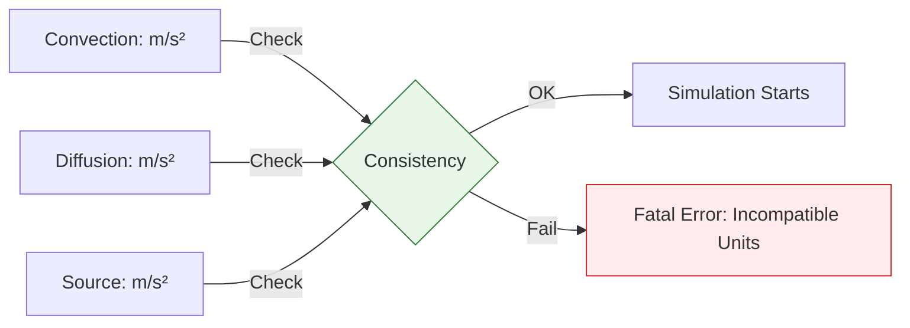

# บทนำเกี่ยวกับการวิเคราะห์มิติ

![[physics_referee_dimensions.png]]
`A futuristic referee (The OpenFOAM Core) holding a magnifying glass over a physics equation. Each term in the equation is glowing with its unit (e.g., m/s²). If all units match, a green checkmark appears. If they don't, a red warning light flashes, scientific textbook diagram, clean vector line art, white background, high definition, flat design, educational infographic --ar 16:9`

จินตนาการว่าคุณกำลังสร้างสะพานและผสมหน่วยเมตริกและอิมพีเรียลโดยไม่ตั้งใจ: สกรูวัดเป็นนิ้ว แรงวัดเป็นนิวตัน และความเครียดวัดเป็น psi ผลลัพธ์จะเป็นความล้มเหลวอย่างร้ายแรง ระบบการวิเคราะห์มิติของ OpenFOAM ทำหน้าที่เป็น **การตรวจสอบหน่วย** สำหรับสมการ CFD ของคุณ โดยจับความไม่ตรงกันของหน่วยก่อนที่จะสร้างผลลัพธ์ที่ไม่สมเหตุสมผล

## 🔍 ตาข่ายนิรภัยของวิศวกร (The Safety Net)


> **Figure 1:** แผนภาพ "ตาข่ายนิรภัย" ของวิศวกร ซึ่งแสดงให้เห็นว่าระบบจะบล็อกการจำลองทันทีหากพบว่าเทอมต่างๆ ในสมการมีหน่วยที่ไม่สอดคล้องกันความปลอดภัยทางฟิสิกส์ไม่ส่งผลกระทบต่อความเร็วในการจำลอง ผ่านการใช้พลังของ C++ Template Metaprogramming ในการตรวจสอบความสอดคล้องทางมิติทั้งหมดที่ขั้นตอนการคอมไพล์โปรแกรมเพียงครั้งเดียว

![[of_unit_consistency_check.png]]
`A flowchart of the unit consistency check process: comparing dimensions of terms in a transport equation and triggering a Fatal Error if a mismatch is detected, scientific textbook diagram, clean vector line art, white background, high definition, flat design, educational infographic --ar 16:9`

ในการคำนวณ CFD ที่ซับซ้อน เรามักต้องจัดการกับสมการที่มีพจน์จำนวนมาก:
-   เทอม Convection (m/s²)
-   เทอม Diffusion (m/s²)
-   เทอม Source (m/s²)

หากคุณลืมหารด้วยพื้นที่หรือคูณด้วยเวลาในบางพจน์ หน่วยของพจน์นั้นจะเปลี่ยนไปทันที ในซอฟต์แวร์อื่น คุณอาจไม่รู้ตัวจนกระทั่งผลลัพธ์ลู่ออก (Diverge) แต่ใน OpenFOAM **โปรแกรมจะหยุดรันและบอกสาเหตุทันที**

### สถาปัตยกรรมระบบมิติของ OpenFOAM

OpenFOAM ใช้ความสม่ำเสมอทางมิติผ่านส่วนประกอบหลักหลายอย่าง:

**คลาส dimensionSet**: โครงสร้างข้อมูลหลักที่แสดงมิติทางกายภาพโดยใช้หน่วยฐาน SI:

| หน่วยฐาน | สัญลักษณ์ | คำอธิบาย |
|------------|------------|------------|
| มวล | $M$ | Mass |
| ความยาว | $L$ | Length |
| เวลา | $T$ | Time |
| อุณหภูมิ | $\Theta$ | Temperature |
| ปริมาณของสาร | $N$ | Amount of substance |
| กระแสไฟฟ้า | $I$ | Electric current |
| ความเข้มแสง | $J$ | Luminous intensity |

**dimensionedScalar/vector/tensor**: คลาสเทมเพลตที่รวมค่ากับมิติของพวกมัน:

```cpp
// ตัวอย่างจากซอร์สโค้ด OpenFOAM
dimensionedScalar p("p", dimPressure, 101325.0);  // ความดันในปาสกัล
dimensionedVector U("U", dimVelocity, vector(1.0, 0, 0));  // เวกเตอร์ความเร็ว
```

### รากฐาน: ความสม่ำเสมอทางมิติในฟิสิกส์

หลักการของความเป็นเนื้อเดียวกันทางมิติระบุว่าเทอมทั้งหมดในสมการที่มีความหมายทางกายภาพต้องมีมิติที่เหมือนกัน แนวคิดพื้นฐานนี้ ซึ่งเป็นทางการครั้งแรกโดย Fourier ในปี 1822 เป็นสิ่งจำเป็นเพราะ:

- **ความหมายทางกายภาพ**: เฉพาะปริมาณที่มีมิติเหมือนกันเท่านั้นที่สามารถเปรียบเทียบ บวก หรือเท่ากันได้อย่างมีความหมาย
- **ความไม่ขึ้นกับสเกล**: กฎฟิสิกส์ต้องทำงานไม่ว่าจะเลือกหน่วยใด
- **การตรวจจับข้อผิดพลาด**: การวิเคราะห์มิติให้วิธีการเป็นระบบในการตรวจสอบความถูกต้องของสมการ

### การวิเคราะห์มิติในการใช้งานจริง

พิจารณาสมการ Navier-Stokes สำหรับการไหลแบบไม่บีบอัด:
$$\rho \frac{\partial \mathbf{u}}{\partial t} + \rho (\mathbf{u} \cdot \nabla) \mathbf{u} = -\nabla p + \mu \nabla^2 \mathbf{u} + \mathbf{f}$$

มาตรวจสอบความสม่ำเสมอทางมิติเป็นเทอมๆ:

**เทอมชั่วคราว**: $\rho \frac{\partial \mathbf{u}}{\partial t}$
- $\rho$: $M/L^3$ (ความหนาแน่น)
- $\frac{\partial \mathbf{u}}{\partial t}$: $(L/T)/T = L/T^2$ (ความเร่ง)
- **ผลลัพธ์**: $M/L^3 × L/T^2 = M/(L^2·T^2)$

**เทอมพาพลศาสตร์**: $\rho (\mathbf{u} \cdot \nabla) \mathbf{u}$
- $(\mathbf{u} \cdot \nabla)$: $(L/T) × (1/L) = 1/T$
- $\mathbf{u}$: $L/T$
- **ผลลัพธ์**: $\rho × 1/T × L/T = M/(L^2·T^2)$

**การไล่ระดับความดัน**: $-\nabla p$
- $\nabla$: $1/L$
- $p$: $M/(L·T^2)$
- **ผลลัพธ์**: $1/L × M/(L·T^2) = M/(L^2·T^2)$

เทอมทั้งหมดมีมิติเหมือนกัน ซึ่งยืนยันความสม่ำเสมอทางมิติของสมการ

### ความสำคัญของการวิเคราะห์มิติ

การวิเคราะห์มิติเป็นเครื่องมือพื้นฐานในพลศาสตร์ของไหลเชิงคำนวณที่ทำให้มั่นใจได้ถึงความสอดคล้องทางคณิตศาสตร์และความเป็นจริงทางกายภาพในการจำลองเชิงตัวเลข

- **ความสอดคล้องทางกายภาพ**: ทำให้มั่นใจได้ว่าสมการทั้งหมดยังคงสมดุลมิติที่เหมาะสม
- **การป้องกันข้อผิดพลาด**: ตรวจจับข้อผิดพลาดที่เกี่ยวข้องกับหน่วยก่อนที่จะทำลายผลลัพธ์การจำลอง
- **การตรวจสอบ**: ให้การตรวจสอบเพิ่มเติมสำหรับ schemes เชิงตัวเลข
- **การดีบัก**: ช่วยระบุแหล่งที่มาของความไม่เสถียรเชิงตัวเลขหรือผลลัพธ์ที่ไม่เป็นไปตามกายภาพ

### ประโยชน์ของการนำไปใช้

**การตรวจจับข้อผิดพลาดยาว**: การตรวจสอบมิติของ OpenFOAM เกิดขึ้นในเวลาคอมไพล์สำหรับนิพจน์คงที่และในเวลาทำงานสำหรับการดำเนินการฟิลด์

```cpp
// นี่จะคอมไพล์ไม่สำเร็จ
dimensionedScalar invalidSum = U + p;  // ข้อผิดพลาด: มิติไม่ตรงกัน
```

**เอกสารผ่านมิติ**: ทุกฟิลด์จะพกความหมายทางกายภาพโดยอัตโนมัติ ทำให้โค้ดเป็นเอกสารได้ด้วยตนเอง:

```cpp
volScalarField T(io, "T", mesh);  // ฟิลด์อุณหภูมิ - อัตโนมัติ dimTemperature
volVectorField U(io, "U", mesh);  // ฟิลด์ความเร็ว - อัตโนมัติ dimVelocity
```

**ความยืดหยุ่นของระบบหน่วย**: OpenFOAM แปลงระหว่างหน่วยที่เข้ากันได้โดยอัตโนมัติในขณะที่รักษาความสม่ำเสมอทางมิติ:

```cpp
dimensionedScalar p_in_psi("p", dimPressure, 14.7);  // ความดันใน psi
dimensionedScalar p_in_pa = p_in_psi;  // แปลงเป็น Pa โดยอัตโนมัติสำหรับการคำนวณ
```

### การผสานรวมหลายฟิสิกส์

ในการจำลองหลายฟิสิกส์ การวิเคราะห์มิติกลายเป็นสิ่งสำคัญสำหรับการผสานปรากฏการณ์ทางกายภาพที่แตกต่างกัน:

**การถ่ายเทความร้อน**: สมการพลังงาน
$$\rho c_p \frac{\partial T}{\partial t} + \rho c_p \mathbf{u} \cdot \nabla T = k \nabla^2 T + Q$$

- **ตัวแปร:**
  - $\rho$: $M/L^3$ (ความหนาแน่น)
  - $c_p$: $L^2/(T^2·\Theta)$ (ความจุความร้อนค่าคงที่)
  - $T$: $\Theta$ (อุณหภูมิ)
  - $\mathbf{u}$: $L/T$ (ความเร็ว)
  - $k$: $M·L/(T^3·\Theta)$ (ความนำความร้อน)
  - $Q$: $M/(L·T^3)$ (แหล่งความร้อน)

- **เทอมทั้งหมดต้องมีหน่วยของ** $M/(L·T^3)$ (พลังงานต่อปริมาตรต่อหน่วยเวลา)
- นี่ทำให้มั่นใจในการผสานรวมที่เหมาะสมระหว่างฟิลด์ความเร็ว ($\mathbf{u}$) และฟิลด์อุณหภูมิ ($T$)

**การไหลหลายเฟส**: การขนส่งปริมาตรสัดส่วน
$$\frac{\partial \alpha}{\partial t} + \mathbf{u} \cdot \nabla \alpha = 0$$

- $\alpha$ ไม่มีมิติ (ปริมาตรสัดส่วน, $0 \leq \alpha \leq 1$)
- **เทอมทั้งหมดต้องไม่มีมิติ** ป้องกันการผสมกับปริมาณที่มีมิติ

### อันตรายทั่วไปและวิธีแก้ไข

**การทำให้ไม่มีมิติ**: บทความวิจัยจำนวนมากใช้สมการที่ไม่มีมิติ ระบบมิติของ OpenFOAM ต้องการการนำไปใช้อย่างระมัดระวัง:

```cpp
// วิธีการที่ผิด - สูญเสียข้อมูลมิติ
dimensionedScalar Re("Re", dimless, 1000.0);  // จำนวนเรย์โนลด์

// วิธีการที่ดีกว่า - รักษารูปแบบที่มีมิติ
dimensionedScalar U_ref("U_ref", dimVelocity, 1.0);    // m/s
dimensionedScalar L_ref("L_ref", dimLength, 1.0);      // m
dimensionedScalar nu_ref("nu_ref", dimKinematicViscosity, 1e-6);  // m²/s
dimensionedScalar Re = U_ref * L_ref / nu_ref;  // คำนวณจำนวนที่ไม่มีมิติ
```

**ฟังก์ชันที่ผู้ใช้กำหนด**: เมื่อสร้างเงื่อนไขขอบเขตหรือโมเดลแบบกำหนดเอง การระบุมิติที่เหมาะสมเป็นสิ่งสำคัญ:

```cpp
class MyBoundaryCondition : public fvPatchField<scalar>
{
    // Constructor ต้องระบุมิติ
    MyBoundaryCondition
    (
        const fvPatch& p,
        const DimensionedField<scalar, volMesh>& iF,
        const dictionary& dict
    )
    :
        fvPatchField<scalar>(p, iF, dict, dimless)  // ระบุมิติที่ถูกต้อง
    {}
};
```

### การพิจารณาประสิทธิภาพ

การตรวจสอบมิติของ OpenFOAM ถูกนำไปใช้อย่างมีประสิทธิภาพ:

| ช่วงเวลา | การตรวจสอบ | โอเวอร์เฮด |
|------------|------------|------------|
| เวลาคอมไพล์ | ความสม่ำเสมอทางมิติสำหรับค่าคงที่และนิพจน์ | เล็กน้อย |
| เวลาทำงาน | โอเวอร์เฮดน้อยมากสำหรับการดำเนินการฟิลด์ | ส่วนใหญ่ในระหว่างการเริ่มต้น |
| การเพิ่มประสิทธิภาพ | คอมไพเลอร์จะลบการตรวจสอบมิติในบิลด์รีลีส | ไม่มีในบิลด์รีลีส |

**โอเวอร์เฮดหน่วยความจำ**: น้อยมาก - แต่ละประเภทที่มีมิติจัดเก็บข้อมูลมิติเพียงครั้งเดียว โดยค่าฟิลด์จัดเก็บข้อมูลตัวเลขจริง

### บทสรุป: นอกเหนือจากการตรวจจับข้อผิดพลาด

ในขณะที่ประโยชน์หลักของระบบการวิเคราะห์มิติของ OpenFOAM คือการป้องกันข้อผิดพลาด มันให้คุณค่าเพิ่มเติม:

1. **ความชัดเจนของโค้ด**: มิติทำหน้าที่เป็นเอกสารฝังตัว
2. **สัญชาตญาณทางกายภาพ**: นักพัฒนายังคงรับรู้ถึงความหมายทางกายภาพ
3. **ความไม่ขึ้นกับหน่วย**: โค้ดทำงานอย่างสม่ำเสมอไม่ว่าหน่วยอินพุตจะเป็นอย่างไร
4. **ความปลอดภัยหลายฟิสิกส์**: ป้องกันการผสมนวนปริมาณทางกายภาพที่ไม่เข้ากัน

แนวทางเชิงระบบนี้ในการรักษาความสม่ำเสมอทางมิติทำให้ OpenFOAM โดยเฉพาะอย่างยิ่งแข็งแกร่งสำหรับการจำลองหลายฟิสิกส์ที่ซับซ้อน ซึ่งการตรวจสอบด้วยตนเองจะไม่เป็นไปได้และมีแนวโน้มที่จะผิดพลาด

## 🎯 ขอบเขตของบทนี้

เราจะไม่ได้ศึกษาแค่ว่า "เมตรบวกเมตรได้เมตร" แต่เราจะดูไปถึง:
-   การจัดเก็บเลขชี้กำลังแบบบิต (Bit-level storage)
-   การคำนวณหน่วยในเทมเพลตนิพจน์ (Expression Templates)
-   การทำให้สมการไร้มิติ (Non-dimensionalization) เพื่อเพิ่มความแม่นยำทางตัวเลข

การเชี่ยวชาญการวิเคราะห์มิติจะเปลี่ยนคุณจาก "คนเขียนโค้ด" ให้กลายเป็น "วิศวกรจำลองสถานการณ์" ที่มีความเป็นมืออาชีพสูง
