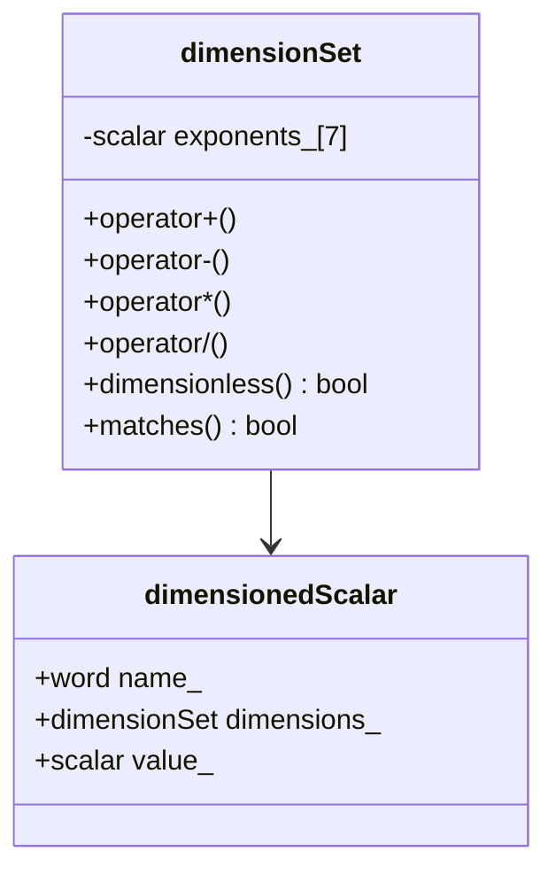
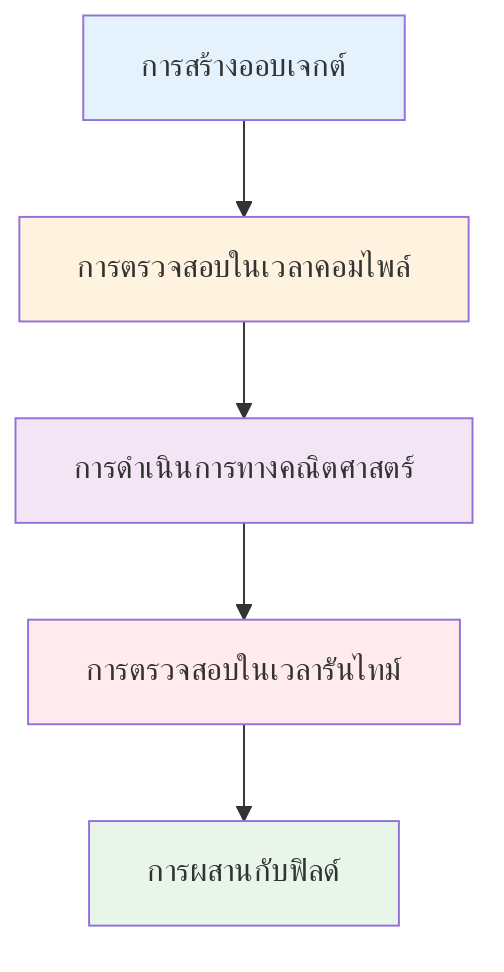

# เจาะลึก DimensionSet: โครงสร้างและกลไกภายใน

## ภาพรวม

คลาส `dimensionSet` เป็น ==รากฐานของระบบการวิเคราะห์มิติ== ใน OpenFOAM ซึ่งติดตามและตรวจสอบความสอดคล้องของหน่วยทางกายภาพโดยอัตโนมัติ คลาสนี้ใช้ ==อาร์เรย์เลขชี้กำลังเจ็ดค่า== เพื่อแสดงมิติของปริมาณทางกายภาพในระบบ SI


> **Figure 1:** แผนผังคลาสแสดงความสัมพันธ์ระหว่าง `dimensionSet` และ `dimensionedScalar` ซึ่งเป็นหัวใจสำคัญของการรวมค่าตัวเลขเข้ากับหน่วยทางฟิสิกส์ใน OpenFOAMความปลอดภัยทางฟิสิกส์ไม่ส่งผลกระทบต่อความเร็วในการจำลอง ผ่านการใช้พลังของ C++ Template Metaprogramming ในการตรวจสอบความสอดคล้องทางมิติทั้งหมดที่ขั้นตอนการคอมไพล์โปรแกรมเพียงครั้งเดียว

---

## 1. โครงสร้างภายในของ dimensionSet

### 1.1 การจัดเก็บเลขชี้กำลัง

ภายใน `dimensionSet` มิติจะถูกจัดเก็บเป็น C-array ของเลขชี้กำลัง `scalar` ทั้งเจ็ดตัว:

```cpp
class dimensionSet
{
private:
    scalar exponents_[nDimensions];  // nDimensions = 7

public:
    // Constructor
    dimensionSet
    (
        scalar mass,
        scalar length,
        scalar time,
        scalar temperature,
        scalar moles,
        scalar current,
        scalar luminousIntensity
    );
};
```

### 1.2 การแมปมิติพื้นฐาน

คลาสนี้ให้การเข้าถึงผ่าน enumeration:

```cpp
enum dimensionType
{
    MASS,              // 0
    LENGTH,            // 1
    TIME,              // 2
    TEMPERATURE,       // 3
    MOLES,             // 4
    CURRENT,           // 5
    LUMINOUS_INTENSITY // 6
};

scalar operator[](dimensionType) const;
```

| ตำแหน่ง (Index) | ประเภทหน่วย | สัญลักษณ์ | หน่วย SI | คำอธิบาย |
|:---:|:---|:---:|:---:|:---|
| **0** | มวล | $M$ | kg | กิโลกรัม |
| **1** | ความยาว | $L$ | m | เมตร |
| **2** | เวลา | $T$ | s | วินาที |
| **3** | อุณหภูมิ | $\Theta$ | K | เคลวิน |
| **4** | ปริมาณสาร | $N$ | mol | โมล |
| **5** | กระแสไฟฟ้า | $I$ | A | แอมแปร์ |
| **6** | ความเข้มแสง | $J$ | cd | แคนเดลา |

### 1.3 การแสดงมิติทางคณิตศาสตร์

ปริมาณทางกายภาพแต่ละประเภทสามารถแสดงเป็น:

$$\text{มิติ} = M^{e_0} L^{e_1} T^{e_2} \Theta^{e_3} N^{e_4} I^{e_5} J^{e_6}$$

โดยที่ $e_i$ แทนเลขชี้กำลังสำหรับมิติพื้นฐาน i-th

---

## 2. ตัวอย่างการแสดงมิติ

### 2.1 ปริมาณทางกายภาพทั่วไป

| ปริมาณทางกายภาพ | dimensionSet | สมการมิติ | หน่วย SI |
|:---|:---|:---|:---|
| **ความเร็ว** | `dimensionSet(0, 1, -1, 0, 0, 0, 0)` | $M^0 L^1 T^{-1} = LT^{-1}$ | m/s |
| **ความดัน** | `dimensionSet(1, -1, -2, 0, 0, 0, 0)` | $M^1 L^{-1} T^{-2} = ML^{-1}T^{-2}$ | Pa = N/m² |
| **ความเร่ง** | `dimensionSet(0, 1, -2, 0, 0, 0, 0)` | $M^0 L^1 T^{-2} = LT^{-2}$ | m/s² |
| **แรง** | `dimensionSet(1, 1, -2, 0, 0, 0, 0)` | $M^1 L^1 T^{-2} = MLT^{-2}$ | N |
| **พลังงาน** | `dimensionSet(1, 2, -2, 0, 0, 0, 0)` | $M^1 L^2 T^{-2} = ML^2T^{-2}$ | J |
| **กำลัง** | `dimensionSet(1, 2, -3, 0, 0, 0, 0)` | $M^1 L^2 T^{-3} = ML^2T^{-3}$ | W |
| **ความหนาแน่น** | `dimensionSet(1, -3, 0, 0, 0, 0, 0)` | $M^1 L^{-3} T^0 = ML^{-3}$ | kg/m³ |
| **ไร้มิติ** | `dimensionSet(0, 0, 0, 0, 0, 0, 0)` | $M^0 L^0 T^0 \Theta^0 N^0 I^0 J^0 = 1$ | - |

### 2.2 ชุดมิติที่กำหนดไว้ล่วงหน้า

OpenFOAM ให้ชุดของค่าคงที่มิติใน `dimensionSets.H`:

| ค่าคงที่ | มิติ | หน่วย SI | การใช้งานทั่วไป |
|:---|:---|:---|:---|
| `dimMass` | `[1 0 0 0 0 0 0]` | kg | ปริมาณมวล |
| `dimLength` | `[0 1 0 0 0 0 0]` | m | การวัดเชิงพื้นที่ |
| `dimTime` | `[0 0 1 0 0 0 0]` | s | การวัดเชิงเวลา |
| `dimTemperature` | `[0 0 0 1 0 0 0]` | K | อุณหภูมิ |
| `dimVelocity` | `[0 1 -1 0 0 0 0]` | m/s | ความเร็วการไหล |
| `dimAcceleration` | `[0 1 -2 0 0 0 0]` | m/s² | ความเร่ง |
| `dimDensity` | `[1 -3 0 0 0 0 0]` | kg/m³ | ความหนาแน่นของของไหล |
| `dimPressure` | `[1 -1 -2 0 0 0 0]` | Pa | ความดัน ความเค้น |
| `dimDynamicViscosity` | `[1 -1 -1 0 0 0 0]` | Pa·s | ความหนืดไดนามิก |
| `dimKinematicViscosity` | `[0 2 -1 0 0 0 0]` | m²/s | ความหนืดจลน์ |
| `dimForce` | `[1 1 -2 0 0 0 0]` | N | แรง |
| `dimEnergy` | `[1 2 -2 0 0 0 0]` | J | พลังงาน งาน |
| `dimPower` | `[1 2 -3 0 0 0 0]` | W | กำลัง |
| `dimArea` | `[0 2 0 0 0 0 0]` | m² | พื้นที่ |
| `dimVolume` | `[0 3 0 0 0 0 0]` | m³ | ปริมาตร |
| `dimless` | `[0 0 0 0 0 0 0]` | - | ปริมาณไร้มิติ |

---

## 3. การดำเนินการทางคณิตศาสตร์

### 3.1 ตัวดำเนินการพื้นฐาน

คลาส `dimensionSet` ใช้ตัวดำเนินการที่ครอบคลุมซึ่งเลียนแบบพีชคณิตของมิติทางกายภาพ:

```cpp
// การบวกและลบต้องการมิติที่เหมือนกัน
dimensionSet operator+(const dimensionSet& ds) const;
dimensionSet operator-(const dimensionSet& ds) const;

// การคูณและหารรวมเลขชี้กำลังตามลำดับ
dimensionSet operator*(const dimensionSet& ds) const;
dimensionSet operator/(const dimensionSet& ds) const;

// การเปรียบเทียบ
bool operator==(const dimensionSet& ds) const;
bool operator!=(const dimensionSet& ds) const;
```

#### ตัวอย่างการใช้งาน:

```cpp
// การบวกและลบ (ต้องมีมิติเหมือนกัน)
dimensionSet vel1(0, 1, -1, 0, 0, 0, 0);  // ความเร็ว
dimensionSet vel2(0, 1, -1, 0, 0, 0, 0);  // ความเร็ว
dimensionSet result = vel1 + vel2;         // ถูกต้อง: มิติเหมือนกัน

// การคูณเพิ่มเลขชี้กำลัง
dimensionSet force(1, 1, -2, 0, 0, 0, 0);  // M¹L¹T⁻²
dimensionSet distance(0, 1, 0, 0, 0, 0, 0); // L¹
dimensionSet work = force * distance;       // M¹L²T⁻² (พลังงาน)

// การหารลดเลขชี้กำลัง
dimensionSet work(1, 2, -2, 0, 0, 0, 0);    // M¹L²T⁻² (พลังงาน)
dimensionSet time(0, 0, 1, 0, 0, 0, 0);     // T¹
dimensionSet power = work / time;           // M¹L²T⁻³ (กำลัง)
```

### 3.2 การดำเนินการเลขชี้กำลัง

```cpp
// ฟังก์ชันยกกำลัง
dimensionSet pow(const dimensionSet& ds, const scalar s);

// ฟังก์ชันรากที่สอง
dimensionSet sqrt(const dimensionSet& ds);

// ฟังก์ชันรากที่สาม
dimensionSet cbrt(const dimensionSet& ds);
```

ตามหลักการทางคณิตศาสตร์:
$$(M^a L^b T^c)^s = M^{as} L^{bs} T^{cs}$$

### 3.3 ฟังก์ชันพิเศษ

```cpp
// Square operation
dimensionSet sqr(const dimensionSet& ds);

// Magnitude - preserves dimensions
dimensionSet mag(const dimensionSet& ds);

// Transcendental functions require dimensionless arguments
dimensionSet trans(const dimensionSet& ds);
```

ฟังก์ชันเช่น `exp`, `log`, `sin`, `cos` ต้องการอาร์กิวเมนต์ที่ไร้มิติเนื่องจากถูกกำหนดผ่านอนุกรมเทย์เลอร์:

$$e^{\theta} = 1 + \theta + \frac{\theta^{2}}{2!} + \frac{\theta^{3}}{3!} + \cdots$$

---

## 4. การตรวจสอบ Dimensionless

> [!INFO] ความสำคัญของฟังก์ชัน dimensionless()
> ฟังก์ชัน `dimensionless()` เป็นเครื่องมือสำคัญในการตรวจสอบว่าอาร์กิวเมนต์ของฟังก์ชัน transcendent (เช่น `sin`, `exp`, `log`) เป็นไร้มิติหรือไม่

```cpp
bool dimensionless() const
{
    // Returns true if all exponents are zero (within small tolerance)
    for (int i = 0; i < nDimensions; ++i)
    {
        if (mag(exponents_[i]) > smallExponent)
        {
            return false;
        }
    }
    return true;
}
```

ตัวอย่างการใช้งาน:

```cpp
// ถูกต้อง: อาร์กิวเมนต์ไร้มิติ
dimensionSet angle(0, 0, 0, 0, 0, 0, 0);  // ไร้มิติ
if (angle.dimensionless())
{
    scalar result = sin(angle_value);  // สามารถใช้งานได้
}

// ผิดพลาด: อาร์กิวเมนต์มีมิติ
dimensionSet temperature(0, 0, 0, 1, 0, 0, 0);  // มีมิติอุณหภูมิ
if (!temperature.dimensionless())
{
    FatalErrorInFunction
        << "Transcendental functions require dimensionless argument" << nl
        << abort(FatalError);
}
```

---

## 5. dimensioned<Type> - ค่าที่มีมิติ

### 5.1 โครงสร้างคลาส

คลาสเทมเพลต `dimensioned` เป็น **นามธรรมพื้นฐาน** ที่รวมค่ากับข้อมูลมิติ:

```cpp
template<class Type>
class dimensioned
{
private:
    word name_;                     // ตัวระบุตัวแปร
    dimensionSet dimensions_;       // ข้อมูลมิติ
    Type value_;                    // ค่าจริง

public:
    // Constructor
    dimensioned(const word& name, const dimensionSet&, const Type&);

    // Accessor methods
    const word& name() const;
    const dimensionSet& dimensions() const;
    const Type& value() const;
    Type& value();

    // Dimension operations
    void dimensions(const dimensionSet&);
};
```

### 5.2 การเชี่ยวชาญทั่วไป

#### dimensionedScalar - สเกลาร์ที่มีมิติ

```cpp
// การสร้างด้วยมิติที่กำหนด
dimensionedScalar nu
(
    "nu",                                           // ชื่อ
    dimensionSet(0, 2, -1, 0, 0, 0, 0),            // ความหนืดจลน์: L²/T
    1.5e-5                                         // ค่าใน m²/s
);

// ทางเลือกโดยใช้มิติที่กำหนดไว้ล่วงหน้า
dimensionedScalar rho("rho", dimDensity, 998.0);    // ความหนาแน่นน้ำที่ 20°C
```

#### dimensionedVector - เวกเตอร์ที่มีมิติ

```cpp
dimensionedVector g
(
    "g",                                           // ชื่อ
    dimAcceleration,                               // มิติ: LT⁻²
    vector(0, 0, -9.81)                           // โน้มถ่วงชี้ลง
);

dimensionedVector windVelocity
(
    "wind",                                        // ชื่อ
    dimVelocity,                                   // มิติ: LT⁻¹
    vector(10.0, 0.0, 0.0)                        // 10 m/s ในทิศทาง x
);
```

#### dimensionedTensor - เทนเซอร์ที่มีมิติ

```cpp
dimensionedTensor stressTensor
(
    "tau",                                         // ชื่อ
    dimPressure,                                   // มิติเหมือนความเค้น
    tensor                                         // สถานะความเค้นเริ่มต้น
    (
        1e5, 0,   0,                               // ความเค้นปกติใน Pa
        0,   1e5, 0,
        0,   0,   1e5
    )
);
```

### 5.3 การตรวจสอบความสม่ำเสมอของมิติ

คลาส `dimensioned` บังคับใช้ความสม่ำเสมอของมิติในเวลาคอมไพล์และรันไทม์:

```cpp
dimensionedScalar length("L", dimLength, 10.0);    // 10 m
dimensionedScalar time("t", dimTime, 2.0);         // 2 s
dimensionedScalar velocity("v", dimVelocity, 5.0);  // 5 m/s

// การดำเนินการที่ถูกต้อง
dimensionedScalar distance = length + velocity * time;  // 10 + 5×2 = 20 m

// ความไม่ตรงกันของมิติ - คอมไพล์ผิดพลาด
// dimensionedScalar invalid = length + time;  // ข้อผิดพลาด: ไม่สามารถบวก L + T
```

---

## 6. การพิจารณาประสิทธิภาพ

> [!TIP] การออกแบบเพื่อประสิทธิภาพ
> การออกแบบที่เบาของ `dimensionSet` ให้ความสำคัญกับประสิทธิภาพการคำนวณ

| หลักการ | คำอธิบาย |
|:---|:---|
| **Value Semantics** | ออบเจกต์สามารถถูกส่งผ่านค่าได้โดยไม่มีค่าใช้จ่ายสูงเกินไป |
| **Inline Operations** | การดำเนินการทางคณิตศาสตร์ส่วนใหญ่ถูก implement เป็นฟังก์ชันแบบ inline |
| **Minimal Storage** | จัดเก็บเพียงเจ็ดสเกลาร์ (56 bytes) ทำให้ memory footprint เล็กที่สุด |
| **Fast Access** | การเข้าถึง array โดยตรงผ่าน enumeration ให้การจัดทำดัชนีที่มีประสิทธิภาพ |

**สรุป:** การออกแบบ `dimensionSet` สะท้อนถึงปรัชญาของ OpenFOAM ที่ต้องการความแม่นยำสูงสุดแต่ต้องไม่แลกมาด้วยความช้าในการรันโปรแกรม

---

## 7. การผสานรวมกับฟิลด์

ออบเจ็กต์ `dimensioned` ทำหน้าที่เป็น **พื้นฐาน** สำหรับประเภทฟิลด์ของ OpenFOAM:

```cpp
// GeometricField สืบทอดข้อมูลมิติจาก dimensioned
volScalarField p
(
    IOobject("p", runTime.timeName(), mesh),
    mesh,
    dimensionedScalar("p", dimPressure, 101325),   // ความดันอ้างอิง
    boundaryFieldConditions
);

// ฟิลด์เชิงเวลากับมิติเวลา
volScalarField::Internal timeField
(
    IOobject("t", runTime.timeName(), mesh),
    dimensionedScalar("t", dimTime, 0.0)
);
```

### ขั้นตอนการทำงานของระบบมิติ


> **Figure 2:** ขั้นตอนการทำงานของระบบมิติ ตั้งแต่การสร้างออบเจ็กต์ การตรวจสอบความสอดคล้องในเวลาคอมไพล์ ไปจนถึงการประมวลผลร่วมกับฟิลด์ข้อมูลจริงความปลอดภัยทางฟิสิกส์ไม่ส่งผลกระทบต่อความเร็วในการจำลอง ผ่านการใช้พลังของ C++ Template Metaprogramming ในการตรวจสอบความสอดคล้องทางมิติทั้งหมดที่ขั้นตอนการคอมไพล์โปรแกรมเพียงครั้งเดียว

---

## สรุป

ระบบมิติของ OpenFOAM ทำให้มั่นใจได้ว่า ==การคำนวณทั้งหมด== รักษาความสม่ำเสมอทางกายภาพ ป้องกันการดำเนินการที่เป็นไปไม่ได้ และจัดการการแปลงหน่วยและการวิเคราะห์มิติโดยอัตโนมัติตลอดการจำลอง

**ประโยชน์หลัก:**
- ✅ การตรวจสอบความสอดคล้องของมิติอัตโนมัติ
- ✅ การป้องกันข้อผิดพลาดทางคณิตศาสตร์
- ✅ การทำงานร่วมกับประเภทฟิลด์ของ OpenFOAM
- ✅ การรักษาความเป็นเนื้อเดียวกันของมิติในการดำเนินการทั้งหมด
