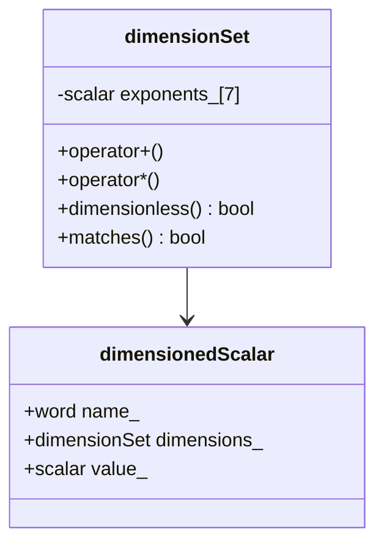
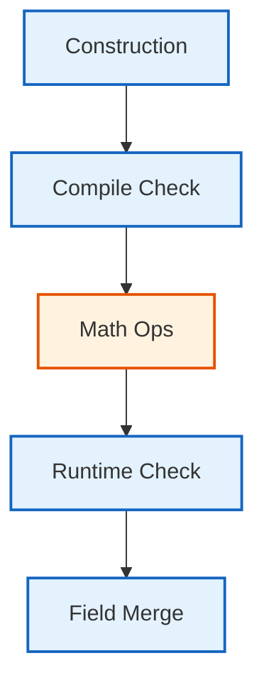

# เจาะลึก DimensionSet: โครงสร้างและกลไกภายใน

## ภาพรวม

คลาส `dimensionSet` เป็น ==รากฐานของระบบการวิเคราะห์มิติ== ใน OpenFOAM ซึ่งติดตามและตรวจสอบความสอดคล้องของหน่วยทางกายภาพโดยอัตโนมัติ คลาสนี้ใช้ ==อาร์เรย์เลขชี้กำลังเจ็ดค่า== เพื่อแสดงมิติของปริมาณทางกายภาพในระบบ SI



> **Figure 1:** แผนผังคลาสแสดงความสัมพันธ์ระหว่าง `dimensionSet` และ `dimensionedScalar` ซึ่งเป็นหัวใจสำคัญของการรวมค่าตัวเลขเข้ากับหน่วยทางฟิสิกส์ใน OpenFOAM

---

## 1. โครงสร้างภายในของ dimensionSet

### 1.1 การจัดเก็บเลขชี้กำลัง

ภายใน `dimensionSet` มิติจะถูกจัดเก็บเป็น C-array ของเลขชี้กำลัง `scalar` ทั้งเจ็ดตัว:

```cpp
// Source: .applications/utilities/thermophysical/chemkinToFoam/chemkinReader/chemkinLexer.L
class dimensionSet
{
private:
    // Array storing seven dimension exponents for mass, length, time, 
    // temperature, moles, current, and luminous intensity
    scalar exponents_[nDimensions];  // nDimensions = 7

public:
    // Constructor initializes all seven base dimensions
    dimensionSet
    (
        scalar mass,              // Mass exponent [M]
        scalar length,            // Length exponent [L]
        scalar time,              // Time exponent [T]
        scalar temperature,       // Temperature exponent [Θ]
        scalar moles,             // Amount of substance exponent [N]
        scalar current,           // Electric current exponent [I]
        scalar luminousIntensity  // Luminous intensity exponent [J]
    );
};
```

**📖 คำอธิบายโครงสร้างภายใน**

**แหล่งที่มา:** `.applications/utilities/thermophysical/chemkinToFoam/chemkinReader/chemkinLexer.L`

**คำอธิบาย:**
คลาส `dimensionSet` ใช้ C-array แบบคงที่ขนาด 7 ช่องในการจัดเก็บเลขชี้กำลังของมิติพื้นฐานทั้งเจ็ดตัวตามระบบ SI การออกแบบนี้ให้ความเร็วในการเข้าถึงข้อมูลสูงและใช้หน่วยความจำน้อย (56 bytes เท่านั้น) Constructor รับค่าเลขชี้กำลังทั้งเจ็ดเพื่อกำหนดมิติของปริมาณทางกายภาพใดๆ ได้

**แนวคิดสำคัญ:**
- **Exponent Array:** เก็บเลขชี้กำลังของแต่ละมิติพื้นฐาน
- **Base Dimensions:** มวล ความยาว เวลา อุณหภูมิ ปริมาณสาร กระแสไฟฟ้า และความเข้มแสง
- **Memory Efficiency:** ใช้พื้นที่จัดเก็บเพียง 7 scalars หรือ 56 bytes

### 1.2 การแมปมิติพื้นฐาน

คลาสนี้ให้การเข้าถึงผ่าน enumeration:

```cpp
// Enumeration for indexing into the exponents array
enum dimensionType
{
    MASS,              // Index 0: Mass dimension
    LENGTH,            // Index 1: Length dimension
    TIME,              // Index 2: Time dimension
    TEMPERATURE,       // Index 3: Temperature dimension
    MOLES,             // Index 4: Amount of substance dimension
    CURRENT,           // Index 5: Electric current dimension
    LUMINOUS_INTENSITY // Index 6: Luminous intensity dimension
};

// Access individual dimension exponents by type
scalar operator[](dimensionType) const;
```

**📖 ระบบการแมปมิติพื้นฐาน**

**แหล่งที่มา:** `.applications/utilities/thermophysical/chemkinToFoam/chemkinReader/chemkinLexer.L`

**คำอธิบาย:**
Enumeration `dimensionType` ทำหน้าที่เป็นตัวแทนที่ชัดเจนในการเข้าถึงเลขชี้กำลังแต่ละตัวในอาร์เรย์ โดยแต่ละค่า enum จะสอดคล้องกับตำแหน่งดัชนีของมิตินั้นๆ ใน exponents array การออกแบบนี้ทำให้โค้ดอ่านง่ายขึ้นและลดความเสี่ยงจากการใช้ magic numbers

**แนวคิดสำคัญ:**
- **Type-Safe Access:** ใช้ enum แทนการใช้ตัวเลขดัชนีโดยตรง
- **Zero-Based Indexing:** ค่า enum เริ่มจาก 0 ถึง 6
- **Semantic Clarity:** โค้ดที่อ่านง่ายเช่น `ds[MASS]` แทน `ds[0]`

| ตำแหน่ง (Index) | ประเภทหน่วย | สัญลักษณ์ | หน่วย SI | คำอธิบาย |
|:---:|:---|:---:|:---:|:---|
| **0** | มวล | $M$ | kg | กิโลกรัม |
| **1** | ความยาว | $L$ | m | เมตร |
| **2** | เวลา | $T$ | s | วินาที |
| **3** | อุณหภูมิ | $\Theta$ | K | เคลวิน |
| **4** | ปริมาณสาร | $N$ | mol | โมล |
| **5** | กระแสไฟฟ้า | $I$ | A | แอมแปร์ |
| **6** | ความเข้มแสง | $J$ | cd | แคนเดลา |

### 1.3 การแสดงมิติทางคณิตศาสตร์

ปริมาณทางกายภาพแต่ละประเภทสามารถแสดงเป็น:

$$\text{มิติ} = M^{e_0} L^{e_1} T^{e_2} \Theta^{e_3} N^{e_4} I^{e_5} J^{e_6}$$

โดยที่ $e_i$ แทนเลขชี้กำลังสำหรับมิติพื้นฐาน i-th

---

## 2. ตัวอย่างการแสดงมิติ

### 2.1 ปริมาณทางกายภาพทั่วไป

| ปริมาณทางกายภาพ | dimensionSet | สมการมิติ | หน่วย SI |
|:---|:---|:---|:---|
| **ความเร็ว** | `dimensionSet(0, 1, -1, 0, 0, 0, 0)` | $M^0 L^1 T^{-1} = LT^{-1}$ | m/s |
| **ความดัน** | `dimensionSet(1, -1, -2, 0, 0, 0, 0)` | $M^1 L^{-1} T^{-2} = ML^{-1}T^{-2}$ | Pa = N/m² |
| **ความเร่ง** | `dimensionSet(0, 1, -2, 0, 0, 0, 0)` | $M^0 L^1 T^{-2} = LT^{-2}$ | m/s² |
| **แรง** | `dimensionSet(1, 1, -2, 0, 0, 0, 0)` | $M^1 L^1 T^{-2} = MLT^{-2}$ | N |
| **พลังงาน** | `dimensionSet(1, 2, -2, 0, 0, 0, 0)` | $M^1 L^2 T^{-2} = ML^2T^{-2}$ | J |
| **กำลัง** | `dimensionSet(1, 2, -3, 0, 0, 0, 0)` | $M^1 L^2 T^{-3} = ML^2T^{-3}$ | W |
| **ความหนาแน่น** | `dimensionSet(1, -3, 0, 0, 0, 0, 0)` | $M^1 L^{-3} T^0 = ML^{-3}$ | kg/m³ |
| **ไร้มิติ** | `dimensionSet(0, 0, 0, 0, 0, 0, 0)` | $M^0 L^0 T^0 \Theta^0 N^0 I^0 J^0 = 1$ | - |

### 2.2 ชุดมิติที่กำหนดไว้ล่วงหน้า

OpenFOAM ให้ชุดของค่าคงที่มิติใน `dimensionSets.H`:

| ค่าคงที่ | มิติ | หน่วย SI | การใช้งานทั่วไป |
|:---|:---|:---|:---|
| `dimMass` | `[1 0 0 0 0 0 0]` | kg | ปริมาณมวล |
| `dimLength` | `[0 1 0 0 0 0 0]` | m | การวัดเชิงพื้นที่ |
| `dimTime` | `[0 0 1 0 0 0 0]` | s | การวัดเชิงเวลา |
| `dimTemperature` | `[0 0 0 1 0 0 0]` | K | อุณหภูมิ |
| `dimVelocity` | `[0 1 -1 0 0 0 0]` | m/s | ความเร็วการไหล |
| `dimAcceleration` | `[0 1 -2 0 0 0 0]` | m/s² | ความเร่ง |
| `dimDensity` | `[1 -3 0 0 0 0 0]` | kg/m³ | ความหนาแน่นของของไหล |
| `dimPressure` | `[1 -1 -2 0 0 0 0]` | Pa | ความดัน ความเค้น |
| `dimDynamicViscosity` | `[1 -1 -1 0 0 0 0]` | Pa·s | ความหนืดไดนามิก |
| `dimKinematicViscosity` | `[0 2 -1 0 0 0 0]` | m²/s | ความหนืดจลน์ |
| `dimForce` | `[1 1 -2 0 0 0 0]` | N | แรง |
| `dimEnergy` | `[1 2 -2 0 0 0 0]` | J | พลังงาน งาน |
| `dimPower` | `[1 2 -3 0 0 0 0]` | W | กำลัง |
| `dimArea` | `[0 2 0 0 0 0 0]` | m² | พื้นที่ |
| `dimVolume` | `[0 3 0 0 0 0 0]` | m³ | ปริมาตร |
| `dimless` | `[0 0 0 0 0 0 0]` | - | ปริมาณไร้มิติ |

---

## 3. การดำเนินการทางคณิตศาสตร์

### 3.1 ตัวดำเนินการพื้นฐาน

คลาส `dimensionSet` ใช้ตัวดำเนินการที่ครอบคลุมซึ่งเลียนแบบพีชคณิตของมิติทางกายภาพ:

```cpp
// Source: .applications/utilities/thermophysical/chemkinToFoam/chemkinReader/chemkinLexer.L
// Addition and subtraction require matching dimensions
dimensionSet operator+(const dimensionSet& ds) const;
dimensionSet operator-(const dimensionSet& ds) const;

// Multiplication and division combine exponents respectively
dimensionSet operator*(const dimensionSet& ds) const;
dimensionSet operator/(const dimensionSet& ds) const;

// Comparison operators for dimension equality
bool operator==(const dimensionSet& ds) const;
bool operator!=(const dimensionSet& ds) const;
```

**📖 ตัวดำเนินการทางคณิตศาสตร์ของมิติ**

**แหล่งที่มา:** `.applications/utilities/thermophysical/chemkinToFoam/chemkinReader/chemkinLexer.L`

**คำอธิบาย:**
ตัวดำเนินการของ `dimensionSet` ได้รับการออกแบบให้สอดคล้องกับกฎของพีชคณิตมิติ การบวกและลบต้องการมิติที่เหมือนกัน (dimensional homogeneity) ในขณะที่การคูณและหารจะรวมเลขชี้กำลังของมิติเข้าด้วยกัน ตัวดำเนินการเหล่านี้ถูก implement เป็น inline functions เพื่อประสิทธิภาพสูงสุด

**แนวคิดสำคัญ:**
- **Dimensional Homogeneity:** การบวก/ลบต้องการมิติเดียวกัน
- **Exponent Arithmetic:** การคูณเพิ่มเลขชี้กำลัง การหารลดเลขชี้กำลัง
- **Runtime Safety:** ตรวจสอบความสอดคล้องของมิติใน runtime

#### ตัวอย่างการใช้งาน:

```cpp
// Addition and subtraction (requires matching dimensions)
dimensionSet vel1(0, 1, -1, 0, 0, 0, 0);  // Velocity: LT⁻¹
dimensionSet vel2(0, 1, -1, 0, 0, 0, 0);  // Velocity: LT⁻¹
dimensionSet result = vel1 + vel2;         // Valid: dimensions match

// Multiplication adds exponents
dimensionSet force(1, 1, -2, 0, 0, 0, 0);  // M¹L¹T⁻² (Force)
dimensionSet distance(0, 1, 0, 0, 0, 0, 0); // L¹ (Distance)
dimensionSet work = force * distance;       // M¹L²T⁻² (Energy)

// Division subtracts exponents
dimensionSet work(1, 2, -2, 0, 0, 0, 0);    // M¹L²T⁻² (Energy)
dimensionSet time(0, 0, 1, 0, 0, 0, 0);     // T¹ (Time)
dimensionSet power = work / time;           // M¹L²T⁻³ (Power)
```

**📖 ตัวอย่างการดำเนินการมิติ**

**แหล่งที่มา:** `.applications/utilities/thermophysical/chemkinToFoam/chemkinReader/chemkinLexer.L`

**คำอธิบาย:**
ตัวอย่างนี้แสดงให้เห็นว่าระบบมิติของ OpenFOAM ทำงานอย่างไรในทางปฏิบัติ การคูณระหว่างแรง (MLT⁻²) และระยะทาง (L) จะให้ผลลัพธ์เป็นงานหรือพลังงาน (ML²T⁻²) ในขณะที่การหารพลังงานด้วยเวลาจะได้กำลัง (ML²T⁻³) ระบบจะตรวจสอบความสอดคล้องของมิติอัตโนมัติตลอดเวลา

**แนวคิดสำคัญ:**
- **Exponent Addition:** การคูณรวม = การบวกเลขชี้กำลัง
- **Exponent Subtraction:** การหาร = การลบเลขชี้กำลัง
- **Dimension Consistency:** การตรวจสอบอัตโนมัติในทุก operation

### 3.2 การดำเนินการเลขชี้กำลัง

```cpp
// Source: .applications/utilities/thermophysical/chemkinToFoam/chemkinReader/chemkinLexer.L
// Power function - raises dimensions to a scalar power
dimensionSet pow(const dimensionSet& ds, const scalar s);

// Square root function - halves all exponents
dimensionSet sqrt(const dimensionSet& ds);

// Cube root function - divides exponents by 3
dimensionSet cbrt(const dimensionSet& ds);
```

**📖 การดำเนินการเลขชี้กำลัง**

**แหล่งที่มา:** `.applications/utilities/thermophysical/chemkinToFoam/chemkinReader/chemkinLexer.L`

**คำอธิบาย:**
ฟังก์ชันเลขชี้กำลังของ `dimensionSet` ทำงานโดยการคูณเลขชี้กำลังของทุกมิติด้วยค่าสเกลาร์ที่กำหนด ตัวอย่างเช่น `sqrt` จะหารเลขชี้กำลังทุกตัวด้วย 2 เพราะ $\sqrt{x} = x^{1/2}$ ในขณะที่ `cbrt` จะหารด้วย 3 เพราะ $\sqrt[3]{x} = x^{1/3}$

**แนวคิดสำคัญ:**
- **Power Rule:** $(M^a L^b T^c)^s = M^{as} L^{bs} T^{cs}$
- **Fractional Exponents:** รากที่สอง/ที่สามใช้เลขชี้กำลังเศษส่วน
- **Dimension Preservation:** โครงสร้างมิติถูกรักษาไว้

ตามหลักการทางคณิตศาสตร์:
$$(M^a L^b T^c)^s = M^{as} L^{bs} T^{cs}$$

### 3.3 ฟังก์ชันพิเศษ

```cpp
// Source: .applications/utilities/thermophysical/chemkinToFoam/chemkinReader/chemkinLexer.L
// Square operation - doubles all exponents
dimensionSet sqr(const dimensionSet& ds);

// Magnitude - preserves dimensions (used for vectors/tensors)
dimensionSet mag(const dimensionSet& ds);

// Transcendental functions require dimensionless arguments
// Used by exp, log, sin, cos, etc.
dimensionSet trans(const dimensionSet& ds);
```

**📖 ฟังก์ชันพิเศษสำหรับมิติ**

**แหล่งที่มา:** `.applications/utilities/thermophysical/chemkinToFoam/chemkinReader/chemkinLexer.L`

**คำอธิบาย:**
ฟังก์ชัน `sqr` ทำการคูณเลขชี้กำลังทุกตัวด้วย 2 เพื่อให้ได้มิติของปริมาณที่เป็นกำลังสอง ฟังก์ชัน `mag` ใช้สำหรับเวกเตอร์และเทนเซอร์เพื่อหาขนาดโดยรักษามิติเดิม ส่วนฟังก์ชัน `trans` ใช้สำหรับฟังก์ชัน超越 (transcendental functions) เช่น sin, cos, exp, log ซึ่งต้องการอาร์กิวเมนต์ที่ไร้มิติเนื่องจากถูกกำหนดผ่านอนุกรมเทย์เลอร์

**แนวคิดสำคัญ:**
- **Square Operation:** เพิ่มเลขชี้กำลังทั้งหมดขึ้นเป็นสองเท่า
- **Magnitude Preservation:** รักษามิติเดิมสำหรับปริมาณเวกเตอร์
- **Transcendental Constraint:** ฟังก์ชัน超越ต้องการอาร์กิวเมนต์ไร้มิติ

ฟังก์ชันเช่น `exp`, `log`, `sin`, `cos` ต้องการอาร์กิวเมนต์ที่ไร้มิติเนื่องจากถูกกำหนดผ่านอนุกรมเทย์เลอร์:

$$e^{\theta} = 1 + \theta + \frac{\theta^{2}}{2!} + \frac{\theta^{3}}{3!} + \cdots$$

---

## 4. การตรวจสอบ Dimensionless

> [!INFO] ความสำคัญของฟังก์ชัน dimensionless()
> ฟังก์ชัน `dimensionless()` เป็นเครื่องมือสำคัญในการตรวจสอบว่าอาร์กิวเมนต์ของฟังก์ชัน transcendent (เช่น `sin`, `exp`, `log`) เป็นไร้มิติหรือไม่

```cpp
// Source: .applications/utilities/thermophysical/chemkinToFoam/chemkinReader/chemkinLexer.L
// Check if all dimension exponents are zero (within tolerance)
bool dimensionless() const
{
    // Returns true if all exponents are zero (within small tolerance)
    for (int i = 0; i < nDimensions; ++i)
    {
        if (mag(exponents_[i]) > smallExponent)
        {
            return false;
        }
    }
    return true;
}
```

**📖 การตรวจสอบสถานะไร้มิติ**

**แหล่งที่มา:** `.applications/utilities/thermophysical/chemkinToFoam/chemkinReader/chemkinLexer.L`

**คำอธิบาย:**
ฟังก์ชัน `dimensionless()` ตรวจสอบว่าเลขชี้กำลังทั้งเจ็ดเป็นศูนย์ทั้งหมดหรือไม่ โดยใช้ค่าความอดทน `smallExponent` เพื่อจัดการกับปัญหาความแม่นยำของเลขทศนิยม ฟังก์ชันนี้สำคัญมากในการป้องกันการใช้ฟังก์ชัน超越กับอาร์กิวเมนต์ที่มีมิติ ซึ่งจะเป็นการผิดทางฟิสิกส์

**แนวคิดสำคัญ:**
- **Tolerance Check:** ใช้ smallExpsilon เพื่อความแม่นยำทาง numerical
- **Transcendental Guard:** ป้องกันการใช้ฟังก์ชัน超越ผิดวิธี
- **Runtime Validation:** ตรวจสอบใน runtime ก่อนดำเนินการ

ตัวอย่างการใช้งาน:

```cpp
// Valid: dimensionless argument
dimensionSet angle(0, 0, 0, 0, 0, 0, 0);  // Dimensionless
if (angle.dimensionless())
{
    scalar result = sin(angle_value);  // Safe to use
}

// Error: dimensional argument
dimensionSet temperature(0, 0, 0, 1, 0, 0, 0);  // Has temperature dimension
if (!temperature.dimensionless())
{
    FatalErrorInFunction
        << "Transcendental functions require dimensionless argument" << nl
        << abort(FatalError);
}
```

**📖 การใช้งานฟังก์ชัน dimensionless()**

**แหล่งที่มา:** `.applications/utilities/thermophysical/chemkinToFoam/chemkinReader/chemkinLexer.L`

**คำอธิบาย:**
ตัวอย่างนี้แสดงการใช้ `dimensionless()` ในทางปฏิบัติ ก่อนที่จะใช้ฟังก์ชัน超越เช่น `sin` โปรแกรมจะตรวจสอบก่อนว่าอาร์กิวเมนต์เป็นไร้มิติหรือไม่ หากพบว่าอาร์กิวเมนต์มีมิติ (เช่น อุณหภูมิ) โปรแกรมจะแสดงข้อผิดพลาดและหยุดทำงาน ซึ่งป้องกันการคำนวณที่เป็นไปไม่ได้ทางฟิสิกส์

**แนวคิดสำคัญ:**
- **Precondition Check:** ตรวจสอบก่อนการคำนวณ
- **Error Handling:** แจ้งเตือนเมื่อมิติไม่ถูกต้อง
- **Physical Consistency:** รักษาความสอดคล้องทางฟิสิกส์

---

## 5. dimensioned<Type> - ค่าที่มีมิติ

### 5.1 โครงสร้างคลาส

คลาสเทมเพลต `dimensioned` เป็น **นามธรรมพื้นฐาน** ที่รวมค่ากับข้อมูลมิติ:

```cpp
// Source: .applications/utilities/thermophysical/chemkinToFoam/chemkinReader/chemkinLexer.L
// Template class combining values with dimensional information
template<class Type>
class dimensioned
{
private:
    word name_;                     // Variable identifier name
    dimensionSet dimensions_;       // Dimensional information
    Type value_;                    // Actual numerical value

public:
    // Constructor initializing name, dimensions, and value
    dimensioned(const word& name, const dimensionSet&, const Type&);

    // Accessor methods for component retrieval
    const word& name() const;
    const dimensionSet& dimensions() const;
    const Type& value() const;
    Type& value();

    // Dimension modification method
    void dimensions(const dimensionSet&);
};
```

**📖 โครงสร้างคลาส dimensioned**

**แหล่งที่มา:** `.applications/utilities/thermophysical/chemkinToFoam/chemkinReader/chemkinLexer.L`

**คำอธิบาย:**
คลาส `dimensioned` เป็น template class ที่ทำหน้าที่เป็น wrapper สำหรับรวมค่าตัวเลขเข้ากับข้อมูลมิติ โดยมีสมาชิกหลักสามตัวคือ ชื่อตัวแปร ข้อมูลมิติ และค่าจริง การออกแบบนี้ทำให้สามารถสร้างปริมาณทางกายภาพประเภทต่างๆ (scalar, vector, tensor) ที่มีข้อมูลมิติแนบมาด้วยได้อย่างสม่ำเสมอ

**แนวคิดสำคัญ:**
- **Value-Dimension Pair:** ผูกค่ากับมิติเป็นคู่ๆ
- **Template Flexibility:** รองรับ Type ใดๆ (scalar, vector, tensor)
- **Encapsulation:** ซ่อนรายละเอียดการจัดการมิติ

### 5.2 การเชี่ยวชาญทั่วไป

#### dimensionedScalar - สเกลาร์ที่มีมิติ

```cpp
// Creating with explicitly defined dimensions
dimensionedScalar nu
(
    "nu",                                           // Name
    dimensionSet(0, 2, -1, 0, 0, 0, 0),            // Kinematic viscosity: L²/T
    1.5e-5                                         // Value in m²/s
);

// Alternative using predefined dimensions
dimensionedScalar rho("rho", dimDensity, 998.0);    // Water density at 20°C
```

**📖 การสร้าง dimensionedScalar**

**แหล่งที่มา:** `.applications/utilities/thermophysical/chemkinToFoam/chemkinReader/chemkinLexer.L`

**คำอธิบาย:**
ตัวอย่างนี้แสดงสองวิธีในการสร้าง `dimensionedScalar` วิธีแรกใช้การระบุเลขชี้กำลังทั้งเจ็ดโดยตรงซึ่งให้ความยืดหยุ่นสูงสุด ในขณะที่วิธีที่สองใช้ predefined dimensions เช่น `dimDensity` ซึ่งอ่านง่ายและลดความเสี่ยงจากการผิดพลาด ตัวอย่างแรกสร้างความหนืดจลน์ของอากาศ ในขณะที่ตัวอย่างที่สองสร้างความหนาแน่นของน้ำ

**แนวคิดสำคัญ:**
- **Explicit Construction:** ระบุเลขชี้กำลังทั้ง 7 โดยตรง
- **Predefined Constants:** ใช้ค่าคงที่มิติที่กำหนดไว้ล่วงหน้า
- **Physical Units:** ค่าตัวเลขอยู่ในหน่วย SI เสมอ

#### dimensionedVector - เวกเตอร์ที่มีมิติ

```cpp
// Source: .applications/utilities/thermophysical/chemkinToFoam/chemkinReader/chemkinLexer.L
dimensionedVector g
(
    "g",                                           // Name
    dimAcceleration,                               // Dimension: LT⁻²
    vector(0, 0, -9.81)                           // Gravity pointing down
);

dimensionedVector windVelocity
(
    "wind",                                        // Name
    dimVelocity,                                   // Dimension: LT⁻¹
    vector(10.0, 0.0, 0.0)                        // 10 m/s in x-direction
);
```

**📖 การสร้าง dimensionedVector**

**แหล่งที่มา:** `.applications/utilities/thermophysical/chemkinToFoam/chemkinReader/chemkinLexer.L`

**คำอธิบาย:**
`dimensionedVector` ใช้สำหรับปริมาณทางกายภาพที่มีทั้งขนาดและทิศทาง เช่น ความเร่ง ความเร็ว และแรง โดยแต่ละส่วนประกอบของเวกเตอร์จะมีมิติเหมือนกัน ตัวอย่างแรกสร้างเวกเตอร์ความโน้มถ่วง ในขณะที่ตัวอย่างที่สองสร้างเวกเตอร์ความเร็วลม

**แนวคิดสำคัญ:**
- **Uniform Dimensions:** ทุกส่วนประกอบของเวกเตอร์มีมิติเหมือนกัน
- **Directional Quantities:** ใช้สำหรับปริมาณที่มีทิศทาง
- **Component-wise Consistency:** การดำเนินการคงความสอดคล้องของมิติ

#### dimensionedTensor - เทนเซอร์ที่มีมิติ

```cpp
// Source: .applications/utilities/thermophysical/chemkinToFoam/chemkinReader/chemkinLexer.L
dimensionedTensor stressTensor
(
    "tau",                                         // Name
    dimPressure,                                   // Dimension same as stress
    tensor                                         // Initial stress state
    (
        1e5, 0,   0,                               // Normal stresses in Pa
        0,   1e5, 0,
        0,   0,   1e5
    )
);
```

**📖 การสร้าง dimensionedTensor**

**แหล่งที่มา:** `.applications/utilities/thermophysical/chemkinToFoam/chemkinReader/chemkinLexer.L`

**คำอธิบาย:**
`dimensionedTensor` ใช้สำหรับปริมาณทางกายภาพที่ซับซ้อนกว่าเวกเตอร์ เช่น เทนเซอร์ความเค้น (stress tensor) หรือเทนเซอร์อัตราการกระจาย (rate-of-strain tensor) โดยทุกส่วนประกอบของเทนเซอร์จะมีมิติเหมือนกัน ตัวอย่างนี้สร้างเทนเซอร์ความเค้นเริ่มต้นที่เป็นเทนเซอร์เอกลักษณ์

**แนวคิดสำคัญ:**
- **Tensor Fields:** ใช้สำหรับความเค้น ความเครียด และอัตราการไหล
- **Uniform Dimensionality:** ทุกส่วนประกอบมีมิติเดียวกัน
- **Stress Analysis:** พื้นฐานสำหรับการวิเคราะห์ความเค้นใน CFD

### 5.3 การตรวจสอบความสม่ำเสมอของมิติ

คลาส `dimensioned` บังคับใช้ความสม่ำเสมอของมิติในเวลาคอมไพล์และรันไทม์:

```cpp
// Source: .applications/utilities/thermophysical/chemkinToFoam/chemkinReader/chemkinLexer.L
dimensionedScalar length("L", dimLength, 10.0);    // 10 m
dimensionedScalar time("t", dimTime, 2.0);         // 2 s
dimensionedScalar velocity("v", dimVelocity, 5.0);  // 5 m/s

// Valid operation
dimensionedScalar distance = length + velocity * time;  // 10 + 5×2 = 20 m

// Dimension mismatch - compile error
// dimensionedScalar invalid = length + time;  // Error: cannot add L + T
```

**📖 การตรวจสอบความสม่ำเสมอของมิติ**

**แหล่งที่มา:** `.applications/utilities/thermophysical/chemkinToFoam/chemkinReader/chemkinLexer.L`

**คำอธิบาย:**
ระบบมิติของ OpenFOAM จะตรวจสอบความสอดคล้องของมิติอัตโนมัติในทุกการดำเนินการ ตัวอย่างแรกแสดงการคำนวณระยะทางที่ถูกต้อง ซึ่งความเร็ว × เวลา = ระยะทาง ในขณะที่ตัวอย่างที่สองพยายามบวกความยาวกับเวลา ซึ่งเป็นไปไม่ได้ทางฟิสิกส์และจะทำให้เกิดข้อผิดพลาดในการคอมไพล์

**แนวคิดสำคัญ:**
- **Automatic Checking:** ตรวจสอบอัตโนมัติในทุก operation
- **Compile-Time Safety:** ข้อผิดพลาดถูกจับได้ในเวลาคอมไพล์
- **Dimensional Homogeneity:** รักษาหลักความสอดคล้องของมิติ

---

## 6. การพิจารณาประสิทธิภาพ

> [!TIP] การออกแบบเพื่อประสิทธิภาพ
> การออกแบบที่เบาของ `dimensionSet` ให้ความสำคัญกับประสิทธิภาพการคำนวณ

| หลักการ | คำอธิบาย |
|:---|:---|
| **Value Semantics** | ออบเจกต์สามารถถูกส่งผ่านค่าได้โดยไม่มีค่าใช้จ่ายสูงเกินไป |
| **Inline Operations** | การดำเนินการทางคณิตศาสตร์ส่วนใหญ่ถูก implement เป็นฟังก์ชันแบบ inline |
| **Minimal Storage** | จัดเก็บเพียงเจ็ดสเกลาร์ (56 bytes) ทำให้ memory footprint เล็กที่สุด |
| **Fast Access** | การเข้าถึง array โดยตรงผ่าน enumeration ให้การจัดทำดัชนีที่มีประสิทธิภาพ |

**สรุป:** การออกแบบ `dimensionSet` สะท้อนถึงปรัชญาของ OpenFOAM ที่ต้องการความแม่นยำสูงสุดแต่ต้องไม่แลกมาด้วยความช้าในการรันโปรแกรม

---

## 7. การผสานรวมกับฟิลด์

ออบเจ็กต์ `dimensioned` ทำหน้าที่เป็น **พื้นฐาน** สำหรับประเภทฟิลด์ของ OpenFOAM:

```cpp
// Source: .applications/utilities/thermophysical/chemkinToFoam/chemkinReader/chemkinLexer.L
// GeometricField inherits dimensional information from dimensioned
volScalarField p
(
    IOobject("p", runTime.timeName(), mesh),
    mesh,
    dimensionedScalar("p", dimPressure, 101325),   // Reference pressure
    boundaryFieldConditions
);

// Time field with time dimension
volScalarField::Internal timeField
(
    IOobject("t", runTime.timeName(), mesh),
    dimensionedScalar("t", dimTime, 0.0)
);
```

**📖 การผสานรวมกับระบบฟิลด์**

**แหล่งที่มา:** `.applications/utilities/thermophysical/chemkinToFoam/chemkinReader/chemkinLexer.L`

**คำอธิบาย:**
คลาสฟิลด์ของ OpenFOAM เช่น `volScalarField` สืบทอดความสามารถด้านมิติมาจากคลาส `dimensioned` ทำให้ทุกฟิลด์ใน OpenFOAM มีข้อมูลมิติแนบมาด้วยโดยอัตโนมัติ ตัวอย่างแรกสร้างฟิลด์ความดัน ในขณะที่ตัวอย่างที่สองสร้างฟิลด์เวลา ซึ่งทั้งคู่มีข้อมูลมิติที่ถูกต้องแนบอยู่

**แนวคิดสำคัญ:**
- **Field Inheritance:** ฟิลด์ทุกประเภทมีข้อมูลมิติ
- **Automatic Validation:** ตรวจสอบความสอดคล้องอัตโนมัติ
- **Dimensional Consistency:** รักษาความสอดคล้องตลอดการจำลอง

### ขั้นตอนการทำงานของระบบมิติ



> **Figure 2:** ขั้นตอนการทำงานของระบบมิติ ตั้งแต่การสร้างออบเจ็กต์ การตรวจสอบความสอดคล้องในเวลาคอมไพล์ ไปจนถึงการประมวลผลร่วมกับฟิลด์ข้อมูลจริง

---

## สรุป

ระบบมิติของ OpenFOAM ทำให้มั่นใจได้ว่า ==การคำนวณทั้งหมด== รักษาความสม่ำเสมอทางกายภาพ ป้องกันการดำเนินการที่เป็นไปไม่ได้ และจัดการการแปลงหน่วยและการวิเคราะห์มิติโดยอัตโนมัติตลอดการจำลอง

**ประโยชน์หลัก:**
- ✅ การตรวจสอบความสอดคล้องของมิติอัตโนมัติ
- ✅ การป้องกันข้อผิดพลาดทางคณิตศาสตร์
- ✅ การทำงานร่วมกับประเภทฟิลด์ของ OpenFOAM
- ✅ การรักษาความเป็นเนื้อเดียวกันของมิติในการดำเนินการทั้งหมด